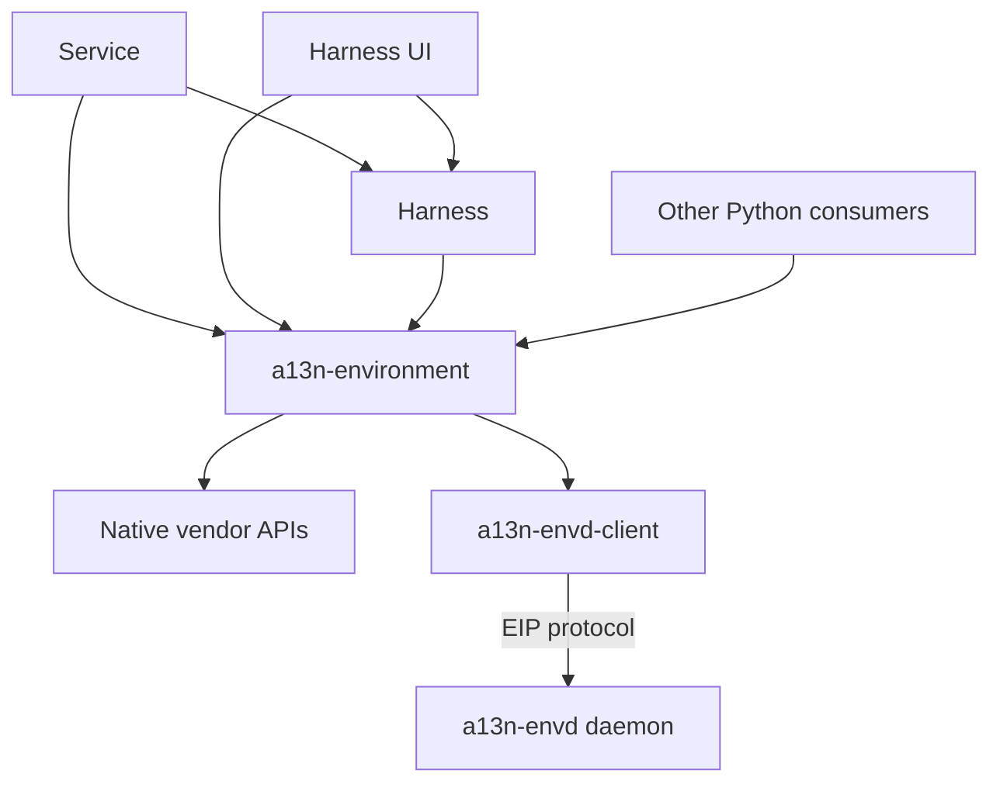
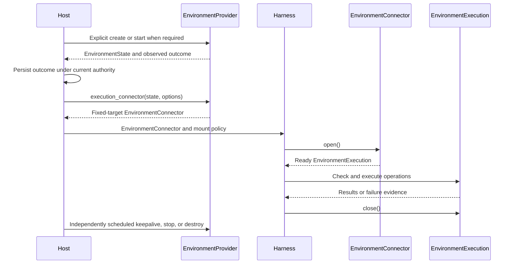

# Environment Architecture

## Design Position

`a13n-environment` is a Python capability library for operating one environment. Its source lives in `packages/a13n-environment/a13n_environment`, with distribution name `a13n-environment` and import namespace `a13n_environment`. Environment Provider definitions and implementations live in this package. Each Provider supplies backend management, Environment connectors, and Environment executions as applicable, with separate responsibilities for target lifecycle and operation access.

| Layer                      | Responsibility                                                                                                                                       |
| -------------------------- | ---------------------------------------------------------------------------------------------------------------------------------------------------- |
| Environment library        | Single-target contracts, typed state/results/errors, management primitives, execution connections, vendor operations, and cleanup of owned resources |
| Service                    | Authorization, durable instance state, operation leases, active-use coordination, renewal scheduling, and retirement policy                          |
| Harness                    | Opening and closing Environment execution scopes, Run-local mounts, paths, permissions, tools, events, and model context                             |
| Harness UI and other Hosts | Their own selection, state storage, lifecycle policy, and composition without requiring Service                                                      |

The library has no Agent loop, model tools, mount identity, database, global scheduler, or general lifecycle orchestration framework. Its management API performs explicit operations; consumers decide when and under which authority to call them.

## Dependencies

The shared package imports neither Harness nor its Hosts. Provider metadata and public contracts load without importing optional vendor SDKs. Environment-owned configuration, authentication metadata, errors, and transport contracts are usable without Harness; Harness-specific plugin selection and endpoint policies enter through Host composition. Other Provider domains remain under the [Harness Provider subsystem](../a13n-harness/22-provider-subsystem.md).

Envd-backed Environment Providers implement Environment connectors and Environment executions over `a13n-envd-client`. The client owns client-side EIP transport and Session behavior; the Envd daemon serves EIP and owns server-side execution resources. Native Environment Providers use local OS or vendor APIs without requiring Envd. Extraction preserves both operation routes and the EIP protocol. Source workspace and publication conventions follow the [Repository Model](../repository-model.md#repository-surfaces).

## Management and Execution

Each Provider implements management and execution with separate internal objects and construction paths. Common configuration, identity validation, and transport support do not carry both roles. Management and execution can run in different processes. The Host carries portable state between them, not a shared live client. An Environment connector can open only its selected target and has no target-management methods. Opening, checking, and reconnecting an Environment execution never create, resume, replace, or renew that target.

Opening a scope, completing a command, closing a scope, and retiring a target are separate outcomes. A Run ending does not authorize target destruction, and an execution connection does not guarantee continued target survival. [The shared contract](01-environment-contract.md) owns cancellation, uncertain outcomes, reconnection, and resource lifetime.
