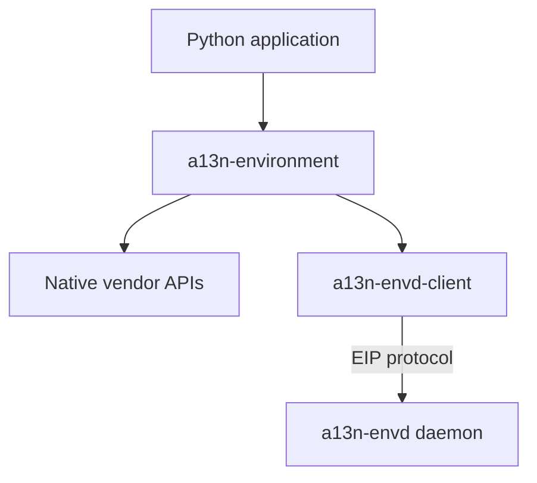
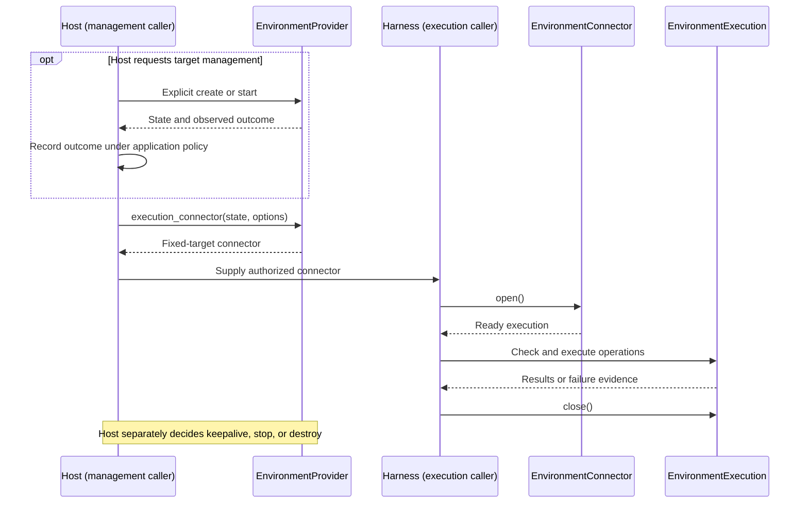

# Environment Architecture

## Design Position

`a13n-environment` is a Python capability library for operating one environment. Its source lives in `packages/a13n-environment/a13n_environment`, with distribution name `a13n-environment` and import namespace `a13n_environment`. Environment Provider definitions and implementations live in this package. Each Provider supplies backend management, Environment connectors, and Environment executions as applicable, with separate responsibilities for target lifecycle and operation access.

Host and Harness name caller roles in this subsystem. A Host selects targets and owns management policy; a Harness uses an execution scope and owns its use and cleanup. These roles do not require particular packages, classes, or separate processes. One Python application may perform both roles.

| Boundary               | Responsibility                                                                                                                                 |
| ---------------------- | ---------------------------------------------------------------------------------------------------------------------------------------------- |
| Environment library    | Single-target contracts, management primitives, execution connections, vendor operations, state/results/errors, and cleanup of owned resources |
| Host                   | Target selection, authorization, lifecycle timing, state storage, coordination across callers, and application policy                          |
| Harness                | Opening execution scopes, invoking permitted operations, coordinating in-flight work, and closing owned scopes                                 |
| Native backend or Envd | Actual target, process, filesystem, and Session behavior                                                                                       |

The library has no Agent loop, model tools, mount identity, database, global scheduler, or general lifecycle orchestration framework. Its management API performs explicit operations; consumers decide when and under which authority to call them.

## Dependencies

The package has no dependency on its consuming applications or an agent framework. Provider metadata and public contracts load without importing optional vendor SDKs. Callers supply validated configuration, credentials, and runtime collaborators through explicit interfaces; the package does not discover application configuration, databases, or lifecycle controllers.

Envd-backed Environment Providers implement Environment connectors and Environment executions over `a13n-envd-client`. The client owns client-side EIP transport and Session behavior; the Envd daemon serves EIP and owns server-side execution resources. Native Environment Providers use local OS or vendor APIs without requiring Envd. Extraction preserves both operation routes and the EIP protocol. Source workspace and publication conventions follow the [Repository Model](../repository-model.md#repository-surfaces).

## Management and Execution

Connect-only providers construct connectors directly. The Host decides whether and when management is needed; connector opening does not perform it. Management and execution may have different callers, coordinated through portable state rather than shared live clients.

Each Provider implements management and execution with separate internal objects and construction paths. Common configuration, identity validation, and transport support do not carry both roles. Management and execution can run in different processes. The caller carries portable state between them, not a shared live client. An Environment connector can open only its selected target and has no target-management methods. Opening, checking, and reconnecting an Environment execution never create, resume, replace, or renew that target.

Opening a scope, completing a command, closing a scope, and retiring a target are separate outcomes. An application task ending does not authorize target destruction, and an execution connection does not guarantee continued target survival. [The shared contract](01-environment-contract.md) owns cancellation, uncertain outcomes, reconnection, and resource lifetime.
