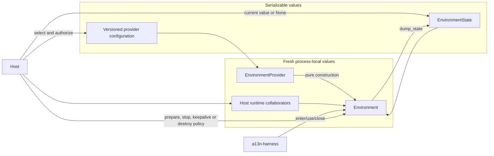
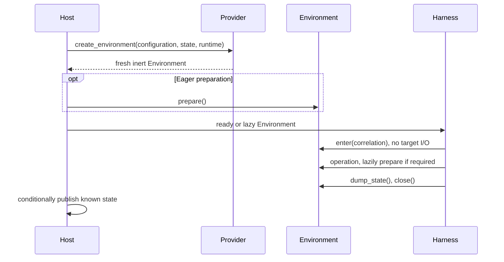
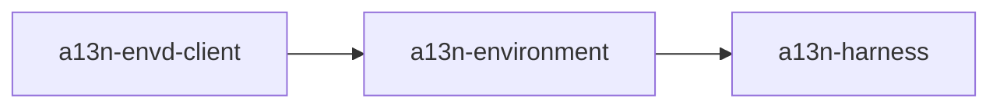

# Environment Provider Architecture

## Design Position

`a13n-environment` is the shared contract and built-in implementation package for one Environment. It separates inert provider selection from process-local operation and portable re-entry state.

The package has exactly three core Environment entities:

1. `EnvironmentProvider` is an inert trusted plugin/factory for one namespaced provider key.
2. `Environment` is a fresh process-local adapter that implements provider operations and re-entry lifecycle.
3. `EnvironmentState` is a provider-owned portable semantic soft reference.

A Provider validates configuration and constructs Environment instances without external I/O. A Provider implementation prepares its target and connections eagerly or on first operation. Its Environment binds a local Run scope, exposes file/shell/process/output/port operations, dumps current state, and closes local resources. Explicit Host policy invokes stop, keepalive and destruction.

## Architecture

Desired configuration and current state are independent. Configuration says what provider target is acceptable. State identifies the current target and codec version when the provider needs a portable reference. A stateless provider may return no state.

## Boundaries

| Concern                                           | Owner                                                   |
| ------------------------------------------------- | ------------------------------------------------------- |
| Namespaced Provider key and configuration         | Environment package and implementation                  |
| Provider discovery and trusted selection          | Package catalog and Host authorization                  |
| Fresh runtime collaborators and credentials       | Host                                                    |
| Environment construction                          | `EnvironmentProvider` without external I/O              |
| File, shell, process, output, and port I/O        | Entered `Environment`                                   |
| Create, resume, connect and confirmed replacement | Provider implementation through `Environment.prepare()` |
| Portable re-entry state                           | `EnvironmentState`; provider owns opaque payload codec  |
| Process-local cleanup                             | `Environment.close()`                                   |
| Backing-target destruction                        | Host policy invoking `Environment.destroy()`            |
| Durable state publication and Thread linkage      | Host                                                    |
| Multi-mount routing and Agent-facing policy       | Harness                                                 |
| Retention, unused cleanup, and orphan prune       | Host                                                    |

The package does not own Harness state aggregation, mount names, model-facing tools, Agent identity schemas, Thread relationships, durable records, queues, leases, user APIs, or product retention policy.

## Core Flow

For each independent Run:

1. The Host authorizes configuration, current state and runtime collaborators.
2. The Provider constructs a fresh Environment without I/O.
3. The Host selects preparation before execution or supplies coordinated lazy preparation.
4. Harness binds the local operation scope without target preparation.
5. The ready object serves operations; a lazy object prepares through Host coordination on first actual operation.
6. Known state changes publish through the Host independently of Harness checkpoints.
7. Harness closes the local scope without stopping or destroying the target.
8. The Host separately maintains, stops or deletes targets under its lifecycle policy.

## Re-entry Position

Preparation creates an unallocated target, resumes a compatible stopped target, reuses a running target, or rebuilds a confirmed-missing managed target under Host policy. Unknown existence and incompatible metadata fail without speculative creation. The Provider records known state immediately, including when later readiness fails. Stop preserves recoverable state; destruction clears the backing target. Close is always local and non-destructive.

## Operation Backends

The Provider package owns provider-neutral single-Environment contracts for:

- canonical paths and bounded file operations;
- foreground commands and provider process handles;
- retained stdout/stderr access;
- readiness requirements;
- provider ports;
- operation receipts and typed errors;
- state dump, local close, and explicit destruction.

Direct Local implements these contracts over the embedding operating system. Local Envd, Docker Envd, HTTP Envd and WebSocket Envd implement them through `a13n-envd` and EIP after provider-specific preparation. E2B implements them through its native asynchronous SDK and bounded command-local wrappers. Harness adds mount names, access ceilings, routing, stale-incarnation fencing, aggregate projection, and model Toolsets.

The [built-in matrix](03-built-in-providers.md#design-position) classifies six choices into Native and Envd routes. [Remote Envd](04-remote-envd.md) connects externally operated daemons without owning their infrastructure. Its reverse WebSocket SDK integrates accepted Host connections and starts no listener.

## Dependency and Release Direction

`a13n-environment` depends on `a13n-envd-client` and exposes Direct Local/EIP operation contracts and built-ins. `a13n-harness` depends on the Provider package. The Provider package never imports Harness.

The package belongs to the Harness release group under the [repository release contract](../repository-model.md). Provider configuration and state compatibility follow explicit schema and `state_version` values; resource selections do not lock Python implementation provenance.

## Security Position

- Provider discovery grants no authority. A Host allowlists keys and supplies trusted runtime collaborators.
- Configuration and state carry no credentials, clients, sessions, bearer URLs, process handles, or mutable authority objects.
- State is a selector, not authorization. Preparation revalidates provider key, codec version, configuration compatibility, and target metadata.
- Provider denial narrows Harness policy; Harness permission never bypasses provider enforcement.
- Direct Local is an explicit embedding trust choice and does not claim native sandbox isolation.
- Docker and E2B credentials remain in Host runtime collaborators; EIP credentials remain process-local.
- Public errors and observations redact provider-native secrets and unnecessary Host identifiers.

## Stable Principles

01. `EnvironmentProvider`, `Environment`, and `EnvironmentState` are the only shared Environment lifecycle entities.
02. Provider discovery, validation, and Environment construction perform no external I/O.
03. Every independent Run receives fresh Environment instances.
04. State is supplied before entry and is never a live object or existence proof.
05. Confirmed absence may create a replacement; unknown evidence fails.
06. `close()` and context exit are always non-destructive.
07. Only explicit Host policy invokes `destroy()`.
08. Harness owns multi-mount routing, not provider discovery or backing-target lifecycle.
09. Hosts own current state, Thread association, conditional publication, preparation timing, retention and prune without a prescribed persistence model.
10. Credentials and process-local clients never enter configuration, `EnvironmentState`, or Harness continuation.
