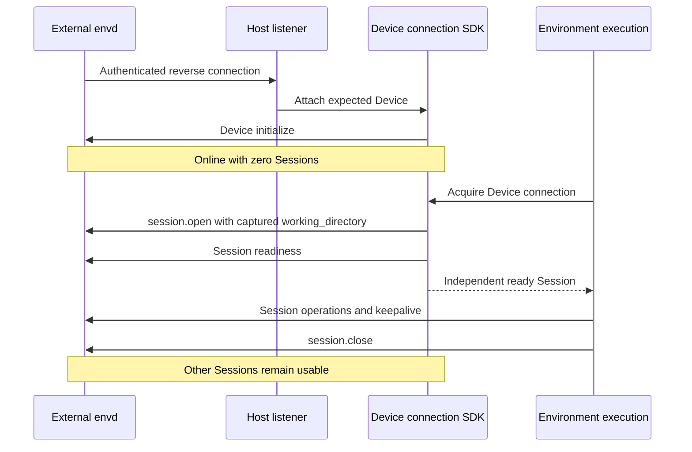

# Environment Providers

The [Environment Contract](01-environment-contract.md) owns management, connection, state, and execution boundaries. This document defines backend-specific guarantees.

## Built-in Providers

Eleven built-in Environment Provider definitions and implementations ship with `a13n-environment` across two operation routes. Built-ins use the same authoring contract as installed plugins.

| Route  | Type             | Backing target                              | Operation backend            | Lifecycle boundary                               |
| ------ | ---------------- | ------------------------------------------- | ---------------------------- | ------------------------------------------------ |
| Native | `direct_local`   | Existing Host directory                     | Local OS file/process APIs   | Caller-owned directory                           |
| Envd   | `local_envd`     | Local folders and a Host-owned daemon       | EIP over shared stdio        | Execution-owned Session; Host-owned daemon       |
| Native | `docker`         | Docker container                            | Docker Engine API            | Managed container; close preserves the target    |
| Native | `e2b`            | Native E2B sandbox                          | E2B SDK and bounded commands | Create, pause/resume, renew, and destroy         |
| Native | `daytona`        | Daytona sandbox                             | Toolbox commands             | Create, stop/start, and destroy                  |
| Native | `modal`          | Modal sandbox                               | Async SDK commands           | Create, filesystem snapshot stop/resume, destroy |
| Native | `vercel`         | Named Vercel Sandbox                        | Native command stream        | Create, stop/resume, renew, and destroy          |
| Native | `sprites`        | Persistent Fly.io Sprite                    | Native WebSocket exec        | Create, automatic sleep/wake, and destroy        |
| Native | `runloop`        | Runloop Devbox                              | Native commands              | Create, suspend/resume, keepalive, and shutdown  |
| Envd   | `http_envd`      | External daemon at a configured origin      | EIP over HTTP(S)             | Connect-only                                     |
| Envd   | `websocket_envd` | External daemon reverse-connected to a Host | EIP over accepted WebSocket  | Connect-only; Host-integrated SDK                |

Envd-backed Environment Providers use `a13n-envd-client` to perform file, shell, process, output, and port operations over EIP against an Envd daemon. Native Environment Providers implement these operations through local OS or vendor APIs without requiring Envd. No Provider emulates an unsupported operation through a different backend; unsupported operations fail explicitly.

Each definition projects a configured descriptor without target I/O; Environment connector opening validates the live descriptor before exposing execution operations. Harness intersects the operation families with the Run-local access ceiling. Stable environment identity is allocated by the Host per Environment and supplied at construction, never frozen into a reusable recipe; a Provider may retain its non-secret ownership correlation in state or labels to recover a dispatched creation.

### Direct Local

`direct_local` denotes access to an existing Host-controlled directory over the embedding operating system. Its recipe declares the root, optional shell profiles, allowed executables, environment-inheritance policy, allowed ports, and finite value, process, wall-time, buffer, and spool limits. The root, shell executables, and allowed executables are absolute after user expansion; profile IDs are unique. The root is always writable: a reference-only mount withholds write actions through the Harness permission ceiling, which the Provider cannot enforce against an allowed native process running under the embedding OS account. The account configuration is empty: the Host filesystem is the backend.

Text reads apply `max_value_bytes` to the actual UTF-8 page rather than the product of requested line count and line length, so a valid oversized request returns a shorter successful page. Pages end before the next whole line that would exceed the budget; `lines_read` counts returned source lines and `has_more` reports later lines. A single line that cannot fit an otherwise empty page returns its bounded UTF-8 prefix, preserves a trailing LF, and records the one-based source line number in `truncated_lines`; `has_more=false` therefore does not imply that a shortened line was complete. Invalid UTF-8 and NUL remain errors even in a discarded suffix.

Commands run on POSIX hosts and native Windows without WSL or a daemon. Each command owns a POSIX process group or a Windows Job Object, assigned before execution so descendants cannot escape ownership during startup. Root exit and complete tree cleanup are separate observations. The default `posix` dialect retains `-c` and optional login semantics; a `powershell` profile disallows login, passes an encoded command, and selects UTF-8 for redirected text. `inherit_environment` defaults to false; when enabled, each command copies the Host process environment at launch, removes `unset` keys, then overlays `set` values without mutating the Host or other commands. `allowed_environment_keys` gates explicit set and unset keys only and does not filter the inherited baseline; Windows key matching is case-insensitive. Environment values stay runtime-only and never enter configuration, state, descriptors, or backing identity. POSIX supports interrupt and terminate signals; Windows supports tree termination and kill, and an interrupt request returns `environment_unsupported` rather than pretending a forced termination is graceful. Native execution enforces no memory, CPU, process-count, or network-denial limit and rejects requests requiring them.

Direct Local has `state=None`; the recipe is the deterministic target. `connector.open()` validates that the configured root exists and is accessible, constructs fresh local facets, and establishes process ownership within the `EnvironmentExecution`. Inaccessibility is unavailable evidence, never authoritative absence; Direct Local never creates the root. `close()` terminates and releases only the processes, streams, retained output, and handles that `EnvironmentExecution` owns. Explicit stop and destroy are no-ops over the caller-owned directory: Direct Local never allocates, locks, backs up, or deletes it. It declares no keepalive requirement.

Live descriptors expose bounded `backing_identity` evidence binding the Provider, Host filesystem namespace, resolved root file identity, and configured operation policy. An ordinary content edit preserves it; replacing the root or changing the policy invalidates it. The field is absent when the filesystem supplies no usable identity evidence. This evidence is neither a content digest nor a lock, and guarantees nothing against file-ID reuse or hostile concurrent namespace changes.

Direct Local makes no sandbox, account-isolation, network-isolation, or race-free filesystem-broker claim; its confinement is a provider operation policy over one Host-selected root. File writes stage complete candidates before publication, and `move(replace=False)` uses one native no-replace rename on Linux, macOS, and Windows, so a concurrent destination publication is a conflict that preserves the losing source. Platforms without that primitive return `environment_unsupported`; cross-filesystem moves are unsupported.

### Local Envd

`local_envd` provides local EIP operations through a Host-owned daemon. Its reference-only recipe contains a working directory, required methods and optional Session egress configuration under the [remote path contract](#remote-envd). The working directory is an existing Device path, not a filesystem access boundary.

The Host's runtime collaborator lazily resolves an exact executable, supplies typed execution, Sandbox and egress launch configuration, and shares the stdio Device connection across compatible Environment execution scopes. Envd owns the complete Session worker boundary and cleanup; the Host does not wrap the daemon in a second Sandbox. Device policy changes require separate launches. Session destinations, credential references and revisions do not enter the daemon cache key. A separate explicit executable resolver can consult an explicit path, `A13N_ENVD_EXECUTABLE`, then `PATH`; definition construction performs no executable or credential resolution.

Local, HTTP and WebSocket Envd use the same Session egress model: explicit tagged destinations and secret bindings containing `env`, `source: {kind: environment, name: ...}` and exact `inject_hosts`. Environment connector opening resolves these sources freshly through a runtime credential collaborator immediately before Session opening. Missing or empty values fail preparation; source variables are excluded from local daemon child inheritance. Captured definitions, portable state, descriptors and cache identity contain references or nonsecret metadata only, never resolved values. Remote recipes can require an exact Sandbox/network boundary and optionally native identity or privilege-gain blocking; mismatches fail before exposing operations. The provider-neutral descriptor's `execution_boundary` projects the EIP `boundary`, including the effective policy digest.

Local Envd retains no durable target beyond Host-selected files and returns `None` state; the Host-owned connection runtime, not portable state, preserves a daemon across `EnvironmentExecution` scopes and Runs. `connector.open()` acquires the ready Device connection, opens a fresh Session with the captured working directory, verifies method compatibility and readiness, and exposes operation facets. Opening cancellation closes only the newly created Session; failing to open one Session never kills a healthy shared daemon. `close()` fences execution operations, stops Session keepalive, and closes that Session and its owned commands, output, and transfers while preserving the carrier and daemon. Local Envd declares no stop, destroy, or renewal capability, and workspace files are never deleted by close or collection. After opening, `backing_identity` uses the same Host filesystem evidence as Direct Local plus the effective launch configuration; a fresh Session does not change it, while root replacement or a changed launch boundary does.

### Docker

`docker` uses the Docker Engine SDK directly. No Envd executable, EIP connection, bootstrap credential, or control port exists in this Provider. The recipe describes an image and container creation options; the account configuration supplies `docker_host`.

The recipe includes the `image` and `pull_policy` (`if_missing` by default, or `never`). The selected Engine uses a local image when present; `if_missing` pulls an absent image, while `never` fails with `environment_image_missing` and build/load guidance without contacting a registry. Acquisition policy is excluded from the configuration fingerprint because it does not change an existing container. The other recipe fields include `environment` and an optional `init_script` executed only on a newly created container; optional `cpus`, `memory_gb` (decimal GB, minimum 6,291,456 bytes), and `pids_limit`; `disable_network`, default false, whose true value selects Docker's `none` network for initialization and commands alike with no published ports; `mounts` with an existing absolute host `source`, an absolute container `target`, and `read_only` defaulting to true; and advanced user, shell, Python, stop grace, request timeout, file and query limits, output preview and capture limits, and concurrent observation limit. Named volumes are not a recipe option, and external mounts cannot replace `/workspace`, the root filesystem, or the Provider's private `/tmp/a13n` command metadata directory.

`/workspace` belongs to the container writable layer, and each Environment owns a separate container. Explicit external host directories are shared only when recipes name the same source; Docker resolves source paths in the Engine's filesystem namespace, which may differ from the Worker's. Destruction never removes an external source. The default image is `ghcr.io/converge-ai-labs/a13n-sandbox:dev`; a custom image supplies Linux, Python 3.10 or later, the configured shell, and a user able to write `/workspace` and `/tmp/a13n`, with Git additionally required for Git-ignore queries. The Provider replaces the image's ENTRYPOINT and CMD, enables Docker init, and runs a Python waiting process. The container user is the explicit recipe `user`, otherwise the image label `ai.a13n.environment.user`, otherwise the image default USER. The sandbox image labels its native execution user as `sandbox` (UID/GID 1000) while retaining root for standalone Envd startup. Native Docker does not start the bundled daemon. There is no guest operation server: file and port operations use bounded one-shot Python standard-library commands through Docker exec, and file semantics share the native helper.

Access to the selected Docker Engine grants that Engine's Docker authority. A locally built image is used directly when present; a missing image is pulled once, and tag changes do not recreate an existing container. The runtime collaborator owns a Docker engine boundary whose acquisition is cancellation-safe with bounded teardown, runs SDK I/O off the event loop, and applies a finite request timeout.

State contains the allocation's `environment_id`, the exact `container_id`, and a `configuration_fingerprint`. Canonical target identity is the container ID. Creation uses a deterministic name plus ownership and configuration labels, so reconciliation after an interrupted create response finds that exact target and validates its labels without starting it. Foreign or incompatible targets are never adopted or destroyed, and a connection failure is not evidence of absence. Management `create()` recovers its allocation and `start()` starts the retained container. A lost container is not recreated by start or opening an `EnvironmentExecution`; replacement requires an explicit new allocation. `connector.open()` only attaches to the exact running container. New-container initialization must finish before readiness is published: a completion marker is written after initialization, and a retained container without that marker fails preparation rather than replaying a partially executed script. `stop()` stops the container while preserving its writable filesystem, `destroy()` removes that validated container and its private filesystem, missing-target deletion succeeds idempotently, and `close()` disconnects observations while preserving the container and its background processes.

Commands use native Docker exec with a configured shell or explicit argv, supporting stdin, separate stdout and stderr, bounded output, explicit process inspection, and targeted signaling. Signal controls verify the command's in-container PID generation before signaling its group and never stop the shared container; process-tree cleanup is not promised. Per-command resource limits and network policies the container cannot enforce are rejected explicitly. Output observations are scoped to the current Environment execution, with per-stream and aggregate limits that discard excess bytes and report incomplete coverage. Rebinding a known exec identity can inspect native status but does not reconstruct lost output or stdin, and native command output is never replayed after a Worker restart.

### Cloud Providers

E2B, Daytona, Modal, Vercel Sandbox, Fly.io Sprites, and Runloop each declare typed account settings, a private credential model, and one recipe model. All six expose files and shell execution through native transports. E2B additionally exposes native process observations, stdin, retained SDK text output, and loopback ports; the other five expose bounded foreground execution only, and unsupported process, output, port, resource, and network features fail explicitly.

Daytona, Modal, Vercel Sandbox, Sprites, and Runloop share command composition over the canonical file helper, with staged file publication and a bounded one-shot guest command runner. Each provider implements its native management operations and execution transport; the common operation layer never dispatches on Provider type. REST uses the canonical async HTTP client, Sprites exec uses binary WebSocket frames, and Modal uses its async SDK and explicitly detaches sandbox command-router resources on local close.

State validates the Provider type, exact codec version, recipe fingerprint, and native target ownership before managed use. Names and labels correlate an allocation to the Environment, never a Session. Replacing a confirmed missing target requires explicit Host allocation; opening an Environment execution never replaces it. External state is mandatory and external connections never allocate, and the five command-only Providers also refuse destruction of externally owned targets. Native names that can be reused retain backing identity evidence separately, so stale state cannot silently delete a different target at the same name. State and recipes never contain credentials, resolved toolbox endpoints, WebSocket URLs, SDK clients, or live native session handles.

| Provider       | Native lifecycle                                                                               | Stop guarantees                                                                      | Lifetime                                                                                                                                         |
| -------------- | ---------------------------------------------------------------------------------------------- | ------------------------------------------------------------------------------------ | ------------------------------------------------------------------------------------------------------------------------------------------------ |
| E2B            | Native SDK create/connect/pause/resume/kill                                                    | Native pause preserves memory and files                                              | Renewable whole-sandbox TTL; expiry is observed from the native service                                                                          |
| Daytona        | Create/get/start/stop/delete through the control API; exec through the validated toolbox proxy | Files survive native stop, archive, and start; memory is not promised                | Automatic deletion and hard TTL are disabled at creation; an organization-enforced hard TTL fails readiness                                      |
| Modal          | Named sandbox discovery, filesystem snapshot/terminate, snapshot-backed creation               | Files survive explicit managed stop; memory does not; resume changes native identity | Fixed running timeout up to 24 hours that keepalive cannot extend; internal snapshots have no expiry and are ownership-validated before deletion |
| Vercel Sandbox | Named persistent sandbox with native running sessions, stop/resume/delete                      | Native stop preserves files; memory is not promised                                  | Session renewal is bounded by the recipe's total timeout; internal native snapshots have no expiry                                               |
| Sprites        | Named Sprite creation/discovery/deletion; automatic wake on exec                               | Explicit stop is unsupported; native automatic sleep preserves disk                  | No execution-owned renewal; native durable filesystem                                                                                            |
| Runloop        | Devbox creation/discovery/suspend/resume/shutdown                                              | Suspend preserves disk, not memory                                                   | Idle policy suspends; an acknowledged keepalive resets the configured idle interval                                                              |

Managed creation is recoverable through deterministic native names or ownership metadata, including after an interrupted allocation, and native metadata is revalidated before adopting a recovered target. Unknown existence, transient errors, and ambiguous control-plane states fail closed. Reconciliation does not allocate, start, stop, or delete. Close only fences local operations and releases transport resources, and cancellation does not claim immediate remote process termination. Native local rejection is `not_dispatched`; observed command completion is `known`, including nonzero exits; malformed or oversized mutation acknowledgements and lost responses remain `unknown`. HTTP deletion waits for authoritative absence or the provider's terminal state before state is discarded, and timeout or polling failure retains state and uncertainty.

Native lookup names and backing identities are distinct: Sprites state retains its native ID and Vercel state retains name plus creation timestamp, and `target_identity()` exposes that evidence to Host persistence. Reconnecting preserves Host generation; confirmed replacement advances it even when the lookup name is unchanged.

#### E2B

The recipe selects `template` (default `base`), logical filesystem `root` (default `/home/user`), sandbox `user`, the Python executable used by file and port helpers, sandbox and request timeouts, sandbox-wide internet access, and finite file, traversal, and observation bounds. `timeout_seconds` defaults to 3600 for sandbox TTL and `request_timeout_seconds` to 30 for native requests. `max_active_observations` defaults to 128 concurrent native attachments, `max_observation_bytes` to 1 MiB cumulative combined stdout and stderr per observed command, and `max_retained_output_bytes` to 128 MiB retained text across the Environment execution.

Account configuration supplies the backend domain and an optional HTTP(S) `api_url`; the credential supplies the API key. All SDK lifecycle calls use the explicit API URL or `https://api.<domain>` and never inherit an ambient API URL. Compatible services may require their own template IDs and may not implement every lifecycle operation. The library loads no `.env` file and acquires no credential. Commands use the official asynchronous E2B SDK's public `run`, `list`, `connect`, `kill`, `send_stdin`, and `close_stdin` operations; file and port helpers use bounded Python standard-library commands. No guest command supervisor, PID registry, capture file, `a13n-envd`, executable upload, or template build is required. The selected template supplies Linux, Python 3.11 or later, Bash, the selected account, and the existing root, with Git additionally required for Git-ignore queries.

State contains `sandbox_id`, the owning `environment_id`, and a `configuration_fingerprint` covering target-compatible template, root, user, and internet-access settings but not local observation budgets. Management validates ownership metadata and exact target identity; interrupted creation can search stable allocation metadata, but multiple matches and incompatible metadata are conflicts. Metadata search is not atomic create-if-absent, so Host lifecycle coordination remains necessary.

| Target evidence                                 | Execution attachment behavior                                                     |
| ----------------------------------------------- | --------------------------------------------------------------------------------- |
| Running                                         | Attach to the same sandbox without extending its lifetime                         |
| Paused or stopped                               | Return a distinct stopped-target failure; only explicit Host `start()` resumes it |
| Confirmed absent                                | Return missing-target failure without allocating a replacement                    |
| Running during lookup, paused before attachment | Attachment itself must not resume it; fail with the available evidence            |
| Transport timeout or uncertain outcome          | Preserve uncertainty; do not infer absence, resume, recreate, or replay commands  |

These guarantees apply to initial opening and reconnection as well as readiness. Attachment uses an SDK/API path whose actual semantics satisfy them; a lookup before a resume-capable or lifetime-extending `connect()` does not. Unsupported backend versions report that limitation rather than silently enabling lifecycle effects. Lifecycle mutation remains confined to explicit management calls.

`close()` disconnects SDK observations and fences local facets without killing commands or the sandbox. A fresh Environment execution opened from state can discover running commands the sandbox still exposes, but unchanged sandbox identity does not prove command survival, and an exited command absent from the native inventory has no invented exit result. `stop()` pauses the exact validated sandbox with memory preservation, and `destroy()` kills only the validated sandbox; neither prepares or resumes the target. Keepalive rejects paused or missing targets, never shortens an existing deadline, and reports observed expiry.

Files support bounded raw reads, streamed SDK transfers, UTF-8 text, shared unified-diff semantics, traversal, search, atomic staged publication, copy, move, and deletion. Logical paths resolve beneath the configured root, which is a file-API boundary rather than shell confinement. Append and patch are read/modify/write operations, not compare-and-swap transactions. Port operations inspect or wait for loopback TCP listeners only. The `default` shell profile uses native login Bash; explicit non-login mode, direct argv execution, environment unsets, and unknown profiles are unsupported. Native stdin is bounded per request to 1 MiB. Native kill is SIGKILL; interrupt, terminate, and verified process-tree cleanup are unsupported. E2B enforces no per-command hard wall-time limit, and explicit execution deadlines, cumulative stdin quotas, CPU, memory, and process-count limits, and per-command network denial on an internet-enabled sandbox fail before dispatch.

Output uses `origin="sdk_text"`; producer totals and completion are unknown even when the SDK supplies terminal status. Only active native attachments, including in-flight start and connect reservations, count against observation concurrency, and finished or disconnected observations release that slot immediately. Status and reference metadata are separate from output retention: an Environment execution admits at most 100,000 unreleased references and requires explicit release before admitting more. The aggregate retained-output budget evicts the oldest closed observations' output first while preserving reference metadata, known terminal status, and cumulative per-stream end offsets, so reads report `observation_evicted`, partial coverage, and an advanced `available_start` rather than silently rebasing a log to zero. Active buffers are not evicted; when only active logs remain without space, or a command reaches its cumulative output limit, the execution stops that observation and disconnects its SDK stream rather than the command. Waits use one monotonic budget covering native status queries and stream attachment; a zero timeout performs one status poll bounded by the native request timeout. Timeout returns the latest observed status without inventing completion, and cancellation releases the local observation without killing or replaying the native command. Native listing is not paginated by the locked SDK: the execution bounds its projection and reports `has_more` without claiming a server-side cursor.

#### Daytona, Modal, Vercel Sandbox, Sprites, and Runloop

Daytona defaults to a writable `/home/daytona` and guest-PATH `python3`. Native stop and start preserve files only with confirmed disabled auto-deletion, so stop fails before dispatch otherwise; delete acknowledgement is fire-and-forget, so destruction polls until `destroyed` or absence.

Modal rejects stop for external registrations because snapshot-based resume would require allocation. A managed stop caches its snapshot selector before terminating the sandbox, resume retains that selector until readiness succeeds, and deletion retains pending snapshot cleanup state until cleanup succeeds. Native ownership tags must agree before deleting snapshot images. Modal uses an existing deployed App; the execution creates no Apps and deletes no caller-supplied base image. If an upstream snapshot response is lost before its image ID is known, the provider cannot enumerate that orphan image; this is an upstream limitation, not permission to infer completion.

Vercel Sandbox uses Python 3.13 and `/vercel/sandbox`. Persistent named target identity survives session stop and resume, while session identity fences local observations. Destruction verifies target absence and requests native orphan-snapshot deletion, which the provider performs asynchronously without deleting snapshots still used elsewhere.

Fly.io Sprites defaults to `/home/sprite` and guest-PATH `python3`. Automatic native sleep and wake retain disk. There is no supported explicit stop operation, and the capability declaration prevents a Host from presenting one. Destruction verifies absence of the exact named backing target.

Runloop defaults to the unprivileged user's writable `/home/user` and guest-PATH `python3`. Suspend and resume preserve disk. Keepalive uses the returned target idle policy rather than an assumed recipe interval, and shutdown is complete only after confirmed native shutdown or absence.

### Remote Envd

`http_envd` and `websocket_envd` connect to externally operated Devices. They provision, start, stop, delete, and renew nothing: both declare `supports_managed=False`, and therefore no stop, destroy, or keepalive capability. EIP Session keepalive is separate from target renewal. HTTP is Host-dialed; reverse WebSocket is daemon-dialed, with envd always the responder. A Host-owned Device connection serves several fresh execution-owned Sessions, and independent Runs never share an execution or an initialized Session.

| Concern                                                                           | Owner                     |
| --------------------------------------------------------------------------------- | ------------------------- |
| Daemon deployment and outer security boundary                                     | Operator or Host          |
| Device registration, endpoint, credentials, listener and trusted folder selection | Host                      |
| Framing, multiplexing, Session controls and transfers                             | Low-level EIP client      |
| Bounded process-local Device connection registry                                  | Host-owned connection SDK |
| Fresh execution, folder configuration and provider-neutral operation translation  | Remote Provider           |
| Cross-process routing, durable records and product policy                         | Host                      |

A Session is a resource owner, not a tenant sandbox. Device and working-directory selection are trusted inputs; the model receives only the resulting operation routes. The SDK owns no listener, global registry, credential issuer, or distributed relay.

The shared credential-free recipe contains `working_directory` and exact `required_methods`. Paths use the [Device path model](../a13n-envd/04-resource-operations.md#path-model), never the requester's filesystem. An omitted working directory resolves from Device info at connection opening; a Host with immutable Run acceptance resolves and captures it before acceptance. Validation is structural and inert; Session opening checks availability. The execution's provider-local `/` is the Device filesystem namespace rather than the selected directory: Device paths translate directly, and relative inputs and an omitted command cwd use the captured working directory. Required methods assert compatibility, not permissions.

External state contains the stable native `device_id` under the Provider's versioned state envelope, and unsupported state versions fail validation. Every connection that state drives expects that `device_id`: a daemon that is another Device refuses to initialize as incompatible, which `http_envd` reports as the invalid `provider_device_mismatch`, since the client offers only its own protocol version. State excludes endpoints, credentials, sockets, Sessions, generations, heartbeat state, and Run policy. `target_identity()` identifies the Device within the Host's immutable backend selection, not one folder binding; the Host owns resource deduplication, and distinct accepted folder bindings retain independent Session scopes.

The HTTP account configuration supplies a credential-free origin, an explicit private-link plaintext choice, finite connection and request timeouts, and bounded concurrency, with a required credential and TLS configuration supplied at runtime. Public origins use verified HTTPS by default; the trusted Host can opt out of certificate verification under the [Host outbound TLS contract](../a13n-harness/15-security-compatibility-and-tradeoffs.md#operator-controlled-outbound-tls). Plaintext requires an explicitly trusted local or private deployment, and credentials never appear in URLs or portable state. One backend selects one origin, and changing it is an explicit Host target change. The WebSocket account configuration supplies a finite connection-acquisition timeout; the Host supplies the connection SDK through the runtime factory rather than a listener address in configuration, and an unwired Provider stays inert and fails runtime creation explicitly. The Host authenticates the upgrade, negotiates `eip.v1`, and resolves the expected Device identity before handing an accepted connection to the SDK. One SDK instance is a bounded process-local trust scope in which at most one active connection represents a Device; duplicates are rejected without replacing the active owner, while different Devices can be online simultaneously.

The connection SDK exposes authenticated Device info and bounded directory listing without opening an execution or Session, and HTTP uses the same EIP methods directly. Host product authorization applies before discovery, no Run is required, and a discovery failure affects only that request.

Attachment performs the Device handshake immediately, even when no Run is waiting, and the Host awaits the attachment handler for the carrier lifetime. Acquisition waits for the matching Device under a finite deadline; cancelling a waiter neither consumes nor closes the connection. `connector.open()` opens one independent Session, checks required methods and readiness, and exposes operation facets, and the client maintains Session keepalive for the execution's lifetime. Cancelling preparation or closing the execution stops keepalive and closes only that Session; it neither closes a borrowed carrier nor stops the remote daemon. A lost framed carrier detaches its Sessions for the EIP disconnect grace, and an existing owning runtime may explicitly reattach the same Session in the same generation while it remains valid; pending requests still have unknown outcomes when dispatch may have occurred, and reattachment never replays work or resumes transfers. An expired Session requires a fresh `EnvironmentExecution`, and old resource references stay invalid. SDK shutdown fences acquisition, closes owned Sessions and connections, and joins attachment handlers boundedly; an old handler removes only its exact connection, never a later replacement.

Remote Providers cannot authoritatively distinguish an unreachable machine from a stopped one.

#### Host Pairing

Harness UI exposes the daemon enrollment boundary, `POST /api/envd/pair` beneath its configured Host base URL. Enrollment is separate from EIP and opens no Session. The daemon sends `{device_id, name}` and a generated 256-bit, lowercase hexadecimal Bearer credential. It saves the credential before contacting the Host. The Host retains only its SHA-256 verification digest, bound to the approved resource and native identity; this credential authorizes only the registered daemon's attachment, not ordinary product APIs.

A pending response contains `status: pending`, a `challenge` with `pairing_id`, `device_id`, `name`, `verification_code` and `expires_at`, an optional `approval_url`, and `poll_after_seconds`. The daemon repeats the authenticated request to observe approval. A challenge expires after ten minutes; polling does not extend its lifetime. Host admission bounds pending requests. Browsers receive only the safe challenge, never the credential. Approval requires the Host's ordinary authenticated management authority and explicit confirmation of the displayed code; a daemon's claimed identity grants no authority.

Approval atomically binds the verifier to the Host's Device resource. Repeated confirmation and lost-response recovery reuse that binding rather than creating another resource. A response with `status: approved` includes `resource_id` and a credential-free `websocket_url`. Approval and connection URLs may be relative to the paired Host URL. The daemon resolves relative values against that URL; connection URLs retain the same host, effective port and TLS level, with HTTP(S) mapped to WS(S). Identity changes under an existing pairing are rejected. Denied, expired or revoked requests return an explicit error; the daemon never replaces its credential or obtains new authority automatically after rejection.

The daemon saves the approved connection recipe and authenticates subsequent reverse WebSocket connections directly with the retained credential. It requires no external controller or per-reconnection ticket. Registration approval, transport connection, Device initialization and Host online publication remain distinct observations. Connection admission and takeover remain Host responsibilities, independent of how the attachment credential is verified.

Each daemon process selects one Host. One machine may run multiple independent instances or Host-targeted processes; each has separate runtime ownership. Installation identity and named Host profiles persist outside disposable runtime data. Host profiles isolate credentials by target; changing a profile's address cannot silently reuse its existing authority. Remote enrollment requires verified HTTPS, with explicit loopback HTTP available for local use. Credentials never enter URLs, redirects, logs or inherited command environment. Revoking a pairing prevents subsequent attachments and retires its active connection without deleting native files or rewriting execution history.

The shared Environment package owns enrollment values and verification helpers, not product user authentication, credential storage or HTTP listener ownership. Harness UI consumes that contract with its own Device resource and storage model. a13n Service registers an envd daemon by endpoint and token instead ([external targets](../a13n-service/06-environments.md#external-targets)).

### Host-local Backend Scope

Local Envd has library-local runtime semantics, and Service does not register it. Direct Local and Docker have no hostname scheduling affinity, so every Service process that executes runs must share the host holding Direct Local directories and reach the selected Docker Engine ([Service providers](../a13n-service/08-providers.md#registry)). Docker account configuration records its `docker_host` endpoint. Direct Local and Local Envd identify their selected workspace path without including access or connection state. Docker's canonical native identity is the exact container ID, independent of process-local connections; its reconciliation searches the frozen logical target's ownership labels, validates ownership and configuration labels, and caches a recovered container ID without starting the container. A Service external target is an envd daemon reached through `http_envd` with its registered device identity; Service never starts or stops it, so an unreachable target fails preparation until its operator restores it ([external targets](../a13n-service/06-environments.md#external-targets)).
