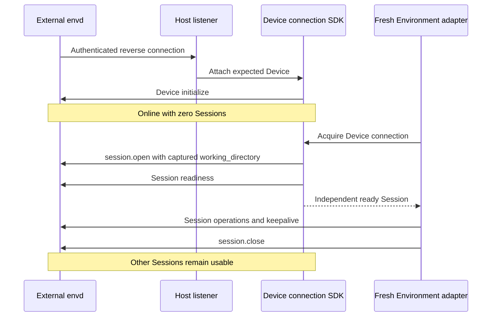

# Remote Envd Providers and Host Integration

## Design Position

`a13n.http-envd` and `a13n.websocket-envd` connect to externally operated Devices. They do not provision, start, stop, delete or renew remote infrastructure. Both declare `supports_managed=False`, `supports_stop=False`, `supports_destroy=False` and `requires_keepalive=False`. EIP Session keepalive is separate from Provider target renewal.

HTTP is Host-dialed; reverse WebSocket is daemon-dialed, with envd always the responder. A Host-owned Device connection serves multiple fresh adapter-owned Sessions. Independent Runs never share an Environment adapter or initialized EIP Session.

## Boundaries

| Concern                                                                           | Owner                     |
| --------------------------------------------------------------------------------- | ------------------------- |
| Daemon deployment and outer security boundary                                     | Operator or Host          |
| Device registration, endpoint, credentials, listener and trusted folder selection | Host                      |
| Framing, multiplexing, Session controls and transfers                             | Low-level EIP client      |
| Bounded process-local Device connection registry                                  | Host-owned connection SDK |
| Fresh adapter, folder configuration and provider-neutral operation translation    | Remote Provider           |
| Cross-process routing, durable records and product policy                         | Host                      |

A Session is a resource owner, not a tenant sandbox. Device and working-directory selection are trusted inputs; the model receives only the resulting operation routes. The SDK owns no listener, global registry, credential issuer or distributed relay.

## Configuration and State

The Provider's credential-free configuration contains `working_directory` and exact `required_methods`. Paths use the [Device path model](../a13n-envd/04-resource-operations.md#path-model), never the requester's filesystem. An omitted working directory resolves from Device info at preparation; Hosts with immutable Run acceptance resolve and capture it before acceptance. Validation is structural and inert; Session opening checks availability.

The adapter's provider-local `/` is the Device filesystem namespace, not the selected directory. Device paths translate directly to provider-local paths; relative inputs and omitted command cwd use the captured working directory. Host aliases prefix this namespace without restricting it to cwd. Required methods assert compatibility, not permissions.

External state contains the stable native `device_id` under the Provider's versioned state envelope. Unsupported state versions fail validation. Host logical resource identity is independent of native Device identity and Session working-directory configuration.

State excludes endpoints, credentials, sockets, Sessions, generations, heartbeat state and Run policy. `dump_state()` returns detached validated target state after preparation/failure/close. `target_identity()` identifies the Device within the Host's immutable backend selection, not one folder binding. The Host owns resource deduplication; distinct accepted folder bindings retain independent Session scopes.

### HTTP backend and runtime

`HttpEnvdConnectionConfiguration` supplies a credential-free origin, explicit private-link plaintext choice, finite connection/request timeouts and bounded concurrency. Runtime collaborators supply the current credential and TLS configuration. Public origins use verified HTTPS; plaintext requires an explicitly trusted local/private deployment. Credentials never appear in URLs or portable state.

One backend selects one origin. Changing that origin is an explicit Host target change. Construction does not connect. Preparation initializes the expected Device, opens a fresh Session with the captured working directory and validates readiness. TCP pooling has no ownership significance.

### WebSocket backend and runtime

`WebSocketEnvdConnectionConfiguration` supplies a finite connection-acquisition timeout. The Host supplies `WebSocketEnvdConnections` through its runtime, not a listener address or socket in Provider configuration. An unwired Provider remains inert and fails runtime creation explicitly.

The Host authenticates the upgrade, negotiates `eip.v1` and resolves expected Device identity before handing an accepted `WebSocketConnection` to the SDK. This structural async interface provides send, receive, close and non-consuming closure observation; framework adapters normalize disconnects without adding another socket reader.

One SDK instance is a bounded process-local Host trust scope. At most one active connection represents a Device; duplicates are rejected without replacing the active owner. Different Devices can be online simultaneously. Hosts own cross-process placement and routing.

## Device Discovery

The connection SDK exposes authenticated Device info and bounded directory listing without opening an Environment adapter or Session. HTTP uses the same EIP methods directly. Host product authorization applies before discovery; no Run is required. Discovery failure affects that request, not sibling Sessions or Device connection ownership.

## Lifecycle

Attachment performs the Device handshake immediately, even when no Run is waiting. The Host awaits the attachment handler for the carrier lifetime. Acquisition waits for the matching Device under a finite deadline; cancellation of a waiter does not consume or close the connection.

`prepare()` opens one independent Session, checks required methods and readiness, and exposes operation facets. The client maintains Session keepalive for this adapter's lifetime. Cancelling preparation or closing the adapter stops keepalive and closes only that Session. It neither closes a borrowed carrier nor stops the remote daemon. HTTP uses the identical Session flow over its request transport.

A lost framed carrier detaches its Sessions for the EIP disconnect grace. An existing owning runtime may explicitly reattach the same Session in the same generation while it remains valid. Pending requests still have unknown outcomes when dispatch may have occurred; reattachment never replays work or resumes transfers. If the Session expired, a fresh adapter/Session is required and old resource references stay invalid. There is no cross-Session resource import or durable adapter recovery.

SDK shutdown fences acquisition, closes owned Sessions and connections, and joins attachment handlers boundedly. An old handler removes only its exact connection, never a later replacement. Remote infrastructure remains external. Provider `keepalive()` is a no-op for target lifetime, distinct from the low-level Session heartbeat.

## Failure Semantics

| Condition                                            | Result                                             |
| ---------------------------------------------------- | -------------------------------------------------- |
| Missing state, mismatched Device or stale generation | Reject; do not adopt another target                |
| Offline Device or acquisition deadline               | Unavailable/timeout, not authoritative absence     |
| Invalid folder or unsupported required method        | Reject that Session; preserve siblings             |
| Duplicate active Device connection                   | Preserve the existing attachment                   |
| Carrier loss after possible dispatch                 | Unknown outcome; no automatic mutation retry       |
| Close/expiry                                         | Clean the selected Session's native resources only |
| Native cleanup failure                               | Report and retain truthful accounting              |
| Stop, destroy or provisioning reconciliation         | Unsupported; never implicitly prepare              |

Remote Providers cannot distinguish an unreachable machine from a stopped one authoritatively.
