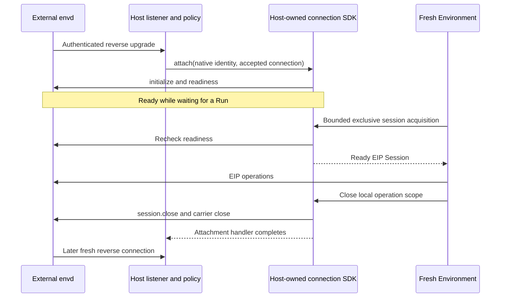

# Remote Envd Providers and Host Integration

## Design Position

`a13n.http-envd` and `a13n.websocket-envd` connect to externally operated daemons. They implement the same provider-neutral EIP operations as Local Envd without provisioning, starting, stopping, deleting, or renewing the remote infrastructure. Both declare `supports_managed=False`, `supports_stop=False`, `supports_destroy=False`, and `requires_keepalive=False`.

HTTP is Host-dialed. WebSocket is reverse: envd connects to a Host-owned listener while remaining the EIP responder. The WebSocket integration SDK accepts authenticated connections from Host code; it never starts a listener or supplies a default product ingress route.

## Boundaries

| Concern                                                                           | Owner                                                                         |
| --------------------------------------------------------------------------------- | ----------------------------------------------------------------------------- |
| Daemon deployment, outer isolation, mounts, bootstrap and credentials             | External operator and Host                                                    |
| Listener, authentication, trusted daemon selection, tenant routing                | Host                                                                          |
| Framework-neutral WebSocket message interface and EIP framing                     | Low-level EIP client                                                          |
| Bounded online connections and exclusive local session acquisition                | Host-owned Provider SDK instance                                              |
| External state codec, operation scope and semantic EIP conversion                 | Remote Provider                                                               |
| Cross-process routing, durable Environment records and conflicting Run scheduling | Host                                                                          |
| EIP session admission, generation and operation outcomes                          | [Envd transport/session contract](../a13n-envd/03-transports-and-sessions.md) |

A Session is not a tenant isolation boundary. One Host can operate many separate daemons; one daemon admits only one active initialized Session. Independent Runs do not share an Environment adapter or concurrently acquire that daemon. Concurrent requests within an admitted Session remain supported. No connection credential or untrusted URL authorizes selecting another Environment.

## Configuration and State

Both Providers accept configuration schema `1`, represented by `RemoteEnvdProviderConfiguration`. Its `required_methods` is a bounded tuple of exact EIP method names, canonicalized to a sorted unique tuple. The Provider always requires description, readiness and clean session close in addition to these methods. This compatibility requirement is not an access grant; the live descriptor and Host access ceiling determine available operations.

The configured descriptor advertises the EIP operation upper bound without I/O. The initialized live descriptor narrows it. External daemon configuration owns actual mounts, shell profiles, command executable roots and limits; the recipe cannot modify that configuration.

Both require `EnvironmentState` version `1` with this exact provider payload:

```python
class RemoteEnvdStateData(BaseModel):
    daemon_environment_id: str
```

The payload is a bounded native daemon selector. The envelope key must match the selected Provider. Missing, malformed or incompatible state fails before connection; it never requests creation or discovery of an arbitrary daemon. A Host logical Environment ID can differ from this native ID. Initialization and wire receipts validate the native ID; Harness process and output references carry the logical ID. A daemon restart retains its configured native ID but changes generation, invalidating old generation-bound references.

State contains no endpoint, credential, connection, Session, generation, lease or Host Run policy. `dump_state()` returns the supplied detached validated state after preparation, failure and close. `target_identity()` returns the native daemon ID, namespaced by the Host's immutable backend selection.

### HTTP backend and runtime

`HttpEnvdBackendConfiguration` supplies one credential-free EIP HTTP origin, explicit private-link plaintext opt-in, finite initialization and request timeouts, and a bounded in-flight limit. It is Host backend configuration, not an Environment recipe or portable state. One configured backend selects one origin; multiple origins use separately configured backends. Changing the target-defining origin creates another Host backend rather than silently retargeting an existing Environment.

`HttpEnvdCredential` supplies a write-only secret `token`. `HttpEnvdProviderRuntime` combines validated backend settings, the current credential and optional trusted TLS configuration. TLS verification cannot be disabled. Origin validation is deterministic and follows the client's `normalize_http_endpoint()` policy without constructing a network client. Public network origins use verified HTTPS; plaintext is limited to loopback or an explicitly trusted provider-private link. Credentials cannot appear in origins.

Embedded Hosts can construct the typed runtime directly. Hosts using `create_runtime()` supply an external `ProviderRuntimeContext`; a managed context fails before I/O.

### WebSocket backend and runtime

`WebSocketEnvdBackendConfiguration` supplies a finite connection-acquisition timeout. It contains no listener address, attachment credential, server or native socket. The Host supplies `WebSocketEnvdConnections` through `WebSocketEnvdProviderRuntime`, or explicitly constructs a `WebSocketEnvdEnvironmentProvider` wired to that SDK for its runtime factory. An unwired catalog instance remains inert and rejects runtime creation with `provider_runtime_required` rather than opening a listener or accessing global state.

The Host authenticates each accepted upgrade, negotiates `eip.v1`, and resolves the expected native daemon identity from trusted routing before handing the connection to the SDK. `WebSocketConnection` is the client's structural async interface for send, receive, close, closure observation and negotiated subprotocol. The `websockets` server connection implements it directly; other frameworks adapt their own accepted connection. Disconnects are normalized by that adapter and closure observation does not consume messages concurrently with EIP.

One SDK instance represents one Host-selected backend/trust scope. It is process-local, explicitly owned and bounded; it is neither a durable registry nor a cross-worker relay. Hosts route the requesting Run to the connection-owning process or supply their own integration. Merely enabling a Provider key does not solve cross-process routing.

## Lifecycle

### HTTP

Construction and scope entry perform no I/O. `prepare()` opens a fresh authenticated transport, initializes the expected native identity and required methods, verifies readiness and publishes EIP operation facets. Scope rebinding after eager preparation performs no network I/O.

`close()` cleans only adapter-owned process/output resources, closes the EIP Session and releases the HTTP client. It does not stop the daemon or delete files. A later fresh adapter can reconnect to the same generation after clean Session closure.

Transport loss is not clean EIP Session closure. An abandoned HTTP Session can remain admitted until daemon idle expiry or operator recovery. A second attachment is rejected while that Session remains active. The Provider does not steal it, restart the daemon, replay initialization indefinitely, infer absence or replay possibly dispatched mutations. Failed connection preparation consumes that adapter's attempt; the Host constructs a fresh adapter for a subsequent attempt.

### Reverse WebSocket



Attachment immediately initializes and verifies readiness, including while no Run needs the daemon. Waiting for a Run before initialization would violate the daemon's finite initialization deadline. No Environment construction or scope entry triggers this Host-directed attachment work.

The Host awaits `attach()` for the connection lifetime. At most one connection per native identity is admitted. Duplicates and excess connections are rejected and closed without replacing an active lease. Acquisition waits only for a matching online connection, under a finite deadline; a concurrent lease fails busy rather than silently sharing or queueing Run authority. Cancelling a waiting acquisition does not consume a connection.

An Environment lease rechecks readiness and required methods before exposing operations. Lease close cleans its operation resources and ends the Session/carrier. Reconnection establishes a fresh Session; it never revives old transfer handles or replays requests. Disconnect, failed initialization, handler cancellation and SDK shutdown remove the exact old connection and wake waiting acquirers. An old handler cannot erase a subsequently admitted connection. SDK shutdown fences admission and releases its connection tasks and Sessions; it does not stop remote envd processes.

## Failure Semantics

| Condition                                    | Result                                             |
| -------------------------------------------- | -------------------------------------------------- |
| Missing state or native identity mismatch    | Reject; never adopt another target                 |
| Missing Host WebSocket runtime               | Typed runtime-required failure, no listener        |
| Offline daemon or acquisition deadline       | Unavailable/timeout, not target absence            |
| Duplicate connection or concurrent lease     | Conflict; preserve the active owner                |
| Incompatible required methods                | Reject before Agent operation dispatch             |
| HTTP Session still admitted                  | Fail without forced takeover or daemon restart     |
| Carrier loss after possible dispatch         | Unknown operation outcome; no automatic replay     |
| Local cleanup failure                        | Report cleanup separately; preserve external state |
| Stop, destroy or provisioning reconciliation | Unsupported; never implicitly prepare              |

The Providers cannot authoritatively distinguish a stopped external machine from an unreachable one and do not provide provisioning reconciliation. Keepalive is a no-op under the declared no-renewal capability, not a promise about externally configured machine expiry.

## Compatibility and Invariants

1. Native target identity, logical Environment identity and process-local Session identity remain distinct.
2. External configuration and portable state cannot become infrastructure-management authority.
3. HTTP and reverse WebSocket reuse one EIP operation implementation and the same wire semantics.
4. The library owns no listener, credential issuer, global registry, tenant policy or distributed routing.
5. Framework integration changes message delivery, not EIP framing, resource authority or replay policy.
6. Close ends local scope and connection resources, never the external daemon or its workspace.
7. Eleven Provider choices share two operation routes and one set of file/process contracts; the [built-in matrix](03-built-in-providers.md#design-position) owns their classification.
