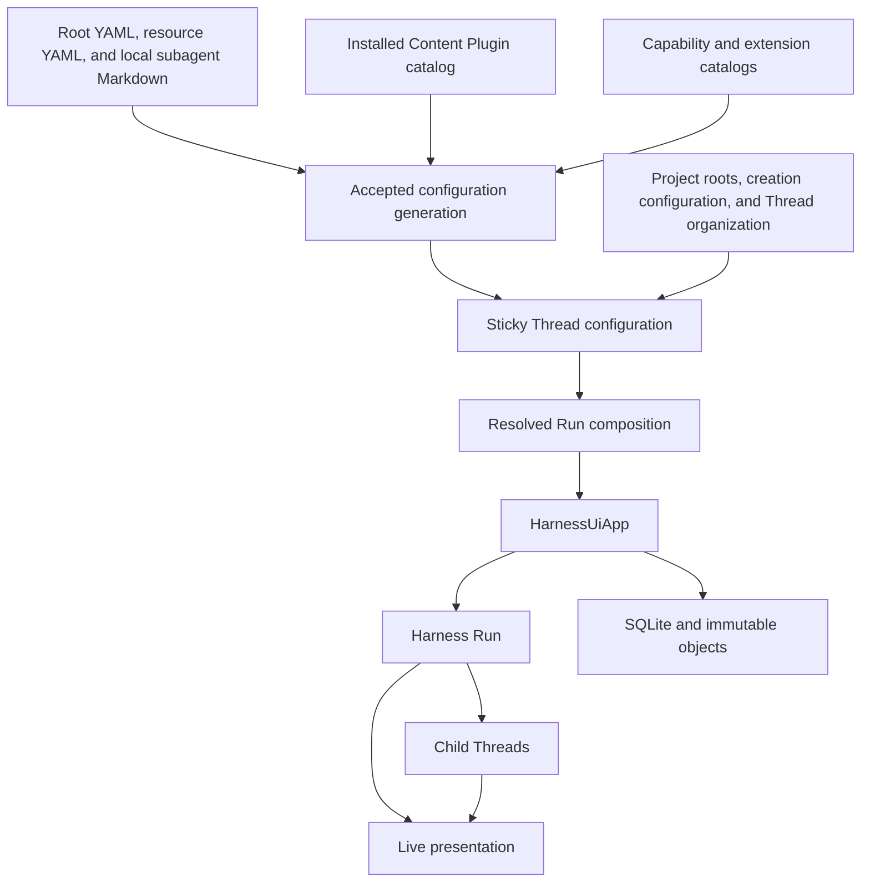
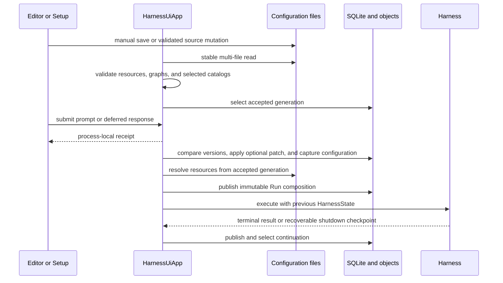
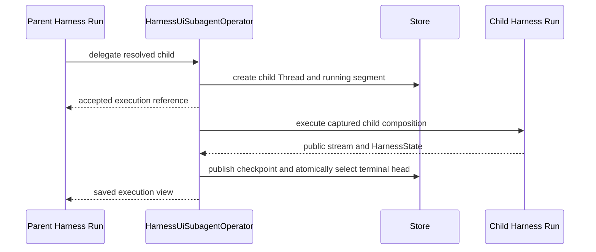

# Harness UI and App Overview

## Design Position

Harness UI is a local Agent workbench with a personal CLI and a collaborative WebUI for trusted small teams sharing one instance. It provides no multi-tenant or per-participant execution isolation. One process-local `HarnessUiApp` owns configuration generations, trusted catalogs, internal Projects and Threads, process-local root receipts, persisted async children, Environment state, shared browser drafts, page presence, published output comments, optional native human computer access, detached projections, and live presentation. The full-terminal CLI and foreground WebUI server are adapters over that reusable boundary; neither owns a second execution engine.

Human-editable files remain the desired-resource authority so Harness UI can be configured without a browser or a large command surface. Separately, explicit CLI operations install editable declarative Content Plugins under the data root. SQLite owns mutable Thread and execution heads plus [published human comments](webui/05-output-comments.md), while immutable content-addressed objects retain complete Run compositions and continuation checkpoints.

Harness UI persists complete continuation boundaries and independently published comments, not shared editing drafts, page presence, or accepted-work intent. Process loss can discard a root receipt, uncheckpointed submitted message or deferred response, partial output, an active child segment, live events, and Run-local shell observations. Native command survival is Provider-owned. A later operation resumes only from a previously selected complete checkpoint.

Harness UI owns two built-in local execution modes. **Full Control** uses the Direct Local Provider and runs commands as the Host user. **Sandbox** uses Local Envd over EIP with Envd-managed restricted Session workers and denied networking; it never falls back to Direct Local. Both preserve the local machine's canonical Project-root paths in Harness aggregate routing and model context while retaining different execution authority. Other adapters use provider-neutral virtual routes unless they explicitly declare that their path space preserves Host paths.

## Product Model

The core concepts are:

| Concept                  | Meaning and owner                                                                                                        |
| ------------------------ | ------------------------------------------------------------------------------------------------------------------------ |
| Configuration generation | One complete stable and valid capture of the root YAML, resource YAML, and canonical Markdown sources                    |
| Configured resource      | Stable file-defined Model, extension, MCP server, Agent, local or plugin subagent, or Project selected by ID             |
| Content Plugin           | Git-installed editable declarative Skill and Markdown-subagent bundle; availability alone grants no selection            |
| Installed catalog entry  | Available Capability or runtime-extension implementation; availability alone grants no selection                         |
| Project                  | Optional file-defined mutable named ordered roots for organizing project-bound root Threads and execution context        |
| Thread                   | Root or async child conversation with independent metadata and sticky-configuration heads plus one selected continuation |
| Thread configuration     | Versioned Project, Agent, Environment, Plugin, Run Extension, and MCP selections used by default on subsequent Runs      |
| Root operation           | One process-local prompt or deferred-response admission identified by an exact receipt                                   |
| Resolved Run composition | Immutable configuration, resource content, selected local roots, and dependency provenance captured for one admitted Run |
| Execution segment        | One accepted child `delegate` or `resume_subagent` execution; normally one Harness Run plus bounded denial continuation  |
| Surface projection       | Detached, bounded, serializable summary, detail, transcript, operation, child, or live value                             |
| Compact display          | Shared typed items used for inspection and rendering under Host retention policy, never for resume                       |

## Boundaries

| Concern                                | Owner                                         | Harness UI relationship                                                                                                      |
| -------------------------------------- | --------------------------------------------- | ---------------------------------------------------------------------------------------------------------------------------- |
| Native Agent construction and loop     | Harness and Pydantic AI                       | Resolves selected Capabilities and extensions into exact native inputs                                                       |
| Desired local resource behavior        | Harness UI configuration files                | Accepts one coherent generation and preserves direct text editing                                                            |
| Declarative plugin content             | Installed Content Plugin catalog              | Adds editable Skill sources and fallback Markdown subagents without runtime code                                             |
| Mutable conversation presentation      | Harness UI Thread metadata                    | Stores versioned title and archive state                                                                                     |
| Mutable conversation defaults          | Harness UI Thread configuration               | Stores sticky selections and applies explicit partial changes                                                                |
| Root and child continuation            | Harness `HarnessState` selected by Harness UI | Persists complete immutable checkpoints and current references                                                               |
| Environment operations and state codec | Environment package                           | Supplies fresh adapters and explicit lifecycle operations                                                                    |
| Local root grouping and path layout    | Harness UI Project and selected profile       | Supplies ordered roots and Host-path-preserving or virtual aggregate paths captured at Run admission                         |
| Current Environment state              | Harness UI                                    | Stores and publishes Host-authoritative state under a complete Thread/configuration/root key                                 |
| Async child admission and persistence  | `HarnessUiSubagentOperator`                   | Creates child Threads and runs the complete Harness Host-operator boundary                                                   |
| AG-UI conversion                       | Agent Stream Protocol                         | Uses one non-retaining observer and compact fold per root or asynchronous child segment, preserving inline-child attribution |
| Local persistence                      | Harness UI                                    | Uses SQLite for compact mutable heads and immutable files for compositions and checkpoints                                   |
| Presentation                           | CLI, WebUI, and embedding adapters            | Consume detached App projections, exact process-local receipts, root-lineage live events, and summary invalidations          |
| Durable distributed execution          | a13n Service                                  | Not emulated by Harness UI                                                                                                   |

## Configuration and Run Flow

A Thread configuration patch and root admission form one App operation. Every non-empty patch carries the exact expected Thread configuration version; an admission with no patch performs no configuration-head write. Omitted fields preserve the Thread's previous values. The accepted patch applies to that Run and subsequent Runs. A later Thread, Project, or file change never mutates an already admitted Run.

The receipt returns before preparation completes. It supports exact current-process query, wait, cancel, and, once a Harness stream exists, steer. A suspended continuation can be resumed only by a response naming that exact continuation and completely answering its detached pending request set. Receipts and response input are not durable records.

`HarnessState` preserves the conversation and Capability namespaces across composition changes. Unusable Agent Capability source selections are [skipped with warnings](01a-extension-discovery-and-management.md#capability-catalog) before capture. Other unavailable or incompatible selected components fail explicitly; Harness UI does not silently substitute the previous component or reset state.

Environment-state publication and continuation selection are independent completion boundaries. Known changed state is published after adapter cleanup even when execution or continuation publication fails.

## Async Child Flow

One `delegate` creates a child Thread and segment zero. The child retains its selected Agent-resource or Markdown-subagent source and owns its sticky configuration, while Project and Environment profile defaults are initialized from the admitting parent. `resume_subagent` retains the child Thread identity, applies an optional child configuration patch, and creates the next segment from the selected child `HarnessState`.

An existing child Thread does not follow later parent Project, Environment profile, Plugin, Run Extension, or MCP selection changes; its next segment defaults to its own sticky configuration. A Markdown source still resolves its explicit Model and Capability inheritance against the parent Run that authorizes a linked resume. A parent Agent edit affects a newly delegated child only after a later parent Run captures that edit.

## Persistence and Recovery Position

Harness UI stores:

- accepted configuration-generation metadata and safe diagnostics;
- Project and resource indexes derived from files;
- Thread metadata, sticky configuration, and selected continuation;
- immutable resolved Run compositions;
- child execution heads and immutable checkpoints;
- Host-authoritative Environment state references;
- published human comments and their original saved-output references under the [local comment storage contract](03-local-storage-and-recovery.md#output-comment-storage).

It does not durably store shared browser drafts, root receipts, an execution-accepted input queue, active root Run records, a child scheduler, process-liveness records, shell-process handles, native terminal sessions, presence, native runtime objects, resolved credentials, or live streams. In-memory browser drafts are not queued inputs and never authorize automatic execution.

## Surfaces and Packaging

The [interactive CLI](07-interactive-cli.md) uses one editable multimodal draft, a bounded Markdown viewport, shared slash-command metadata, and concise/detailed live presentation. Direct file editing remains a complete configuration path. CLI management locates, validates, and shows configuration, manages Content Plugins, and explicitly imports external subagents. Setup publishes reviewed starter resources. The App selects an ordinary Project by its exact first root, retaining all roots, and creates a single-root Project only when execution needs one and no match exists; the CLI offers lightweight session resume rather than Project or Thread management.

The App remains reusable: adapters consume detached values and exact receipts, not SQLite or native Harness authority. Root-lineage live events remain bounded best-effort observations; retained continuations and operation state decide completion. The distribution contains the native CLI, App, WebUI HTTP/realtime adapter, compiled browser assets, and the [built-in configuration Skill and documentation](02b-environment-skill-sources.md#built-in-configuration-skill). Local EIP selects its native runtime from installed client distribution metadata under the [Local EIP Runtime contract](04-projects-threads-and-environments.md#local-eip-runtime). `a13n-harness-ui` starts the CLI; `a13n-harness-ui webui` starts the foreground browser server. Browser sources under `frontend/apps/a13n-harness-ui` are private build input. Both wheel and sdist include the compiled asset tree and its hash manifest; installing the wheel, running either surface, and rebuilding a wheel from the sdist require no Node.js. Repository and release asset preparation use Node.js. The package has no Textual dependency or independent npm publication.

The [WebUI](webui/README.md) provides project navigation, page presence, collaborative prompts, comments on saved AI output, and resource composition. [Native computer sharing](webui/02-host-computer-sharing.md) adds Git-aware Host files and PTY only when explicitly enabled. These human operations belong to the server OS and do not follow Agent Environment selections. The [Docker development image](webui/03-distribution.md#docker-development-image) supplies the same workbench inside a non-root container with native sharing enabled and authentication retained.

## Stable Principles

01. One in-process App owns all local application behavior.
02. Human-editable configuration and installed Content Plugin files are definition sources, and SQLite does not duplicate either source.
03. One accepted generation is coherent across all selected configuration files.
04. Project is the only local-root grouping, root-Thread organization, and execution-context concept; Harness UI defines no Workspace resource.
05. Thread metadata and sticky configuration are independent versioned heads, while each admitted Run captures immutable effective behavior.
06. Continuation history survives supported Agent, Capability, Plugin, MCP, Project, and Environment profile selection changes.
07. Every independent Run receives fresh runtime authority and Environment adapters.
08. Root admission is process-local. Input survives only when incorporated in a selected checkpoint, including accepted deferred facts retained with that checkpoint; active work is not durably scheduled.
09. Root continuation, Environment state, and child checkpoint publication remain independent facts.
10. Surface projections and streams are detached from storage and native runtime authority.
11. The CLI, WebUI, and embedding integrations use the same App commands, projections, and immutable capture boundaries.
12. Full Control and Sandbox expose canonical Host Project and user Skill paths while preserving Direct Local versus sandboxed EIP execution authority; other adapters retain virtual routes unless they explicitly preserve Host paths.
