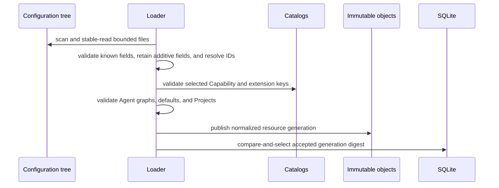

# Configuration Sources and Resources

## Design Position

Harness UI uses a small multi-file configuration tree so people can configure and inspect the CLI with an ordinary editor or another agent. Files own desired Models, configured extensions, MCP servers, Agents, local Markdown subagents, Projects, and global defaults. The separately managed [Content Plugin catalog](01b-content-plugin-repositories.md) contributes editable fallback Markdown subagents and Skill sources. SQLite records accepted-generation indexes and mutable Thread selections but never becomes a competing editable resource source.

A stable valid read of the configuration tree plus usable optional Content Plugin sources produces one accepted configuration generation. A malformed, incomplete, or changing primary configuration tree leaves the previous accepted generation active during live reload. At startup, a nonexistent Agent Model or effective reviewer Model reference is fatal even if a previous accepted generation exists. The application logs the source file, field, and missing Model ID and does not substitute a Model or skip permission policy. Other invalid startup candidates retain the diagnostic/repair flow. Invalid optional plugin content is skipped with diagnostics under the [Content Plugin loading contract](01b-content-plugin-repositories.md#configuration-integration). Unusable Agent Capability selections are skipped with warnings under the [Capability catalog contract](01a-extension-discovery-and-management.md#capability-catalog), without rejecting the generation or rewriting source files. Existing Threads retain their sticky resource IDs, but each later Run resolves those IDs from the current accepted generation.

## Configuration Tree

An explicit `--config <path>` selects the root YAML. Otherwise Harness UI selects `~/.a13n-harness-ui/a13n-harness-ui.yaml`. The root file's parent owns fixed immediate resource directories:

```text
~/.a13n-harness-ui/
  a13n-harness-ui.yaml
  AGENTS.md
  models/
    <resource>.yaml
  extensions/
    <resource>.yaml
  mcp/
    <resource>.yaml
    <servers>.json
  agents/
    <resource>.yaml
  subagents/
    <resource>.md
  projects/
    <resource>.yaml
```

Each resource file defines one resource except MCP files, which also accept a multi-server `mcpServers` object under [MCP Servers](02-agent-composition-and-snapshots.md#mcp-servers). Harness UI scans immediate lower-case `.yaml` files in the YAML directories, additionally `.json` files in `mcp/`, and immediate non-README `.md` files in `subagents/`. A physical MCP file has one source digest and zero or more indexed resource IDs; each server has its own resource index entry pointing to that file. JSON rejects duplicate keys, non-finite numbers, comments, trailing commas, and non-object documents; source size, nesting, and node limits are bounded as for YAML. Local Markdown subagents override an installed Content Plugin contribution with the same ID; plugin-to-plugin duplicates use deterministic precedence with diagnostics. It does not recurse, follow a symlinked directory, follow file symlinks, walk parent directories, process YAML includes, or discover ambient product configuration as a live layer.

The optional `AGENTS.md` beside the root YAML is global user-role guidance. Its exact UTF-8 content participates in the accepted generation fingerprint and source digest, under the same stable regular-file read and size limits as other primary sources. Edits and removal take effect on later accepted generations; captured Runs remain immutable. `RULES.md` and `AGENTS.override.md` are not instruction sources. Harness UI does not import guidance from ambient Codex configuration. [Composition](02-agent-composition-and-snapshots.md#resolution) owns injection and capture.

The root file owns restart-bound process settings, user-input delivery, global defaults, application tool switches, and WebUI collaboration preferences:

```yaml
schema_version: "1"

process:
  pricing_auto_update: true
  terminal_update_check: true
  log_level: INFO
  log_format: pretty

input:
  long_text_threshold_chars: 8000

tools:
  enable_ask_user_question: true
  interaction_timeout_seconds: 120
  enable_codeact: true

subagents:
  include: [code-reviewer, executor, explorer]

webui:
  sidekick: null

defaults:
  project: project-agent-foundation
  agent: agent-assistant
  environment_profile: environment-native
  harness_plugins: []
  environment_run_extensions: []
  mcp_servers: []
```

`webui.sidekick` is null or omitted by default. A mapping enables it: optional `agent` selects an existing Agent resource or inherits the calling Agent when omitted/null; optional `model` selects a Model resource override for the requested Run. An explicitly selected Agent without a Model requires a Model override. Empty `{}` enables inherited selections. Invalid references reject the candidate generation. WebUI General settings edits enabled state, Agent inheritance and Model override through the existing root-document draft and save flow, separately from `defaults.agent`. Selecting Disabled writes null. Saving neither creates a Thread nor starts execution. The preferences are captured per Run; [Sidekick instructions](05-runtime-subagents-and-surfaces.md#sidekick-instructions) owns the conditional behavior and terminal/child boundary.

`security.shell_review` is an optional application-owned shortcut with `enable` (boolean, default `false`), `risk_threshold` (`low`, `medium`, `high`, `extra_high`, or null/omitted), `model` (Model resource ID or null/omitted), `on_flagged` (`deny`, `approval_required`, or null/omitted), and `on_error` (`deny`, `approval_required`, `allow`, or null/omitted). Disabled or omitted means no injection, not a prohibition: explicit Agent permission/review policy remains effective. Enabled merges the shortcut into one `ToolPermissionsCapability` before Run capture, with explicitly supplied shortcut fields taking precedence. Omitted/null fields inherit the Agent review configuration; without one, the threshold is `extra_high`, the Model is the effective Agent Model, `on_flagged` is `approval_required`, and `on_error` is `allow`. Setup materializes its reviewed selections in this root mapping. [Shell review composition](02-agent-composition-and-snapshots.md#shell-review-auxiliary-model) owns exact-rule merging, failure behavior, and frozen auxiliary Models.

`subagents.include` is an ordered unique list of release-owned names: `code-reviewer`, `executor`, and `explorer`. Omitted or `[]` includes none. Normal setup includes all three; `setup --advanced` offers all or none; individual names remain editor-configurable. These selections extend the root Run roster, not every descendant roster. They are composition inputs, not sticky Thread selections. The package owns the definitions; no definition files are copied into the configuration tree. `a13n-harness-ui config subagents` lists available roles and current inclusion. [Composition](02-agent-composition-and-snapshots.md#built-in-subagents) owns expansion, identity, inheritance, and conflict handling.

`tools.enable_ask_user_question` defaults to `true`; disabling it excludes the built-in `ask_user_question` Capability from newly resolved Runs, including explicitly authored selections. `tools.enable_codeact` defaults to `true`; when enabled it includes the native Harness CodeAct Capability with `run_code`, `run_program`, and its explicit `store`, `load`, and `forget` state tools. State bounds and persistence semantics follow the [Harness CodeAct contract](../a13n-harness/18-codeact.md). An explicit Agent `codeact` Capability configuration can narrow or tune its native runners, but cannot bypass the global disabled switch. Ordinary tool visibility filters still apply. These switches participate in accepted generations and captured compositions; they do not alter active or previously captured Runs. [Composition](02-agent-composition-and-snapshots.md#resolution) owns reconstruction.

`input.long_text_threshold_chars` is a positive integer, default `8000`, or `null` to disable automatic text files. It counts Unicode characters in each submitted user-text block, not tokens or UTF-8 bytes. A block is eligible only when strictly longer than the threshold. A root Run captures the policy from its accepted generation and uses it for initial input and human steering; later configuration changes affect later Runs. The [root input contract](05-runtime-subagents-and-surfaces.md#long-text-input-files) owns conversion, readability checks, and failure behavior.

`tools.interaction_timeout_seconds` is a positive finite number, default `120`. It controls the active terminal Host's wait for each question, approval, or external result and the WebUI App's wait for each complete root decision batch, not model execution. The old `ask_user_question_timeout_seconds` key is accepted as an input alias; output uses `interaction_timeout_seconds`. The [interactive contract](07-interactive-cli.md#waiting-and-cancellation) owns terminal expiry; the [App contract](05-runtime-subagents-and-surfaces.md#webui-interaction-deadlines) owns WebUI deadlines and continuation behavior.

`process.pricing_auto_update` defaults to `true` and controls the App-owned upstream price updater. It is restart-bound, not a Model or Agent resource setting. The [App lifetime](05-runtime-subagents-and-surfaces.md#app-lifetime) owns update and shutdown behavior.

`process.terminal_update_check` defaults to `true` and enables the terminal-only startup package update check and confirmation prompt. It never authorizes installation; startup installation requires a fresh explicit answer. The separate `a13n-harness-ui update` command explicitly requests installation and is not controlled by this setting. `--no-update-check` disables detection for one invocation without editing configuration, and the source-development `make a13n-harness-ui` target always sets it. The [interactive contract](07-interactive-cli.md#startup-and-terminal-ownership) owns caching, confirmation, installer handoff, logging, and exit behavior. `process.log_format` continues to control noninteractive logging; interactive diagnostics are always structured files.

The root also accepts `display.theme` (`auto` by default, or `dark`/`light`), `display.mode` (`concise` by default), `display.show_status` (true), `display.max_tool_result_lines` (5, range 1–200), and `display.max_tool_argument_chars` (8192, range 128–65536). The CLI reads these at startup; explicit launch or live mode selections take precedence. These are presentation settings, not model or permission controls. Listener bind address and API key are process-local `a13n-harness-ui webui` arguments, not desired-resource configuration. The [interactive contract](07-interactive-cli.md) owns terminal behavior.

The data root is a bootstrap locator resolved before parsing this tree: explicit `--data-root`, then `A13N_HARNESS_UI_DATA_ROOT`, then `<config-directory>/data`. It owns both local persistence and the installed Content Plugin catalog. It is deliberately absent from `a13n-harness-ui.yaml`, so an invalid root edit cannot hide the SQLite database that retains the prior accepted generation. Selecting another data root opens a distinct local workstation dataset and never implies migration.

Relative process paths resolve from the root file's directory. Resource paths that represent Project roots must be explicit absolute paths after user expansion; their stored meaning never depends on the App's current working directory.

## Common Resource Envelope

YAML resources use a small common envelope followed by a kind-owned body:

```python
class ResourceDocument(BaseModel):
    schema_version: Literal["1"]
    kind: ResourceKind
    id: ResourceId
    name: str
```

`ResourceId` is a stable concise kind-prefixed identity such as `agent-reviewer`, `mcp-github`, or `project-foundation`. A filename is presentation only and need not equal the ID. IDs are unique within one resource kind. Renaming a file or an explicit resource's display name does not change identity. MCP wrapper keys derive their resource IDs, so changing a key can change identity under the MCP normalization rules. Changing `id` creates a different logical resource and can leave existing Thread selections unresolved.

Unknown fields, duplicate IDs, duplicate YAML keys, aliases, anchors, merge keys, custom tags, non-finite values, excessive nesting, oversized sources, invalid UTF-8, and unsupported schema versions fail the candidate generation.

The owning contracts define the bodies:

| Kind                                               | Owner                                                                                                                                                |
| -------------------------------------------------- | ---------------------------------------------------------------------------------------------------------------------------------------------------- |
| Model                                              | [Agent and MCP Composition](02-agent-composition-and-snapshots.md#models) and [Model Authentication](02a-model-authentication-and-account-stores.md) |
| Harness Plugin, Environment profile, Run Extension | [Extension Discovery and Management](01a-extension-discovery-and-management.md)                                                                      |
| MCP server                                         | [Agent and MCP Composition](02-agent-composition-and-snapshots.md#mcp-servers)                                                                       |
| Agent                                              | [Agent and MCP Composition](02-agent-composition-and-snapshots.md#agent-resources)                                                                   |
| Markdown subagent                                  | [Agent and MCP Composition](02-agent-composition-and-snapshots.md#canonical-markdown-subagents)                                                      |
| Project                                            | [Projects, Threads, and Environments](04-projects-threads-and-environments.md#projects)                                                              |

## Accepted Generation



The loader captures configuration directory membership and each file's identity, size, modification time, bytes, and digest. It also captures release-owned built-in Markdown sources and their exact digests, plus current Content Plugin metadata, editable directory paths, diagnostics, and usable canonical Markdown. It retries a bounded number of times when membership or a file changes during capture. The source-generation digest covers the normalization-format revision, ordered source-relative identities, exact source digests, plugin diagnostics, and normalized Project root paths, not timestamps. Source-time path normalization can observe a changed symlink target without changed YAML bytes; the normalized roots therefore also participate in generation identity. Changing normalized serialization advances the normalization revision, so unchanged user files can be accepted after an upgrade without colliding with historical immutable objects. Per-file byte digests and existing historical generations remain unchanged. Normalized resource content has its own canonical digests, so presentation-only edits create a new source generation without changing behavior-derived identities such as an Environment profile digest.

Acceptance is all-or-nothing. Publishing immutable content can leave harmless unreferenced objects, but SQLite selects a generation only after every selected resource, catalog key, graph, credential reference, and default validates. A failed candidate never removes or partially updates the previous accepted generation.

The accepted generation contains normalized definitions and exact source digests. Native settings and extension configuration dictionaries remain opaque JSON-compatible values: keys, nulls, nesting, and string whitespace are preserved. Harness UI does not reject arbitrary payload keys because their names resemble credentials. Installed Harness/Pydantic AI and extension implementations own their argument semantics; UI-owned resource envelopes, references, authentication, and wiring retain their own validation. It contains no Host-resolved credential value, native Capability, Plugin, MCP client, Provider, Environment adapter, active Thread, or Environment state. Opaque payload values are persisted unchanged and are not a secret-scrubbing boundary.

## File Mutation and Last-Write-Wins

Manual editing is always supported. A valid external save enters the next accepted generation; an invalid or incomplete save produces diagnostics while the previous generation remains active.

App configuration-file mutations use last-write-wins publication without source-content or generation preconditions. The CLI can locate, validate, and show configuration and can invoke separately defined explicit imports, but it exposes no generic create, update, or delete operation for desired resources.

The App mutation request is:

```python
class ResourceMutationRequest(BaseModel):
    content: str
```

Rules:

1. Creation and update submit replacement content for an approved source path. An existing destination is replaced; callers supply no expected digest. Resource-ID uniqueness and reference validation still apply to the candidate.
2. Deletion removes the current non-root source without a digest precondition. An already absent source is a successful no-op.
3. New content or removal is validated as part of a complete candidate generation before publication. The replaced or removed source need not itself parse successfully; other current sources must form a valid candidate with the requested change. Source paths, regular-file bounds, encoding, schema, and composition validation remain in force. Validation alone returns a candidate digest without publishing or accepting it; publication repeats validation rather than treating that digest as a write precondition.
4. Publication uses a same-directory temporary file, file sync, and atomic replacement, followed by directory sync. It does not compare the current source or generation to an earlier read, detach an existing file into a recovery directory, or compare written bytes to the subsequently loaded generation.
5. A concurrent editor or App save is not a conflict: the last filesystem write to each selected path wins. Writes to unselected paths are not undone. Validation is not a transaction over concurrent edits; automatic reload accepts the latest valid generation and retains the prior accepted generation when current files are invalid.
6. Direct editor writes do not need a Harness UI token or command. They participate through the same stable-read and generation-validation path.

A completed source write is not a promise that its bytes remain current after another writer saves. Source digests remain read/provenance facts for accepted generations and frozen Runs, not file-write preconditions. Internal SQLite head selection and immutable-object integrity follow [Local Storage](03-local-storage-and-recovery.md); last-write-wins file publication does not change Thread, continuation, or execution concurrency contracts.

### Agent Tool-Proxy Configuration and Preview

Agent YAML owns tool-proxy groups. `config show` exposes a static preview for Agents with grouping configured: the Agent ID, authored grouping configuration, and configured MCP/Harness Plugin source identities with enabled membership and `active`, `dormant`, `direct`, or `disabled` presentation. It uses Agent creation defaults, not a particular Thread's sticky selections or live tools. Neither preview nor validation constructs MCP clients or discovers tools.

Grouping semantics and immutable Run capture belong to [Agent composition](02-agent-composition-and-snapshots.md#tool-proxy-groups). Browser group editing is not implemented; the existing configuration source HTTP contract is unchanged.

## First-use Initialization

[Setup and Environment Readiness](06-setup-and-environment-readiness.md) owns the explicit guided initialization shared by surfaces. It uses this same source tree, complete candidate validation, and last-write-wins publication. It creates no alternate settings store and never rewrites an existing installation merely because a new template is available.

## Global Defaults

The App first resolves the new Thread's optional Project from explicit creation input or the global Project default; explicit null suppresses that default. The selected Project contributes its [creation configuration](04-projects-threads-and-environments.md#project-creation-configuration) automatically for omitted creation axes. It does not become a live inheritance layer for existing Threads. The App resolves each supported creation axis in this order:

```text
explicit Thread creation selection
then selected Project creation default
then selected Agent default, where that Agent owns the axis
then root YAML global default
then the release-owned Full Control Environment profile (`environment-native`)
```

The resulting Thread stores exact resource IDs, with null for an unselected optional Project. `defaults.project` is optional and is not generated by normal setup. Without an explicit creation Project or global Project default, a new Thread runs using its own scratch directory under the [projectless Thread contract](04-projects-threads-and-environments.md#threads-without-a-project). Later global-default or file changes do not rewrite an existing Thread's selections. A Thread Run with no configuration patch therefore uses that Thread's previous sticky values.

Creation inspection reports the winning source per axis from this same resolver, including explicit null Project and empty collection selections. Sources distinguish explicit input, Project, Agent, global defaults, and built-in fallback. Existing sticky Thread selections are labeled as Thread values; matching a current default does not prove the historical origin of a stored ID. No historical inheritance provenance is inferred or persisted by this inspection.

The Agent selection is resolved before axes that can use that Agent's defaults. A Project cannot recursively select another Project, and Agent-owned Model/Capability behavior remains in the selected Agent resource. A projectless Thread skips the Project layer.

Collection defaults are ordered exact resource IDs. The first explicitly supplied collection wins as a whole; collections are not concatenated or unioned across layers. Omission continues fallback and an explicitly empty collection selects none. A missing referenced resource, wrong-kind reference, or duplicate default rejects the candidate generation.

## Credentials

Model and Provider resources contain credential references, never credential bytes. MCP environment and header fields additionally accept literal strings in user-owned YAML/JSON sources:

```python
class EnvironmentVariableSource(BaseModel):
    env: str
```

Model API-key authentication, MCP headers, MCP command environments, and Provider adapter credentials can name environment variables. Subscription Model authentication names a provider-compatible account-store kind under the rules in [Model Authentication and Compatible Account Stores](02a-model-authentication-and-account-stores.md). A Run resolves current credential material immediately before or during native use. Resolved values never enter accepted generations, SQLite, immutable compositions, model context, diagnostics, or telemetry. User-authored MCP sources may contain literal values; the loader replaces these with exact source-field references and omits MCP source text from captured source documents and configuration display. References retain the relative file path, source byte digest, and field path, not the value. Runtime reads require the original file to remain available with the captured digest; missing or changed sources fail before dispatch rather than using redacted values or silently changing captured configuration. A new generation and Run can use edited literals. Environment-variable references retain their existing runtime-rotation behavior.

## Dynamic Values

| Change                                               | Effect                                                                                                 |
| ---------------------------------------------------- | ------------------------------------------------------------------------------------------------------ |
| Valid resource file edit                             | Later Runs resolve the new accepted content; an active Run is unchanged                                |
| Invalid or partial multi-file edit                   | Previous accepted generation remains active                                                            |
| Global default edit                                  | Affects newly created root Threads only                                                                |
| Thread configuration patch                           | Affects the admitted Run and subsequent Runs; omitted axes retain prior Thread values                  |
| Project root edit                                    | Affects later Runs of Threads selecting that Project                                                   |
| Secret value behind an unchanged reference           | Later native construction resolves the current value                                                   |
| Compatible Codex or Grok account-store change        | The next subscription-backed Model request resolves the current shared account                         |
| Newly installed extension or Capability contribution | Becomes available after catalog refresh and a successful generation; it is not auto-selected           |
| Content Plugin install or uninstall                  | Updates later generations; uninstall deletes live files even when an admitted Run captured their paths |
| Updated already imported Python extension code       | Requires a new App process                                                                             |

## Failure Semantics

| Failure                                             | Outcome                                                                            |
| --------------------------------------------------- | ---------------------------------------------------------------------------------- |
| Missing root file selected explicitly               | Startup or reload fails explicitly                                                 |
| Malformed, unstable, or duplicate resource source   | Candidate generation is rejected                                                   |
| Unknown resource reference                          | Candidate generation is rejected with the owning source location                   |
| Catalog key unavailable or ambiguous                | Candidate generation is rejected; no similarly named fallback is chosen            |
| Concurrent App or editor file write                 | The last write to each selected source path wins                                   |
| Credential lookup failure                           | Current Run fails before the dependent external dispatch                           |
| Atomic publication fails before source replacement  | Previous accepted source and generation remain authoritative                       |
| Generation selection fails after source publication | Previous accepted generation remains selected; reload retries the published source |

## Compatibility

The root `schema_version` governs tree layout and global fields. Canonical resources carry their own kind schema version. MCP `mcpServers` wrappers omit version/kind metadata and normalize to the same version-1 MCP resources. A format migration writes ordinary inspectable files through the same validated last-write-wins boundary. Existing content is never reinterpreted under a new version.

Within a supported version, root configuration sections, resource envelopes, Project roots/defaults, Capability selections, tool-proxy groups, canonical subagent metadata, and retained generation/source envelopes accept additive JSON fields. Readers preserve those fields in normalized round trips without applying unknown behavior. Source loading logs unknown field locations and names, never their values, so a typo remains diagnosable without disabling the whole tree. Managed read-modify-write operations preserve unrelated known and unknown fields; explicit full-source replacement still replaces the submitted document.

Known types, required fields, references, graph rules, and supported version/kind discriminators remain strict. Authentication sources, MCP transports/value sources, and Agent-versus-Markdown selectors are closed execution contracts, not additive metadata. Native Harness settings and tool-proxy configuration follow their owning schemas. Explicitly forbidden semantics, including obsolete question-tool policy names, authored Markdown `model`, and recursive Project defaults, remain errors. Unknown fields cannot grant a new credential source, transport, or execution authority. Changes that require older readers to enforce new semantics require an explicit incompatible version or discriminator transition, not an ignorable field.

Writers omit semantically absent newly introduced optional fields where the historical shape allows it: empty Project `defaults` is omitted, while explicit empty selection lists remain present. This reduces avoidable incompatibility but cannot retrofit tolerant readers into already released strict packages; populated new features require a reader supporting those features. Historical format checks are separate from database structural compatibility and do not promise arbitrary old-wheel interoperability.

## Invariants

1. Files are the only editable desired-resource authority.
2. Each resource has one stable ID; an MCP source file can define multiple resources without duplicate physical source rows.
3. One accepted generation is complete and coherent across the whole tree.
4. Invalid intermediate edits never partially replace the accepted generation.
5. Managed configuration writes validate the complete candidate and publish under the owning last-write-wins source contract; the CLI exposes no generic desired-resource write.
6. Project and global defaults initialize new Threads under the documented precedence and never live-update existing Thread selections.
7. Host-managed authentication and MCP credentials remain references until fresh Run construction; user-owned MCP sources may hold literal credentials. Opaque native payloads are copied verbatim, so users must not rely on automatic credential detection or removal there.
8. Installed runtime-package or Content Plugin availability never grants selection.
