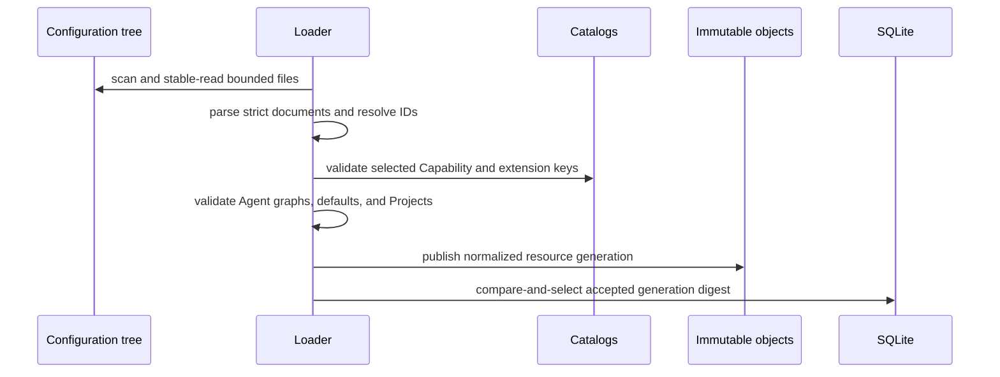

# Configuration Sources and Resources

## Design Position

Harness UI uses a small multi-file configuration tree so people can configure and inspect the CLI with an ordinary editor or another agent. Files own desired Models, configured extensions, MCP servers, Agents, local Markdown subagents, Projects, and global defaults. The separately managed [Content Plugin catalog](01b-content-plugin-repositories.md) contributes editable fallback Markdown subagents and Skill sources. SQLite records accepted-generation indexes and mutable Thread selections but never becomes a competing editable resource source.

A stable valid read of the configuration tree plus usable optional Content Plugin sources produces one accepted configuration generation. A malformed, incomplete, or changing primary configuration tree leaves the previous accepted generation active. Invalid optional plugin content is skipped with diagnostics under the [Content Plugin loading contract](01b-content-plugin-repositories.md#configuration-integration). Existing Threads retain their sticky resource IDs, but each later Run resolves those IDs from the current accepted generation.

## Configuration Tree

An explicit `--config <path>` selects the root YAML. Otherwise Harness UI selects `~/.a13n-harness-ui/a13n-harness-ui.yaml`. The root file's parent owns fixed immediate resource directories:

```text
~/.a13n-harness-ui/
  a13n-harness-ui.yaml
  AGENTS.md
  models/
    <resource>.yaml
  extensions/
    <resource>.yaml
  mcp/
    <resource>.yaml
  agents/
    <resource>.yaml
  subagents/
    <resource>.md
  projects/
    <resource>.yaml
```

Each resource file defines exactly one resource. Harness UI scans immediate lower-case `.yaml` files in the YAML directories and immediate non-README `.md` files in `subagents/`. Local Markdown subagents override an installed Content Plugin contribution with the same ID; plugin-to-plugin duplicates use deterministic precedence with diagnostics. It does not recurse, follow a symlinked directory, follow file symlinks, walk parent directories, process YAML includes, or discover ambient product configuration as a live layer.

The optional `AGENTS.md` beside the root YAML is global user-role guidance. Its exact UTF-8 content participates in the accepted generation fingerprint and source digest, under the same stable regular-file read and size limits as other primary sources. Edits and removal take effect on later accepted generations; captured Runs remain immutable. `RULES.md` and `AGENTS.override.md` are not instruction sources. Harness UI does not import guidance from ambient Codex configuration. [Composition](02-agent-composition-and-snapshots.md#resolution) owns injection and capture.

The root file owns restart-bound process settings, global defaults, and application tool switches:

```yaml
schema_version: "2"

process:
  pricing_auto_update: true
  terminal_update_check: true
  log_level: INFO
  log_format: pretty

tools:
  enable_user_input: true
  user_input_timeout_seconds: 120
  enable_codeact: false

subagents:
  include: [code-reviewer, executor, explorer]

defaults:
  project: project-agent-foundation
  agent: agent-assistant
  environment_profile: environment-native
  harness_plugins: []
  environment_run_extensions: []
  mcp_servers: []
```

`subagents.include` is an ordered unique list of release-owned names: `code-reviewer`, `executor`, and `explorer`. Omitted or `[]` includes none. Normal setup includes all three; `setup --advanced` offers all or none; individual names remain editor-configurable. These selections extend the root Run roster, not every descendant roster. They are composition inputs, not sticky Thread selections. The package owns the definitions; no definition files are copied into the configuration tree. `a13n-harness-ui config subagents` lists available roles and current inclusion. [Composition](02-agent-composition-and-snapshots.md#built-in-subagents) owns expansion, identity, inheritance, and conflict handling.

`tools.enable_user_input` defaults to `true`; disabling it excludes the built-in `ask_user_question` Capability from newly resolved Runs, including explicitly authored selections. `tools.enable_codeact` defaults to `false`; enabling it includes the native Harness CodeAct Capability with `run_code`, `run_program`, and its explicit `store`, `load`, and `forget` state tools. State bounds and persistence semantics follow the [Harness CodeAct contract](../a13n-harness/18-codeact.md). An explicit Agent `codeact` Capability configuration can narrow or tune its native runners, but cannot bypass the global disabled switch. Ordinary tool visibility filters still apply. These switches participate in accepted generations and captured compositions; they do not alter active or previously captured Runs. [Composition](02-agent-composition-and-snapshots.md#resolution) owns reconstruction.

`tools.user_input_timeout_seconds` is a positive finite number, default `120`. It controls the terminal's wait for each displayed structured question, not model execution or shell-approval timeouts. The [interactive contract](07-interactive-cli.md#decisions-cancellation-and-recovery) owns expiry and continuation behavior.

`process.pricing_auto_update` defaults to `true` and controls the App-owned upstream price updater. It is restart-bound, not a Model or Agent resource setting. The [App lifetime](05-runtime-subagents-and-surfaces.md#app-lifetime) owns update and shutdown behavior.

`process.terminal_update_check` defaults to `true` and enables the terminal-only startup package update check and confirmation prompt. It never authorizes installation; startup installation requires a fresh explicit answer. The separate `a13n-harness-ui update` command explicitly requests installation and is not controlled by this setting. `--no-update-check` disables detection for one invocation without editing configuration, and the source-development `make a13n-harness-ui` target always sets it. The [interactive contract](07-interactive-cli.md#startup-and-terminal-ownership) owns caching, confirmation, installer handoff, logging, and exit behavior. `process.log_format` continues to control noninteractive logging; interactive diagnostics are always structured files.

The root also accepts `display.theme` (`auto` by default, or `dark`/`light`), `display.mode` (`concise` by default), `display.show_status` (true), `display.max_tool_result_lines` (5, range 1–200), and `display.max_tool_argument_chars` (8192, range 128–65536). The CLI reads these at startup; explicit launch or live mode selections take precedence. These are presentation settings, not model or permission controls. Listener bind address and API key are process-local `a13n-harness-ui webui` arguments, not desired-resource configuration. The [interactive contract](07-interactive-cli.md) owns terminal behavior.

The data root is a bootstrap locator resolved before parsing this tree: explicit `--data-root`, then `A13N_HARNESS_UI_DATA_ROOT`, then `<config-directory>/data`. It owns both local persistence and the installed Content Plugin catalog. It is deliberately absent from `a13n-harness-ui.yaml`, so an invalid root edit cannot hide the SQLite database that retains the prior accepted generation. Selecting another data root opens a distinct local workstation dataset and never implies migration.

Relative process paths resolve from the root file's directory. Resource paths that represent Project roots must be explicit absolute paths after user expansion; their stored meaning never depends on the App's current working directory.

## Common Resource Envelope

YAML resources use a small common envelope followed by a kind-owned body:

```python
class ResourceDocument(BaseModel):
    schema_version: Literal["1"]
    kind: ResourceKind
    id: ResourceId
    name: str
```

`ResourceId` is a stable concise kind-prefixed identity such as `agent-reviewer`, `mcp-github`, or `project-foundation`. A filename is presentation only and need not equal the ID. IDs are unique within one resource kind. Renaming a file or display name does not change identity. Changing `id` creates a different logical resource and can leave existing Thread selections unresolved.

Unknown fields, duplicate IDs, duplicate YAML keys, aliases, anchors, merge keys, custom tags, non-finite values, excessive nesting, oversized sources, invalid UTF-8, and unsupported schema versions fail the candidate generation.

The owning contracts define the bodies:

| Kind                                               | Owner                                                                                                                                                |
| -------------------------------------------------- | ---------------------------------------------------------------------------------------------------------------------------------------------------- |
| Model                                              | [Agent and MCP Composition](02-agent-composition-and-snapshots.md#models) and [Model Authentication](02a-model-authentication-and-account-stores.md) |
| Harness Plugin, Environment profile, Run Extension | [Extension Discovery and Management](01a-extension-discovery-and-management.md)                                                                      |
| MCP server                                         | [Agent and MCP Composition](02-agent-composition-and-snapshots.md#mcp-servers)                                                                       |
| Agent                                              | [Agent and MCP Composition](02-agent-composition-and-snapshots.md#agent-resources)                                                                   |
| Markdown subagent                                  | [Agent and MCP Composition](02-agent-composition-and-snapshots.md#canonical-markdown-subagents)                                                      |
| Project                                            | [Projects, Threads, and Environments](04-projects-threads-and-environments.md#projects)                                                              |

## Accepted Generation



The loader captures configuration directory membership and each file's identity, size, modification time, bytes, and digest. It also captures release-owned built-in Markdown sources and their exact digests, plus current Content Plugin metadata, editable directory paths, diagnostics, and usable canonical Markdown. It retries a bounded number of times when membership or a file changes during capture. The source-generation digest covers the ordered source-relative identities and exact source digests, not timestamps. Normalized resource content has its own canonical digests, so presentation-only edits create a new source generation without changing behavior-derived identities such as an Environment profile digest.

Acceptance is all-or-nothing. Publishing immutable content can leave harmless unreferenced objects, but SQLite selects a generation only after every selected resource, catalog key, graph, credential reference, and default validates. A failed candidate never removes or partially updates the previous accepted generation.

The accepted generation contains normalized credential-free definitions and exact source digests. It contains no resolved credential value, native Capability, Plugin, MCP client, Provider, Environment adapter, active Thread, or Environment state.

## File Mutation and Compare-and-Set

Manual editing is always supported. A valid external save enters the next accepted generation; an invalid or incomplete save produces diagnostics while the previous generation remains active.

App mutation operations use source-content preconditions. The CLI can locate, validate, and show configuration and can invoke separately defined explicit imports, but it exposes no generic create, update, or delete operation for desired resources.

The App mutation request is:

```python
class ResourceMutationRequest(BaseModel):
    expected_source_digest: str | None
    content: str
```

Rules:

1. Creation requires `expected_source_digest=None` and uses a no-clobber destination operation. An existing destination or resource ID rejects the create.
2. Update and deletion require the exact source digest returned by the latest read.
3. Before publication the App performs a fresh stable read and rejects a missing, replaced, or differently digested source.
4. New content is validated as part of a complete candidate generation before it is published to the source path.
5. Publication uses a same-directory temporary file and atomic replacement; the App verifies the final bytes and generation afterward.
6. A stale mutation returns the latest digest and does not intentionally overwrite the newer observed source.
7. Direct editor writes do not need a Harness UI token or command. They participate through the same stable-read and generation-validation path.

Filesystem editors do not participate in an application transaction, so Harness UI does not claim distributed linearizability against an uncooperative write racing the final filesystem replacement. Stable rereads, expected digests, atomic replacement, and post-publication verification provide local no-stale-write behavior without process lock files or a proprietary file format.

## First-use Initialization

[Setup and Environment Readiness](06-setup-and-environment-readiness.md) owns the explicit guided initialization shared by surfaces. It uses this same source tree, complete candidate validation, no-clobber creation, and exact-digest default publication. It creates no alternate settings store and never rewrites an existing installation merely because a new template is available.

## Global Defaults

Global defaults initialize a new root Thread. The App resolves omitted create fields in this order:

```text
explicit Thread creation selection
then selected Agent default, where that Agent owns the axis
then root YAML global default
then the release-owned Full Control Environment profile (`environment-native`)
```

The resulting Thread stores exact resource IDs. Later global-default or file changes do not rewrite an existing Thread's selections. A Thread Run with no configuration patch therefore uses that Thread's previous sticky values.

Collection defaults are ordered exact resource IDs. Empty means select none. A missing, wrong-kind, or duplicate default rejects the candidate generation.

## Credentials

Resource files contain credential references, never credential bytes:

```python
class EnvironmentVariableSource(BaseModel):
    env: str
```

Model API-key authentication, MCP headers, MCP command environments, and Provider adapter credentials can name environment variables. Subscription Model authentication names a provider-compatible account-store kind under the rules in [Model Authentication and Compatible Account Stores](02a-model-authentication-and-account-stores.md). A Run resolves current credential material immediately before or during native use. Resolved values never enter configuration files, accepted generations, SQLite, immutable compositions, model context, diagnostics, or telemetry.

## Dynamic Values

| Change                                               | Effect                                                                                                 |
| ---------------------------------------------------- | ------------------------------------------------------------------------------------------------------ |
| Valid resource file edit                             | Later Runs resolve the new accepted content; an active Run is unchanged                                |
| Invalid or partial multi-file edit                   | Previous accepted generation remains active                                                            |
| Global default edit                                  | Affects newly created root Threads only                                                                |
| Thread configuration patch                           | Affects the admitted Run and subsequent Runs; omitted axes retain prior Thread values                  |
| Project root edit                                    | Affects later Runs of Threads selecting that Project                                                   |
| Secret value behind an unchanged reference           | Later native construction resolves the current value                                                   |
| Compatible Codex or Grok account-store change        | The next subscription-backed Model request resolves the current shared account                         |
| Newly installed extension or Capability contribution | Becomes available after catalog refresh and a successful generation; it is not auto-selected           |
| Content Plugin install or uninstall                  | Updates later generations; uninstall deletes live files even when an admitted Run captured their paths |
| Updated already imported Python extension code       | Requires a new App process                                                                             |

## Failure Semantics

| Failure                                             | Outcome                                                                            |
| --------------------------------------------------- | ---------------------------------------------------------------------------------- |
| Missing root file selected explicitly               | Startup or reload fails explicitly                                                 |
| Malformed, unstable, or duplicate resource source   | Candidate generation is rejected                                                   |
| Unknown resource reference                          | Candidate generation is rejected with the owning source location                   |
| Catalog key unavailable or ambiguous                | Candidate generation is rejected; no similarly named fallback is chosen            |
| Stale App write                                     | Mutation is rejected with the current source digest                                |
| Credential lookup failure                           | Current Run fails before the dependent external dispatch                           |
| Atomic publication fails before source replacement  | Previous accepted source and generation remain authoritative                       |
| Generation selection fails after source publication | Previous accepted generation remains selected; reload retries the published source |

## Compatibility

The root `schema_version` governs tree layout and global fields. Every resource carries its own kind schema version. A format migration writes ordinary inspectable files through the same expected-digest/no-clobber boundary. Existing content is never reinterpreted under a new version.

## Invariants

1. Files are the only editable desired-resource authority.
2. One resource file defines one stable resource ID.
3. One accepted generation is complete and coherent across the whole tree.
4. Invalid intermediate edits never partially replace the accepted generation.
5. Managed writes require expected source content and never knowingly clobber a newer observed revision; the CLI exposes no generic desired-resource write.
6. Global defaults initialize new Threads and never live-update existing Threads.
7. Credentials remain references until fresh Run construction.
8. Installed runtime-package or Content Plugin availability never grants selection.
