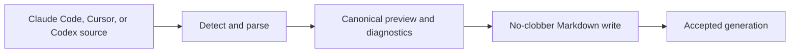
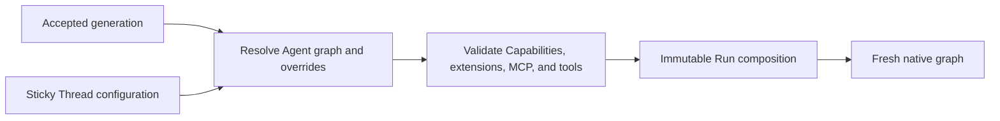

# Agent, MCP, and Run Composition

## Design Position

An Harness UI Agent is a file-defined reusable Agent configuration. A runnable Agent selects one Model, declarative Capabilities, Harness Plugins, MCP servers, instructions, tool visibility, and an ordered subagent roster. Harness UI resolves the selected Agent and the current Thread overrides into a complete finite Harness graph for each admitted Run.

Agent resources and Thread selections remain mutable between Runs. The App captures one immutable resolved Run composition before execution, then continues the existing `HarnessState` with that composition. Changing an Agent, Plugin, MCP server, Capability selection, or subagent roster affects later captures and never mutates an active Run.

## Models

One file under `models/` defines a reusable Model resource:

```yaml
schema_version: "1"
kind: model
id: model-primary
name: Primary
route: openai:gpt-5
authentication:
  kind: api_key
  env: OPENAI_API_KEY
settings: {}
model_configuration: {}
```

The release-owned Model integration selected by the route validates settings, construction configuration, and the explicit authentication kind without resolving credential bytes. API keys name environment variables; Codex and Grok subscription Models can instead select their compatible product account store. [Model Authentication and Compatible Account Stores](02a-model-authentication-and-account-stores.md) owns authentication precedence, shared login, refresh, and credential persistence.

For supported API-key HTTP providers, `model_configuration.base_url` is an optional HTTP(S) endpoint. It is part of the frozen Model recipe and is supplied to the native Provider or its native SDK client; it is not a request setting. URLs cannot contain embedded credentials, query parameters, or fragments. Local HTTP endpoints are allowed. Unknown constructor fields and subscription endpoint overrides fail validation rather than being ignored.

Setup presets expand to ordinary settings, never opaque preset references. For upstream profiles that support reasoning, OpenAI Responses presets request `openai_reasoning_summary: detailed` and `openai_store: false`, with high unified `thinking` by default. Unknown and non-reasoning OpenAI models default to neutral settings without a reasoning summary parameter. Chat Completions does not receive Responses-only summary fields. Anthropic presets select adaptive thinking with `display: summarized` and high effort for upstream profiles that support adaptive thinking, or extended thinking with an 8,192-token budget, `display: summarized`, and the interleaved-thinking beta. Both Anthropic presets use a 16,384-token output cap; profiles that reject budget thinking do not offer that preset. Google uses native unified-thinking translation, including thought summaries; OpenRouter reasoning presets set `exclude: false`. Provider-default presets avoid forcing unsupported reasoning on non-reasoning models. These are editable creation-time recommendations, not an override of existing resources or a guarantee of model support. Returned thinking means the content or summaries exposed by the provider, not private reasoning withheld by the provider. Provider-specific Anthropic, Google, OpenRouter, and Z.AI settings are validated against their matching route families. DeepSeek (`deepseek:`), GLM (`zai:`), and Kimi (`moonshotai:`) use their dedicated native Provider profiles, including `reasoning_content` parsing and replay, rather than generic OpenAI profiles. Recognized thinking-capable models offer unified `thinking: true`; Z.AI additionally sets `zai_clear_thinking: false` and uses native `ZaiModel`. Returned thinking remains in native messages through tool continuation and serialized history replay. These presets do not offer a misleading universal thinking-disable switch for always-thinking models.

### Model Characteristics and Operation Overrides

Model resources may include native `HarnessModelCharacteristics` under `model_characteristics`: `context_window`, `proactive_context_management_threshold`, and `compact_threshold`, together with the native optional capabilities field. The complete value is captured in `ResolvedModelRecipe` and passed to the fresh native `AgentSpec`. Absent values retain native defaults; old captures without this field remain readable. Host defaults do not overwrite an explicitly configured capability policy.

For the `runtime_context` capability, an omitted `context_window_tokens` is resolved from the effective Model's characteristics at capture time. An explicitly configured value remains authoritative. Native handoff reminders and compaction retain their own derivation and explicit-policy semantics.

The App accepts detached per-operation `RunModelOverrides` for a selected Model ID and reasoning effort. These values are copied before scheduling and applied while resolving the root graph, before inherited Markdown children are constructed. They do not mutate files, Thread configuration, previous compositions, or explicitly selected auxiliary/child models. Invalid selections fail without fallback. The [CLI contract](07-interactive-cli.md#agent-selection-and-reasoning) owns interactive precedence and resume behavior.

### Shell Review Auxiliary Model

`ShellReviewCapability.configuration.model` names a Model resource ID, not an ambient provider route. Harness UI validates the reference, captures its complete credential-free recipe with the Capability in the immutable Run composition, and registers it in the same per-Run Model resolver as primary Models. Subscription refresh and request-local authentication therefore apply to the reviewer as well as the main Agent. Changing or deleting the source Model does not change an already captured reviewer. The captured Model settings initialize the review request, with explicit Capability `model_settings` overriding matching keys. Auxiliary-model resolution alone does not apply request settings; the reconstructed reviewer receives the merged frozen values, including the starter Luna's low thinking level.

```yaml
capabilities:
  - capability: ShellReviewCapability
    configuration:
      model: model-codex-review
      risk_threshold: extra_high
      on_flagged: approval_required
      on_error: approval_required
```

The reviewer is tool-free and uses the Harness-owned bounded review lifecycle. Review failure requires approval by default; it never silently authorizes a command. Shell review is not filesystem, process, or network isolation and remains useful in explicitly selected Full Control mode. Setup offers a reviewed lightweight subscription Model and lets the user opt out before publication.

## MCP Servers

One file under `mcp/` defines a reusable MCP server:

```yaml
schema_version: "1"
kind: mcp_server
id: mcp-github
name: GitHub
transport:
  command: npx
  arguments: ["-y", "@modelcontextprotocol/server-github"]
  environment:
    GITHUB_TOKEN:
      env: GITHUB_TOKEN
```

Supported transport forms are:

```python
class CommandTransport(BaseModel):
    command: str
    arguments: tuple[str, ...]
    environment: dict[str, EnvironmentVariableSource]


class RemoteTransport(BaseModel):
    url: str
    headers: dict[str, EnvironmentVariableSource]
```

Literal credentials are forbidden. Remote URLs are credential-free HTTPS values. Plain HTTP is permitted only for a literal loopback host and only when `headers` is empty; Harness UI never sends secret-backed headers over plaintext transport. Redirects cannot weaken this rule or forward configured headers to another origin. Command arguments and environment names are bounded. An MCP file has no global `enabled` flag: an Agent or Thread exact selection enables it.

Every Run creates fresh MCP clients or Toolsets. MCP process handles, sessions, credentials, and discovered tools never enter files, SQLite, or continuation state. Disabling an MCP server removes it from later Run compositions; re-enabling the same resource uses its current file definition.

## Agent Resources

One file under `agents/` defines an Agent:

```yaml
schema_version: "1"
kind: agent
id: agent-assistant
name: Assistant
model: model-primary
instructions: |
  Work directly and explain material decisions.
capabilities:
  - capability: dynamic_environment
    configuration:
      files_enabled: true
      shell_enabled: true
harness_plugins: null
mcp_servers: null
tools: null
subagents:
  - markdown: subagent-explorer
  - agent: agent-reviewer
```

The conceptual model is:

```python
class AgentResource(BaseModel):
    id: AgentId
    name: str
    model: ModelId | None = None
    instructions: str = ""
    capabilities: tuple[CapabilitySelection, ...]
    harness_plugins: tuple[PluginId, ...] | None
    mcp_servers: tuple[McpServerId, ...] | None
    tools: tuple[str, ...] | None
    subagents: tuple[SubagentSelection, ...]
```

`model` may be omitted while configuring an Agent, including after skipping model connection during setup. A non-null reference must resolve in the accepted catalog. Run composition requires a Model for every selected Agent node and fails with `agent_model_required` when one is unconfigured; it never invents a provider or falls back to ambient credentials.

Every Agent receives a release-owned `system_prompt` describing Harness UI identity, evidence-based work, repository guidance, focused changes, authority and environment boundaries, validation, and accurate communication. Agent resources expose no field to replace or remove it. `instructions` contains optional user additions passed separately through native Pydantic AI `instructions`; empty or whitespace-only text adds nothing, and non-empty text does not replace the base. Markdown child bodies use this same additional-instructions channel. Capability contributions remain independently owned.

The resolver freezes exact `system_prompt` and `instructions` values separately into every new Run composition, including child nodes. Reconstruction passes both to Harness `AgentSpec` without reading the current release prompt again. Legacy captured nodes without a separate `system_prompt` retain their previously frozen combined instructions as the system prompt, rather than silently receiving new text. The separation defines composition and lifecycle ownership; it does not claim a provider-independent role hierarchy or protection against conflicting instructions.

`capabilities` uses the complete configurable catalog defined by [Extension and Capability Discovery](01a-extension-discovery-and-management.md#capability-catalog). Each selection names one serialization key and capability-owned JSON configuration. A Capability owns the Toolsets, instructions, hooks, settings, and lifecycle it contributes; Harness UI does not create a competing Toolset plugin system.

`tools`, when present, applies an exact model-visible tool allowlist after selected Capability, Harness Plugin, and MCP contributions are composed. `null` leaves the complete contributed tool surface visible. An empty list exposes none of the optional contributed tools while preserving mandatory Harness infrastructure. Unknown tool names fail composition rather than being silently ignored.

Agent `harness_plugins` and `mcp_servers` provide defaults when a new Thread is initialized from that Agent. Their three-state source semantics are:

| Value             | Meaning                                                      |
| ----------------- | ------------------------------------------------------------ |
| omitted or `null` | Use root global defaults or the parent initialization policy |
| empty list        | Select none                                                  |
| non-empty list    | Select exactly these resource IDs in order                   |

Once initialized, a Thread stores exact lists. Later Agent or global-default selection changes do not silently rewrite that Thread's lists; an explicit Thread patch does.

## Subagent Resources and Selection

An Agent roster can select another Agent resource or one canonical Markdown subagent:

```python
class AgentSubagentSelection(BaseModel):
    agent: AgentId


class MarkdownSubagentSelection(BaseModel):
    markdown: SubagentId
```

Selections use stable IDs. Users do not configure a separate fine-grained subagent permission graph. An Agent reference resolves a complete child Agent resource. Its Harness roster name is the stable Agent resource ID. A Markdown reference uses the frontmatter `name` as its roster name. Both forms must satisfy the Harness roster-name syntax, and the resolved names must be unique within the immediate roster.

A child Thread persists the same discriminated Agent or Markdown source reference rather than inventing a synthetic Agent ID. Agent-to-Agent references are resolved from the accepted configuration generation. Cycles, duplicate immediate roster names, missing resources, excessive depth, and excessive expanded node count reject the generation or Run capture before native construction.

## Built-in Subagents

Harness UI ships canonical Markdown definitions for `code-reviewer` (risk-proportionate independent review), `executor` (bounded autonomous execution), and `explorer` (repository exploration). Their stable source IDs are `subagent-builtin-<name>`; the frontmatter name is the delegate roster name. Package sources participate in the accepted generation under `built-in-subagents/`, not a writable configuration path. The IDs are reserved: a local or plugin definition cannot replace them. Local `subagent-explorer` remains a separate resource.

Root `subagents.include` appends selected built-ins after authored Agent edges, in configured order. An already authored edge to the identical built-in ID is not added twice. Distinct sources with the same immediate roster name fail composition rather than silently overriding each other. Inclusion does not recursively append defaults to child Agent nodes; Markdown children remain leaves. Explicit Agent edges can select built-ins by their Markdown IDs when desired.

Built-ins inherit the parent's complete model recipe, Capabilities, and visible tools under the ordinary Markdown normalization path. They introduce no alternative runner or permissions. Instructions constrain intended roles, not tool authority. Resolved bodies, routing instructions, and inherited values are frozen into each composition; later package upgrades or inclusion edits affect later captures only. Previously captured native graphs reconstruct without rereading current package definitions.

## Canonical Markdown Subagents

Markdown reference availability is validated when resolving the selected Agent, not across every configured Agent. Resolved roster-name conflicts fail the affected composition explicitly. Invalid optional plugin files remain diagnosed under the [Content Plugin loading contract](01b-content-plugin-repositories.md#configuration-integration).

Immediate local `subagents/*.md` files and installed Content Plugin `subagents/*.md` files provide a concise human-authored child format compatible with the common Claude Code shape and the minimal YAACLI adapter pattern. Local files override plugin content with the same ID under the [Content Plugin precedence contract](01b-content-plugin-repositories.md#configuration-integration):

```markdown
---
name: explorer
description: Inspect an unfamiliar codebase.
instruction: Use this child for focused repository exploration.
tools: [glob, grep, ls, view]
---

Inspect the relevant code and report evidence with exact file paths.
```

The file stem is presentation; the canonical resource ID is `subagent-<name>` unless an explicit valid `id` field is present. The supported frontmatter is deliberately small:

| Field         | Meaning                                                   |
| ------------- | --------------------------------------------------------- |
| `id`          | Optional stable Harness UI resource ID                    |
| `name`        | Required child roster name                                |
| `description` | Required parent-facing description                        |
| `instruction` | Optional additional parent-facing routing guidance        |
| `tools`       | Optional exact visible tool names over the child template |

The Markdown body is the child instruction block. Markdown has no `model` field, including no `model: inherit` spelling. Use an Agent resource reference for an independent model or settings; remove legacy Markdown model fields when upgrading source files. Captured Run model recipes remain unchanged. Retained normalized configuration generations may still contain their historical `model` field; decoding and child admission preserve that historical recipe. This is a storage read-compatibility rule, not an accepted field in new Markdown sources. `tools` accepts either a comma-separated scalar, matching the common Claude Code form, or a YAML sequence; Harness UI trims entries and normalizes them to ordered unique names. Harness UI does not encode approval modes, sandbox policy, writable roots, spawn grants, execution modes, durability tiers, or nested permission matrices in this concise format.

At initial child admission, a Markdown source is normalized against the admitting parent Run capture. On linked resume, the current parent Run capture under the same stable roster name supplies the inheritance source again. The Markdown definition always inherits the parent's resolved Model and inherits the parent's Capability selections. Its body replaces Agent instructions, optional `tools` replaces the inherited visible-tool allowlist, and its nested subagent roster is empty. The child Thread's exact sticky Harness Plugin and MCP lists apply after this normalization; their initial values come from the first admitting parent.

The release-owned normalizer supplies the same output, recovery, package-prompt, and mandatory-infrastructure contracts used for an ordinary child node. These resolved values are captured in each child Run composition; the persisted child Thread retains the Markdown source ID and can resolve later accepted edits on its next linked Run. Parent changes affect only fields that the Markdown format explicitly inherits, not the child Thread's sticky Project, Environment profile, Plugin, Run Extension, or MCP selections.

A Markdown child is therefore normalized into the same complete resolved child Agent node used by an Agent reference without a hidden mutable template. It can be selected by stable ID from Agent YAML. The canonical format remains directly editable and does not require a generated native sidecar.

## External Subagent Import

Harness UI provides one explicit quick-import operation for Claude Code, Cursor, and Codex subagent definitions. Import is a convenience boundary, not a live synchronization layer. An explicit `inherit_runtime` preview option omits external model and tool selections and reports that the imported child inherits the parent's effective model and visible tools. The default import preserves representable tool selections. All Markdown imports inherit the parent model; non-inherit external model fields are omitted with a diagnostic directing users to an Agent resource reference. Both modes preserve instructions and diagnose unsupported external settings. Importing a definition does not enroll it in an Agent roster. CLI onboarding previews and confirms import plus explicit roster enrollment; the definition writes and Agent source mutation remain separate compare-and-set publications. Partial success is reported without implying rollback.



The operation:

1. scans only the explicitly selected product and user or Project scope;
2. parses the source product's supported Agent definition fields;
3. maps name, description, instructions, and exact tool names when representable;
4. reports unsupported permissions, hooks, Skills, MCP, provider, and product-specific behavior without applying it implicitly;
5. renders canonical Harness UI Markdown deterministically;
6. requires expected source and target facts before apply;
7. never overwrites, silently renames, modifies, or synchronizes the source files.

Semantically identical imports are unchanged or deduplicated. A different existing target conflicts. Newly written Markdown enters behavior only after a successful configuration-generation reload. The concrete adapters and source precedence are implementation details as long as this observable boundary remains stable.

## Resolution

Every resolved Agent node captures the accepted configuration directory's global `AGENTS.md` guidance separately from authored native Agent instructions. Reconstruction injects that captured guidance through user-role model-context blocks on eligible input requests; it never places it in the model/native `instructions` field. Current empty guidance explicitly supersedes earlier global blocks. Legacy captures without this field retain their original reconstruction behavior rather than reading current files.

Harness UI includes the Harness Working State Capability in every newly captured Agent definition unless that capability is explicitly configured. The root document's [tool switches](01-configuration-and-resource-catalog.md#configuration-tree) include User Interaction by default and CodeAct only when enabled; disabled switches exclude those capabilities even when authored explicitly. Enabled capabilities preserve explicit Agent configuration rather than adding duplicates. The default Working State configuration enables native task tools without enabling private note tools, and retains native continuation semantics; explicit configuration, including disabled tools or provider-backed state, remains authoritative. User Interaction exposes `ask_user_question` only to independent roots under the Harness's existing parent-instance rule. Tool visibility filters still apply. These defaults are captured before native construction, not injected into an active Run; previously captured compositions remain unchanged.

Harness UI also includes the Harness File Context Capability by default, reading only `AGENTS.md` in the bound Environment's current working directory. It does not search ancestors, `AGENTS.override.md`, or `RULES.md`. An explicitly configured File Context Capability retains its configured paths and bounds without adding a duplicate Capability. Global guidance precedes working-directory file guidance. Both sources use the Harness [model-context metadata contract](../a13n-harness/09-context-and-memory.md#model-context-projection-contract), remaining model-visible but hidden in ordinary live and retained presentation.

For each Run, Harness UI:

1. captures the accepted file-and-Content-Plugin generation and Thread configuration version;
2. resolves the Thread's current Agent-resource or Markdown-subagent source;
3. applies exact Thread Harness Plugin and MCP lists to the root Agent;
4. resolves Capability selections, tool visibility, and every subagent edge;
5. resolves current Model, Plugin, MCP, and Capability definitions;
6. validates the finite graph and installed catalogs;
7. records available dependency provenance for selected Capability and extension implementations;
8. publishes one immutable resolved Run composition before external work.



The resolved composition contains complete normalized Agent nodes, Models, Capability specs, selected Harness Plugin and MCP recipes, subagent edges, package prompt identity, Project roots, the exact installed Content Plugin identities and captured editable paths, Environment profile selection, Environment Run Extensions, and dependency provenance. A selected `skills` Capability captures only its ordered explicit Environment roots; automatic Project, plugin, and user sources are derived during fresh reconstruction under [Environment Skill Sources](02b-environment-skill-sources.md). The composition contains no Skill bytes or discovered catalog, credential bytes, native client, Environment adapter, task, callback, or active state coordinator.

## Continuing Across Composition Changes

The selected prior `HarnessState` remains the continuation authority when a later Run uses a different composition. Message history and detached Capability namespaces are preserved.

A disabled Capability namespace remains stored but inactive. Re-enabling the same stable Capability ID can read its prior state. A changed implementation or state version that cannot validate that namespace fails explicitly; Harness UI does not silently clear or rewrite it. MCP clients carry no Harness UI durable state. Provider state follows the separate Environment binding contract.

Every continuation bundle records the Run composition that produced it. This is provenance, not a restriction that the next Run use the same composition.

## Invariants

1. Agent, Model, MCP, local Markdown, and installed plugin Markdown resources are human-editable current definitions.
2. Agent configuration selects Capabilities; Capabilities own Toolsets.
3. Thread selections can replace Agent Plugin and MCP defaults between Runs.
4. Every Run captures a complete immutable composition before native construction.
5. A captured Agent definition never changes when configuration files or Thread selections change. Environment-routed plugin files remain live and can be edited or deleted; their paths do not pin content.
6. Canonical Markdown remains small and broadly compatible rather than encoding a complete authorization system.
7. Claude Code, Cursor, and Codex import is explicit, previewable, diagnostic, and no-clobber.
8. `HarnessState` can continue across supported composition changes without silently discarding component state.
9. Skill source configuration is captured in the Agent node, while each independent Run derives and freezes its own Environment-routed catalog.
