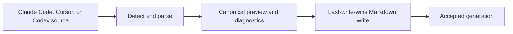
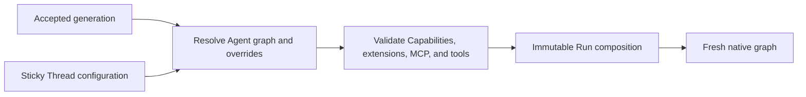

# Agent, MCP, and Run Composition

## Design Position

An Harness UI Agent is a file-defined reusable Agent configuration. A runnable Agent selects one Model, declarative Capabilities, Harness Plugins, MCP servers, instructions, tool visibility, and an ordered subagent roster. Harness UI resolves the selected Agent and the current Thread overrides into a complete finite Harness graph for each admitted Run.

Agent resources and Thread selections remain mutable between Runs. The App captures one immutable resolved Run composition before execution, then continues the existing `HarnessState` with that composition. Changing an Agent, Plugin, MCP server, Capability selection, or subagent roster affects later captures and never mutates an active Run.

Root admission captures `role` (`ordinary`, `coordinator`, or `worker`) and nullable `coordinator_thread_id` from durable role and ownership records. These values do not depend on Sidekick or automatic follow-up. Historical captures lacking `role` remain readable with null (not recorded), without inferring a role from legacy fields or rewriting immutable objects. Child compositions inherit neither role nor owner. Each new root admission, including deferred execution and planned restart recovery, refreshes role and owner from durable state. Planned restart retains the other captured dependency settings and publishes a new capture only when these identity fields differ. Coordinator and worker instructions are injected on every applicable WebUI root Run, including messages and resumed execution. Active Runs retain their capture.

## Models

One file under `models/` defines a reusable Model resource:

```yaml
schema_version: "1"
kind: model
id: model-primary
name: Primary
route: openai:gpt-5
authentication:
  kind: api_key
  env: OPENAI_API_KEY
settings: {}
model_configuration: {}
```

The release-owned Model integration selected by the route validates Host construction configuration and the explicit authentication kind without resolving credential bytes. Model `settings` are an opaque JSON-compatible mapping: Harness UI preserves all keys, nested values, explicit nulls, and string whitespace without a parameter allowlist, value-range checks, provider-family filtering, or default insertion. Immutable composition and fresh Agent construction forward the mapping to Harness/Pydantic AI. Native Models and providers own parameter semantics, precedence, and errors at use time; configuration acceptance does not construct a Model or issue a request to validate settings. API keys name environment variables or Host-local key references; Codex, Grok, and Copilot subscription Models select their provider-specific account source. [Model Authentication and Compatible Account Stores](02a-model-authentication-and-account-stores.md) owns authentication precedence, shared login, refresh, and credential persistence.

For supported API-key HTTP providers, `model_configuration.base_url` is an optional HTTP(S) endpoint. It is part of the frozen Model recipe and is supplied to the native Provider or its native SDK client; it is not a request setting. URLs cannot contain embedded credentials, query parameters, or fragments. Local HTTP endpoints are allowed. Unknown constructor fields and subscription endpoint overrides fail validation rather than being ignored. The separate `xai:` API-key route constructs upstream's native gRPC SDK Provider with its default endpoint and rejects `base_url`; the `grok:` API-key route remains Chat Completions.

For API-key Google connections, `google:` selects the Gemini Developer API and `google-cloud:` selects the native Google Cloud transport. The existing `google-gla:`, `google-vertex:`, and `gemini:` aliases retain Harness's Google Cloud route mapping. These routes accept a custom `model_configuration.base_url`; validation preserves the selected route and endpoint rather than replacing Cloud with Developer API. The native SDK owns version and resource-path construction. This does not add Cloud IAM or service-account authentication to Harness UI's API-key recipes.

`model_configuration.session_affinity_header: str | None` is an optional gateway header name, disabled when absent or null. It is captured with `base_url` in the immutable Model recipe and never stored as a fixed native `settings.extra_headers` value. The adapter rejects a case-insensitive static setting collision with this Host-managed name. The resolver binds the selected header through `RequestHeadersModel` using the shared [UUID v5 request-affinity derivation](../a13n-harness/16-input-model-and-output.md#automatic-request-affinity) of the current resolution context's `AgentContext.thread_id`, including independently resolved child and auxiliary Models. Only the header name is captured; the derived value is not persisted. CLI and WebUI presets come from Harness's shared authoring catalog; selecting one saves only its concrete, freely replaceable name. Presets are not gateway detection or a routing guarantee. Native routes without generic HTTP header support and subscription connections reject the field. Harness UI disables Builder-wide legacy gateway injection; missing fields in old captures remain disabled and old captures are not rewritten. Codex native session identifiers are bound separately to the current Thread.

Setup presets expand to ordinary settings, never opaque preset references. For upstream profiles that support reasoning, OpenAI Responses presets request `openai_reasoning_summary: detailed` and `openai_store: false`, with high unified `thinking` by default. Unknown and non-reasoning OpenAI models default to neutral settings without a reasoning summary parameter. Chat Completions does not receive Responses-only summary fields. Anthropic presets select adaptive thinking with `display: summarized` and high effort for upstream profiles that support adaptive thinking, or extended thinking with an 8,192-token budget, `display: summarized`, and the interleaved-thinking beta. The interleaved preset retains its 16,384-token output cap; reviewed adaptive presets use 32,768 tokens, while unreviewed model IDs retain the existing 16,384-token baseline. Profiles that reject budget thinking do not offer that preset. Google uses native unified-thinking translation, including thought summaries; OpenRouter reasoning presets set `exclude: false`. Provider-default presets avoid forcing unsupported reasoning on non-reasoning models. These are editable creation-time recommendations, not an override of existing resources or a guarantee of model support. Returned thinking means the content or summaries exposed by the provider, not private reasoning withheld by the provider. Provider-specific settings retain their native semantics and are not cross-checked against route families by Harness UI. DeepSeek (`deepseek:`), GLM (`zai:`), and Kimi (`moonshotai:`) use their dedicated native Provider profiles, including `reasoning_content` parsing and replay, rather than generic OpenAI profiles. Recognized thinking-capable models offer unified `thinking: true`; Z.AI additionally sets `zai_clear_thinking: false` and uses native `ZaiModel`. Returned thinking remains in native messages through tool continuation and serialized history replay. These presets do not offer a misleading universal thinking-disable switch for always-thinking models.

Thinking and output recommendations are one Harness UI-owned creation-time preset shared by first-use landing, Add Model, and Add Agent with a new Model. The picker and final summary expose the output cap or native-default behavior before publication. Release-reviewed exact model/provider pairs materialize a per-request `max_tokens` alongside thinking; these caps are product recommendations, not provider hard limits. Provider-default presets never inject `max_tokens`. Unreviewed IDs and routes retain their existing preset behavior, including the Anthropic baseline required to accommodate explicit thinking. Model-name prefixes, suggestions, and working context budgets do not establish an output recommendation. Reviewed IDs behind custom endpoints receive the same editable values without a claim of endpoint compatibility. Subscription templates are not API presets. Native adapters retain request-field translation and accounting ownership.

Preset expansion does not run when loading resources, reconstructing a Run, reusing an existing Model, or accepting explicitly authored setup API settings. It creates neither a persisted preset/auto reference nor a Harness runtime policy. Changing the temporary thinking override does not recalculate an existing output cap. Concrete release-owned values and model IDs are documented in [Models and authentication](../../docs/a13n-harness-ui/models-and-authentication.md#paired-output-budgets).

### Model Characteristics and Operation Overrides

Model resources may include native `HarnessModelCharacteristics` under `model_characteristics`: `context_window_tokens`, `proactive_context_management_threshold`, and `compact_threshold`, together with the native capabilities and `image_input` fields. The complete value is captured in `ResolvedModelRecipe` and passed to the fresh native `AgentSpec`. Absent values retain native defaults; old captures without this field remain readable. Host defaults do not overwrite an explicitly configured capability policy.

`model_characteristics.image_input` uses the Harness-owned [image input policy](../a13n-harness/16-input-model-and-output.md#request-and-history-filters). Omission enables default preparation, an object customizes the policy, and explicit null disables automatic preparation. The selected root, independently selected child, and image-understanding Model each own their policy; an image auxiliary call does not inherit the caller's policy. Captured policies govern reconstruction, even after the Model resource changes. The exact default policy is omitted from canonical captures to preserve historical serialization and recipe identities; explicit null remains present.

For the `runtime_context` capability, an omitted `context_window_tokens` is resolved from the effective Model's characteristics at capture time. An explicitly configured value remains authoritative. Native handoff reminders and compaction retain their own derivation and explicit-policy semantics.

Root composition resolves the Model using the [Thread default precedence](04-projects-threads-and-environments.md#sticky-thread-configuration): explicit Run Model, saved Thread default, then selected Agent Model. The App accepts detached per-operation `RunModelOverrides` for a selected Model ID, reasoning effort, and generic `service_tier` (`auto`, `default`, `flex`, or `priority`). Omitted reasoning and service-tier overrides inherit the Model resource settings verbatim. Explicit thinking values use the shared model-aware control resolver described below; explicit service-tier values replace the generic field through the native Model integration. An explicit service-tier override also removes the selected provider's native tier field from the per-Run copy so native precedence cannot defeat an explicit tier selection. Without that override, native fields remain intact and retain upstream precedence. These values are copied before scheduling and applied while resolving the root graph, before inherited Markdown children are constructed. They do not mutate files, Thread configuration, previous compositions, or explicitly selected auxiliary/child models. Invalid selections fail without fallback. The [CLI contract](07-interactive-cli.md#agent-selection-and-reasoning) owns interactive precedence and resume behavior.

### Reasoning Mode Controls

A nullable per-operation `reasoning_mode` selects `standard` or `pro`; null inherits the selected Model resource. It is independent of thinking effort, reasoning summaries, and Fast. The shared typed selection and application path carry these controls together without merging their provider-specific rules. Existing flat request fields remain compatible; controls are not sticky Thread configuration.

Explicit mode choices require a Responses transport (`openai`, `openai-responses`, or `openai-codex`) and the installed SDK profile's reasoning-mode support. They write only `openai_reasoning_mode` in the detached settings copy. Any `extra_body.reasoning` rejects the choice, because the native SDK replaces the whole reasoning object even when the custom value only contains a sibling such as summary. Default inheritance preserves opaque authored settings even on an unsupported connection; it does not validate or rewrite them.

The selector descriptor reports support, a reason, and the authored state: `standard`, `pro`, `default` (absent/null provider default), or `custom` (unrecognized or conflicting configuration). Default is not Standard. Unsupported native mode settings are custom, not a claim that the transport sends them. Inspection derives captured mode from immutable settings, never from the current Model file or next-Run draft. Inherited Markdown children follow the parent; independent child and auxiliary Models keep their own settings. These are requested settings, not account entitlement, billing, or latency guarantees.

### Fast Request Controls

The nullable per-operation `fast` selection accepts `true` for Fast, `false` for standard processing, or `"ultrafast"` for Ultrafast; null inherits the Model settings unchanged. Existing boolean inputs retain their meaning. It is mutually exclusive with a raw `service_tier` override. CLI and WebUI share local support checks, native translation, and safe `on`/`off`/`ultrafast`/`default` summaries. No account probe, remote capability catalog, entitlement check, or provider-speed measurement is performed. Unknown connections disable explicit controls with a reason; authored native settings remain available independently.

OpenAI API and Codex subscription routes use the native SDK's priority/default service-tier mapping. Explicit Ultrafast is supported only for `openai-codex:gpt-6-astra` and sends `service_tier: ultrafast` through the same native request path. Local capability summaries expose Ultrafast support and its unavailability reason separately from Fast; provider account eligibility remains external. The WebUI places mutually exclusive Fast and Ultrafast buttons together for Codex Models, with one inheritance reset and an eligibility/cost notice. Explicit Ultrafast on an unsupported connection fails rather than falling back to Fast. Reviewed direct Anthropic models use `anthropic_speed: fast/standard`, not Anthropic Priority Tier. Reviewed Gemini API routes use the SDK's generic priority/default translation; this does not imply support for Vertex provisioned throughput or subscription connections. Custom endpoints retain their own compatibility responsibility. Conflicting custom body/header controls reject explicit overrides rather than defeating a visible switch. Other settings, including thinking, remain unchanged.

Effective settings are captured in the existing immutable composition. Configuration inspection reports captured Fast separately from mutable next-Run choices. An absent or unrecognized setting is `default`, not an assertion that Fast is off. These values describe requested configuration, not service fulfillment, billing, or guaranteed latency. Inherited Markdown children follow the root override; independently selected child and auxiliary models retain their settings.

### Model-Aware Thinking Controls

Harness UI owns one thinking-control descriptor and resolver for explicit interactive overrides. Discovery uses the selected adapter, model ID, and installed SDK profiles, supplemented by reviewed effort sets where profiles do not enumerate them. It does not construct a Model, resolve credentials, or contact a provider. The selector catalog publishes `status` (`supported`, `unsupported`, or `unknown`), a safe `default_summary`, a reason when applicable, and ordered options with values, labels, descriptions, and optional disabled reasons. CLI and browser clients render this descriptor rather than maintaining provider tables.

The default option has a null value and inherits authored settings verbatim, including native thinking fields and their precedence. Explicit options can include booleans and named effort levels; the descriptor, not the type's union of values, determines what a Model accepts. Off is offered only when supported and is distinct from minimal effort. Budget-based options expose their concrete token budget, not a claim of native effort support. Unknown models/adapters offer only default with an explanation; unsupported models do not receive guessed controls.

An explicit selection replaces the selected adapter's competing thinking controls in a detached settings copy, including native fields that would otherwise defeat a generic override. Unrelated settings and supported native siblings such as summary/display preferences remain intact. Controls blocked by custom `extra_body` thinking fields or an insufficient configured output limit explain the conflict and are rejected at capture. Thinking never changes `max_tokens`, silently clamps a budget, or falls back to another option. This validation applies only to explicit controls, not arbitrary authored settings.

Immutable compositions retain the effective native settings and explicit selection for later inspection and the existing CLI resume rules. Summaries describe requested configuration, not observed provider behavior. Selecting default restores the current Model resource rather than converting its native settings into a new explicit override. This introduces no persisted Thread thinking preference and does not change Harness settings semantics.

### Shell Review Auxiliary Model

Harness UI exposes the root `security.shell_review` shortcut rather than raw permission/review Capabilities in ordinary authoring. When `enable: true`, every Agent resource resolves through one `ToolPermissionsCapability` containing permission rules and nested `review` configuration, merged with the root shortcut before validation and immutable capture. The exact permission rule `environment.shell_exec: review` overrides any Agent shell permission, including `allow`, `deny`, or `ask`; unrelated rules and the permission default remain intact. No wildcard review permission is injected. Markdown children inherit the merged parent Capabilities; independent Agent children merge their own policy with the same root shortcut.

An explicitly supplied shortcut `model` overrides the Agent reviewer Model. Omission or null preserves it, falling back to the effective Agent Model, including operation-level settings, only when no reviewer Model is configured. Explicit reviewer Model selections never inherit operation-level overrides from the main Model. Explicit `risk_threshold` and `on_flagged` fields override the shell rule, not unrelated tools or the global review threshold. This exact shell rule preserves the previously effective rule's other fields under the Harness single-best-selector contract. Omitted/null threshold and flagged action preserve the Agent policy, falling back to `extra_high` and `approval_required`. Explicit `on_error` overrides the reviewer error policy; null/omission inherits it, falling back to `allow`. Other authored reviewer settings remain intact; newly supplied defaults are `on_flagged: approval_required` and `on_error: allow`. Invalid permission/review configuration or an unavailable reviewer Model rejects composition/validation rather than dropping the permission Capability, whether or not the shortcut is enabled.

Disabled or omitted `enable` performs no injection, removal, or override: explicit Agent permission rules remain effective. Unlike optional feature Capabilities, invalid permission/review configuration is fatal rather than skipped, so a reviewer error cannot discard authored `deny` or `ask` rules. Advanced Agent configuration uses the same `ToolPermissionsCapability` with nested `review`; there are no separate review Capability aliases or configuration conversions.

All tools default to allow without review in Harness. Reviewer configuration and risk rules alone do not activate review; the shortcut explicitly selects shell review permission. Review risk/reason, computed policy decisions, source-aware approval, history, and usage use the same Harness path. Only shell review has specialized best-effort terminal rendering. Rendering reads the shared review result and approval metadata; missing display fields never change authorization. A reviewer approval is not a separate tool-policy approval.

`ToolPermissionsCapability.configuration.review.model` names a Model resource ID, not an ambient provider route. Harness UI validates the reference, captures its complete recipe without resolving authentication credentials with the Capability in the immutable Run composition, and registers it in the same per-Run Model resolver as primary Models. Subscription refresh and request-local authentication therefore apply to the reviewer as well as the main Agent. Changing or deleting the source Model does not change an already captured reviewer. The captured Model settings initialize the review request, with explicit `review.model_settings` overriding matching keys. Auxiliary-model resolution alone does not apply request settings; the reconstructed reviewer receives the merged frozen values, including provider-specific fields such as `openai_store: false` and the starter Luna's low thinking level. Capability construction preserves these provider settings rather than narrowing them to the provider-neutral settings schema.

```yaml
security:
  shell_review:
    enable: true
    model: model-codex-review
    risk_threshold: extra_high
```

The reviewer has no execution tools and uses the [Harness-owned bounded review lifecycle and output-tool protocol](../a13n-harness/07-tool-execution.md#model-backed-review-and-shell-specialization). The Harness UI shortcut supplies `on_error: allow` when the Agent does not specify it, so non-timeout review failure adds no restriction; invocation-policy denial and approval requirements still apply. Review timeout always denies before execution, regardless of `on_error`. The Harness library defaults `on_flagged` to `deny` and `on_error` to `approval_required`. Human waiting uses the uniform CLI Host interaction timeout, regardless of tool type. Shell review is not filesystem, process, or network isolation and remains useful in explicitly selected Full Control mode. Setup offers a reviewed lightweight subscription Model or reuses the connected API-key Model and lets the user opt out before publication. Existing root shortcut fields are preserved.

### Media Understanding Auxiliary Models

A resolved Run composition captures each configured root media-understanding Model as an independent complete recipe, including settings, connection configuration, characteristics, and authentication references without secret bytes. Missing media captures deserialize as empty and preserve legacy canonical serialization. Changes to the accepted configuration affect future captures only; recovery reconstructs captured recipes. Root and child execution bind the provider using the actual executing Harness Thread identity.

Harness file `view` owns native-first dispatch. Native-capable Models receive media directly without constructing auxiliary providers or resolving their credentials. Otherwise the per-kind configured recipe takes precedence over Harness environment fallback. Unconfigured kinds retain that fallback independently, including in partially configured compositions. Configured resolution or inference failures do not fall back to an ambient Model. Cancellation propagates normally.

Auxiliary inference uses the selected Model's own settings and normal Host credential/session-affinity resolution. Primary Model settings and operation thinking/fast overrides do not leak into it. The adapter is lazy and Run-local; neither validation nor reconstruction sends a provider request. There are no forced-proxy modes or per-Agent overrides, and composer attachment behavior is unchanged.

## MCP Servers

Files under `mcp/` use lower-case `.yaml` or `.json`. Either format accepts one canonical reusable MCP server:

```yaml
schema_version: "1"
kind: mcp_server
id: mcp-github
name: GitHub
transport:
  command: npx
  arguments: ["-y", "@modelcontextprotocol/server-github"]
  environment:
    GITHUB_TOKEN:
      env: GITHUB_TOKEN
```

Either format also accepts a top-level `mcpServers` object with no other top-level fields:

```json
{
  "mcpServers": {
    "local": {
      "command": "python",
      "args": ["server.py"],
      "env": {"API_TOKEN": "example-token", "REGION": "${SERVICE_REGION}"}
    },
    "remote": {
      "url": "https://mcp.example.com/mcp",
      "headers": {"Authorization": "Bearer ${API_TOKEN}"}
    }
  }
}
```

Each named entry normalizes to a version-1 `mcp_server` resource. Its name is preserved for display; its ID lowercases the name, replaces runs outside `[a-z0-9]` with `-`, trims surrounding hyphens, and adds `mcp-` unless already present. If no ASCII alphanumeric characters remain, the suffix is the first 12 lowercase hex characters of the original name's UTF-8 SHA-256 digest. Names are non-empty and at most 256 characters; resulting IDs meet the ordinary 128-character resource ID constraint. Normalized-name collisions and cross-file ID duplicates reject the candidate, with no precedence rule.

Entries use `command`, optional `args`/`env`, or `url`/optional `headers`, never both transports. Optional `type` is `stdio` for commands or `http`/`streamable-http` for remote servers; omission infers the type. `args` and `env` normalize to `arguments` and `environment`. Unknown fields, including `disabled` and legacy SSE transport selection, fail explicitly. Discovery never enables a server. This compatibility surface does not claim every client's configuration dialect or OAuth workflow.

Serialized input values in `environment`/`env` and `headers` accept literal strings or the existing `{env: VARIABLE}` object. Strings replace each `${NAME}` occurrence with a non-empty process environment value at fresh Run construction; NAME matches `[A-Za-z_][A-Za-z0-9_]*`. Expansion is single-pass with no shell or default syntax. Empty literal strings and whitespace are preserved. Missing/empty referenced variables fail before dispatch. Commands, arguments, and URLs are not interpolated. Internal file-source references are not accepted as user-authored value objects.

After loading, normalized transport forms contain only value sources (environment references or captured file-field references under [Credentials](01-configuration-and-resource-catalog.md#credentials)):

Conceptual normalized schemas:

```python
class CommandTransport(BaseModel):
    command: str
    arguments: tuple[str, ...]
    environment: dict[str, McpValueSource]


class RemoteTransport(BaseModel):
    url: str
    headers: dict[str, McpValueSource]
```

Literal environment/header credentials are permitted in user-owned source files, but not copied into normalized resources, configuration display, or Run compositions. Remote URLs remain credential-free HTTPS values. Plain HTTP is permitted only for a literal loopback host and only when `headers` is empty; Harness UI never sends secret-backed headers over plaintext transport. Redirects cannot weaken this rule or forward configured headers to another origin. Command arguments and environment names are bounded. An MCP file has no global `enabled` flag. An Agent or Thread exact selection enables it as generic MCP. In WebUI, enabled `webui.mcp_apps.servers` independently adds App servers to every root and child Agent; effective selection is the ordered, deduplicated union of generic and App server IDs. CLI/local mode uses only generic MCP selections.

Every Run creates fresh MCP Toolset adapters. Ordinary servers also receive fresh clients; explicitly enabled [MCP Apps](09-mcp-apps.md) adapters borrow the App-owned Thread/server connection across Runs. MCP process handles, sessions and resolved credentials never enter managed snapshot files, SQLite or continuation state. MCP Apps retain the original public tool descriptor, raw result and resource as immutable presentation objects, with small references on actual tool returns; these snapshots are not live discovery or execution authority. Removing a server from generic selection does not remove it while WebUI Apps still selects it. Removing it from Apps selection prevents new App admission and retires the retained connection, but preserves generic MCP use when independently selected. Removing it from both selections removes it from later Run compositions; re-enabling the same resource uses its current file definition.

## Agent Resources

One file under `agents/` defines an Agent:

```yaml
schema_version: "1"
kind: agent
id: agent-assistant
name: Assistant
model: model-primary
instructions: |
  Work directly and explain material decisions.
capabilities:
  - capability: dynamic_environment
    configuration:
      files_enabled: true
      shell_enabled: true
harness_plugins: null
mcp_servers: null
tools: null
subagents:
  - markdown: subagent-explorer
  - agent: agent-reviewer
```

The conceptual model is:

```python
class AgentResource(BaseModel):
    id: AgentId
    name: str
    model: ModelId | None = None
    instructions: str = ""
    capabilities: tuple[CapabilitySelection, ...]
    harness_plugins: tuple[PluginId, ...] | None
    mcp_servers: tuple[McpServerId, ...] | None
    tools: tuple[str, ...] | None
    tool_proxy: AgentToolProxy | None = None
    subagents: tuple[SubagentSelection, ...]
```

`model` may be omitted while configuring an Agent, including after skipping model connection during setup. A non-null reference must resolve in the accepted catalog. Run composition requires a Model for every selected Agent node and fails with `agent_model_required` when one is unconfigured; it never invents a provider or falls back to ambient credentials.

Every Agent receives a release-owned `system_prompt` describing Harness UI identity, evidence-based work, repository guidance, focused changes, authority and environment boundaries, validation, and accurate communication. Agent resources expose no field to replace or remove it. `instructions` contains optional user additions passed separately through native Pydantic AI `instructions`; empty or whitespace-only text adds nothing, and non-empty text does not replace the base. Markdown child bodies use this same additional-instructions channel. Capability contributions remain independently owned.

The resolver freezes exact `system_prompt` and `instructions` values separately into every new Run composition, including child nodes. Reconstruction passes both to Harness `AgentSpec` without reading the current release prompt again. The composition decoder normalizes legacy captured nodes without a separate `system_prompt` to their previously frozen combined instructions as the system prompt and empty additional instructions, rather than silently receiving new text. The separation defines composition and lifecycle ownership; it does not claim a provider-independent role hierarchy or protection against conflicting instructions.

`capabilities` uses the complete configurable catalog defined by [Extension and Capability Discovery](01a-extension-discovery-and-management.md#capability-catalog). Each selection names one serialization key and capability-owned JSON configuration. A Capability owns the Toolsets, instructions, hooks, settings, and lifecycle it contributes; Harness UI does not create a competing Toolset plugin system.

`tools`, when present, applies an exact canonical target tool allowlist after selected Capability, Harness Plugin, and MCP contributions are composed, subject to mandatory Harness tool-surface rules. `null` uses the Host's default contributed surface. For the release-owned Full Control (`environment-native`) profile only, that default declares managed `filesystem.mkdir`, `filesystem.remove`, `filesystem.copy`, and `filesystem.move` superseded by managed `environment.shell_exec`, including when auxiliary file-only mounts are present. Harness hides those tools only when the Shell target survives preparation. The default applies independently to each root or child node whose resolved `tools` is `null`; it does not alter explicit tool lists, Sandbox/custom profiles, or execution permissions. Unmanaged tools and unrelated managed tools are not selected by visible-name resemblance. An empty list exposes none of the optional contributed tools while preserving mandatory Harness infrastructure. Unknown tool names fail composition rather than being silently ignored.

Agent `harness_plugins` and `mcp_servers` provide defaults when a new Thread is initialized from that Agent. Their three-state source semantics are:

| Value             | Meaning                                                      |
| ----------------- | ------------------------------------------------------------ |
| omitted or `null` | Use root global defaults or the parent initialization policy |
| empty list        | Select none                                                  |
| non-empty list    | Select exactly these resource IDs in order                   |

Once initialized, a Thread stores exact lists. Later Agent or global-default selection changes do not silently rewrite that Thread's lists; an explicit Thread patch does.

### Tool Proxy Groups

An Agent may declare `tool_proxy.groups`, a mapping from group names to `description`, `mcp_servers`, and `harness_plugins`, plus optional `tool_proxy.config` matching Harness `ToolProxyConfig`. These are presentation selections, not reusable resource definitions or source activation. There is no global, Project, or Thread grouping override. Content Plugins contribute skills/subagents, not Harness Plugin tool sources.

Each referenced source must exist in the configured catalog with the specified kind and may belong to at most one group. At capture time, membership intersects the node's enabled source IDs. Configured but disabled sources remain dormant and are never enabled by grouping. Unlisted enabled sources remain direct. A group can mix MCP sources and several exact Harness Plugin instances. An absent or empty mapping preserves direct behavior; groups with no surviving prepared tools expose no controls. Duplicate local tools in a group fail rather than gaining implicit aliases.

The resolver captures the selected plan on each `ResolvedAgentNode`, containing only IDs, descriptions, and discovery settings. Independent Agent children own their own plan; Markdown children inherit the parent plan intersected with their selected sources. Reconstruction uses the captured plan, resolves MCP IDs to the same inert `HarnessUiMCP` instances already selected, and passes a typed Harness build plan with exact plugin IDs. It neither calls plugin contribution methods nor extracts Toolsets early. Native binding, middleware, credentials, recovery, and concurrent Run isolation retain their owners.

Exact `tools` filtering applies to the actual callable target directory before proxy controls are generated. Grouped names are `group__tool`; renaming a group requires explicit allowlist updates. Listing `call_proxy_tool` or `search_proxy_tools` alone grants no member access. Source CodeAct eligibility is unchanged. [Harness ToolProxy](../a13n-harness/07-tool-execution.md#grouped-toolproxy-discovery) owns discovery, target restrictions, and native execution semantics.

Legacy nodes missing `tool_proxy` mean direct presentation. Reading them does not insert a serialized field, replace their stored composition digest/reference, or rewrite history. Changes affect subsequent Runs only.

## Application File Memory

[File Memory](08-file-memory.md#foreground-composition-and-continuation) is an application-owned binding independent of Agent Capability YAML. New compositions capture the global memory-enabled switch and Project identity. Reconstruction adds fresh scoped file-memory collaborators; ordinary tool allowlists still apply. Internal automatic organization builds a separate restricted definition rather than reconstructing this user Agent graph.

## Subagent Resources and Selection

An Agent roster can select another Agent resource or one canonical Markdown subagent:

```python
class AgentSubagentSelection(BaseModel):
    agent: AgentId


class MarkdownSubagentSelection(BaseModel):
    markdown: SubagentId
```

Selections use stable IDs. Users do not configure a separate fine-grained subagent permission graph. An Agent reference resolves a complete child Agent resource. Its Harness roster name is the stable Agent resource ID. A Markdown reference uses the frontmatter `name` as its roster name. Both forms must satisfy the Harness roster-name syntax, and the resolved names must be unique within the immediate roster.

A child Thread persists the same discriminated Agent or Markdown source reference rather than inventing a synthetic Agent ID. Agent-to-Agent references are resolved from the accepted configuration generation. Cycles, duplicate immediate roster names, missing resources, excessive depth, and excessive expanded node count reject the generation or Run capture before native construction.

## Built-in Subagents

Harness UI ships canonical Markdown definitions for `code-reviewer` (risk-proportionate independent review), `executor` (bounded autonomous execution), and `explorer` (repository exploration). Their stable source IDs are `subagent-builtin-<name>`; the frontmatter name is the delegate roster name. Package sources participate in the accepted generation under `built-in-subagents/`, not a writable configuration path. The IDs are reserved: a local or plugin definition cannot replace them. Local `subagent-explorer` remains a separate resource.

Root `subagents.include` appends selected built-ins after authored Agent edges, in configured order. An already authored edge to the identical built-in ID is not added twice. Distinct sources with the same immediate roster name fail composition rather than silently overriding each other. Inclusion does not recursively append defaults to child Agent nodes; Markdown children remain leaves. Explicit Agent edges can select built-ins by their Markdown IDs when desired.

Built-ins inherit the parent's complete model recipe, Capabilities, and visible tools under the ordinary Markdown normalization path. They introduce no alternative runner or permissions. Instructions constrain intended roles, not tool authority. Resolved bodies, routing instructions, and inherited values are frozen into each composition; later package upgrades or inclusion edits affect later captures only. Previously captured native graphs reconstruct without rereading current package definitions.

## Canonical Markdown Subagents

Markdown reference availability is validated when resolving the selected Agent, not across every configured Agent. Resolved roster-name conflicts fail the affected composition explicitly. Invalid optional plugin files remain diagnosed under the [Content Plugin loading contract](01b-content-plugin-repositories.md#configuration-integration).

Immediate local `subagents/*.md` files and installed Content Plugin `subagents/*.md` files provide a concise human-authored child format compatible with the common Claude Code shape and the minimal YAACLI adapter pattern. Local files override plugin content with the same ID under the [Content Plugin precedence contract](01b-content-plugin-repositories.md#configuration-integration):

```markdown
---
name: explorer
description: Inspect an unfamiliar codebase.
instruction: Use this child for focused repository exploration.
tools: [glob, grep, ls, view]
---

Inspect the relevant code and report evidence with exact file paths.
```

The file stem is presentation; the canonical resource ID is `subagent-<name>` unless an explicit valid `id` field is present. The supported frontmatter is deliberately small:

| Field         | Meaning                                                   |
| ------------- | --------------------------------------------------------- |
| `id`          | Optional stable Harness UI resource ID                    |
| `name`        | Required child roster name                                |
| `description` | Required parent-facing description                        |
| `instruction` | Optional additional parent-facing routing guidance        |
| `tools`       | Optional exact visible tool names over the child template |

The Markdown body is the child instruction block. Markdown has no `model` field, including no `model: inherit` spelling. Use an Agent resource reference for an independent model or settings; remove legacy Markdown model fields when upgrading source files. Captured Run model recipes remain unchanged. Retained normalized configuration generations may still contain their historical `model` field; decoding and child admission preserve that historical recipe. This is a storage read-compatibility rule, not an accepted field in new Markdown sources. `tools` accepts either a comma-separated scalar, matching the common Claude Code form, or a YAML sequence; Harness UI trims entries and normalizes them to ordered unique names. Harness UI does not encode approval modes, sandbox policy, writable roots, spawn grants, execution modes, durability tiers, or nested permission matrices in this concise format.

At initial child admission, a Markdown source is normalized against the admitting parent Run capture. On linked resume, the current parent Run capture under the same stable roster name supplies the inheritance source again. The Markdown definition always inherits the parent's resolved Model and inherits the parent's Capability selections. Its body replaces Agent instructions, optional `tools` replaces the inherited visible-tool allowlist, and its nested subagent roster is empty. The child Thread's exact sticky Harness Plugin and generic MCP lists apply after this normalization; their initial values come from the first admitting parent. WebUI Apps are then added independently, just as for Agent-resource children. Captured MCP recipes preserve whether each server was generically selected, so child initialization never persists App-only injection as a generic selection; a server selected by both sources remains generic. Historical recipes without this provenance are generically selected, preserving their original semantics.

The release-owned normalizer supplies the same output, recovery, package-prompt, and mandatory-infrastructure contracts used for an ordinary child node. These resolved values are captured in each child Run composition; the persisted child Thread retains the Markdown source ID and can resolve later accepted edits on its next linked Run. Parent changes affect only fields that the Markdown format explicitly inherits, not the child Thread's sticky Project, Environment profile, Plugin, Run Extension, or MCP selections.

A Markdown child is therefore normalized into the same complete resolved child Agent node used by an Agent reference without a hidden mutable template. It can be selected by stable ID from Agent YAML. The canonical format remains directly editable and does not require a generated native sidecar.

## External Subagent Import

Harness UI provides one explicit quick-import operation for Claude Code, Cursor, and Codex subagent definitions. Import is a convenience boundary, not a live synchronization layer. An explicit `inherit_runtime` preview option omits external model and tool selections and reports that the imported child inherits the parent's effective model and visible tools. The default import preserves representable tool selections. All Markdown imports inherit the parent model; non-inherit external model fields are omitted with a diagnostic directing users to an Agent resource reference. Both modes preserve instructions and diagnose unsupported external settings. Importing a definition does not enroll it in an Agent roster. CLI onboarding previews and confirms import plus explicit roster enrollment; the definition writes and Agent source mutation remain separate last-write-wins publications. Partial success is reported without implying rollback.



The operation:

1. scans only the explicitly selected product and user or Project scope;
2. parses the source product's supported Agent definition fields;
3. maps name, description, instructions, and exact tool names when representable;
4. reports unsupported permissions, hooks, Skills, MCP, provider, and product-specific behavior without applying it implicitly;
5. renders canonical Harness UI Markdown deterministically;
6. validates and publishes the captured canonical preview without rechecking source or target versions;
7. never overwrites, silently renames, modifies, or synchronizes the source files.

The preview labels semantically identical imports as unchanged. Applying any valid preview writes its captured canonical content to the selected local target, replacing an existing file without a source-digest precondition. An existing local resource with the same ID keeps its path rather than receiving a duplicate. External source edits after preview do not alter the captured content; obtaining a new preview is explicit. Newly written Markdown enters behavior only after a successful configuration-generation reload. The concrete adapters and source precedence are implementation details as long as this observable boundary remains stable.

## Resolution

Harness UI reconstructs every root and child Agent with native `UsageLimits(request_limit=None)`, so long-running work does not inherit the Harness library's default request-count ceiling. This Host policy does not change the Harness library default, explicit child execution limits, cancellation, or model-recovery budgets.

Every resolved Agent node captures the accepted configuration directory's global `AGENTS.md` guidance separately from authored native Agent instructions. Reconstruction injects that captured guidance through user-role model-context blocks on eligible input requests; it never places it in the model/native `instructions` field. Current empty guidance explicitly supersedes earlier global blocks. Legacy captures without this field retain their original reconstruction behavior rather than reading current files.

Harness UI includes the Harness Working State Capability in every newly captured Agent definition unless that capability is explicitly configured. The root document's [tool switches](01-configuration-and-resource-catalog.md#configuration-tree) include User Interaction by default and CodeAct only when enabled; disabled switches exclude those capabilities even when authored explicitly. Enabled capabilities preserve explicit Agent configuration rather than adding duplicates. The default Working State configuration enables native task tools without enabling private note tools, and retains native continuation semantics; explicit configuration, including disabled tools or provider-backed state, remains authoritative. User Interaction exposes `ask_user_question` only to independent roots under the Harness's existing parent-instance rule. Tool visibility filters still apply. These defaults are captured before native construction, not injected into an active Run; previously captured compositions remain unchanged.

Harness UI also includes the Harness File Context Capability by default, reading only `AGENTS.md` in the bound Environment's current working directory. It does not search ancestors, `AGENTS.override.md`, or `RULES.md`. An explicitly configured File Context Capability retains its configured paths and bounds without adding a duplicate Capability. Global guidance precedes working-directory file guidance. Both sources use the Harness [model-context metadata contract](../a13n-harness/09-context-and-memory.md#model-context-projection-contract), remaining model-visible but hidden in ordinary live and retained presentation.

For each Run, Harness UI:

1. detaches the accepted generation, Thread configuration version, selected local roots and complete Device/Environment selections before scheduling asynchronous preparation or returning its admission receipt;
2. resolves the Thread's current Agent-resource or Markdown-subagent source;
3. applies exact Thread Harness Plugin and generic MCP lists to the root Agent, then adds enabled WebUI Apps to every root and child Agent;
4. resolves Capability selections, skipping unusable source entries with [warnings](01a-extension-discovery-and-management.md#capability-catalog), and resolves tool visibility and every subagent edge;
5. resolves current Model, Plugin, MCP, and Capability definitions;
6. validates the finite graph and installed catalogs;
7. records available dependency provenance for selected Capability and extension implementations;
8. publishes one immutable resolved Run composition before external work.



The resolved composition contains complete normalized Agent nodes, Models, Capability specs, selected Harness Plugin and MCP recipes, subagent edges, package prompt identity, selected local roots (`project_roots` in the captured composition), the exact installed Content Plugin identities and captured editable paths, local Environment profile selection, captured Device definitions and directory selections, binding aliases/action ceilings/working directories and explicit default, Environment Run Extensions, and dependency provenance. A selected `skills` Capability captures only its ordered explicit Environment roots; automatic local-root, plugin, and user sources are derived during fresh reconstruction under [Environment Skill Sources](02b-environment-skill-sources.md). The composition contains no Skill bytes or discovered catalog, Host-resolved authentication credential bytes, native client, Environment adapter, task, callback, or active state coordinator. Opaque settings and extension payloads are retained verbatim; their contents are not classified or scrubbed as credentials.

## Continuing Across Composition Changes

The selected prior `HarnessState` remains the continuation authority when a later Run uses a different composition. Message history and detached Capability namespaces are preserved.

A disabled Capability namespace remains stored but inactive. Re-enabling the same stable Capability ID can read its prior state. A changed implementation or state version that cannot validate that namespace fails explicitly; Harness UI does not silently clear or rewrite it. MCP clients carry no Harness UI durable state. Provider state follows the separate Environment binding contract.

Every continuation bundle records the Run composition that produced it. This is provenance, not a restriction that the next Run use the same composition.

## Invariants

1. Agent, Model, MCP, local Markdown, and installed plugin Markdown resources are human-editable current definitions.
2. Agent configuration selects Capabilities; Capabilities own Toolsets.
3. Thread selections can replace Agent Plugin and MCP defaults between Runs.
4. Every Run captures a complete immutable composition before native construction.
5. A captured Agent definition never changes when configuration files or Thread selections change. Environment-routed plugin files remain live and can be edited or deleted; their paths do not pin content.
6. Canonical Markdown remains small and broadly compatible rather than encoding a complete authorization system.
7. Claude Code, Cursor, and Codex import is explicit, previewable, diagnostic, and last-write-wins for canonical target files; external source files remain untouched.
8. `HarnessState` can continue across supported composition changes without silently discarding component state.
9. Skill source configuration is captured in the Agent node, while each independent Run derives and freezes its own Environment-routed catalog.
