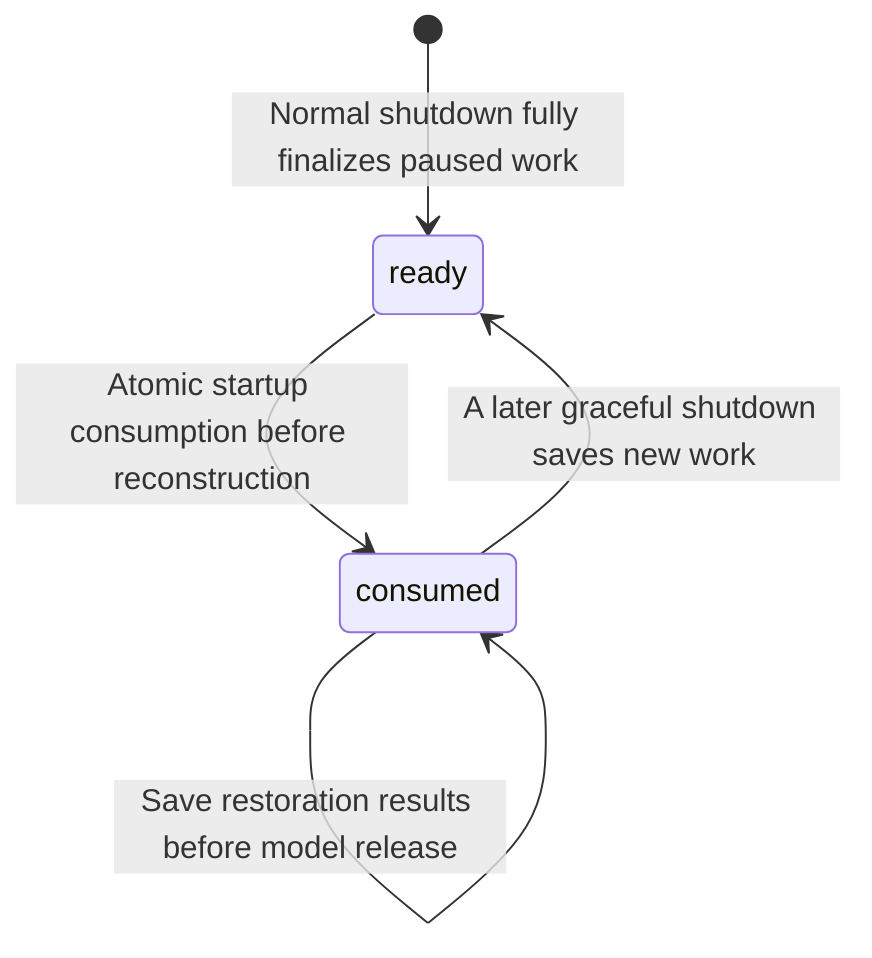

# Local Storage and Recovery

## Design Position

Harness UI keeps execution persistence continuation-oriented and stores published human comments separately:

1. editable YAML, MCP JSON, and local Markdown files own desired resources and global defaults;
2. data-root Content Plugin ID directories contain editable local files with optional Git provenance;
3. SQLite owns accepted-generation indexes, Project/resource lookup projections, terminal Project Model preferences, sticky Thread configurations, execution heads, selected references, published output comments, and browser push subscriptions/VAPID identity;
4. immutable content-addressed files own normalized configuration generations, resolved Run compositions, and complete continuation checkpoints;
5. shared browser drafts, live runtime objects, presence, and native terminal sessions remain in process memory.

The store supports local restart and inspection, not durable work scheduling. Harness UI does not persist a root input queue, Run-attempt ledger, renewable execution claim, worker assignment, effect journal, shell-process record, or delivery ledger.

## Persisted Values

| Value                                                                                             | Storage                       | Authority                                                                |
| ------------------------------------------------------------------------------------------------- | ----------------------------- | ------------------------------------------------------------------------ |
| Desired resource definitions and global defaults                                                  | YAML and local Markdown files | Human-editable desired behavior                                          |
| Installed Content Plugin directories                                                              | Data-root files               | Current optional plugin availability and editable files                  |
| Thread scratch and submitted attachments                                                          | Data-root Thread directories  | Disposable working files and retained input files                        |
| Accepted configuration generation and resource indexes                                            | SQLite plus immutable object  | Current complete validated file and plugin generation                    |
| Thread metadata head, sticky configuration head, and initial-state reference                      | SQLite                        | Identity, mutable presentation, defaults, and first-Run bootstrap        |
| Empty initial `HarnessState`                                                                      | Immutable object              | Harness-generated Thread identity before any selected Run                |
| Resolved Run composition                                                                          | Immutable object              | Exact behavior and dependency provenance captured for one Run            |
| Root or child continuation bundle                                                                 | Immutable object              | Exact selected `HarnessState` resume authority                           |
| Child execution heads                                                                             | SQLite                        | Segment correlation, saved status, and selected checkpoint               |
| Compact child display                                                                             | Immutable child checkpoint    | Inspection history only                                                  |
| Environment-state references                                                                      | SQLite plus immutable files   | Current Host-authoritative state                                         |
| Published output comments and original saved target references                                    | SQLite                        | Durable human discussion; never model history or execution authority     |
| Browser push subscriptions and VAPID identity                                                     | SQLite                        | Device opt-in delivery destinations; never execution or delivery history |
| Shared browser drafts                                                                             | Process memory                | Synchronized editing state only; not execution or continuation authority |
| Participant presence and native Host terminal sessions                                            | Process memory                | Current shared instance only                                             |
| Root receipts, active tasks, Models, credentials, clients, adapters, streams, and shell processes | Process memory                | Current App only                                                         |
| Logs and OpenTelemetry                                                                            | Configured process outputs    | Diagnostics only                                                         |

[File Memory](08-file-memory.md) has separate mutable plain files under the selected configuration root. Root and child checkpoint bundles carry optional memory cursor positions, not memory file snapshots. Its maintenance manifest and per-scope lock do not change SQLite head coordination or authorize Thread continuation. Each scope's observation-only Memory Thread uses ordinary continuation, transcript and usage storage with a nullable unique `memory_scope`; null preserves existing ordinary Threads. Each automatic round preserves display history while starting fresh model context. The scope lock serializes organizer admission, not arbitrary foreground file writes.

Host-local API keys and native Copilot OAuth grants have independent private files outside SQLite and immutable objects. Copilot's file also owns its nonsecret account/source binding; shared CLI tokens remain in the selected external source. [Model Authentication](02a-model-authentication-and-account-stores.md) owns their schemas, publication, logout, and durable grant-coordination semantics. Live credential objects remain process-local; neither native nor shared secrets enter continuation storage.

## Device and Environment Selection Storage

Device definitions remain desired files in the accepted generation. Thread configuration stores binding selections and the normalized default; immutable Run compositions retain the exact captured Devices and working directories used for that admission. [Devices and Environment Bindings](04a-devices-and-environment-bindings.md) owns their semantics and binding-state identity.

Online Device connections, EIP Sessions/generations, keepalive tasks and native process/output references remain process-local. Local-only selections have an empty added-binding collection and their local default. Storage upgrades preserve captured history and existing user data.

## Child Inspection Results

The existing immutable child checkpoint retains bounded activity snapshots and the latest complete final answer. Activity budgets do not truncate that final answer; bounded HTTP windows paginate it for human inspection. A later failed or interrupted segment does not replace the previous complete result with an activity preview. This remains inspection state, not a separate event store or continuation authority. Older checkpoints whose answers were already truncated remain readable but cannot recover bytes that were never saved.

## Tool Presentation Evidence

Root Runs can retain observed filesystem edit evidence in the corresponding tool-return's application-only metadata, under `a13n.harness-ui.applied_edit`. It contains the observed `file_path`, `before`, `after`, and an explicit `omitted` flag. The existing selected `HarnessState` continuation serializes this metadata; it is not added to model-facing tool content, stored in a new event log, or published as a separate execution authority. Other tool metadata remains unchanged.

Association uses the exact Run and tool-call identity. The root collector retains the complete observed before/after text for each edit, without per-edit or per-Run preview omission limits. Historical records that already omitted content retain their explicit omission marker; current files or requested replacements cannot reconstruct that evidence. A later failed result can still carry an earlier observed edit. An event without a corresponding retained tool-return remains live-only. Existing opaque non-mapping tool metadata is preserved rather than replaced. The root display history retains captured result parts across model-context replacement. It remains checkpointed inspection content, not a permanent audit log of every event or unsaved effect.

Saved transcript projection exposes only the recognized bounded evidence through optional `applied_edit`, not arbitrary metadata. Older continuations remain readable without migration. The UI never reconstructs applied evidence from requested replacements or current Host files. Native provider tool calls and returns use the existing transcript call/result shapes with an optional provider identifier, separate from local function-call identity.

## Project Model Preferences

The App stores the last explicit terminal Model choice as one Model resource ID per Project ID in the data root's SQLite database. This is user interaction state, not a resource definition, Project YAML default, Thread configuration axis, or continuation authority. The preference can precede creation of a cwd-derived Project resource using the same deterministic identity. Resource definitions and credentials continue to resolve from the accepted configuration.

Each explicit selection atomically replaces one Project's preference; reset deletes only that Project's preference. Short SQLite write transactions serialize updates with last-write-wins semantics, including across independent Apps. Different Projects never replace each other's entries. Reads, Runs, and shutdown do not write preferences. Active terminals do not subscribe to preference changes. A removed Project or Model does not turn a preference into a resource definition, and lookup never resurrects missing resources. Downgrading past this additive table discards preferences only; it does not rewrite Threads, checkpoints, or YAML. [Interactive CLI](07-interactive-cli.md#agent-selection-and-reasoning) owns selection and fallback behavior.

## Coordinator Roles and Ownership

`coordinator` contains `thread_id` (primary key, foreign key to `thread.thread_id` with restricted deletion) and non-null `auto_followup` (default true). Multiple rows may belong to the same Project. Project association comes from the existing Thread configuration; there is no duplicated Project or role column. Promotion inserts this record in a short writer transaction after validating that the existing Thread is an ordinary, unarchived, project-bound root. The App serializes promotion with current-process admission and rejects active roots or pending decisions. SQLite writer arbitration also serializes independent repository writers; idempotence is not implemented only as a process-local check. Promotion does not rewrite configuration, history, metadata or immutable objects. Direct Coordinator creation inserts the role record in the same transaction as its independent project-bound Thread and configuration head, after initial-state publication. A failed transaction exposes neither an ordinary Thread nor a partial role. Submission failure after successful creation retains the Coordinator identity.

`coordinator_worker` stores one immutable ownership edge per managed root: `worker_thread_id` is its primary key and foreign key to `thread.thread_id` with cascading deletion; `coordinator_thread_id` references `coordinator.thread_id` with restricted deletion and has a lookup index. A Coordinator cannot also be a worker. This relation carries no execution, task, delivery or scheduling state.

Coordinator-origin and human-assigned worker creation validate the unarchived Coordinator and same-Project root constraint and inserts the Thread, configuration head and ownership edge atomically. Initial-state object publication precedes the transaction. First-prompt admission follows creation; rejected admission retains the root and mapping and returns the created identity. Configuration mutation enforces each managed endpoint's fixed Project within the configuration-head transaction. Archive and follow-up changes leave ownership intact.

The replacement migration copies every old `project_lead` binding to `coordinator`, preserving its Thread ID and mapping `enabled` to `auto_followup`. It copies each `project_lead_worker` edge to `coordinator_worker` and then removes the old tables. The complete migration chain upgrades an existing database directly; no intermediate application version or manual repair is required. Repeated upgrade is a no-op. Existing titles, IDs, configurations, histories and immutable captures are unchanged. Other roots are not adopted. Downgrade is refused while any Coordinator exists because multiple Coordinators cannot be represented faithfully by the former singleton schema; empty-role databases can downgrade without data loss.

## Thread Default Model Storage

The nullable `thread_configuration.default_model_id` column belongs to the mutable configuration head and participates in its existing expected-version mutation. An additive migration leaves existing rows null; it does not infer defaults from Sidekick settings, Project preferences, or historical Runs. Reopening the App preserves non-null defaults. Run compositions and continuation objects retain their existing schemas and captured effective Models. Downgrade removes only this selection column, discarding Thread default Models without rewriting historical captures.

## Browser Push Subscriptions

The data root stores one lazily generated VAPID private key and browser subscription rows in additive `web_push_key` and `web_push_subscription` tables. The private key survives App restart; its public counterpart is returned by the authenticated configuration API. Treat data-root backups as sensitive: rows contain push endpoints and encryption auth secrets. They are not configuration resources, model-visible state, or access credentials for the WebUI API.

An endpoint hash identifies one device subscription. A short registration transaction replaces its keys/origin and refreshes `updated_at`, without recording activity. A separate existing-row activity update sets nullable `last_active_at` and refreshes `updated_at` using server time; a removed row is never recreated by activity. Recipient selection includes only `last_active_at > now - 6 hours`, with one captured `now`; null activity is ineligible. Reads detach subscription values before network I/O. Rows whose `updated_at` is older than 90 days are pruned during selection independently of the activity cutoff. Explicit removal is idempotent. Provider 404/410 removes the matching subscription unless its auth secret has since changed. A removed or changed subscription snapshot is rechecked before delivery.

The activity migration removes `thread_ids_json` and adds nullable `last_active_at`, preserving endpoints, encryption keys, origin, retention timestamps, and VAPID identity. Existing rows start with unknown activity and become eligible only after a visible updated client reports activity. Downgrade restores non-null empty Thread interest lists without reconstructing discarded interests; older clients must repopulate them. It preserves subscriptions and the signing identity.

Server restart retains subscriptions and identity, not queued reminders. Delivery is a bounded, best-effort current-App worker, without an outbox, acknowledgment history, durable retry schedule, or replay from saved completions. Only the WebUI App runs this worker; terminal-only Apps do not send push. Removing these additive tables during downgrade loses opt-ins and signing identity, not conversations or continuations. Browsers must explicitly reconnect if the signing identity changes. [Task notifications](webui/04-workbench-interaction.md#task-notifications) owns user opt-in, cleanup, and browser delivery behavior.

## Shared Browser Drafts

Shared editing uses an in-memory CRDT document per participating root Thread, separate from sticky configuration, `HarnessState`, and root-operation receipts. Synchronization does not admit a Run, advance a continuation, or create an input queue. [Collaborative conversations](webui/01-collaborative-conversations.md) owns frontend editing and Send behavior.

A browser can reconnect to the document during the same App lifetime. Server restart restores selected conversation history, not shared drafts or presence. There is no durable draft store, save acknowledgment, CRDT update log, or draft-based submission registry. Editing state must not be submitted automatically on startup or reconnect.

Attachments reuse the existing Thread-scoped staging and retained-input lifecycle. The App protects a participating Thread's file area during its lifetime; submitting input retains referenced files independently of the document. Sharing a data root between independent App processes does not synchronize their live documents.

## Output Comment Storage

[Saved output comments](webui/05-output-comments.md) own comment semantics and source anchoring. The existing data-root `metadata.sqlite3` owns their complete durable records: comment identity, root and producing Thread association, exact saved source and text-block location, optional validated text range/quote, publication-time author attribution, body, creation time, mutation version, last-edit time, and deletion tombstone. Version-checked edits change only the publication body. Deletion removes the publication row and retains a separate identity-only tombstone to prevent retry resurrection; already captured message bytes remain independent. Older readers still see only valid publication rows. The database rejects re-insertion of tombstoned identities, including retries from older writers. Downgrade refuses to discard edited versions or deletion tombstones. Lookup indexes support Thread-scoped ordered listing and exact-target queries. Presence directories, browser tabs, and CRDT updates are not written into these records or new participant tables.

Publication reads and validates an existing saved source outside the database transaction. One short transaction checks the required selected source or existing retained comment target and inserts the complete record. The stable comment identity is unique; identical reconciliation returns the existing record and conflicting reuse fails without overwriting it. Comment publication does not increment Thread metadata/configuration versions or advance a continuation. Notification occurs only after commit and holds no database session across delivery.

Comment-held source references are retained even after the Thread selects a newer continuation. They point only to existing immutable saved output, not a new output accumulator, whole-transcript table, or a newly synthesized execution checkpoint. Referenced-object reads remain App-mediated and bounded. Scratch cleanup, archive, continuation compaction, draft clearing, and process shutdown do not delete comments or their referenced saved objects. A broken source reference fails explicitly without deleting or relocating the comment. This retention does not select the old checkpoint for execution.

The comment schema is an additive change to the package-owned local SQLite/Alembic history. Upgrade creates the comment storage and indexes with an empty collection for existing Threads; it neither rewrites checkpoints nor backfills comments from conversation text, usage, or live events. It uses the existing serialized migration transaction, single-head migration history, and short bounded lock waiting. There is no new database service, separate migration runner, or cross-database transaction.

Startup serves comment reads and writes only after a compatible schema is established. Migration failure is an explicit store-startup failure, not an in-memory-only fallback that acknowledges unsaved comments. Interrupted transactional upgrades retain the prior schema or the complete new schema. A newer revision alone does not exclude older Apps whose required storage surface remains available. Downgrade past comment storage refuses while comment records exist rather than silently deleting human discussion; forward repair or restoration of a compatible backup remains deliberate. An empty comment schema can be removed without altering Thread or checkpoint data.

## SQLite Contract

SQLite uses WAL, foreign keys, a bounded busy timeout, UTC-aware persistence values, and short transactions. A transaction never spans Agent execution, model or tool I/O, Environment operations, a wait, a sleep, configuration-file mutation, or live streaming.

The conceptual groups are:

| Group            | Representative facts                                                                                                                    |
| ---------------- | --------------------------------------------------------------------------------------------------------------------------------------- |
| Configuration    | Accepted generation digest, source/resource digests, and safe diagnostics                                                               |
| Threads          | Identity, parent, metadata version and values, initial state, sticky configuration version, exact selections, and selected continuation |
| Child executions | Execution ID, child Run ID, segment index, saved status, composition, checkpoint, and failure                                           |
| Environments     | Complete Thread/configuration/root binding key and current state reference                                                              |
| Output comments  | Stable comment identity, Thread family, saved target, author attribution, body, selection quote, and publication time                   |

Resource lookup rows are rebuildable projections of the accepted file generation. They accelerate queries but never authorize edits or survive as an alternate resource definition when the owning file is removed.

One App serializes root admission per Thread and state changes per child execution. Separate local App processes can open the same store, but they do not share root receipts, active tasks, or control and do not take over one another's executions. Thread metadata and Thread configuration updates compare their independent expected integer versions; continuation, child checkpoint, accepted generation, and Environment state selection compare expected references. A mismatch fails explicitly and never overwrites the newer head.

Harness UI does not use PID inspection, heartbeats, or time-based leases to infer whether another App is alive. Current execution ownership is process-local. Hard OS locks used for Thread file cleanup protect resource use only; they neither establish execution ownership nor authorize takeover.

## Compatible Upgrades Across App Versions

Multiple TUI or WebUI processes can remain open while a newer package migrates their shared data root. A database migration revision identifies applied schema changes; it is not a runtime package-version lock. An older App does not require the database revision to equal its bundled head, does not downgrade or stamp a newer revision, and can reconnect when its required tables and columns remain available. An active Run's save is not gated by a package-head comparison.

Startup upgrades revisions known to the package under the existing bounded serialized migration transaction. When the database has a single revision unknown to an older package, that package leaves the migration history unchanged and checks its required table/column surface. Additional tables and columns do not by themselves reject access. Missing required storage, ambiguous migration history, corrupt objects, and real write conflicts remain explicit errors; no in-memory acknowledgment substitutes for persistence.

After migration, startup probes database access with a lightweight query under a 20-second connection/probe budget, then verifies the required schema. This readiness check does not run a full-database SQLite integrity scan; increasing stored data alone must not add such a scan to the probe. Migration-time foreign-key validation remains separate from this budget.

Schema changes preserve the reads and writes of concurrently running supported older Apps. Compatible expansion retains existing columns, meanings, constraints, and immutable payload representations; added fields permit older writers to omit them. A migration's structural startup check is not proof of semantic compatibility. New writers must not publish payloads that supported old readers cannot interpret, and genuinely incompatible changes require an explicit compatibility transition rather than an ordinary automatic upgrade that breaks active Runs. Historical readers that predate this behavior retain their own startup limitations.

Reaccepting unchanged configuration sources reuses their existing immutable object when decoding that object produces the same complete normalized configuration. Compatible input aliases do not justify rewriting stored bytes, changing the source digest, or replacing indexes. Different normalized content under the same source digest remains an integrity error, and selecting an earlier accepted generation still requires the ordinary compare-and-select check. Harness UI normalizes the historical Model-characteristic spelling `context_window` to `context_window_tokens` at its shared input boundary, including source configuration, accepted generations and nested Run composition recipes. If both names are present they must agree, including value type; conflicting values are rejected. Core Harness accepts only the canonical spelling.

Typed immutable payload readers tolerate unknown fields in the decoded model tree rather than treating additions or retired fields as corruption. Configuration resources retain their existing opaque-extra serialization, including fields that participate in normalized-content comparisons. Embedded message and provider-state codecs keep their own compatibility rules. Added or retired fields alone do not make a snapshot incompatible. Reads do not rewrite the stored object or its digest. Required fields, known-field types, schema/codec versions, object integrity, and identity relationships remain validated; authored configuration and new request validation keep their own policies.

An incompatible typed object emits a warning identifying its kind, object digest, schema/codec versions, and expected payload model. Diagnostics include a bounded list of schema-owned field locations and validation error types plus the total error count; arbitrary mapping keys are masked. Payload values, dynamic validation messages, and exception contexts are not logged. This evidence does not relax integrity validation or authorize deletion of the object.

Mixed-version access does not share live execution ownership or remove compare-and-select conflicts. Two Apps independently running the same Thread can still conflict on its selected continuation; schema compatibility never permits overwriting that newer continuation.

## Thread Files and Automatic Scratch Cleanup

The App owns a lazily created file area for each existing root or child Thread, keyed by its Harness-generated Thread ID. It introduces no pre-Run session identity. Under the data root, `threads/<thread-id>/tmp/` holds disposable working files and staged uploads; `threads/<thread-id>/attachments/` holds retained submitted inputs. These paths are not Project roots, continuation objects, or a separate resume authority. Runs and process restarts reuse the same Thread file area. Archive, terminal navigation, normal Run completion, and App shutdown do not delete it.

For every root and asynchronous child Run, the App supplies the current Thread mount's `tmp/tool-results/` as the Harness tool result directory. Oversized tool output never uses a Project's `.a13n/tmp/` in App-prepared Runs. These files retain the [Harness Run-private spill lifecycle](../a13n-harness/07-tool-execution.md#dispatch-retry-and-results): normal Run cleanup removes only owned leaves, while any residual files remain eligible for Thread scratch pruning. The surrounding Thread file area, ordinary scratch files, and retained inputs are unaffected.

An upload is staged under a unique Thread-scoped handle with its normalized original name, media type, and byte count. Different uploads with the same name do not overwrite one another. Submission promotes referenced files into retained storage before scheduling the Run. Promotion is idempotent for an already retained handle. Admission failure or a process interruption may leave an unreferenced retained file; cleanup favors retaining that file over deleting an input potentially referenced by execution. Submitted image bytes also enter native Harness input and selected checkpoints. Only a selected continuation restores conversation history; a retained upload does not prove that its submission completed.

Attachment metadata readers ignore additive display fields while retaining identifier, byte-count, file-type, and content-size checks. Promotion moves the unchanged metadata file rather than rewriting away unknown fields. Ordinary uploads omit absent source provenance instead of writing `source: null`; captured-source provenance retains its own validation. Invalid known metadata or changed content remains an attachment-local error, not a global configuration failure.

Automatically converted [long-text inputs](05-runtime-subagents-and-surfaces.md#long-text-input-files) use the same retained attachment storage. Conversion occurs during entered-Environment input preparation, or before steering enqueue, and retention completes before any model-visible reference is published. Selected checkpoints retain references rather than the original inline text; complete UTF-8 text remains available through the Thread attachment reader. Attachment storage alone never establishes that execution or steering delivery succeeded.

The startup janitor and an hourly App task remove only expired `tmp/` trees. The default inactivity threshold is three days, configurable through `StorageSettings.scratch_retention_seconds`. Age is measured from the App's last recorded use or release, not from archive status, PID inspection, or a Run-status guess. Each App conservatively protects every Thread file area it touches until App shutdown. Independent Apps hold independent hard OS file-use locks, allowing concurrent use without serializing their Runs. Cleanup tests those locks under a short registration gate and skips a Thread if any holder remains. Process death releases OS locks, making an old scratch tree eligible without a heartbeat timeout. Cleanup errors are diagnostic and do not prevent normal startup; there is no manual confirmation requirement.

Pruning never deletes retained attachments, SQLite rows, immutable objects, Project files, or external symlink targets. File-use lock bookkeeping is outside the deletable scratch tree. A discarded staged upload can expire; reading its old handle then fails explicitly. Surfaces do not treat a host path as a portable upload identifier or implement their own deletion policy. Important generated results belong in an explicitly chosen durable destination, not scratch storage.

## Observed Thread Usage

SQLite retains the latest Harness Context usage snapshot for each single-writer `usage_id` separately from execution checkpoint selection. The existing `thread_usage` table stores a snapshot envelope in its JSON payload; the scope sequence stays in JSON, not a revision column or history table. Existing append-only model and provider payloads remain byte-for-byte unchanged and participate in the same queries without a schema migration. `RunBindings.usage_reporter` persists complete detached snapshots directly; bounded display chunks do not constitute a second persistence path. Terminal reconciliation is idempotent, including results without a returned state. Root, asynchronous child, and inline descendant scopes retain original contribution attribution. The Host owns persistence waiting and failure policy: process-local writer and connection admission remain cancellable, SQLite lock waiting uses `StorageSettings.busy_timeout_seconds`, and admitted transactions settle before cancellation propagates. Normal reporting has no total elapsed-time deadline. A timeout or SQLite busy/locked failure receives at most two retries of the same idempotent snapshot, with warning logs and short cancellable backoff outside the transaction. Nontransient failures and conflicting facts are not retried; exhausted retries fail execution rather than silently dropping accounting. Slow successful delivery emits a warning without failing the Run. Logs contain correlation, attempt count, and elapsed time, never the usage payload. Harness owns the separate [failure and cancellation cleanup budget](../a13n-harness/12-events-observability-and-usage.md#reporting-boundary). Committed observations survive cancellation, failed Runs, compaction, and restart.

A normal submission, fork, or HITL-answer successor starts fresh accounting without deleting past consumption. A graceful restart overlays the latest matching accounting onto its selected execution checkpoint, then explicitly resumes the original usage scope. An older execution checkpoint cannot roll accounting back. A legacy checkpoint with no usage namespace remains recoverable with a fresh accounting scope and retained historical facts; malformed or conflicting snapshots do not use that compatibility fallback. Equal snapshots are no-ops, later sequences retain observed contributions and immutable attribution, and conflicting facts fail explicitly. Goal continuation uses the scope identity and baseline so a cumulative resumed snapshot is not added twice.

Records are scoped to the root Thread family. Model record identity deduplicates repeated reports and terminal reconciliation. Provider identity is `(provider, product, usage_id)`, independent of Run attribution: the same receipt is counted once per family and attributed to its first observation. A provider receipt with changed usage is an explicit integrity error; a model contribution can refine its cumulative observation only within its owning scope. This observational ledger is not an invoice, execution journal, or authority to replay effects.

The root Thread usage projection distinguishes root-agent records, inline/asynchronous descendants, and their combined total. It sums individual committed records, never the already-inclusive root RunUsage plus child totals. Cached and audio token counters are subsets, not additions to input/output totals. Known model USD costs and provider costs in each reported currency remain separate; missing costs remain unknown. Bounded model breakdowns disclose omitted groups. `model_scopes` supplies root, descendant, and combined totals per actual provider/model (32 named models plus Other); `groups` supplies at most 128 model/agent/owner/source intersections, with an `other_groups` subtotal for omitted details. Auxiliary models belong to the calling Agent's scope and are not a third additive owner. Older projections can omit these additive fields; readers retain existing totals and label unavailable attribution rather than failing. Current primary model records use source `agent`; unknown pricing remains unknown and provider receipts remain separate without inferring model facts or backfilling prices. Latest-root context queries exclude auxiliary sources before selecting the newest record, without treating an absent source as primary attribution. The latest 32 observed Runs group unique contributions by native Run ID and agent instance; older Run contributions remain in totals. Run grouping uses each contribution's original Run and Agent attribution, even when a new runtime Run resumes its scope; it is not a second execution or billing authority. Queries flatten legacy facts and latest snapshots, deduplicate stable contributions, and execute all aggregate reads against one SQLite read snapshot. They never reuse a process-local append-only high-water cache for mutable scope rows. No database session spans rendering or external I/O.

Coverage starts with the first persisted observation; replacing a scope retains that time and advances its observed-through time. No record means unavailable coverage, not proven zero lifetime usage. Pre-ledger history and usage never observed after a crash are not backfilled from messages. While work is active, totals are recorded-so-far; context occupancy and subscription limits are separate projections.

## Thread Metadata Head

Each Thread has one mutable metadata head containing `version`, nullable `title`, `archived`, and `starred` (default false). A metadata mutation compares its required expected version, changes supplied fields in one short transaction, and increments the version once. Omitted fields remain unchanged; explicit null is invalid for archive and star flags. A no-op retains the current version. Metadata changes update `updated_at`, independently from configuration and continuation selection, without changing navigation `touched_at` or conversation `activity_at`.

Stars are shared instance metadata displayed within the Thread's current Project, not private browser preferences or Agent continuation state. Ordinary roots and Coordinators can be starred, including during active execution; workers and child Threads cannot. Archiving retains the star while hiding the conversation from ordinary navigation; restoring reveals it again. Checkpoint publication and unrelated metadata edits preserve the star.

Metadata compare-and-select prevents a stale surface from silently overwriting a title, archive, or star change. Process-local active status is not stored in this head. Root archive admission additionally checks current-process activity; another process remains an ordinary concurrent writer and is handled by the metadata version rather than a liveness protocol.

## Thread Configuration Head

Each root or child Thread has one mutable configuration head:

```python
class ThreadConfiguration(BaseModel):
    version: int
    project_id: str | None
    agent_source: AgentSource
    environment_profile_id: str
    harness_plugin_ids: tuple[str, ...]
    environment_run_extension_ids: tuple[str, ...]
    mcp_server_ids: tuple[str, ...]
```

`agent_source` is the discriminated Agent-resource or Markdown-subagent reference owned by [Projects, Threads, and Environments](04-projects-threads-and-environments.md#sticky-thread-configuration). A null `project_id` records a Thread without a Project and is preserved across restart and child creation. The SQLite upgrade rebuilds the Thread configuration table with a nullable Project column while preserving existing rows and references; no existing Thread is reassigned. It uses the normal serialized migration transaction. Downgrade refuses before altering the table if projectless Threads exist; readers that require a non-null Project cannot interpret projectless Threads; revision equality is not a substitute for that payload compatibility boundary. The lists are exact ordered enabled selections. Omission belongs only to create or patch input; the stored head contains no inheritance marker. Every non-empty update compares the caller's required expected version, commits all changed axes, and increments `version` atomically. A no-op can retain the version.

An admitted Run records the Thread configuration version and accepted generation it captured. A later update is valid and affects only later admissions.

## Immutable Publication

Immutable values are canonical, bounded, typed, and content-addressed. The restart-bound `process.max_object_bytes` setting limits each complete uncompressed object on publication and read. It defaults to 256 MiB and accepts 1 KiB through 1 GiB. This is not a Thread disk quota or a model-context budget; retained display history remains part of the checkpoint after context compaction. An oversized publication reports its actual byte count and configured limit without truncating the payload or advancing the selected reference. Lowering the limit can make previously saved larger objects unreadable until the limit is raised again. Publication follows:

1. serialize and validate the complete payload;
2. write a uniquely named file under the same storage root;
3. atomically publish the digest-derived destination;
4. select its digest in a later short SQLite transaction.

There is no cross-store transaction. A crash can leave an unreferenced object, but no selected reference intentionally points to an unpublished object.

## Run Composition and Continuation

A resolved Run composition captures one complete effective configuration without live collaborators. The root or child continuation produced by that Run records its composition reference:

```python
class StoredContinuation(BaseModel):
    schema_version: str
    harness_release: str
    run_composition: ObjectRef
    harness_state: HarnessState
    deferred_requests: DeferredToolRequests | None
    accepted_input: StoredDeferredInput | None
    created_at: datetime
```

The composition reference explains which Agent, Project roots, Capability, Harness Plugin, Content Plugin snapshot, MCP, Provider, and Run Extension behavior produced the checkpoint. It does not constrain the next Run to use the same composition.

Root continuations also retain an independent display history. Complete root messages are captured before handoff or compaction replaces model context; context summaries retain their operation identities at their observed timeline positions. Retained input replay does not append duplicate user messages. Checkpoint and terminal publication save this inspection content in the UI-owned `a13n.harness-ui.display-history` Capability namespace under the same compare-and-select operation as native state. The existing extensible state envelope keeps the continuation payload readable by older Apps without changing model messages. The display history is never supplied as model history, used to resume execution, or treated as evidence that unsaved live output survived a crash. Nested helper histories are excluded.

Transcript pagination and saved-output locations address the selected display history, while context usage and execution continue to address `HarnessState`. A model-context replacement cannot remove previously saved display messages. Reloading or reopening a Thread preserves the same timeline. Older continuations without display history bootstrap from their available native history; already discarded content is not reconstructed. No SQLite migration or continuation-envelope change is required. Older Apps can still read and resume native state, but do not maintain the display snapshot. Its native-history digest prevents stale positional mappings from being reused after an older writer advances the Thread; such checkpoints fall back to their available native history. The existing immutable-object size bound still applies: oversize or failed publication leaves the prior selected head intact instead of silently truncating display history.

Successful terminal selection also marks the final response in the inspection-only display message metadata. It does not modify native model messages or change the display-state envelope. Checkpoints, failed, cancelled, and suspended results do not establish final responses. A turn begins at an ordinary visible input request; its steering, context replacement, and input-free resume remain in that turn. Multiple input parts and attachments in the same request do not create additional turns. A later continuation of the same turn makes an earlier final response insufficient to establish current completion. Older history without recorded completion remains inspectable but is not automatically classified as successful from its last assistant text.

The complete suspended continuation owns deferred requests. Surface projections use the selected continuation digest as an opaque continuation ID and never expose the object reference or native request value. A deferred response compares that exact selected reference and reconstructs its complete native request/result pair in memory; derived query data cannot authorize or reconstruct execution.

Root continuations and child checkpoints retain an optional accepted deferred input alongside `HarnessState` until native history incorporates it. This input contains native `DeferredToolRequests` and `DeferredToolResults`; native tagged returns preserve arbitrary JSON, failures, content, and metadata without a separate result codec. Publication uses the Run's current pending accepted input and removes already incorporated results. It never reuses the original admission envelope after the Run has consumed it or replaced its history. Restore supplies the remaining batch with `recovery=True`: external facts and explicit denials survive, but an earlier positive approval never authorizes replay. Current tool-recovery and approval policy still applies. This is part of one selected continuation, not an input queue or a promise that admission alone is durable. Missing accepted input means no additional retained batch; no SQLite migration is required.

Before each normal root model request, Harness UI exports the complete canonical `HarnessState` after pending input and context transformations have been applied, publishes a continuation using that Run's captured composition, and compare-and-selects it against the current expected reference. This saves the initial authored input before model output and consumed steering before the following request. Nested compaction/helper model histories cannot select the root Thread head. These are complete Agent State checkpoints, not partial AG-UI event snapshots, an input journal, or a durable work queue. Admission alone, preparation failure before this boundary, and accepted but unconsumed steering do not establish saved input.

Every successful checkpoint advances the expected reference for subsequent request-boundary and terminal saves. Publication and selection complete under cancellation shielding; a failed selection does not advance the expected reference or emit a success marker. The native live stream emits a checkpoint marker only after selection succeeds, ordered after the input represented by that checkpoint and before the following model output. This marker is a process-local display cutover hint, not another persistence authority.

Harness UI also publishes every available valid terminal `HarnessState`, including failed and cancelled results, and compare-and-selects it against the latest successfully selected reference for that operation. After an unexpected exception or external cancellation, it attempts to export the Harness-retained shutdown checkpoint and publish it under cancellation shielding before propagating the original error. Saving a checkpoint does not turn failed or cancelled execution into success and never automatically replays input or effects. Deferred requests accompany only a suspended result. If export, publication, or selection fails, the prior or concurrently selected continuation remains current and the save failure is diagnosed independently. Root receipts, input, partial output, live AG-UI events, Environment files, and child display never synthesize a continuation.

### Explicit Context Clearing

Clearing context replaces the selected root continuation with empty model history and fresh Agent Capability state. Only the UI-owned display history is carried forward, with an empty native-history mapping; saved message positions and completed-response markers remain inspectable. Notes, embedded tasks, handoff/compaction state, explicit stored values, Goal state, and deferred requests do not carry forward. This is not deletion of historical immutable objects or a secure erasure operation.

The replacement retains the Thread identity, previous Run composition provenance, conversation excerpts, configuration, completion markers, Environment state, files, attachments, and independently stored comments. External task-provider data and child Threads are not deleted or cancelled. Shared browser drafts are independent and unchanged. The next admission loads standing instructions and current configuration normally, without receiving the retained display history as model context. Context usage no longer falls back to an older observed request when native history is empty; accumulated usage is retained.

The App accepts this command only for a non-archived, inactive root with a selected continuation. The caller supplies the exact continuation ID reviewed for confirmation. Publication uses the existing immutable continuation envelope and compare-and-select boundary; stale selection or publication failure leaves the selected head unchanged. The mutation is serialized with process-local root admission, and successful clearing cancels any pending human-interaction timeout for the old continuation. No Run or model request is created. Other processes retain the ordinary compare-and-select concurrency contract, not distributed liveness guarantees.

### Goal Continuation State

The optional root [Goal policy](05-runtime-subagents-and-surfaces.md#goal-execution) is saved in the `a13n.harness-ui.goal` Capability namespace at version `1`. It retains the original objective, additional-check counter, captured limit, status, pending restore audit and source, and observed input/output tokens. Missing state means no Goal; unsupported state versions fail explicitly. The namespace uses the existing complete checkpoint envelope and compare-and-select publication, without a new table or work queue.

Request-boundary checkpoints include current Goal progress after context-restoration notification. Terminal publication includes the final Goal outcome. Deferred response and eligible graceful-restart reconstruction preserve this state; normal new prompt submission removes it, while new Goal input replaces it. A new configured limit never retroactively changes a resumed Goal's captured limit.

The continuation read model includes the optional Goal projection. Current-process root-operation state takes precedence for live progress. Without a live operation, saved active progress is shown as `suspended` only when a deferred continuation is actually available, otherwise `unverified_stop`. This query projection does not rewrite the checkpoint, claim liveness, or authorize automatic execution. Existing terminal outcomes remain inspectable after restart.

## Continuation Query Data

Root continuation selection commits a small, versioned read model in the same SQLite transaction as the selected head. It contains the deferred requests needed for decision display and the bounded latest retained activity. Both the continuation schema version and digest bind the projection to the selected immutable object. Failed compare-and-select leaves the old projection and head intact. Current-process activity is merged at query time, never persisted as liveness.

Activity and detail queries do not deserialize complete continuations. A missing projection or identity mismatch is unknown query coverage, not proof that no decision exists: detail does not offer run or respond until a matching projection is available. Execution admission independently verifies native continuation state. Current writers must provide the projection with continuation selection. Nullable columns support upgrading existing data and repairing missing or stale derived data, not a parallel legacy write API.

Background maintenance rebuilds missing projections in bounded keyset batches from verified immutable continuations, outside query paths and database transactions. Each repair compares the selected identity again before committing and does not change metadata, recency, completion, or execution state. Interrupted repair restarts from still-missing rows. Unreadable objects are diagnosed without publishing invented empty data or preventing other rows from being repaired. Repaired Threads emit scoped change notifications. Downgrade removes only rebuildable query data.

Verified configuration reads cache by exact immutable reference while checking the current SQLite head on every lookup. Returned configuration values are detached from cached mutable containers. Typed immutable-object decoding, publication serialization, display-history validation, and transcript projection run off the event loop.

Transcript inspection uses a rebuildable SQLite index for the exact selected initial-state or continuation identity. Message entries and input turns are independently paged; a bounded request does not deserialize the complete native history or retain it in a process-global history cache. The same index retains bounded note and task views, the captured composition reference, and the last native request footprint. Execution restore and saved-output verification continue to read verified immutable objects, never inspection rows.

An index replacement publishes its header, entries, and turns atomically only while its source remains selected, and removes that Thread's superseded derived rows. No database transaction spans object loading or projection. Concurrent callers rebuilding one Thread share that load without blocking unrelated Threads. A missing or obsolete index rebuilds from verified state, including after upgrade or a save by another App. Current saves opportunistically build from their already available checkpoint; failed inspection publication does not undo or misreport a successfully selected continuation. Indexed reads survive restart, while interruption during replacement leaves the prior complete index or its complete replacement. Identity-bound queries reject replacement races rather than mixing entries and turns. The additive migration creates empty derived tables; downgrade discards only these indexes, not saved history.

Usage queries read a coherent SQLite snapshot of latest scope envelopes and preserved legacy facts. A fixed append-only high-water mark cannot detect replacement, so aggregate reuse must not hide updates made by another App. First-observed ordering remains stable across scope replacement and determines capped currency attribution. Status reports the periodically refreshed object-count sample without enumerating the object store on the request path.

## Saved Root Completions

Each root Thread retains its latest successful completion independently of current-process receipts, excerpts, and navigation recency. The relational marker contains a monotonically increasing completion version, Run ID, selected continuation identity, and completion time. A missing marker means version zero. Successful terminal continuation selection updates this marker in the same compare-and-select transaction; a failed selection cannot publish a completion. Repeated publication for the same Run does not advance its version. Unexpected exceptions and cancellation remain non-successful even when a completed model outcome is available. Environment cleanup diagnostics retain their existing root outcome semantics.

Request-boundary checkpoints, subsequent running work, failures, suspension, cancellation, metadata edits, and navigation never clear or advance a prior successful marker. The marker describes saved success, not a durable receipt or execution liveness. Browser acknowledgements are personal local state, not server Thread state. Transcript projection carries the completion version from the same detached Thread snapshot used to choose its history; reading a newer marker independently cannot acknowledge older rendered history.

The additive SQLite upgrade initializes existing Threads at version zero without inspecting or guessing historical outcomes. Supported older writers can omit the new columns and preserve existing markers, but cannot publish new completion evidence. Downgrade removes only completion metadata. Browser-close and server-restart recovery applies to successes recorded by a writer supporting this marker; it does not replay interrupted execution.

## Navigation Recency

A Thread has an independent nullable `touched_at` navigation time. New Threads initialize it to creation time. Explicit touch advances it monotonically in one short transaction without changing `updated_at`, conversation activity, metadata/configuration versions, excerpts, or continuation selection. It is navigation metadata, not evidence that input or work has been saved. Ending a root operation advances navigation recency before terminal status is published, including completion, failure, cancellation, and suspension. This final touch is best effort: a storage failure is logged without replacing the operation outcome. Reads, checkpoint saves, progress, and metadata/configuration edits never touch navigation recency.

Explicit surface prompt/deferred-response admissions and explicit cross-Thread create/run operations touch before dispatch, after rejecting conflicting active admission. A touch failure prevents that admission. Accepted human steering touches after enqueue; a touch failure is diagnosed without reporting the already-enqueued input as rejected. Background cross-Thread messages and Agent steering do not touch the target. Opening a conversation alone does not touch it. The App and authenticated HTTP touch operation allow a caller to explicitly advance root navigation without starting work or restoring an archived Thread.

Navigation sorting uses `coalesce(touched_at, created_at)`, descending with the Thread-ID tie-breaker. The additive SQLite migration seeds existing rows from their prior `updated_at` once, preserving the initial order without reading historical objects. Nullable storage allows supported older writers to omit the new column; such newly created rows fall back to creation time. Older writers continue to update existing fields without changing a previously touched navigation time. Upgrade performs one metadata scan and creates the navigation index under the existing serialized migration transaction. Downgrade drops only navigation metadata and its index, retaining Thread identities, incoming references, and checkpoints.

## Saved Conversation Excerpts

A Thread retains bounded deterministic display excerpts alongside its selected continuation: the first authored input (512 characters), latest authored input (2048 characters), latest corresponding assistant text (2048 characters), and reply kind (`none`, `progress`, or `final`). These are literal whitespace-normalized excerpts with explicit truncation, not model-generated summaries. An explicit Thread title remains independently editable and is never overwritten by automatic extraction. Attachment-only input uses original names or media types, never binary payloads or internal attachment paths.

Request-boundary checkpoints derive excerpts from their canonical saved history while preserving the established first input. Terminal saving also uses excerpts collected from the root's native input, delivered steering, and closed assistant text before best-effort surface delivery. Hidden context overlays, system prompts, tools, thinking, descendant events, and background-process or subagent notifications do not become authored input. Each new authored input clears the preceding reply; a reply is final only when the root completes with that output. A suspended, failed, or cancelled checkpoint can retain progress or no reply. Excerpts survive model-history compaction without being reconstructed from a compact summary.

The complete continuation bundle carries its excerpt. Selecting that continuation updates the relational excerpts and their Unicode-casefolded search text in the same short compare-and-select transaction. Selection conflicts and publication failures retain the previous excerpts. Display data never reconstructs execution state, proves live work, or promises durable root-input acceptance. Hard process loss without a selected checkpoint retains the prior saved preview.

Conversation activity time changes only when new authored input or assistant text is saved. Metadata/configuration edits retain that time; empty Threads use creation time for activity sorting. Search text contains Thread ID, explicit title, and the saved excerpts. Title changes update search text with their metadata transaction, without changing the saved conversation. Session queries use these relational values and never hydrate continuation objects to build a list.

The additive local schema upgrade preserves existing Thread/checkpoint data and seeds name/ID search in bounded metadata batches. It does not scan historical object files during startup. Existing checkpoints without excerpts remain readable; new executions populate excerpts from observed conversation. The migration needs the ordinary local SQLite migration write transaction and one metadata scan plus activity-index creation. An interrupted transaction is retried through the existing migrator; downgrade removes only the added display columns and index, not continuation objects.

## MCP Resource Index Compatibility

Resource index identity is `(generation_digest, resource_kind, resource_id)`, not a physical source path. Multiple MCP resources can point to one source without duplicating source rows. The SQLite upgrade rebuilds only the derived resource index table, preserving existing rows and leaving Thread and continuation data unchanged. The rebuild takes a write lock and scans the local index; no external I/O or background backfill is required. Startup migrations retain their existing serialized transaction and rerun behavior. Older binaries do not support the new schema; use forward repair rather than mixed-version access. Downgrade refuses before altering the index if any generation contains multiple resources per source, rather than discarding entries.

## Child Threads and Execution Segments

A logical async child is an ordinary Thread with a `parent_thread_id`. `delegate` creates the child and segment zero. `resume_subagent` keeps `thread_id`, applies an optional sticky configuration patch, creates a new `child_run_id`, increments `segment_index`, and starts from the selected child `HarnessState`.

```python
class ChildExecutionHead(BaseModel):
    execution_id: str
    parent_thread_id: str
    child_thread_id: str
    child_run_id: str
    segment_index: int
    run_composition: ObjectRef
    status: Literal["running", "succeeded", "failed", "cancelled", "lost"]
    selected_checkpoint: ObjectRef | None
    resumed_from: str | None
    failure: SafeFailure | None
```

The composition identifies the Agent definition used by that segment. It is historical provenance, not a permanent child-definition compatibility gate. A later child segment can use a different Agent, Capability, Plugin, MCP, Project, or Environment profile selection while continuing the same child Harness history.

A saved `running` status means only that no terminal checkpoint or explicit local loss was selected. It is not evidence that a process, task, or connection remains alive. A surface view therefore reports persisted status separately from current-process activity and available actions. Another App can inspect saved projections but cannot steer, cancel, wait on, or take over a vanished local execution.

### Child Checkpoint

A child checkpoint contains the exact execution correlation, Run composition reference, `HarnessState`, bounded compact display, terminal fact, and creation time. Terminal publication follows:

1. finish the child Run and Environment cleanup;
2. construct and validate the complete terminal checkpoint;
3. publish the immutable checkpoint;
4. select the checkpoint and terminal execution status in one short transaction;
5. acknowledge terminal completion.

An execution is not `succeeded` until step 4 commits. A checkpoint failure never promotes an earlier progress checkpoint to terminal success.

### Compact Child Display

The display includes bounded closed assistant text, non-encrypted thinking, completed Tool summaries, failure, and completion metadata. It excludes open content, running Tool calls, encrypted reasoning, unrelated custom events, and duplicate terminal output. It is inspection authority only and cannot reconstruct `HarnessState`.

## Environment State

Current Environment state is selected independently from continuation. Its complete private key contains:

```text
Thread ID
+ Environment profile identity and normalized profile digest
+ Host adapter key
+ normalized Project root path
```

The profile digest reuses the accepted generation's canonical normalized content for Provider and Host-adapter behavior and excludes source formatting and display-only fields. Switching Project, Provider, or behavior configuration cannot retarget another state entry. Removing a root or changing the selected Environment profile leaves its prior state dormant; selecting the same compatible profile identity, behavior, and root later can reuse it. Changed state uses expected-reference selection and never silently overwrites a concurrent newer value.

## Recovery

Startup validates retained values lazily and reloads the file configuration together with current Content Plugin directories. Committed comments remain available through ordinary queries, without restoring page presence or shared drafts. Ordinary startup does not restore root receipts, replay root input, restart a child segment, reconnect shell processes, infer process liveness, or manufacture a checkpoint from display. The completely finalized, single-use [graceful restart handoff](#graceful-restart-handoff) is the only automatic task-continuation path.

An ordinary Thread admission resumes from its selected continuation using its current sticky configuration unless the next admission applies a patch. A Thread with no selected continuation starts its first Run from the immutable empty `HarnessState` created with `HarnessState.new()` when the Thread was inserted. The generated Harness `thread_id` is the Harness UI Thread ID. If selected resources are missing from the current accepted generation or cannot reconstruct against installed dependencies, the Run fails before dispatch; recovery does not fall back to the composition that produced the prior continuation.

| Last stored fact                      | Recovery behavior                                                               |
| ------------------------------------- | ------------------------------------------------------------------------------- |
| No new continuation selected          | Resume the prior selected continuation                                          |
| Continuation object published only    | Resume the prior selected continuation                                          |
| Child nonterminal checkpoint selected | Retain for inspection; do not infer liveness, replay, or permit linked resume   |
| Child terminal checkpoint selected    | Serve the saved terminal view and permit policy-authorized linked resume        |
| Selected object missing or invalid    | Fail read or resume explicitly                                                  |
| Current Thread resource missing       | Preserve Thread and checkpoint; reject the next Run until configuration changes |

External model, tool, and Environment effects can be unknown and may repeat after explicit retry or linked resume.

## Graceful Restart Handoff

A normal WebUI shutdown saves eligible work for a sequential restart. The [App lifecycle](05-runtime-subagents-and-surfaces.md#graceful-webui-restart) owns cooperative draining and finalization; the server owns signals and connections. No preparation API or UI action is required. An external operator or process supervisor owns stopping, installing, and starting the application. Only one execution-owning App participates at a time; overlapping or mixed-version execution owners are not supported for this workflow.

One local handoff record references existing immutable compositions and checkpoints. It contains a generated batch identity, lifecycle state, task references, safe diagnostics, and restoration results. Each task reference identifies the original Thread and Run, root lineage, exact checkpoint and composition; a child also retains its execution, parent scope/composition, execution identities, and usage limits needed for reconstruction. It does not duplicate conversation history, store credentials, or become a root-input queue.



Pausing is an in-memory observation, not a durable `ready` fact. Normal shutdown saves each paused root continuation and each paused child checkpoint, completes Environment cleanup and state publication, then publishes `ready` only after all participating work has finalized. Drain timeout, cleanup failure, failed Environment state publication, or a missing checkpoint prevents publication of the entire batch; logs and ordinary saved history remain available. Abnormal context exit and forced termination do not authorize automatic recovery. Tasks which completed, suspended for a human decision, or were explicitly cancelled are excluded. The additive table migration preserves existing Threads and objects.

The next WebUI startup atomically changes `ready` to `consumed` before reconstructing work. A second opener cannot consume the same batch. An interrupted attempt never automatically retries, even if no model request was sent. Consumption and its results are diagnostic history, never a global admission lock: no administrative reset is required, and a later graceful shutdown may replace the record.

Recovery reconstructs fresh native collaborators from the captured compositions and exact saved checkpoints, with current credentials and compatible installed implementations. It does not substitute the latest Thread selection or synthesize a user “continue” prompt. Root tasks receive new process-local receipts and Run IDs on their original Threads. Child tasks receive new linked execution segments on their original child Threads; their old cancelled segment records a graceful-restart reason and identifies its successor. This internal exception requires the matching consumed handoff, exact checkpoint/composition, and no existing successor; it cannot enable ordinary resume of cancelled or lost children.

The task forest is staged at its first model boundary before any restored model request is released and before App startup completes. A finite budget covers both reconstruction and reaching those boundaries. Descendants can reconstruct a historical parent scope without rerunning a completed parent. Parents receive only their own child-successor mapping and can inspect/control those successor IDs. Failure to reconstruct or reach the startup boundary cancels that root family's staged work while leaving other successfully staged families eligible. Restoration results, including safe failure reasons and successor correlations, are persisted before model release. They remain saved after another restart; `consumed` does not mean the continued tasks completed successfully.

A pending human request remains at its saved deferred continuation without an invented answer or restarted timeout. Saved steering remains part of the Harness checkpoint; a new message or answer rejected during shutdown has no durable acceptance. Browser drafts, live streams, native terminals, and Run-local shell references are outside the handoff. Model, tool, and Environment effects retain their native uncertainty; this workflow provides neither exactly-once external effects nor crash recovery.

## Private Failure Diagnostics

Recognized model failures and unexpected execution errors produce a best-effort private JSON report in the operating-system temporary directory. The report contains component versions, Python/platform metadata, Thread/Run correlation, exception chains, and frame locations, but no frame locals, source lines, configuration snapshot, transcript, or serialized checkpoint. Exception messages can themselves contain sensitive provider content; the report is user-reviewed diagnostic material, not a safe public payload. Files use owner-only access where supported. A report-write failure never replaces the execution error or blocks checkpoint publication.

The terminal failure presentation identifies the report path and the repository's new-Issue entry point, requests reproduction steps, and tells the user to review sensitive content before sharing. Nothing is uploaded automatically. Normal diagnostic logs retain safe exception types and stack locations with Thread/Run correlation, not raw exception messages or provider bodies. Reports and logs never reconstruct or select continuation state.

## Failure Semantics

| Failure                                         | Outcome                                                             |
| ----------------------------------------------- | ------------------------------------------------------------------- |
| Immutable serialization or publication fails    | No selected reference changes                                       |
| SQLite selection fails after object publication | Prior selected head remains current; object is unreferenced         |
| Thread configuration version conflicts          | Stale patch is rejected without partial selection changes           |
| Root process exits abruptly without cleanup     | Prior continuation remains current                                  |
| Child process exits abruptly during a segment   | Saved nonterminal head remains; no liveness or takeover is inferred |
| Child terminal checkpoint cannot be selected    | Execution is not reported as succeeded                              |
| Live delivery fails                             | Saved heads are unaffected                                          |

## Invariants

01. Files own desired resources; SQLite owns accepted projections, mutable runtime heads, and published human comments.
02. Thread configuration is sticky, exact, versioned, and replaceable between Runs.
03. Thread metadata and Thread configuration are independent versioned heads.
04. Every admitted Run has one immutable resolved composition.
05. A continuation records but is not permanently bound to its producing composition.
06. Root receipts, input, and active Runs are not durable work records.
07. Deferred response authority is the exact selected suspended continuation.
08. Compact display never becomes Harness continuation state.
09. Process loss never triggers implicit replay, takeover, PID inspection, heartbeat, lease, or lock-file recovery. Only a completely finalized graceful restart handoff authorizes single-use automatic continuation.
10. Transactions remain short and outside file or external execution I/O.
11. Published comments retain their original saved targets independently of the selected continuation; they never become continuation or execution authority.
12. Comment schema upgrades preserve existing conversation data, and no successful publication falls back to transient storage.
