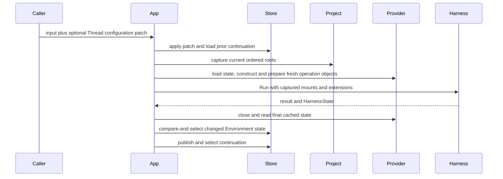

# Projects, Threads, and Environments

## Design Position

A Project is the optional Harness UI concept for grouping working context and organizing project-bound root Threads. It may select remote [Environment bindings](04a-devices-and-environment-bindings.md) without any local roots. It owns a mutable named ordered root list and Project-scoped creation configuration for project-bound conversations. Threads can run without selecting a Project. Harness UI defines no separate Workspace resource, Workspace root collection, or `WorkspaceBinding` input.

A Thread is one continuation-backed root or child conversation. It owns mutable sticky selections for Project, Agent, optional default Model, ordered local directory references, local Environment profile, additional Environment bindings and default mount, Harness Plugins, Environment Run Extensions and MCP servers. A Run can atomically patch those selections and captures their complete effective values before execution. Subsequent Project or Thread changes do not affect the admitted Run.

## Projects

One file under `projects/` defines a Project:

```yaml
schema_version: "1"
kind: project
id: project-agent-foundation
name: Agent Foundation
position: 0
roots:
  - path: /work/agent-foundation
  - path: /work/design-notes
```

The conceptual root-identity projection is:

```python
class ProjectRoot(BaseModel):
    path: str


class Project(BaseModel):
    id: ProjectId
    name: str
    roots: tuple[ProjectRoot, ...]
    position: int
```

Source loading expands home paths and canonicalizes absolute roots without requiring the directories to exist. Roots are ordered, unique, bounded, and NUL-free. Retained configuration decoding validates their structure without resolving paths or consulting current filesystem availability. Missing or moved roots do not prevent catalog inspection, accepted-generation recovery, or unrelated Project use. Selected Run Environment preparation resolves and verifies every captured root as an accessible directory and rejects unavailable or duplicate normalized roots without falling back to projectless execution. When present, the first local root is the compatible local default unless an explicit Environment default selects another mount, and receives alias `workspace`; later roots receive `workspace-2`, `workspace-3`, and so on. These are Run-local mount names, not opaque Harness mount IDs or Workspace resources. The selected profile's approved Host adapter determines whether those mounts preserve canonical Host paths or use virtual aggregate routes. Project position provides stable user ordering; recency is aggregated in storage from all associated non-archived Threads and does not belong in the file or a bounded Thread-list scan.

Project roots initialize a new Thread's `local_roots` as ordered path references. No directories, files, or worktrees are copied. Changing Project roots does not change existing Threads or admitted Runs. Changing a Thread's Project association alone preserves all environment selections. Removing a Project file removes it from the next accepted generation. Existing Threads retain the unresolved ID and reject later Runs until explicitly reassigned; no global fallback silently changes their local authority.

### Project Creation Configuration

A Project combines working roots with resource selections for creating conversations: Agent, Environment profile, Harness Plugins, Environment Run Extensions, and MCP servers. These selections refer to the existing resource catalog; they are not embedded copies of Provider implementations, credentials, or runtime objects. Agent-owned Model and Capability choices retain their own composition authority.

Each Project owns one `defaults` combination in its file-backed resource, not a collection of named presets. Its optional fields are `agent`, `environment_profile`, `environment_bindings`, `default_environment`, `harness_plugins`, `environment_run_extensions`, and `mcp_servers`; null has the same fallback meaning as omission. Lists contain ordered, unique IDs and retain explicit empty selections. Old files without `defaults` remain valid. New root Threads selecting that Project automatically use it through the [configuration default rules](01-configuration-and-resource-catalog.md#global-defaults), with explicit creation choices taking precedence. Omitted selections retain the ordinary creation fallback behavior; an explicitly empty collection selects none, and nonempty collections replace lower layers as a whole. In an explicit Thread creation request, an omitted `default_environment` follows creation defaults, while explicit null selects automatic default resolution rather than inheriting the Project's named default. The resulting Thread stores exact values, not a live inheritance link. A new Thread's selected Project and effective configuration are inspectable before execution.

Editing a Project's creation configuration does not rewrite existing Thread selections. Applying current Project selections to an existing Thread previews and updates only the axes explicitly present in the Project's default combination, including explicit empty collections. Unspecified axes retain the Thread's values. The action uses an explicit expected-version configuration mutation; it does not alter an admitted Run. Its preview includes the Thread configuration version, current and proposed exact configurations, a patch containing only Project-specified axes, and the canonical digest of that Project's default combination. Apply names the reviewed version and defaults digest. Changed Thread selection or defaults rejects apply as stale; unrelated source edits do not invalidate the defaults digest. An empty combination produces an unchanged preview and cannot be applied. Preview allocates no Thread, Run, or continuation. Editing a selected shared resource's content retains its independently specified later-Run effects.

**Apply Project environments** is a separate explicit replacement of exactly four axes: local roots, local profile, remote bindings, and default environment. It preserves Agent, Model, Project association, Plugins, Run Extensions, and MCP selections. Omitted Project bindings replace with empty; the profile follows Project, global, then builtin creation precedence. Preview and apply use the Thread version and a digest of the effective environment replacement, including roots and resolved profile. Unrelated Project defaults do not invalidate this preview.

Project grouping does not imply that every Thread shares a worktree, native process, or remote sandbox. Human [Host Files and Terminal](webui/02-host-computer-sharing.md) operate on the server, not on the selected Agent Environment. No separate Environment browser or debug terminal is introduced.

### Current-directory Resolution

The full-terminal CLI uses [exact-first-root Project selection](07-interactive-cli.md#project-selection-and-resume): it reuses the Project whose first root equals the invocation directory, preserving all roots, or creates a single-root Project when none matches. It never silently adopts a containing ancestor. New conversations reject ambiguous exact matches; an explicit saved Thread can disambiguate its existing Project when that Project matches. Explicit CLI resume reassigns a root Thread from another, missing, or null Project to the invocation directory's Project through the ordinary expected-version configuration mutation, selecting that Project's local path references and `workspace` default while preserving remote bindings and the local profile. Resuming within the selected Project preserves the Thread's independent roots. This changes later root Runs, not historical captures or existing child selections. Creation, resume listing, and explicit resume use the same App-owned matching rule. There is no CLI-specific Project type or separate Workspace resource.

The containing-directory query below remains available to embedding adapters and is read-only. Its ancestor matching is an explicit adapter policy, not the CLI launch default.

The App can resolve a normalized current working directory to a Project for a local surface. Only each Project's first root participates in this launch lookup; later roots are additional Run mounts rather than independent Project entry points. A current directory equal to or beneath a first root matches that Project. The most specific containing first root wins, while an equally specific path shared by several Projects is ambiguous.

Resolution returns a configured Project or an unmatched or ambiguous outcome. It never creates a Project, adds or reorders roots, or makes the launch directory a surface-owned authority. The selected Project retains its configured first root as the default working directory represented by mount alias `workspace`, even when the current directory is a descendant. A surface that does not expose Project management can use this result as its new-Thread context and default Project filter.

## Threads Without a Project

When neither creation input nor an explicitly configured global Project default selects a Project, the App creates a Thread with `project_id: null`. An explicit null creation selection suppresses the global Project default; an omitted selection can use it. Collaboration-created Threads preserve their source Thread's optional Project, including null. No placeholder Project or Project roots are created. Without explicit local roots, its Run composition adds no `workspace` mount or local workspace Skill sources. Projectless Threads can also explicitly select local directory references; Project association is not their authority. Global guidance, global Skills when selected, installed content, and the selected configuration directory remain available under their ordinary contracts.

Without an explicitly selected Environment default, the default working mount is `thread-files`, with `tmp/` as its working directory. This applies to relative file paths and omitted shell cwd; built-in modes retain their selected execution policy. A custom adapter's file-only Thread mount does not acquire shell support. Child Threads inherit the parent's optional Project selection and receive their own scratch area. Explicitly selected but missing Projects still fail; they never silently turn into projectless execution. Existing project-bound Threads and CLI exact-cwd selection remain unchanged.

## Thread Identity

```python
class ThreadMetadata(BaseModel):
    version: int
    title: str | None
    archived: bool


class Thread(BaseModel):
    thread_id: ThreadId
    parent_thread_id: ThreadId | None
    created_at: datetime
    updated_at: datetime
    metadata: ThreadMetadata
    configuration: ThreadConfiguration
    initial_state: ObjectRef
    continuation: ContinuationRef | None
```

A root Thread has no parent. An async child records its immediate parent and shares no mutable runtime object with it. The selected `HarnessState.thread_id` equals the Harness UI Thread ID; Harness UI does not add a second Session identity for the same conversation.

Current Run receipts, status, subscribers, steering queues, and live output remain process-local. A Thread can exist with no live Run. Thread creation calls `HarnessState.new()` once, uses its generated `thread_id` as the Harness UI Thread ID, and publishes that empty value as `initial_state`. The Thread initially has metadata version one and no selected continuation. Its first admitted Run uses `initial_state`; a complete root model-request checkpoint can select the first continuation before model output, followed by valid terminal checkpoints under the [continuation policy](03-local-storage-and-recovery.md#run-composition-and-continuation). The first saved authored input supplies the automatic conversation title/excerpt without replacing an explicit title.

Title and archive state form one metadata compare-and-select head independent from sticky configuration. A metadata command names the exact expected metadata version and atomically updates either or both fields. A changed head increments once; a no-op can retain its version. Title can be explicitly cleared. Root archive is rejected while that Thread has a current-process root operation, so an accepted operation cannot become hidden mid-Run. Child metadata changes require the parent-scoped child boundary.

## Coordinator

A Project can contain multiple Coordinators. A Coordinator is a durable role of an independent root Thread, not a singleton Project binding or a new conversation type. Human creation through `create_thread(coordinator=True)` / `POST /api/threads` with `coordinator: true` establishes this role atomically with the Thread and configuration head. Creation requires an accepted Project and cannot combine Coordinator role with worker ownership or child lineage; omission defaults to an ordinary root. Creation admits no Run; first-message submission remains a separate operation. An authenticated human promotes an ordinary project-bound root through `promote_coordinator(thread_id)` / `POST /api/threads/{thread_id}/coordinator`. Promotion requires an accepted Project, an unarchived inactive root, and no pending decisions. It preserves the Thread ID, title, history, drafts, configuration and URL; it creates no Run and calls no Model. Concurrent promotion of the same eligible root is idempotent; promotion of different roots creates independent Coordinators. Workers and child Threads cannot be promoted. Promotion is one-way, with no demotion, adoption, owner transfer or nested Coordinator operation.

`ThreadSummary.role` is `ordinary`, `coordinator`, or `worker`; `coordinator_thread_id` identifies a worker's owner and is otherwise null. `auto_followup` is a boolean only for Coordinators and is otherwise null. Roles are derived from the durable Coordinator and worker records, not duplicated in Thread metadata. Projects have no canonical Coordinator field. Each new Coordinator starts with `auto_followup=true`. `set_auto_followup(thread_id, auto_followup)` / `PATCH /api/threads/{thread_id}/coordinator` changes only that notification setting, with last-write-wins semantics and Thread invalidation. It neither changes role nor admits a Run.

A Coordinator owns workers newly created by its shared `create_thread` tool or explicitly assigned by an authenticated human at creation through `POST /api/threads` with `coordinator_thread_id`. Model-tool callers cannot supply an owner: the Host derives it from the source's durable identity. Human creation validates an unarchived Coordinator and an available same-Project selection; it uses ordinary explicit creation defaults, not Sidekick defaults. `coordinator=true` and a non-null owner are mutually exclusive. Each worker is a root with `parent_thread_id=null`, its own history, drafts, configuration, admission, steering, cancellation and pending decisions. Ownership is a flat, immutable, same-Project relation separate from subagent lineage. Coordinators and workers cannot change or clear their Project; other sticky selections remain editable. A worker cannot create another root. Human-created roots without an explicit owner, older Sidekicks and unrelated conversations remain independent; promotion never adopts them.

Archive preserves role and ownership, with explicit Restore required before execution. Renaming or removing a Project resource does not delete saved roles or history. Sidekick configuration controls creation defaults, not promotion, role, visibility, scope or automatic follow-up. With Sidekick disabled a Coordinator can still create its workers using ordinary creation defaults. Turning off automatic follow-up retains all role capabilities and worker ownership.

When `auto_followup` is enabled, the WebUI Host attempts to run or steer a Coordinator after one of its owned workers settles, and on an admitted human submission to an initial-state owned worker. Human inspection and execution remain unrestricted ordinary root operations. No separate worker execution API, durable delivery queue, Project-wide stop or approval aggregation is added. [Runtime instructions and notifications](05-runtime-subagents-and-surfaces.md#coordinator-instructions) own coordination behavior; [browser presentation](webui/04-workbench-interaction.md#coordinator-entry) reflects the role and ownership.

## Sticky Thread Configuration

```python
class AgentResourceSource(BaseModel):
    agent: AgentId


class MarkdownSubagentSource(BaseModel):
    markdown: SubagentId


AgentSource = AgentResourceSource | MarkdownSubagentSource


class ThreadConfiguration(BaseModel):
    version: int
    project_id: ProjectId | None
    agent_source: AgentSource
    default_model_id: ModelId | None
    local_roots: tuple[str, ...]
    environment_profile_id: EnvironmentProfileId
    environment_bindings: tuple[EnvironmentBindingSelection, ...]
    default_environment: str | None
    harness_plugin_ids: tuple[PluginId, ...]
    environment_run_extension_ids: tuple[RunExtensionId, ...]
    mcp_server_ids: tuple[McpServerId, ...]
```

The stored value is exact. It contains no omitted or globally enabled state. `default_model_id` is an optional Model resource ID: null follows the selected Agent's current Model, while a non-null ID persists independently of Agent edits. Effective root Model precedence is explicit per-Run override, then Thread default, then Agent Model. An override containing only thinking, fast, or service-tier settings retains that precedence. Missing selected Models fail admission without silently falling back. Explicit Run overrides never change the stored default or historical captures. A configuration patch can set the default, explicitly clear it with null, or omit it to retain the current value. A null `project_id` means no Project, not an unresolved reference or a request to inherit a global default. A configuration patch can explicitly clear the Project with null; omission retains the current selection.

A new root Thread resolves its Agent resource from explicit creation input, the selected Project's Agent default, or the root YAML Agent default into `AgentResourceSource`, then resolves other axes under the shared creation precedence and stores the exact result. Root Threads cannot select a Markdown subagent as their source; that concise format depends on a parent Agent capture.

A child Thread stores the selected roster entry as either an Agent resource or Markdown subagent source. Project, local roots, Environment profile, remote bindings, default mount, and Run Extensions default from the admitting parent capture. Agent-resource children use their own Plugin and MCP defaults when present; Markdown children inherit the admitting parent capture's exact Plugin and MCP lists. After creation the child owns these stored selections independently. Agent-resource children start with a null default Model and retain their independent Model selection. Markdown children inherit the admitting parent Model and reject a non-null `default_model_id` rather than silently ignoring it.

## Configuration Patch and Run Admission

A Thread can change configuration before or after any Run:

```python
class ThreadConfigurationPatch(BaseModel):
    project_id: ProjectId | None | Unset
    agent_source: AgentSource | Unset
    default_model_id: ModelId | None | Unset
    local_roots: tuple[str, ...] | Unset
    environment_profile_id: EnvironmentProfileId | Unset
    environment_bindings: tuple[EnvironmentBindingSelection, ...] | Unset
    default_environment: str | None | Unset
    harness_plugin_ids: tuple[PluginId, ...] | Unset
    environment_run_extension_ids: tuple[RunExtensionId, ...] | Unset
    mcp_server_ids: tuple[McpServerId, ...] | Unset
```

Omitted fields retain the current Thread value. An empty collection disables all resources on that axis. A non-empty collection is the exact ordered enabled set. There are no retained disabled association rows.

A configuration mutation command contains an exact expected version:

```python
class ThreadConfigurationMutation(BaseModel):
    expected_version: int
    patch: ThreadConfigurationPatch
```

Every non-empty patch, including one admitted with Run input, requires `expected_version`. A root Thread patch rejects a Markdown `agent_source`; a child Thread can replace its source with either form. A Run admission with no configuration patch can omit the expected version because it does not write the configuration head. The combined admission operation:

1. loads the current Thread configuration;
2. rejects a non-empty patch whose required expected version differs;
3. applies and validates the patch;
4. commits the new exact configuration and incremented version;
5. captures the accepted generation, Thread local roots and complete Device/Environment binding inputs before returning an admission receipt or scheduling preparation;
6. resolves and publishes the immutable Run composition from those detached inputs;
7. closes all transactions before native construction or external I/O;
8. starts the Harness Run with the selected continuation's `HarnessState`, or the Thread's immutable `initial_state` when no continuation is selected.

The accepted patch applies to this Run and subsequent Runs. A separate update during an active Run is allowed but affects only the next admission. Steering never changes captured configuration.

Root prompt admission also accepts an optional Run-only `environment` patch with local roots, local profile, remote bindings, and default environment. Omitted axes retain the Thread selection; empty lists clear that selection; explicit null clears only the default environment. The resolver validates the resulting combination and captures it before runtime entry without changing the Thread head or its version. Unknown profiles and failed preparation never fall back to another mode. Environment state continues to use the captured profile's existing binding key. Paths reference the same files across mode changes.

Deferred responses, including automatic interaction timeout responses, retain local roots, Environment profile, remote bindings, and default environment from the selected continuation's captured composition unless response admission explicitly mutates that axis. Unrelated configuration mutations do not drop captured environment selections. The retained ID is resolved against the accepted generation; this does not freeze a custom profile's old recipe. A later ordinary prompt without an override again follows the Thread selection. New child Threads inherit the admitting parent's captured profile; existing child Threads retain their independent configuration when resumed.

## Thread Queries

Root Thread lists use opaque keyset cursors over descending `(sort_time, thread_id)`. The default `updated` sort retains `updated_at`; `activity` uses saved conversation activity with creation-time fallback, and `touched` uses [navigation recency](03-local-storage-and-recovery.md#navigation-recency). The selected sort, optional Project filter, query, archive filter, and root-only shape are bound into the cursor. The WebUI active-separated view also binds its active/inactive filter shape; current-process activity membership is a live observation, not a cursor snapshot. Child execution and transcript pages likewise use deterministic opaque cursors for their own stable order. A cursor from another query shape is invalid rather than reinterpreted as an offset.

The summary projection exposes metadata and configuration versions, selected resource IDs, continuation state, and current-process activity without exposing a storage contract. The detail projection adds deferred requests and available actions. Transcript entries are bounded typed presentation values derived from the selected `HarnessState`; they are not serialized Pydantic AI messages and do not authorize continuation.

Project recency is the maximum `updated_at` over every associated non-archived Thread. The repository computes it as an aggregate independent from page limits, so Projects with older or child Threads are not omitted by an arbitrary scan bound.

## Environment Profile and Binding

A Thread selects one local-root Environment profile defined by [Extension Discovery and Management](01a-extension-discovery-and-management.md#environment-provider-discovery-and-profile-resources), plus optional [Device Environment bindings](04a-devices-and-environment-bindings.md). The latter contract owns normalization, remote-only Projects and explicit default selection. A profile chooses one installed Provider plus Harness UI Host adapter configuration; it does not represent the runtime `Environment.environment_id`.

Harness UI owns two built-in modes:

| Mode             | Stable profile ID     | Project Provider    | Execution semantics                                                                              |
| ---------------- | --------------------- | ------------------- | ------------------------------------------------------------------------------------------------ |
| **Full Control** | `environment-native`  | Direct Local        | Commands run directly as the Host user with ambient filesystem and Host networking               |
| **Sandbox**      | `environment-sandbox` | Local Envd over EIP | Envd applies restricted grants and denied networking to the complete Session worker; no fallback |

Full Control is the omission fallback only while creating a root Thread for compatibility. A later missing or failed selected profile never falls back. Both built-in modes are fixed release-owned recipes and cannot be shadowed by configured profile resources.

For each captured Project root, the App:

1. resolves the exact Provider and approved Host adapter;
2. loads current Host-authoritative state under the complete binding key;
3. asks the adapter to materialize root-specific validated Provider configuration;
4. creates a fresh inert `Environment` operation object and performs Harness UI Host-authorized preparation before passing it to Harness;
5. constructs the deterministic Harness Project mount set;
6. adds the dedicated user Skill mount when the Run root Agent selects `skills`, unless an exact Host-path-preserving Project mount already owns that root;
7. adds the selected configuration directory and Thread file area under the contracts below; and
8. creates fresh selected Environment Run Extensions around that aggregate.

Full Control opts into Direct Local's complete Host-process environment inheritance for every native command, including commands on the Thread file mount. Per-command environment set/unset operations are unrestricted by a key allowlist and override that inherited baseline without changing the Host process. Values such as PATH, proxy settings, and exported credentials remain runtime-only and are not stored in Run compositions or Environment state. Existing Full Control selections receive this behavior without editing configuration. Sandbox and custom profiles retain their own environment policies; shell aliases, unexported variables, and interactive startup files are not part of process environment inheritance.

The Provider configuration and adapter do not own the Project root list. The adapter receives one root at a time, can reject roots it cannot represent, and explicitly declares whether aggregate paths preserve Host spelling. The user Skill root follows [Environment Skill Sources](02b-environment-skill-sources.md). It ordinarily uses a separate Host-owned Direct Local file-only route, but reuses an equal Host-path-preserving Project mount rather than creating a route conflict; neither form changes Project roots or adds separate Project Environment-state publication.

### Aggregate Path Layout

The Full Control and Sandbox adapters preserve Host paths. Harness UI assigns each Project mount an explicit Harness `mount_path` equal to the captured root's canonical Host path. The first and later roots are therefore addressed by their real paths in model context, file tools, returned file results, explicit shell working directories, File Context, and Skill sources. They do not also publish `/workspace` or `/environment/workspace-N` routes.

This shared spelling does not merge execution authority. Full Control translates the aggregate suffix to a Project-root-confined Direct Local file operation or initial command working directory; after a Host command starts, the ordinary Host shell and descendants remain unrestricted and can use `cd ..`, absolute paths, Host networking, and other ambient Host-user authority. Sandbox translates the same aggregate suffix to a Provider-local EIP path; Local Envd resolves it inside the Envd-managed Session worker. The Host supplies fixed directory grants and `egress.mode: deny`; Envd preserves path spelling and enforces those grants for files and commands alike. The Session working directory supplies defaults, not confinement.

An explicit shell `cwd` is an aggregate mount selector in both modes. It must resolve within an available route and cannot contain `..` traversal segments. Relative or omitted `cwd` starts from the selected mount's working directory: the Project root for a Project mount, or `tmp/` for the Thread file mount. This selector rule does not claim to confine a Full Control command after launch: a script such as `cd .. && pwd` runs with ordinary Host semantics. In Sandbox the same script remains subject to the Device's fixed grants and network mode, not a per-command policy.

An approved custom adapter that explicitly preserves Host paths receives the same aggregate layout. Other adapters omit `mount_path`, so Harness compatibility routing presents the first root at `/workspace` and later roots at `/environment/workspace-N`. A canonical-looking aggregate route is presentation and routing metadata, never proof of Provider authority.

The same adapter decision applies to the dedicated Direct Local user Skill mount. A Host-path-preserving profile exposes its canonical resolved `~/.agents/skills` path; a virtual-layout profile routes it as `/environment/user-skills`. When a Host-path-preserving Project mount already has that exact path, Harness UI omits the duplicate dedicated mount and routes the user Skill source through the Project mount. Otherwise internal mount aliases, opaque mount incarnations, permission ceilings, Environment-state keys, and source precedence are unchanged by presentation layout.

Harness UI selects preparation under its own Host policy; Service Template preparation and retention settings are not Harness UI resources. Harness scope entry never performs a second provider connection.

### Configuration File Mount

When the App has a selected configuration path, every root or child Run exposes its parent directory through a `configuration` mount. This is the actual selected directory, normally `~/.a13n-harness-ui`, not a fixed home-directory guess; `--config` selects a different parent. It is a Host Direct Local read/write file-only mount with no shell, process, output, or port operations. It remains available without a Project and under Sandbox, without granting a Sandbox command access to it. Host-path-preserving profiles expose the canonical directory path; virtual profiles use `/environment/configuration`. An existing mount with that exact canonical path is reused instead of creating a conflicting route. No configuration mount is added for an embedding App without a selected configuration path.

The directory is not a Project and does not contribute Project Skills or change the working directory. It has no Environment-state head. Agent file edits use the same stable-read, complete validation, and accepted-generation rules as human edits; invalid edits leave the accepted generation active, and active Runs retain their captured configuration. Process settings still require restart. This is explicit read/write access to the selected directory, not just its root YAML; it is not a promise to hide other files located there.

### Thread File Mount

Each App-prepared root or child Run receives a `thread-files` mount for its own Thread file area. The [storage contract](03-local-storage-and-recovery.md#thread-files-and-automatic-scratch-cleanup) owns its persistence and cleanup. The mount contains `tmp/` for scratch work and `attachments/` for submitted inputs. Built-in Full Control and Sandbox modes bind this area as a separate root using the selected adapter and profile; model-facing paths follow the same canonical-host-path rule as Project roots. Scratch files are usable through real Environment file operations and shell cwd selection, not merely through a path mentioned in a prompt. This mount's default working directory is `tmp/`; it is the default mount when no Project is selected.

Sandbox shell access follows the shared daemon's Host-provided launch boundary, not its selected cwd. A Host may group captured Project roots and that Thread's file area in one outer launch to permit attachment processing; unrelated Host paths remain outside that boundary. Separate launches are required when different native isolation boundaries are intended. Custom adapters receive a Host Direct Local file-only mount rather than silently interpreting a Host directory as a remote Provider workspace. Availability and permission ceilings remain authoritative. Release-owned guidance tells the model to preserve attachments and to copy valuable results out of scratch.

When an Agent selects `native_image_generation`, UI instantiation supplies the Harness Capability with a saver that writes a uniquely named image under the current Run's `thread-files/tmp/` through the Environment file boundary. This applies to roots and children, with or without a Project, and to Host-path and virtual-path layouts. It returns the aggregate file path only after the write succeeds. Generated images are scratch outputs, not submitted attachments; transcripts and continuation messages contain the saved references rather than generated image bytes. Scratch retention and pruning apply unchanged. Keeping an image long-term requires copying or publishing it outside scratch.

This mount is not a Project binding or a durable shell-process recovery store. It publishes no Environment-state head. Finalization closes its Run-local Environment like other mounts while retaining the files themselves. Child Threads have their own file area; no parent's file authority is implicitly inherited.

## Host-authoritative Environment State

Full Control and Sandbox bind local Project roots as Provider configuration, preserve their Host paths in the Harness aggregate namespace, and ordinarily retain no portable re-entry state. Additional Device bindings use the separate [binding-state identity](04a-devices-and-environment-bindings.md#state-and-connection-ownership), not the local-root key below. Their identical path presentation does not change their distinct Direct Local and isolated EIP execution authority. A stateful Provider can return `EnvironmentState` for one root.

Harness UI uses one private binding identity:

```text
Thread ID
+ Environment profile ID and normalized profile digest
+ Host adapter key
+ normalized Project root path
```

The profile digest reuses the accepted generation's canonical normalized content for `provider_key`, Provider schema version, Provider configuration, Host adapter key, and adapter configuration. It excludes filename, YAML formatting, comments, and display-only fields. State lookup, supplied-state comparison, and publication use exactly that identity. Existing authoritative `None` does not permit fallback from `HarnessState.environment_states`. Continuation Environment state is a portable observation only and can be adopted only through an explicit import boundary.

Changing the selected Environment profile or any behavior-affecting normalized content produces a different state identity. Presentation-only edits preserve it. Switching back to the same compatible identity can recover its previous state. Removing and later restoring the same Project root behaves similarly. State is never shared merely because two Threads select the same Project.

## Root Run Environment Flow



Cleanup precedes final state reading. Environment-state publication occurs after failure or cancellation when a changed final value is known. Equal state performs no write. Environment-state and continuation publication are independent facts and do not roll one another back.

## Async Child Environments

A newly delegated child Thread initializes Project and Environment profile selections from the parent Run capture. Every child segment later uses the child Thread's own current selections and can apply an explicit patch before resume.

Each segment receives fresh Provider runtime collaborators, adapters, and Environment Run Extensions. It never borrows the parent's entered Environment facade. A descendant initializes from its admitting child capture under the same rule.

## Local EIP Runtime

Harness UI reads the installed `a13n-envd-client` distribution version through `importlib.metadata` when managed acquisition is requested. The client is co-versioned with the native daemon. A stable Python version selects the same canonical native version; a PEP 440 RC such as `0.0.5rc1` selects `0.0.5-rc.1`. The application derives the GitHub Release tag and archive name from that version and the current OS/architecture; it has no packaged native version resource, latest-release lookup, or per-target hashes, sizes, or asset catalog.

Source version `0.0.0`, missing distribution metadata, and unsupported or invalid version metadata fail managed acquisition without selecting a release. They do not prevent Full Control or an explicit validated executable override. Sandbox resolves only the managed executable or that override, which still passes executable-version and EIP compatibility checks; its Host launcher separately validates the outer sandbox. It does not search ambient `PATH` or download a binary for Full Control execution.

Acquisition uses HTTPS from the repository-owned release location. Download and extracted executable sizes are bounded by the runtime acquisition limit. Only the named executable is copied out of an archive; archive paths and links are not installed. A candidate must report the selected version through `--version` before atomic publication to the version-and-target cache. A cached executable is reusable only when it is a regular executable reporting that version. Failed acquisition leaves no selected candidate and does not replace an existing cache entry.

This is version-based selection, not byte-level identity verification. Harness UI trusts the release source and does not detect replacement bytes that report the same version. Checksums published alongside native releases remain available to standalone installers and other consumers; Harness UI does not embed or require them.

The App lazily owns a Local Envd runtime and reuses its stdio Device connection across roots and Runs with the same Host launch boundary. Each adapter opens an independent Session. For Sandbox, the App supplies fixed grants for the intended native roots and denied networking; Envd contains the complete Session worker and its children. The Thread file worker grants attachments read-only and tmp read-write. Changing grants or network mode requires a separately prepared launch; Session destinations or credential revisions do not change the daemon cache identity. Unsupported Hosts or failed prerequisites make Sandbox unavailable without Full Control fallback.

Run cleanup closes Sessions, not the shared daemon. App shutdown joins/cancels Runs, closes remaining Sessions and then shuts down its owned local runtimes. There is no cross-App daemon adoption or persisted process recovery. The executable cache carries no Thread, Project, root or Environment authority; connections, generations, process handles and output references remain process-local.

## Thread Tools and Project Authority

Model-visible root Thread tools can list and inspect Threads, start or continue another root Thread, and steer an active Run. `run_thread` rejects a child target, defaults to the root target's sticky configuration, and accepts no arbitrary local root paths from model arguments. It cannot bypass a selected deferred request set. Async child continuation uses the linked `resume_subagent` path so the current parent roster and delegation ceilings remain available. Changing Project requires an explicit authorized Thread configuration operation through the App boundary.

`steer_thread` resolves and targets one exact process-local root receipt and preserves that Run's captured composition. Same-active-Thread recursive run or steer calls are rejected.

## Failure Semantics

| Failure                                                           | Outcome                                                                     |
| ----------------------------------------------------------------- | --------------------------------------------------------------------------- |
| Invalid or inaccessible Project root                              | Candidate generation or Run capture fails before native execution           |
| Current directory matches no first root                           | A launch surface receives an unmatched result without creating a Project    |
| Current directory is equally ambiguous                            | A launch surface receives an ambiguous result without choosing arbitrarily  |
| Project removed from accepted generation                          | Existing Thread remains inspectable; next Run requires reassignment         |
| Stale Thread configuration version                                | Patch and admission are rejected without partial changes                    |
| Provider, Host adapter, or required Sandbox isolation unavailable | Run capture or preparation fails; Full Control is not substituted           |
| Current Environment state invalid                                 | Admission fails explicitly                                                  |
| Provider preparation or extension entry fails                     | Harness reports Run failure; known changed cached state is still considered |
| Cleanup or state publication fails                                | Failure is reported independently from continuation selection               |
| Continuation publication conflicts                                | Prior or concurrent continuation remains current                            |

## Invariants

01. Project is the only local-root grouping and root-Thread organization concept; Harness UI defines no Workspace resource.
02. Project roots initialize independent Thread path references; Runs capture the Thread's selected roots. `workspace` is only the first root's mount alias.
03. Current-directory lookup uses only configured first roots and never creates or mutates a Project.
04. Thread metadata and configuration are independent mutable compare-and-select heads.
05. Thread configuration is exact, versioned, and sticky.
06. Omitted patch fields preserve prior Thread state; empty lists disable one complete axis.
07. A Run captures one configuration generation, one Thread version, and one Project root list.
08. Root and child Threads can change Agent, extension, MCP, Project, and Environment profile selections between Runs.
09. Thread and transcript pagination uses query-bound deterministic keyset cursors; root lists bind their optional Project filter.
10. Every independent Run receives fresh Environment adapters and Run Extensions.
11. Environment state is isolated by Thread, Environment profile behavior, adapter, and root path.
12. Steering never changes an active Run's captured composition.
13. Destructive Provider lifecycle remains outside ordinary Run cleanup.
14. A selected Skills Capability adds only Environment-routed Skill sources and, unless an exact Host-path-preserving Project mount already covers it, the dedicated user Skill mount; it does not broaden a Project Provider's Host paths.
15. Full Control and Sandbox preserve the same canonical Host path spelling while retaining Direct Local versus Envd-managed restricted Session execution authority.
16. Sandbox failure never falls back to Full Control or disabled isolation.
