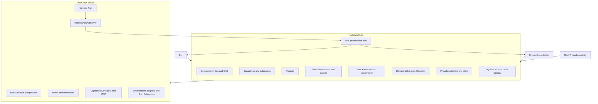

# Runtime, Async Subagents, and Surfaces

## Design Position

`HarnessUiApp` is the only Harness UI application boundary. It runs configuration, catalog, Project, Thread, Harness, Model, Capability, Plugin, MCP, Environment, subagent, and observation behavior in one process. The full-terminal CLI and explicitly enabled embedding tools are thin adapters over its typed commands and queries.

Harness UI implements the Harness `SubagentOperator` contract as `HarnessUiSubagentOperator`. It persists each async child as an ordinary child Thread, runs each delegate or resume as an independent segment, saves exact checkpoints, and returns bounded saved execution views.

Harness UI is not a Python package installer or upgrade supervisor. Already imported extension and Capability code remains fixed for the App lifetime. Shell references and observations are Run-local. Provider state owns native command recovery; Harness UI adds no separate process manager or wake path.

## Application Ownership



The App owns:

- stable multi-file and installed Content Plugin loading, accepted-generation selection, diagnostics, and expected-digest mutations;
- Capability and three-plane runtime extension catalog projection;
- Project, configured-resource, and Environment-profile queries, including the two release-owned execution modes;
- Thread creation, metadata and configuration mutation, Project-filtered keyset queries, and transcript projection;
- process-local root admission, receipt correlation, execution, deferred response, waiting, cancellation, and steering;
- immutable Run composition and continuation publication;
- Project-root Environment binding and state lifecycle;
- async child admission, execution, checkpointing, query, wait, steering, cancellation, and linked resume;
- detached presentation, root-lineage live delivery, summary invalidation, and bounded graceful shutdown.

It does not expose database sessions, storage paths as authority, native Models, credentials, Provider objects, Environment adapters, Harness contexts or results, Pydantic AI message objects, runtime task or lock objects, callbacks, or Python exceptions through a surface API.

## App Lifetime

One App lifetime:

1. resolves the config path and bootstrap data-root locator, then configures logging at the executable boundary;
2. opens and migrates local storage without depending on a valid root YAML;
3. loads or restores the last accepted file-and-Content-Plugin generation and reports current source diagnostics;
4. initializes Capability and extension catalogs plus release-owned Model, MCP, and Environment adapter integrations;
5. starts bounded configuration change observation;
6. attaches the CLI or embedding adapter;
7. serves commands until shutdown;
8. stops new admissions, requests cancellation after a bounded graceful-drain interval, joins owned tasks, and then closes collaborators.

The shutdown timeout bounds graceful draining before cooperative cancellation. Harness UI retains structured ownership and keeps storage open until its tasks exit, so it does not claim a hard return deadline against arbitrary trusted Python code that ignores cancellation or creates an unbounded shield. Built-in collaborators and extension cleanup paths have their own finite bounds; a process supervisor owns any required hard process-termination deadline.

When `process.pricing_auto_update` is enabled, the App owns Pydantic AI's background price updater for its lifespan. Startup does not wait for the first download; upstream downloads happen immediately and hourly with last-good fallback. Root, async-child, and resumed-child construction capture the current Harness catalog off the event loop and bind it through the public build API. Already constructed Agents and emitted usage remain unchanged under the [Harness cost contract](../a13n-harness/12-events-observability-and-usage.md#cost-calculation). Price availability is diagnostic, not an App-readiness dependency. Shutdown releases this App's updater ownership without waiting for an in-flight download or clearing process-global prices. There is no App-owned second scheduler, disk price cache, or historical cost revaluation.

A source change triggers a stable complete-tree candidate load. Invalid intermediate saves do not replace the accepted generation. Module import starts no task, process, listener, or database connection.

## Root Run Coordination

### Process-local Operations

Root prompt admission accepts native Harness `RunInputValue`: text or a sequence of Pydantic AI `UserContent`, including `BinaryContent`. This is a process-local input contract, not a serialized transport schema or permission to return native message objects in projections. The App normalizes and detaches mutable input before asynchronous admission. Image-only input is valid; empty or whitespace-only input is not. Native Harness messages and selected continuation checkpoints retain submitted content through the existing lifecycle. Provider capability failures are explicit; adapters do not silently discard content or substitute Models. The [CLI contract](07-interactive-cli.md#multimodal-drafts) owns terminal acquisition and recovery presentation. The App additionally accepts `ComposerInput` (expanded authored text, detached byte uploads, and optional input source ID), or native input with previously staged Thread-scoped attachment IDs. App stage/read operations return detached attachment metadata and bounded bytes rather than transport- or terminal-specific file objects. These are reusable process-local contracts; HTTP owns its serialized DTOs. All surfaces share the limits of eight attachments per input, 10 MiB per attachment, and 20 MiB in aggregate. Images undergo shared format/size validation and become native `BinaryContent`; ordinary files become descriptive `TextContent` with a relative `thread-files` mount reference. Attachment identity, original name, media type, size, and relative path travel in the `harness_ui` content metadata namespace and remain available in transcript projections. The App validates Thread existence and scopes every handle to that Thread.

One App admits at most one root operation for a Thread. Another root submission while that operation is preparing or running is rejected rather than queued. Admission returns a detached receipt immediately; the receipt ID is unpredictable, unique within the App lifetime, and is the exact correlation used by active queries, waits, steering, and cancellation.

A root operation progresses from `preparing` to `running`, then to `completed`, `suspended`, `failed`, or `cancelled`. Preparation failure is `failed`; `completed` or `suspended` requires the corresponding acceptable continuation to be selected. Its view can acquire a Harness Run ID after native stream construction and retains separate Harness execution, continuation-selection, Environment-state, and cleanup facts. The App retains the detached terminal view for the remainder of its lifetime, but does not persist the receipt or a replayable root-input queue. Retained attachments follow the separate [Thread file lifecycle](03-local-storage-and-recovery.md#thread-files-and-automatic-scratch-cleanup); authored conversation input is recovered through selected checkpoints, not through the receipt. A process restart therefore exposes the Thread and its last selected continuation but no prior operation, wait target, or control authority.

Cancellation is accepted against the exact receipt during both preparation and Harness execution. During preparation it cancels the App-owned operation scope; once a stream exists it also requests cancellation from that exact stream. Steering is available only while the receipt names the current running stream. A stale receipt can neither steer nor cancel a later Run on the same Thread. Wait observes the operation's state transition and has no effect on execution.

For an admitted prompt or deferred response, the App:

01. loads the root Thread, optional patch, required expected configuration version for a non-empty patch, and selected continuation;
02. validates and commits the sticky configuration update when present;
03. validates that the selected continuation accepts the input kind and, for a deferred response, still matches the caller's expected continuation ID;
04. captures the current accepted generation and selected Project roots;
05. resolves the exact Agent graph, Capabilities, tool visibility, Harness Plugins, Content Plugin snapshot, MCP servers, Environment Provider, and Environment Run Extensions;
06. publishes the immutable resolved Run composition;
07. creates fresh native collaborators; each subscription-backed Model request resolves and refreshes its compatible OAuth credential when needed;
08. starts one Harness stream and observer from the selected `HarnessState`;
09. forwards public live events best effort;
10. finalizes Environment adapters and publishes changed state;
11. publishes and compare-and-selects any available valid terminal checkpoint, including failed or interrupted execution, under the [continuation policy](03-local-storage-and-recovery.md#run-composition-and-continuation);
12. selects a detached terminal operation outcome with independent execution, continuation, Environment-state, and cleanup facts.

No database transaction spans file I/O, catalog import, native construction, or steps 7 through 11. If capture fails, an already committed explicit Thread patch remains the Thread's desired next state and the operation reports why it could not start.

### Root Deferred Response

A suspended root continuation exposes a bounded detached request list. Each item has its tool-call ID, request kind, tool name, JSON arguments, presentation-safe metadata, and a discriminated safe presentation when Harness UI recognizes the public request contract. The standard presentations distinguish structured `ask_user_question`, function-tool approval, and generic external result or denial. An unrecognized request retains the generic bounded representation; a surface never infers a specialized decision contract from display text. An ordinary prompt cannot skip a selected deferred request set.

A response command names the exact selected continuation and supplies exactly one response for every pending item. Approval responses approve, optionally with replacement JSON arguments, or deny with a bounded message. External-call responses supply a JSON result or a bounded denial. The App rejects stale continuation IDs, missing or additional IDs, duplicate IDs, kind mismatches, and values that cannot be represented by the corresponding native deferred result.

Only the App reconstructs the native deferred request and result batch. A response is a new root operation with fresh Run composition and collaborators; it does not reuse the suspended operation's runtime objects. The selected suspended continuation remains current unless the response operation publishes and compare-and-selects another acceptable continuation.

## Harness UI Subagent Operator

### Admission and Identity

The Harness resolves the selected child roster entry before calling the operator. The operator creates a child Thread whose discriminated Agent-resource or Markdown-subagent source comes from that entry. Project, Environment profile, and Environment Run Extensions initialize from the parent Run capture. Agent-resource children use their own Plugin and MCP defaults when present; Markdown children inherit the parent capture's exact Plugin and MCP lists.

`delegate`:

1. verifies parent Thread and Run correlation;
2. creates the child Thread and exact sticky configuration;
3. captures and publishes the child Run composition;
4. commits segment zero as `running` before returning its execution ID;
5. starts the segment under App ownership.

A surface can update the retained child Thread through the ordinary required-version configuration command before resume. `resume_subagent` then loads that Host-authorized sticky configuration, requires a selected terminal child checkpoint, increments `segment_index`, captures the new composition, commits the execution, and starts it. The new composition need not equal either the one that produced the prior checkpoint or the current parent roster definition. Harness still requires the same stable roster name and current plan context. Harness UI reapplies that roster edge's Identity policy to the selected replacement definition and intersects the plan usage ceiling with the replacement's own limits; the model cannot select the replacement Agent source.

An accepted child execution can outlive the parent Run. Parent closure never cancels it by implication. App shutdown is the process-local ownership boundary.

### Child Run Construction

Each segment receives:

- the child Thread's resolved Agent-resource or Markdown-subagent graph and Capabilities; a Markdown source resolves its explicit inheritance from the parent Run authorizing that linked admission;
- fresh Model, Harness Plugin, and MCP collaborators;
- captured Project roots and Environment profile selection;
- fresh Provider runtimes, Environment adapters, and Environment Run Extensions;
- the child Thread's newly published empty `initial_state` for delegate or selected child checkpoint state for resume;
- one `HarnessAguiObserver` bound to the child Thread and Run.

No parent `AgentContext`, entered Environment facade, live state coordinator, Model client, task, callback, or shell-process authority crosses into the child.

### Observation and Checkpointing

The operator consumes ordered public Harness stream items and compacts them into the bounded display owned by [Local Storage and Recovery](03-local-storage-and-recovery.md#compact-child-display). Closed activity is published live only at closed boundaries. Terminal success is acknowledged only after Environment cleanup, terminal checkpoint publication, and atomic head selection.

Harness UI performs no automatic parent wake Run after child completion. A connected surface receives live completion, and a later parent Run reconciles through `subagent_info` or `wait_subagent` against saved heads.

### Deferred Requests

A child suspension is not forwarded to the user or parent Thread. The operator supplies the complete denial/no-response values required by the exact request set and continues through normal Harness continuation. The continuation uses a fresh child `run_id` and observer inside the same segment. Failure to continue safely produces explicit child failure.

### Queries and Control

The public execution view contains execution, root lineage, parent Thread, child Thread, child Run, segment, opaque composition identity, persisted status, bounded failure, resumability, compact activity, and current-process control availability. Persisted status and local activity are separate fields: a saved `running` fact can be locally `active` or `unavailable`. Available actions are derived from the exact local segment and never inferred from the saved status alone. The view contains no raw unbounded output or private state.

Steering, cancellation, and bounded live waiting operate only when the current App owns the segment in its process-local registry. A saved `running` value without a matching local runtime is inspectable but grants no control. Execution references are scoped to their originating parent relationship, and a stale execution ID cannot control a later segment.

### Loss and Retention

Orderly shutdown requests cancellation for locally owned segments. A durably completed cancellation becomes `cancelled`; a segment that cannot reach a terminal checkpoint becomes `lost`. Abrupt loss can leave a saved `running` head. Another App does not infer liveness, replay, or take over it.

Linked resume is permitted from a successful terminal execution whose exact selected checkpoint remains resumable, whose stable child roster name still resolves in the current parent, and whose current Host policy authorizes the operation. Compatibility applies to `HarnessState` schema and current selected component state, not equality with the prior Agent definition or Run composition.

## Detached Surface Contracts

All Thread, root-operation, child-execution, and presentation command results, query results, and stream items are strict, frozen, bounded, serializable values. A returned collection is immutable and every nested mutable payload is copied. Opaque digests or IDs can correlate a later command, but a surface never receives an immutable-object path, object kind, or storage read authority.

A root-Thread summary query accepts one Project selector: all root Threads, one exact Project ID, or unresolved Project references. The all selector includes every root Thread even when its current Project no longer resolves; an exact selector matches the current sticky Project ID; the unresolved selector matches Threads whose current Project ID is absent from the accepted generation. It also accepts an explicit archived selector and optional normalized search text. Search matches an exact Thread ID or a case-insensitive title substring; empty search is omission. These selectors change presentation membership only and never mutate Thread metadata or configuration.

Thread queries provide:

- a summary containing identity, parent identity, metadata version, title, archive state, timestamps, sticky configuration, selected-continuation state, and current-process root activity;
- a navigation summary containing the root summary plus pending-decision kind and count, current-process terminal outcome when retained, child persisted-status counts, the current-process `active` or `unavailable` partition of persisted-running children, latest safe activity and time, and exact available actions;
- a detail containing the summary, selected continuation ID, deferred request projection, and available actions;
- a transcript page of typed presentation entries rather than serialized native Pydantic AI messages;
- a bounded Working State task summary and page projected from the selected continuation without exposing the raw Capability namespace;
- a child execution page whose durable status and current-process control availability are distinct.

A root-Thread summary page computes its bounded summaries without requiring the surface to issue one detail or child query per returned root Thread. Child persisted-status counts cover `running`, `succeeded`, `failed`, `cancelled`, and `lost` across the root's descendant tree. Separate `active` and `unavailable` counts partition only persisted-running children and are not added to the persisted total. The page excludes archived Threads unless requested and contains no durable read or acknowledgement state. A surface may rank or acknowledge current-process completion locally, but that presentation state does not mutate Thread or execution truth.

A current-directory Project query accepts one absolute local directory and applies the [first-root matching contract](04-projects-threads-and-environments.md#current-directory-resolution). It returns a discriminated selected, unmatched, or ambiguous projection; a selected result contains the detached Project summary used for new-Thread creation. It does not create a Project, return filesystem authority, or reorder the configured roots.

The Environment-profile query returns the two release-owned modes first, followed by accepted custom profiles. Each item is a detached value:

```python
class EnvironmentProfileSummary:
    profile_id: str
    name: str
    mode: Literal["full-control", "sandbox", "custom"]
    description: str
    provider_key: str
    release_owned: bool
    canonical_host_paths: bool
```

The release-owned descriptions state their material authority difference: Full Control commands have ambient Host-user filesystem and network access, while Sandbox commands require Local Envd filesystem/process containment and denied networking. `canonical_host_paths` describes aggregate path presentation only and never implies Full Control. Surfaces select and persist `profile_id`; display names and mode labels do not become Thread identity.

Configuration-source queries expose one bounded detached view for the root YAML or an approved immediate resource source:

```python
class ConfigurationSourceView:
    relative_path: str
    resource_kind: str | None
    resource_id: str | None
    content: str
    source_digest: str
    accepted_generation_digest: str | None
    diagnostics: tuple[FailureView, ...]
```

This conceptual App projection can expose an invalid candidate's exact text and safe diagnostics so a surface can repair it. `relative_path` is an App-approved configuration-tree identity, not a caller-selected filesystem path. The view grants no directory traversal, arbitrary file read, immutable-object access, or write authority. Create, update, and delete still use the expected-digest mutation contract owned by [Configuration and Resource Catalog](01-configuration-and-resource-catalog.md#file-mutation-and-compare-and-set).

Thread and transcript pages use opaque keyset cursors bound to the query shape and deterministic sort key. Root-Thread summary pages additionally bind the Project, archived, and search selectors. Thread ordering is descending `(updated_at, thread_id)`. Transcript entries always appear in ascending immutable message position within a page; a focused initial query returns the latest bounded page and a backward cursor pages older entries for prepend. A transcript cursor binds the Thread, selected continuation, direction, and boundary, so a changed continuation fails or resets rather than combining histories. A newer insertion does not shift unaffected entries across an existing page boundary. Updating a Thread can move it across that boundary, so summary invalidation prompts a fresh first-page query. Invalid, mismatched, or expired cursors fail explicitly. Project recency is aggregated over all associated non-archived Threads in storage rather than a bounded Thread page.

A bounded Project-path completion query searches only logical paths beneath the selected Project roots and returns the mount label, logical relative path, kind, and display value. It does not return file bytes, follow paths outside the configured roots, mutate Project configuration, or grant filesystem authority. Surfaces use it for completion only; the selected Agent's tools retain file-read authority.

A Working State task projection binds to one selected continuation and carries the authoritative task-state version, bounded task entries, and explicit completeness or omitted-count information. Each task entry contains only its stable ID, version, subject, active form, status, owner, and dependency IDs. A live task delta is provisional presentation until a later selected continuation contains it. A focused snapshot or explicit subscriber-gap recovery reloads the projection from that continuation; the surface never reads the raw Capability namespace.

`thread_notes` returns complete note keys and values from one selected continuation, bounded to 256 entries and 256 KiB of UTF-8 content with total and omitted counts. An expected continuation mismatch is rejected. Surfaces do not reconstruct note mutations from tool arguments or read the raw Working State namespace.

A review projection is either embedded in a deferred request or queried through exact correlation. Deferred review names the selected continuation and request ID; retained tool review names the selected continuation, transcript position, and tool-call ID; process-local live review names the exact receipt, Run, and tool-call ID. The detached value identifies its lifecycle and review kind and can contain safe arguments, managed effect and resource summaries, bounded diff or confirmed file-change detail, and explicit truncation, omission, or unavailability facts. Harness UI never reads current mutable Project files to reconstruct a historical or pre-approval diff. Detail that existed only in a dropped live event or a prior App process is explicitly unavailable. A review value grants no approval, filesystem, or tool-execution authority.

Thread title and archive state share a metadata head independent from sticky configuration. A metadata mutation supplies its exact expected metadata version and changes title, archive state, or both atomically. Archiving an active root Thread is rejected. Unarchiving is valid, and a title can be explicitly cleared. Child metadata is managed only through parent-scoped child operations.

Failures are presentation-safe structured values with bounded code, message, details, and retry hint. Root operation outcomes contain scalar or JSON output, status, usage projection, continuation selection, Environment-state publication summaries, and cleanup failures; they never contain a native `HarnessRunResult`, `HarnessState`, deferred request object, or `Exception`.

## Host-only Thread Collaboration Capability

`ThreadCollaborationCapability` is an App-injected, root-only optional embedding capability. It exposes bounded cross-Thread collaboration, not storage access, process supervision, or durable scheduling. The public resource catalog cannot select it. The existing embedding selector `host_mode="webui"` opts into this capability; it does not start a WebUI or HTTP server. The stock interactive and one-shot CLI use terminal mode and do not inject it. Children never receive it.

The tools are conceptually:

```python
list_threads(query=None, cursor=None, limit=20)
get_thread(thread_id, history_cursor=None, history_limit=50)
create_thread(prompt, title=None, agent_id=None)
run_thread(thread_id, prompt)
steer_thread(thread_id, message)
```

Listing and search cover the server's accepted root Threads with bounded retained history and process-local activity. `create_thread` creates a root in the source Thread's Project using accepted defaults and an optional accepted Agent ID, then admits its first prompt. It accepts no new Project, roots, credential, tool grants, or raw configuration. Creation and prompt admission are separate: if admission fails after creation, the response identifies the created Thread rather than silently creating another on retry.

`run_thread` accepts only another root, retains its sticky configuration, and returns the exact admission receipt without waiting for terminal completion. `create_thread` likewise returns the new identity and receipt. Callers inspect subsequent activity through `get_thread`; admission is not success. These nonblocking tools do not build a chain of waiting root Runs or a durable queue. Repeating a mutation is not idempotent; a caller must reconcile known identities and receipts rather than retry an uncertain write blindly.

`steer_thread` resolves the target's current receipt once and controls that exact receipt; it never falls through to a replacement Run. Same-source recursive run or steer is rejected. A child uses the existing parent-scoped delegation controls, not cross-root tools. Scope checks bind every tool invocation to its source root. Tool results remain bounded detached values with safe errors and explicit pending, unavailable, or failed status.

The capability calls the same in-memory `HarnessUiApp` services as other adapters. There is no localhost HTTP client, IPC bridge, agent daemon, or supervisor. App shutdown remains the execution boundary; restart does not reacquire old receipts or automatically replay input.

## Live Presentation

Live input uses the [Stream Protocol input mapping](../a13n-stream-protocol/00-overview.md#standard-event-conversion), not a second terminal echo of submitted text. Transcript parts retain the same `ContentMetadata` projection from native `TextContent`. CLI history and live rendering hide parts marked `display: false`; absence of the flag remains visible for compatibility. HTTP transcript and event projections retain this metadata, but the bundled Hello World page renders no transcript. Filtering affects presentation only, never the continuation or persisted message history. Event type strings use AG-UI wire values such as `TEXT_MESSAGE_CONTENT`, not Python Enum representations.

Each App lifetime has an opaque detailed-live epoch and one global monotonic event sequence. Each root or child Harness Run has one observer. A detailed live event identifies the root Thread, immediate parent Thread when present, producing Thread, Run kind, Run ID, and child execution ID when present. A subscription focused on one root receives that root's entire descendant lineage; child events are not hidden merely because their producing Thread ID differs from the root.

The global sequence is event identity, not a per-subscriber delivery count. Events for unrelated root lineages can occur between two values delivered to one focused subscription, so that subscription observes a sparse strictly increasing subsequence. A numerical jump never proves loss. Only the hub's subscriber-gap detection, an invalid or expired cursor, or an epoch change requires reset.

The detailed live hub performs bounded best-effort fan-out and retains only a small in-memory ring. A slow subscriber can lose events and a reconnect outside the retained range receives an explicit reset requirement. Epoch mismatch likewise requires a new snapshot. A slow or disconnected subscriber never blocks execution, state publication, or continuation selection.

A focused watch establishes a subscribe-before-query boundary:

1. install the exact root-lineage subscriber and record its epoch and `cutover_sequence`;
2. query detached Thread, child, task, and root-operation projections, with retained queries bound to the selected continuation;
3. attach `recent_events`, the newest available root-lineage ring tail at or below cutover, bounded to 128 KiB of encoded events; and
4. return the snapshot and subscription, whose subsequent delivery contains only matching events strictly after cutover.

The snapshot is not a transaction across execution, SQLite, and the live hub. Its detached activity projections can be newer than cutover; they are separate facts, not a complete materialized event fold. `recent_events` is explicitly provisional and incomplete when the ring or byte budget evicts earlier events. It cannot reconstruct all active output or serve as durable history. Consumers render retained history independently, deduplicate event identity, and refetch authoritative Thread/receipt projections for controls rather than deriving acceptance from a replayed lifecycle event. A concurrent continuation change fails or resets a retained query instead of combining histories from unrelated continuations.

Subscription installation and retained replay are atomic within the owning hub, so events after cutover remain buffered even while snapshot queries run. Ring loss or a subscriber gap requests reset; it never invents historical output. Closing or cancelling delivery releases the registered subscriber even under task cancellation, without cancelling the producing Run.

A separate lightweight App-wide stream emits bounded invalidation hints for configuration, catalog, Project, Thread metadata/configuration/continuation, root operation, and child execution changes. Each hint identifies only the affected summary scope needed for refetch. It carries no transcript or checkpoint payload and is not durable truth. A surface that misses hints refetches its summaries.

Retained transcript comes from selected continuations and child compact checkpoints. Current-process activity is merged only for presentation and never written back as continuation truth outside its owning checkpoint path.

## CLI

The [interactive CLI contract](07-interactive-cli.md) owns input, commands, setup choices, rendering, startup, and local session selection. CLI code consumes this App boundary and contains no provider, persistence, or execution authority. One-shot mode uses the same exact-first-root Project selection and detached model overrides as interactive mode. Help/version do not open the App.

The commands, detached projections, live subscriptions, source-digest mutations, and expected-continuation decisions are shared with the explicitly selected WebUI adapter. Interactive mode never implicitly starts an HTTP listener.

## WebUI

The WebUI server exposes one HTTP/SSE adapter over detached App commands and queries and serves the bundled Hello World page. The page does not call the API or provide Agent interaction. The foreground server process owns one WebUI-mode `HarnessUiApp` and all process-local execution, even while no browser is connected. The server calls the App directly in memory; it does not forward work to a separate daemon or use process-to-process communication. The adapter owns only process-bound listener access, HTTP serialization and status mapping, static-asset delivery, and stream delivery. It does not expose an alternate configuration, authorization, or Thread model.

### HTTP Startup and Access

`a13n-harness-ui webui` binds to the IPv4 loopback address `127.0.0.1` by default. Bare `a13n-harness-ui` selects the interactive CLI and never starts an HTTP listener. `--host <ip>` explicitly selects another IPv4 or IPv6 bind address for `webui`; choosing a non-loopback address does not implicitly weaken authentication.

Unless the user supplies `--api-key <key>`, the executable generates a new unpredictable high-entropy API key for that App process. Before accepting requests, dedicated terminal startup output shows the ordinary browser URL, the generated key, and a convenience URL carrying the generated key only in a percent-encoded `#api_key=...` fragment. URL fragments never enter an HTTP request. A supplied key must be non-empty, is not echoed, and receives no terminal URL containing it. Generated and supplied keys remain process-local: they do not enter the accepted configuration tree, SQLite, immutable objects, application diagnostics, ordinary logs, browser HTML, or static assets. Restarting without an explicit key therefore rotates the key.

The generated default avoids a reusable secret in command history and process arguments. A user who selects direct `--api-key <key>` input accepts that the invoking shell or operating system can expose command arguments; terminal output warns about that boundary without echoing the value.

Every `/api` request, including an SSE stream connection, authenticates with `Authorization: Bearer <api-key>` before invoking an App command or query. HTML and immutable static assets can be fetched without the key, but they expose neither application data nor the key, and no HTTP endpoint returns it. A missing or incorrect key receives an authentication failure without revealing whether another key was close or valid.

`--dangerously-bypass-permission` explicitly disables API-key authentication for the complete listener lifetime and emits a prominent terminal warning before serving. It is valid for loopback and non-loopback binds, so the user—not an inferred network policy—owns this dangerous override. Supplying it together with `--api-key` is a startup error.

Bind address, API key, and the dangerous bypass are executable-bound Web-surface inputs rather than desired-resource configuration. All authenticated application behavior still uses the same `HarnessUiApp` configuration, commands, queries, receipts, and live hubs as the CLI; the HTTP adapter cannot introduce surface-only business settings.

The adapter validates the explicit Host authority and, when present, the exact same-origin Origin before App access. JSON request bodies are bounded to 1 MiB; the raw attachment upload route has a separate 10 MiB limit. Strict validation errors omit input values. Static assets use a self-only Content Security Policy without `unsafe-eval`. The adapter is a same-origin boundary. It does not enable credentialed cross-origin browser access or permissive CORS. A non-loopback bind remains a single-user plain-HTTP listener rather than a remote multi-user security boundary; the terminal identifies that exposure, and any trusted-network or TLS termination requirement belongs outside Harness UI.

### HTTP Adapter Contract

Finite `/api` routes map strict request documents to one `HarnessUiApp` command or query and return strict detached JSON projections. A common bounded error envelope preserves safe App error code and message; detailed conflict recovery refetches the owning versioned projection. HTTP status mapping does not reinterpret App lifecycle or retry semantics. No route exposes a database session, storage-object path, arbitrary filesystem operation, native Harness value, Python exception, or credential.

The adapter publishes a versioned OpenAPI document derived from its strict request and projection models. Its authenticated status projection identifies the API schema, App status, listener bind address, and whether listener access uses an API key or the explicit dangerous bypass. Repository generation retains an OpenAPI snapshot for contract drift checks; the bundled page has no API client and performs no schema negotiation.

The adapter exposes two authenticated SSE forms:

1. one App-wide summary stream carries only the summary hub's epoch, sequence, and invalidation hints;
2. one focused root-Thread stream either opens a fresh App focused watch or resumes retained delivery for an existing watch cursor. A fresh watch emits its detached snapshot as the first frame and then only later detailed events from that subscription. A valid resumable cursor emits only events after that cursor; an unavailable cursor emits an explicit reset.

Focused frames use the following conceptual JSON union; the adapter's OpenAPI document owns the serialized schema:

```python
class FocusSnapshotFrame:
    kind: Literal["snapshot"]
    snapshot: ThreadFocusSnapshot
    resume_cursor: str


class FocusEventFrame:
    kind: Literal["event"]
    event: LiveEvent
    resume_cursor: str


class FocusResetFrame:
    kind: Literal["reset"]
    reason: str
```

A fresh focused stream never reads a snapshot before installing its subscription. Every normal frame carries an opaque `resume_cursor`, encoding stream kind, exact root lineage when applicable, epoch, and sequence. A client reconnect passes it in the bounded `after` query parameter without decoding the cursor. Summary `open` and `invalidation` frames carry the same cursor concept; reset frames carry a reason and no reusable cursor. An invalid encoding, wrong kind, wrong lineage, future sequence, or expired epoch receives explicit reset semantics. That cursor is bound to the focused stream kind and exact root lineage and cannot be reused for another root. A valid resume does not emit a replacement snapshot; the hub establishes retained replay and following live delivery as one cursor continuation, so no matching event can fall between them. It replays retained matching events after the cursor and then follows the same lineage. An epoch change, expired cursor, or subscriber gap returns reset semantics rather than invented replay. Because the global sequence is sparse after root-lineage filtering, a numerical jump alone is valid and never causes reset. HTTP disconnect closes only that subscription and never cancels the producing root or child execution. A browser API client must use a transport that can supply the required Authorization header, such as authenticated `fetch` streaming rather than native `EventSource`. The bundled page opens no stream.

Every authenticated JSON, OpenAPI, and SSE response uses `Cache-Control: no-store`; stream responses also disable intermediary buffering where the deployment path supports it. Recognized browser navigation paths continue to serve `index.html` with mandatory revalidation on direct load, refresh, and package replacement; they render the same Hello World page rather than feature-specific views. Content-hashed JavaScript, CSS, font, icon, editor, and worker assets use long-lived immutable caching. Asset misses, unknown `/api` routes, and unknown health routes remain explicit HTTP failures and never fall back to browser HTML.

The [WebUI contract](webui/README.md) owns the Hello World page and its packaging boundary. No browser conversation, setup, Settings, navigation, diagnostics, or execution controls are implemented.

Every editable API response includes its current source digest. A stale mutation conflicts instead of knowingly replacing a newer manual or API edit. HTTP clients receive no native filesystem capability or arbitrary Host path API; Project paths enter only through validated resource mutations.

Thread attachment transport uses authenticated `POST /api/threads/{thread_id}/attachments?name=...` with a bounded raw byte body, and `GET /api/threads/{thread_id}/attachments/{attachment_id}` for a non-inline, no-store download. The stage response supplies the handle and metadata. The submit JSON accepts `prompt` and up to eight `attachment_ids`, including attachment-only submission. Failed validation is explicit and never silently drops an attachment. The transport does not expose Host paths or duplicate storage, image validation, input conversion, or pruning policy. These APIs do not imply a bundled browser composer.

## Failure and Shutdown Semantics

| Condition                                    | Outcome                                                                                                        |
| -------------------------------------------- | -------------------------------------------------------------------------------------------------------------- |
| Invalid source candidate                     | Previous accepted generation remains active; diagnostics identify the source                                   |
| Stale App or explicit-import source mutation | Mutation conflicts and returns the current source digest                                                       |
| Listener bind or access-option failure       | Web startup fails before accepting requests                                                                    |
| Missing or incorrect Web API key             | Request or stream connection is rejected before invoking `HarnessUiApp`                                        |
| Root composition or credential failure       | Run fails before model dispatch; prior continuation remains selected                                           |
| Root process loss                            | Receipts, active input, and partial output disappear; prior continuation remains selected                      |
| Child admission persistence fails            | Delegate or resume is rejected before acceptance                                                               |
| Child terminal persistence fails             | Execution is not reported as succeeded                                                                         |
| Provider or extension cleanup fails          | Failure is reported independently; known state and continuation publication still proceed                      |
| App graceful-drain timeout expires           | Remaining local tasks receive cooperative cancellation; saved nonterminal facts do not become invented success |

## Invariants

01. `HarnessUiApp` is the only local application boundary.
02. Direct editing, setup, internal workspace bootstrap, and explicit imports converge on one desired-resource generation through App-owned validation and source preconditions.
03. Surface values are detached and never expose native runtime or storage authority.
04. Thread metadata and Thread configuration use independent compare-and-select heads; active Run compositions are immutable.
05. Root receipts and controls are exact and process-local; they are not durable work acceptance.
06. A selected deferred request set can be continued only by an exact complete response batch.
07. Root and child Runs use fresh native collaborators.
08. A child can resume with a different current composition while retaining the same Harness Thread history.
09. Saved nonterminal status never proves liveness or authorizes takeover.
10. Root-lineage live delivery and summary invalidation never become continuation authority.
11. Adapters cannot use workspace selection or history navigation to bypass immutable Project identity or expected-digest file authority.
12. The stock executable starts no HTTP listener and exposes no implicit network authorization boundary.
13. Summary subscriptions carry invalidations; detailed live events remain root-lineage scoped and bounded.
14. Terminal presentation has no execution authority; future transports reuse the detached App boundary.
15. Shutdown is bounded and does not invent completion.

### Thread Usage Projection

`App.thread_usage` returns detached observed usage for a root Thread family, including bounded model and recent-Run breakdowns. Its persistence, deduplication, attribution, and coverage semantics are owned by [Observed Thread Usage](03-local-storage-and-recovery.md#observed-thread-usage). This read-only projection does not control active Runs or reconstruct invoices from conversation history.
