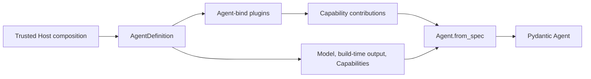
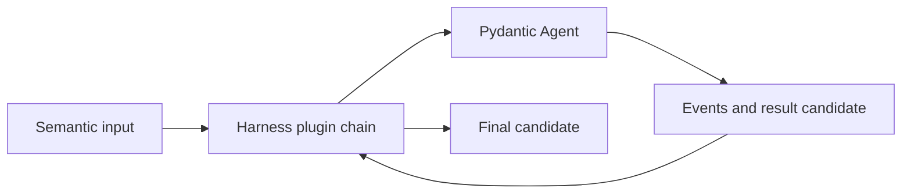
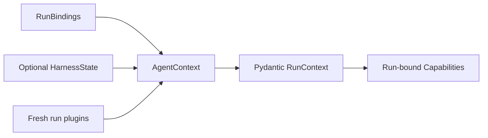

# Pydantic AI Foundation

## Design Position

`a13n-harness` builds directly on Pydantic AI 2. Pydantic AI is the process-local Agent runtime; the Harness contributes hosting-oriented composition around its documented public APIs.

The Harness does not fork or reproduce the Agent graph, Model interface, Model profile, Capability lifecycle, Toolset composition, message codec, deferred-tool model, output contract, or usage accumulator.

## Upstream Primitive Mapping

| Pydantic AI primitive              | Harness use                                                                                                          |
| ---------------------------------- | -------------------------------------------------------------------------------------------------------------------- |
| `Agent` and `AgentSpec`            | One authoritative Agent construction and execution path                                                              |
| `Model` and `ModelProfile`         | Provider request/response behavior and compatibility                                                                 |
| `ResolveModelId`                   | Thin optional bridge to fresh `RunModelResolver`                                                                     |
| `AbstractCapability[AgentContext]` | Reusable behavior inside the Agent loop                                                                              |
| `CapabilityOrdering`               | Native Capability dependencies and wrapper order                                                                     |
| Tools and Toolsets                 | Native tool schema, preparation, and dispatch                                                                        |
| `MCP` and `MCPToolset`             | Native MCP definition composition, discovery, transport, and local or provider-native execution                      |
| `ExternalToolset`                  | Native external/client-side deferral                                                                                 |
| `DeferredToolRequests` and results | Native external-call and approval stop/resume values                                                                 |
| `RunContext[AgentContext]`         | Live messages, usage, limits, capabilities, and typed dependencies                                                   |
| `AgentRunEvents`                   | Lazy event stream, messages, usage, result, cancellation, and cleanup                                                |
| `ModelMessage` codec               | Portable public conversation history                                                                                 |
| `RunUsage` and `UsageLimits`       | Shared monotonic usage accumulator and native limits                                                                 |
| `Instrumentation`                  | Sole selected Agent-attempt, model-request, tool, usage, streaming, cancellation span, and native model-metric owner |
| `OutputSpec`                       | Validated output and output retry semantics                                                                          |

Capability authors import these values directly from Pydantic AI. The Harness does not publish parallel aliases.

## Harness Additions

The Harness adds:

- process-local `AgentDefinition` containing native objects;
- one synchronous `HarnessBuilder` that calls `Agent.from_spec()` and captures optional gateway Provider construction;
- SDK-first provider-compatible Model OAuth values, Host credential sources, refresh lifecycle, and native Model constructors through [`a13n_harness.model_auth`](16a-model-authentication.md);
- trusted code-first plugins around the outer semantic-input-to-result boundary;
- fresh `RunBindings` and one `AgentContext` per logical run;
- fresh Environment adapters entered before input and Pydantic work, exposed through one stable Run-local bound facade;
- portable messages, Capability state, and optional portable Environment state in `HarnessState`;
- normalized process-local events and result combinations;
- optional independently selected [Harness Observation](19-observation-model.md) traces and metrics around native Pydantic instrumentation;
- exact Model-history repair and bounded interrupted-execution recovery.

These additions use public Pydantic APIs. There is no definition compiler, serialized plugin spec, Host role registry, or alternate model-resolution framework. The exact Host-supplied custom Capability type catalog exists only to authorize native `AgentSpec` reconstruction and performs no package discovery.

## Construction

`AgentDefinition.agent` is copied and passed to `Agent.from_spec()` with `deps_type=AgentContext`, the selected Model or model name, the exact authorized custom Capability types, and the combined explicit Capabilities. Feature tools and Toolsets exist only inside their owning Capabilities. The build selects either an explicit native `OutputSpec` or native `AgentSpec.output_schema`; the latter yields `dict[str, JsonValue]`. The Harness always includes one thin `ResolveModelId` Capability and always defers eager string-model checking until run dependencies exist.

The `AgentSpec` overload of `build()` constructs the same `AgentDefinition` accepted by its definition overload and adds no second path.

A hosted service owns any durable schema, Preset materialization, adapter configuration, and artifact locks needed to reconstruct these Python values. Pydantic and Harness objects do not become durable documents.

## Model Mapping

A concrete native Model is used directly. A string model selection reaches the thin resolver:

- with `RunBindings.model_resolver`, the fresh async callable returns a native Model or raises;
- without a resolver, the thin Capability calls Harness `infer_model()` with the builder's optional gateway Provider factory.

Every request can receive Thread-derived defaults: the opt-in `session_affinity_header` in native `ModelSettings.extra_headers`, and independently default-on `openai_prompt_cache_key` for eligible GPT numeric-series model names, unless effective settings explicitly override them. [Automatic Request Affinity](16-input-model-and-output.md#automatic-request-affinity) owns eligibility and Builder/environment precedence. The resolved native Model carries its own effective profile and provider adapter behavior; the selected adapter consumes only settings it recognizes. When the Harness Agent definition explicitly supplies `model_characteristics.context_window`, the final concrete, resolved, or inferred Model receives that one overlapping fact through its native `ModelProfile`; every other profile field and provider behavior remains intact. [Input, Model, and Output Boundaries](16-input-model-and-output.md#settings-and-profile) owns the exact precedence and projection contract. OAuth-backed Models use the separate [Model Authentication contract](16a-model-authentication.md), which keeps storage Host-owned while the Harness owns process-local refresh and provider wire behavior. The Harness does not duplicate general settings/profile merge logic. When explicitly selected, `SelfHealingModelCapability` uses the public request wrapper hook to install `SelfHealingModel` around the final effective Model after concrete selection, logical resolution, or native inference.

Recovery ownership is intentionally split:

- Pydantic owns provider-suspended continuation and output validation retries;
- provider/client configuration owns transport retry;
- optional `SelfHealingModelCapability` installs the request-local wrapper, while `SelfHealingModel` owns one exact replay after an effective history repair;
- the Harness coordinates bounded `ModelAttempt` recovery after recoverable model interruption.

## Plugin and Capability Mapping

A Harness plugin wraps a wider boundary than a Capability:

Plugins can also contribute ordinary `AbstractCapability[AgentContext]` instances before Agent construction. Pydantic owns those instances' Agent/run binding, ordering, Toolsets, hooks, and cleanup.

A plugin-contributed Capability resolves its fresh run-bound plugin through `AgentContext.plugins`. It does not retain a mutable Agent-bound plugin across concurrent runs.

## Execution Context Mapping

`AgentContext` carries the current Harness run ID, trusted Agent instance, mutable `AgentContextState`, entered `BoundEnvironment`, optional async `RunModelResolver`, immutable run-bound plugin index, immutable child collection, and non-authoritative metadata.

The same context is supplied to every `ModelAttempt` inside one logical Harness run. `RunBindings.capabilities`, one `RunUsage`, and optional `UsageLimits` are passed to every attempt under native Pydantic rules.

## Run Flow

01. Enter the fresh Environment adapters and atomically publish the initial mount set before input production.
02. Validate imported portable Environment data as observation only; do not restore it into adapters.
03. Invoke an optional input factory once and normalize input.
04. Create `AgentContext` from fresh bindings and copied Capability state.
05. Bind run plugins and freeze `BoundPluginContext`.
06. Start the plugin chain lazily on first iteration.
07. Run one `ModelAttempt` with a unique model-attempt ID.
08. On a recoverable model interruption, normalize public history and repeat within the total attempt budget while the Environment facade remains active.
09. On output, deferred work, cancellation, failure, or hard stop, build one terminal candidate.
10. Unwind trusted result middleware.
11. Establish the terminal fence and close all run resources before terminal delivery.

Provider-suspended continuation and deferred/HITL values are native Pydantic boundaries and never trigger the Harness `ModelAttempt` recovery loop.

## Boundary with the Host

| Concern                               | Host                                            | Harness/Pydantic                                                |
| ------------------------------------- | ----------------------------------------------- | --------------------------------------------------------------- |
| Durable authoring schema and Presets  | Owns                                            | Receives reconstructed Python values                            |
| Artifact installation and lock        | Owns                                            | Trusts supplied objects                                         |
| Identity and provider policy          | Issues and evaluates                            | Propagates through typed bindings                               |
| Process-local Agent loop              | Delegates                                       | Owns                                                            |
| Durable execution and worker recovery | Owns                                            | Produces process-local state and result                         |
| Client-side deferred execution        | Authenticates, persists, or executes externally | Produces/consumes native deferred values                        |
| Usage persistence and billing         | Owns                                            | Produces Pydantic usage observations/snapshots                  |
| OTel SDK, export, and vendor profiles | Owns                                            | Uses explicit providers and native instrumentation when enabled |

## Compatibility

The Harness is open to external Pydantic AI Capabilities and treats documented upstream abstractions as the common interoperability plane. External Capabilities can consume the effective native Model, `ModelProfile`, `RunContext`, usage, tools, and events without Harness-specific adapters. First-party Harness Capabilities use those upstream facts where available and support Harness-owned definition and captured-run facts on a best-effort fallback basis. An explicit Harness-managed definition remains authoritative for an overlapping fact because the Harness can validate and consistently apply that input. The project works with Pydantic AI to move broadly useful facts into upstream abstractions rather than growing parallel general-purpose schemas.

The repository selects a compatible Pydantic AI release and validates only documented public behavior used by the Harness. Compatibility tests cover:

- `Agent.from_spec()` with native build inputs;
- deferred string-model resolution through `ResolveModelId`;
- native Model profiles and wrapper behavior;
- Capability and Toolset composition, including native MCP AgentSpec reconstruction and local MCP dynamic tools;
- lazy `AgentRunEvents` streaming and cancellation;
- public messages, deferred values, output contracts, and usage;
- instrumentation hierarchy, current-context parentage, convention fields, trace-content switches, native metrics, explicit no-op providers, and ambient suppression;
- interrupted-message states used by bounded recovery.

Each Capability state version and Environment provider-state codec version is independent from the Pydantic package version and Harness envelope version.

## Trade-offs

### Direct Dependency vs. a Forked Runtime

Using Pydantic AI directly provides ecosystem compatibility and upstream fixes. The Harness must adapt to public API changes, but avoids maintaining a second Agent implementation.

### Public Native Objects vs. Serialized Abstractions

Native Models, Capability-owned tools and Toolsets, Capabilities, and code-first output types preserve full behavior. A Host cannot serialize them generically and must reconstruct them through trusted code. An object JSON Schema can remain declarative in native `AgentSpec.output_schema`.
