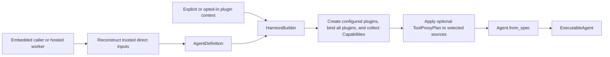
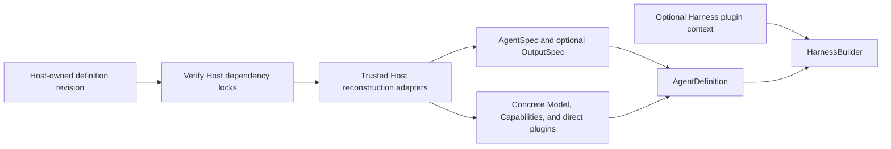

# Agent Definition and Build

## Design Position

`AgentDefinition` is the immutable process-local input used to build one reusable Harness executable. It is a Python composition boundary, not a durable document or wire format. It combines the Harness `AgentSpec`, a narrow subclass of native Pydantic AI `AgentSpec`, with one build-time output contract, a trusted native model, top-level Capabilities, Harness plugins, and named complete child definitions. Capability is the only top-level feature-behavior composition plane: function tools and Toolsets are owned by a Capability rather than supplied through peer `AgentDefinition` fields. A native Pydantic AI `AgentSpec` remains accepted when no Harness model characteristics are needed.

The Harness does not compile, serialize, reload, or discover Agent definitions. A hosted system owns its serializable Agent definition and dependency-lock schemas, then reconstructs the trusted Python objects required by `AgentDefinition` inside the execution process. Direct plugins remain such inputs. Separately, one builder may apply the narrow [Harness-owned plugin configuration](05-plugin-system.md#configuration-document) after definition construction; this removes plugin reconstruction from the Host without turning the document into an Agent format. Python objects, factory classes, and import targets never pass through a hosted API or durable record.



Preset materialization, provider configuration, artifact installation, revision locking, and rollout remain Host concerns. The Harness owns only process-local validation and construction.

## AgentDefinition

```python
@dataclass(frozen=True, slots=True)
class AgentDefinition[OutputT]:
    agent: AgentSpec
    output_type: OutputSpec[OutputT] | None
    definition_id: str = <process-local UUID>
    model: Model | None = None
    capabilities: tuple[AbstractCapability[AgentContext], ...] = ()
    plugins: tuple[AbstractHarnessPlugin, ...] = ()
    tool_proxy: ToolProxyPlan | None = None
    subagents: tuple[SubagentDefinition, ...] = ()
    model_recovery: ModelRecoveryPolicy = ModelRecoveryPolicy()

    def with_updates(
        self,
        updates: Mapping[str, object] | None = None,
        /,
        **overrides: object,
    ) -> Self: ...
```

| Field            | Meaning                                                                                                                    |
| ---------------- | -------------------------------------------------------------------------------------------------------------------------- |
| `agent`          | Harness or native Pydantic AI declarative Agent configuration                                                              |
| `output_type`    | Explicit native process-local `OutputSpec`, or `None` to select the object schema in `AgentSpec.output_schema`             |
| `definition_id`  | Non-blank logical correlation value; it grants no authority                                                                |
| `model`          | Optional concrete native Model used instead of string selection in `AgentSpec`                                             |
| `capabilities`   | The only top-level feature plane; each native Capability owns feature activation, Toolset composition, settings, and hooks |
| `plugins`        | Trusted concrete Harness middleware instances supplied directly with this definition                                       |
| `tool_proxy`     | Optional immutable presentation plan selecting existing Capability objects and exact plugin IDs; never activates sources   |
| `subagents`      | Named complete process-local child definitions and authored edge ceilings                                                  |
| `model_recovery` | Optional bounded `ModelAttempt` policy for recoverable model interruption inside one logical Harness Run                   |

[Grouped ToolProxy Discovery](07-tool-execution.md#grouped-toolproxy-discovery) owns plan selection, grouping, and native composition semantics. Plugin contributions are collected once before applying the plan; the plan does not introduce another feature or execution plane.

Construction deep-copies `AgentSpec` and freezes the collection fields as tuples. `AgentDefinition.with_updates()` returns a new fully validated definition after exact top-level replacement. It accepts one optional field-name mapping plus keyword overrides, rejects unknown fields and fields supplied through both inputs, and runs the ordinary constructor invariants over the complete result. Retained and replacement `AgentSpec` values follow the constructor's deep-copy rule, and collection fields are frozen as tuples; arbitrary Models, Capabilities, plugins, output objects, and other trusted native values retain their identities under the existing reentrancy contract rather than being blanket-deep-copied. The original definition is never mutated.

String model selection belongs only to `AgentSpec.model`; a concrete process-local Model belongs only to `AgentDefinition.model`. Supplying both is rejected rather than assigning hidden precedence, and a concrete Model requires `AgentSpec.model=None`. Child names are unique within one parent. The finite acyclic child graph and its exact `SubagentDefinition` contract are owned by [Delegation and Subagents](11-delegation-and-subagents.md#child-definitions-and-built-collection). The Harness does not require every trusted Python object to be serializable, hashable, deeply immutable, or reconstructible from metadata. Reentrancy remains the responsibility of native objects and Agent-bound extensions whose instances are shared by concurrent runs.

`AgentSpec` remains the owner of instructions, request settings, native tool and output retry behavior, declarative Capability specs, optional object `output_schema`, and its own model selection. The Harness subclass additionally owns ordered static `system_prompt` blocks, the default-on `toolset_instructions` and `cold_start_filter` policies, one definition-level native `UsageLimits`, and `model_characteristics` for one resolved `HarnessModelCharacteristics` describing Harness-managed lifecycle and feature characteristics. Most of those facts are independent from provider `ModelProfile`; `context_window_tokens` deliberately overlaps the native profile's `context_window` fact so upstream Capabilities can consume it. A system prompt is fixed within one resolved `AgentSpec`; another definition can replace, reorder, or remove it when starting a later model request over retained history. Instructions retain native Pydantic AI static and dynamic semantics and are not a substitute for the definition-owned system prompt. The Toolset switch changes only Harness Toolset-owned guidance and does not suppress explicit Agent or Capability instructions.

Exactly one build-time output source is selected: an explicit `AgentDefinition.output_type`, or native `AgentSpec.output_schema` when `output_type is None`. The latter produces `dict[str, JsonValue]`; `None` without a schema and an explicit output together with a schema are rejected. Native `OutputSpec`, Model profiles, Capability-owned tools and Toolsets, and explicit Capability instances retain their upstream Pydantic AI semantics. The Harness does not mirror those types in a second schema.

Ordinary MCP definition behavior uses Pydantic AI's native `MCP` Capability in `AgentSpec.capabilities`. The Harness also provides `ContextualMCP`, a code-first definition Capability that owns only run-scoped header resolution. Its `for_run()` resolves a trusted sync or async header factory against the current `AgentContext`, merges the result with explicit static headers, and returns a fresh upstream `MCP` before Pydantic re-extracts native tools and local Toolsets. The upstream Capability still owns URL handling, authorization-token behavior, server-tool construction, local client construction, filtering, transport, discovery, and lifecycle. The Harness does not add another MCP client, protocol, Toolset, or upstream patch.

A trusted host can supply fresh upstream `MCP` capabilities in `RunBindings.capabilities` when authenticated local clients or toolsets require current invocation authority. These instances belong exclusively to that execution; the host owns the enclosing source lifecycle. Run validation permits the exact upstream `MCP` type without making other definition capabilities valid Run bindings. Such composition uses upstream discovery, filtering, naming, deferred loading, and invocation hooks.

`ContextualMCP` supports URL-based upstream local/native composition whose headers are constructed by the returned fresh `MCP`. A preconstructed local client or Toolset that already owns its transport cannot be combined with run-scoped header resolution. Provider-native MCP and locally executed MCP Toolsets retain their distinct upstream execution paths while observing the same resolved header mapping. The definition Capability is immutable and safe for concurrent runs; it never mutates a shared upstream `MCP` or header dictionary.

```python
class ModelCapability(StrEnum):
    IMAGE_UNDERSTANDING = "image_understanding"
    VIDEO_UNDERSTANDING = "video_understanding"
    AUDIO_UNDERSTANDING = "audio_understanding"
    DOCUMENT_UNDERSTANDING = "document_understanding"


class HarnessModelCharacteristics(BaseModel):
    capabilities: frozenset[ModelCapability] = frozenset()
    context_window_tokens: int | None = None
    proactive_context_management_threshold: float | None = 0.65
    compact_threshold: float = 0.90

class AgentSpec(PydanticAgentSpec):
    system_prompt: str | list[str] | None = None
    toolset_instructions: bool = True
    cold_start_filter: ColdStartFilterConfiguration | None = ColdStartFilterConfiguration()
    usage_limits: UsageLimits = UsageLimits(request_limit=1000)
    model_characteristics: HarnessModelCharacteristics | None = None
```

The Harness `AgentSpec.usage_limits` uses Pydantic AI's native `UsageLimits` value directly. Its default sets only `request_limit=1000`; every token, tool-call, and cost ceiling remains disabled unless explicitly authored, and `count_tokens_before_request` remains false. This replaces Pydantic AI's 50-request fallback with a definition-owned long-task default without introducing another limit model. A plain native Pydantic AI `AgentSpec`, which cannot carry this Harness field, receives the same Harness default when executed. `UsageLimits(request_limit=None)` explicitly removes the request-count ceiling. Per-run precedence and delegation narrowing are owned by [Execution Context and Lifecycle](06-execution-context-and-lifecycle.md#usage-limits-and-native-retries) and [Delegation and Subagents](11-delegation-and-subagents.md#child-usage-limits).

`AgentSpec.cold_start_filter` configures cold compression of already-consumed tool results. Omission enables `ColdStartFilterConfiguration()` with a one-hour idle interval; `None` disables automatic installation. Plain native Pydantic AI specs receive the same default. An explicitly supplied `ColdStartFilterCapability` retains its authored policy instead of receiving a second automatic instance. The idle interval is a deliberate retention policy, not a provider-cache guarantee or adaptive cache-duration detector. Each child definition selects its own policy. [Input, Model, and Output Boundaries](16-input-model-and-output.md#request-and-history-filters) owns the exact filtering semantics.

Native `AgentSpec.retries` passes unchanged to Pydantic AI. `None` retains Pydantic AI's default of one function-tool retry and one output-validation retry; an integer selects both budgets, while an `AgentRetries` mapping can select `tools` and `output` independently. These are retries inside one Pydantic Agent loop. They do not enable Harness `ModelRecoveryPolicy`, retry a `UsageLimitExceeded` failure, or configure provider transport retries.

`AgentSpec.with_updates()` refines a loaded preset without mutating it. It accepts field names or serialization aliases through one optional mapping plus keyword overrides, rejects unknown fields and duplicate alias/name ownership, deep-copies retained and replacement values, and revalidates the complete resulting `AgentSpec`. Each supplied top-level field is an exact replacement; the method never recursively merges provider-specific settings, metadata, schemas, Capability arguments, `UsageLimits`, or other nested mappings. A caller that wants a nested merge constructs that field explicitly before supplying it. This is definition materialization before build, not the temporary run-scoped behavior of native `Agent.override()`.

`AgentDefinition.with_updates()` provides the corresponding complete composition operation across `AgentSpec`, model, output, Capabilities, plugins, child topology, and recovery policy. It has no implicit child-specialization rules: omitted fields are retained exactly, including `definition_id` and `subagents`. A caller materializing a shallow specialized child therefore selects a fresh logical definition ID and explicitly removes inherited child topology, while the ordinary retained fields provide intentional build-time reuse:

```python
child_spec = parent.agent.with_updates(
    system_prompt="You are the focused research worker.",
    model=None,
    model_characteristics=child_model_characteristics,
)
child = parent.with_updates(
    agent=child_spec,
    definition_id="research-worker",
    model=child_model,
    subagents=(),
)
```

This example retains the parent's Capabilities and their tools, plugins, output contract, recovery policy, and unchanged `AgentSpec` fields. A caller can replace any of them explicitly. The resulting child is a complete standalone `AgentDefinition`; no parent lookup or inheritance occurs during build or execution.

`system_prompt=None` or an empty list means that the definition supplies no system-prompt block. A string is one block; a list preserves authored order. The builder normalizes this field once, supplies it through Pydantic AI's native `system_prompt` construction argument for an empty history, and retains it on the copied definition for later history reconciliation. A Host convenience API may materialize a system-prompt argument into this field, but no lower layer accepts a competing prompt source or silently merges two owners. `toolset_instructions=True` enables Harness Toolset instruction blocks by default; the single-run override and child inheritance contract belong to [Context and Working State](09-context-and-memory.md#toolset-instruction-enablement).

`HarnessModelCharacteristics` is the resolved per-model Harness value, not a provider request setting or a replacement for native `ModelProfile`. Its `capabilities` set is authoritative for Harness behavior that Pydantic AI profiles do not represent consistently. `IMAGE_UNDERSTANDING`, `VIDEO_UNDERSTANDING`, and `AUDIO_UNDERSTANDING` mean the active Agent model can consume that native media kind; absence means the Harness must use an explicitly configured fallback or report unavailability. `DOCUMENT_UNDERSTANDING` means the model can consume PDF documents as native content; the Harness declares it for hosts that deliver documents and does not act on it itself. The Harness never infers these facts from a model name or provider profile.

`context_window_tokens` is the narrow intentional overlap. When it is explicit, the builder projects it onto the final concrete, run-resolved, or inferred Model's native `ModelProfile.context_window`, preserving all other provider profile fields and behavior. The Harness value takes precedence over a conflicting model value because it is the definition input the Harness can validate and manage. When it is `None`, no overlay is installed and the native Model remains authoritative. This lets external Capabilities consume the same effective value through ordinary Pydantic AI APIs without depending on Harness types. [Input, Model, and Output Boundaries](16-input-model-and-output.md#settings-and-profile) owns the projection details.

`HarnessModelCharacteristics` accepts the historical `context_window` input as an alias for `context_window_tokens`, including nested JSON snapshots and authored Agent specs. The canonical name takes precedence when both spellings are present. Serialization emits `context_window_tokens`; positive-value validation and context-management semantics are unchanged. This is read compatibility, not an additional independent context setting.

A known Harness context window still derives the optional summarize reminder threshold as `int(context_window_tokens * proactive_context_management_threshold)`; a `None` proactive threshold disables that reminder. Automatic compaction instead resolves its window and usage at each model-request boundary under [Context and Working State](09-context-and-memory.md#compaction-capability). The 65% and 90% defaults describe Harness lifecycle policy rather than a provider wire contract.

The Harness ships an immutable, release-pinned `OfficialModelCatalog` containing a deliberately small set of provider-qualified official direct-provider model IDs, their objective `HarnessModelCharacteristics`, and an official source URL. It contains no gateway aliases, labels, credentials, request presets, reasoning defaults, routing policy, or deployment-specific availability claims. A Host may use `get_official_model_catalog()` or `get_official_model()` to materialize configuration, may select models outside the catalog, and remains responsible for provider access and policy. Catalog lookup is explicit: the builder does not silently replace or infer `AgentSpec.model_characteristics`. Catalog entries may declare context facts, media capabilities, or both. An omitted catalog `capabilities` field means that media facts have not been declared; an explicit empty set declares no native media input. Hosts materializing defaults distinguish these cases using native Pydantic field-presence information. This authoring distinction does not change the empty-set runtime behavior of `HarnessModelCharacteristics`.

Separate immutable `ModelCharacteristicsAliasCatalog` and `ModelSettingsAliasCatalog` values provide small input-only convenience layers without merging the two planes. `resolve_model_characteristics()` materializes Harness lifecycle characteristics such as a context budget, while `resolve_model_settings()` materializes native provider request choices such as thinking mode or `max_tokens`. Ordered aliases resolve before explicit concrete overrides, and alias names never enter `AgentSpec`, `AgentDefinition`, builder logic, state, or Host durable revisions. The initial catalogs contain only Anthropic-scoped choices, do not include `anthropic_cm`, and do not couple either plane to the official model catalog.

Model characteristics parameterize an explicitly selected `HandoffCapability` or `CompactionCapability`; they never enable either feature implicitly. Explicit Capability token settings take precedence. `HandoffCapability` resolves its definition-owned reminder during build, while `CompactionCapability()` without an explicit policy resolves native context-window and usage facts plus Harness fallbacks at each eligible model-request boundary and skips that boundary when the required facts remain unavailable.

## Build API

```python
class HarnessBuilder:
    def __init__(
        self,
        *,
        capability_type_catalog: CapabilityTypeCatalog | None = None,
        build_context: HarnessBuildContext | None = None,
        configured_plugins_enabled: bool | None = None,
        instrumentation: HarnessInstrumentation | Literal["environment"] | None = "environment",
        gateway_provider_factory: GatewayModelProviderFactory | None = None,
    ) -> None: ...

    @overload
    def build[OutputT](
        self,
        definition: AgentDefinition[OutputT],
        /,
        *,
        pricing_catalog: PricingCatalog | None = None,
    ) -> ExecutableAgent[OutputT]: ...

    @overload
    def build[OutputT](
        self,
        spec: AgentSpec,
        /,
        *,
        output_type: OutputSpec[OutputT],
        definition_id: str | None = None,
        model: Model | None = None,
        capabilities: Sequence[
            AbstractCapability[AgentContext]
        ] = (),
        plugins: Sequence[AbstractHarnessPlugin] = (),
        subagents: Sequence[SubagentDefinition] = (),
        model_recovery: ModelRecoveryPolicy | None = None,
        pricing_catalog: PricingCatalog | None = None,
    ) -> ExecutableAgent[OutputT]: ...

    @overload
    def build(
        self,
        spec: AgentSpec,
        /,
        *,
        output_type: None,
        definition_id: str | None = None,
        model: Model | None = None,
        capabilities: Sequence[
            AbstractCapability[AgentContext]
        ] = (),
        plugins: Sequence[AbstractHarnessPlugin] = (),
        subagents: Sequence[SubagentDefinition] = (),
        model_recovery: ModelRecoveryPolicy | None = None,
        pricing_catalog: PricingCatalog | None = None,
    ) -> ExecutableAgent[dict[str, JsonValue]]: ...
```

Builder construction and `build()` are synchronous. `capability_type_catalog=None` selects the canonical empty catalog; a supplied catalog is exact, immutable, and builder-local. The default `instrumentation="environment"` resolves bounded Harness signal/content policy and Host-configured global providers once; explicit `HarnessInstrumentation` supplies exact Host-owned tracer and meter providers, while explicit `None` keeps the complete recursively built executable graph inert regardless of environment. The structural-tracing and content contract is defined by [Harness Observation](19-observation-model.md#instrumentation-contract). An optional `gateway_provider_factory` is captured once for Harness inference of named gateway routes and is reused when recursively building children. An explicit `build_context` bypasses ambient discovery. With `build_context=None`, `configured_plugins_enabled=None` follows the environment enable switch, while `True` or `False` provides a trusted call-site override without reading that switch. Enabled construction performs synchronous JSON/file loading and package discovery. For an explicit context, the override changes only its application state and never consults ambient sources; enabling requires that context to contain a configuration. The detailed source, bounds, run-time immutability, and failure contract belongs to [Harness Plugin System](05-plugin-system.md#build-context-and-source-resolution). The `AgentSpec` overload creates an `AgentDefinition` and enters the same private definition-build path; there is no second construction method.

Every public build captures one current immutable pricing catalog for default valuation across its recursive graph, or accepts `pricing_catalog` as an explicit build-scoped pin. Authored model-cost Capabilities retain precedence. Refresh, fallback, and quote semantics belong to [Cost Calculation](12-events-observability-and-usage.md#cost-calculation); no pricing policy enters Run bindings or continuation state.

The build flow is:

01. Validate the finite child graph and unique names, recursively build children before their parent, and freeze one immediate-child `SubagentCollection`.
02. Create fresh configured plugin instances for the current definition, append them after direct definition plugins, and validate and deterministically order the combined tuple.
03. Call each plugin's `for_agent()` and validate stable concrete type, ID, and ordering.
04. Collect the Agent-bound plugins' ordinary Pydantic `AbstractCapability[AgentContext]` contributions.
05. Reject competing Pydantic `Instrumentation` in every authored or plugin Capability source and reject a build-time `InstrumentedModel`; every recursively built child follows the same rule.
06. Resolve automatic Handoff and Compaction thresholds once from the copied Harness `AgentSpec.model_characteristics`; explicit Capability token settings remain unchanged.
07. Install one thin `ResolveModelId` Capability, one mandatory request-header Capability, exactly one mandatory `ToolSurfaceCapability`, exactly one outer `ToolExecutionBoundaryCapability`, and exactly one innermost `MessageIntegrityFilterCapability` for every Agent. When tracing or metrics is selected, also install exactly one Harness-selected Pydantic `Instrumentation` Capability with explicit real/no-op providers and its bounded Agent-attempt enrichment. Tool ordering places ordinary candidates inside tool-surface resolution, optional CodeAct outside the effective surface, and the execution boundary outermost.
08. Resolve exactly one build-time business output. Prepare an explicit `OutputSpec`, or construct native `StructuredDict` from a detached `AgentSpec.output_schema` and clear that field only on the temporary construction copy.
09. Form the complete native output contract as `[business_output, DeferredToolRequests]`; the reserved control type is outside every business output marker.
10. Call `Agent.from_spec()` once with `deps_type=AgentContext`, the copied `AgentSpec`, its normalized `system_prompt` through the native construction argument, the complete output contract, the selected model, the exact authorized custom Capability types, explicit Capabilities, and plugin contributions. No top-level `tools` or `toolsets` argument is supplied, runs do not override system prompt or output type, and the constructed Agent cannot consult ambient Pydantic instrumentation state.
11. Build the matching business-output validator and return an `ExecutableAgent` owning the immutable child collection.

`defer_model_check=True` is always used so a string selected by `AgentSpec.model` can reach the run-scoped resolver after fresh `RunBindings` exist. The resolver uses a fresh `RunModelResolver` when supplied and otherwise calls Harness `infer_model()` with the captured gateway factory. Every run rejects a competing `Instrumentation` in `RunBindings.capabilities`, and every run-time model-resolution path rejects `InstrumentedModel` before model work. The exact resolution, gateway, automatic request-header, and recovery contracts are owned by [Input, Model, and Output Boundaries](16-input-model-and-output.md); the single-owner policy is owned by [Harness Observation](19-observation-model.md#single-owner).

The builder does not accept a general class registry, externally mutable plugin factory catalog, Agent compiler, serialized Agent spec, resolved-component envelope, or Host lifecycle object. It may receive the exact immutable custom Capability type catalog authorized for declarative `AgentSpec` reconstruction, one immutable `HarnessBuildContext`, and one optional gateway Provider factory. The plugin context selects only the narrow Harness configuration contract and bounded namespaced JSON extensions; it cannot construct unrelated Python values or configure run-scoped Environment mounts.

## Executable Ownership

An `ExecutableAgent` owns:

- the copied process-local `AgentDefinition`;
- the one constructed Pydantic AI `Agent`;
- the ordered Agent-bound plugin tuple;
- the output validator;
- its immutable immediate-child `SubagentCollection`.

The ordinary zero value for child topology is the canonical empty collection. Child construction and delegation semantics are owned by [Delegation and Subagents](11-delegation-and-subagents.md); they do not introduce a serialized Harness definition layer.

Every invocation creates a fresh `AgentContext`, fresh run-bound plugin replacements, and fresh run bindings. The executable can serve concurrent runs only when its native Model, Agent-bound Capabilities and their owned tools/Toolsets, and Agent-bound plugins satisfy their upstream or documented reentrancy contracts.

An `ExecutableAgent` has no `close()` method or async context-manager lifecycle. `run()` manages its own Run scope; callers of `stream()` enter the returned `HarnessRunStream` as an async context manager. Per-run resources belong to that stream, while callers retain ownership of shared clients supplied during construction.

## Host Reconstruction

A hosted worker reconstructs the process-local definition from its own immutable revision and installed trusted adapters:



The Host may use typed Presets, provider integration revisions, or artifact locks under its own contracts. It may persist or generate the exact Harness plugin document and pass an explicit context, or let deployment environment variables opt the builder in; it need not own a plugin factory adapter. The Harness neither verifies a Host artifact digest nor derives Python import paths from untrusted definition data.

Fresh current-run authority does not belong in `AgentDefinition`. Identity, run-scoped model resolution, policy, credentials, and other invocation collaborators enter through `RunBindings` or their narrowly owning fresh Pydantic Capabilities; Environment adapters enter through explicit Run arguments. `AgentDefinition` deliberately has no `environment`, provider selector, desired mount definitions, or `environment.operations` field. Environment consumers declare and enforce scoped readiness at the operation or owning feature boundary; the optional `DynamicEnvironmentCapability` configures only model projection.

## Failure Semantics

| Failure                                                                   | Outcome                                                                                        |
| ------------------------------------------------------------------------- | ---------------------------------------------------------------------------------------------- |
| Blank `definition_id`                                                     | `DefinitionError(code="definition_id_invalid")`                                                |
| Invalid, duplicate, or cyclic child topology                              | `DefinitionError` before the affected parent executable is returned                            |
| Invalid plugin configuration, factory, type, ID, ordering, or replacement | Plugin or builder construction fails before an affected executable is returned                 |
| Invalid plugin Capability contribution                                    | Build fails before Pydantic Agent construction                                                 |
| Explicit output and `AgentSpec.output_schema` are both present            | `DefinitionError(code="output_contract_conflict")` before Pydantic construction                |
| Neither explicit output nor `AgentSpec.output_schema` is present          | `DefinitionError(code="output_contract_missing")` before Pydantic construction                 |
| Business output directly or transitively includes `DeferredToolRequests`  | `DefinitionError(code="output_contract_reserved")` before Pydantic construction                |
| Invalid `AgentSpec`, model, Capability-owned tool/Toolset, or output      | `DefinitionError(code="agent_build_failed")` with the original exception retained as the cause |
| Host revision or artifact cannot be reconstructed                         | Host failure before calling the Harness                                                        |
| Run-scoped model cannot be resolved                                       | Typed run failure owned by the model boundary                                                  |

Errors do not serialize arbitrary Python object representations, credentials, or private installation paths.

## Boundaries

| Concern                                                         | Owner                                                                    |
| --------------------------------------------------------------- | ------------------------------------------------------------------------ |
| Native `AgentSpec`, Model, profile, output, Toolset, Capability | Pydantic AI                                                              |
| Process-local `AgentDefinition` and executable build            | This specification                                                       |
| Plugin ordering, Agent/run binding, and middleware              | [Harness Plugin System](05-plugin-system.md)                             |
| Run bindings, execution, results, and cleanup                   | [Execution Context and Lifecycle](06-execution-context-and-lifecycle.md) |
| Hosted schemas, Presets, immutable revisions, and locks         | Host                                                                     |
| Durable execution, checkpoint selection, and delivery           | Host                                                                     |

## Trade-offs

### Code-first Python Composition vs. a Harness Wire Language

Code-first composition preserves native Pydantic objects and keeps construction direct. A hosted system must own explicit reconstruction adapters and cannot treat arbitrary Python objects as durable data. This is preferable to a second compiler, class registry, or lossy universal schema.

### One `Agent.from_spec()` Path vs. Constructor Mirroring

Using one authoritative upstream construction call avoids field-by-field translation. The Harness must track compatible public Pydantic AI behavior, but it does not maintain a parallel Agent language.
