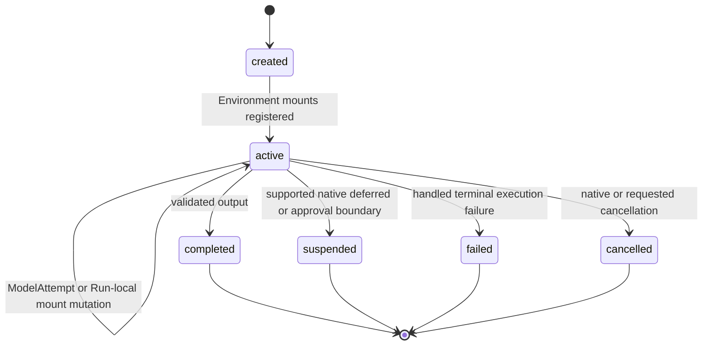
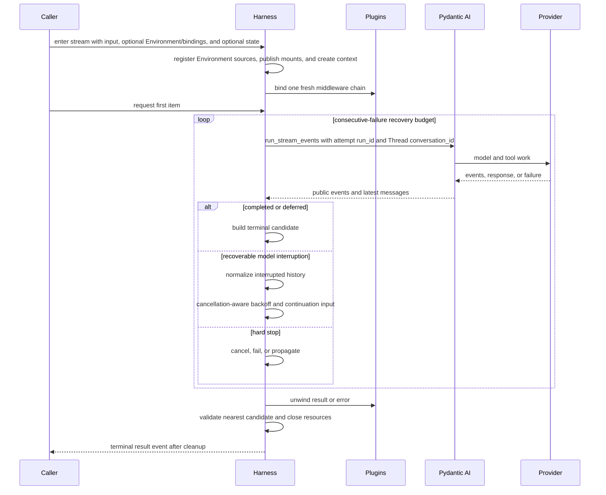

# Execution Context and Lifecycle

## Design Position

One Harness Run is one process-local logical invocation of an `ExecutableAgent`. It validates already constructed Environment inputs, enters a fresh Run-local mount aggregate, creates one outer `AgentContext`, binds one plugin chain, owns one shared `RunUsage` accumulator, and produces at most one terminal Harness result.

A logical Harness Run may contain several sequential `ModelAttempt` values when `ModelRecoveryPolicy` is enabled. A `ModelAttempt` is one Pydantic AI Agent-loop invocation used for bounded semantic recovery. These values are an internal recovery mechanism, not separate Harness runs, Service run attempts, plugin invocations, contexts, Environment adapter lifetimes, or usage ledgers. Each `ModelAttempt` receives a unique model-attempt ID passed through Pydantic AI's upstream `run_id` parameter, while the public Harness `run_id` remains stable. When [Harness Observation](19-observation-model.md) is enabled, the same invocation passes the State-owned Thread ID as Pydantic `conversation_id`; these fields correlate the native Agent-attempt span without changing lifecycle or provider affinity.

Pydantic AI owns each inner Agent loop, model/tool execution, native deferred and approval values, output validation retries, messages, and provider-suspended continuation. Runs retain its native deferred boundary when current Host bindings support it, independently of parent lineage. Unsupported Runs resolve runtime deferral as denied tool results inside the same loop and reserve terminal deferred normalization as a fail-closed error. The Harness otherwise owns outer preparation, plugin middleware, bounded `ModelAttempt` coordination, terminal normalization, and cleanup.

## Live Runs

`ExecutableAgent.live(model=...)` enters one duplex native realtime session as one Harness Run. It shares the ordinary Run's fresh Context, Environment lifetime, plugin middleware, state export, cancellation, usage ledger, and post-cleanup terminal fence. Pydantic AI owns the connection, turn detection, tool scheduling, audio retention, playback, and provider reconnect behavior. Harness does not start ordinary `ModelAttempt` recovery or replay effectful tools after a connection failure.

The Live entrypoint requires an explicit native `RealtimeModel`. Entering the async context prepares the Run and opens the connection. The Host consumes the single semantic iterator concurrently with input and optional audio playback. `close()` ends the native session normally; `cancel()` requests a cancelled Run. Neither a completed conversational turn nor a completed `close()` call is a terminal Harness receipt. A `HarnessRunResultEvent` follows successful wrapper unwind and teardown, with `output=None`. Early context exit closes resources and retains a checkpoint without manufacturing that receipt. Connection, provider, plugin, or cleanup errors propagate and do not produce a successful terminal result.

Inline native approval handlers may wait, approve, reject, or supply external results. They retain current tool permissions and native cancellation. Live does not suspend a socket into an out-of-band `DeferredToolResume`; an unresolved approval or external call receives the native failed tool result. Interruption cancels speech, optionally truncating it at the Host's playback position; it does not undo tools, cancel the Harness Run, or terminate detached processes.

## Boundary

| Concern                                                     | Owner                                      |
| ----------------------------------------------------------- | ------------------------------------------ |
| Model/tool loop and native deferred values                  | Pydantic AI                                |
| Provider transport retry                                    | Provider client and Pydantic `RetryConfig` |
| Narrow provider-history repair                              | `SelfHealingModel`                         |
| Logical Run and `ModelAttempt` recovery                     | Harness                                    |
| Durable execution, durable execution attempt, lease, replay | Host                                       |
| Continuation persistence and selection                      | Host                                       |

A Host may map one logical Harness run to one durable execution attempt. It does not create a new durable execution attempt for every internal `ModelAttempt`.

## RunBindings and AgentContext

```python
@dataclass(frozen=True, slots=True)
class RunBindings:
    instance: AgentInstanceContext
    configuration: RunConfiguration = RunConfiguration()
    environment: EnvironmentRuntime | None = None
    model_resolver: RunModelResolver | None = None
    capabilities: tuple[
        AbstractCapability[AgentContext], ...
    ] = ()
    metadata: Mapping[str, JsonValue] = {}
    model_context: ModelContextMiddleware | None = None
```

The trusted caller may supply fresh bindings for a logical run; an embedded call that omits them receives fresh embedded bindings. The Harness:

1. validates and normalizes `environment`, `environments`, and `default_environment`, or accepts an explicit `RunBindings.environment` runtime, under the [Environment input rules](08-environment-integration.md#run-inputs) without provider effects;
2. allocates the public Harness `run_id` and obtains a new or restored State-owned `thread_id`;
3. assigns opaque mount IDs and registers inert Environment sources with ephemeral Run, Thread, Agent-instance, mount, and Host correlation;
4. atomically publishes the initial mount snapshot after static validation, without activating sources; dependent input or Capability work requests readiness when needed;
5. invokes an optional `RunInputFactory` exactly once;
6. normalizes semantic input;
7. creates one `AgentContext` with the stable Thread ID, imported `AgentContextState`, entered Environment facade, optional model resolver and model-context middleware, immutable metadata, and executable-owned child collection;
8. binds fresh run plugin replacements and freezes `BoundPluginContext`;
9. prepares the outer plugin invocation.

The same context and entered Environment facade are reused by every internal `ModelAttempt`. Current Identity and its immutable string claims, Environment lifetime, plugins, Capability-state coordinator, model resolver, model-context binding, and metadata therefore remain stable across recovery. Pydantic performs fresh Capability run binding for each internal attempt. `ContextualMCP` resolves its factory once and retains one active upstream MCP replacement on that logical-run `AgentContext`; later attempts reuse it, while another logical Harness run receives a fresh replacement. This creates fresh local transport and provider-native values before their first extraction without mutating the shared definition object or rerunning a potentially effectful factory during semantic recovery. A trusted Run integration can apply Run-local mount mutations during input preparation, an active attempt, tool work, or recovery backoff; each committed mutation publishes an immutable snapshot without replacing the facade or context and never changes Host durable association. `RunBindings.capabilities` are passed to every `ModelAttempt` and follow upstream per-run Capability binding semantics.

The logical Run receives one `run_id`, and each internal `ModelAttempt` receives a transient model-attempt ID, but they do not define the provider model session or prompt-cache scope. All attempts read the same State-owned `AgentContext.thread_id`. A later continuation creates a new Harness run and fresh bindings while restoring that ID from the selected State; a new root or child State and an explicit `HarnessState.fork()` use distinct IDs. No `RunBindings`, metadata, or invocation argument can override it. [Input, Model, and Output Boundaries](16-input-model-and-output.md#thread-affinity) owns the provider mapping contract.

`RunBindings.embedded()` creates a process-local Agent instance and accepts an optional model resolver, model-context middleware, Capabilities, metadata, and bounded Host references. When neither adapter inputs nor an explicit `RunBindings.environment` runtime are supplied, Harness creates an empty bound facade. It never discovers a Provider or hidden provider configuration.

## Run Configuration

`RunConfiguration` is one immutable caller-owned value shared through `RunBindings.configuration` and `AgentContext.configuration`. It is independent of Agent definitions, Capability constructor configuration, mutable state and metadata. Embedded bindings default to an unrestricted empty configuration. One logical Run and all its internal `ModelAttempt` values use the same snapshot; inline child bindings inherit it and cannot replace it through their factory. Hosts own durable capture, async-child inheritance and continuation reconstruction.

- `allowed_hosts: frozenset[str] | None` uses `None` for unrestricted destinations and an empty set for deny-all. An entry without the literal `regex:` prefix matches an exact normalized URL hostname or IP literal, not implicit subdomains, wildcards, ports or CIDRs. A `regex:<pattern>` entry uses Python regular-expression syntax and full-string matching against the same normalized hostname, never the URL, path or port. Any matching entry allows the host. Hostnames are lowercased, trailing dots removed, IDNA names canonicalized, and IP literals use canonical spelling before matching. Regular expressions retain their authored case and escapes; invalid or empty patterns reject configuration at acceptance. Only surrounding entry whitespace is stripped. Patterns are trusted caller-authored configuration, not model-generated input. The wire representation is a sorted unique string array or null.
- `extensions: Mapping[str, JsonValue]` holds namespaced consumer-specific JSON values. The snapshot isolates nested input values and returns detached values on lookup. Consumers explicitly read and validate the namespaces they support. Harness does not merge extensions into Capability configuration or maintain a global extension registry.
- `authorize_url()` validates an HTTP(S) URL and its declared hostname without resolving DNS, classifying resolved addresses, inspecting proxies or pinning connections. Consumers call it before each owned request and redirect hop; their existing URL, credential, TLS, timeout and response-bound policies remain independent.

First-party Model clients with an owned HTTP transport, Host Web, contextual remote MCP and media readers consume this value explicitly. Restrictive configurations disable native Web search in favor of Host tools and direct media URL forwarding; opaque inferred Model routes, Bedrock Converse and provider-native contextual MCP reject restrictive configuration rather than bypass it. Native Model media URL inputs, including retained history and tool returns, also fail closed under restriction because SDK-owned downloading or provider forwarding cannot enforce each hop; Hosts materialize authorized content as native binary input instead. Hosts must supply it to their own Model resolvers and transports, including input materialization that precedes `AgentContext` creation. Third-party plugins and Providers opt in through the context or an explicit configuration argument and own enforcement for their requests. This is not a global network interceptor: shell execution, arbitrary trusted code and SDK-owned opaque traffic require Environment or deployment network isolation.

## Usage Limits and Native Retries

`ExecutableAgent.definition_usage_limits()` returns a fresh detached native `UsageLimits` value from the definition, including the Harness default for a plain native `AgentSpec`. It exposes the definition baseline to Hosts and delegation code, not a current Run's override or remaining budget. Mutating the returned value cannot change the definition or another invocation.

Every logical Run passes one native Pydantic AI `UsageLimits` value to each internal `ModelAttempt`. When `ExecutableAgent.run(..., usage_limits=...)` or `stream(..., usage_limits=...)` receives an explicit value, that value exactly replaces the definition baseline for that invocation; fields are not merged. When the argument is omitted, a Harness `AgentSpec` supplies its definition-owned value, whose default is `UsageLimits(request_limit=1000)`. An accepted plain native Pydantic AI `AgentSpec` receives that same Harness default. The Harness makes a fresh copy for every Run, so concurrent invocations never share the mutable upstream value.

A caller can author or invoke `UsageLimits(request_limit=None)` to disable the request-count ceiling while retaining any other explicitly selected fields. `None` as the run argument means “use the definition baseline,” not “disable limits.” Pydantic AI owns provider counter semantics and native tool-call enforcement. Harness checks model request/token/cost limits against current Context accounting at the public Model boundary; cumulative continuation observations do not consume another request slot. Limit failures remain `UsageLimitExceeded`. The shared Run accumulator and child narrowing contract are defined by [Delegation and Subagents](11-delegation-and-subagents.md#child-usage-limits).

Pydantic AI also owns the native `AgentSpec.retries` budgets. The upstream default is one function-tool retry and one output-validation retry; an authored integer or `AgentRetries` mapping changes those budgets. They remain independent of provider/client transport retry, one-shot exact-history repair, Harness `ModelRecoveryPolicy`, and Host durable retries. A retry still consumes and checks the same effective `UsageLimits`; exhaustion and `UsageLimitExceeded` are terminal for the current Harness recovery path rather than reasons to start another `ModelAttempt`.

## Logical Lifecycle



The public states describe the logical run. Internal attempt count, backoff, provider request retries, and self-healing replay are not additional lifecycle states. Bounded `ModelRequestNode` events expose request-boundary progress without adding logical-run or provider-transport states; [Events and Usage](12-events-observability-and-usage.md#first-party-event-contracts) owns that event contract. The optional logical-run span covers preparation through terminal cleanup under the independent [Observation lifecycle](19-observation-model.md#logical-run-observation).

## Execution Flow



The stream is lazy: entering it performs preparation but no model or tool work. First iteration starts the async plugin invocation and, if middleware reaches the inner path, starts the first `ModelAttempt`. A plugin short-circuit starts no `ModelAttempt`.

## Model Attempt Recovery

`ModelRecoveryPolicy` is disabled by default. When enabled, `max_attempts` bounds consecutive failed attempts without an accepted primary model response, including the initial failed attempt. It defaults to five: one initial attempt and at most four recovery continuations in each failure streak. It does not cap the cumulative number of `ModelAttempt` values in a logical Run. The policy owns:

- the consecutive-failure attempt budget;
- a fixed continuation input or sync/async prompt factory;
- equal-jitter exponential backoff bounded by configured initial and maximum delays.

A fully completed, accepted primary model response resets the failure count and backoff, including a response that requests tools. Receiving HTTP headers, a first token, or partial streamed content does not reset either. Responses rejected by request hooks and successful auxiliary requests such as compaction do not replenish the primary budget. The budget is private process-local Run state, not continuation state. Cumulative model-attempt observations, request identities, shared usage, and event sequence remain monotonic; resetting the budget does not repeat deferred-result injection or replay completed tools. Effective usage limits continue to bound the overall Run independently.

The prompt factory receives the one-based retry index within the current failure streak, which restarts after accepted primary progress. For retry index `n` starting at one, the delay is sampled uniformly between half of `min(initial * 2 ** (n - 1), maximum)` and that capped ceiling. Positive backoff settings therefore retain a minimum wait rather than permitting an immediate retry. The default initial and maximum values are 1 and 30 seconds; the four retries in the default attempt budget wait 0.5–1, 1–2, 2–4, and 4–8 seconds. Setting either delay value to zero explicitly disables waiting.

On a recoverable model interruption, the Harness:

1. captures the latest complete public Pydantic message view;
2. normalizes the explicitly interrupted terminal message, retaining emitted text while excluding unfinished tool parts and invalid native tool groups under [Harness State and Resume](10-snapshot-and-resume.md#interrupted-history-normalization);
3. leaves previously emitted Harness events visible because they cannot be retracted;
4. waits using cancellation-aware backoff;
5. builds the next semantic input;
6. starts another Pydantic run with the normalized history, same outer context and bindings, same shared usage accumulator, and a fresh model-attempt ID.

The default continuation text says that the previous stream ended before completion, asks the model to continue from available history without repeating completed work, and warns that a side-effecting tool may have partially or fully completed even when no result was recorded.

A finalized ordinary tool call missing a result at an explicitly interrupted boundary receives a failed `ToolReturnPart` stating:

> No tool result was recorded because execution was interrupted. The operation may have partially or fully completed. Check the current state before deciding whether to retry it.

This preserves a valid conversation shape without claiming rollback, non-execution, or exactly-once behavior.

Recovery requires both a failure observed at the primary model-request boundary and a recognized transient cause. Eligible causes are explicit timeout, connection, read/write, and remote-protocol failures, including transport causes retained through provider exceptions; HTTP `408`, `429`, `500`, `502`, `503`, `504`, and `529`; and the supported upstream empty-stream or missing-finish-marker errors. A generic provider exception or interrupted message alone is not evidence of a transient failure. Certificate verification failures and recognized structured permanent quota/billing codes are terminal even when wrapped in a connection error or returned with a retryable HTTP status. Unknown failures, other HTTP statuses, content filtering, and malformed model output are not automatically retried. Exact provider-history repair remains owned by `SelfHealingModel` below this classification.

It does not restart after:

- explicit or external cancellation;
- `UsageLimitExceeded`;
- exhausted Pydantic output-validation retries;
- tool execution failure;
- Harness, plugin, state, Environment, or input failure;
- native deferred external-tool or approval output;
- normal provider-suspended continuation.

Provider transport retries remain below this layer. `SelfHealingModel` may replay one request after an exact history repair before the `ModelAttempt` recovery loop observes the failure. These budgets are independent and are not multiplied into a second unbounded retry framework.

Before each recovery backoff, the Harness emits one `recovery` extension with `type="model_retry_scheduled"`, the next one-based `attempt` within the current failure streak, `max_attempts` (including the initial attempt in that streak), and `delay_seconds`. It contains no exception payload or continuation input. This is a scheduled continuation, not proof that another attempt has started: cancellation can still stop it. No retry notice is emitted when recovery is disabled, excluded, or exhausted. Intermediate recovered failures retain safe stack locations at debug level rather than warning level; only the terminal failure uses warning-level diagnostics.

When the `ModelAttempt` budget is exhausted, the logical run returns `status="failed"` with `failure.code="model_recovery_exhausted"`, `retry_hint="new_run"`, and a message identifying the consecutive failed attempt count and suggesting another continuation. This hint does not authorize automatic Host replay or guarantee that repeating side effects is safe. When recovery is disabled or the model-request failure is not transient, it returns `failure.code="agent_run_failed"`; recognized terminal Pydantic execution failures use the same code. Safe failure details identify the exception type and, for HTTP failures, the status code without exposing the provider body or exception message. Local diagnostic logs correlate the failure with Thread and Run IDs and retain exception types and stack locations without locals, source lines, or exception payloads.

## Native Deferred and Provider Continuation

For a Run with deferred support, a Pydantic result whose output is `DeferredToolRequests` ends the logical run with:

- `status="suspended"`;
- `suspend_reason="deferred"`;
- the native deferred value;
- complete current `HarnessState` and usage.

External calls and approval requests retain their upstream distinct maps. The Harness does not execute them, convert one kind into the other, or start another `ModelAttempt`.

`RunBindings.deferred_tools_supported` defaults to `True`; both roots and children can suspend. When `False`, declaratively deferred definitions are absent from the effective surface and runtime deferred calls and approvals are completely resolved as `ToolDenied` values so the same Pydantic loop can continue. An unexpected bypass returning terminal `DeferredToolRequests` produces a failed result with `code="deferred_tools_unsupported"`. Built-in inline execution disables deferred tools; Host-managed child feedback follows [Delegation and Subagents](11-delegation-and-subagents.md#host-owned-deferred-support).

Provider-suspended continuation remains native Pydantic message behavior. The Harness preserves public message history and does not create a route-pin schema, duplicate provider job state, or reinterpret suspension as stream recovery. A later logical run receives fresh bindings and the Host-selected prior `HarnessState`; the selected model integration is responsible for any provider-specific ability to continue those public messages.

## Cancellation

`HarnessRunStream.cancel()` is idempotent. It records cancellation for pre-start and backoff phases and delegates to the active `AgentRunEvents.cancel()` when a `ModelAttempt` exists.

Cancellation fences semantic recovery:

- pre-start cancellation prevents model work;
- cancellation during an attempt uses native Pydantic cancellation;
- cancellation interrupts recovery backoff immediately;
- cancellation observed after a recoverable failure prevents the next attempt;
- calls after close or terminal delivery are no-ops.

A normalized cancelled result uses the latest complete messages and usage available. External cancellation of the consumer task remains `asyncio.CancelledError`; it is not translated into a normal result and cannot be suppressed by cleanup.

Cancellation does not prove provider rollback. Any dispatched side effect without authoritative completion evidence remains unknown.

## State Boundary

`HarnessState` combines its stable `thread_id`, the latest complete Pydantic message view, a detached snapshot of `AgentContextState`, and optional portable Environment state. `AgentContext.export_state()` preserves the context's ID. The outer context, Environment aggregate, and state coordinator remain shared across internal `ModelAttempt` values. The previous state is copied when the stream is created, so caller mutation cannot change an active run.

While the stream context is active, `export_state()` returns imported messages before a `ModelAttempt` starts and the latest complete public message view during execution, together with current Capability state and an Environment export linearized with mount publication. At shutdown the Harness retains the validated result state, or attempts a complete checkpoint after stopping execution and before closing state-owning resources. After close, `export_state()` returns that detached checkpoint without accessing closed resources; if capture failed or no context was entered, export fails explicitly. This supports Host persistence after failures and external cancellation without suppressing the original exception. Interrupted messages follow the same normalization rules as model recovery, and raw stream deltas never become synthetic complete messages.

The detailed state schema and interrupted-history rules are owned by [Harness State and Resume](10-snapshot-and-resume.md).

## Result and Cleanup

The inner path produces one `HarnessRunResult` candidate. Plugin middleware can replace it under the trusted-plugin contract. The Harness validates candidates at every returned result boundary so the nearest valid inner outcome remains available if an outer layer later fails.

On normal completion, plugin wrappers unwind before the logical terminal fence. On early close or failure, the Harness installs that fence before cancelling execution and unwinding wrappers. A mount mutation that linearizes after that fence is rejected even though provider scopes have not all closed yet. Cleanup then follows reverse acquisition order and stays in the task that entered the async scopes:

1. finish or cancel execution, preserving task-affine native scopes and inner-to-outer wrapper cleanup;
2. cancel or drain supervised Environment preparation and maintenance work;
3. drain operation leases, retire current mounts, close their Environment adapters, and permanently close mount mutation;
4. close remaining outer resources and preserve any pending external task cancellation;
5. publish the terminal result event only when cleanup succeeds.

Each wrapper owns its ordinary async `finally` cleanup. Resource cleanup continues after an individual close failure and collects secondary causes. A plugin or cleanup failure after a valid candidate raises `RunCleanupError` with that candidate and no terminal event. External cancellation takes precedence and receives cleanup failures as notes.

## Invariants

01. One public Harness `run_id`, context, entered Environment aggregate and facade, plugin graph, and usage accumulator span the complete logical Run.
02. Every internal `ModelAttempt` has a unique upstream run ID; Observation also maps the stable Thread ID to Pydantic `conversation_id` without changing provider affinity.
03. The State-owned Thread ID is stable across continuation and read-only in `AgentContext`; Harness IDs, model-attempt IDs, Host bindings, and metadata cannot override it.
04. Recovery never creates a new Host execution fact or rebinds current authority; dynamic mounts use the existing Host-retained runtime.
05. Events already delivered by an earlier attempt remain observations and are never retracted.
06. Explicit cancellation, usage limits, output retry exhaustion, tool failures, and deferred/HITL boundaries stop semantic recovery.
07. Interrupted tool history records uncertainty rather than exactly-once claims.
08. A terminal event is delivered only after successful cleanup.
09. External async cancellation cannot be converted into success or suppressed by cleanup.
10. Environment mount mutation is accepted only before the logical terminal fence and never depends on a Pydantic Capability being present.

## Trade-offs

### One Logical Run with Several ModelAttempts

Keeping recovery inside the existing outer context preserves plugin and Environment continuity and one usage budget. It means event consumers can observe activity from an attempt that later restarts, so terminal state rather than event absence determines completion.

### Bounded Recovery vs. General Workflow Replay

The Harness repairs narrow model interruption only. Durable replay, side-effect reconciliation, and worker recovery remain Host/provider concerns, preventing a local retry mechanism from becoming an orchestration engine.
