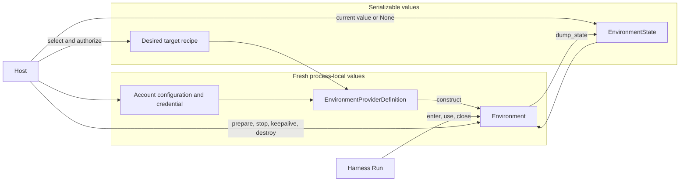
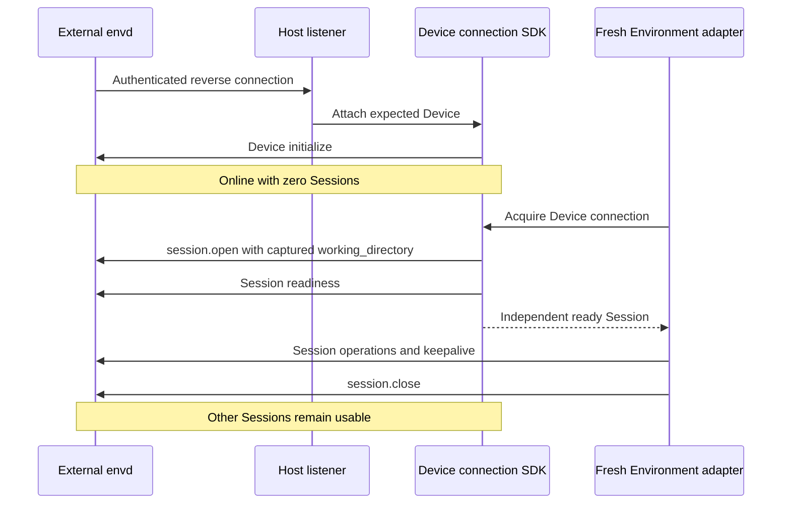

# Environment Providers

## Design Position

An Environment Provider is the Environment domain of the [Provider subsystem](22-provider-subsystem.md). It separates inert selection from process-local operation and portable re-entry state, using three entities and no others:

1. `EnvironmentProviderDefinition` is an immutable definition for one Provider type.
2. `Environment` is a fresh process-local adapter that performs provider operations and re-entry lifecycle.
3. `EnvironmentState` is a provider-owned portable semantic soft reference to one backing target.

A Host selects a trusted definition, supplies validated account inputs, a current credential, the desired target recipe, and current state; the definition constructs a fresh `Environment` and acquires only the collaborator that target needs. The Host chooses eager or lazy preparation. [Harness Environment Integration](08-environment-integration.md) consumes the constructed adapter and owns Run-local mount names, routing, and model-facing policy; it never selects a Provider or a target lifecycle policy.



## Boundaries

| Concern                                            | Owner                                                    |
| -------------------------------------------------- | -------------------------------------------------------- |
| Provider type, account inputs, credential, recipe  | `EnvironmentProviderDefinition`                          |
| Selection and deployment allowlist                 | `ProviderCatalog` and Host authorization                 |
| Live collaborators and current credentials         | Host, through the definition's runtime factory           |
| File, shell, process, output, and port I/O         | Entered `Environment`                                    |
| Create, resume, connect, and confirmed replacement | Provider implementation, through `Environment.prepare()` |
| Portable re-entry state                            | `EnvironmentState`; the Provider owns its opaque payload |
| Process-local cleanup                              | `Environment.close()`                                    |
| Backing-target destruction                         | Host policy invoking `Environment.destroy()`             |
| Durable state publication, retention, orphan prune | Host                                                     |
| Multi-mount routing and Agent-facing policy        | Harness                                                  |

The domain owns no Harness state aggregation, mount name, model-facing tool, Agent identity schema, Thread relationship, durable record, queue, lease, or product retention policy.

## Definition

```python
@dataclass(frozen=True, slots=True, kw_only=True)
class EnvironmentProviderDefinition[C: BaseModel, K: BaseModel, E: BaseModel, R](ProviderDefinition[C, K]):
    environment_model: type[E]
    construct: EnvironmentConstructor[E, R]
    describe_environment: Callable[[E], EnvironmentDescriptor]
    runtime_factory: RuntimeFactory[C, K, R] | None = None
    target_identity: TargetIdentity[E] = _no_target_identity
    backend_identity: Callable[[C], JsonValue] = ...
    supports_managed: bool = True
    supports_stop: bool = False
    supports_destroy: bool = False
    requires_keepalive: bool = False
```

Two configuration concepts are named unambiguously and never merged:

- `configuration_model` (`C`) and `credential_model` (`K`) describe the **account** used to reach a backend: an endpoint, a region, an API key. Host resources persist them under their own authority.
- `environment_model` (`E`) describes the **desired target**: the image, the root directory, the timeout. A Host template or profile owns this recipe.

A definition owns exactly one model of each kind. There is no configuration schema version and no versioned recipe map: changing the meaning of an input changes the Provider type. `EnvironmentState.state_version` remains an independent Provider-owned codec version, because state describes what currently exists rather than what is desired.

`create()` performs the whole inert selection path in order: it rejects managed creation on a connect-only Provider, validates the account configuration, enforces the declared `Authentication` and parses the credential, validates the desired recipe, allocates or accepts an `environment_id`, awaits `runtime_factory` when the Provider declares one, and returns a fresh adapter from `construct`. Everything before the runtime factory is pure; the runtime factory is the single place a Provider acquires a client, session, or host allocation.

`describe_environment()` projects a configured `EnvironmentDescriptor` from the recipe alone, so a Host can show operation families, permissions, limits, and the default working directory without target I/O. `target_identity()` returns the canonical native target selector, excluding bootstrap, credential, and connection metadata; `backend_identity()` returns the canonical non-secret backend namespace from validated account configuration, excluding timeouts, concurrency, and transport tuning. A Host combines Provider type, backend identity, and native target identity for uniqueness. Credentials and Host resource IDs never create another target namespace.

The four capability flags are the single source of truth. `supports_managed=False` marks a connect-only Provider, which is rejected at definition construction if it also declares `supports_stop`, `supports_destroy`, or `requires_keepalive`, and which rejects an allow-create call before any external effect. The base `Environment` answers every undeclared lifecycle operation with one typed `provider_operation_unsupported` error, so implementations do not repeat unsupported branches.

## State Envelope

```python
class EnvironmentState(BaseModel):
    model_config = ConfigDict(frozen=True, extra="forbid")

    provider_key: str
    state_version: str
    state: JsonValue
```

`provider_key` uses the shared Provider type pattern. The payload is bounded canonical JSON sufficient to validate and reconnect to one target, including a recoverable stopped target. It is not a credential, lease, live client, durable ownership grant, or proof of existence; target identity can be sensitive even when it is not a bearer credential.

State excludes credentials, bootstrap material, bearer URLs, transport sessions, callbacks, Host OS process handles, pipes, live SDK handles, temporary runtime paths, daemon generations, Harness mount names and IDs, Run access ceilings, working directories, and Host persistence fields. Provider-owned stable target correlation and backend-native process selectors needed by the recovery codec are permitted; Host Run authority and database fencing are not. A remote command PID is a backend selector, not a Host process handle.

Providers validate the exact state version, recipe compatibility, and target ownership evidence. A stateless Provider returns `None`; this means its deterministic recipe selects the environment, not that a target is absent. Current Host state always wins over portable Harness observations, including an authoritative `None`.

## Adapter Contract

The conceptual process-local API is:

```python
class Environment(ABC):
    provider_key: str
    environment_id: str
    descriptor: EnvironmentDescriptor
    availability: EnvironmentAvailability
    operations: EnvironmentOperations

    async def enter(self, *, mount_id: str | None = None) -> None: ...
    async def prepare(self) -> None: ...
    async def ensure_ready(self, operations: frozenset[EnvironmentOperationFamily]) -> None: ...
    async def check_ready(self, operations: frozenset[EnvironmentOperationFamily]) -> None: ...
    async def recover(self) -> None: ...
    def bind_mount(self, mount_id: str) -> None: ...
    def observe(self, callback: Callable[[str, str, BaseException | None], None]) -> None: ...

    def dump_state(self) -> EnvironmentState | None: ...
    async def close(self) -> None: ...
    async def reconcile(self) -> Literal["running", "stopped", "absent"]: ...
    async def stop(self) -> None: ...
    async def keepalive(self, *, deadline: datetime, operation_id: str) -> datetime | None: ...
    async def destroy(self) -> None: ...
```

The same object exposes provider-neutral file, shell, process, output, readiness, and port operations through `operations`. Lifecycle methods are trusted Host operations, not Agent tools. One implementation supplies the whole contract; there is no separate attachment, retention, or binding entity.

One fresh adapter serves one independent Run or one bounded Host lifecycle operation. It is entered exactly once, is not shared across independent Runs, is not retained after close, and is never stored in a database. Several fresh adapters can reference the same backing target when the Provider supports shared use. Envd-backed adapters share a Host-owned Device connection but never an initialized Session: each owns a fresh Session with a fixed default working directory and its own native resources. A Device connection is a runtime collaborator, not a fourth lifecycle entity, and its Session heartbeat is not target renewal.

### Construction and scope entry

Construction validates the recipe and state codec without filesystem, subprocess, or network I/O. The descriptor declares a default absolute `working_directory`, `/` unless the Provider specifies another path; native Docker declares `/workspace`. Harness mounts use this default when the Host supplies no explicit working directory. The default changes neither mount roots nor file access.

`enter()` binds the Run-local operation scope and an optional mount correlation. It performs no target I/O, does not connect a second time when the adapter is already prepared, and does not force an unprepared lazy adapter to prepare. Entering twice is an error. Before preparation the adapter exposes the configured descriptor and bounded unprepared availability; a live descriptor can only narrow the advertised capabilities.

### Preparation

`prepare()` ensures a usable target and the provider-owned operation connection. The Host may call it before Harness entry, or `ensure_ready()` may reach it on first actual use. Preparation validates current evidence and:

1. creates a target from the recipe when none has been allocated and creation is supported;
2. reuses a matching running target;
3. resumes a matching stopped target;
4. rebuilds a managed target only after authoritative absence and Host authorization;
5. establishes and validates operation clients, identity, descriptor, and required readiness;
6. caches changed target state immediately, before admitting operations that rely on it.

An inaccessible, incompatible, unknown, or temporarily unreachable target is not absent. Creation uses stable provider idempotency or recoverable ownership correlation; the contract claims no exactly-once external effect. A known create result stays available even when later readiness fails, so a Host can recover it after cancellation or failure.

Concurrent first operations share one preparation under the adapter's own lock, which also serializes close, so a cancelled or closing scope never publishes a newly prepared connection. `prepare()` on an already prepared adapter allocates nothing. Passive observers registered through `observe()` receive started, ready, failed, and closed events without owning lifecycle state.

Actual file, shell, port, or explicitly requested readiness operations can trigger lazy preparation. Scope entry, configured descriptor projection, synchronous state dump, and local close cannot. A Run that never uses the environment need not start it; a Host performing input or Skill materialization through file operations naturally triggers preparation.

### Readiness, recovery, and reconciliation

`check_ready()` checks an already prepared, entered adapter without recovering it, so a Host wrapper can verify readiness without letting an inner Provider rebuild behind its fence. `ensure_ready()` prepares if needed, then checks; when a Provider declares in-scope recovery and the check reports `environment_unavailable`, it re-prepares once under the same lock and raises `environment_rebuilt` or `environment_connection_refreshed` so the caller retries an undispatched operation explicitly. A changed backing identity selects the stronger code. Recovery preserves native observations when the target is unchanged; an unknown outcome after dispatch is never replayed.

`reconcile()` observes an abandoned preparation without creating, starting, replacing, or deleting a target. It recovers target state from stable ownership correlation even when an interrupted create returned no target ID, and reports `running`, `stopped`, or authoritative `absent`; ambiguous observations retain the pending operation. A Host can reconcile after the originating Run ends without manufacturing Run execution authority.

### Stop, keepalive, and destruction

`stop()` stops the exact represented target while preserving what is needed to resume it. A Provider declares whether stop preserves process memory or only persistent filesystem state. Stop never erases the state selector, deletes caller-owned directories, bind sources, or unrelated volumes, and repeated stop reconciles actual state instead of starting a target.

`keepalive_horizon` requests a renewal interval, defaulting to 300 seconds and narrowed by the Provider to fit the target. `keepalive()` extends a running target's supported lifetime and reports actual expiry evidence, or returns `None` for a backend without expiration. The Host supplies one stable operation identity per intended renewal and owns timing and retry policy. Renewal cannot start a stopped target; provider limits and uncertain outcomes are explicit.

`destroy()` requires a fresh, unentered adapter and removes the exact target after ownership validation. Confirmed absence is an idempotent result; an unknown outcome retains state for reconciliation. Destroying an environment never deletes caller-owned storage. A later authorized managed preparation can create a new target, but that is reconstruction from the recipe, not recovery of destroyed files.

Lifecycle operations run on a trusted adapter without entering a Harness Run, and stop, keepalive, and destroy never prepare first, so cleaning up a stopped target cannot wake it.

### Close and state dump

`close()` fences new local operations and releases clients, sessions, subprocess resources, and other local handles. It neither stops nor destroys a durable backing target, stays safe for an unprepared adapter, and allocates nothing merely to clean up. Provider-specific ephemeral transport processes can be closed without destroying the underlying workspace.

`dump_state()` synchronously returns a detached copy of the last validated cached state, or `None`. It performs no I/O and is available after construction, preparation failure, cancellation, and close failure. A failed refresh does not erase the last known state. Known stop preserves its reconnect state; confirmed destruction clears it, while the Host separately retains generation history.

## Process and Output Observations

The Provider owns native execution truth and the recovery its state codec supports. State can select a target from which commands are discovered without enumerating every command. Reconnecting to the same target permits attempting native lookup; it does not prove that a process survived, and a missing command is never automatically restarted.

`ProcessIdentity` binds a native selector to one Provider, logical Environment, and target generation. `ProcessInfo` carries a bound handle, native status, optional stdin-state evidence, and an optional richer output snapshot. Status may be `unknown` or `missing`; neither invents an exit code or a successful terminal outcome. Closing or capping output observation does not satisfy a process wait. An `initial_terminal` wait observes native completion independently from output completeness and process-tree cleanup.

`process.list` is optional and returns a bounded `ProcessDiscovery(processes, has_more)` without attaching output streams. `rebind` selects an explicit native identity without creating a command. Start, inspect, wait, output reads, discovery, stdin, signals, kill, and release have independent declared actions; lacking discovery, stdin, or arbitrary signals does not remove otherwise supported background observation. `release` relinquishes the local observation and its readers without implying termination; process survival after release or close depends on the backend, not on a Harness cleanup policy.

Output observations carry returned segments and available offsets together with `origin` (`native_bytes` or `sdk_text`), `coverage` (`complete`, `partial`, or `unknown`), `observation_closed`, a bounded optional reason such as `reattached`, `connection_lost`, `observation_limit`, or `observation_evicted`, and optional `produced_bytes`, `dropped_bytes`, and `producer_complete` evidence that is never fabricated. Native-byte offsets identify the backend's retained range; SDK-text offsets identify UTF-8 encoding of SDK-delivered text, not original stdout bytes. A transient reattachment retains the accumulated current-scope log, appends later text, and marks the gap; it neither resets offsets nor promises replay deduplication. Target replacement invalidates the identity, and a fresh scope starts a new observation.

Ordinary `shell.exec` has a bounded inline result contract. A Provider that internally uses native retention materializes that operation's bounded output and releases its own resources before returning; no retained reference escapes the ordinary result. A post-execution read failure preserves the known command outcome with incomplete output rather than inviting replay. The standalone retained-output facet keeps its independent read and release authorization and is not a prerequisite for shell execution or process observation.

## Host State Authority and Concurrency

The Host owns durable selection, publication, lifecycle serialization, and retention. a13n Service's [Environment records](../a13n-service/29-environment-management.md) and Harness UI's [local state](../a13n-harness-ui/04-projects-threads-and-environments.md#host-authoritative-environment-state) are distinct Host policies over the same contract.

A Host publishes changed state when known and attempts publication from unconditional finalization even after execution, checkpoint, or local-close failure. Equal state needs no write. A stale adapter cannot overwrite newer state solely because it finishes later; distributed Hosts use their own conditional publication and operation reconciliation. The domain prescribes no global table, last-write-wins policy, or exactly-once guarantee.

Provider-local synchronization protects concurrent preparation and native handles. Hosts serialize conflicting target lifecycle operations across adapters. A database lease alone cannot cancel a dispatched provider mutation: a new preparation must reconcile an outstanding stop or delete before serving operations. Inline children borrow the parent's scope; async children receive fresh Host-selected adapters.

A target generation change invalidates native handles, readiness evidence, and operation references tied to the displaced target. The Provider exposes the change through the adapter, the Host updates durable generation evidence, and Harness invalidates affected routing and observations before later use.

## Built-in Providers

Eleven built-in definitions ship with Harness across two operation routes. Built-ins use the same authoring contract as installed plugins.

| Route  | Type             | Backing target                              | Operation backend            | Lifecycle boundary                               |
| ------ | ---------------- | ------------------------------------------- | ---------------------------- | ------------------------------------------------ |
| Native | `direct_local`   | Existing Host directory                     | Local OS file/process APIs   | Caller-owned directory                           |
| Envd   | `local_envd`     | Local folders and a Host-owned daemon       | EIP over shared stdio        | Adapter-owned Session; Host-owned daemon         |
| Native | `docker`         | Docker container                            | Docker Engine API            | Managed container; close preserves the target    |
| Native | `e2b`            | Native E2B sandbox                          | E2B SDK and bounded commands | Create, pause/resume, renew, and destroy         |
| Native | `daytona`        | Daytona sandbox                             | Toolbox commands             | Create, stop/start, and destroy                  |
| Native | `modal`          | Modal sandbox                               | Async SDK commands           | Create, filesystem snapshot stop/resume, destroy |
| Native | `vercel`         | Named Vercel Sandbox                        | Native command stream        | Create, stop/resume, renew, and destroy          |
| Native | `sprites`        | Persistent Fly.io Sprite                    | Native WebSocket exec        | Create, automatic sleep/wake, and destroy        |
| Native | `runloop`        | Runloop Devbox                              | Native commands              | Create, suspend/resume, keepalive, and shutdown  |
| Envd   | `http_envd`      | External daemon at a configured origin      | EIP over HTTP(S)             | Connect-only                                     |
| Envd   | `websocket_envd` | External daemon reverse-connected to a Host | EIP over accepted WebSocket  | Connect-only; Host-integrated SDK                |

Envd-backed Providers use EIP for Agent file, shell, process, output, and port operations. Native Providers use their native backends without requiring envd. No Provider emulates an unsupported operation through a different backend; unsupported operations fail explicitly.

Each scoped adapter exposes a configured descriptor without target I/O, and preparation validates the live descriptor before operations. Harness intersects the operation families with the Run-local access ceiling. Stable environment identity is allocated by the Host per Environment and supplied at construction, never frozen into a reusable recipe; a Provider may retain its non-secret ownership correlation in state or labels to recover a dispatched creation.

### Direct Local

`direct_local` denotes access to an existing Host-controlled directory over the embedding operating system. Its recipe declares the root, optional shell profiles, allowed executables, environment-inheritance policy, allowed ports, and finite value, process, wall-time, buffer, and spool limits. The root, shell executables, and allowed executables are absolute after user expansion; profile IDs are unique; a read-only root cannot enable shell profiles or allowed executables, because an allowed native process could mutate files through the embedding OS account. The account configuration is empty: the Host filesystem is the backend.

Text reads apply `max_value_bytes` to the actual UTF-8 page rather than the product of requested line count and line length, so a valid oversized request returns a shorter successful page. Pages end before the next whole line that would exceed the budget; `lines_read` counts returned source lines and `has_more` reports later lines. A single line that cannot fit an otherwise empty page returns its bounded UTF-8 prefix, preserves a trailing LF, and records the one-based source line number in `truncated_lines`; `has_more=false` therefore does not imply that a shortened line was complete. Invalid UTF-8 and NUL remain errors even in a discarded suffix.

Commands run on POSIX hosts and native Windows without WSL or a daemon. Each command owns a POSIX process group or a Windows Job Object, assigned before execution so descendants cannot escape ownership during startup. Root exit and complete tree cleanup are separate observations. The default `posix` dialect retains `-c` and optional login semantics; a `powershell` profile disallows login, passes an encoded command, and selects UTF-8 for redirected text. `inherit_environment` defaults to false; when enabled, each command copies the Host process environment at launch, removes `unset` keys, then overlays `set` values without mutating the Host or other commands. `allowed_environment_keys` gates explicit set and unset keys only and does not filter the inherited baseline; Windows key matching is case-insensitive. Environment values stay runtime-only and never enter configuration, state, descriptors, or backing identity. POSIX supports interrupt and terminate signals; Windows supports tree termination and kill, and an interrupt request returns `environment_unsupported` rather than pretending a forced termination is graceful. Native execution enforces no memory, CPU, process-count, or network-denial limit and rejects requests requiring them.

Direct Local is stateless for re-entry and `dump_state()` returns `None`; the recipe is the deterministic target. `prepare()` validates that the configured root exists and is accessible, constructs fresh local facets, and establishes Run-local process ownership. Inaccessibility is unavailable evidence, never authoritative absence; Direct Local never creates the root. `close()` terminates and releases only the processes, streams, retained output, and handles that adapter owns. It declares `supports_stop` and `supports_destroy` so a Host lifecycle policy needs no special case, but both are no-ops over the caller-owned directory: Direct Local never allocates, locks, backs up, or deletes it. It declares no keepalive requirement.

Prepared descriptors expose bounded `backing_identity` evidence binding the Provider, Host filesystem namespace, resolved root file identity, and configured operation policy. An ordinary content edit preserves it; replacing the root or changing the policy invalidates it. The field is absent when the filesystem supplies no usable identity evidence. This evidence is neither a content digest nor a lock, and guarantees nothing against file-ID reuse or hostile concurrent namespace changes.

Direct Local makes no sandbox, account-isolation, network-isolation, or race-free filesystem-broker claim; its confinement is a provider operation policy over one Host-selected root. File writes stage complete candidates before publication, and `move(replace=False)` uses one native no-replace rename on Linux, macOS, and Windows, so a concurrent destination publication is a conflict that preserves the losing source. Platforms without that primitive return `environment_unsupported`; cross-filesystem moves are unsupported.

### Local Envd

`local_envd` provides local EIP operations through a Host-owned daemon. Its credential-free recipe contains a working directory and required methods under the [remote path contract](#remote-envd). The working directory is an existing Device path, not a filesystem access boundary.

The Host's runtime collaborator lazily resolves an exact executable, launches envd under the selected account or outer sandbox, and shares the resulting stdio Device connection across compatible adapters. Different security boundaries use separate launches; a Session cannot widen one. A Sandbox product must sandbox the whole daemon rather than ask envd to build per-command isolation. A separate explicit resolver can consult an explicit path, `A13N_ENVD_EXECUTABLE`, then `PATH`; definition construction never discovers executables or ambient credentials.

Local Envd retains no durable target beyond Host-selected files and returns `None` state; the Host-owned connection runtime, not portable state, preserves a daemon across adapters and Runs. `prepare()` acquires the ready Device connection, opens a fresh Session with the captured working directory, verifies method compatibility and readiness, and exposes operation facets. Preparation cancellation closes only the newly created Session; failing to open one Session never kills a healthy shared daemon. `close()` fences adapter operations, stops Session keepalive, and closes that Session and its owned commands, output, and transfers while preserving the carrier and daemon. Local Envd declares no stop, destroy, or renewal capability, and workspace files are never deleted by close or collection. After preparation, `backing_identity` uses the same Host filesystem evidence as Direct Local plus the effective launch configuration; a fresh Session does not change it, while root replacement or a changed launch boundary does.

### Docker

`docker` uses the Docker Engine SDK directly. No Envd executable, EIP connection, bootstrap credential, or control port exists in this Provider. The recipe describes an image and container creation options; the account configuration supplies `docker_host`. Service offers Docker only in `deployment.mode = "single_host"`.

The recipe includes the `image`, which the selected Engine uses locally when present and pulls only when absent; `environment` and an optional `init_script` executed only on a newly created container; optional `cpus`, `memory_gb` (decimal GB, minimum 6,291,456 bytes), and `pids_limit`; `disable_network`, default false, whose true value selects Docker's `none` network for initialization and commands alike with no published ports; `mounts` with an existing absolute host `source`, an absolute container `target`, and `read_only` defaulting to true; and advanced user, shell, Python, stop grace, request timeout, file and query limits, output preview and capture limits, and concurrent observation limit. Named volumes are not a recipe option, and external mounts cannot replace `/workspace`, the root filesystem, or the Provider's private `/tmp/a13n` command metadata directory.

`/workspace` belongs to the container writable layer, and each Environment owns a separate container. Explicit external host directories are shared only when recipes name the same source; Docker resolves source paths in the Engine's filesystem namespace, which may differ from the Worker's. Destruction never removes an external source. The default image is `ghcr.io/converge-ai-labs/a13n-docker-environment:dev`; a custom image supplies Linux, Python 3.10 or later, the configured shell, and a user able to write `/workspace` and `/tmp/a13n`, with Git additionally required for Git-ignore queries. The Provider replaces the image's ENTRYPOINT and CMD, enables Docker init, and runs a Python waiting process. There is no guest operation server: file and port operations use bounded one-shot Python standard-library commands through Docker exec, and file semantics share the native helper.

The deployment shares the host Docker Engine in single-host mode, so socket access grants host Docker authority. A locally built image is used directly when present; a missing image is pulled once, and tag changes do not recreate an existing container. A manual image test pins the resolved image ID for a temporary container, exercises file, command/output, and process-control operations, and removes that container after success, failure, timeout, or cancellation; it is not a prerequisite for normal creation. The runtime collaborator owns a Docker engine boundary whose acquisition is cancellation-safe with bounded teardown, runs SDK I/O off the event loop, and applies a finite request timeout.

State contains the allocation's `environment_id`, the exact `container_id`, and a `configuration_fingerprint`. Canonical target identity is the container ID. Creation uses a deterministic name plus ownership and configuration labels, so reconciliation after an interrupted create response finds that exact target and validates its labels without starting it. Foreign or incompatible targets are never adopted or destroyed, and a connection failure is not evidence of absence. Preparation reuses and starts the retained managed container; only authoritative absence permits replacement, and the new container ID advances generation evidence. New-container initialization must finish before readiness is published: a completion marker is written after initialization, and a retained container without that marker fails preparation rather than replaying a partially executed script. `stop()` stops the container while preserving its writable filesystem, `destroy()` removes that validated container and its private filesystem, missing-target deletion succeeds idempotently, and `close()` disconnects observations while preserving the container and its background processes.

Commands use native Docker exec with a configured shell or explicit argv, supporting stdin, separate stdout and stderr, bounded output, explicit process inspection, and targeted signaling. Signal controls verify the command's in-container PID generation before signaling its group and never stop the shared container; process-tree cleanup is not promised. Per-command resource limits and network policies the container cannot enforce are rejected explicitly. Output observations are scoped to the current adapter, with per-stream and aggregate limits that discard excess bytes and report incomplete coverage. Rebinding a known exec identity can inspect native status but does not reconstruct lost output or stdin, and native command output is never replayed after a Worker restart.

### Cloud Providers

E2B, Daytona, Modal, Vercel Sandbox, Fly.io Sprites, and Runloop each declare typed account settings, a private credential model, and one recipe model. Service enables all six by default and derives Console authoring schemas from the same models. All six expose files and shell execution through native transports. E2B additionally exposes native process observations, stdin, retained SDK text output, and loopback ports; the other five expose bounded foreground execution only, and unsupported process, output, port, resource, and network features fail explicitly.

Daytona, Modal, Vercel Sandbox, Sprites, and Runloop share command composition over the canonical file helper, with staged file publication and a bounded one-shot guest command runner. Each adapter owns its native transport and lifecycle; the common operation layer never dispatches on Provider type. REST uses the canonical async HTTP client, Sprites exec uses binary WebSocket frames, and Modal uses its async SDK and explicitly detaches sandbox command-router resources on local close.

State validates the Provider type, exact codec version, recipe fingerprint, and native target ownership before managed use. Names and labels correlate an allocation to the Environment, never a Session. Confirmed missing managed targets may be rebuilt; external state is mandatory and external adapters never allocate, and the five command-only Providers also refuse destruction of externally owned targets. Native names that can be reused retain backing identity evidence separately, so stale state cannot silently delete a different target at the same name. State and recipes never contain credentials, resolved toolbox endpoints, WebSocket URLs, SDK clients, or live native session handles.

| Provider       | Native lifecycle                                                                               | Stop guarantees                                                                      | Lifetime                                                                                                                                         |
| -------------- | ---------------------------------------------------------------------------------------------- | ------------------------------------------------------------------------------------ | ------------------------------------------------------------------------------------------------------------------------------------------------ |
| E2B            | Native SDK create/connect/pause/resume/kill                                                    | Native pause preserves memory and files                                              | Renewable whole-sandbox TTL; expiry is observed from the native service                                                                          |
| Daytona        | Create/get/start/stop/delete through the control API; exec through the validated toolbox proxy | Files survive native stop, archive, and start; memory is not promised                | Automatic deletion and hard TTL are disabled at creation; an organization-enforced hard TTL fails readiness                                      |
| Modal          | Named sandbox discovery, filesystem snapshot/terminate, snapshot-backed creation               | Files survive explicit managed stop; memory does not; resume changes native identity | Fixed running timeout up to 24 hours that keepalive cannot extend; internal snapshots have no expiry and are ownership-validated before deletion |
| Vercel Sandbox | Named persistent sandbox with native running sessions, stop/resume/delete                      | Native stop preserves files; memory is not promised                                  | Session renewal is bounded by the recipe's total timeout; internal native snapshots have no expiry                                               |
| Sprites        | Named Sprite creation/discovery/deletion; automatic wake on exec                               | Explicit stop is unsupported; native automatic sleep preserves disk                  | No adapter-owned renewal; native durable filesystem                                                                                              |
| Runloop        | Devbox creation/discovery/suspend/resume/shutdown                                              | Suspend preserves disk, not memory                                                   | Idle policy suspends; an acknowledged keepalive resets the configured idle interval                                                              |

Managed creation is recoverable through deterministic native names or ownership metadata, including after an interrupted allocation, and native metadata is revalidated before adopting a recovered target. Unknown existence, transient errors, and ambiguous control-plane states fail closed. Reconciliation does not allocate, start, stop, or delete. Close only fences local operations and releases transport resources, and cancellation does not claim immediate remote process termination. Native local rejection is `not_dispatched`; observed command completion is `known`, including nonzero exits; malformed or oversized mutation acknowledgements and lost responses remain `unknown`. HTTP deletion waits for authoritative absence or the provider's terminal state before state is discarded, and timeout or polling failure retains state and uncertainty.

Native lookup names and backing identities are distinct: Sprites state retains its native ID and Vercel state retains name plus creation timestamp, and `target_identity()` exposes that evidence to Host persistence. Reconnecting preserves Host generation; confirmed replacement advances it even when the lookup name is unchanged.

#### E2B

The recipe selects `template` (default `base`), logical filesystem `root` (default `/home/user`), sandbox `user`, the Python executable used by file and port helpers, sandbox and request timeouts, sandbox-wide internet access, read-only access, and finite file, traversal, and observation bounds. `timeout_seconds` defaults to 3600 for sandbox TTL and `request_timeout_seconds` to 30 for native requests. `max_active_observations` defaults to 128 concurrent native attachments, `max_observation_bytes` to 1 MiB cumulative combined stdout and stderr per observed command, and `max_retained_output_bytes` to 128 MiB retained text across the adapter.

Account configuration supplies the backend domain and an optional HTTP(S) `api_url`; the credential supplies the API key. All SDK lifecycle calls use the explicit API URL or `https://api.<domain>` and never inherit an ambient API URL. Compatible services may require their own template IDs and may not implement every lifecycle operation. The library loads no `.env` file and acquires no credential. Commands use the official asynchronous E2B SDK's public `run`, `list`, `connect`, `kill`, `send_stdin`, and `close_stdin` operations; file and port helpers use bounded Python standard-library commands. No guest command supervisor, PID registry, capture file, `a13n-envd`, executable upload, or template build is required. The selected template supplies Linux, Python 3.11 or later, Bash, the selected account, and the existing root, with Git additionally required for Git-ignore queries.

State contains `sandbox_id`, the owning `environment_id`, and a `configuration_fingerprint` covering target-compatible template, root, user, and internet-access settings but not local observation budgets. `prepare()` validates the exact state target or searches ownership metadata when state has not yet been received; multiple matches and incompatible metadata are conflicts. It resumes a matching paused sandbox or reconnects to the same running sandbox. Only managed selection with authoritative absence permits creation or replacement; authorization, transport, and rate-limit failures never permit speculative creation. Metadata search is not an atomic create-if-absent primitive, so Host lifecycle serialization remains required.

`close()` disconnects SDK observations and fences local facets without killing commands or the sandbox. A fresh adapter restored from state can discover running commands the sandbox still exposes, but unchanged sandbox identity does not prove command survival, and an exited command absent from the native inventory has no invented exit result. `stop()` pauses the exact validated sandbox with memory preservation, and `destroy()` kills only the validated sandbox; neither prepares or resumes the target. Keepalive rejects paused or missing targets, never shortens an existing deadline, and reports observed expiry.

Files support bounded raw reads, streamed SDK transfers, UTF-8 text, shared unified-diff semantics, traversal, search, atomic staged publication, copy, move, and deletion. Logical paths resolve beneath the configured root, which is a file-API boundary rather than shell confinement. Append and patch are read/modify/write operations, not compare-and-swap transactions. Port operations inspect or wait for loopback TCP listeners only. The `default` shell profile uses native login Bash; explicit non-login mode, direct argv execution, environment unsets, and unknown profiles are unsupported. Native stdin is bounded per request to 1 MiB. Native kill is SIGKILL; interrupt, terminate, and verified process-tree cleanup are unsupported. E2B enforces no per-command hard wall-time limit, and explicit execution deadlines, cumulative stdin quotas, CPU, memory, and process-count limits, and per-command network denial on an internet-enabled sandbox fail before dispatch.

Output uses `origin="sdk_text"`; producer totals and completion are unknown even when the SDK supplies terminal status. Only active native attachments, including in-flight start and connect reservations, count against observation concurrency, and finished or disconnected observations release that slot immediately. Status and reference metadata are separate from output retention: an adapter admits at most 100,000 unreleased references and requires explicit release before admitting more. The aggregate retained-output budget evicts the oldest closed observations' output first while preserving reference metadata, known terminal status, and cumulative per-stream end offsets, so reads report `observation_evicted`, partial coverage, and an advanced `available_start` rather than silently rebasing a log to zero. Active buffers are not evicted; when only active logs remain without space, or a command reaches its cumulative output limit, the adapter stops that observation and disconnects its SDK stream rather than the command. Waits use one monotonic budget covering native status queries and stream attachment; a zero timeout performs one status poll bounded by the native request timeout. Timeout returns the latest observed status without inventing completion, and cancellation releases the local observation without killing or replaying the native command. Native listing is not paginated by the locked SDK: the adapter bounds its projection and reports `has_more` without claiming a server-side cursor.

#### Daytona, Modal, Vercel Sandbox, Sprites, and Runloop

Daytona defaults to a writable `/home/daytona` and guest-PATH `python3`. Native stop and start preserve files only with confirmed disabled auto-deletion, so stop fails before dispatch otherwise; delete acknowledgement is fire-and-forget, so destruction polls until `destroyed` or absence.

Modal rejects stop for external registrations because snapshot-based resume would require allocation. A managed stop caches its snapshot selector before terminating the sandbox, resume retains that selector until readiness succeeds, and deletion retains pending snapshot cleanup state until cleanup succeeds. Native ownership tags must agree before deleting snapshot images. Modal uses an existing deployed App; the adapter creates no Apps and deletes no caller-supplied base image. If an upstream snapshot response is lost before its image ID is known, the provider cannot enumerate that orphan image; this is an upstream limitation, not permission to infer completion.

Vercel Sandbox uses Python 3.13 and `/vercel/sandbox`. Persistent named target identity survives session stop and resume, while session identity fences local observations. Destruction verifies target absence and requests native orphan-snapshot deletion, which the provider performs asynchronously without deleting snapshots still used elsewhere.

Fly.io Sprites defaults to `/home/sprite` and guest-PATH `python3`. Automatic native sleep and wake retain disk. There is no supported explicit stop operation, and the capability declaration prevents a Host from presenting one. Destruction verifies absence of the exact named backing target.

Runloop defaults to the unprivileged user's writable `/home/user` and guest-PATH `python3`. Suspend and resume preserve disk. Keepalive uses the returned target idle policy rather than an assumed recipe interval, and shutdown is complete only after confirmed native shutdown or absence.

### Remote Envd

`http_envd` and `websocket_envd` connect to externally operated Devices. They provision, start, stop, delete, and renew nothing: both declare `supports_managed=False`, and therefore no stop, destroy, or keepalive capability. EIP Session keepalive is separate from target renewal. HTTP is Host-dialed; reverse WebSocket is daemon-dialed, with envd always the responder. A Host-owned Device connection serves several fresh adapter-owned Sessions, and independent Runs never share an adapter or an initialized Session.

| Concern                                                                           | Owner                     |
| --------------------------------------------------------------------------------- | ------------------------- |
| Daemon deployment and outer security boundary                                     | Operator or Host          |
| Device registration, endpoint, credentials, listener and trusted folder selection | Host                      |
| Framing, multiplexing, Session controls and transfers                             | Low-level EIP client      |
| Bounded process-local Device connection registry                                  | Host-owned connection SDK |
| Fresh adapter, folder configuration and provider-neutral operation translation    | Remote Provider           |
| Cross-process routing, durable records and product policy                         | Host                      |

A Session is a resource owner, not a tenant sandbox. Device and working-directory selection are trusted inputs; the model receives only the resulting operation routes. The SDK owns no listener, global registry, credential issuer, or distributed relay.

The shared credential-free recipe contains `working_directory` and exact `required_methods`. Paths use the [Device path model](../a13n-envd/04-resource-operations.md#path-model), never the requester's filesystem. An omitted working directory resolves from Device info at preparation; a Host with immutable Run acceptance resolves and captures it before acceptance. Validation is structural and inert; Session opening checks availability. The adapter's provider-local `/` is the Device filesystem namespace rather than the selected directory: Device paths translate directly, and relative inputs and an omitted command cwd use the captured working directory. Required methods assert compatibility, not permissions.

External state contains the stable native `device_id` under the Provider's versioned state envelope, and unsupported state versions fail validation. State excludes endpoints, credentials, sockets, Sessions, generations, heartbeat state, and Run policy. `target_identity()` identifies the Device within the Host's immutable backend selection, not one folder binding; the Host owns resource deduplication, and distinct accepted folder bindings retain independent Session scopes.

The HTTP account configuration supplies a credential-free origin, an explicit private-link plaintext choice, finite connection and request timeouts, and bounded concurrency, with a required credential and TLS configuration supplied at runtime. Public origins use verified HTTPS; plaintext requires an explicitly trusted local or private deployment, and credentials never appear in URLs or portable state. One backend selects one origin, and changing it is an explicit Host target change. The WebSocket account configuration supplies a finite connection-acquisition timeout; the Host supplies the connection SDK through the runtime factory rather than a listener address in configuration, and an unwired Provider stays inert and fails runtime creation explicitly. The Host authenticates the upgrade, negotiates `eip.v1`, and resolves the expected Device identity before handing an accepted connection to the SDK. One SDK instance is a bounded process-local trust scope in which at most one active connection represents a Device; duplicates are rejected without replacing the active owner, while different Devices can be online simultaneously.

The connection SDK exposes authenticated Device info and bounded directory listing without opening an adapter or Session, and HTTP uses the same EIP methods directly. Host product authorization applies before discovery, no Run is required, and a discovery failure affects only that request.



Attachment performs the Device handshake immediately, even when no Run is waiting, and the Host awaits the attachment handler for the carrier lifetime. Acquisition waits for the matching Device under a finite deadline; cancelling a waiter neither consumes nor closes the connection. `prepare()` opens one independent Session, checks required methods and readiness, and exposes operation facets, and the client maintains Session keepalive for the adapter's lifetime. Cancelling preparation or closing the adapter stops keepalive and closes only that Session; it neither closes a borrowed carrier nor stops the remote daemon. A lost framed carrier detaches its Sessions for the EIP disconnect grace, and an existing owning runtime may explicitly reattach the same Session in the same generation while it remains valid; pending requests still have unknown outcomes when dispatch may have occurred, and reattachment never replays work or resumes transfers. An expired Session requires a fresh adapter, and old resource references stay invalid. SDK shutdown fences acquisition, closes owned Sessions and connections, and joins attachment handlers boundedly; an old handler removes only its exact connection, never a later replacement.

Remote Providers cannot authoritatively distinguish an unreachable machine from a stopped one.

### Host-local Backend Scope

Local Envd retains library-local runtime semantics and is not offered by Service. Direct Local and Docker have no hostname scheduling affinity, so Service requires their Workers to share one host and backend under the explicit single-host deployment contract. Docker account configuration records its `docker_host` endpoint. Direct Local and Local Envd identify their selected workspace path without including access or connection state. Docker's canonical native identity is the exact container ID, independent of process-local connections; its reconciliation searches the frozen logical target's ownership labels, validates ownership and configuration labels, and caches a recovered container ID without starting the container. External registration preserves the native identity in Provider state while exposing its independently allocated Service identity to Harness; an external stopped target is unavailable until its external owner starts it.

## Failure Semantics

| Condition                                             | Behavior                                                                 |
| ----------------------------------------------------- | ------------------------------------------------------------------------ |
| Unknown or unselected Provider type                   | Safe configuration error before recipe validation or runtime acquisition |
| Invalid account configuration, credential, or recipe  | Fail with bounded diagnostics and no external effects                    |
| Managed creation requested on a connect-only Provider | Fail with a typed unsupported error before external effects              |
| Mismatched state Provider type or unsupported codec   | Fail during deterministic state validation                               |
| Missing runtime collaborator                          | Fail construction or preparation before target mutation                  |
| Matching running or stopped target                    | Reuse or resume under Host authority                                     |
| Confirmed missing managed target                      | Rebuild only through the Host's authorized preparation                   |
| Unknown existence or ownership mismatch               | Fail or reconcile without speculative creation                           |
| Preparation fails after target creation               | Preserve known state and recoverable operation identity                  |
| Stop or delete races new use                          | Reconcile the in-flight lifecycle action before use                      |
| Renewal cannot satisfy the requested lifetime         | Report bounded actual evidence or failure                                |
| Dispatched operation has an unknown outcome           | Do not implicitly replay                                                 |
| Local cleanup fails                                   | Report separately; never escalate to target destruction                  |

Provider-neutral operation failures expose one safe projection containing `code`, a code-owned bounded `message`, an object-valued `details`, and an optional `retry_hint`. Exception descriptions remain local diagnostics and never become the public message. Providers identify correctable input failures with a public `field`, a stable `reason`, and a corrective `hint` where known. The projection bounds these strings and admits only explicitly public numeric and count fields, missing-operation names, and typed dispatch and retry evidence; arbitrary details, native paths, selectors, credentials, receipts, and raw provider text are omitted. A failure without specific diagnostics still receives safe code-level guidance. This operation projection is distinct from Provider lifecycle error categories and outcome certainty.

EIP adaptation preserves known input diagnostics beyond pattern errors, typed dispatch stage, provider retry semantics, and bounded effect counts without forwarding daemon exception text or native identities. `unknown_outcome` remains `environment_unknown_outcome` and requires reconciliation; it never degrades into an ordinary provider failure or permission to start a fresh mutation. A provider's `same_request` hint describes protocol operation-ID replay, not permission for a model to issue a new operation ID.

## Security Position

- Selection grants no authority. A Host allowlists Provider types and supplies trusted collaborators; model content and imported Harness state cannot select a Provider.
- Account configuration, recipes, and state carry no credentials, clients, sessions, bearer URLs, process handles, or mutable authority objects.
- State is a selector, not authorization. Preparation revalidates Provider type, codec version, recipe compatibility, and target metadata.
- Provider denial narrows Harness policy; Harness permission never bypasses provider enforcement.
- Direct Local is an explicit embedding trust choice and claims no native sandbox isolation.
- Docker and cloud credentials remain in runtime collaborators, and EIP credentials remain process-local.
- Public errors and observations redact provider-native secrets and unnecessary Host identifiers.
- Blocking native and SDK operations stay off the event loop and use bounded timeouts.

## Compatibility

Provider types are stable serialized discriminators shared by Host records, state envelopes, and Harness continuation. `EnvironmentState.state_version` evolves independently of the recipe model: supporting a new recipe field does not imply accepting an old state version, and supporting a state migration does not authorize changing the desired recipe. Providers reject unsupported versions and incompatible fingerprints explicitly, and preparation never silently rewrites incompatible data.

`EnvironmentProviderDefinition`, `Environment`, and `EnvironmentState` define the shared lifecycle API. Host resources and lifecycle policy do not become a second Provider hierarchy. Installed code provenance is diagnostic metadata, not a per-Environment package lock.

## Invariants

01. `EnvironmentProviderDefinition`, `Environment`, and `EnvironmentState` are the only shared Environment lifecycle entities.
02. Definition construction, recipe validation, and adapter construction perform no external I/O; only the runtime factory acquires a collaborator.
03. Account configuration and the desired target recipe are separate declared models, and neither carries current target identity.
04. Every independent Run receives fresh adapters, entered exactly once.
05. State is supplied before entry and is never a live object or proof of existence.
06. Confirmed absence may create a replacement; unknown evidence fails.
07. `close()` and context exit are always non-destructive.
08. Only explicit Host policy invokes `destroy()`, on a fresh unentered adapter.
09. Declared capability flags are the single source a Host reads before offering a lifecycle action.
10. Unknown effects never authorize silent replay.
11. External workspaces, bind sources, and named volumes are never provider-owned cleanup targets.
12. Harness owns multi-mount routing, not Provider selection or backing-target lifecycle.
