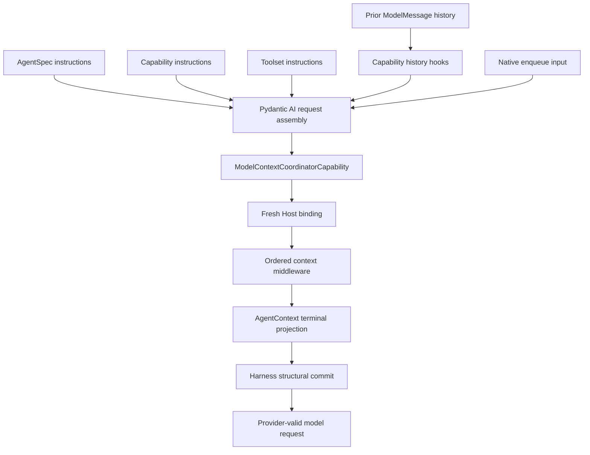
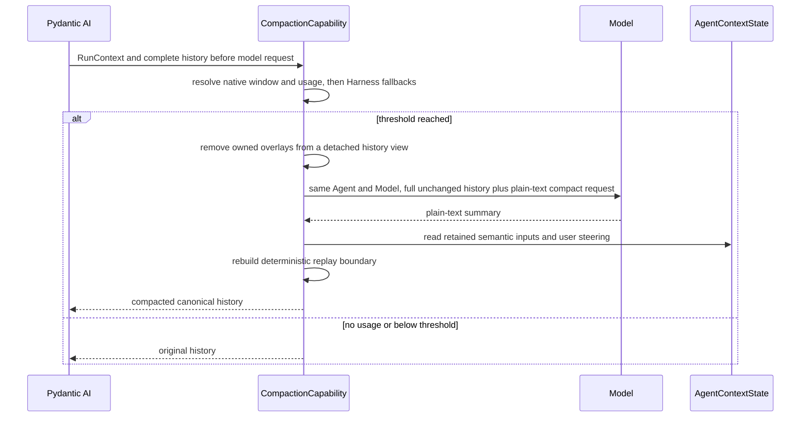

# Context, Working State, Resource Acquisition, and Memory

## Design Position

Pydantic AI assembles the stable model prefix from Agent, Capability, and Toolset instructions and owns active `ModelMessage` history. The Harness adds one typed request-overlay mechanism for dynamic model context. It does not define another instruction language, allow context middleware to edit messages directly, or treat rendered context as authoritative state.

The mandatory `ModelContextCoordinatorCapability` is the only Harness Capability that commits a `ModelContextProjection` to the outgoing `ModelRequestContext` and the corresponding active-history request boundary. Ordinary history hooks receive previously committed overlays unchanged. At the final model-request wrapper boundary, after those hooks and content filters, the coordinator recognizes an eligible request kind, evaluates one middleware chain, validates the result, and places the resulting blocks. The terminal source is `AgentContext.project_model_context()`, which combines the default Agent runtime/conversation projection with `BoundEnvironment.project_model_context()`. A fresh Host binding is semantically outermost; selected or plugin-contributed `AbstractModelContextCapability` instances compose between the Host and terminal source in Pydantic's already-finalized Capability order.

Working state, file context, skills, memory, and other Agent-loop behavior remain ordinary `AbstractCapability[AgentContext]` implementations. A feature that augments dynamic context implements the narrow model-context subtype rather than independently appending `UserPromptPart` values. `DynamicEnvironmentCapability` owns optional Toolset composition, feature lifecycle, and mount-change enqueue behavior; `FileToolset` and `ShellToolset` own the stable usage guidance for the tools they actually contribute. The Harness-internal Environment facade owns its provider-neutral current-mount projection, and no Capability owns Environment lifecycle or mutation authority. Query-dependent retrieval that must transform the complete semantic run input remains a Harness plugin concern, and that plugin may also contribute an ordinary model-context Capability.

## Context Layers



| Layer                    | Owner                                                                           | Representation                                           |
| ------------------------ | ------------------------------------------------------------------------------- | -------------------------------------------------------- |
| Authored Agent behavior  | `AgentSpec`                                                                     | Pydantic instructions                                    |
| Feature guidance         | Owning Capability                                                               | Capability instructions                                  |
| Tool usage guidance      | Owning Toolset                                                                  | Toolset instructions                                     |
| Interaction continuation | Pydantic AI                                                                     | `ModelMessage` history                                   |
| Trusted follow-up input  | Harness/Host through Pydantic                                                   | Native enqueue input                                     |
| Dynamic request overlay  | Harness coordinator, Host, AgentContext, Environment, and owning Capabilities   | Typed `ModelContextProjection` committed as user content |
| Provider compatibility   | Native `ModelProfile` and adapter; scoped Capability only for residual behavior | Profile rendering or bounded public-hook transformation  |

Instruction and context-middleware ordering both inherit Pydantic AI's finalized Capability composition. `CapabilityOrdering.wraps` and `wrapped_by` determine nesting, while `requires` only guarantees presence. The Harness does not introduce a context-specific priority, registration order, or second topological sort.

### Toolset instruction enablement

Harness `AgentSpec.toolset_instructions` is the definition-level default and defaults to `True`. `RunBindings.toolset_instructions` is an optional single-run override: `None` inherits the definition default, while `True` or `False` explicitly enables or suppresses Toolset-owned instructions for that logical run. The resolved non-optional value is published as `AgentContext.toolset_instructions` and remains fixed across internal `ModelAttempt` values.

This switch applies only at the Toolset instruction boundary. It does not suppress explicit `AgentSpec.instructions`, Capability-owned feature instructions, tool descriptions or schemas, dynamic model-context projection, or tool availability. A bare native Pydantic `AgentSpec` uses the default `True`. For inline delegation, only an explicit runtime override propagates to the child binding; when the parent has no runtime override, each child uses its own definition-level default.

## Request Preparation

The standard Capability set performs the following semantic work without creating a global stage API:

1. validate imported message structure and apply the mandatory message-integrity Filter without rewriting provider semantics;
2. apply handoff, accepted enqueue content, completed background work, and explicit file references;
3. compact history when the configured budget requires it;
4. resolve current Environment projection, working-state, memory, and skill guidance;
5. finalize media and verify tool-call/result integrity before provider dispatch.

The list defines expected ordering relationships for first-party Capabilities. Native model adapters and `ModelProfile` own ordinary provider reasoning, tool-argument, and history projection compatibility. Only while the latest upstream lacks a required public seam may an exact-model-integration-scoped Capability apply a tested public-hook repair; it carries typed configuration and an upstream-removal condition and never becomes a standard global normalization stage. Third-party Capabilities compose through Pydantic ordering constraints rather than registering a named stage.

Dynamic content is data under the trust level of its source. Retrieved text, file content, tool output, mount-change notice, or a skill document cannot establish Identity, policy, credentials, or Environment authority.

## Model Context Projection Contract

The public values are immutable and detached from `ModelRequestContext`:

```python
class ModelContextRequestKind(StrEnum):
    INPUT = "input"
    TOOL_RESULTS = "tool_results"


class ModelContextInputOrigin(StrEnum):
    USER = "user"
    ENQUEUE = "enqueue"


class ModelContextPlacement(StrEnum):
    INPUT_PREAMBLE = "input_preamble"
    REQUEST_EPILOGUE = "request_epilogue"


@dataclass(frozen=True, slots=True)
class ModelContextProjectionRequest:
    kind: ModelContextRequestKind
    input_origin: ModelContextInputOrigin | None = None
    tool_call_ids: tuple[str, ...] = ()


@dataclass(frozen=True, slots=True)
class ModelContextBlock:
    source_id: str
    placement: ModelContextPlacement
    content: str


@dataclass(frozen=True, slots=True)
class ModelContextProjection:
    blocks: tuple[ModelContextBlock, ...] = ()


type ModelContextNext = Callable[
    [ModelContextProjectionRequest],
    Awaitable[ModelContextProjection],
]


class AbstractModelContextCapability(
    AbstractCapability[AgentContext],
):
    async def wrap_model_context(
        self,
        ctx: RunContext[AgentContext],
        request: ModelContextProjectionRequest,
        handler: ModelContextNext,
    ) -> ModelContextProjection: ...


class ModelContextMiddleware(Protocol):
    async def wrap_model_context(
        self,
        ctx: AgentContext,
        request: ModelContextProjectionRequest,
        handler: ModelContextNext,
    ) -> ModelContextProjection: ...
```

A model-context Capability normally awaits `handler(request)` and returns a transformed immutable projection. It can append its own stable source block, replace selected blocks, or intentionally short-circuit the inner chain. A Host binding has the same call-next, transform, replace, and short-circuit semantics and occupies the semantic outermost position. It is a fresh single-run collaborator in `RunBindings.model_context`, not a Capability, declarative value, persisted callback, or message hook. Plugin context contribution uses the existing `AbstractHarnessPlugin.get_capabilities()` path and the explicit Capability subtype; plugins receive no parallel context hook or ordering plane.

Pydantic's finalized run Capability mapping is the only source of middleware order. The coordinator selects values with `isinstance(value, AbstractModelContextCapability)` without dynamic method discovery, preserves that finalized order, and constructs the native wrapper nesting. The fixed semantic chain is:

1. fresh Host binding, when present;
2. finalized model-context Capabilities in native wrapper order;
3. `AgentContext.project_model_context(request)` as the terminal projection.

The terminal projection calls `BoundEnvironment.project_model_context(request)` and combines its ordered blocks with the bounded default Agent run/conversation projection. Environment contributes `INPUT_PREAMBLE` blocks only for an `INPUT` request. Agent run/conversation context contributes one `REQUEST_EPILOGUE` block for both `INPUT` and ordinary `TOOL_RESULTS` requests, using a more compact tool-results form. Current time, request usage, selected Host metadata, working tasks, notes, and other Capability-owned state remain projected by their owning model-context Capabilities rather than exposing opaque `AgentContextState` namespaces to the terminal source.

`ModelContextBlock.source_id` is stable, non-blank, bounded provenance, not ordering or authority. Contents are bounded text and retain the trust level of their source. Middleware never receives mutable messages. The final Harness commit, which no Host or Capability can bypass, validates source IDs, block counts, per-block and aggregate UTF-8 byte limits, and the two fixed placements; records Harness ownership metadata; and rejects malformed output before model dispatch. Limits apply after the complete outer chain, so replacement or short-circuit cannot bypass them.

Context blocks are committed as native `UserPromptPart` sequences containing `TextContent`, with application-only metadata `display: false` and the block's `source_id`. These flags survive native message serialization and are not sent to the model provider. They are presentation hints, not redaction or authorization. The owning request still records exact index/hash ownership for history replacement; display metadata alone never authorizes deletion. Cleanup accepts previously persisted string overlays as well as metadata-bearing text, without deleting matching user-authored text.

## Eligible Requests and Placement

The coordinator classifies the complete final `ModelRequest`, after ordinary history transformation and content filtering, into one of these cases:

| Request kind                                  | Projection behavior                                                                              |
| --------------------------------------------- | ------------------------------------------------------------------------------------------------ |
| Ordinary user input                           | `INPUT`, `input_origin=USER`; both placements eligible                                           |
| Harness-accepted enqueue or startup notice    | `INPUT`; `input_origin=ENQUEUE` only with explicit producer provenance; both placements eligible |
| Ordinary complete tool-result batch           | `TOOL_RESULTS`; only `REQUEST_EPILOGUE` is eligible                                              |
| Output validation/tool retry                  | No projection and no message mutation                                                            |
| Deferred-tool exact resume                    | No projection or cleanup before the exact continuation advances                                  |
| Provider-suspended exact continuation         | No projection or cleanup before the exact continuation advances                                  |
| Any ambiguous or structurally invalid request | Fail through the existing request-integrity boundary rather than guessing a context request kind |

For `INPUT`, every `INPUT_PREAMBLE` block is inserted immediately before the first original input part and every `REQUEST_EPILOGUE` block is appended after the complete original request content. For `TOOL_RESULTS`, every original tool-result part in the batch remains contiguous and in original order; `REQUEST_EPILOGUE` blocks are appended only after the final result. Context is never inserted between tool calls and results, between sibling tool results, or into a provider-suspended/deferred exact tail. An `INPUT_PREAMBLE` result for `TOOL_RESULTS` is invalid.

On ordinary preparation, the coordinator leaves every previously committed Harness-owned overlay byte-for-byte unchanged and resolves and commits one fresh projection at the final eligible boundary. This preserves the provider prompt-cache prefix while recording what the model observed at each historical request. Validated compaction and handoff replace historical overlays along with the old history. Compaction passes the complete unchanged history, including committed overlays, into its summary request; handoff removes overlays from its replacement input through Harness ownership metadata without recognizing text markers or deleting caller content. Environment, default, first-party, plugin, and Host middleware never scan or rewrite messages themselves. Historical projections are model-visible evidence rather than authoritative state; current values are recomputed from fresh run bindings and appended at the next eligible boundary.

Pydantic's ordinary text request shape does not reliably distinguish user input from enqueue input. When no producer-owned provenance is present, the coordinator classifies that shape as `input_origin=USER`; `USER` and `ENQUEUE` have identical placement and eligibility semantics. Implementations do not infer origin from text, timestamps, or run identifiers.

## Cache-stable Context Projection

Model-facing data has three cache classes:

- build-static behavior, including feature purpose, remains in Capability instructions, while tool purpose, generic routing syntax, safety constraints, and provider-independent usage guidance remain in the owning Toolset's stable instruction and tool prefix;
- run-frozen model surface, such as an Environment-backed skill catalog required for the first request, is materialized once by the owning Capability's `for_run()` after scoped readiness, deterministically ordered, and immutable for that Harness run;
- request-dynamic context, including current Environment mounts, availability, runtime and working state, file references, background results, and mount changes, enters only through the typed overlay or native enqueue input after the stable prefix.

A run-frozen Capability returns a replacement whose `get_instructions()` and tool discovery read only frozen in-memory values and perform no provider, filesystem, or registry I/O. Pydantic re-extracts that replacement's contributions before the first model request. A provider cache breakpoint can separate the build-static prefix from a run-frozen catalog when the provider supports one; readiness and deterministic ordering prevent placeholder-to-real or mid-run mutations but do not claim a cross-run cache hit when catalog bytes differ.

Request-dynamic data never mutates instructions or tool schemas. Instructions contributed by a Capability remain byte-for-byte stable across model requests within one Run unless that Capability's contract explicitly defines a request-to-request transition. A Capability that transforms model-visible messages commits the exact provider-visible result to active canonical history before model dispatch; a request-local replacement that is absent from active history is invalid because later requests and terminal history would diverge from what the provider observed. Unless an owning Capability explicitly replaces history, the complete message sequence observed by one model request remains a byte-for-byte prefix of the next request. Once committed, historical request parts remain unchanged until such an owned transformation, including validated compaction or handoff, replaces history; a later eligible boundary appends a fresh projection rather than rewriting the provider-visible prefix.

A Capability that intentionally supports hot reload reads the run-local Environment change journal and enqueues one bounded trusted notice; the next eligible boundary receives a fresh overlay. Ordinary operation readiness stays inside the selected Environment operation and does not force unrelated model-surface preparation. Content that transforms history for correctness, including compaction and handoff, remains in the owning native history/model-request hook and executes before the coordinator's structural commit.

Every logical Harness run projects fresh Agent and Environment context at its first eligible input boundary. A replacement durable execution attempt can materialize different mount IDs, descriptors, permissions, availability, provider generations, runtime usage, or working state under the same Host definition, so cross-run equality never reuses rendered context. Within one entered run, every eligible input receives the current Environment block; later mount changes can additionally cause a coalesced trusted enqueue notice before that fresh projection. Provider-suspended and deferred exact continuations remain untouched until they advance, after which the first ordinary eligible boundary receives current context.

`DynamicEnvironmentCapability` can be omitted or configured by its Host. Environment lifecycle and the bounded provider-neutral Environment block remain available through the default terminal projection; the Capability adds model tools, stable routing guidance, live observation, and coalesced mount-change notices. With no model-visible mount, stable tools can report typed unavailability and later become usable after a Host mount. There is no global callback list, source priority, or arbitrary prompt-rewriting switch.

## Active Messages

Active history is the Pydantic AI `ModelMessage` sequence required to continue the Agent interaction. It is distinct from application conversation, display, audit, and analytics history.

Messages are appended only at complete semantic boundaries. Tool calls and results remain paired or use Pydantic deferred-tool semantics. Native model adapters produce provider-specific request projections and do not silently rewrite stored history. An owning Capability replaces history only for its actual Agent behavior, such as validated compaction, or under the narrow temporary integration-scoped repair rule above.

`HarnessState.message_history` uses the public Pydantic message codec. Imported metadata never restores Identity, approval, provider ownership, or Capability state.

Input presentation follows native semantic-input and steering-delivery events, not reconstructed history. Each detached `ModelInputEvent` preserves input content metadata for the client display protocol. Synthetic compaction and handoff history is model context, not a new user input event. Restoring or displaying a session does not wrap native strings, reorder history, or maintain a parallel display-identity registry. Explicit history inspection remains separate from the live conversation event stream.

## Runtime Context, Workspace Outline, File Context, and Handoff

Runtime context, workspace outline, and file context are optional definition-selected model-context Capability contributions. Authored guidance remains in stable instructions, while values that can change between logical runs enter as bounded request context. Each Capability owns its immutable configuration and projection switch; the Host enables, omits, and composes Capabilities rather than configuring a Harness-global context switch.

`WorkspaceOutlineCapability` projects a metadata-only file outline at `INPUT_PREAMBLE` on `INPUT` requests and contributes nothing to `TOOL_RESULTS`. Its default logical root is `.` and therefore resolves through the default mount and that mount's default working directory, never the Harness process working directory. Configuration bounds traversal depth, returned entries, UTF-8 bytes, provider calls, hidden-file inclusion, and whether an unavailable root is fatal. One projection uses `BoundEnvironment.select_files()` and `open_files()` to lease one exact mount incarnation for the compound scan, traverses directories in deterministic breadth-first order, stops as soon as any configured budget is reached, and marks the result truncated. It includes only logical path, file kind, and available size metadata; it never reads or embeds file content. A relevant route, mount replacement, or provider-generation change during the scan fails as stale rather than publishing an outline from mixed incarnations.

`FileContextCapability` projects bounded file contents at `REQUEST_EPILOGUE` on `INPUT` requests and contributes nothing to `TOOL_RESULTS`. By default it best-effort reads `AGENTS.md` relative to the default mount's working directory. Its configuration can disable that conventional file and can add an ordered tuple of other logical paths; explicit paths continue to resolve through `BoundEnvironment`, including configured aggregate `mount_path` roots, compatibility `/workspace` and `/environment/{alias}` routes, and relative forms. The conventional `AGENTS.md` is optional when absent, while `required=True` makes every explicit path mandatory. Files are materialized once in `for_run()`, detached and bounded before the first model request, and frozen for that logical run. Package installation and the Harness process working directory grant no ambient discovery authority.

An explicit file reference carries only a model-facing logical path and a bounded inspection reminder. It carries no file bytes, revision, digest, native path, provider handle, or claim that the file still exists. Pending references can use one versioned Capability namespace so replacement runs can remind the Agent to inspect them through the fresh Environment. Inspection never restores access that the new binding does not authorize.

`RuntimeContextCapability` emits one bounded `REQUEST_EPILOGUE` block on eligible requests. Its tool-results form is deliberately lightweight and can include elapsed logical-run time, configured model context-window size, and latest model-request token usage. The context-window size is explicit Runtime Capability configuration because the Harness has no provider-neutral guarantee that a native Model profile exposes it. Current time, cumulative run usage, and selected Host metadata remain independently configurable fields for input projections. Runtime context reports context facts only; it does not own summary-tool guidance.

`HandoffCapability` owns both the `summarize` tool guidance and its concise `TOOL_RESULTS` reminder. Its frozen configuration can disable that reminder or defer it until latest model-request usage reaches an explicit token threshold selected by the Host; a zero threshold reminds after every ordinary tool-result batch. When neither reminder field is explicitly set and Harness `AgentSpec.model_characteristics` is present, the builder derives the threshold as `int(context_window * proactive_context_management_threshold)`; the default ratio is 65%, and `None` disables the automatic reminder. The reminder neither triggers compaction nor implies that the provider has accepted a larger request. Keeping this policy with the summary tool avoids coupling generic runtime projection to one optional context-management behavior.

An explicit `summarize` handoff uses its own validated history-replacement path. Before invoking it, the Agent reconciles stale notes and task statuses. When the prepared handoff reaches a non-exact replacement boundary, Handoff removes Harness-owned overlays through their ownership metadata before rebuilding history; caller-authored text that resembles an overlay remains untouched. The handoff summary owns narrative continuity and the immediate next step; it does not mechanically duplicate all structured notes or tasks, store itself as a note, or replace their current state. It replays the current logical run's initial semantic input and every delivered public steering input in order, using the same retained-input ledger as compaction. Each replayed request preserves native structured `UserContent`, including multimodal values and part boundaries, rather than extracting only plain text. The user-role continuation summary, restored-context notice, and file reminders precede these requests as separately identifiable context; pending steering and internal notices are not replayed. After replacement, current Notes and Tasks overlays are freshly projected on the next eligible request. A pending `DeferredToolRequests` boundary is not part of the replaceable prefix: its exact suspended message tail, call IDs, categories, and message identity remain unchanged through authoritative resume validation until matching results are incorporated. Provider-suspended continuation receives the same protection. Only after those exact continuations advance can a validated replacement become ordinary active messages and reintroduce pending handoff guidance once.

Handoff reminder thresholds consult only the latest provider-reported usage and never replace provider enforcement. Automatic plain-text compaction is the independent Capability contract below. [Events and Usage](12-events-observability-and-usage.md#first-party-event-contracts) owns the bounded context observations for both paths.

## Working State Capability

Tasks and notes form one optional Working State Capability. It owns their model tools, bounded request-time presentation, and one versioned `AgentContextState` namespace; it is coordination context rather than execution authority, a scheduler, or a durable business workflow. Notes remain a `dict[str, str]` in the existing namespace and state version.

Task references use concise scope-local `task-{N}` values allocated monotonically by the authoritative task store. Creation, claims, dependencies, and updates share one internal version boundary so concurrent Agents cannot reuse an ID or silently overwrite newer state. Ordinary model tools expose intent-level create, start, update, and complete operations without requiring the Agent to orchestrate claims or compare-and-swap versions. Completed tasks remain available through explicit task reads but leave bounded request-time context. Notes remain private to one Agent instance. `note_write(key, value)` creates or updates a value, `note_delete(key)` deletes idempotently, and `note_get(key=None)` reads one value or lists sorted keys with a count. Mutation results report `created`, `updated`, `deleted`, or `already_absent` rather than exposing storage mechanics. Committed task changes produce only the bounded deltas owned by [Events and Usage](12-events-observability-and-usage.md#first-party-event-contracts).

Working State emits independent bounded `REQUEST_EPILOGUE` overlays, with Notes before Tasks. Notes are projected only on `INPUT` requests and are absent when no notes exist; `TOOL_RESULTS` requests receive no fresh Notes overlay. Tasks are projected on both eligible request kinds. Previously committed overlays remain unchanged. Each selected note is emitted as a complete escaped `<note>` when its entire value fits, or as `<note-ref key="..." />` when the value does not fit; note values are never partially truncated. `<notes-omitted count="..." />` reports entries not selected or projected, and `note_get` resolves references on demand. The Tasks overlay contains only active tasks and remains last so current execution state is adjacent to the model boundary. `max_context_notes` defaults to 256, `max_context_tasks` defaults to 128, and their combined projection remains within the configured `max_context_bytes` budget, which defaults to 64 KiB.

The definition fixes one task mode:

- `embedded` stores the complete immutable task snapshot in Capability state and is the default;
- `provider` requires a fresh typed `TaskStateRunCapability` whose identity-bound cell owns reads and linearizable mutations. Only bounded non-authoritative cursor metadata may enter Harness State; provider clients, credentials, scopes, and fences do not.

Inline children receive either an explicit identity-bound shared task view or an isolated task scope according to delegation policy. A borrowed child view never copies the parent's task state or broader `AgentContext` into the child snapshot. Process-local Hosts may deliberately retain an embedded cell for background children; distributed Hosts use a provider with equivalent compare-and-swap, idempotency, and stale-owner reconciliation semantics.

Missing, duplicate, source-incompatible, or mode-incompatible run collaborators fail before task tools are exposed. Restored state cannot select a provider, scope, or current authority.

## Structured User Interaction

Structured questions use the native client-side deferred-tool boundary owned by [Tool Execution](07-tool-execution.md#structured-user-questions). This document adds no second interaction lifecycle or answer representation.

## Operational Context Capabilities

Small operational behaviors remain separate when their state and lifecycle differ:

| Capability          | Behavior                                                                       | State                                                                                              |
| ------------------- | ------------------------------------------------------------------------------ | -------------------------------------------------------------------------------------------------- |
| Enqueue/messaging   | Uses Pydantic enqueue to deliver accepted steering or follow-up input          | Native enqueue owns active-run delivery; user steering is retained only after observation          |
| Shell process       | Uses the current Run Environment and emits bounded final-completion readiness  | No Harness continuation state; references expire at Run cleanup; native lifetime is Provider-owned |
| File reference      | Tells the Agent which explicit files require inspection                        | Bounded pending logical paths only                                                                 |
| Workspace outline   | Projects a bounded metadata-only view of one Environment file root             | Recomputed from one mount-incarnation-pinned `BoundEnvironment` scan                               |
| Dynamic Environment | Composes standard File/Shell tools with current mount context and live notices | No process namespace; current mounts remain in the Environment                                     |
| Skill               | Supplies selected skill instructions and resources                             | Loaded skill IDs only when needed for continuation                                                 |
| Media               | Normalizes media count, size, format, and provider representation              | No raw provider URL credential state                                                               |

These Capabilities use native instructions, history/request hooks, native enqueue, Model Context Projection, or Toolsets. A global projection switch is unnecessary; a Host enables, disables, or configures the owning Capability without rewriting other instruction sources.

`DynamicEnvironmentCapability` derives one fixed standard File/Shell surface from effective Environment actions. A process-capable surface exposes `shell_exec`, `shell_info`, `shell_wait`, `shell_input`, and `shell_signal`; `shell_exec` automatically returns a Run-scoped process reference only when the command outlives its bounded yield. The private controller stores no process reference, backend ID, output offset, sequence, status, or loss marker in `AgentContextState`.

For every published live process, Harness attaches one non-consuming final-completion watcher while the exact Run remains active. Native enqueue can deliver one bounded instruction to call `shell_wait` with the last returned stdout and stderr offsets; the hint is readiness only, contains no output, and is not persisted. Ending the Run releases observations and closes the controller before Environment adapters close, without blanket termination. Native discovery in a later Run is Provider-owned; no durable post-Run wake service exists. [Environment Integration](08-environment-integration.md#run-local-shell-observations) owns this contract.

## Skills and Discovery

Selecting `SkillsCapability()` installs one canonical optional Environment source and no others. It scans only the logical root `/workspace/.agents/skills`, corresponding to `.agents/skills` in the default workspace mount. The root itself can be one skill package, and each immediate child directory can be one skill package; discovery is not recursive beyond that level. A missing or unsupported default root produces an empty catalog, while an existing but unauthorized or invalid root fails explicitly.

`SkillManager` is the public Host-reusable scanning boundary inside `a13n-harness`. Selected `SkillSource` values discover bounded metadata through the public `FileOperator` contract, and selected `SkillMaterializer` values can populate their declared target through the same contract before scanning. The manager owns frontmatter parsing, source ordering, identity conflicts, catalog limits, path containment, and regular `SKILL.md` validation; it has no `AgentContext`, Pydantic AI, or model-instruction dependency. A materializer is trusted Host code; `target_root` is a composition and provenance declaration, not a sandbox. The materializer contract requires writes to remain beneath that root, while actual write authority remains the supplied FileOperator or entered Environment.

The manager exposes two explicit scan modes. `scan(files=...)` operates directly in the caller-supplied FileOperator namespace and returns immutable `SkillCatalogItem` values. It is appropriate when a CLI or another Host owns a stable local FileOperator and controls concurrent retargeting itself; the Harness adds no virtual path or mount-routing semantics to that mode. Roots are absolute paths in that operator's namespace, so a root-confined local operator can use `/.agents/skills` without constructing an Environment. `scan_environment(environment=...)` uses `BoundEnvironment.select_files()` and `open_files()` to hold every selected root on its exact mount incarnation while materialization, listing, frontmatter reads, and final validation run. Multiple roots can cross mounts and are routed through private mount-incarnation-pinned scopes. Before returning, the manager reselects every configured scan root, including empty and conflict-overridden roots, so a relevant route change cannot produce a silently incomplete catalog.

The Environment-aware result is a `BoundSkillCatalog`. Every `BoundSkillCatalogItem` retains its logical path, source provenance, resolved directory and `SKILL.md` `EnvironmentPath`, opaque mount ID, and observed provider generation. `BoundSkillCatalog.require_current(environment)` reselects only catalog-bearing logical paths and fails with `skill_catalog_stale` when the default route, mount selection, opaque mount ID, provider generation, or resolved provider path no longer matches. Unrelated mount changes remain valid. A stale catalog is never silently rescanned or retargeted because instructions, provenance, and provider cache input remain frozen for the logical run.

A Host can construct `SkillManager.default(additional_sources=...)` to retain the canonical Environment source first and append ordered sources with independent provenance and normal conflict precedence. Passing an explicit `SkillManager` to `SkillsCapability` replaces the default composition completely. The default's `/workspace/.agents/skills` path is a compatibility Environment selector and therefore requires a default mount without an explicit `mount_path`. A Host exposing direct aggregate roots supplies an explicit manager whose roots use those paths; a direct FileOperator caller likewise uses that operator's namespace. No home directory, package metadata, sibling workspace directory, or other filesystem location is scanned merely because the Skills Capability is installed.

A `FileSkillSource` exposes its exact canonical absolute `roots` in the selected FileOperator namespace. With `required=True`, every declared root is required. With `required=False`, each missing, unroutable, or unsupported root is skipped independently, so another explicitly declared and available root in the same source can still contribute skills. Permission denial, a malformed path, malformed skill content, and provider failures remain errors by default. A source may opt into `skip_invalid=True` to skip individual entries that fail bounded catalog reading or frontmatter validation, emitting a diagnostic while retaining valid siblings. This option does not grant access, change roots, or relax catalog-size and mount-incarnation validation; the default remains strict.

Built-in file discovery overlaps independent candidate checks and frontmatter reads within each root using a bounded number of workers; final selected-document checks use the same bounded-read mechanism. Materializers, sources, and roots retain their authored order. Candidate results, ordinary failures, skipped-entry diagnostics, and identity conflicts are applied in root-first, sorted-child-path order, never completion order; the final catalog remains sorted by skill name. Concurrency does not change catalog limits or silently truncate the selection. Cancellation cancels and joins pending reads before the scan releases its pinned file scopes. No partial catalog is published.

The two scan modes are explicit and have no fallback dispatch. `scan(files=...)` never constructs or probes an Environment. `scan_environment(environment=...)` never retries through the unpinned `BoundEnvironment.files` facade or direct scan mode. A source never substitutes the process working directory, home directory, package location, or another workspace root for a declared root. A stale bound route fails explicitly and never causes automatic rescan or retargeting. The first-version public contract exposes only `FileSkillSource`, `SkillSource.roots`, and `SkillManager.roots`; no compatibility aliases exist.

An Environment-aware Host such as Harness UI calls `scan_environment(environment=...)` against an entered Environment to scan, preview, or import Skill packages without constructing an Agent or starting a Harness run. A CLI-style Host that directly controls a non-virtual FileOperator calls `scan(files=...)`. Host resource CRUD, source configuration, immutable revision manifests, content digests, package copying, and persistence remain Host concerns rather than `SkillManager` behavior.

For a Harness run, `SkillsCapability` invokes `scan_environment()`, applies the fresh Host selection, requires the selected bound catalog to remain current, and publishes the bounded deterministic run catalog. It repeats the relevant-path fence before each model request and before and after each tool execution, so a concurrent relevant retarget fails rather than exposing content through a different mount incarnation. By default, the complete resolved catalog becomes the model-facing catalog for that logical run. A Host can instead provide one fresh `SkillSelectionRunCapability` in `RunBindings.capabilities`; its exact set of final skill names replaces that default for the run. A non-empty set injects only those names, an empty set injects no skills or routing instructions, and any name absent from the conflict-resolved discovered catalog fails run preparation. The override is an allowlist, not a pattern language, exclusion list, source selector, or durable setting.

Selection occurs after source discovery and identity-conflict resolution but before model instructions, `SkillPath` publication, access observation, or continuation reconciliation. It therefore narrows model exposure without changing source readiness or catalog validation. It never grants a source, materializes an unselected source on its own, expands Environment access, or makes an unselected skill path receive skill-specific file treatment. Absence of the run Capability preserves the definition-selected default rather than meaning an empty selection.

Each skill has stable identity, source provenance, instructions, and bounded resources. Conflicting identities fail preparation unless the authored source composition selects an explicit precedence. Activation and resource loading remain inside the selected source boundary, preserve provenance, and do not mutate the built Agent or grant tools, credentials, Environment access, or package authority. Skill text is untrusted context under the authority of its selected source.

Every built-in or external skill owner publishes its selected directories as resolved `SkillPath` values on the logical-run `AgentContext`. The publication records skill and source identity but grants no Environment access; the current mount remains authoritative. The reusable File Toolset classifies Markdown beneath those exact resolved directories without inspecting a Skills Capability type. An ordinary initial `view` of such a file raises its finite provider page request so the Toolset attempts a complete read, and it uses the 20,000-character final result ceiling rather than the ordinary 12,000-character semantic target. A document that still does not fit returns only complete leading lines plus `next_line_offset`; later `view` calls continue from that exact source line without bypassing validation, redaction, byte policy, or the final character ceiling. Explicit Agent line-count and line-width arguments above the widened defaults remain effective, subject to the tool schema and actual byte/output budgets; a larger permitted line width does not by itself reduce the total number of short lines requested. Markdown outside published skill directories receives ordinary file disclosure behavior.

The File Toolset also exports `FILE_VIEW_RULES: ToolMetadataKey[FileViewRule]`. An external Capability may publish resolved-root and suffix selectors with finite requested line, page, semantic-output, and complete-line behavior. Matching rules only widen the ordinary profile; the File Toolset clamps every requested value to its own provider-page and 20,000-character final hard limits. The key is an open typed extension contract, not a registry of approved Capability classes, and a rule carries no callable selector or file authority.

Loaded skill identities enter versioned Capability state only when continuation needs to avoid losing an accepted activation. On every resumed run, each restored identity must resolve against the fresh Host-selected run catalog with the same stable provenance; state never triggers ambient package/workspace discovery, restores an earlier Host allowlist, or mounts a source. A missing, provenance-changed, ambiguous, or newly unauthorized activation fails before model exposure by default. An explicitly configured permissive policy may deactivate it with a bounded diagnostic instead, but never resolves outside the selected catalog. Resource contents, provider clients, filesystem revisions, discovery handles, and Host selection do not enter portable state. Root and child runs receive independent fresh selections; delegation does not inherit a parent allowlist unless the Host deliberately supplies the same names in the child's complete `RunBindings`. Optional tool discovery or proxying uses the native Tool Manager path described in [Tool Execution](07-tool-execution.md) and does not create a second dispatch or authorization path.

## Media, Documents, and Web Resources

Media, document conversion, and web acquisition are separate optional Capabilities, each composing a reusable feature Toolset rather than contributing a catch-all Toolset. The Toolset owns model-visible schemas and per-call semantics directly over its natural provider ports; the Capability selects and binds fresh run collaborators, preserves provenance, and owns only Agent-loop lifecycle or hooks. Media inputs preserve supported native Pydantic content where possible. Document conversion produces bounded text and explicitly owned extracted assets. Unavoidable blocking parsers run outside the event loop, and every temporary asset has one cleanup owner.

`WebCapability` owns definition-selected search and scrape policy in `WebConfiguration`. `WebSearchConfiguration.mode` is `off`, `host`, `native`, or `auto`, and defaults to `auto`. `search_context_size` is the only portable native-search request setting. The search modes compose as follows:

| Mode     | Native `WebSearchTool` | Host search function tool | Unsupported native search |
| -------- | ---------------------- | ------------------------- | ------------------------- |
| `off`    | absent                 | absent                    | not applicable            |
| `host`   | absent                 | present only when bound   | not applicable            |
| `native` | present                | absent                    | fails before dispatch     |
| `auto`   | preferred              | local fallback when bound | uses fallback or fails    |

`auto` contributes both candidates and marks only the Host `search` definition as the fallback for native `web_search`. Pydantic AI resolves the effective Model profile: when that profile supports native Web search, it retains the native tool and removes the Host fallback; otherwise it removes the native candidate and retains the bound Host function tool. If neither path is usable, request preparation fails explicitly before provider dispatch. Fetch, scrape, and download are independent and are never suppressed by this selection. The Harness does not maintain a model-name or provider compatibility matrix.

Native search executes under the selected Model provider's account, credentials, messages, usage, and billing. It does not consume Host search backends, infer a separate search credential from the environment, or pass through Host `WebPolicy`. A definition using `native` or `auto` therefore deliberately accepts the Model provider's native-search authority boundary. The complete Web feature still requires one fresh `WebRunCapability` because fetch, scrape, and download retain their current client and policy collaborators.

Host search and scrape use independent ordered backend bindings. Each binding has a normalized `backend_id` and a fresh provider object; provider credentials and availability remain in `WebRunCapability`, never definition configuration or model arguments. Binding order is the default fallback priority. `WebSearchConfiguration` and `WebScrapeConfiguration` may either select one exact `backend` or provide a partial `backend_priority`; exact selection disables fallback and fails preparation when that backend is absent, while a partial priority moves available named backends first and retains all remaining bound backends in Host order. Search and scrape never share a registry merely because one service can implement both provider protocols.

Omitting the `WebCapability` configuration constructs `WebConfiguration` from the documented `A13N_HARNESS_WEB_*` process environment variables. Environment values may select search mode, native search context size, scrape mode, one exact backend, or a comma-separated partial backend priority; they never identify provider objects or carry credentials. An exact `*_BACKEND` takes precedence over the corresponding `*_BACKEND_PRIORITY`. Passing an explicit `WebConfiguration`, including one loaded from a preset, is authoritative and performs no ambient environment merge.

The Toolset attempts ordered Host backends under one operation deadline. A provider error, invalid provider response, or provider exception advances to the next backend; timeout, cancellation, Harness `RunError`, policy denial, and post-result authorization failure do not. An empty valid search result or valid scrape result is success and does not trigger fallback. Host calls retain provider-neutral result projection and record successful provider receipts through `AgentContext.record_provider_usage()`.

The Web Toolset applies the explicitly selected async network client and live policy with finite redirects, deadlines, and byte limits. Every redirect is re-evaluated under current policy, and credentials remain audience-bound. A download reaches the workspace only through `BoundEnvironment` streaming operations and current Environment authorization; a URL never becomes Environment authority.

Remote content, converted text, metadata, and skill resources retain provenance and remain untrusted model context. Raw credentials, provider clients, temporary native paths, and live response objects never enter model results or `HarnessState`. Optional providers and conversion dependencies are inert until a Host selects the corresponding Capability.

## Compaction Capability

Compaction replaces an eligible history with a cache-friendly plain-text summary and a deterministic replay boundary.

```python
class CompactionPolicy(BaseModel):
    trigger_tokens: int

class CompactionCapability:
    def __init__(self, policy: CompactionPolicy | None = None) -> None: ...
```

An explicit `trigger_tokens` remains an absolute Host-selected threshold and takes precedence. `CompactionCapability()` without a policy resolves the threshold at each eligible model-request boundary. Its ratio remains Harness-owned: an explicit `AgentSpec.model_characteristics.compact_threshold` wins, otherwise the `HarnessModelCharacteristics` default is 90%. The context window comes first from the effective native `RunContext.model.context_window`; if unavailable, the Capability falls back to Harness `model_characteristics.context_window`. Because the builder projects an explicit Harness window into the effective native Model profile, that managed definition takes precedence while remaining visible through the upstream API. The integer `trigger_tokens` observation rounds the ratio threshold upward so it names the first reachable token count that satisfies the ratio.

Automatic compaction first compares native `RunContext.context_window_used` with the ratio. If Pydantic AI cannot provide that value, the Capability falls back to the latest captured provider-reported input-plus-output token count divided by the resolved context window. The same latest token count is used for the bounded context snapshot and for an explicit absolute policy. If either required window or provider usage remains unknown, the Capability skips compaction on that boundary. It does not fail Agent construction, infer a window from the model name, or serialize messages to estimate tokens.



After the threshold is reached, Compaction sends one detached copy of the complete history to the nested summary request, including committed overlays, thinking parts, and tool traffic. It does not trim history or select a retained suffix before summarization. The successful replacement builder consumes that same history view. On success, the Capability returns the replacement through `before_model_request`, and native Pydantic writeback makes it the canonical message history exported in `HarnessState`; returning only a request-wrapper snapshot would not replace durable continuation history. The original request context is not modified, so a failed compaction remains fail-open. The nested compact run is implemented by the same Pydantic Capability and a shallow copy of the current Agent. It keeps the effective Model, system prompts, instructions, and tool definitions cache-compatible, requests `str` output, preserves the effective `tool_choice` setting and explicitly instructs the model not to call any tools, and permits only one additional model request within all outer usage ceilings. The mandatory execution boundary also rejects any function-tool dispatch if a provider violates that request. It does not call or depend on the `summarize` tool or Handoff Capability. A run-local recursion guard prevents nested compaction.

The summary uses the cache-friendly continuation format: a `Condensed conversation summary` heading, `Analysis` and `Context` sections, and eleven numbered context entries covering intent, technical concepts, files/code, problem solving, pending tasks, current work, next step, past interactions, activated Skills, files to inspect, and optional relevant note keys. Only activated Skills relevant to unfinished work carry reread reminders; inspected or rejected candidates do not become continuation requirements. The summary request prohibits tool calls and investigation: uncertainties are recorded in the summary for the resumed Agent to investigate.

A successful replacement has this fixed order:

1. one synthetic compact request preserving the stable system and instruction prefix;
2. one plain-text summary response marked as compact-retained content;
3. one restored-context request with a bounded reference to the immediately preceding visible assistant response when needed to resolve references;
4. the current logical run's initial semantic input and every public user steering input whose delivery into native message history has been observed.

The previous-assistant reference contains only non-empty visible text parts from the most recent applicable response. Multiple text parts are separated by blank lines. The reference is informational rather than a new instruction and is limited to 32,000 characters by retaining at most the first 24,000 and last 6,000 characters with an explicit truncation marker between them.

Retained user inputs preserve native structured `UserContent`, including multimodal values, rather than flattening them to text. They live in one versioned Capability-state namespace so repeated compaction within the logical run can reconstruct the same user context. The initial semantic input is applied when the run starts. Public steering becomes applied only when its native enqueue delivery event is observed or the identified request is already present at the current canonical model boundary; accepted or enqueued input that has not reached native history is not replayed. Unapplied public steering remains pending within the logical run and is re-enqueued when model recovery starts a replacement `ModelAttempt`. An ordinary later Harness run starts a fresh ledger, while a deferred-tool continuation restores the prior ledger because it resumes the suspended input boundary. Compaction does not clear the active ledger. Internal topology, process, or other Capability calls to `RunContext.enqueue()` are not retained as user intent.

The compact summary replaces tool traffic only after the nested request succeeds. It summarizes the complete conversation history, omits bookkeeping calls while preserving outcomes needed for continuity, and does not mechanically duplicate structured notes or tasks. Transient Environment, Notes, and Tasks projections are resolved again at the next ordinary request from their current authoritative state. Native multimodal compatibility remains owned by [Input, Model, and Output Boundaries](16-input-model-and-output.md#request-and-history-filters), and oversized tool results remain owned by [Tool Execution](07-tool-execution.md#dispatch-retry-and-results); compaction creates no estimator, spill, target-size trimmer, explicit compact tool, or durable message bus.

Ordinary compact-run failures, including an empty plain-text summary, emit a bounded `compaction_failed` observation and leave the original history unchanged. Cancellation propagates. This fail-open rule does not turn the compact summary into an authoritative durable fact and does not conceal provider context-limit failures if the original request still exceeds its actual window.

### Compaction Summary Observation

After successful nested generation and replacement-history construction, compaction exposes the exact generated summary through the native Capability event channel. The summary remains separate from normal assistant output and is correlated to its compaction operation. Failure and cancellation do not publish successful-summary content. This process-local observation does not promise a persisted continuation or installed outer-history snapshot. [Events and Usage](12-events-observability-and-usage.md) owns the event shape and lifecycle distinction.

## Mem0 Integration

`Mem0Capability` is the first-party long-term-memory integration. `mem0ai` is a default `a13n-harness` dependency, and the Capability uses its native `AsyncMemoryClient` rather than defining a competing provider abstraction. The Capability remains opt-in in an Agent definition; package installation or environment configuration alone enables no behavior.

```python
class Mem0Scope(StrEnum):
    THREAD = "thread"
    AGENT = "agent"
    USER = "user"


class Mem0Capability(AbstractModelContextCapability):
    def __init__(
        self,
        *,
        client: AsyncMemoryClient | None = None,
        scope: Mem0Scope | None = None,
        toolset: bool = True,
        auto_recall: bool = True,
        recall_limit: int = 5,
        recall_threshold: float | None = None,
        recall_timeout: float = 2.0,
        recall_required: bool = False,
    ) -> None: ...
```

An externally supplied client is borrowed and never closed by the Harness. Without one, every logical Run constructs one run-owned client from `MEM0_API_KEY` and optional `MEM0_BASE_URL`; the run-owned path suppresses the SDK's eager synchronous remote validation so authentication and provider availability are established only by a bounded asynchronous recall or tool operation. Logical-Run cleanup closes the SDK client. The SDK default base URL applies when `MEM0_BASE_URL` is absent. No client, credential, endpoint, or SDK response enters `HarnessState`.

The Capability resolves scope only from trusted current context:

| Scope    | Trusted value                 | Mem0 entity field |
| -------- | ----------------------------- | ----------------- |
| `thread` | `AgentContext.thread_id`      | `run_id`          |
| `agent`  | the `agent_id` Identity claim | `agent_id`        |
| `user`   | the `user_id` Identity claim  | `user_id`         |

A configured `scope` is fixed for recall and tools; a missing required claim fails before model or memory-provider work. With `scope=None`, recall searches the union of all currently available scopes through one `OR` filter, while model tools accept one `thread`, `agent`, or `user` selector and resolve its value in trusted code. The model never supplies an entity ID. Thread is always available; agent and user are available only when their corresponding claims are present.

Pydantic `for_run()` receives the final prompt after `RunInputFactory` and Harness semantic-input middleware. The first native attempt extracts bounded text from that prompt, performs at most one automatic search for the logical Harness Run, and records the immutable result on the fresh run replacement retained by `AgentContext`; later internal `ModelAttempt` values reuse it. Exact deferred or provider-suspended continuation without new semantic input performs no recall. A successful non-empty result becomes one bounded untrusted `INPUT_PREAMBLE` block through the model-context coordinator. It never becomes authoritative input or restored memory authority, can remain in active history as a record of what the model observed, and is not projected on tool-result requests.

`recall_timeout` bounds provider wait. Timeout, authentication or provider failure, malformed response, empty query, and no result produce bounded observations. With `recall_required=False`, they omit the block and execution continues; with `recall_required=True`, timeout, authentication or provider failure, or malformed response terminates before model work. Cancellation always propagates.

When `toolset=True`, the Capability composes exactly one of two Toolsets. A fixed-scope Toolset exposes `memory_search`, `memory_list`, and `memory_add` without a scope argument. An unbound Toolset exposes the same names with a `Mem0Scope` selector. Search and list are managed read tools, while add is a managed write tool and stores explicit bounded text with `infer=False`. Provider failures become bounded typed tool failures. Raw entity IDs, update, delete, batch, history, event polling, and entity administration are not model-visible.

Automatic recall emits bounded context lifecycle events and one `memory_recall` Harness operation observation. The operation span and metric contain only the closed operation kind; events may include configured scope kinds, outcome, and result count. Pydantic owns model-visible memory-tool spans and the managed invocation boundary owns their events. Harness-authored observations contain no query, memory text, entity value, endpoint, credential, SDK response body, or raw exception.

Mem0 records and SDK-side extraction remain provider-owned durable state. The Capability performs no automatic terminal transcript extraction: a process-local result does not prove Host checkpoint acceptance. A Host that requires automatic extraction dispatches it after its own durable commit. No memory task outlives a logical Harness Run without explicit Host ownership.

## State Ownership

| State                                        | Owner                                                                                   |
| -------------------------------------------- | --------------------------------------------------------------------------------------- |
| Active Pydantic messages                     | `HarnessState.message_history`                                                          |
| Embedded task snapshot and notes             | Working State Capability; inline children can receive an explicit task view             |
| Provider-backed task data and scope          | Host task provider; Working State exports only an optional observed cursor              |
| Pending handoff and logical file references  | Owning context Capabilities                                                             |
| Loaded skills or discovered tools            | Owning discovery Capability                                                             |
| Retained semantic inputs and user steering   | Mandatory steering bridge namespace when automatic compaction is enabled                |
| Monitored-process tasks and completion route | Host collaborator; Capability state can retain only incorporated completion IDs         |
| Temporary media/document/web content         | Owning Capability or selected provider until bounded projection and cleanup             |
| Long-term memory records                     | Mem0; `Mem0Capability` owns no portable or durable namespace                            |
| Portable multi-Environment backend state     | Explicit `HarnessState.environment_states`; backing-target authority remains Host-owned |
| Host delivery, counters, and scheduler work  | Host                                                                                    |

## Resume and Delegation

A resumed run enters fresh Host-constructed Environment adapters selected from current state, imports messages and Capability state, and then resolves working-state, skill, memory, and model-facing Environment content through fresh run-bound behavior. Portable `environment_states` can be a fallback only in an explicit unmanaged/import flow; managed Host state wins. Rendered mount context is not restored as authority. The first eligible ordinary model boundary receives a fresh request-hook snapshot without consulting any prior run's mount identity; if execution begins without ordinary input, one trusted startup boundary can carry it. A provider-suspended tail remains untouched until a later ordinary boundary. Fresh policy can remove access that existed in an earlier run.

A child run receives an explicit context seed and a fresh `AgentContext`. Parent messages or summaries transfer only when delegation policy selects them. Inline `SubagentCapability` stores each child's private `HarnessState`, including its independent message history, for later inline continuation. Async mode stores only the operator backend selector and bounded portable projection; any real child Thread state remains operator- or Host-owned. Parent and child never share mutable message lists, a whole `AgentContextState`, or a whole `AgentContext`; only the Working State task cell can cross the inline state boundary.

## Failure Semantics

| Failure                                                                | Result                                                                                                            |
| ---------------------------------------------------------------------- | ----------------------------------------------------------------------------------------------------------------- |
| Imported messages are invalid                                          | Run creation fails before provider work                                                                           |
| Optional dynamic guidance is unavailable                               | Owning Capability omits it and emits a diagnostic                                                                 |
| Required guidance or Mem0 recall fails                                 | Run fails before model work with a bounded memory error                                                           |
| Shared task binding is missing or incompatible                         | Inline child dispatch fails before child model/tool work                                                          |
| Task claim conflicts or uses a stale version                           | Typed conflict; the existing task owner and state remain unchanged                                                |
| Structured question cannot be correlated or validated                  | Deferred resume fails under [Tool Execution](07-tool-execution.md#structured-user-questions)                      |
| Skill catalog is invalid or ambiguous                                  | Run preparation fails before model exposure                                                                       |
| Host skill selection names no discovered skill                         | Run preparation fails before instructions or skill-path publication                                               |
| A catalog-bearing Environment route changes during scanning or run use | The bound scan or next model/tool boundary fails with `skill_catalog_stale`; unrelated mount changes remain valid |
| Monitor binding is missing or no longer live                           | Process start or completion attachment fails explicitly                                                           |
| Resource exceeds policy or conversion fails                            | Owning tool returns a bounded typed failure and cleans its partial assets                                         |
| Compaction output is invalid                                           | Original history remains active                                                                                   |
| Context exceeds the provider limit after policy                        | Model step fails with a bounded context error                                                                     |
| Optional Mem0 recall times out or fails                                | Recall block is omitted after bounded observation; history remains valid                                          |

## Boundaries

| Concern                                          | Owner                               |
| ------------------------------------------------ | ----------------------------------- |
| Prompt-dependent Mem0 recall and bounded tools   | `Mem0Capability` and Mem0 SDK       |
| Dynamic context validation and structural commit | Harness model-context coordinator   |
| Owned-overlay cleanup during history replacement | Compaction and Handoff Capabilities |
| Instruction and history composition              | Pydantic AI and owning Capabilities |
| Active messages and namespaced run state         | Harness                             |
| Long-term memory storage and consolidation       | Mem0 or Host                        |
| Automatic post-commit extraction                 | Host                                |
| Application conversation and display history     | Host                                |
| Provider context limits and request acceptance   | Model provider                      |

## Trade-offs

### Direct Pydantic Composition vs. Context Framework

Direct instructions, public model-request hooks, native enqueue, and Capability composition keep one ordering and lifecycle model. Cross-cutting context inspection is less centralized, so first-party Capabilities provide bounded events and observations for diagnostics. Keeping run-specific topology out of `get_instructions()` preserves the provider-cache prefix at the cost of repeating a bounded snapshot on relevant user turns.

### One Working State Capability vs. Independent Managers

Tasks and notes share tool presentation and one state owner without turning `AgentContext` into a collection of managers. Their separate request overlays preserve distinct recall semantics while retaining one storage namespace and lifecycle. A typed task cell supports atomic parent/child coordination, while notes, messages, and unrelated Capability state remain isolated. Handoff owns narrative continuity, automatic compaction owns history reduction, Notes own structured session facts, and Tasks own structured execution state; these Capabilities coordinate through instructions and fresh projection rather than direct dependencies.

### Native Mem0 Client vs. Another Memory Port

Using the native async SDK keeps one supported Mem0 API and response contract, while accepting its dependency and compatibility surface as part of the Harness release. A borrowed client amortizes SDK validation and connection setup across Runs. The environment-backed convenience path instead creates and closes one client per logical Run so the Harness does not invent an executable-lifetime resource owner.

### Host-owned Memory Work vs. Automatic Background Tasks

Host scheduling after checkpoint acceptance survives process loss and supports provider retries. The Harness therefore owns bounded recall and explicit tool writes but does not infer automatic extraction from a process-local terminal candidate.
