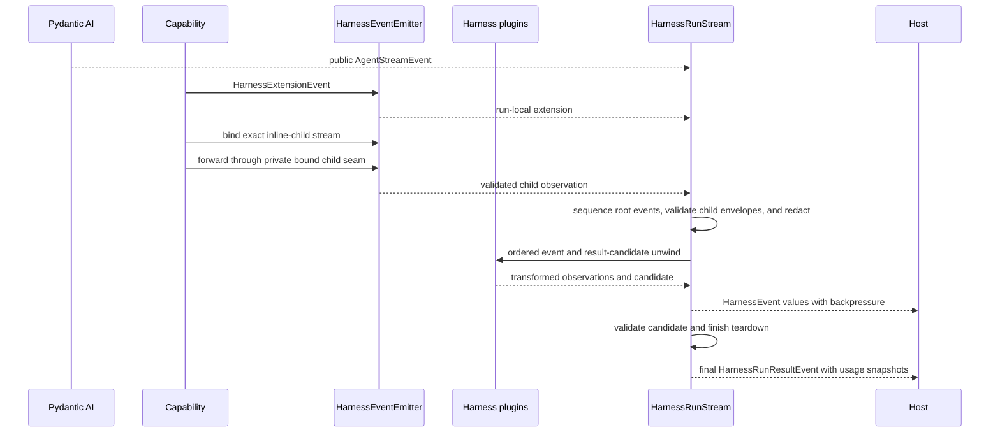

# Events and Usage

## Design Position

`HarnessEvent` and `HarnessRunResultEvent` are stable process-local output seams. `AbstractCapability[AgentContext]` adapters produce Harness-owned observations, ordered Harness plugin middleware can transform or suppress non-terminal events and replace the complete result candidate, and one single-consumer `HarnessRunStream` preserves ordering and produces a terminal result event only after final validation and complete run-scoped teardown succeed.

Pydantic AI public events remain the source for model output and tool execution, and `RunCancelled` is the source terminal signal for native cancellation. The Harness adds only bounded model-request boundary observations plus correlation, context, state, recovery, managed-invocation, delegation, usage-attribution, and diagnostic events that Pydantic AI does not own. Pydantic AI `RequestUsage`, `RunUsage`, and `UsageLimits` remain authoritative for model-request usage, accumulation, and supported limits. When semantic recovery starts another `ModelAttempt`, events already delivered by the earlier attempt remain observations in the same logical Harness stream and cannot be retracted.

Durable event delivery, cross-run usage aggregation, authoritative financial valuation, billing, and lifecycle facts belong to the Host. The Harness provides default-on deterministic process-local model-cost valuation for run usage; it does not make that quote durable accounting authority. [Harness Observation](19-observation-model.md) separately owns the OpenTelemetry hierarchy, fields, information boundary, and Host export profiles; telemetry never replaces this event or usage contract.

Event behavior inside model, node, or tool execution uses Pydantic Capability hooks with `RunContext[AgentContext]`. A first-class Harness plugin can observe the outer canonical stream and result through `wrap_run`, but it does not install a background event broker, second public stream, usage accumulator, durable log, or broadcast system.

## Boundary

The Harness does not define Host lifecycle events, a broker, SSE, webhook, durable replay, cross-process delivery guarantees, a telemetry backend, a universal resource taxonomy, a durable usage sink, a live or authoritative pricing service, invoices, or payment. It does package one immutable pricing catalog for deterministic process-local valuation as defined below. OpenTelemetry ownership and exporter failure are defined by [Harness Observation](19-observation-model.md#sampling-export-and-lifecycle-failure).

## Event Model

```python
@runtime_checkable
class AgentStreamEventProtocol(Protocol):
    @property
    def event_kind(self) -> str: ...


class HarnessEvent(BaseModel):
    thread_id: str
    run_id: str
    sequence: int
    occurred_at: datetime
    event: (
        AgentStreamEvent
        | AgentStreamEventProtocol
        | HarnessExtensionEvent
    )
```

`AgentStreamEvent` remains the precise authoring type for the installed Pydantic AI release. `AgentStreamEventProtocol` is the minimal open runtime seam for native events added by later compatible releases and trusted plugin transformations: an event exposes one non-blank string `event_kind`, while its concrete type and payload remain owned by its producer. The Harness does not snapshot or reconstruct Pydantic AI's event union at plugin response boundaries. Process-local acceptance does not assert that an arbitrary payload is serializable by every Host transport. Harness-owned `HarnessExtensionEvent` values remain subject to their complete schema, redaction, finite-JSON, and payload-size validation after plugin unwind.

`thread_id` identifies the independently advancing Thread; `run_id` identifies the process-local Harness Run. Both are present on ordinary and terminal events, including failures that have no returned State. `sequence` is strictly increasing within one Run. The root Run's sequence includes the final `HarnessRunResultEvent`. Resume preserves `thread_id` while starting another `run_id` and sequence domain. Forwarded inline-child events retain the child's run ID and sequence; the Delegation Capability consumes the child's result event internally. Concurrent runs have causal correlation through their `AgentInstanceContext`; timestamps do not establish a total order.

```python
class HarnessExtensionEvent(BaseModel):
    schema_version: str
    kind: Literal[
        "context",
        "state",
        "recovery",
        "invocation",
        "delegation",
        "usage",
        "lifecycle",
        "tool",
        "diagnostic",
    ]
    payload: JsonValue
```

Extension payloads are small discriminated schemas owned by their subsystem. First-party producers construct a frozen typed Pydantic payload and pass only `model_dump(mode="json")` output to the open envelope; they do not assemble payload dictionaries ad hoc. The event envelope does not duplicate definition, lineage, policy, or host lifecycle fields already available from run context. [`Public API and Packaging`](14-public-api-and-packaging.md) owns `HarnessRunResultEvent` and the `HarnessStreamEvent` union.

## Adaptation



Model output, tool, and Capability events preserve their public Pydantic AI types. This includes native `ThinkingPart`, `TextPart`, function-tool call and result events, `DeferredToolRequestsEvent`, `DeferredToolResultsEvent`, and `CapabilityEvent`, plus compatible typed event families that Pydantic AI adds to its public stream. A Capability value emitted through native `RunContext.emit()` therefore reaches the Harness stream with upstream Capability and Tool-call correlation intact; it is not migrated into or duplicated as a `HarnessExtensionEvent`. For these open Agent events, plugin unwind performs only the shallow `AgentStreamEventProtocol` check; it does not apply a second Pydantic schema validation to events already produced or transformed inside the trusted process. Harness extension events retain their separate Harness-owned validation. The Harness observes the public `ModelRequestNode` boundary but does not recreate provider transport, response-delta, thinking, generation, tool, client-call, Capability, or run-terminal lifecycle state machines and does not add a second `DEFERRED_TOOLS` control event. A transport can project a convenience client-tools payload, but only the terminal `HarnessRunResult.deferred` and a Host's accepted durable pending record have continuation meaning. High-frequency Pydantic deltas may be coalesced by a consumer without changing complete messages or `HarnessState`.

### Tool Review Results

The shared review gate emits `HarnessExtensionEvent(kind="tool")` with payload `type="tool_review_result"`, `tool_id`, and `tool_call_id`. On `status="completed"`, `result` is the redacted JSON `ToolReviewResult`, containing its assessment risk, nullable reason, and provider usage receipts; the separate top-level `decision` is computed by runtime policy. On `status="error"`, `result` is null and `error_code` plus the effective `decision` explain the outcome. Timeout uses `tool_review_timeout` and `deny`. A missing reviewer emits no result. The payload excludes the review request, full arguments, raw provider exceptions, and credentials. Events are observations, not approval grants or proof of tool dispatch.

Within a Run, the built-in reviewer's request is the calling Agent's model usage, like a file-media request: it passes the model-call check, commits a `ModelUsageRecord` with the review's source and tool attribution, is valued by the model-cost Capability, and its result carries no receipts. Every proven receipt of another reviewer, or of the built-in reviewer used outside a Run, is recorded once per actual review through `AgentContext.record_provider_usage()`, including receipts retained after invalid output, failure, or timeout. All reviews, including shell calls, use source `tool.review` and include the stable tool ID and native tool-call ID and feed the existing ledger, reports, terminal usage, and Host accounting. Re-review after resume is another actual review and can incur another receipt. Result-event receipts do not create a second accounting path and consumers must not charge them again. Cancellation does not fabricate usage or a completed result.

### First-party Event Contracts

One code-owned mandatory lifecycle observer emits `lifecycle` payloads at the public Pydantic `ModelRequestNode` boundary. `request_index` is the zero-based node ordinal within the logical Harness run, including internal recovery attempts, and `request_id` is `model-request-{request_index + 1}`. `model_request_started` is emitted before the node handler and includes `message_count`. Successful handler return emits `model_request_completed`; handler failure emits `model_request_failed` with a bounded stable `error_code`. The observation means that Harness entered or left the node boundary; it does not claim that a provider accepted, transmitted, or generated bytes. Raw exceptions and provider error bodies are excluded.

The Compaction Capability emits one `context_snapshot` before an eligible ordinary model request only when the required latest provider-reported usage and effective threshold can be resolved. It contains `request_index`, `request_tokens`, and `trigger_tokens`; `request_tokens` is the latest response's input-plus-output token count, while `trigger_tokens` is either the explicit absolute policy or the current context window multiplied by the effective ratio. Exact deferred/provider-suspended boundaries and histories without the required usage or context window emit no snapshot. One eligible request emits at most one snapshot. The values are observations of provider accounting and current policy, not an estimate of the next outgoing request or a guarantee that the provider will accept it.

The File Memory Capability emits one `memory_context` payload when it delivers memory context at a run's first input. `memories` has one entry per mount in mount order with `memory`, `context` (`full`, `changes`, `unchanged`, or `unavailable`), and, except for `unavailable`, the delivered block's `bytes`. It carries no memory content. [File Memory](21-file-memory.md#context-projection-and-cursors) owns when context is delivered.

Handoff and compaction have disjoint event lifecycles:

| Operation  | Event sequence                                                                      |
| ---------- | ----------------------------------------------------------------------------------- |
| Handoff    | `handoff_started`, `handoff_prepared`, then `handoff_completed` or `handoff_failed` |
| Compaction | `compaction_started`, then `compaction_completed` or `compaction_failed`            |

Each payload contains one concise kind-prefixed `operation_id`. A normal `summarize` call persists its handoff ID and prepared summary across model boundaries and continuation runs. Compaction creates a run-local operation ID after its provider-usage threshold succeeds; it neither uses Handoff state nor emits `compaction_prepared`.

`handoff_prepared` is emitted only after the validated summary is durably written to Handoff Capability state and includes only `summary_size` and `files_count`, never summary or file content. `handoff_completed` follows successful restored-history construction and durable pending-state clearing. `compaction_completed` follows successful plain-text nested execution and construction of the replacement history. `*_failed` contains only `failed_phase`, stable `error_code`, and `retryable`; raw exceptions are excluded. Handoff retains or clears pending state according to its retryability contract. Compaction has no pending durable operation: ordinary failure is non-retryable for that boundary, emits `compaction_failed`, and leaves the original history active. Cancellation and authoritative model-call refusal propagate without being reclassified as optional compaction failure. Compaction emits only `compaction_*`, never duplicate `handoff_*` observations.

Successful compaction also emits one native `CompactionSummaryEvent` (`event_kind="capability"`, `kind="a13n.context.compaction_summary"`) through `RunContext.emit()`. Its `operation_id` matches the lifecycle extensions, and `summary` contains the complete generated text used in the replacement history. It is a content-bearing Capability event, not a content-free Harness extension, assistant answer, telemetry attribute, or committed Host checkpoint. Failed or cancelled compaction emits no summary event. Hosts handle its sensitivity, retention, and display just as they do other native content events; normal trace-content settings remain independent. Lifecycle metadata stays bounded and content-free.

Working State emits bounded versioned committed deltas rather than snapshots. A `state` payload with `type="task_changed"` contains one `operation_id`, authoritative `task_state_version`, reason `created`, `updated`, `claimed`, `completed`, `dependency_updated`, or `provider_observed`, and one task projection containing only `id`, `version`, `subject`, `active_form`, `status`, `owner`, `blocks`, and `blocked_by`. Description, metadata, notes, and the full task map are excluded. Emission occurs only after authoritative persistence and the run's in-memory view both commit. One mutation that changes reciprocal dependency tasks emits one delta per changed task with the same operation ID and task-state version. Failed and semantic no-op mutations emit nothing. A provider without a watch API guarantees observations only at Harness mutation and read boundaries.

Inline delegation emits typed `inline_delegation` payloads with action `started`, `completed`, or `failed`. Every action carries the same invocation ID, compact child instance ID, selected subagent name, bounded status, parent run and Agent-instance correlation, optional originating parent tool-call ID, and the child run ID whenever a child stream was created. `started` is emitted on the child run before child model work so it is forwarded in real time; terminal actions are emitted on the parent run after the complete child result or dispatch failure is classified. Uniform payload correlation, rather than envelope order or subagent-name matching, joins those observations. A pre-stream rejection has no child run ID and never fabricates one.

Each `usage_report` is likewise a typed payload containing its stable report ID, reporting reason, optional trigger record ID, valid chunk position and count, and one non-empty bounded record batch. Record schemas remain owned by the usage subsystem. First-party delegation and usage producers do not assemble free-form payload dictionaries.

A `tool` extension carries one typed `tool_extra` payload with the native `tool_call_id`, declared `tool_name`, stable Harness `tool_id`, namespaced event `name`, and bounded JSON `value`. `emit_tool_event()` derives native call correlation from `RunContext`, accepts a typed Pydantic value, and emits through the run-local canonical event path. Tool extra events describe semantic observations owned by the Toolset; they do not duplicate native call start, arguments, result, authorization, retry, or terminal lifecycle.

The first Tool extra contract is `filesystem.changed`. Its value contains one to 256 confirmed logical-path changes with action `created`, `modified`, `written`, `deleted`, `moved`, or `copied`; move and copy entries include exactly one logical destination. `written` reports a successful provider-neutral upsert or append when the FileOperator result does not distinguish creation from replacement; the Harness does not add a read-before-write race merely to guess a narrower action. A mutating file Tool emits at most one `filesystem.changed` extension after successful provider confirmation. Batch events include only successful items, and failed items, rejected calls, semantic no-ops, and forced deletion of an already absent path produce no change entry. Values exclude file contents, replacement strings, diffs, provider-native paths, receipts, and revisions.

Content-bearing Tool observations remain native `CapabilityEvent` values, separate from the bounded content-free extensions:

- `FileEditAppliedEvent` (`filesystem.edit_applied`) carries the logical `file_path` and actual `before`/`after` text after a successful exact edit or atomic multi-edit. Native envelope fields retain Tool-call correlation. An empty `before` represents creation of a file. Failed batches and semantic no-ops emit no applied-content event. Tool response fields and event content derive from the same completed operation result; observation does not perform a second filesystem read or infer effects from arguments.
- `HandoffSummaryEvent` (`a13n.context.handoff_summary`) carries `operation_id`, the persisted `summary`, and logical `files` after preparation succeeds. It describes accepted content awaiting the next eligible model boundary, not completed application. The existing handoff lifecycle distinguishes those states.
- `ShellStatusEvent` (`a13n.shell.status`) carries an optional Run-local `process_id`, native `phase`, optional `exit_code`, and `callback` flag. Foreground completion and process start/output observations emit observed status. The non-consuming completion watcher emits one advisory callback only while a native Run attempt remains attached; output still requires an explicitly authorized tool observation. It neither reconnects a process nor fabricates success from a wake notice.

Harness-owned asynchronous subagent and background-process readiness notices retain their native user-role enqueue semantics but carry `a13n.steering-source` on their `TextContent` metadata, with values `async_subagent` or `background_process`. This presentation provenance survives ordinary input projection, allowing clients to distinguish activity notices from authored user submissions without matching message text. It grants no authority and does not change the notification's model-visible wording or enqueue order.

These event classes are public from `a13n_harness.toolsets.events`. Their payloads contain domain facts rather than preformatted panels or AG-UI types. Native Tool correlation remains owned by `RunContext`, and renderers own interpretation. Event delivery failure never rolls back completed file effects or committed Capability state. These process-local observations retain the backpressure, middleware, redaction, payload-size, and non-durability rules of the enclosing event stream.

Async subagent completion remains Host-operator state rather than a canonical parent `HarnessEvent`; Host observation or wake never mutates an exported parent continuation or completes the original spawn call. Shell-process final-completion readiness is separately Harness-owned while the exact Run remains active. Its non-consuming watcher can enqueue one bounded instruction to call `shell_wait` with the last returned stdout and stderr offsets, carries no output, and is accompanied by the native advisory shell-status callback rather than a durable state projection. Watcher or enqueue failure never changes process truth. [Async Subagent Lifecycle](20-async-components-and-lifecycle.md) and [Environment Integration](08-environment-integration.md#run-local-shell-observations) own their independent lifecycles.

The run-local Environment adapter reads the bound Environment's change journal from sequence zero and emits exactly one bounded Harness `context` extension for every committed mount change, in publication order. Changes committed during `RunInputFactory` remain observable after `AgentContext` and Capabilities bind. Adapter cancellation or emitter/plugin failure can suppress later process-local delivery but cannot consume another reader or roll back a committed mutation. Optional model-facing notification is a separate consumer delivered through native Pydantic enqueue or the next eligible public model-request hook; it can coalesce notices without coalescing Harness events. An enqueued notice remains observable through the ordinary `EnqueuedMessagesEvent`, while mount mutation never depends on event or notice delivery.

`HarnessEventCapability` adapts Pydantic events and emits Harness extensions through the run-local emitter. Extensions cover:

| Kind         | Meaning                                                                                                                                     |
| ------------ | ------------------------------------------------------------------------------------------------------------------------------------------- |
| `context`    | Context contribution, omission, compaction, or successfully committed Environment mount-change observation                                  |
| `state`      | State import or export observation, not durable snapshot status                                                                             |
| `recovery`   | Bounded inner-attempt interruption, backoff, restart, exhaustion, or normalized cancellation observation; never a durable Host retry fact   |
| `invocation` | Managed-tool preparation, authorization, approval, dispatch, retry, result-safety, or unknown-outcome observation; never a grant or receipt |
| `delegation` | Inline child observation inside the canonical Harness stream                                                                                |
| `usage`      | One bounded mixed-source `usage_report` emitted at a model-request or terminal reporting boundary; not durable billing proof                |
| `lifecycle`  | Bounded `ModelRequestNode` entry, completion, or safe failure observation; never provider transport or Host lifecycle authority             |
| `tool`       | Toolset-owned semantic extra observation correlated to one native Tool call; never a duplicate call or result lifecycle                     |
| `diagnostic` | Safe implementation/provider detail without lifecycle authority                                                                             |

### Model Input Observation

Native `ModelInputEvent` (`a13n.context.model_input`) observes new semantic run input once per logical Run and freshly produced model-context overlays. Its ordered `content` uses Pydantic AI's native `UserContent`: strings, `TextContent`, media URLs, `BinaryContent`, `UploadedFile`, and cache markers. Native `TextContent.metadata` and media `vendor_metadata` remain available to embedding Hosts. This in-process event does not flatten media into terminal labels or create a separate input schema. Overlay `TextContent` uses `display: false` and its source ID. Restored history and synthetic handoff or compaction requests are not replayed as new input. Recovery does not repeat already observed semantic input.

Steering application remains the native `EnqueuedMessagesEvent`, containing the delivered objects and enqueue identity. No additional `ModelInputEvent` is manufactured for the same delivery. The [Stream Protocol](../a13n-stream-protocol/00-overview.md#standard-event-conversion) consumes both input sources through one presentation projection, preserving client metadata and media references without serializing binary or inline data-URL payloads. Other embedding Hosts can consume the native content directly. Neither input observation nor delivery asserts model acceptance, checkpoint persistence, or authorization.

## Run Stream and Content

```python
class HarnessEventEmitter(Protocol):
    async def emit(
        self,
        event: HarnessExtensionEvent,
    ) -> None: ...
```

The Harness creates one emitter for each process-local run and places only its `emit()` surface on `AgentContext` for Capability authors. `emit()` creates a run-local extension event and assigns its envelope fields. Inline delegation uses a private Harness-owned child-forwarding seam bound to one exact parent and child stream; arbitrary Capability or plugin code cannot submit a foreign child envelope through the public emitter. The seam preserves child Thread, Run, and source sequence, validates nested descendant registration and monotonic sequence, and seals that provenance through plugin processing. Plugins may transform or suppress the child event payload but cannot change its child correlation or source sequence. The emitter feeds the same ordered internal path as adapted Pydantic events. Harness plugin middleware sees those values before public delivery; already delivered values cannot be retracted. The emitter is not supplied by the Host and is not a general delivery service.

`HarnessRunStream` is class-based, lazily starts on first iteration, has exactly one consumer, and applies natural backpressure. It provides no replay or fan-out. An embedded application consumes it directly. A hosted worker consumes it once and projects events to any broker, SSE connection, WebSocket, log, or durable store selected by the host. a13n Service's [run facts, display and thread stream](../a13n-service/07-facts-and-delivery.md) are a separate Host contract: each checkpoint commit writes a display folded from the streamed events, and the thread stream carries only the in-flight tail, so not every process-local delta becomes durable.

Leaving the stream context before its terminal item cancels and drains the process-local run. A host that wants execution speed to be independent of a downstream client consumes the Harness stream into its own bounded delivery mechanism rather than asking the Harness to buffer unbounded events.

The harness redacts extension payloads before emission. Credentials, grants, transient prompt overlays, quarantined content, and provider-native secret fields are absent. Prompt, argument, and result bodies are excluded by default and included only under explicit content policy.

A state event or terminal `HarnessRunResultEvent` remains a process-local observation. Plugin middleware can replace a candidate but cannot grant Host durability, forge external side-effect evidence, or retract prior events. The result event is emitted only after final candidate validation and run-scoped teardown succeed, but it is still not a committed host lifecycle transition or durable checkpoint. Teardown failure raises `RunCleanupError` with any frozen primary outcome and produces no terminal event.

## Observation Boundary

[Harness Observation](19-observation-model.md) owns OpenTelemetry configuration, span ownership and hierarchy, trace and Thread correlation, the `a13n.*` registry, Langfuse and Logfire Host profiles, content boundaries, and exporter-failure semantics. Events and usage records remain independent process-local projections; one is never reconstructed from the other.

## Run Usage

Pydantic AI `RunUsage` remains the sole process-local accumulator for model requests, tokens, best-effort model cost, tool-call count, and native `UsageLimits`. The Harness adds a run-local append-only attribution ledger, not a second accumulator. Its immutable `UsageRecord` union preserves where independently produced usage came from:

- `ModelUsageRecord` captures one model response proven to have entered native `RunUsage`, including bounded request usage, model/provider attribution, response state, lineage, and pricing coverage;
- `ProviderUsageRecord` captures a stable provider receipt contributed by a managed tool or Capability, with provider-neutral measures and optional currency-denominated cost.

Provider records do not modify model token totals or native limits. Capability-owned paths record them through `AgentContext.record_provider_usage()`; raw provider metadata, credentials, content, and private provider enums are not part of the contract. Dedicated file media-understanding Agents invoked by `view` contribute one `ModelUsageRecord` per committed response to the calling Agent's ledger, with source `files.media_understanding`, tool ID `filesystem.view`, and the native tool-call ID. They retain independent native `RunUsage` and limits: auxiliary work never increments the calling Agent's native accumulator. They inherit its frozen effective model-cost policy and value each response before accumulation, including output retries; pricing is never applied to a retry-aggregated token total. Known responses remain in the ledger through failure, timeout, or external cancellation; cancellation keeps ordinary async semantics. No provider receipt duplicates those model contributions. Standalone media providers outside a Harness usage scope retain provider receipts, including known USD cost even when only cost is reported. Third-party media provider receipts remain provider-neutral and are not guessed into model records. Reusing the same provider/product/usage ID is idempotent, while conflicting semantic usage or attribution fails closed.

### Model Invocation Checks and Identity

`RunBindings.model_call_check` is an optional borrowed `ModelCallCheck` collaborator. Harness allocates a fresh `call_`-prefixed identity after native request preparation and selection, then awaits `check(ModelCall)` before entering the innermost native model-request handler. The frozen content-free value carries the call ID, Harness and native run IDs, agent/parent/delegation IDs, selected model ID when available, model/provider names, invocation source, and optional tool correlation. It carries no messages, arguments, credentials, response or Host policy. Embedded callers can omit the check; allocation still occurs.

Returning permits that invocation. Exceptions and Host-owned deadlines become `ModelCallCheckError` (`model_call_check_failed`); a borrowed callback's self-cancellation is also refusal. External task cancellation retains ordinary cancellation semantics. Built-in compaction and model-backed review cannot soften this failure into optional auxiliary failure. Inline children inherit the collaborator unchanged, including when a Host supplies their other bindings. Compaction and built-in file-media requests use it with their existing calling-agent/source attribution and independent native usage. The built-in reviewer has one native request; within a Run it is committed like a file-media request, and used outside a Run it reuses its opaque provider receipt `usage_id` for the invocation identity. Its request carries `ToolReviewConfig.model` as the selected model ID, and a file-media request carries the ID its Host names for that kind in `AgentMediaUnderstandingProvider(model_ids=...)`, so a Host that selects its Models by ID can tell each call's Model even when two share an upstream model name. Custom external collaborators own calls outside these supported native paths.

The boundary is one invocation of the selected native Model handler, not one physical HTTP request. Output retries and semantic recovery receive fresh identities. Internal fallback alternatives, continuation segments and hidden SDK retries can occur inside that invocation. Native streaming can open a lazy handler without consuming its provider stream; an allocated ID or successful check alone is not proof that a provider was called. Hosts must qualify the selected wrapper's authorized resource scope and cannot assume that a check identifies every hidden alternative.

`ModelUsageRecord.call_id` is optional, defaulting to `None`: a nonempty string of at most 128 characters correlates a model-handler invocation with its usage. `None` means no known dispatch correlation, not proof that no dispatch occurred. This identity is neither an individual HTTP request ID, an upstream request ID, nor an exactly-once billing operation. A newly committed dispatched response carries its actual pre-dispatch identity while existing `record_id`, committed-response `response_ordinal`, native `model_run_id`, lineage and local-ledger semantics remain unchanged. When an outer wrapper invokes its handler repeatedly and returns an earlier response, correlation follows that response, not the last invocation. A copied response retaining the same native usage object can retain that association when unambiguous; a synthetic/reconstructed response without that provenance has no call identity. Per-node correlation is bounded by the 10,000-invocation capacity; overflow stops dispatch with `usage_capacity_exceeded`. No extra transport accounting ledger is created.

A pre-dispatch refusal invokes no provider and invents no native usage. Once dispatched, native continuation may commit an empty interrupted response even before the first provider yield; preserve its request count, call identity and actually observed usage. Such a record is not proof of a charge: missing tokens and unknown/not-reached pricing are not replaced with fabricated cost. Interrupted partial usage and retry-producing commits retain their existing evidence. A synthesized response that native accounting commits can have a model record with `call_id=None`; historical presence alone still creates no new usage.

### Reporting Boundary

Every committed model request is a reporting boundary. After recording that request, the mandatory Usage Capability emits bounded `usage_report` extensions containing every record not included in an earlier report, including mixed provider usage produced since the previous boundary. Large batches may be split into deterministic chunks. A terminal flush reports provider records produced after the final model request, and `HarnessRunResult.usage_records` contains a detached complete run-local snapshot.

Model attribution has independent axes: actual response provider/model, calling Agent lineage, and invocation source. Primary responses default to source `agent`; auxiliary source does not change root/subagent ownership. Optional tool attribution is absent on ordinary responses. Current ordinary records use source `agent` with no tool attribution; unavailable pricing provenance is unknown/not-reached. Historical costs are never backfilled from current prices.

Report and record identities are stable for delivery retry and deduplication. Model identity is run-and-ordinal based; provider receipt identity is stable across Harness runs. Reports are process-local observations, not proof of durable ingestion or financial settlement. A Host consumes the canonical stream once and owns persistence, retry, cross-run aggregation, reconciliation, and billing.

The model commit observer uses public Pydantic node, message, and usage boundaries. Normal responses, handled interrupted partial responses, retry-producing requests, and requests that commit before a usage-limit failure remain attributable. Imported history, enqueued or synthetic responses, and history-only processing are not attributed merely because a `ModelResponse` is present.

### Cost Calculation

Model-cost valuation is a default-on build-time Capability role. Every built Agent contains exactly one `AbstractModelCostCapability` alongside the mandatory `UsageCapability`. If build code supplies no implementation, `HarnessBuilder` inserts `CatalogModelCostCapability`; one code-first custom subclass atomically replaces that default; more than one fails with `DefinitionError`. `NoModelCostCapability` is the explicit opt-out and preserves raw provider or upstream-library cost without Harness valuation. Model-cost Capabilities cannot enter through `RunBindings`, plugin contributions, or declarative Capability reconstruction.

`CatalogModelCostCapability` freezes one immutable `PricingCatalog` at construction. `get_default_pricing_catalog()` always normalizes the package's bundled `genai-prices` data and then applies the Harness packaged overlay, independently of process-global updates. `get_current_pricing_catalog()` captures the current upstream snapshot without network I/O. A valid upstream custom or downloaded snapshot replaces matching complete entries in the bundled catalog; missing models and fallback model aliases remain available from bundled data. Downloaded prices therefore take precedence over packaged supplements rather than being permanently hidden by them. Entries are keyed by `provider:model`; every `ModelPricingEntry` contains context window, ordered price rules, tiered price components, constraints, source metadata, and revision.

The default Capability and `HarnessBuilder.build()` automatically use the current catalog. One public build captures one catalog for default valuation across the recursively built graph. `build(pricing_catalog=...)` pins an explicitly supplied snapshot instead; an authored model-cost Capability, including `NoModelCostCapability`, still takes precedence. A later build observes successfully refreshed prices without process restart or caller-managed cache invalidation. Already built Agents retain their pricing snapshots across runs; updating prices never mutates an active execution, inline subtree, or emitted usage record.

`get_current_pricing_catalog()` validates a complete candidate before publishing it. Conversion failure or a snapshot with no usable prices retains the last valid catalog, or the bundled catalog before the first successful update, with diagnostics rather than failing Agent construction. Unchanged upstream snapshots reuse the current normalized catalog. An explicit upstream reset to bundled data also resets current selection. Catalog revisions identify immutable effective pricing content and stable provenance; download timestamps do not change revision identity. The catalog is not a persistent price history.

`PricingCatalog.with_updates()` and `CatalogModelCostCapability(pricing_updates=...)` use shallow dictionary-update semantics: each supplied value is a complete validated `ModelPricingEntry` replacement, never a recursive merge. Explicit Host updates take precedence over both downloaded data and packaged supplements. A Host owns the upstream updater's process lifetime, enablement, network policy, and shutdown. Harness import, construction, and valuation never start a downloader. Async Hosts obtain the current catalog off the event loop and pass it at build time. Disabling or stopping an updater does not clear prices already published by another or earlier updater in the process; explicitly pinning the bundled catalog supplies deterministic offline valuation.

On the normal model-response path, the selected Capability receives content-free `ModelCostInput`, returns an optional `ModelCostQuote`, and a finite non-negative USD quote replaces provider-populated cost before native accumulation. Decline, invalid output, lookup miss, or failure falls back without failing the Agent run. The resulting model record names the selected pricing revision, rule and actual cost source, and whether Harness pricing was applied, declined, failed, disabled, or not reached. The default catalog preserves `genai-prices` usage-dimension, tier, start-date, and recurring UTC time-window semantics; request-start time selects conditional pricing.

Pricing input includes the optional original selected model ID from the native request context, alongside response model/provider identity, safe provider URL when available, request-start and response timestamps, and a copy of request usage with cost cleared. The selected ID can differ from an upstream alias and is absent for direct Model instances or when a hook invalidates selection. A compaction request keeps the selection of the request it precedes, and built-in review and file-media requests carry the IDs described under the model-call check. `TokenPricingCapability` selects, by that ID, a complete `ModelPricingEntry`, allowing one inherited policy to price different child models independently. An entry is valued as the catalog values it, and prices the selected Model's requests whatever provider and model it names. Prompt and response content, credentials, and arbitrary provider payloads are excluded. Live price refresh, currency conversion, negotiated discounts, invoices, and settlement remain Host concerns. Interrupted or short-circuited paths that bypass valuation retain the cost actually available and are not retroactively rewritten.

### Delegation, Resume, and Limits

Inline children use independent `RunUsage` accumulators and inherit the parent's effective build-time model-cost Capability for the complete inline tree. The propagation is an internal trusted binding, not a Host-selectable `RunBindings` override; a child definition's own Capability remains its policy when that Agent runs independently. Children retain child-correlated attribution records. Their effective limits intersect only their own definition and authored child edge, not the parent's budget. Both `HarnessRunResult.usage` and `HarnessRunResult.usage_records` cover the local logical Run only, excluding descendants. Internal ModelAttempts share that Run's accumulator; neither inline nor async delegation establishes a default tree-wide budget. Child records remain observable as child-correlated `usage_report` events and are not copied into the parent's local ledger or priced again. A Host that needs a tree-wide attribution view joins those immutable records by run lineage and stable record identity. Host-managed asynchronous children and later or resumed root runs normally use fresh accumulators and ledgers.

Neither `RunUsage`, the attribution ledger, provider receipts, a pricing catalog, nor a model-cost Capability enters `HarnessState`. Imported messages remain historical, so a resumed run reports only newly committed usage. Repeated terminal cumulative `RunUsage` snapshots of the same Run can overlap and are never summed as independent contributions; durable projections use immutable usage records instead.

## Failure Boundary

Missing provider usage is not fabricated. A handled failed, suspended, or cancelled result candidate snapshots the usage known at its outcome boundary; it becomes a delivered result only after run-scoped teardown succeeds. Pydantic AI `UsageLimitExceeded` is normalized as `status="failed"` with `SafeFailure.code="usage_limit_exceeded"`, `retry_hint="dependency_change"`, bounded normalized limit details, the terminal usage snapshot, and any latest complete state. Its output and deferred fields are absent. For inline delegation, the default `SubagentCapability()` projects that failed child result through `pydantic_ai.exceptions.ToolFailed` with sanitized bounded content. External consumer cancellation still raises with ordinary async semantics; teardown does not invent usage. Consumer cancellation and early context exit follow the run-stream cleanup contract. OTel failure remains diagnostic.

Event delivery outside the process is a projection made by the single Harness stream consumer. A `CheckpointCapability` publishes an exported checkpoint candidate through its `CheckpointStore`; it never becomes authority for live `AgentContextState` or mutates another Capability's state.

## Compatibility

The event envelope and extension-event schemas evolve independently. Pydantic event and usage changes remain visible through the supported public types. Usage reports retain `schema_version="1"`; the optional nested model-record `call_id` is an additive correlation field. Records without it remain readable without a migration. Package dependency bounds track required APIs independently of extension schema versions.

## Trade-offs

- Passing through Pydantic events avoids a second model/tool vocabulary, while consumers must understand the supported public event union.
- A single-consumer stream gives bounded lifecycle and backpressure semantics, while hosts perform any replay or fan-out.
- Minimal harness extensions preserve cohesion but leave durable lifecycle projection to the host.
- Native `RunUsage` keeps upstream accumulation and limit semantics, while the attribution ledger preserves mixed-source facts for Host-owned persistence and reconciliation.

## Invariants

01. One event sequence belongs to one process-local run; each Harness-handled root outcome whose teardown succeeds ends with exactly one result event, while early exit, external cancellation, cleanup failure, and unhandled errors do not synthesize one.
02. Forwarded inline-child events preserve child correlation and never grant child result or control authority to the outer consumer.
03. Each `HarnessRunStream` has one consumer; replay and fan-out belong to the host.
04. Model-, node-, and tool-level event extensions are `AbstractCapability[AgentContext]` implementations; outer stream/result transforms are ordered Harness plugins.
05. Pydantic public events remain authoritative for model/tool event shape.
06. Harness events and OTel are not host lifecycle authority.
07. `RunUsage` is the only process-local usage accumulator; the Harness result stores a terminal copy.
08. Every built Agent has exactly one build-time `AbstractModelCostCapability`; it overrides a normally committed response only with a finite non-negative quote, while decline and failure fall back without failing the run and bypassed paths are reported as `not_reached` rather than falsely attributed.
09. Each proven native model or handled-partial commit creates one stable model record and flushes all pending mixed records in bounded reports; enqueue, imported history, and history processing cannot create model records merely by placing a response in messages.
10. Provider receipt identity is stable and idempotent; provider usage does not alter native model totals or limits, and conflicting receipt reuse fails closed.
11. Inline descendants use independent native accumulators and inherit the root run's effective model-cost Capability while retaining child-correlated records; Host-managed asynchronous children and later runs use their independently built policy, fresh accumulators, and fresh ledgers.
12. Imported message history never becomes new usage for a resumed run, and no usage accumulator, ledger, provider receipt, pricing catalog, or model-cost Capability enters `HarnessState` or `AgentContextState`.
13. Sensitive and transient content is absent from pricing input, usage records, and default events; the separate Observation contract distinguishes safe Harness-authored fields from telemetry-visible upstream Pydantic structural and exception fields.
