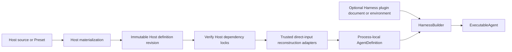
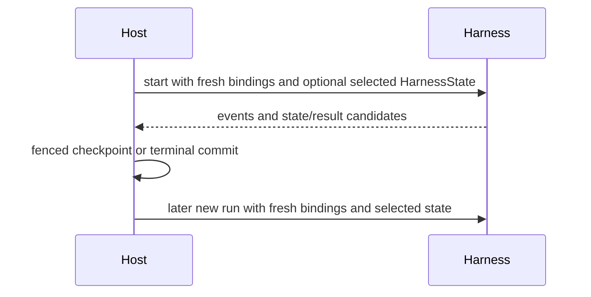

# Harness Hosting Contract

## Design Position

Embedded applications and hosted execution workers use the same code-first Harness API. The Harness does not expose a separate hosted Agent format. A hosted service owns durable Agent definition schemas, Presets, immutable revisions, dependency locks, and reconstruction adapters; the worker reconstructs one process-local `AgentDefinition` and calls `HarnessBuilder`. Plugin middleware may instead use the narrow Harness-owned configuration document and Build Context, so the Host need not expose or implement plugin factory concepts.

The Host also owns durable acceptance, durable execution attempts, leases, checkpoint selection, deferred delivery, recovery, and terminal commit. The Harness returns only process-local observations and state candidates. a13n Service's concrete use of these generic surfaces is owned by [Runs](../a13n-service/05-runs.md). In Service, durable work is a run and one replaceable worker lease of it is an attempt; these are Host resources, not Harness types.

## Boundary

| Concern                                                    | Host                                          | Harness                                             |
| ---------------------------------------------------------- | --------------------------------------------- | --------------------------------------------------- |
| Authoring schema, Presets, revision, locks                 | Owns                                          | No durable schema                                   |
| Trusted direct Python object reconstruction                | Owns                                          | Validates process-local composition                 |
| Optional plugin configuration/loading                      | Persists or supplies deployment input         | Owns document, loading, and application             |
| Agent Identity and provider policy                         | Issues/evaluates                              | Carries through fresh bindings                      |
| Environment Providers, configuration, and current state    | Selects and owns durable lifecycle behavior   | Never discovers or persists them                    |
| Environment and model resolution                           | Supplies fresh adapters, resolver, and policy | Enters, routes, snapshots, and closes Run scope     |
| OAuth Model credentials                                    | Owns durable source and authorization         | Owns process-local refresh and request behavior     |
| Agent loop and outer middleware                            | Delegates                                     | Owns process-locally                                |
| Internal `ModelAttempt` values                             | Observes one logical run                      | Owns bounded recovery                               |
| Worker crash and durable replay                            | Owns                                          | Exports portable state only                         |
| Durable completion and delivery                            | Owns                                          | Returns a candidate                                 |
| Observation providers, signal policy, and export lifecycle | Owns                                          | Uses independently selected providers when supplied |

## Definition Mapping

The Host revision stores only Host-owned serializable values and exact dependencies. It can include logical model IDs, concrete Harness model characteristics, concrete native model settings, plugin/provider configuration, tool declarations, output schema, and artifact locks under Host-owned schemas. A Host authoring surface may accept Harness or deployment-specific aliases in either model plane, but it resolves them before revision materialization; the immutable revision and worker adapter never receive alias names. The revision does not store a Harness compiler document, alias catalog, Python class, plugin instance, Model, Toolset, Capability, callable, credential, or live client.

At execution time trusted installed adapters create:

- native `AgentSpec` containing only concrete `HarnessModelCharacteristics`, concrete native `ModelSettings`, and, for code-first output, a process-local `OutputSpec`;
- optional Model or logical model name;
- Agent-bound Capabilities that own all function tools, Toolsets, guidance, settings, and hooks;
- an optional stable `SubagentOperator` passed to a definition-selected async `SubagentCapability`;
- optional direct concrete Harness plugin instances;
- self-healing and semantic recovery policy.

An async subagent operator is a trusted process-local interface object, not persisted Agent content or a Toolset contribution. The Capability fixes the model-visible subagent mode and Toolset when the definition is reconstructed. The operator receives explicit current-run correlation on each call and owns canonical child work without storing mutable current-run authority in the reusable Capability. Shell processes need no Host operator and remain inside the exact entered Run Environment.

Configured plugin instances are created by `HarnessBuilder` from an explicit `HarnessBuildContext` or the ambient source. The deployment switch remains false by default, while a trusted create-and-run or create-and-stream Host path can pass `configured_plugins_enabled=True` when constructing that operation's executable. They need not be reconstructed by a Host adapter, and the choice cannot change after Agent construction.

A declarative object JSON Schema remains in native `AgentSpec.output_schema` and is the build-time output source when no process-local `OutputSpec` is supplied. The worker never changes output type per run.

The resulting value is an ordinary `AgentDefinition`. An operator may pass an explicit Harness Build Context from the Harness plugin document or opt deployment environment loading in. The builder imports only enabled `a13n_harness.plugins` keys, creates fresh instances for each root and nested definition, and merges them after direct plugins. Entry-point availability never grants trust, and configuration identifies a key rather than an import target. The Harness does not verify Host artifact digests or inspect Preset provenance.

## Run Mapping

For each logical run the Host can construct `RunBindings` with:

- the trusted `AgentInstanceContext`;
- an optional fresh `RunModelResolver`;
- an optional awaited `ModelCallCheck` for current authority and admission before native invocation;
- optional model-context middleware;
- an optional [state store](10-snapshot-and-resume.md#host-state-store) for large content and retained inline child states;
- fresh run Capabilities required by definition-selected features;
- bounded non-authoritative metadata.

An embedded caller can omit `RunBindings`; Harness creates fresh embedded bindings. Environment selection is independent from the remaining bindings: the caller passes one already constructed `Environment` or `EnvironmentMount` through `environment=`, or a named mapping through `environments=`. Provider keys, specifications, Provider objects, state envelopes, and lifecycle policy are not Harness Run inputs.

The Host supplies `AgentInstanceRef` as workload identity and policy correlation. Thread identity is independent: for new history the Host may construct `HarnessState.new(thread_id=...)` with its validated ID, or Harness generates one when no State is supplied. Harness restores the State-owned ID into fresh `AgentContext`. A new Harness run or durable execution attempt changes transient run correlation but does not change that ID. A Host creates a separately identified branch only through `HarnessState.fork(thread_id=...)`, which derives an ID when the Host omits one; fresh bindings cannot retarget State.

Harness enters the complete initial adapter mapping before input production and exposes one stable internal bound facade for the logical Run. A trusted Run integration can apply linearizable mount, replace, unmount, or default-selection changes through a controller bound to that exact Run. The controller is never placed in metadata, `AgentContext`, a Capability namespace, model tools, or durable records; it rejects calls after the terminal fence and cannot mutate Host durable Environment association.

Provider input validation, catalog selection, inert adapter construction, re-entry state, and backing-target lifecycle use the [Environment Provider contract](08a-environment-providers.md). Provider availability and schema validity never authorize a Run. The Host resolves authoritative `EnvironmentState | None`, constructs one fresh Environment per independent Run, and passes it to Harness. The Host chooses eager or lazy preparation; Harness never calls target `prepare()`, `stop()`, `keepalive()` or `destroy()` directly and its `close()` path is non-destructive. `HarnessState.environment_states` contains portable observations only; it does not become managed Host authority or a `RunBindings` value.

A hosted model integration normally supplies an async callable satisfying `RunModelResolver`; it resolves its own trusted configuration, current policy, credentials, and route selection, then returns a native Model or raises. For a supported OAuth-backed Model, it can implement the [`a13n_harness.providers.model.oauth` credential source](16a-model-authentication.md) over its authorized durable store and use the Harness constructor rather than duplicating provider refresh and request behavior. It reads `ModelResolutionContext.deps.thread_id` and derives or restores provider model-session and prompt-cache affinity from that State-owned value and the selected model/provider namespace. A Session or `AgentInstanceRef` routing key may remain broader, but it cannot replace the prompt-cache key for the root and all children because those Agents own different message histories. The Harness applies no special catalog role validation and, if a Host omits the resolver for a string model, uses Harness `infer_model()` with the builder's optional gateway Provider factory. A fail-closed hosted profile therefore requires its worker adapter to supply and test the resolver; this is a Host invariant, not a different Harness API.

The Host passes optional `HarnessState`, native input or an input factory, an optional native `RunUsage` baseline, and optional `UsageLimits`. Public usage derives from the Context accounting scope rather than that baseline. One logical run can contain several inner `ModelAttempt` values while retaining the same durable Host attempt, bindings, context, Environment, plugins, state coordinator, and accounting scope. The [Context usage snapshot](12-events-observability-and-usage.md#context-usage-snapshot) contract owns explicit same-writer accounting resume and latest-snapshot reporting.

The [model invocation check](12-events-observability-and-usage.md#model-invocation-checks-and-identity) lets the Host bind durable call context to an identity before dispatch, then join committed usage by that identity. The Host owns deadlines, fresh authorization, budgets, fences, price snapshots and persistence. It must not hold a database transaction across the model call. Resolver selection and the content-free check do not qualify a wrapper that can silently use another unauthorized resource; supported model configurations must cover that behavior explicitly. Async child Hosts supply their own fresh checks; inline children inherit the parent's check unchanged.

## State and Resume Mapping

The Host stores and selects `HarnessState`, including its stable Thread ID. For managed Environments, it separately owns desired mounts, current `EnvironmentState | None`, root/child Thread association, runtime-collaborator resolution, cleanup/prune behavior, accepted client-tool pending data, asynchronous child state, delivery ledgers, and durable reconciliation evidence. The specification does not prescribe Host record or link models.

`HarnessState` restores public Pydantic messages and JSON Capability namespaces and carries a direct mount-name-to-`EnvironmentState` mapping. It does not restore desired mounts, current managed state, provider reachability, process authority, or lifecycle authority. A Host may adopt portable Environment values only in an explicit unmanaged/import flow. Plugin objects, Model resolvers, Environment adapters, credential-source objects, credentials, policy, usage, active attempts, and delivery facts are rebuilt. OAuth credential bytes remain exclusively inside the Host source and process-local Model authentication path.

The Harness defines no mandatory model route pin or provider-session schema. If one provider requires an additional durable continuation selector beyond public messages and `thread_id`, the Host and that model integration own it as provider-specific state and associate it with the selected Harness State. It is not a generic Harness recovery condition, and the Host never substitutes a fresh Harness or model-attempt ID for the State-owned ID.

## Recovery Mapping

The Host distinguishes:

- internal Harness `ModelAttempt` values inside one live logical run;
- a new durable execution attempt after process loss, lease loss, or selected recovery.

A new durable Host attempt always creates a new Harness Run with fresh bindings and fresh Environment adapters. It reconstructs desired mounts, resolves current managed state before construction, supplies fresh runtime collaborators, passes the adapters to Harness, and uses only an authoritative selected checkpoint. It does not blindly replay a possible external mutation. Interrupted-tool normalization preserves unknown outcome and tells the next model to inspect current state.

Provider transport retry and Harness Model self-healing do not create durable Host attempt records. Usage observations from all inner `ModelAttempt` values remain in the one logical run accumulator and must not be double-counted with terminal snapshots.

## Deferred and Client-side Tools

Native Pydantic `DeferredToolRequests` end the Harness run as `status="suspended"`. The Host owns durable pending-call/approval records, authentication, external execution, idempotent feedback, and selection of a later continuation state. A continuation starts a new Harness run with that prior state, fresh `RunBindings`, the exact remounted tool surface, and `DeferredToolResume` containing the authoritative pending request plus its complete native results.

External calls and approvals remain distinct. A Host reconstructs exact tool surfaces from its own revision and pending attachment and verifies their identity before resume; those surfaces and the resume envelope are not encoded in `HarnessState`.

## Host Operators

The executable-owned `SubagentCollection` is process-local topology and grants no scheduling authority. `SubagentCapability(async_enabled=True, operator=...)` fixes the standard async Toolset and requires a Host-owned `SubagentOperator`. Before admission, Harness supplies an immutable plan containing the exact built child, derived child Identity, applied context, usage ceilings, and detached parent correlation, plus a separate non-authoritative projection of the originating Pydantic tool-call correlation. Harness does not generate an idempotency identity or define replay scope; the operator owns those choices together with child Thread identity, admission, scheduling, fresh `RunBindings`, Environment association and re-entry, recursive Harness invocation, checkpoints, status, activity, wait and wake, steering, cancellation, linked resume, loss, cleanup, and retention.

Harness supplies no default async manager, execution-store protocol, parent-state mirror, completion observer, or shutdown operation. A successful async spawn is an ordinary tool result, not `DeferredToolRequests`. Completion does not satisfy the original spawn call, mutate an already selected continuation, or itself create another Harness Run. A later Run queries the Host operator using the public execution reference. Parent Run closure neither cancels accepted child work nor closes the operator.

Shell observations follow the separate [Environment contract](08-environment-integration.md#run-local-shell-observations). Harness supplies Run-local references, optional native discovery, explicit-offset observations and best-effort exit hints without a Host process operator. Run close releases observations without blanket termination. Provider state owns recovery of whatever the backend actually retained; a later Run uses fresh references and cannot assume historical output survives.

a13n Service and Harness UI use this ordinary Environment integration. Async subagents retain their independent Host operator.

## Events and Completion

The Host consumes one `HarnessRunStream` and may persist, coalesce, or fan out events. Earlier `ModelAttempt` events remain observations even if a later `ModelAttempt` succeeds. The terminal result determines the logical run outcome.

A normal result becomes durable only through a fenced Host transaction. `RunCleanupError.outcome` is an uncertain candidate and cannot be reported as a clean Harness terminal delivery.

## Observation Integration

The Host independently constructs or auto-configures the OpenTelemetry SDK tracer and meter providers, `Resource`, sampler, span processors, metric readers, exporters, and vendor profiles. It either passes exact provider objects through `HarnessInstrumentation` or configures the global providers before the builder's default environment selection. Tracing is either off or complete and remains independently selectable from standard metrics. The Host owns W3C context extraction and injection, span links for independently scheduled work, trusted processor or collector sanitization, bounded shutdown flush, and process shutdown. The Harness configures no global provider and remains inert when both Harness signals are off or instrumentation is explicitly disabled.

A Host may make one generic OpenTelemetry, Langfuse, or Logfire span current before entering the Harness. The Harness accepts that parent through standard current context only and creates `harness.run` beneath it; no live span or vendor object enters `RunBindings` or another Harness argument. Combined backends retain exactly one Host root and attach multiple processors/exporters to the same provider. If Langfuse does not own that root, its export predicate must retain the root's instrumentation scope.

The builder's default environment selection reads `A13N_HARNESS_TRACE_LEVEL`, `A13N_HARNESS_TRACE_CONTENT`, and `A13N_HARNESS_METRICS` once and selects Host-configured global providers. Explicit provider configuration wins, and explicit `None` disables Observation. The official OpenTelemetry Python distro and exporters may configure those providers and collector targets before application startup; standard `OTEL_*` configuration continues to own SDK/export behavior. Telemetry grouping, including a Langfuse product session, never selects Harness State, provider model session, prompt-cache affinity, durable execution, or delivery. The Host supplies a conforming non-throwing provider stack; the Harness guards its own telemetry boundaries, while a provider that raises through Pydantic-owned instrumentation is trusted Host composition failure rather than an Agent outcome. A fail-closed audit requirement uses a separate Host-owned durable facility. The complete contract belongs to [Harness Observation](19-observation-model.md).

## Embedded Profile

An embedded caller can construct `AgentDefinition` directly or use the `AgentSpec` overload of `HarnessBuilder.build()`, use Harness model inference when no `RunModelResolver` is present, construct Environment adapters through trusted Providers, and keep state in memory or application-selected storage. It follows the same non-destructive Environment lifecycle, plugin, model recovery, result, and cleanup semantics.

## Compatibility

Compatibility is evaluated separately for:

- the Host definition/revision schema;
- trusted reconstruction adapters and installed artifacts;
- the Harness public Python API;
- the selected Pydantic AI public surface;
- Harness and Capability state codecs;
- provider-specific launch/continuation data.

A Host rejects an incompatible revision or adapter before building process-local direct objects. The Harness rejects an incompatible plugin document before importing selected targets and does not turn an unknown Host schema into a generic Python import or fallback configuration.

## Invariants

01. Hosted and embedded callers use the same `AgentDefinition`, builder, bindings, stream, result, and state contracts.
02. Durable Agent schemas and dependency locks belong to the Host; the optional plugin document schema belongs to the Harness even when the Host persists it.
03. Python objects are reconstructed in-process and never stored in Host records.
04. Fresh authority enters every logical run through typed bindings and narrowly owned run Capabilities; Environment authority never enters through `DynamicEnvironmentCapability`.
05. Internal `ModelAttempt` values do not create additional durable Host attempt generations.
06. New durable recovery uses a fresh Harness run and fresh bindings.
07. Process-local completion is only a candidate for Host durable completion.
08. State restores data, not authority, desired mounts, runtime mutation authority, or live resources.
09. Run-local mount mutation uses only the controller bound to that logical Run and never changes durable Host association.
10. Every independent root, child, or fork history has its own State-owned Thread ID; continuation restores it into `AgentContext`, and fresh model resolvers derive affinity from it rather than from workload or transient run IDs.
11. The Host owns Observation provider, propagation, export, sanitization, flush, and shutdown lifecycle and supplies a conforming provider whose telemetry callbacks do not raise into instrumented application code.

## Trade-offs

### Host-owned Agent Reconstruction vs. Narrow Plugin Configuration

Host-owned Agent schemas keep broad durable compatibility where it belongs and allow native Python composition in the worker. The Harness-owned plugin envelope removes repetitive middleware loading adapters without becoming an Agent compiler, Environment lifecycle format, or universal configuration language.
