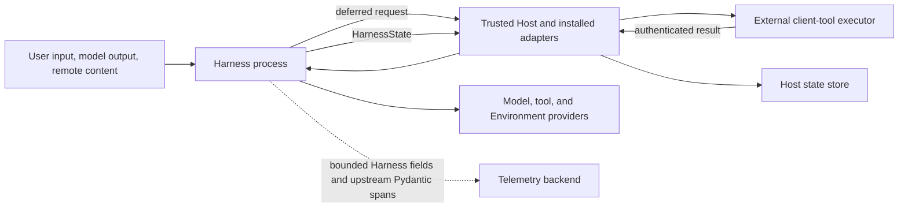

# Harness Security, Compatibility, and Trade-offs

## Design Position

The Harness executes model-controlled work inside a trusted Python process. Security comes from fresh trusted run context, explicit typed policy and provider adapters, metadata-aware managed-tool dispatch, provider-side enforcement, action-scoped credentials, bounded output, and Host-controlled durable state.

Concrete Harness plugins, Environment adapters, native Models, tools, Toolsets, and Capabilities are trusted in-process code. Type checks and schemas protect composition mistakes; they do not sandbox Python. Untrusted or separately governed behavior stays behind a tool, model, Environment, or other feature-specific protocol.

## Trust Boundaries



| Boundary                              | Contract                                                                                                                                                                                                                                   |
| ------------------------------------- | ------------------------------------------------------------------------------------------------------------------------------------------------------------------------------------------------------------------------------------------ |
| Host to Harness                       | Host reconstructs trusted code-first objects and supplies fresh typed bindings                                                                                                                                                             |
| Model to native tool                  | Pydantic dispatch under trusted process composition                                                                                                                                                                                        |
| Model to managed tool                 | Metadata-aware authorization, credentials, result safety, and provider enforcement                                                                                                                                                         |
| Harness to Environment                | Identity-bound `BoundEnvironment`; provider repeats native checks                                                                                                                                                                          |
| Restricted CodeAct to Host            | No ambient authority; only typed eligible callbacks through the current final `ToolManager`                                                                                                                                                |
| Host to external client-tool executor | Durable pending fact, authenticated action/result, exact continuation correlation                                                                                                                                                          |
| Harness to state store                | Harness exports detached state; Host owns persistence, encryption, retention, and selection                                                                                                                                                |
| Harness to telemetry                  | Harness-authored fields are bounded; upstream Pydantic structural and exception fields follow the explicit [Observation boundary](19-observation-model.md#content-and-information-boundary); neither grants lifecycle or billing authority |

## Identity and Authority

`AgentInstanceContext` is supplied by the trusted Host before model-controlled work. Its Agent Identity contains fixed workload `issuer` and `subject` values plus immutable Host-selected string claims. `user_id` and `agent_id` are conventional claims, not credentials or grants. User input, model output, tool arguments, plugin-transformed input/results, run metadata, restored state, and environment variables cannot replace Identity or add claims.

`BoundPluginContext` contains only the concrete plugin instances selected at build and freshly bound for the logical run. Plugin ID is lookup correlation, not authority. `HarnessState` cannot add a plugin, Capability, provider, Environment mount, runtime mutation, or current-run collaborator.

For an allowed managed operation, effective authority is the intersection of:

```text
Host policy
∩ Agent Identity policy
∩ delegation scope
∩ Environment mount effective action ceiling
∩ provider capability and policy
∩ approval decision
```

A native unmanaged tool does not acquire these guarantees merely because it can access `AgentContext`; selecting it is an explicit trusted-code decision. Identity claims and run metadata remain visible to trusted in-process Capability code but are not automatically placed in model context, observations, state, or outbound requests. An explicit transport projection such as MCP context headers selects each outbound value and retains the source's semantics; mapping run metadata into a header does not turn it into an Identity claim.

## Code-first Build Trust

A Host owns its durable Agent definition schemas and artifact locks. The worker verifies those locks and uses trusted adapters to reconstruct native Python values. The Harness does not deserialize import paths or compile Agent specs. Its narrow plugin document contains only IDs, installed entry-point keys, enable state, and bounded JSON. An explicit or opted-in ambient Build Context loads only enabled keys and produces concrete plugins before Pydantic Agent composition. The Environment Provider catalog and Harness Environment Run inputs remain Host-selected because Provider selection, current state, and fresh adapter construction require current authority. The narrow custom Capability catalog contains only exact Host-trusted classes and performs no package discovery.

A mismatch between Host revision and installed adapter fails before the Host calls `HarnessBuilder`. Invalid plugin configuration or an incompatible installed package fails during context or builder construction before model work. Installed, enabled, loaded, and deployment-trusted are separate states: package presence alone imports no code and grants no behavior. Missing, duplicate, colliding, wrongly typed, lock-incompatible, factory-invalid, or ID-mismatched entries fail closed. Factory configuration and Host extension metadata are detached, bounded JSON but remain untrusted input to trusted in-process package code. Configuration, metadata, import, constructor, and factory failures suppress raw standard exception chaining so normal traceback logging cannot disclose those inputs or private installation paths. An API request, model value, durable row, state payload, plugin configuration, extension map, or provider parameter map cannot name an arbitrary import target.

Once supplied or loaded, concrete Python objects execute with process authority. Enabling an ambient plugin document or selecting an Environment Provider therefore trusts the deployment-controlled installed key selection, not merely valid JSON shape. A hostile plugin or Environment adapter can bypass managed tool policy by performing direct Python I/O; deployments that do not trust it must isolate it outside the process.

## Plugin Result and State Trust

A trusted plugin can inspect or transform semantic input, events, errors, output, usage, and complete continuation state. The Harness revalidates result structure, run correlation, message suffix, output type, and state schema, but does not prove state provenance, require identity with an inner candidate, or force `PluginRunExchange.export_current_state()`.

This permits legitimate cache, migration, handoff, and state-transfer behavior. It also means semantic correctness of a plugin-supplied state is part of that plugin's trusted contract. Cryptographic fingerprints, origin allowlists, and malicious-plugin defenses are not added inside the same trust domain.

## Tool and Side-effect Safety

The shared permission/review gate applies before tool-owned validation for native and managed local tool calls, including local MCP, ToolProxy targets, and CodeAct callbacks. This does not sandbox trusted Python or provider-native tools. `AgentContext.tool_approval` conveys verified human sources, not automatic mode/reviewer decisions; source-specific approvals cannot satisfy an unrelated later approval stage. Risk assessment and runtime threshold/action policy are independent. Compact saved review/action history is advisory: it neither grants approval nor automatically lowers risk, and a returned tool result does not prove external effects succeeded. Saved pending metadata is evidence only under the Host's authenticated continuation boundary, and current denial still wins. [Tool Execution](07-tool-execution.md#approval-and-deferred-calls) owns binding and invalidation.

Reviewer request facts and declarations are untrusted data, separated from packaged system instructions and optional custom instructions. Review results and usage events are bounded observations, never credentials or grants. Web domain allow/deny restricts only the first-party Host Web paths and returned search results; it is not universal egress control for shell, MCP, or installed code.

Managed tool execution distinguishes:

1. model-selected name and arguments;
2. canonical tool identity and resources;
3. policy/approval decision;
4. provider acceptance or execution;
5. observed result.

Only the receiver owns the external side effect. A timeout or interruption after dispatch remains unknown without an authoritative receipt. Retry of a mutation requires the same provider idempotency key or reconciliation evidence.

Interrupted-history normalization states that no result was recorded and that the operation may have partially or fully completed. It never claims non-execution or rollback.

Client-side external tools have a separate boundary: the Harness produces native deferred values; the Host commits and authenticates pending/result facts; the external client authorizes and performs the action. Model arguments remain untrusted even when schema-valid.

Optional CodeAct executes model-authored source in Monty's restricted Python runtime rather than the trusted Harness interpreter. The sandbox receives no filesystem mount, network/process/environment/credential/clock callback, or arbitrary Python object. A typed owner policy selects eligible tools, and every nested call returns through the active final Pydantic `ToolManager`, so ordinary validation, Capability hooks, managed policy, owning Toolset, output safety, and usage accounting remain authoritative. Eligibility alone is not approval, idempotency, or a replay guarantee.

CodeAct does not sandbox trusted tool implementations after dispatch. An eligible native tool still runs with its normal in-process authority, and an Environment tool still relies on the current Environment/provider policy. Resource limits bound the interpreter and bridge, while the deployment boundary remains responsible for a hostile or non-cooperative trusted callback. Timeout, cancellation, and failure do not roll back completed or possibly accepted effects; unresolved deferred work terminates the runner without retaining an interpreter frame. The complete contract belongs to [Restricted CodeAct Orchestration](18-codeact.md).

## Environment Enforcement

Routing selects a current mount; it does not grant access. A mount carries one exact `EnvironmentPermissionSet` ceiling, and the entered Environment descriptor narrows it to effective actions. The default ceiling is every Agent-facing operation that the Environment offers; it does not grant Host administration, bypass provider enforcement, escape an isolation boundary, or override operating-system security. Model content cannot invoke Run-local mount mutation or lifecycle methods. Every initial or replacement candidate is a fresh trusted `Environment` constructed by the Host before prepare-before-commit publication. Providers construct adapters without I/O; entered Environments own target authentication, path normalization, operation policy, symlink behavior, resource ceilings, handle visibility, process ownership, port policy, generation fencing, output retention, and native command isolation. Only Host policy invokes backing-target `destroy()`.

Invocation resource metadata is an observation, not execution authority. Default Environment authorization covers operations and arguments; dispatch selects current routes and checks current effective actions after readiness. A Host policy that allows an observed mount ID does not automatically bind later dispatch to that mount. Exact-target policy must be enforced on the actual execution path or through a Host-controlled stable binding, not inferred from resource metadata. Once an operation is admitted, its file scope or process handle retains its captured identity and never silently reroutes.

Model-tool visibility is discovery and ergonomics, not an authorization boundary. `DynamicEnvironmentCapability` derives file and command/process tools from the union of current effective mount actions, but every call still resolves its target mount and repeats exact runtime and Provider checks. Omitting a tool does not revoke trusted in-process code, and exposing a tool does not make an unsupported or denied operation executable.

Shell operations use only the current entered Environment. Run cleanup releases observations without blanket termination; Provider state owns backend-native recovery. Harness fixes the selected mount, effective actions, command, timeout, yield, and output limits before provider dispatch. A process reference is only a Run-incarnation-qualified selector; message history grants no control. A new Run can discover a surviving native command only through its currently authorized Environment, under a fresh reference. Output reads use explicit caller offsets and never rely on a mutable Harness unread cursor.

Client-side validation improves errors but never replaces provider enforcement. Environment authorization intersects exact values from the selected action catalog; an operation family, prefix, wildcard, managed tool ID, EIP available-method name, or unknown provider string never grants a core action. Operations and handles are revalidated against the current opaque mount ID, Identity, policy, and provider generation. Unmount or replacement never retargets an old handle; in-flight leases drain against the captured provider and unsafe active handles fence publication.

Direct Local is an explicit embedding trust choice, not native command isolation or a race-hardened filesystem broker. Its file facet rejects observed traversal and symlink escape under a Host-controlled namespace, but a hostile same-account process can race native directory replacement, and an allowed child executable already has the embedding OS account's ambient filesystem or network reach beyond its working directory. Direct Local therefore rejects `network="deny"` rather than claiming enforcement it does not provide. Its root is always writable at Provider level: a reference-only Direct Local mount expresses read-only through the Harness permission ceiling, which is honest only because such mounts expose no shell. A Host requiring stronger filesystem or command containment supplies an OS/container/VM boundary for the whole target, including envd when used. EIP Session cwd does not restrict filesystem access or create command isolation; envd is not a startup filesystem policy engine.

An explicit Environment `mount_path` intentionally discloses the Host-selected aggregate path to the model and in provider-neutral file results. It changes routing and presentation only: the Harness still translates to a provider-local absolute path, and the Provider still confines or authorizes that path under its own root. A Host uses an explicit path only when the aggregate and Host path spaces are deliberately identical, such as a trusted Direct Local workstation. An isolated or remote profile can omit it and retain virtual compatibility routes without exposing a Host filesystem location.

`EnvironmentState`, Docker daemon access, E2B API credentials, and EIP credentials are separate values and authorities. The Environment obtains current provider credentials through a live Host collaborator; no provider specification, state envelope, descriptor, event, or `HarnessState` carries credentials. A provider-routed EIP HTTP endpoint uses TLS, while plaintext is limited to an explicitly trusted loopback or private provider link. EIP bootstrap authentication remains mandatory in either case, and redirects are rejected.

## Remote Content and Network Authority

Trusted definition composition selects Web behavior; `RunBindings.web` supplies its explicit async client/provider and live network-policy collaborator. That deliberate Host collaborator selection is the Harness-process network grant. A URL in model content, package installation, or an Environment mount grants nothing by itself. The Capability holds no portable credential or static allow decision: the collaborator evaluates every initial target and redirect under current policy, response bodies are consumed under finite time and byte limits, and credentials remain audience-bound. Revocation is therefore observed by the live policy/client without replacing the Run binding. A download enters an Environment only through ordinary file operations and current authorization.

Search results, remote pages, media, converted documents, and skill resources are untrusted content with provenance. They cannot contribute Identity, policy, credentials, tool authority, or an Environment adapter. Live clients, response handles, temporary native paths, and raw credential-bearing URLs are excluded from model projections and portable state. Optional parser and provider packages remain inert until trusted code explicitly composes their owning Capability.

## Credential Boundary

Credentials and current credential resolvers are absent from `AgentDefinition`, instructions, model input, plugin metadata, events, results, and `HarnessState`. A fresh model resolver, managed invocation policy, or provider adapter requests action- and audience-scoped credentials under current Identity and policy.

The default shell path projects no credential. A provider that must inject one owns final environment/file injection and prevents caller override.

## Output Resource Safety

Managed tools and first-party Environment operations enforce finite inline and per-capture output ceilings, explicit incompleteness, and provider-owned aggregate storage bounds. Direct Local bounds actual private-spool bytes. Envd reserves separate finite stdout/stderr allowances under a daemon-wide private disk-spool ceiling and retains valid references until explicit release or generation end. Harness model-facing limits can narrow what is read or projected but never widen provider capture ceilings.

Locally executed MCP function results cross the same final output boundary after upstream `MCPToolset` has received and mapped them. The code-owned default truncation policy therefore bounds model-visible text and JSON but is not a transport-body, remote-process, or client-materialization limit. Provider-native MCP runs inside the provider path and does not cross this local function boundary. Native multimodal MCP content remains subject to the later model-request content boundary.

This does not prevent trusted Python or an MCP client from allocating an oversized object before the wrapper receives it. OS/container limits remain the final process-memory boundary.

## State Integrity

`HarnessState` stores detached public Pydantic messages, detached JSON Capability entries, and a direct mount-name mapping of detached provider-defined `EnvironmentState` values. The envelope validates its version and message codec. Each Capability validates only the namespace it reads through exact ID, version, and typed model; each state value validates its provider key, version, and JSON codec. The mapping cannot construct or authorize an Environment after Run entry.

Unknown Capability namespaces can remain opaque and survive a run. The Harness does not require every entry to belong to the active Capability set or to be accepted before unrelated model work. An Environment entry whose name is absent from the current Host-selected mounts cannot mount or authorize itself. A Host or trusted plugin can transform or remove opaque data before resume.

State restores no Identity, credential, policy decision, desired mount definition, Environment adapter, entered facade, or mount, provider launch state, provider client, mutation authority, route authority, readiness, execution lease, pending command, or external side-effect fact. Hosts may encrypt, sign, content-address, bound, retain, or delete stored state without becoming the semantic owner of Capability or provider payload data.

## Model and Recovery Safety

A concrete Model bypasses string-ID resolution and is mutually exclusive with `AgentSpec.model`. A string model reaches the thin `ResolveModelId`; a fresh async `RunModelResolver` returns a native Model or raises. When no resolver exists, the Harness uses its own `infer_model()` compatibility boundary and the builder's optional gateway Provider factory. Literal `gateway@` routes use Pydantic AI's public Gateway Provider and its standard credential configuration; named custom gateways require the explicit builder factory. A hosted profile that requires fail-closed aliases must enforce presence of its binding during worker setup.

Model requests can receive non-authoritative Thread-derived defaults: an explicitly configured `session_affinity_header` (default off), and eligible `openai_prompt_cache_key` (independently default on). Explicit effective settings override them, and the selected provider adapter remains responsible for consuming and rendering recognized native settings. The header name and cache policy are snapshotted at `HarnessBuilder` construction; connection-specific Hosts bind the header from their own immutable Model recipe or live Provider configuration instead. The legacy `x-session-id` boolean/environment switch is an explicit opt-in compatibility alias, not an implicit global default. Disabling a default does not remove an explicit setting. Request-affinity injection grants no authority and exposes neither credentials nor transient run metadata.

The packaged official model catalog contains only public direct-provider facts and grants no provider availability or authority. Model-characteristics and model-settings aliases are non-authoritative authoring convenience: resolution requires an already selected provider, produces detached concrete values in the respective Harness lifecycle and native request planes, and fails before Agent construction or durable revision creation. A context alias cannot widen provider capability or enable a provider context variant, and a max-output alias cannot prove model compatibility. Alias keys cannot defer a provider choice, enter run bindings or state, or cause a worker to consult a mutable catalog. The packaged pricing snapshot and Host replacements are immutable public configuration, not credentials or settlement truth. Cost input excludes content and credentials; lookup miss, invalid quote, or calculation failure preserves upstream usage and cannot fail the Agent run. Inline delegation reuses the parent's effective build-time model-cost Capability without exposing another Host-selectable run override.

Provider model-session and prompt-cache affinity are correlation and performance inputs, not authority. The Harness isolates every independently advancing root, child, or fork history with `HarnessState.thread_id`, restores it as a read-only `AgentContext` value, and accepts no run-binding or metadata override. The mandatory final request Capability derives its enabled defaults from that value; a model integration may explicitly override them with a provider-required derivation but never substitutes transient run IDs, `AgentInstanceRef`, or a broader product-conversation key shared across parent and child histories. Rendered provider affinity remains absent from `HarnessState`; an additional non-derivable opaque selector is protected and retained by the Host like other provider-specific continuation data. The State-owned ID itself is not a credential, checkpoint authority, or cryptographic integrity mechanism; trusted plugins and Host State transformations remain inside the existing trust boundary.

Recovery layers remain bounded and separate:

- provider transport retry under provider/client policy;
- at most one exact `SelfHealingModel` replay after an effective repair;
- a finite consecutive-failure Harness recovery budget, replenished only by accepted primary model progress and disabled by default;
- Host durable recovery only from authoritative checkpoints.

Cancellation, usage limits, output retry exhaustion, tool failure, native deferred/HITL boundaries, and non-model Harness failures stop semantic recovery. Backoff is cancellation-aware.

## Data and Telemetry

The design distinguishes public configuration, correlation metadata, user/business content, sensitive model/tool content, credential metadata, and secret material. Secrets are absent from general Harness schemas. Event, state, log, and Observation owners define separate content policies rather than relying on one generic sanitization claim.

[Harness Observation](19-observation-model.md#content-and-information-boundary) guarantees bounded content-safe names, attributes, statuses, events, and low-cardinality dimensions for Harness-authored telemetry. `trace_content=none` means ordinary prompt/output/tool/binary/request payload capture is not requested; it does not suppress every Pydantic-authored Agent/tool structural value or exception. Before enabling tracing, the Host ensures upstream surfaces are safe, sanitizes its trusted processor or collector path before export, or excludes those spans. Backend masking is defense in depth, not a portable OpenTelemetry guarantee.

Telemetry export is non-authoritative and exporter availability never determines run success. A Host with a fail-closed audit requirement implements a separate durable audit facility rather than turning an exporter into Harness lifecycle authority.

## Compatibility Model

| Axis                                          | Owner                                    |
| --------------------------------------------- | ---------------------------------------- |
| Harness public Python API                     | Harness                                  |
| Native Agent/Model/Capability behavior        | Pydantic AI                              |
| Harness Observation API and `a13n.*` registry | Harness                                  |
| Upstream Pydantic instrumentation fields      | Pydantic AI                              |
| Host definition/revision schema               | Host                                     |
| Reconstruction adapter and artifact lock      | Host integration/operator                |
| Harness state envelope                        | Harness                                  |
| Capability state entry                        | Owning Capability                        |
| Portable Environment mount-state codec        | Owning Environment provider              |
| Provider-owned `EnvironmentState` codec       | `a13n-environment` built-in or extension |
| Authoritative `EnvironmentState` storage      | Host                                     |
| Durable lifecycle/events                      | Host                                     |

Matching logical IDs or definition digests do not prove artifact or state compatibility. A Host selects a mutually compatible revision and adapter set before construction and performs any explicit state migration before run creation.

## Failure Semantics

| Failure                                                          | Outcome                                                          |
| ---------------------------------------------------------------- | ---------------------------------------------------------------- |
| Missing/invalid trusted binding                                  | Stop before dependent dispatch                                   |
| Policy denial                                                    | Typed denial; no broader fallback                                |
| Invalid client feedback                                          | Reject without changing pending state                            |
| Invalid plugin ID/order/replacement                              | Build or run setup fails                                         |
| Invalid plugin document, Harness factory, or Environment catalog | Context/build/setup fails before affected provider or model work |
| Invalid plugin event/result                                      | Reject; retain nearest earlier valid candidate when available    |
| State version/payload mismatch on typed read                     | Fail the owning operation without mutating stored state          |
| Provider timeout after possible dispatch                         | Unknown until idempotent reconciliation                          |
| Cleanup failure after a candidate                                | `RunCleanupError` carries the candidate; no terminal event       |
| External task cancellation                                       | Propagate after cleanup; cannot be suppressed                    |

## Trade-offs

### Trusted In-process Composition

Native Python composition is expressive and efficient. It cannot isolate malicious code, so trust and artifact selection are Host responsibilities and strict isolation uses protocol boundaries.

### Opaque State Namespaces

Independent namespaces support optional Capabilities and trusted handoff. The Harness cannot globally attest that every stored entry matches the current Agent composition.

### Live Deny with Immutable Revision

An immutable definition preserves authored behavior, while fresh policy and credentials can deny or narrow current authority. This sacrifices replay of historical authorization decisions in favor of revocation and incident response.

### Provider-side Enforcement

Repeating checks at the provider costs implementation effort but prevents a compromised or buggy in-process adapter from becoming the only security boundary.
