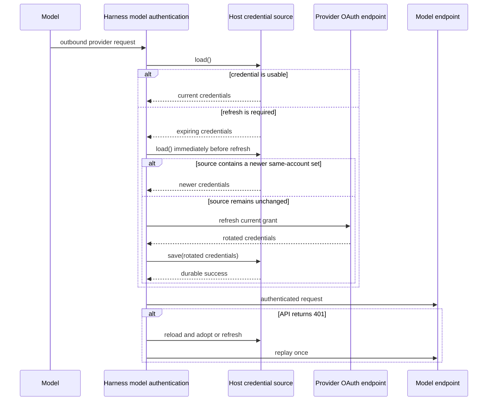

# Model Authentication

## Design Position

The Harness provides SDK-first process-local authentication for native Models whose providers use user OAuth credentials rather than API keys. Pydantic AI owns the official Codex credential values, source protocol, browser PKCE/callback handling, authentication, refresh, and Responses dialect. The public `a13n_harness.model_auth` feature module supplies Codex request-affinity and shared-store login adapters plus the Grok credential, OAuth, and Model integration.

This boundary is designed for embedded applications and hosted workers alike. It does not treat an installed CLI or a local credential file as the primary API. A Host can connect a local product-compatible file, an encrypted service store, or another authorized durable source by implementing the same asynchronous `load()` and `save()` protocol.

## Boundaries

| Concern                                                                               | Owner                    | Contract                                                       |
| ------------------------------------------------------------------------------------- | ------------------------ | -------------------------------------------------------------- |
| Codex credentials, source protocol, refresh, single-flight, and 401 replay            | Pydantic AI              | Uses `OpenAICodexProvider` and its native credential lifecycle |
| Codex browser PKCE, authorization URL, callback receiver, and Responses dialect       | Pydantic AI              | Uses public upstream primitives                                |
| Codex routing, turn state, Thread affinity, device login, and retained login ID token | Harness                  | Supplements only capabilities absent upstream                  |
| Grok credentials, source protocol, OAuth exchange/refresh, and request authentication | Harness                  | Preserves the provider-specific Grok contract                  |
| Durable storage, encryption, account selection, and authorization                     | Host                     | Implements the relevant source and controls who may use it     |
| Strict multi-process or multi-replica refresh exclusion                               | Host                     | Is not implied by a process-local lock                         |
| Product-store policy, schema preservation, login/logout UI, and account status        | Harness UI               | Adapts Codex and Grok Build stores                             |
| Model route and non-secret settings                                                   | Host model configuration | Selects the native Model and optional Harness adapter          |

The Harness never discovers a Host account, selects a durable record, stores credential bytes in `HarnessState`, or defines a Model-account resource. MCP OAuth, Connector OAuth, and end-user sign-in are separate contracts.

## Public Credential Sources

The following Python-like definitions are conceptual public API, not serialized wire formats:

```python
from pydantic_ai.providers.openai_codex import (
    OpenAICodexCredentials,
    OpenAICodexCredentialSource,
    OpenAICodexOAuthFlow,
    OpenAICodexProvider,
)


@dataclass(frozen=True, slots=True, kw_only=True)
class GrokCredentials:
    account_id: str
    auth_mode: str
    create_time: datetime
    expires_at: datetime
    issuer: str
    client_id: str
    access_token: str
    refresh_token: str | None = None


class GrokCredentialSource(Protocol):
    async def load(self) -> GrokCredentials: ...
    async def save(self, credentials: GrokCredentials) -> None: ...
```

The native `OpenAICodexCredentials` contains `access_token`, `refresh_token`, and `account_id`; it does not contain an expiry field or ID token. Hosts derive expiry projections from the token when needed. Credential representations exclude secret fields from `repr`. A source returns one complete current provider credential set. `save()` durably replaces that set or raises; it never reports success before the replacement meets the Host's durability policy.

The small protocol is intentionally structural. Provider lifecycle code needs no revision token or storage-specific snapshot. A Host that requires compare-and-swap, row locking, leases, or cross-replica exclusion implements that behavior behind `load()` and `save()`.

## Codex Device Authorization

`CodexDeviceAuthorizationFlow.start()` starts the reviewed vendor protocol at the Codex user-code endpoint. The public result exposes the verification URL, user code, interval, and maximum fifteen-minute lifetime, keeping the device authorization ID out of representations. Bounded polling treats HTTP 403/404 as pending. `wait_for_login()` exchanges the returned authorization code and verifier at the token endpoint using `https://auth.openai.com/deviceauth/callback`, not the browser loopback redirect. This is not the RFC 8628 token grant used by Grok. Cancellation interrupts polling; the Host alone publishes credentials. `DeviceAuthorizationError.reason` distinguishes expired, denied, and unsupported outcomes where the provider protocol identifies them; no protocol silently starts another login method.

## Codex Request Lifecycle

`OpenAICodexProvider(credential_source=source)` is the model-authentication owner. Explicit source injection avoids ambient CLI discovery and API-key fallback. `OpenAIResponsesModel` with that provider is sufficient for the native subscription dialect. `CodexRequestModel` adds Harness affinity and routing state without implementing a second credential manager or Responses dialect.

The provider loads the source lazily on first use, caches that credential set, and reloads immediately before refresh. It adopts a changed stored value rather than spending an already-rotated refresh token. It does not consult storage for every model request. Hosts that bind a provider lifetime to an account validate that binding in their source. A changed file or logout does not invalidate an already cached access token immediately; Harness UI constructs fresh collaborators for each independent Run and account operation.

Expiry is the upstream best-effort JWT hint with a thirty-second buffer. A proactive refresh failure can fall through to a request with the current token. A 401 triggers one refresh-or-adopt and one authentication replay, with process-local single-flight coordination. This is distinct from the upstream OpenAI SDK's transport retry policy, which is not replaced by Harness.

A successful refresh installs the complete credential set in provider memory before calling `save()`. If saving fails, upstream `CredentialsPersistenceError` surfaces but the rotated in-memory set remains current and may be used by a later request. This is not a durability guarantee. The Host still owns file conflict checks and persistence; neither the adapter nor the provider claims distributed refresh exclusion. Interactive login never starts from a model request.

## Grok Request Lifecycle



For Grok, the source is consulted for every outbound provider request. This is a freshness check, not an unconditional refresh. One provider instance serializes its own refresh operation and lets concurrent requests adopt the completed result. Before spending a refresh token, it reloads the source and adopts a changed same-account credential set instead.

A refreshed credential is not installed for outbound use until `save()` succeeds. A failed save therefore fails the pending request and leaves the previously accepted in-memory set unchanged. This stricter ordering prevents an application from treating an unpersisted rotation as usable when refresh tokens can be single-use.

An HTTP 401 triggers at most one reload-or-refresh and one replay. The second response is returned without another authentication retry. Interactive authorization never starts from a Model request.

## Request Isolation and Affinity

OAuth headers are attached only to the exact HTTPS origin owned by the selected Model integration. Codex requests carry bearer authorization, the ChatGPT account identifier, and the upstream `pydantic-ai` originator. Grok requests carry only their supported bearer authorization. Codex routing and turn-state headers follow the same exact-origin restriction. Redirects or reuse of a client for another origin cannot forward these values.

A caller-supplied HTTP client must be dedicated to the Model integration and have no existing authentication; the builder installs its request authentication and does not close that client. An adapter-owned client is reference-counted across nested Model entries, closes after the final exit, and is recreated on a later entry. Caller-owned clients remain open.

Codex uses the native Responses streaming dialect, disables provider storage, uses the upstream profile to omit unsupported generic settings (`max_tokens`, `temperature`, and `top_p`), and does not support server-side token counting. Explicit `openai_*` settings follow upstream validation and rendering rather than being silently stripped by Harness. It derives Codex `session-id`, `thread-id`, and `x-client-request-id` defaults from the explicit `CodexRequestModel(thread_id=...)` binding using the shared [UUID v5 request-affinity derivation](16-input-model-and-output.md#automatic-request-affinity). The Host supplies its current Model resolution context's raw Thread ID; the adapter derives the wire value once rather than accepting an already-derived identity. These defaults apply independently of gateway headers on both streaming and non-streaming paths; the value may be Host-selected for a new Thread but remains State-stable across continuation, and explicit case-insensitive header values win. The standard `openai_prompt_cache_key` remains owned by the Harness request-affinity Capability. Root and child Threads therefore receive different provider thread affinity while each Thread retains stable affinity across its own continuation.

### Codex Routing and Turn State

Every OAuth Codex Model request derives one backend routing hint from the effective request:

```http
x-codex-routing-hint: model=<model>
x-codex-routing-hint: model=<model>;tier=<service-tier>
```

The `tier` segment is present only when effective `openai_service_tier` or the unified `service_tier` is non-empty; the provider-specific setting has precedence, matching Pydantic AI's OpenAI request rendering. Caller-supplied values for `x-codex-routing-hint` are discarded case-insensitively so the selected Model and effective tier remain authoritative. This header belongs only to the ChatGPT Codex OAuth backend and is not added to generic OpenAI Responses Models.

For each Pydantic AI run, the Codex Model maintains one process-local first-write-wins `x-codex-turn-state` value. The initial request sends no turn state. The first non-empty value returned in a successful streaming response header is retained unchanged, and every later request with the same Pydantic run ID and `RunUsage` identity sends it as `x-codex-turn-state`. Later response values cannot replace it. A different run or reuse of the same run ID with a different `RunUsage` starts without state; a direct Model call without `RunContext` neither retains nor replays state. Caller-supplied turn-state headers are discarded so stale state cannot cross turns.

Thread affinity and turn state have separate lifetimes: Thread-derived headers remain stable across continuation, while `x-codex-turn-state` exists only for one live Pydantic run. The turn state is not persisted into `HarnessState`, messages, events, logs, or telemetry.

No OAuth token, authorization code, PKCE verifier, raw identity claim, complete source record, or Codex turn-state value enters Model messages, `HarnessState`, event payloads, logs, or telemetry.

## Codex Account Request Authentication

Host-owned ChatGPT account API clients can supply a dedicated async HTTP client to `OpenAICodexProvider` to use the same official credential-source authentication, without sending account operations through the OpenAI SDK retry layer. The Host disables redirects, binds confirmed mutations to their expected account, and retains stable idempotency identities across the possible 401 replay. Quota eligibility, reset-credit selection, confirmation UI, and provider reset outcomes are Host responsibilities, not Harness Model APIs.

## OAuth Flows

For direct model credentials, applications use `OpenAICodexOAuthFlow` from Pydantic AI. Opening a browser and credential persistence remain caller-owned.

Native Codex shared files additionally require `tokens.id_token`, which the upstream credential value intentionally omits. `CodexLoginFlow` subclasses the public upstream flow and specializes only the authorization-code exchange to retain that real token. Upstream still owns PKCE, state, URL generation, and callback handling. `exchange_login_from_callback()` returns `CodexLoginResult(credentials=OpenAICodexCredentials(...), id_token=...)`. Codex device login returns the same result through `wait_for_login()`. The ID token is excluded from representations and used only for Host publication; it does not introduce another model credential or refresh lifecycle. Hosts require a finite callback lifetime and preserve cancellation. A fresh login or account switch publishes the new ID token; ordinary same-account model refresh preserves the existing stored ID token.

`GrokOAuthFlow` is a discovered OIDC authorization-code plus PKCE context. Its asynchronous constructor accepts an explicit issuer, public-client ID, loopback redirect URI, and ordered scopes; loads an issuer-matching discovery document; requires secure authorization, token, and JWKS endpoints; and creates independent random state, nonce, and PKCE values. `authorization_url()` emits the discovered authorization endpoint with `response_type=code`, client identity, redirect URI, scopes, PKCE S256, state, nonce, and an optional bounded provider referrer. Caller-supplied additional parameters cannot replace these flow-owned protocol values. The one-shot callback receiver binds only the selected loopback address, accepts only the exact callback path and state, has a finite caller-visible timeout, and always closes before token exchange completes.

Browser-flow code exchange posts the authorization grant directly to the discovered token endpoint and requires an access token, refresh token, positive expiry, and ID token. The ID token is verified against the discovered signing keys and supported algorithm set, issuer, public-client audience, expiry, and flow nonce before its non-empty subject becomes the Grok account identity. An unverified browser-delivered identity claim never becomes credential authority.

`GrokDeviceAuthorizationFlow.start()` implements the provider's RFC 8628 profile for the same explicit issuer, client identity, and scopes. It posts to the issuer's device authorization endpoint and returns a context whose public projection contains only the bounded user code, HTTPS verification URI, optional HTTPS complete verification URI, expiry, and poll interval; the device code remains secret. The bounded lifetime starts when that authorization response is accepted, not when a caller later begins waiting. `wait_for_credentials()` sleeps before its first token request, bounds every token request by the remaining lifetime, polls the issuer token endpoint with the device-code grant until that expiry, retains the interval for `authorization_pending`, increases it by five seconds for `slow_down`, and fails explicitly for denial, expiry, malformed responses, or other provider errors. Loopback HTTP verification URLs are accepted only for explicit local development or tests. A successful device exchange requires a usable access token, positive expiry, and account identity derived from the ID-token subject or selected access-token principal; it does not claim browser-flow ID-token verification because the response arrives only over the direct token channel.

Grok refresh follows the issuer and client identity in `GrokCredentials`, requires a secure issuer-matching discovery document and token endpoint before sending the refresh token, and returns another complete credential set. Authorization and device-code values are short-lived process-local flow state. They are excluded from representations and never persisted by the Harness. The caller owns authorization URL presentation, optional browser opening, cancellation, and durable credential saving. Codex and Grok do not share one token-response schema or one account identity rule.

## Failure Semantics

| Failure                                                                           | Observable outcome                                                                                                       |
| --------------------------------------------------------------------------------- | ------------------------------------------------------------------------------------------------------------------------ |
| Source is absent, malformed, unauthorized, or unavailable                         | The Model interaction fails with bounded authentication-required or source-failure semantics                             |
| Reloaded credential belongs to another account                                    | Host account binding rejects the new set; Codex proactive hints retain upstream fallback behavior                        |
| OAuth refresh is rejected or malformed                                            | Grok fails; Codex follows upstream proactive-hint and 401 behavior; interactive login is not started                     |
| Rotated credentials cannot be saved                                               | The pending request fails; Codex retains its rotated in-memory set, while Grok retains its previously accepted set       |
| Another actor rotates the same account before refresh                             | The provider adopts the reloaded set instead of spending its stale refresh token                                         |
| Another actor wins during `save()`                                                | The Host source's conflict or coordination behavior determines the failure; Harness does not claim distributed exclusion |
| First Model request receives 401                                                  | Reload or refresh is attempted, then the request is replayed once                                                        |
| Replayed request receives 401                                                     | The second response is returned without another replay                                                                   |
| Codex response omits a usable turn state                                          | The current Pydantic run remains stateless until a later successful response supplies one                                |
| Grok discovery or endpoint validation fails                                       | Interactive authorization fails before presenting or exchanging a provider grant                                         |
| Grok callback state, ID-token signature, issuer, audience, nonce, or expiry fails | Browser authorization fails and produces no credentials                                                                  |
| Grok device authorization is pending or slowed down                               | Polling continues within the provider interval and bounded device-code lifetime                                          |
| Grok device authorization is denied or expires                                    | Login fails explicitly and produces no credentials                                                                       |

## Compatibility

`pydantic_ai.providers.openai_codex` is the canonical import route for native Codex credentials, sources, provider, browser flow, and refresh/persistence errors. `a13n_harness.model_auth` exports only its supplemental Codex request/login adapters and its Grok integration, without package-root reexports. It does not retain aliases for the former Codex credential types, OAuth flow, Model builder, account-auth builder, or refresh function. Provider-specific credential fields, OAuth wire behavior, request headers, and Model dialects are release-owned compatibility surfaces and are tested against the supported upstream products.

Adding another provider is additive only when it has an explicit credential type, source protocol, OAuth behavior, and Model transport contract. A generic OAuth document that erases provider differences is not a compatible extension.

## Invariants

01. Model OAuth is SDK-first and does not require a CLI credential store.
02. Pydantic AI owns Codex model authentication and dialect; Harness owns the remaining Grok integration.
03. The Host owns durable credential authority, authorization, and distributed coordination.
04. Codex uses upstream cached credentials and reload-before-refresh; Grok consults its source on each request.
05. Codex persistence failures surface with rotated memory retained; Grok saves before installing rotated credentials.
06. Credentials are sent only to the selected provider's exact HTTPS origin.
07. A Model request never starts interactive login; Hosts own account binding and fresh collaborator construction.
08. Credential bytes and Codex turn state never enter Harness continuation, Model context, events, logs, or telemetry.
09. Codex routing is derived from the effective Model and tier, while turn state is first-write-wins and isolated to one live Pydantic run.
10. Grok browser login uses discovered OIDC endpoints, PKCE, state, nonce, and verified ID-token identity; device login uses bounded RFC 8628 polling.
11. Interactive flow state remains process-local, secret-bearing values are excluded from representations, and only the Host decides whether to persist successful credentials.
