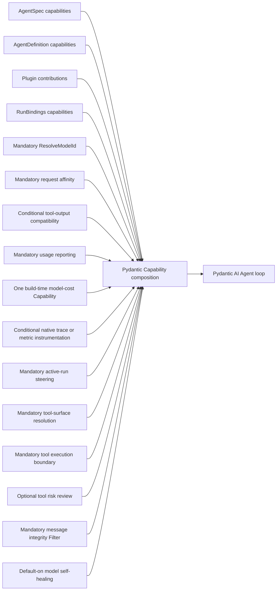

# Core Capability Catalog

## Design Position

Pydantic AI Capabilities remain the reusable extension mechanism inside the Agent loop and the only top-level feature-behavior plane in `AgentDefinition`. This document names first-party composition roles and points to their owning contracts. It is a documentation catalog only: it is not the narrow Host-supplied custom Capability type catalog used for `AgentSpec` reconstruction, a serialized plugin catalog, package installer, or source of authority.

Concrete Capabilities enter through:

- `AgentSpec.capabilities` under native Pydantic AI rules;
- `AgentDefinition.capabilities` as trusted code-first instances;
- `RunBindings.capabilities` as fresh invocation instances;
- an Agent-bound Harness plugin's code-first contribution.

The Harness does not resolve Capability classes from export IDs or manifests.

## Mandatory Harness Composition

The current mandatory build contribution is deliberately narrow:

| Entry                     | Primitive                                                       | Purpose                                                                                                                                              | Owner                                                      |
| ------------------------- | --------------------------------------------------------------- | ---------------------------------------------------------------------------------------------------------------------------------------------------- | ---------------------------------------------------------- |
| Video inputs              | Mandatory `VideoUrlCapability`                                  | Acquire bounded direct video bytes or native YouTube URLs; project compatibility and single/aggregate Base64 budgets only in provider requests       | [Video inputs](16-input-model-and-output.md#video-inputs)  |
| Logical model resolver    | Pydantic `ResolveModelId`                                       | Consult fresh `RunModelResolver` or use Harness `infer_model()`                                                                                      | [Input, Model, and Output](16-input-model-and-output.md)   |
| Request affinity          | Mandatory final model-request Capability                        | Add opt-in Thread-derived `session_affinity_header` and independently default-on GPT-eligible `openai_prompt_cache_key` unless explicitly overridden | [Input, Model, and Output](16-input-model-and-output.md)   |
| Typed run dependencies    | `AgentContext`                                                  | Carry Identity, Environment, model and model-context bindings, events, usage attribution, plugins, children, metadata, and state                     | [Capability Model](04-capability-model.md)                 |
| Usage reporting           | Mandatory `UsageCapability`                                     | Attribute mixed usage and flush pending records after every committed model request                                                                  | [Events and Usage](12-events-observability-and-usage.md)   |
| Model-cost valuation      | One `AbstractModelCostCapability`                               | Apply default catalog pricing, one code-first replacement, or explicit no-cost behavior before native usage accumulation                             | [Events and Usage](12-events-observability-and-usage.md)   |
| Observation owner         | Pydantic `Instrumentation`, when tracing or metrics is selected | Own selected Agent-attempt, model-request, tool, usage, streaming, and cancellation spans and native metrics through one Harness-selected path       | [Harness Observation](19-observation-model.md)             |
| Active-run steering       | Mandatory `SteeringCapability`                                  | Bind the public stream to native `RunContext.enqueue()` without exposing a private Pydantic run handle                                               | [Public API and Packaging](14-public-api-and-packaging.md) |
| Tool-surface resolution   | Capability-contributed `WrapperToolset`                         | Resolve declarative managed-tool supersession and remove every upstream deferred definition from a child surface before CodeAct and registration     | [Tool Execution](07-tool-execution.md)                     |
| Tool execution boundary   | Mandatory outer Capability and contributed `WrapperToolset`     | Bound function text/JSON returns, enforce selected managed policy, and completely deny dynamic deferred calls inside child Runs                      | [Tool Execution](07-tool-execution.md)                     |
| Message integrity Filter  | Innermost request Filter Capability                             | Remove orphan or duplicate ordinary function-tool results before provider dispatch                                                                   | [Input, Model, and Output](16-input-model-and-output.md)   |
| Model context coordinator | Mandatory `ModelContextCoordinatorCapability`                   | Preserve historical overlays, resolve the typed Host/Capability/terminal projection chain, and commit one validated current request overlay          | [Context and Working State](09-context-and-memory.md)      |
| Continuation coordinator  | `AgentContextState` typed methods                               | Provide detached versioned JSON namespaces without a second Capability registry                                                                      | [Harness State and Resume](10-snapshot-and-resume.md)      |

Model self-healing is installed by default, with an explicit builder opt-out. `SelfHealingModelCapability` installs the `SelfHealingModel` wrapper at the final effective request-Model boundary; the wrapper owns repair and replay behavior. Interrupted-stream semantic recovery is owned by `HarnessRunStream`, not a Capability. Plugin input/result middleware remains outside the Agent loop.

## Optional Capability Roles

`ToolPermissionsCapability` selects stable-ID rules before custom validation for all locally executable tools. The same Capability owns optional model-backed or code-first risk review at that gate, with shell-specific input rendering but no separate review Capability. It does not grant Host authority. [Tool permissions and review](07-tool-execution.md#tool-permissions-and-review) owns modes, identity, ordering, and approval provenance.

`ToolProxyCapability(groups=...)` optionally presents grouped local tools through one dynamic search/call pair. Each passive `ToolProxyGroup` supplies a Toolset or Capability source and a description; native composition preserves source Agent/run binding. This presentation composes with CodeAct but owns no independent executor; [Grouped ToolProxy Discovery](07-tool-execution.md#grouped-toolproxy-discovery) owns its contract.

| Role                             | Preferred Pydantic primitive                                                                                                 | Owning document                                                                     |
| -------------------------------- | ---------------------------------------------------------------------------------------------------------------------------- | ----------------------------------------------------------------------------------- |
| Managed function policy          | Fresh typed policy Capability consumed by the core wrapper                                                                   | [Tool Execution](07-tool-execution.md)                                              |
| Tool risk review                 | Definition-selected risk assessment of local tools with global/per-tool policy and shell input specialization                | [Tool Execution](07-tool-execution.md#model-backed-review-and-shell-specialization) |
| Client-side external tools       | Capability-selected declarations composed into a schema-owning Toolset and native deferred values                            | [Tool Execution](07-tool-execution.md)                                              |
| Dynamic Environment adapter      | Capability composing standard file/shell Toolsets and private Run-local process observation over `BoundEnvironment`          | [Environment Integration](08-environment-integration.md)                            |
| Runtime context                  | Bounded request epilogue with run timing, configured context window, and usage facts                                         | [Context and Working State](09-context-and-memory.md)                               |
| Workspace outline                | Bounded version-pinned Environment file-metadata projection on input requests                                                | [Context and Working State](09-context-and-memory.md)                               |
| File context                     | Run-frozen conventional and explicit Environment file contents on input requests                                             | [Context and Working State](09-context-and-memory.md)                               |
| Compaction and handoff           | Same-Agent plain-text history compaction, plus an independent explicit handoff tool and reminder                             | [Context and Working State](09-context-and-memory.md)                               |
| Skills and discovery             | Run-frozen selected catalog and bounded resource Toolset                                                                     | [Context and Working State](09-context-and-memory.md)                               |
| Working state                    | Capability using one `AgentContextState` namespace and the model-context subtype                                             | [Context and Working State](09-context-and-memory.md)                               |
| File memory                      | Model-context Capability with run-frozen mount instructions, a file Toolset, and first-input context over Host-opened stores | [File Memory](21-file-memory.md)                                                    |
| Record memory                    | Model-context Capability with run-frozen mount instructions, a record Toolset, and first-input recall of Host-opened stores  | [Record Memory](21a-record-memory.md)                                               |
| Structured user interaction      | Native deferred client-side tool                                                                                             | [Tool Execution](07-tool-execution.md)                                              |
| Documents and web                | Feature Toolsets over explicit providers; Web may compose provider-native search with a Host function fallback               | [Context and Working State](09-context-and-memory.md)                               |
| Native image generation          | `NativeImageGenerationCapability` composing native `ImageGenerationTool` with a required Host saver                          | [Input, Model, and Output](16-input-model-and-output.md#native-image-generation)    |
| Provider usage                   | `AgentContext` attribution seam                                                                                              | [Events and Usage](12-events-observability-and-usage.md)                            |
| Subagent execution               | `SubagentCapability` selects Harness-private inline execution or a standard async Toolset backed by a complete Host operator | [Delegation and Subagents](11-delegation-and-subagents.md)                          |
| Restricted CodeAct orchestration | Capability-owned wrapper composing run-local Monty runners over typed eligible final tools                                   | [Restricted CodeAct Orchestration](18-codeact.md)                                   |
| Checkpoint observation           | Capability using public complete message boundaries                                                                          | [Harness State and Resume](10-snapshot-and-resume.md)                               |
| Request content compatibility    | Copy-on-write request Filter over native multimodal content                                                                  | [Input, Model, and Output](16-input-model-and-output.md)                            |
| Cold-start history reduction     | Copy-on-write Filter over already-consumed ordinary tool returns                                                             | [Input, Model, and Output](16-input-model-and-output.md)                            |
| Model self-healing               | Innermost request wrapper installing one exact `SelfHealingModel` around the effective Model                                 | [Input, Model, and Output](16-input-model-and-output.md)                            |
| Tool-based structured output     | Build-injected innermost request wrapper sending provider-facing auto tool choice while preserving local output validation   | [Input, Model, and Output](16-input-model-and-output.md)                            |
| Provider-specific Agent behavior | Capability public hooks only when profile/adapter is insufficient                                                            | [Input, Model, and Output](16-input-model-and-output.md)                            |

Native function tools and Toolsets remain valid code-first Pydantic inputs only inside a Capability. A small native `Capability(tools=[...])` or Toolset Capability is the ordinary one-to-one adapter; it does not require a Harness-specific subclass. The Capability owns feature activation, lifecycle, and Toolset composition; each Toolset owns guidance that describes its model-visible tools. The owning Capability also owns any tool timeout and stable Capability/Toolset identity because top-level `AgentSpec.tool_timeout` does not implicitly configure Capability-owned Toolsets. `DynamicEnvironmentCapability` is richer because it combines stable Toolsets with current-mount projection, mount-change notices, and process-completion readiness. Current-mount projection remains owned by the Harness-internal Environment facade entered from the Run's Environment inputs. Process handles, explicit-offset observations, and watchers remain private to the current Run controller; no process collaborator contributes another Toolset or portable state.

## Composition

Pydantic AI owns Capability construction, `for_agent()`, `for_run()`, ordering, dependencies, Toolset composition, and lifecycle hooks. The Harness preserves contribution order as input to those native rules and does not pre-sort a competing graph.

A Capability needing another run-bound Capability uses Pydantic's public run-bound mapping. A Capability needing its contributing Harness plugin resolves the fresh plugin through `AgentContext.plugins` by stable ID and expected type.

## State

Stateful Capabilities use `AgentContextState.read()` and `write()` with a stable non-blank namespace ID, exact version, and typed Pydantic model. The Harness snapshots all namespaces but does not inspect a global list of active owners. Provider-defined portable Environment backend state uses the explicit core-owned `HarnessState.environment_states` mapping and is never stored as a `DynamicEnvironmentCapability` namespace. Dynamic Environment stores no process reference, operator ID, cursor, status, loss, watcher, or readiness state. Inline Subagent state stores complete nested child `HarnessState` for ordinary prompt continuation while excluding independently published Environment state. Async Subagent mode stores no parent Capability state; public execution references, current outcomes, child Threads, callbacks, durable jobs, queues, delivery, and wake-up remain Host operator concerns.

A trusted plugin can also transform the complete `HarnessState` at the result boundary. This does not create a second Capability lifecycle or provenance system.

## Authority

Capability presence does not itself grant external authority. Current Identity enters through typed `RunBindings`; fixed-target Environment connectors enter through explicit Run inputs. Credentials, policy decisions, invocation grants, durable checkpoints, backing-target authority, runtime mutation authority, and provider sessions remain with their owning Host, Harness facade, or Environment execution. `DynamicEnvironmentCapability` can project only the current facade and cannot select a Provider, persist desired mounts, publish state, or destroy a backing target.

A Host that requires a particular run Capability constructs and retains the typed instance it trusts. The Harness does not validate class-free role names against a private catalog. Feature-specific code performs any exact type, ID, policy, or collaborator checks required before side effects.

## Provider Compatibility and Recovery

Stable model/provider/adapter compatibility belongs to the native Model profile and adapter. Transport retries belong to the provider/client configuration. The default-on `SelfHealingModelCapability` installs `SelfHealingModel` around the final effective request Model; `SelfHealingModel` owns exact one-shot history repairs. `HarnessRunStream` owns bounded `ModelAttempt` recovery after model interruption.

A Capability is appropriate only for actual Agent/run behavior exposed through public Pydantic hooks. It may install focused request behavior such as self-healing, but it is not the default place for provider profile facts, stream reconstruction, or retry orchestration.

## Boundaries

| Concern                           | Owner                                        |
| --------------------------------- | -------------------------------------------- |
| Capability lifecycle and order    | Pydantic AI                                  |
| Code-first contribution seams     | Harness                                      |
| One Capability's behavior/state   | Owning Capability package                    |
| Environment lifecycle and mounts  | Harness core and Host-retained runtime       |
| Plugin middleware                 | [Harness Plugin System](05-plugin-system.md) |
| External authority                | Host or provider                             |
| Durable package and revision lock | Host                                         |

## Trade-offs

### Documentation Catalog vs. Runtime Registry

A documentation catalog provides shared vocabulary without a second factory or compatibility layer. Trusted embedding code remains responsible for constructing the exact Python types selected by its own revision and artifact policy.

### Small Mandatory Core vs. Uniform Feature Set

Only model resolution, Thread-derived request affinity, shared context/state coordination, active-run steering, mixed-usage reporting, one default-on replaceable model-cost role, tool-surface resolution, the message-integrity Filter, and the code-owned tool execution boundary are mandatory in every build. Host-enabled Observation adds exactly one mandatory Pydantic instrumentation owner for that executable graph; disabled builds remain inert. Optional Agents may expose very different tool and behavior surfaces, while native Pydantic composition stays authoritative. Without reserved managed metadata or a client definition marker, the boundary preserves ordinary native dispatch and adds only the default redaction, bound, and spill policy for native JSON and textual `ToolReturn` fields; managed authorization, credentials, grants, retries, and events remain opt-in through complete trusted metadata.
