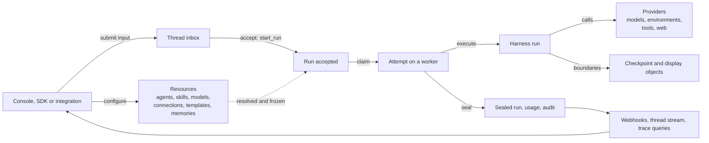

# Service overview

The a13n Service (`packages/a13n-service`, distribution and command `a13n-service`) is the hosted, multi-tenant runtime of Agent Foundation. Tenants configure agents and the resources they use, submit input to threads, and the Service turns that input into durable runs that the embedded Harness executes. It records each run's outcome as immutable facts and tells callers what happened. It serves a JSON HTTP API under `/api/v1` plus the operational probes `/healthz` and `/readyz`, and it ships as one image that runs in three process roles ([09](09-runtime.md#roles)).

## What the Service does

1. A caller authenticates as a principal with grants in an organization and its workspaces ([03](03-tenancy.md)).
2. The caller configures resources: agents and their immutable revisions, skills, provider accounts, models, environment templates, connections, assets and webhook subscriptions ([04](04-resources.md)), and memories ([11](11-memory.md)).
3. Input is appended to a thread's inbox. Acceptance selects a queued entry and creates the thread's next run, freezing the agent revision, pins, overrides and mounts it needs ([05](05-runs.md)).
4. A worker claims the run as a leased, fenced attempt and executes it through the Harness against the run's environments ([06](06-environments.md)) and the providers its resources select ([08](08-providers.md)). At each safe boundary it commits a checkpoint that makes the consumed input and the resumable state durable together.
5. Sealing records the terminal outcome, or a wait for approval, client tools or user input, and schedules any successor or parent delivery. Usage records, audit events, lifecycle webhooks, the provisional thread stream and trace queries report what happened ([07](07-facts-and-delivery.md)).

## Boundaries

The Service owns tenancy, configured resources, durable run ownership and history, environment instances created through providers, the memories agents keep across conversations, as files in its own database or as records in a Memory Provider's backend ([11](11-memory.md)), and delivery of what happened. It is API-only: it hosts no browser assets and exposes no product API on worker-only processes.

| Need                                                        | Served by                                                                                                                                                         |
| ----------------------------------------------------------- | ----------------------------------------------------------------------------------------------------------------------------------------------------------------- |
| A browser application for people                            | the [Console](../frontend/console.md), a separate application that uses only the public API                                                                       |
| Language SDKs and the remote CLI                            | independent repositories that consume the exported contract in `proto/a13n-service/` ([repository model](../repository-model.md#repository-surfaces))             |
| The agent loop, tool execution and provider implementations | the [Harness](../a13n-harness/README.md), embedded in executing processes; the Service registers its provider definitions and never implements a second catalogue |
| An environment daemon                                       | `a13n-envd`, reached over HTTP(S) as a connect-only external target ([06](06-environments.md#external-targets))                                                   |
| Chat platforms, schedules and event ingress                 | callers outside the Service, which submit input through the API and observe runs through the thread stream and webhooks                                           |
| Hosted AG-UI or A2A endpoints                               | not provided; the thread stream uses AG-UI events as its vocabulary, and input goes through the native API                                                        |
| Monetary budgets and billing                                | not provided; usage records carry price snapshots, and a distribution's admission policy may refuse paid calls ([09](09-runtime.md#extension-points))             |
| Trace storage                                               | the operator's trace backend, which the Service exports to and queries ([08](08-providers.md#trace-backends))                                                     |

## Readers

- **Contributors** find, next to each guarantee, the structure that carries it and the section that owns it, so a refactor cannot delete it as redundancy.
- **Coding agents** copy the nearest example. Conventions are therefore mechanical: package ownership, naming and import direction are fixed and checked ([02](02-layout.md)).
- **Client authors** of the Console and the SDK repositories read the API contract ([10](10-api.md)) and the exported schemas, and the chapters that own the behavior behind them.

Operators read the user documentation in `docs/a13n-service/`, including the generated configuration reference.

## Design principles

- **Layered packages.** Four business packages answer four questions: `tenancy` (who is asking and what they may do), `resources` (what the tenant configured), `runs` (how input becomes a sealed run) and `providers` (what the Service calls). They sit on shared mechanisms in `infra/`, depend in one direction, and are assembled once by `build_app` from a `Distribution` ([02](02-layout.md#import-direction), [09](09-runtime.md#assembly)).
- **One owner per rule.** Each rule is implemented once and every path calls it: `authorize` is the only scope and verb check, `start_run` the only function that creates runs, one worker predicate fences every execution write, one outbox delivers webhooks, child results and mail, one endpoint policy guards every outbound request, and one error type carries every refusal.
- **Constraints carried by structure.** Where a rule can be a database constraint, trigger, type or fence, it is one: immutable revisions, audit events and usage records; composite tenant foreign keys and same-scope provider triggers; status CHECKs; frozen configuration types; lease tokens, operation IDs and environment generations. Code paths that happen to be correct are not the guarantee.
- **PostgreSQL decides.** Run ownership, input consumption, credentials and every durable fact live in PostgreSQL. Redis only accelerates: claim wakeups, the provisional thread stream, discovery caches and best-effort rate limits. Losing it delays or degrades, never decides ([09](09-runtime.md#redis)).
- **Short transactions.** No database session, lock or transaction is held across model calls, tool calls, environment operations, object I/O or streams ([DEVELOPMENT.md](../../DEVELOPMENT.md#database-sessions-and-transactions)).
- **Frozen only what defines behavior.** A run freezes its agent revision, pins, override and mounts; everything else is resolved and authorized when used ([04](04-resources.md#two-lifecycles)).
- **Explicit uncertainty.** An external operation that may have taken effect without a known result is recorded as unknown and never blindly repeated: connection authorization steps, environment operations and connector actions ([04](04-resources.md#connections), [06](06-environments.md)).
- **Bounded work.** Every queue, payload, page, stream, deadline and retry has a finite setting or fixed bound, validated at load ([09](09-runtime.md#operational-limits)).
- **Typed extension seams.** A distribution adds routers, tables, migrations, settings, sweeps, provider definitions, grant sources, roles, an authenticator and an admission policy; it can restrict what core checks allow, never replace core validation or authorization ([09](09-runtime.md#extension-points)).

## Main concepts

| Concept                                  | Meaning                                                                                                                 | Owner                                                                 |
| ---------------------------------------- | ----------------------------------------------------------------------------------------------------------------------- | --------------------------------------------------------------------- |
| organization, workspace                  | the administration boundary, and the resource and work boundary inside it                                               | [03](03-tenancy.md)                                                   |
| principal, grant, API key                | a user or service account; a role in an organization or workspace; a bearer credential confined to one workspace        | [03](03-tenancy.md)                                                   |
| agent, revision                          | a head with immutable numbered configurations; a run executes exactly one revision                                      | [04](04-resources.md#agents)                                          |
| skill                                    | a revisioned package of instructions and files that agent revisions pin                                                 | [04](04-resources.md#skills)                                          |
| provider resource, model                 | a tenant-configured backend account; one upstream model served by a model provider                                      | [04](04-resources.md#provider-resources)                              |
| connection                               | a source of tools with one credential: a Remote MCP server or one account of a connector app                            | [04](04-resources.md#connections)                                     |
| environment template, environment, mount | the live configuration instances are created from; a sandbox instance; an environment attached to a thread under a name | [04](04-resources.md#environment-templates), [06](06-environments.md) |
| memory, memory mount                     | a workspace's tree of text files that agents read and write across conversations; a memory attached to a thread         | [11](11-memory.md)                                                    |
| session, thread, inbox                   | a group of threads; one independently advancing history; its queued input                                               | [05](05-runs.md)                                                      |
| run, attempt                             | one accepted advancement of a thread with one agent revision; one fenced execution of a run by one worker               | [05](05-runs.md)                                                      |
| checkpoint, display                      | the resumable state and the folded display items, committed together as immutable objects at each boundary              | [07](07-facts-and-delivery.md)                                        |
| usage record, audit event, webhook       | an immutable usage report; an immutable record of a change; a signed lifecycle delivery                                 | [07](07-facts-and-delivery.md), [03](03-tenancy.md#audit)             |
| provider definition, registry            | the Harness description of one backend type; the deployment's definitions by kind and type                              | [08](08-providers.md)                                                 |
| role, distribution                       | `all`, `control` or `worker`; what a build contributes to assembly                                                      | [09](09-runtime.md)                                                   |

The [glossary](glossary.md) defines every term the chapters use.
