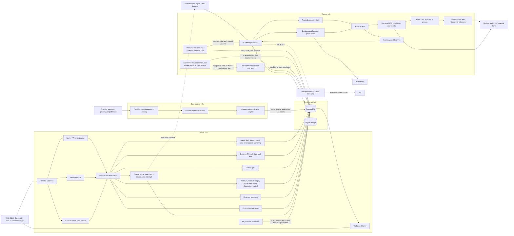
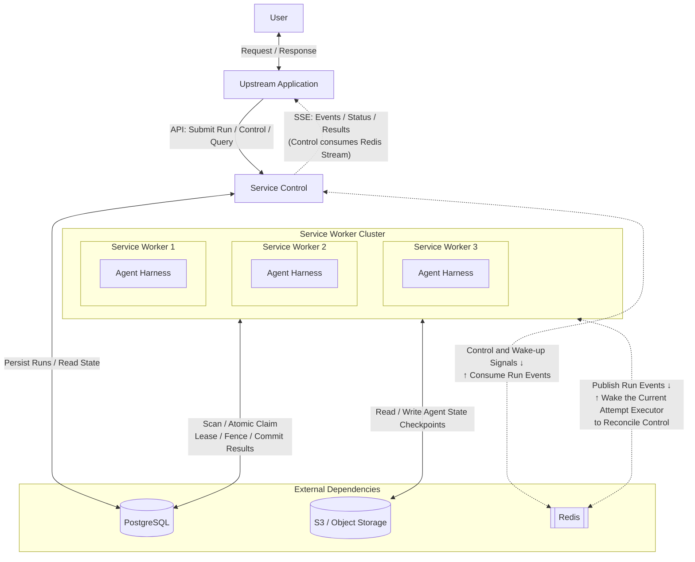
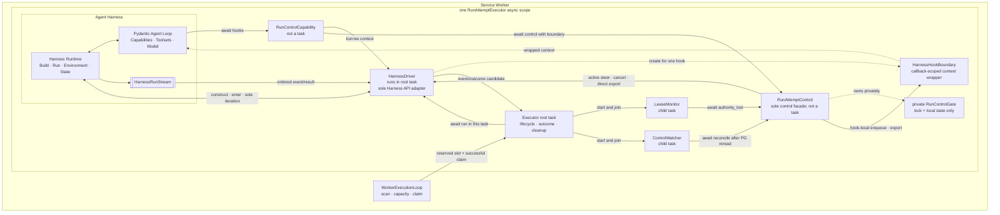
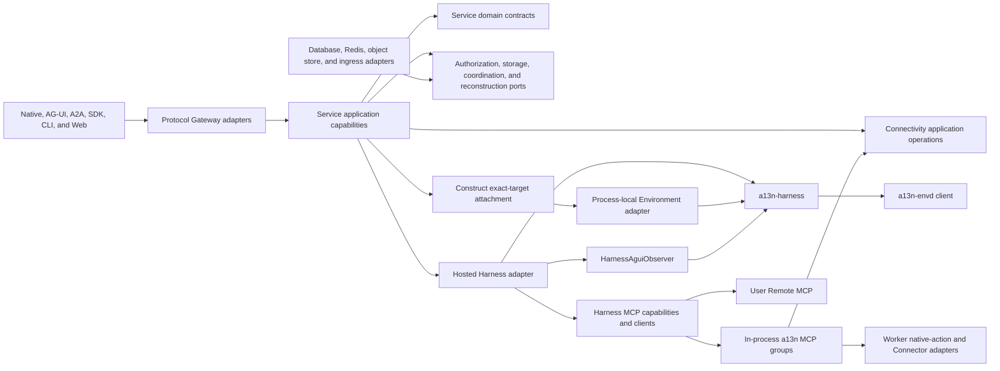

# a13n Service Architecture

## Design Position

a13n Service is the optional modular durable Host for Agent Foundation. It keeps one product schema, authorization boundary, executable package, and container image while assigning control, worker, and Connectivity data-plane work to separately scalable process roles under the shared [runtime contract](01-runtime-configuration-and-deployment.md). It does not split durable lifecycle ownership across microservices.

The shared [Platform Interaction Model](../interaction-model.md) owns `Session`, `Thread`, `Run`, and `Item`. Service persists each hosted Thread as an independent versioned relational resource, uses `Run` as the durable Agent-work, scheduling, recovery, state, outcome, and authority-Principal boundary, and uses `RunAttempt` as one replaceable fenced worker generation. Every Service-managed Agent invocation accepts a Run with one immutable User or Service Account Principal whose current authority is re-evaluated for execution; Service defines no separate durable Execution resource.

The Worker embeds the public Harness Python API and uses its startup-loaded [installed plugin catalog](36-installed-harness-plugins.md). Plugin code and dependencies update only through image rolling deployment. After reserving bounded local capacity, a winning claim starts one process-local `RunAttemptExecutor` root task with `LeaseMonitor` and `ControlWatcher` as its only Service child tasks. One non-task `RunAttemptControl` facade serializes local control through a private gate, while one non-task `HarnessDriver` runs in the root task and owns every Harness stream call. Each Capability hook borrows its raw Harness context only long enough for the driver to wrap it in a callback-scoped `HarnessHookBoundary`; the control facade receives only that boundary. The executor reconstructs process-local Agent values, materializes exact [managed Skill revisions](31-skill-management.md) as inert Environment content, and supplies a fresh ready or lazy operation object for the Run's fixed primary Environment. Explicit [live additional mounts](29a-websocket-environments-and-live-mounts.md) are separately accepted and applied at model-request boundaries; Control owns reverse-envd sockets while Worker proxies use a bounded Redis Stream operation relay. The shared Provider implementation prepares targets and connections. Service coordinates creation, resume, confirmed-loss rebuild, keepalive and separate stop/delete deadlines for idle and approval waiting; Harness only binds and closes local scopes. [Environment Management](29-environment-management.md) owns this lifecycle. Service supplies no hosted-process run capability: background shell uses the Harness Run-owned controller, receives active-Run completion readiness, and has no cross-Run lookup or idle wake. Redis delivery, Harness completion, AG-UI delivery, and telemetry are never durable completion authority.

The [configuration assistant](43-agent-configuration-assistant.md) is a system-maintained hidden Agent whose deployed file definition is frozen directly into accepted Run snapshots without assistant Revisions. Its configuration conversations reuse this execution pipeline and User authority. Each configuration Session owns one stable relational draft shared by its Threads; a separate user apply transaction publishes business Agent configuration. The assistant's bundled read-only knowledge mount is Host content, not a user-provisioned Sandbox or another execution engine.

## Architecture



PostgreSQL is the distributed authority for accepted resources, including immutable Asset publication records, eligible external-event admission and deduplication facts, Thread advancement and queue versions, head selection, queued submissions, the durable Thread inbox and its sequence and admission counters stored on the Thread row, Runs, fixed primary Run Environment selections, append-only additional mount associations and fenced application observations, actual Environment state/generations and lifecycle coordination, current RunAttempt generations, waiting pending summaries, and terminal outcomes. Ordinary steer and asynchronous results use one PostgreSQL acceptance-order FIFO. Each `WorkerExecutionLoop` discovers Run claim and takeover candidates from that durable state; each Worker Environment maintenance loop discovers due renewal, stop and delete candidates; each current Attempt executor reconciles pending inbox work from PostgreSQL, while control replicas scan pending asynchronous results for inactive-Thread advancement. Redis carries domain-owned live data flow, including each Run's stable bounded-replay message stream and each active Thread's expiring control-signal Stream plus optional target wakeup hints, and separately bounded reverse-envd operation request/response Streams; Redis publication or consumer-group progress never proves a relational transition, target claim, or inbox consumption. Shared object storage holds immutable Asset content plus the Run's complete conditionally replaced state, including exact pending requests, consumed inbox receipts, independently checkpointed display snapshot and its consumption cursor, and bounded large content. The detailed authorities belong to [External Connectivity](40-connectivity/README.md), [Asset Management](32-asset-management.md), [Durable Thread Persistence](11-thread-persistence.md), [Durable Run State](12-run-persistence.md), [Agent Control: Active Execution](19-agent-control-active-execution.md), [Agent Control: Queued Submissions](20-agent-control-queued-submissions.md), [Environment Providers, Templates, and Runtime Environments](29-environment-management.md), [Lifecycle and Stream Persistence](24-lifecycle-and-stream-persistence.md), and [Events, Interaction Projection, Usage, and Delivery](25-events-usage-and-delivery.md).

### Simplified Architecture Overview



- Workers coordinate Run execution ownership non-cooperatively through PostgreSQL
- Workers share Agent state through S3

### Service Worker-Harness Interaction



## Component Boundaries

| Concern                                                                 | Owner                                                                                                 | Relationship                                                                                                       |
| ----------------------------------------------------------------------- | ----------------------------------------------------------------------------------------------------- | ------------------------------------------------------------------------------------------------------------------ |
| Session, Thread, Run, and Item meaning                                  | [Platform Interaction Model](../interaction-model.md)                                                 | Service persists and authorizes its hosted representations                                                         |
| Runtime configuration, process roles, readiness, and drain              | [Runtime](01-runtime-configuration-and-deployment.md)                                                 | Starts one validated role composition                                                                              |
| OSS, EE, and Cloud application composition                              | [Distribution](02-distribution-composition-and-extensions.md)                                         | Selects capabilities without changing common domain meaning                                                        |
| Organization, Workspace, identity, and resource authorization           | [Service IAM](33-identity-and-access-management.md)                                                   | Applies to every public and internal product operation                                                             |
| Agents, immutable Revisions, stable managed Skill bindings, and Models  | Service control plane                                                                                 | Selects exact Agent inputs and freezes current Model and Skill configuration per Run                               |
| Immutable Workspace Assets                                              | [Asset Management](32-asset-management.md)                                                            | Publishes exact binary identity and supplies authorized Run input, output, and protocol references                 |
| Web Provider accounts and Agent selection                               | [Web Provider Management](41-web-provider-management.md)                                              | Control manages accounts; Worker composes independent Provider search/scrape and built-in fetch/download bindings  |
| Installed Harness plugins                                               | Worker build and process                                                                              | Durably prepares authored configuration once and validates it against the startup-loaded factory catalog           |
| Inbound event admission and outbound external tools                     | [External Connectivity](40-connectivity/README.md)                                                    | Connectivity handles inbound events; Workers execute local MCP groups and remote clients under shared authority    |
| Durable Thread resource                                                 | Service                                                                                               | Owns Session membership, origin, current Run, continuation head, and version                                       |
| Run and RunAttempt                                                      | Service                                                                                               | Own durable scheduling, state, fencing, recovery, and outcome                                                      |
| Queue-if-busy existing-Thread Run intent                                | [Queued Submissions](20-agent-control-queued-submissions.md)                                          | Accepts immediately when eligible or remains editable outside the Run DAG                                          |
| Thread inbox, steer, asynchronous results, and interrupt                | [Active Execution](19-agent-control-active-execution.md) and [Async Subagents](34-async-subagents.md) | Persists one cross-kind FIFO, binds waiting delivery, reconciles durable receipts, and uses Redis only for wakeups |
| Environment Providers, Templates and Revisions                          | [Environment Management](29-environment-management.md)                                                | Configured backends and versioned creation/preparation/retention recipes                                           |
| Actual Environment and Run selection                                    | Service                                                                                               | Workspace-scoped current target/generation, fixed Run selection and coordinated lifecycle                          |
| Environment keepalive                                                   | Worker and trusted retention capability                                                               | Leases one target and only extends bounded Provider retention while active Runs exist                              |
| Fresh Environment operation object                                      | Shared Provider implementation and Worker                                                             | Ready or transparently lazy access; Provider owns target preparation and connections                               |
| Process-local Agent composition and loop                                | Harness                                                                                               | Built by a trusted Service reconstruction adapter                                                                  |
| Current Environment mount set, provider-neutral operations, and routing | Harness                                                                                               | Enters fresh adapters and closes them non-destructively                                                            |
| Shell observation and active readiness                                  | Harness                                                                                               | Run-local observations; native recovery is Provider-owned; no Service process record or idle wake                  |
| Harness-to-AG-UI conversion                                             | `HarnessAguiObserver`                                                                                 | Service supplies visibility processing, retention, and delivery                                                    |
| Durable lifecycle events, Items, and usage                              | Service                                                                                               | Commits product facts independently from process-local observations                                                |
| RunAttempt tracing and authorized backend query                         | [Observability](38-observability.md) and [Trace Query](39-trace-query.md)                             | Export and read best-effort diagnostic projections without becoming domain authority                               |
| Native, Hosted AG-UI, and A2A public protocols                          | [Protocol Gateway](15-protocol-gateway.md)                                                            | Map distinct wire protocols to the same application and IAM authority                                              |
| Client-side effects                                                     | External client                                                                                       | Service authenticates feedback but does not claim the effect                                                       |

Service depends on the public Harness, Environment Provider, Agent Stream Protocol, and envd-client contracts. Those packages never import Service organization ownership, database, lifecycle, or API types. The selected [distribution](02-distribution-composition-and-extensions.md) can add capabilities through explicit narrow boundaries without replacing the common resource authorizer or durable Run/RunAttempt kernel.

## Process Roles

One artifact supports three independently deployable roles and their all-in-one composition:

- `all` owns control, worker, and Connectivity components in one process;
- `control` owns product APIs, authorization, and [domain-owned background work](07-control-background-tasks.md), including Connectivity management reconciliation, Thread recovery, outbox publication, and retention cleanup;
- `worker` owns `WorkerExecutionLoop` scanning and claim plus one structured `RunAttemptExecutor` root task per successful claim, including two child monitors, one control facade, one root-task `HarnessDriver`, Agent and Environment reconstruction, sole observation consumption, outbound tool composition and dispatch, and fenced publication; and
- `connectivity` owns provider event ingress, polling, and durable input admission through shared application operations.

These names describe deployment roles, not product resources. Connectivity remains an internal a13n Service module and process role, not a separate service or database. A `Run` remains the durable scheduled-work resource regardless of which role processes it. The [runtime contract](01-runtime-configuration-and-deployment.md) owns the complete component matrix, deployment profiles, readiness, and drain behavior. Worker- and Connectivity-only processes expose operational probes but no `/api/v1` product surface and never migrate the schema.

## End-to-End Interactive Run

```mermaid
sequenceDiagram
    participant Caller
    participant Control
    participant DB as Durable store
    participant Loop as WorkerExecutionLoop
    participant Executor as RunAttemptExecutor
    participant Provider as Environment Attachment Provider
    participant Harness

    Caller->>Control: submit Run with idempotency key
    Control->>Control: authorize, resolve Agent Revision and typed override into EffectiveAgentConfig
    Control->>DB: publish initial state and commit Thread advancement and Run
    Control-->>Caller: durable acceptance
    Loop->>DB: scan eligible Runs
    Loop->>Loop: reserve bounded executor capacity
    Loop->>DB: transactionally claim next compatible RunAttempt generation
    Loop->>Executor: start one async task with AttemptContext
    par lease renewal
        Executor->>DB: renew exact Attempt lease
    and control watching
        Executor->>DB: reconcile control after Redis wakeups
    end
    Executor->>Executor: validate state, dependencies, and current authority
    Executor->>DB: commit fenced preparation decision
    Executor->>Executor: reconstruct Agent and safe local inputs
    Executor->>DB: load fixed Run Environment selection and current state
    Executor->>Provider: construct ready or lazy operation object under template policy
    Provider-->>Executor: Environment adapter
    Executor->>Harness: call in-process API with RunBindings, adapter, and SkillManager
    Harness->>Harness: attach exact target and materialize exact Skills before Agent work
    Harness-->>Executor: observations, usage records, state, and result candidates
    Executor->>Provider: close process-local attachment in finalization
    Executor->>DB: publish fenced Run state/outcome
    DB-->>Caller: retained interaction and lifecycle delivery
```

The same `running` Run can receive another RunAttempt after an Attempt fails, yields at a complete graceful-handoff boundary, or its lease expires. A successful planned yield keeps heartbeat and lease renewal active until its transaction commits, terminalizes only the old Attempt, and resumes through a fresh Attempt and Harness Run from the same latest `state.json`. The stable Run Stream stays open and emits no false protocol terminal result. The takeover transaction marks an expired old Attempt `failed`; Service defines no Attempt `lost` state. A new Attempt always creates fresh process-local objects and a fresh Harness Run. Under the [Agent control input and continuation contract](18-agent-control-input-and-continuation.md), a waiting Run is sealed; authenticated Feedback or explicit waiting Continue accepts a new Run whose `parent_run_id` names that waiting Run. Waiting Continue supplies default deferred results and new input to the same first model request. Pending inbox delivery rolls through waiting and becomes visible only when the Service-owned awaited delivery hook runs after that request and any resulting tool batch. Retrying terminal intent likewise creates a successor Run rather than rewriting sealed records.

Schedules, webhooks, service requests, asynchronous children, and eligible automatic inactive-Thread asynchronous-result continuations accept Runs and follow the same authority-Principal persistence, Worker scan, RunAttempt, dispatch, Harness, state, and outcome contracts as interactive work. Active-Run asynchronous-result delivery creates no Run and instead shares ordinary steer's FIFO and durable receipt path in the current Run. Eligible pending delivery blocks completed sealing and can roll through waiting. Failure or cancellation suppresses child results originating from that Run and supersedes other pending delivery merely bound to it; a suppressed result can neither enter another Run nor trigger one.

## Dependency Direction



External applications call Service through Native HTTP/SDK, Hosted AG-UI, or A2A Gateway surfaces. The worker does not call the Harness through a a13n SDK or another service; it imports the Harness package and invokes its public process-local API directly.

## Independent Completion Boundaries

These facts advance independently:

1. a caller request is authenticated and authorized;
2. a Thread creation or versioned advancement, Run, and initial complete state are durably accepted;
3. a RunAttempt owns a live fenced lease;
4. Harness returns a process-local observation or candidate;
5. Service conditionally publishes complete Run state and commits a waiting or terminal outcome;
6. an Item, lifecycle event, AG-UI envelope, or external result is delivered;
7. immutable usage records are ingested; an optional external capability can price or bill them without changing their identity.

No later fact follows merely because an earlier fact occurred. In particular, a Worker scan result is not ownership, Harness completion is not durable completion, a tool observation or external effect absent from the latest complete checkpoint is not recoverable Run state, and event delivery is not usage ingestion or external settlement.

## Invariants

01. Service has one domain and authorization model across `all`, `control`, `worker`, and `connectivity` roles.
02. Session, Thread, Run, and Item follow the shared platform meanings; Thread owns versioned advancement selection, while Run and RunAttempt directly own durable scheduling and recovery.
03. PostgreSQL is accepted lifecycle authority; Redis carries coordination and bounded Run replay without becoming lifecycle authority.
04. One RunAttempt starts at most one logical Harness Run.
05. Process-local Python values, Environment adapters, entered facades, and native clients never become Service durable payloads.
06. No database transaction spans model, tool, provider, Environment, queue, stream, sleep, or other external I/O.
07. Every authoritative RunAttempt publication verifies the current generation and legal transition.
08. Product authorization remains outside Harness, Environment Provider, and envd peer-authentication logic.
09. Durable completion, projection, external delivery, usage ingestion, and any external settlement remain separate facts.
10. Public protocol adapters share application and authorization authority but retain independent wire identities, errors, and delivery contracts.
11. A queued submission owns no execution lease or outcome; only atomic consumption accepts the Run that later owns scheduling and recovery. Source sealing commits first; the same Worker then attempts first-entry consumption and successor acceptance in a separate transaction. Terminal relational state remains sufficient for periodic recovery scanning.
12. Graceful drain gates new claims while every active Attempt keeps renewing until an authoritative terminal commit or the drain deadline.
13. Planned `yielded` handoff preserves the running Run, state key, and stream, but its successor always receives a fresh RunAttempt and Harness Run.
14. Every distinct Asset publication creates an independent immutable Asset; Run references do not create another relation or Asset-specific continuation state.
15. Ordinary steer and async results share one PostgreSQL FIFO. Pending delivery blocks completed sealing and can roll through a waiting outcome to its direct successor, where an awaited Service Capability keeps it out of the successor's first model request. A failed or cancelled Run suppresses its own child results and supersedes other pending delivery bound to it; suppressed results cannot enter or create another Run.
