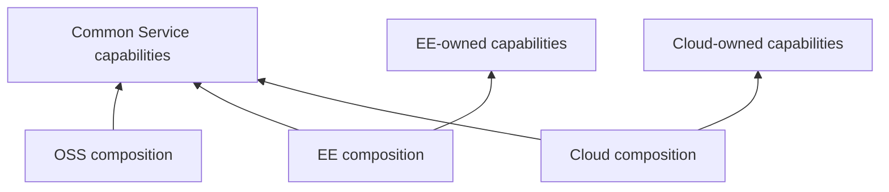
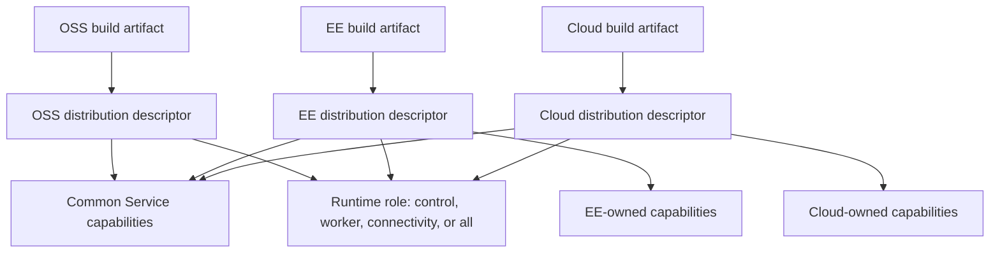

# Distribution Composition and Extensions

## Design Position

a13n Service is a modular monolith assembled explicitly at the executable boundary. A product distribution is the complete application composition embedded in one build artifact: it determines which APIs, role components, authorization contributions, configuration namespaces, relational models, and migration revisions exist in that service. The OSS distribution combines the common Service kernel with the capabilities accepted for OSS. EE and Cloud distributions combine the same common contracts with additional private capabilities without introducing edition conditionals into shared domain behavior or replacing the common authorization and durable Run/RunAttempt kernels.

A distribution identifies the product release composition, not where or for whom one process runs. It is not an organization resource, deployment environment, license decision, runtime plugin marketplace, row-level product plan, or process role. The distribution determines which capabilities exist; the runtime role determines whether one process runs the distribution's control, worker, or connectivity components, or their `all` union. Package presence alone never changes the running service.

## Boundaries

| Concern                                                                           | Common Service owner                   | Distribution owner                                            |
| --------------------------------------------------------------------------------- | -------------------------------------- | ------------------------------------------------------------- |
| Resource identity, Organization and Workspace scope fields, and lifecycle meaning | Owning common domain                   | Preserves existing meaning                                    |
| Authorizer and durable Run/RunAttempt kernel                                      | Common Service                         | Uses without replacement                                      |
| Included product capabilities                                                     | Exposes cohesive capability contracts  | Selects an explicit set                                       |
| Final configuration schema                                                        | Defines common sections                | Adds namespaced settings without reinterpreting common fields |
| HTTP surfaces and role components                                                 | Domains declare contributions          | Assembles the final conflict-free set                         |
| Relational models and revisions                                                   | Domains own model and revision meaning | Assembles one final metadata and migration graph              |
| License, entitlement, and placement policy                                        | Not a common domain field              | Owned by the distribution that supplies it                    |

Distribution composition does not define generic extension hooks for arbitrary Python code. A common capability exposes a narrow port only where an accepted distribution difference exists. Deployment Provider packages are one such narrow port: they can register implementations for the existing Environment, Model, Connector, Web, and Memory domains, but cannot contribute routers, authorization actions, relational models, migrations, role components, or configuration namespaces. Internal classes, installation order, and arbitrary import targets are not part of the product contract.

Service's [installed Harness plugins](36-installed-harness-plugins.md) supply trusted middleware selected through frozen Agent configuration. Selecting a plugin does not contribute Service routers, authorization actions, relational models, migrations, role components, or configuration namespaces. Those remain explicit build-time distribution contributions.

## Dependency Direction

Common Service code never imports EE or Cloud code. An EE or Cloud distribution depends inward on a compatible common Service release and imports only explicit public composition surfaces. The OSS composition is a sibling composition, not a superclass whose singleton-Organization behavior is inherited by commercial distributions.

Each OSS, EE, or Cloud build artifact fixes exactly one trusted distribution descriptor. Runtime configuration selects operational values and explicitly enabled installed Provider entry-point names; no CLI option, configuration field, environment variable, organization value, or license response selects the distribution or names an import target. Provider metadata enumeration imports only selected `a13n_harness.providers.plugins` entry points and cannot add a product capability. Automatic module scanning, filename conventions, and unselected import side effects never select a capability. A missing, invalid, or incompatible descriptor or selected Provider entry point fails the build or startup instead of silently falling back to OSS.

## Composition Contract

Before configuration parsing and runtime validation, the artifact's distribution descriptor declares one final set of:

- product routers and browser surfaces by process role;
- critical control, worker, and connectivity components;
- authorization actions, built-in grants, and accepted grant sources;
- relational models and migration revision locations;
- required storage and external capabilities;
- readiness requirements;
- trusted adapter registrations such as trace query providers; and
- distribution-owned configuration namespaces.

The declaration is data used for deterministic assembly, not a service locator. Domain application code receives explicit dependencies and does not query the distribution to decide ordinary behavior.

Duplicate route method and path pairs, component identities, authorization action keys, trusted adapter keys, relational table names, model registrations, or migration revision identities fail composition before resources open. A capability cannot override another contribution by registration order.

`all` receives the exact union of the artifact distribution's control, worker, and connectivity components. Composition deduplicates shared process resources and never constructs parallel schemas, authorizers, or domain models for those roles.

## OSS Composition

The OSS distribution includes the common durable Run/RunAttempt kernel and the OSS capability set defined by the owning domain specifications. It presents the singleton Organization behavior, local password identity, built-in roles, and other OSS policy without adding an `edition` decision to shared rows or use cases.

The OSS capability set includes the complete [Protocol Gateway](15-protocol-gateway.md). Its `control` and `all` roles always compose Native and Hosted AG-UI routers. It also contains the A2A adapter; the common runtime's single default-on `gateway.a2a_enabled` setting determines whether that adapter's routes and components are mounted. This operational setting neither installs a capability nor selects a distribution.

The OSS capability set also includes [Asset Management](32-asset-management.md): its Native router, authorization actions and role grants, `assets` relational model and migration contribution, object-cleanup control component, Worker-side input resolver, and trusted `AssetCapability` reconstruction. Asset availability is not selected by plugin installation, organization data, or an Agent-provided import target.

The common package contains the OSS composition and common capability implementations. It contains no empty EE or Cloud package tree, placeholder feature, license branch, or generic plugin administration surface.

The OSS composition includes the [Connectivity subsystem](40-connectivity/README.md) across its Control management, Connectivity inbound, and Worker outbound contributions. The [runtime role matrix](01-runtime-configuration-and-deployment.md#process-roles) determines where each registered adapter operates; outbound tool execution adds no MCP network listener. Built-ins and explicitly selected Provider packages register Connector Provider implementations by `type`. Each implementation owns its strongly typed configuration and safe schema description. Installing a package alone grants no trust, and selecting it cannot add a router, role component, action, table, migration, or authorization grant. Domain registries remain independent rather than becoming a universal Provider runtime.

## Deployment Provider Packages

An installed Python distribution can declare one or more named entry points under `a13n_harness.providers.plugins`. The deployment selects entry-point names through `provider_plugins.enabled`; it never supplies an import target. Each entry point explicitly declares the extension API version it was authored against as a fixed literal rather than deriving it from the installed Service. The Service compares that declaration with its supported version and rejects a mismatch before invoking the registration callback. Distribution name, distribution version, selected entry-point name, and registered domain type are separate identities. One selected entry point can register several types through the typed `environment`, `model`, `connector`, and `web` accessors.

The Service registers its built-ins through the same domain registration contracts and reserves their type identities. Registration supplies deterministic metadata, Pydantic schemas, and factories only. It performs no account, credential, database, or network I/O and creates no live client. Startup rejects duplicate enabled names, missing or ambiguous metadata entries, incompatible extension API versions, import or call failures, invalid definitions or schemas, and duplicate domain types. The completed catalogs are immutable process-local snapshots.

Management and execution roles load the same selected definitions from the same pinned packages and configuration. Each domain retains its own semantics: Environment Providers implement their existing lifecycle, Model Providers construct native Pydantic AI Providers for existing `ModelApiBinding` protocols, Connector Providers contribute reusable Harness `ConnectorProviderDefinition` values through `ProviderManifest.connector` and implement setup/discovery/connection runtimes, Web Providers implement search and/or scrape with explicit restricted-scrape support, and Memory Providers implement typed subject-scoped storage through the shared Harness `MemoryProviderDefinition` contract contributed through `ProviderManifest.memory`; it does not define a second Service factory. [Long-Term Memory](42-memory.md) owns managed Memory Provider identity, credentials, and content authority. Domain-owned scopes construct live collaborators and close them on partial initialization, failure, cancellation, and normal completion. A missing implementation never substitutes another type.

This mechanism is distinct from Worker-only `a13n_harness.plugins`. Provider packages make deployment-selected implementation types available to existing Service account and runtime paths; Harness business plugins add Agent-selected execution behavior and are not imported by Control to render schemas. Provider packages are trusted deployment code, not sandboxed organization uploads, hot reload, a marketplace, or a distributed catalog synchronization system.

## EE and Cloud Composition

EE and Cloud capabilities are additive vertical capabilities or implementations of an accepted narrow port. Typical variation boundaries include Organization lifecycle, external identity and grant sources, delivery providers, admission policy, usage processing, and distribution-operated control surfaces. An extension cannot reinterpret a common ID, weaken organization predicates, replace Principal meaning, bypass the common authorizer, or mutate Run or RunAttempt state outside the common durable operation and fencing contracts.

Installed capability and organization entitlement remain separate facts:

- composition decides whether code and infrastructure for a capability exist in the process;
- authorization or distribution policy decides whether a Principal or organization may use it.

Common resource rows contain no `edition`, `plan`, `license`, or placement discriminator. Distribution-owned entitlement or placement data lives in distribution-owned records and cannot grant authority by itself.

A distribution that requires license or operator configuration validates it before readiness. Invalid or missing required input fails closed; it never changes the selected application into another distribution.

## Configuration Composition

The artifact's distribution descriptor finalizes one typed configuration schema before the [runtime](01-runtime-configuration-and-deployment.md) parses values. Common section names and meanings remain stable. A distribution can add its own explicit namespace, but cannot shadow a common field or make an unknown common value valid under a different interpretation.

Secrets supplied for an extension follow the same redaction and process-local handling as common secrets. Configuration never installs code, names an arbitrary import target, or enables a capability absent from the artifact distribution. `provider_plugins.enabled` selects only metadata entry-point names already installed in the artifact and only for the five existing Provider domains.

A capability already fixed into the distribution can own an explicit operational surface setting. Such a setting can suppress that capability's routes and role components but cannot replace the distribution descriptor, introduce untrusted code, or change common domain meaning. The A2A total switch is one such common setting; no per-Agent protocol switch exists.

## Relational Composition

The artifact's distribution descriptor explicitly contributes every concrete relational model exactly once. The final metadata is the target schema for that distribution. Importing an installed package or storage helper never changes it.

Common and extension revisions participate in one final ordered graph with at most one head. Revision locations can remain package-owned, but they are assembled explicitly and do not become independently applied histories. A distribution release verifies that its complete graph upgrades from every supported predecessor and matches its complete metadata.

An OSS process fails closed when it encounters an extension revision or schema state outside its accepted graph. Removing an extension and starting a weaker distribution is not an automatic downgrade path. Backup, restore, upgrade, and forward repair preserve the matching distribution and schema identity.

The complete migration authority and application lifecycle are owned by [Relational Schema](04-relational-schema.md).

## Failure Semantics

| Failure                                                | Observable outcome                                                          |
| ------------------------------------------------------ | --------------------------------------------------------------------------- |
| Artifact distribution descriptor is missing or invalid | Build verification or startup fails before parsing deployment configuration |
| Common and distribution versions are incompatible      | Process exits before schema inspection or traffic                           |
| Contribution identity conflicts                        | Composition fails with the conflicting safe identity                        |
| Required extension configuration or license is invalid | Process remains unready and fails startup                                   |
| Final metadata and migration graph differ              | Build verification or startup fails closed                                  |
| Database contains an unsupported distribution revision | Schema compatibility fails; no automatic downgrade occurs                   |

## Compatibility

Each distribution release identifies the exact compatible common Service release range and one accepted final schema graph. Common contracts evolve additively where possible. Removing or reinterpreting a common resource, action, role contribution, route, or lifecycle transition is incompatible for every distribution that consumes it.

An extension can add a resource, action, route, table, event, or configuration namespace. It cannot reuse an existing identity with another meaning. Rolling deployments include only distribution versions explicitly compatible with the same adjacent schema states.

## Trade-offs

Explicit composition requires each distribution to enumerate its application surface and to reconcile migration branches before release. Service accepts that coordination cost because application contents, authorization, and schema remain reviewable and deterministic. It avoids the larger operational and security cost of ambient plugin discovery and scattered edition checks.

## Invariants

01. Each executable artifact contains exactly one trusted distribution descriptor before configuration parsing or runtime resource construction.
02. Common Service code never imports EE or Cloud code.
03. Package installation alone never enables a capability or changes a schema; a Provider entry point must also be explicitly selected.
04. A distribution composes one authorizer, one durable Run/RunAttempt kernel, one metadata registry, and one migration graph.
05. Duplicate contribution identities fail before startup.
06. Common rows contain no edition, plan, license, or placement discriminator.
07. Installed capability and organization entitlement are separate facts.
08. Invalid extension input fails closed and never falls back to OSS.
09. An extension adds behavior through an owned capability or narrow port and cannot reinterpret common contracts.
10. Every final distribution schema has at most one migration head.
11. Runtime input, organization state, license response, and Provider entry-point selection never select or replace the artifact's distribution.
12. Selecting an installed Harness plugin affects Agent reconstruction and never implicitly contributes Service distribution contents.

## Bot Application Contribution

Bot onboarding, installation observations, conversation memory, sharing, and reply evidence belong to the Bot application. Shared Run, Worker, subagent, Memory, and Connectivity implementations do not import Bot types, including type-only imports or compatibility re-exports. Final OSS composition explicitly supplies its routers, models, memory behavior, ingress acceptance contribution, target-deletion contribution and native-action observation factory. Provider inspection clients use shared typed installation/conversation facts. The ordinary Account owns identity and credentials, while Bot configuration has its own versioned owner.

Ingress contributions commit bindings and setup observations inside canonical acceptance transactions. Native observers retain required dispatch intent before external I/O and retain confirmed/rejected/unknown evidence afterward, even after Attempt authority is lost. Observation failure never authorizes blind resend. Deletion contributions invalidate the conversation in the same target-deletion transaction. Common transports neither identify Bot use cases nor import the application to perform these steps.

Bot-free verification assembles only shared metadata in a cold process with Bot imports blocked and uses its own generated single-head baseline. It runs ordinary acceptance, recovery, waiting continuation, Retry and both child modes. It never edits a global metadata registry to remove already-imported models. Its migration identity is incompatible with a Bot-bearing OSS database; switching composition is not an implicit schema downgrade. The production OSS history retains all supported historical revisions.
