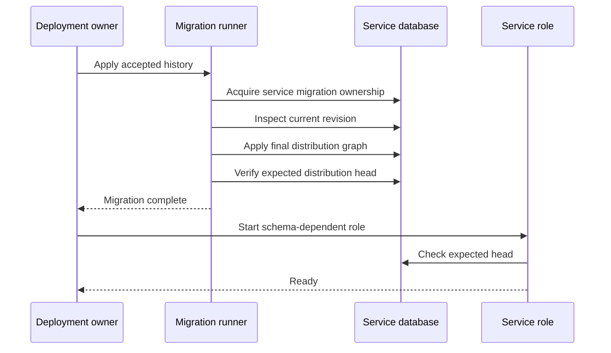

# Relational Schema Lifecycle

## Design Position

Each selected a13n Service distribution owns one final relational schema and one ordered migration graph for every domain table stored in its service database. A domain owns the meaning, invariants, and compatibility intent of its models and revisions. The [distribution](02-distribution-composition-and-extensions.md) owns their explicit assembly; the service owns transition of a deployed database from one accepted final schema state to another.

This lifecycle is separate from the generic [relational storage capability](03-storage.md#relational-storage). Storage constructs SQLAlchemy engines and short asynchronous sessions; it does not discover domain models, create tables, choose a revision, or mutate a deployed schema.

## Boundaries

| Concern                                       | Owner                                | Contract                                                                                                          |
| --------------------------------------------- | ------------------------------------ | ----------------------------------------------------------------------------------------------------------------- |
| Domain model and invariant                    | Owning Service domain                | Defines schema meaning and the application behavior that reads and writes it                                      |
| Combined relational metadata                  | Selected distribution                | Includes every common and extension-owned concrete model exactly once                                             |
| Ordered revision graph                        | Selected distribution                | Assembles the sole upgrade path for that distribution's service database                                          |
| Engine, session, and transaction construction | Storage capability                   | Supplies generic asynchronous relational access without schema ownership                                          |
| Revision generation and review                | Repository workflow and change owner | Produces a candidate from an empty database rebuilt through accepted history, then reviews its operational safety |
| Migration application                         | Deployment-owned migration runner    | Applies accepted revisions before a role accepts schema-dependent work                                            |
| Backup, restore, and database provisioning    | Deployment                           | Supplies and protects the database independently of application migrations                                        |

Domains and extension packages can own revision files and locations, but the artifact's distribution descriptor explicitly assembles them into one graph. They are never applied as independent histories inside one a13n Service database. The final graph has one compatibility fact for a process that uses several domains in one transaction.

## Metadata and Revision Authority

The final distribution metadata registry explicitly includes every concrete ORM model. Importing a storage helper, scanning installed packages, or discovering modules by naming convention never changes the schema. A model absent from the final registry is absent from migration comparison and is therefore not a deployed table for that distribution.

The artifact's fixed distribution descriptor supplies the resolved metadata registry and ordered revision locations to every schema operation. Revision generation, current-head verification, migration application, and readiness all consume that same resolved composition. The migration runner never reconstructs distribution contents from ambient imports, package installation, runtime organization state, or a separately parsed edition value.

The following internal Python shape is representative; concrete fields and invariants remain owned by the domain:

```python
from sqlalchemy.orm import Mapped, mapped_column

from a13n_service.database import Base


class DomainRecord(Base):
    __tablename__ = "domain_records"

    id: Mapped[str] = mapped_column(primary_key=True)
```

The owning model contribution is included explicitly in the final distribution metadata. Import order does not create a second history or transfer schema meaning to the database package.

The final revision graph has at most one head. Revisions normally form a linear chain. Every revision identifies its predecessor and contains both an upgrade operation and an intentionally reviewed downgrade or forward-repair position. A merge revision reconciles genuinely concurrent reviewed common or extension changes before release; runtime never chooses between competing heads.

The ordered revision history, not ORM metadata and not runtime `create_all`, is the authority for an existing database. Metadata describes the accepted target schema and supports comparison; it does not prove that an autogenerated operation is safe or complete.

## Backend Contract

The same migration history applies to the SQLite minimal-service profile and the PostgreSQL distributed-service profile. Revisions in the portable relational subset must produce equivalent constraints, indexes, defaults, and application-visible type behavior on both backends.

A schema feature that requires PostgreSQL-only types, locking, isolation, generated expressions, or DDL behavior declares PostgreSQL as a startup requirement for every domain that depends on it. The runner fails explicitly on SQLite before serving dependent work; it does not emulate the feature or silently omit the operation.

Migration application uses a dedicated synchronous database connection because it runs before service traffic or in a dedicated deployment job. Request and worker paths continue to use the asynchronous relational capability. The migration connection is never shared with the application pool.

## Generation and Review

A new revision is generated only after replaying the artifact distribution's complete accepted graph into a disposable PostgreSQL database. Autogeneration compares that database with the complete final metadata and produces a candidate revision. The candidate is then reviewed as executable deployment code.

Review verifies at least:

- complete model registration and a single revision head;
- explicit names for constraints and indexes;
- equivalent SQLite and PostgreSQL behavior for portable changes;
- table scans, rewrites, lock level, and statement duration;
- rolling compatibility with both the preceding and updated application versions;
- bounded, restartable handling for data movement;
- interruption, rerun, downgrade, and forward-repair behavior.

Large data backfills do not run as an unbounded startup migration. An accepted schema change uses additive expand-and-contract steps and a separately bounded, restartable backfill when the data volume or side effects require it.

## Application Lifecycle



A dedicated migration job may own application for a deployment. Otherwise, control or all-in-one processes may apply the artifact distribution graph before becoming ready. Concurrent PostgreSQL runners serialize through one service-scoped advisory lock with a bounded wait. Worker-only and Connectivity-only processes never apply migrations and fail closed when the database is not at the expected distribution head.

SQLite belongs to the single-process profile. One owning process applies history to a file-backed database before opening the service for work. In-memory SQLite cannot retain migration state across connections and is not a service migration target; SQLite files on NFS and multi-process migration coordination are also unsupported.

## Failure Semantics

| Failure                                                 | Observable outcome                          | Recovery                                                                                          |
| ------------------------------------------------------- | ------------------------------------------- | ------------------------------------------------------------------------------------------------- |
| Migration ownership wait expires                        | Process or job fails before readiness       | Resolve the active runner or increase the bound only through a reviewed rollout plan              |
| DDL lock or statement timeout                           | Revision stops and startup fails            | Remove the blocker, inspect database state, and rerun only when the revision is interruption-safe |
| Database loses connection before commit status is known | Revision outcome may be unknown             | Inspect the recorded revision and affected schema before retrying                                 |
| Database is behind or has an unknown revision           | Schema-dependent role fails closed          | Apply accepted history or restore a compatible database                                           |
| Multiple heads or missing common/extension model        | Generation and verification fail            | Repair the final distribution graph or metadata before release                                    |
| Database contains an unsupported distribution revision  | Every role fails schema compatibility       | Start a compatible distribution or apply an accepted forward path                                 |
| Unsupported backend operation                           | Dependent role fails before serving traffic | Select PostgreSQL or change the domain design to the portable subset                              |

A failed migration is never bypassed by stamping the database to a newer revision. Repair either safely reruns the accepted operation or introduces a reviewed forward revision based on observed database state.

## Compatibility

Application, distribution, and migration releases are compatible only across explicitly reviewed adjacent schema states. A rolling release must keep the preceding compatible distribution version functional during expansion and keep the updated version tolerant until contraction is safe. Removing a column, constraint, index, or interpretation requires evidence that every active and rollback-eligible application version has stopped depending on it.

Schema revision identity is internal deployment state, not a public API or domain-object version. Backup restoration must restore both relational data and the matching migration state; the runner then applies only accepted later revisions.

## Trade-offs

One final distribution graph creates a serialization point for otherwise independent common and extension changes. Service accepts that coordination cost because one database and one process can use several domains atomically and therefore require one unambiguous compatibility state. Domains retain ownership of schema meaning without owning competing applied histories.

Supporting SQLite and PostgreSQL constrains the default schema to a tested portable subset. A domain may choose stronger PostgreSQL behavior, but doing so narrows the supported deployment profile explicitly rather than creating weak local emulation.

## Invariants

01. Each artifact distribution has one combined relational metadata registry and one ordered migration graph.
02. A domain owns schema meaning; the service owns revision ordering and application.
03. Generic storage code does not import domain models or run migrations.
04. Runtime table creation never substitutes for revision history.
05. The final distribution revision graph has at most one head.
06. Portable revisions are verified on both SQLite and PostgreSQL.
07. PostgreSQL-only schema requirements fail explicitly in the SQLite profile.
08. Migration connections are synchronous, dedicated, bounded, and separate from asynchronous application pools.
09. Installed packages never change metadata or migration contents through discovery.
10. Worker-only and Connectivity-only processes check the expected distribution head and never mutate it.
11. Unknown, unsupported-distribution, or failed migration state blocks readiness and is never bypassed by automatic stamping.
12. Generation, verification, migration, and readiness consume the same artifact-fixed distribution metadata and revision graph.
