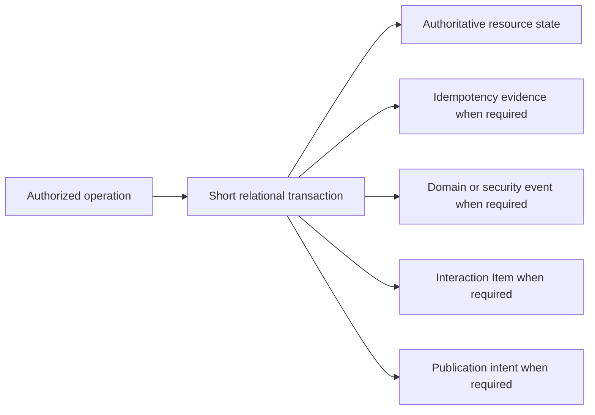
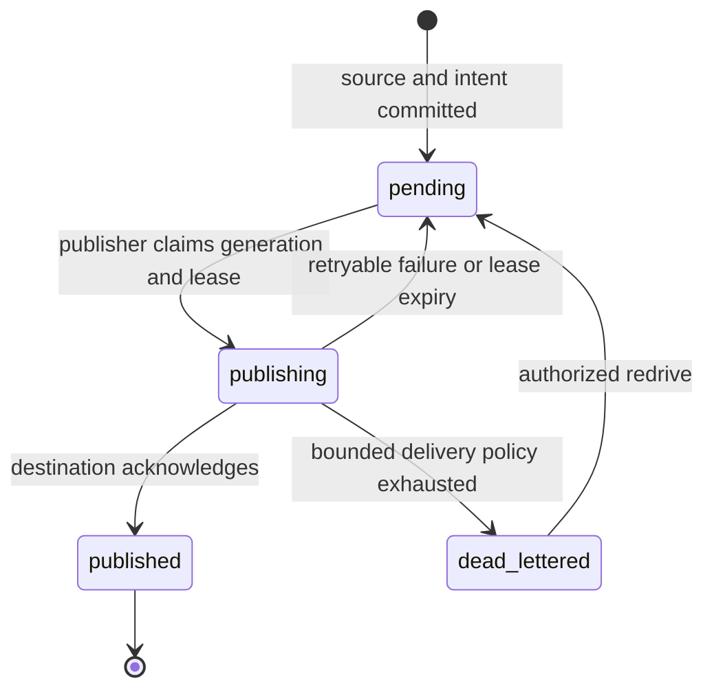

# Durable Operations and Outbox

## Design Position

a13n Service uses ordinary relational state as the authority for product resources. Durable commands combine concurrency control, optional idempotency evidence, domain events, Items when applicable, and outbox publication intent without turning the service into an event-sourced system or claiming exactly-once network delivery.

This contract owns the shared persistence and retry boundary. Owning domains continue to define which state changes are legal, which event or Item represents them, which authorization action applies, and which external effects require reconciliation.

## Boundaries

| Concern                                      | Owner                                                          | Relationship                                                     |
| -------------------------------------------- | -------------------------------------------------------------- | ---------------------------------------------------------------- |
| Current resource state and legal transitions | Owning domain                                                  | Remains authoritative                                            |
| HTTP concurrency and idempotency semantics   | [Platform API Conventions](../api-conventions.md)              | Supplies conditional mutation and `Idempotency-Key` behavior     |
| Shared operation persistence                 | This contract                                                  | Defines evidence, atomicity, and unknown-outcome handling        |
| Lifecycle event and Item meaning             | Owning event or interaction domain                             | Supplies bounded records for a committed transition              |
| Outbox claim and publication                 | This contract                                                  | Delivers committed intents with retry and deduplication identity |
| Delivery envelope, replay, and retention     | [Events, Usage, and Delivery](25-events-usage-and-delivery.md) | Exposes authorized retained and live sources                     |
| External provider or client effect           | Owning integration                                             | Supplies idempotency or reconciliation evidence                  |

The shared operation boundary is not a generic repository, application service base class, event bus, saga engine, or abstract unit-of-work framework. Domains use the canonical short relational transaction and focused helpers for the repeated evidence and outbox records.

## Conditional Mutation

A mutable resource normally exposes one monotonically increasing domain `version` when concurrent updates can be lost. A state-sensitive mutation compares the caller's expected version with the current locked resource version in the same short transaction that applies the change. An owning contract for an intentionally non-versioned mutable representation can instead compare a strong `If-Match` tag derived from the complete locked representation. A mismatch changes nothing and reports the owning conflict or precondition failure.

Immutable revisions and append-only records do not gain an artificial version. An ETag does not create addressable history or rollback. Internal worker publication additionally verifies the current RunAttempt ID and generation under the owning fencing contract; a matching resource version or tag does not bypass a stale worker fence.

## Idempotency Evidence

A retryable HTTP command identifies a request solely by its opaque caller key within the authenticated Principal, Workspace or Organization boundary, operation, and resource or parent scope. The key digest is non-reversible. Request content is not fingerprinted or compared for HTTP idempotency. The same scoped key selects the accepted result even if the retry supplies different content.

Service reauthorizes access and builds the response from retained business records using current projection logic. Mutable fields, versions, status, and derived values may differ from the first response. No original HTTP response snapshot is retained. Replay precedes new-mutation version, ETag, and semantic-input checks; ordinary transport/schema validation still applies.

| Operation shape                                                                                                                                                | Key owner                                                                                                |
| -------------------------------------------------------------------------------------------------------------------------------------------------------------- | -------------------------------------------------------------------------------------------------------- |
| Create an Agent, Session, Thread, Asset, Skill, upload candidate, Environment/template/command, mount, Account, target, Connection, authorization, or Bot test | The created business record                                                                              |
| Accept a Run                                                                                                                                                   | The accepted Run                                                                                         |
| Submit Thread input                                                                                                                                            | The accepted Run or queued submission; both branches serialize through the Thread                        |
| Enqueue and explicitly consume queued input                                                                                                                    | Creation key on the queued submission; consumption key on the accepted Run                               |
| Interrupt, discard a draft, or delete a Connection                                                                                                             | The terminal business record                                                                             |
| Steer                                                                                                                                                          | Its inbox entry                                                                                          |
| Apply a reviewed configuration                                                                                                                                 | Its immutable application record; additional keys for an already applied version use a minimal reference |
| Repeatable updates, lifecycle commands, or publication that may reuse an existing Revision                                                                     | A minimal scoped key-to-result reference in `idempotency_evidence`                                       |

The shared reference contains scope, key digest, result kind/reference, and creation time. It contains no content digest, response snapshot, or expiry. It is not an audit record, external-effect journal, or retention hold. External cleanup and test outcomes belong to the Connection or Provider that owns those business facts. An audit remains independent.

Keys have no time-based expiry and are not reusable after 24 hours. Their useful lifetime follows the owning business data. Ordinary deletion or collection may end deduplication; no tombstone, replay-specific retention pin, or reconstruction of deleted data is required. A missing result does not prove that its external effect never happened. Independently owned protocol identities, execution identities, security evidence, and object integrity digests retain their own contracts.

Preflight reads are hints. Final acceptance uses the owning resource lock and unique key constraint in the same short transaction as the mutation. A losing request rolls back every tentative business write before reading the winner. No reservation or database transaction spans external I/O. Where an effect follows acceptance, Service commits its business intent first and uses that operation's reconciliation rules; retrying its HTTP key does not redispatch the effect.

Raw keys and secret request content are excluded from logs, events, traces, and diagnostics. Workspace and Organization boundaries remain distinct replay scopes.

## Atomic Durable Commit

An accepted authoritative mutation commits one logical bundle in a short relational transaction:



The owning domain defines which publication intents belong to the source transaction. [Webhook Hook dispatch](26-hook-notifications.md#asynchronous-hook-dispatch) instead commits a lifecycle event with pending dispatch, then atomically creates its Outbox rows and marks dispatch complete in a background transaction. Other producers retain their owning atomicity rules.

If the transaction rolls back, none of its state, evidence, event, Item, or outbox records exists. A domain does not publish an authoritative event or retained Item before this commit. Authentication failures and denied attempts that have no resource mutation use the separate bounded security-audit path owned by IAM; audit failure never converts a denial into an allow.

Object upload, Redis publication, webhook delivery, provider calls, and other external I/O never occur inside the relational transaction. The domain stages external data when needed, commits only verified references, and owns cleanup or reconciliation if an external effect and relational selection diverge.

## Outbox Contract

An outbox intent names one committed source record and one publication class. It contains bounded routing metadata and references large or differently retained content rather than copying it. The source identity is stable across every publication attempt.

The shared PostgreSQL table is `outbox_records`. Its conceptual record is:

```python
class OutboxRecord:
    id: OutboxRecordId
    source_kind: str
    source_id: str
    destination_kind: str
    destination_ref: str
    status: Literal["pending", "publishing", "published", "dead_lettered"]
    available_at: datetime
    claim_generation: int
    lease_expires_at: datetime | None
    attempt_count: int
    created_at: datetime
    updated_at: datetime
    published_at: datetime | None
    dead_lettered_at: datetime | None
    last_error_code: str | None
```

Owning domains define the stable `source_kind` and `destination_kind` values. `destination_ref` identifies bounded configuration and contains no endpoint credential or Secret value. Outbox payload is derived from the immutable source record rather than copied as another authority.

`id` is the primary key and the stable external delivery identity when the owning delivery contract exposes one. The tuple `(source_kind, source_id, destination_kind, destination_ref)` is unique so a source-transaction retry cannot create the same destination delivery twice. Claim generations and attempt counts are non-negative. Lease fields exist only while `status = publishing`; `published_at` exists only for `published`; and `dead_lettered_at` exists only for `dead_lettered`. An index on `(status, available_at, id)` supports bounded due-row claims; destination-scoped indexes support authorized delivery inspection and redrive without changing source identity.



Control or all-in-one processes own outbox publication. Publishers claim bounded batches with lease or lock semantics, perform delivery outside the claim transaction, and record success or retry state in a new short transaction. Several publishers can overlap safely.

Publication is at least once:

- a publisher crash before delivery leaves the intent pending;
- a crash after delivery but before acknowledgement can deliver the same source again;
- consumers and delivery projections deduplicate by the stable source or delivery identity defined by their owning contract;
- an acknowledgement never changes the underlying domain transition;
- a permanent publication failure remains durable and observable rather than being dropped or marked delivered.

A claim increments `claim_generation`; completion succeeds only for the current generation. A crash or lease expiry can therefore duplicate delivery but cannot let a stale publisher record success. Retry preserves the same source identity and uses durable `available_at`. `published` means the configured destination acknowledged, not that an end user processed the event. Dead-lettering emits an operational and security-safe diagnostic, and an authorized redrive reuses the same record and source identity.

Published records remain for a bounded delivery-audit and duplicate-suppression horizon. Dead-lettered records remain redriveable only for a bounded configured horizon. An owning source or destination record cannot be removed while a retained Outbox record can still be delivered or redriven; after the owning horizon expires, cleanup can remove the delivery record and release those retention dependencies together.

The [control retention task](07-control-background-tasks.md#evidence-and-lifecycle-retention) periodically collects eligible records across Outbox source kinds. A delivery horizon releases only its own dependency; an owning operation's unfinished progress and other required evidence remain retained until their own completion and retention conditions allow deletion.

Redis Streams, Pub/Sub, SSE, WebSocket, webhook, and analytical sinks are delivery mechanisms, not relational transactions. Redis is a required distributed dependency, but successful Redis publication alone never proves that the source domain mutation committed. The owning delivery contract defines whether a Redis value is retained, replayable, or intentionally live-only.

Ordering is scoped, not global. An owning domain assigns a monotonic sequence where consumers require ordered replay for one resource or stream. Independent resources and publication classes do not share a fictitious total order.

## Worker Publication and External Effects

A worker can commit state, events, Items, usage evidence, and outbox intents only under the current RunAttempt fence. It does not bypass the relational commit by publishing a lifecycle result directly to Redis or a client.

Before an external effect can occur, the worker commits the owning dispatch boundary. After an unknown external outcome, it retries only when the same external idempotency identity or authoritative evidence makes repetition safe. Missing logs, Redis messages, telemetry, or receipts never prove that no effect occurred.

## Failure Semantics

| Failure                                              | Durable outcome                                                                     | Retry or reconciliation                                |
| ---------------------------------------------------- | ----------------------------------------------------------------------------------- | ------------------------------------------------------ |
| Validation or authorization fails before transaction | No mutation evidence or outbox intent                                               | Caller corrects intent or authority                    |
| Transaction rolls back                               | Entire logical bundle is absent                                                     | Retry only when the operation remains safe             |
| Response is lost after commit                        | Mutation outcome is unknown to caller                                               | Replay the same idempotency key or read authority      |
| Same key carries different request                   | Existing result is preserved                                                        | Project the existing result; never repeat the mutation |
| External effect outcome is unknown                   | Durable intent remains without invented result                                      | Use owning receipt or reconciliation                   |
| Publisher crashes before acknowledgement             | Source can be delivered again                                                       | Stable identity deduplicates downstream                |
| Redis or another sink is unavailable                 | Outbox remains pending; affected runtime is unready when the dependency is required | Restore dependency and resume bounded publication      |
| Permanent delivery rejection                         | Intent remains durably failed and observable                                        | Correct configuration or use owning repair operation   |
| Stale worker publishes                               | Fenced transaction rejects the mutation and outbox                                  | Current RunAttempt or owning domain decides outcome    |

## Compatibility

Domain resource meaning, version semantics, idempotency scope, canonical request meaning, source event identity, and command side-effect boundary are compatibility facts. Storage table layout, claim query shape, helper APIs, and batching strategy are internal when they preserve those facts.

Changing an idempotency scope or allowing a previously non-repeatable effect to replay requires an incompatible API or explicit migration contract. New publication sinks can be added without changing the committed source identity or making their acknowledgement authoritative.

## Trade-offs

The outbox adds relational records, publisher lag, and duplicate-delivery handling. Service accepts those costs to keep domain commitment independent from Redis and external availability. Keeping current resource state authoritative avoids event-sourcing complexity while still producing durable, replayable facts where domains require them.

## Invariants

01. Current relational resource state, not event replay, is the ordinary product authority.
02. Concurrency checks, idempotency evidence, mutation, and required outbox intent commit atomically when they belong to one accepted operation.
03. Idempotency replay resolves before the owning version or ETag comparison.
04. No relational transaction spans Redis, object storage, provider, client, or other external I/O.
05. Outbox publication is at least once and preserves one stable source identity across retries.
06. Publication acknowledgement never defines the underlying domain transition.
07. Worker-originated durable publication verifies the current RunAttempt fence.
08. Missing evidence never proves that an external effect did not occur.
09. Redis availability is required in distributed operation, but Redis delivery alone never proves relational commitment.
10. The shared operation contract does not introduce event sourcing, a generic repository, or a second unit-of-work abstraction.
