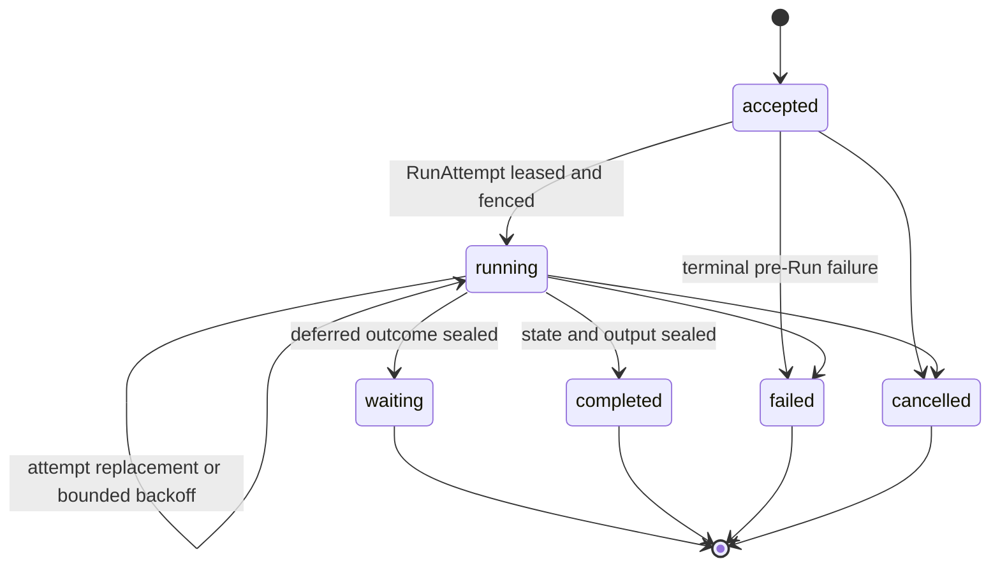
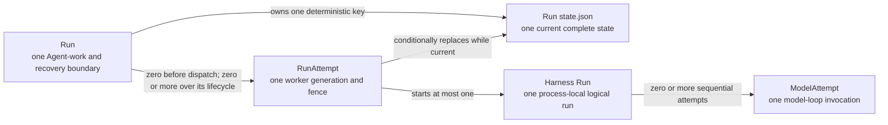
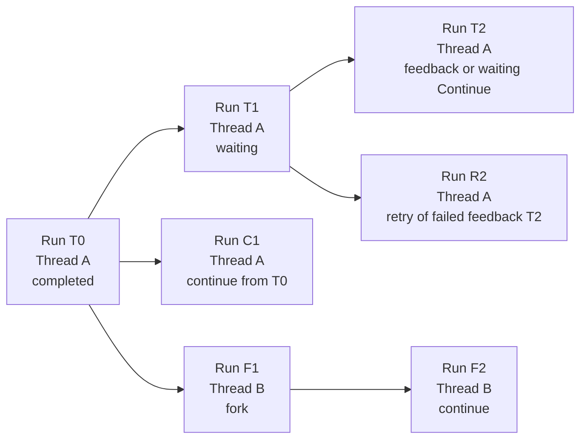
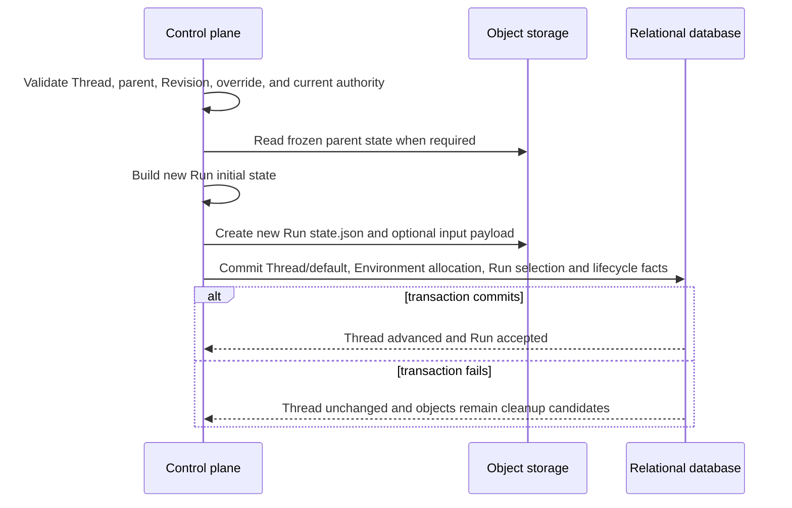

# Durable Run State

## Design Position

a13n Service persists each accepted Thread advancement as one relational `Run` row. The Run is the durable Agent-work, scheduling, recovery, and Git-like history boundary; it owns the parent edge, input, exact selections, finite execution budget, lifecycle, and sealed outcome.

| Dimension               | Core question                              | Service choice                                                                                                                                                                                                                                                                 |
| ----------------------- | ------------------------------------------ | ------------------------------------------------------------------------------------------------------------------------------------------------------------------------------------------------------------------------------------------------------------------------------ |
| Identity and boundary   | When are Run and RunAttempt created?       | The [Agent interaction and execution model](10-agent-interaction-and-execution-model.md#identity-allocation-boundary) owns the allocation distinction: accepted semantic work creates a Run, while first or replacement Worker execution creates a `RunAttempt` under that Run |
| Logical history         | How do Runs form history?                  | `parent_run_id` forms a Git-like DAG; the independent Thread row selects current and continuation-head Runs, continue preserves Thread identity, and fork creates a new Thread                                                                                                 |
| Persistence             | Where is a Run persisted?                  | Run metadata lives in the relational database; resumable state and large Run inputs and outputs live in object storage                                                                                                                                                         |
| Stored data             | What does a Run persist?                   | The Run row holds metadata, exact Agent selection, effective-config digest, and protected object references; `RunCheckpoint` holds complete immutable `EffectiveAgentConfig` plus Harness and Host continuation state; `RunPayloadEnvelope` holds large Run inputs and outputs |
| State advancement       | Which service instance can commit updates? | At most one worker service instance is lease-authorized through the current fenced `RunAttempt`; only its relational and conditional object writes can commit, while stale or partitioned instances are rejected                                                               |
| Completion and recovery | How do checkpoint, seal, and resume work?  | Checkpoint publication conditionally overwrites the object at the same key; relational sealing selects the exact candidate digest; recovery reads the complete checkpoint from the latest conditionally committed version of that same state object                            |

## Boundaries

| Concern                                                                     | Owner                                                                                   | Contract                                                                                                             |
| --------------------------------------------------------------------------- | --------------------------------------------------------------------------------------- | -------------------------------------------------------------------------------------------------------------------- |
| Session, Thread, Run, and Item meaning                                      | [Platform Interaction Model](../interaction-model.md)                                   | Defines public identity and relationships                                                                            |
| Thread row, Session membership, version, current Run, and continuation head | [Durable Thread Persistence](11-thread-persistence.md)                                  | Serializes accepted advancement and selects the exact resumable history head                                         |
| Portable messages, Capability namespaces, Environment data, and Thread ID   | [Harness State](../a13n-harness/10-snapshot-and-resume.md)                              | Supplies detached state without Host authority                                                                       |
| Run row, parent edge, state selection, and outcome                          | Service Run domain                                                                      | Forms the authoritative interaction history and Run-level recovery boundary                                          |
| Effective Agent configuration                                               | [Agent Management](28-agent-management.md#agentrunoverride-and-effective-configuration) | Owns the complete non-secret snapshot merged and resolved once at Run acceptance                                     |
| Connectivity selections and protected Ingress context                       | [External Connectivity](40-connectivity/README.md)                                      | Define accepted outbound accounts, remote endpoints, native action scope, and protected external context             |
| Environment selection, execution configuration, and Run binding             | [Environment Management](29-environment-management.md#run-binding-and-recovery)         | Owns the Run's immutable logical Environment and access, current backing generation and preparation/retention policy |
| Effective managed Skill selection                                           | [Service Skill Management](31-skill-management.md#agent-selection-and-run-locking)      | Defines AgentRevision binding policy and exact ordered Skill locks inside effective config                           |
| Managed Asset identity, content, publication, and deletion                  | [Asset Management](32-asset-management.md)                                              | Supplies immutable `asset_id` references used inside accepted input, output, or retained presentation                |
| Run scheduling fields and recovery-limit state                              | Service Run domain                                                                      | Stores durable eligibility and finite limits that Attempt admission consumes                                         |
| Worker generation, lease, and stale-writer fencing                          | [Run Attempts, Scheduling, and Recovery](13-run-attempt-scheduling-and-recovery.md)     | Authorizes one worker generation and preserves its immutable attempt audit                                           |
| Current complete Run state                                                  | One deterministic Run state object                                                      | Stores active Harness and Host state; waiting or completed sealing selects its exact frozen identity                 |
| Object storage operations                                                   | [Object storage](03-storage.md#object-storage)                                          | Supplies atomic whole-object publication and expected-version replacement                                            |
| Lifecycle events, stream messages, and Items                                | [Lifecycle and Stream Persistence](24-lifecycle-and-stream-persistence.md)              | Stores ordered facts, transports live observations, and retains presentation projections                             |
| Thread inbox entries and active steering                                    | [Agent Control: Active Execution](19-agent-control-active-execution.md)                 | Persists accepted active-Run input and couples consumption to one complete state checkpoint                          |
| Pending calls and approvals                                                 | Waiting Run plus its frozen Run state                                                   | Stores a bounded relational summary and the complete deferred value without a separate table                         |
| Tool work between complete checkpoints                                      | Latest complete Run state plus any tool-specific durable protocol                       | Generic recovery cannot reconstruct it; effectful tools own cross-crash idempotency or reconciliation                |
| Credentials and invocation authority                                        | Service Secret and policy boundaries                                                    | Resolves fresh authority; plaintext credentials never enter Run state                                                |

The shared [interaction model](../interaction-model.md) owns `Session`, `Thread`, `Run`, and `Item` meaning. Every Service-managed Agent invocation, including schedules, webhooks, and asynchronous children, accepts a Run; non-Agent maintenance uses its owning domain's work model. [`RunAttempt`](13-run-attempt-scheduling-and-recovery.md) remains a subordinate worker generation, and Service defines no generic `Execution` resource.

This is a Service Host policy above the Harness state API. Harness exports complete detached state but does not select or authorize a durable recovery point; Service selects only the conditionally committed value at the Run's deterministic state key.

## Durable Run Model

The following Python-like schema is conceptual. It defines durable field meaning rather than a public wire representation or concrete ORM class.

```python
type RunLineageKind = Literal["root", "continue", "fork"]
type RunInputKind = Literal[
    "agent_input",
    "waiting_feedback",
    "waiting_continue",
    "async_subagent_result",
]
type RunStatus = Literal[
    "accepted",
    "running",
    "waiting",
    "completed",
    "failed",
    "cancelled",
]
type RunWaitReason = Literal[
    "approval",
    "client_tool",
    "user_input",
    "multiple",
]
type PendingCallKind = Literal[
    "approval",
    "client_tool",
    "user_input",
]


class RunPayloadObjectRef:
    object_key: str
    digest_sha256: str
    size_bytes: int
    content_type: str
    schema_version: str


class EncryptedRunConfigPayloadRef:
    object_key: str
    ciphertext_digest_sha256: str
    protected_value_digest_sha256: str
    size_bytes: int
    encryption_key_id: str
    schema_version: str


class PendingCallSummary:
    call_id: str
    kind: PendingCallKind
    tool_name: str | None
    provider_type: str | None
    arguments_digest_sha256: str | None
    presentation: JsonObject | None


class RunPendingSummary:
    schema_version: Literal["1"]
    calls: tuple[PendingCallSummary, ...]
    resolution_policy: Literal["all"]


class RunUsage:
    schema_version: Literal["1"]
    model_requests: int
    input_tokens: int
    output_tokens: int
    tool_invocations: int
    billable_units: dict[str, int]


class RunUsageLimit:
    schema_version: Literal["1"]
    model_requests: int | None
    input_tokens: int | None
    output_tokens: int | None
    tool_invocations: int | None
    billable_units: dict[str, int]


class ExecutionBudget:
    policy_version: str
    max_attempts: int
    max_handoffs: int
    execution_deadline_at: datetime | None
    max_usage: RunUsageLimit | None


class SealedRunState:
    digest_sha256: str
    size_bytes: int
    content_type: str
    envelope_schema_version: str
    harness_schema_version: str
    checkpoint_seq: int
    committed_by_run_attempt_id: str | None


class Run:
    id: str
    version: int
    organization_id: str
    authority_principal: PrincipalRef

    session_id: str
    thread_id: str
    parent_run_id: str | None
    retry_of_run_id: str | None
    lineage_kind: RunLineageKind

    trigger_type: str
    trigger_entity_type: str | None
    trigger_entity_id: str | None
    parent_agent_instance_id: str | None
    delegation_id: str | None
    parent_tool_call_id: str | None

    agent_id: AgentId
    agent_revision_id: AgentRevisionId
    effective_agent_config_digest: str
    environment_id: EnvironmentId | None
    environment_access: EnvironmentAccess | None
    environment_use_started_at: datetime | None
    runtime_lock_digest: str
    model_execution_observation: ModelExecutionObservation
    connector_connection_selections: tuple[ConnectorConnectionRunSelection, ...]
    mcp_connection_selections: tuple[MCPConnectionToolSelection, ...]
    native_tool_contexts: tuple[NativeToolContext, ...]

    priority: int
    queue_name: str
    available_at: datetime
    current_run_attempt_id: str | None

    execution_budget: ExecutionBudget
    attempts_started: int
    attempts_charged: int
    handoffs_completed: int
    usage_charged: RunUsage

    idempotency_key: str | None
    request_fingerprint: str

    status: RunStatus
    wait_reason: RunWaitReason | None
    input_kind: RunInputKind
    input: JsonValue | None
    input_object: RunPayloadObjectRef | None
    input_text: str | None
    output: JsonValue | None
    output_object: RunPayloadObjectRef | None
    output_text: str | None
    failure: SafeFailure | None
    pending: RunPendingSummary | None
    sealed_state: SealedRunState | None

    created_at: datetime
    updated_at: datetime
    started_at: datetime | None
    waiting_at: datetime | None
    completed_at: datetime | None
    sealed_at: datetime | None
```

### Identity and Immutable Fields

`id` is the Service-owned Run identity and follows [Platform Data Conventions](../data-conventions.md). `version` is the positive Run object version used for compare-and-swap relational mutation. The state object key is derived from `organization_id` and `id`; it is not duplicated in the row and is never accepted from a caller.

`authority_principal`, `session_id`, `thread_id`, `parent_run_id`, `retry_of_run_id`, lineage, `input_kind`, accepted input, `agent_id`, `agent_revision_id`, effective-config digest, `runtime_lock_digest`, `model_execution_observation`, ConnectorConnection selections, MCPConnection selections, protected native tool contexts, accepted execution policy, idempotency identity, and request fingerprint are immutable after acceptance. Every version of the Run state must carry `run_id` and `thread_id` equal to the owning Run. Service rejects another identity rather than rewriting it during read.

`authority_principal` is the User or Service Account identity whose current product authority and principal-owned resource eligibility govern the Run. It is not necessarily the actor that later claims, retries, consumes queued work, or performs an internal reconciliation step. The Run stores only the stable `PrincipalRef`; it stores no browser session, API key, bearer value, credential ID, credential boundary, RoleBinding, role key, permission set, or authorization decision. Public acceptance, native Ingress acceptance, asynchronous child acceptance, waiting continuation, retry, and automatic successor acceptance assign or inherit this field under their owning contracts. No Run uses `system` as an authority Principal; an internal system actor remains audit attribution and must act for an explicit persisted User or Service Account.

The request fingerprint covers normalized semantic input, including omission versus explicit null for Environment selection. It is computed once before preparation and remains unchanged through acceptance.

### Configuration and Resource References

The exact `AgentId`, `AgentRevisionId`, complete `EffectiveAgentConfig`, and internal Plugin Runtime lock digest are fixed at Run acceptance. [Agent Management](28-agent-management.md#agentrunoverride-and-effective-configuration) owns configuration resolution; [Input and Continuation](18-agent-control-input-and-continuation.md#acceptance-and-lineage) owns operation-specific preservation or replacement. Run persistence stores the selected values without merging them again during state initialization or checkpoint replacement.

The [Model Management contract](30-model-management.md) owns the snapshot stored in `EffectiveAgentConfig.model` and the smaller `ModelExecutionObservation` stored in the Run row for public history. Neither value is Harness continuation state.

The [Environment Management contract](29-environment-management.md#run-binding-and-recovery) owns the meaning, selection, and use lifecycle of `environment_id`, `environment_access`, and `environment_use_started_at`. These fields live on the Run row independently of `EffectiveAgentConfig`; Environment state and backing generations live on the Environment record.

The [Service Skill Management contract](31-skill-management.md#agent-selection-and-run-locking) owns Skill selection and exact ordered locks inside `EffectiveAgentConfig.skills`. Run persistence stores those locks as part of the immutable effective configuration.

The [Connector Providers and Connector Connections contract](40-connectivity/03-connectors-and-connections.md#assignment-and-effective-selection) defines `ConnectorConnectionRunSelection`; [Remote MCP Connections](40-connectivity/06-remote-mcp-connections.md#tool-discovery-and-run-selection) defines `MCPConnectionToolSelection`; and [Agent-Facing External Tools](40-connectivity/04-agent-facing-tools.md#default-native-tool-contexts) owns `NativeToolContext` and default injection. Runs store empty tuples for absent connection selections or native contexts. Connection selections retain all-tools or explicit-name scopes and deferred-loading policy. Trusted entries independently freeze native contexts, including exact Account identity, execution Principal, allowed actions, and target authority. Neither stores tool schemas or credentials. Compatible Steers and continuations that inherit execution preserve both selections and contexts; replacement Attempts compose fresh capabilities under that same scope. New child Runs do not inherit parent native contexts.

### Input and Output

Exactly one of `input` and `input_object` is present. `input_kind` selects its owning protocol: `agent_input` stores the accepted [`AgentInput`](17-agent-input.md#agent-input-protocol), `waiting_feedback` stores the complete normalized [`WaitingRunFeedback`](18-agent-control-input-and-continuation.md#deferred-interaction), `waiting_continue` stores the composite [`WaitingRunContinueInput`](18-agent-control-input-and-continuation.md#waiting-continue-with-defaults), and `async_subagent_result` stores the exact [`AsyncSubagentResultInboxPayload`](34-async-subagents.md#asynchronous-child-runs) whose consumption accepted the Run. The [acceptance and lineage table](18-agent-control-input-and-continuation.md#acceptance-and-lineage) and [Async Subagents](34-async-subagents.md#asynchronous-child-runs) select the input protocol. `retry_of_run_id` records terminal-intent retry correlation under the acceptance contract; it is not another state or history edge.

At most one of `output` and `output_object` is present, and neither is present before a completed outcome. The `JsonValue` annotation is the storage encoding, not an open input schema. Inline values are bounded structured data suitable for direct Run reads. Oversized payloads use immutable objects. Retry copies the exact accepted descriptor value, publishes a new Run-owned payload envelope when that JSON is object-backed, and lets execution reacquire any required binary source for the new Run. `input_text` and `output_text` are optional bounded derived projections and never replace exact data, accepted source descriptions, or the complete message history.

An Asset-backed input stores its exact immutable `asset_id` inside accepted `AgentInput`; it does not copy Asset bytes or create an Asset snapshot. A completed output can contain a bounded [`AssetRef`](32-asset-management.md#asset-model) inside its owning JSON value. Service creates no Run-to-Asset relation or Run-owned Asset list. Retry preserves the same input Asset ID, while output references remain ordinary immutable outcome data.

### Execution Budget

Every Run can own zero or more immutable `RunAttempt` values over its lifetime, with at most one current and lease-authorized attempt. The [RunAttempt allocation contract](13-run-attempt-scheduling-and-recovery.md#runattempt-allocation-within-a-run) owns when those generations are created.

`ExecutionBudget` is the accepted execution-policy snapshot. `max_attempts` includes the first Attempt and every successor created after retryable failure, expired-lease takeover, or completed execution with pending input; a successor created after a planned handoff does not consume it. `max_handoffs` bounds successful planned handoffs independently. `attempts_started` counts every Attempt for audit, `attempts_charged` counts these non-handoff Attempts charged to the execution budget, and `handoffs_completed` counts committed `yielded` transitions. `execution_deadline_at` is a fixed UTC deadline, and `usage_charged` aggregates every Attempt, including known usage from yielded or failed work. Every counter and limit is non-negative. Missing required usage is never treated as zero; if durable usage evidence is insufficient to prove that a configured ceiling remains, no new Attempt is admitted. The Run row is the sole authority for whether another Attempt or planned handoff is permitted.

### Pending and Sealed State

`RunPendingSummary` is a bounded read and query projection, not a collection of mutable action rows. `resolution_policy="all"` means one accepted feedback or explicit waiting Continue finalizes the complete frozen set; partial responses never mutate this summary. The exact request values remain in the sealed Run state.

`waiting` is a sealed Run outcome. It contains a bounded `pending` summary; the frozen Run state contains the authoritative deferred requests and effective client-tool surface. Authenticated Feedback or explicit waiting Continue is the accepted input of a new Run whose `parent_run_id` names the waiting Run and whose state is initialized from that waiting state. Pending Thread-inbox delivery remains outside that input and binds to the successor under its separate FIFO.

`sealed_state` is absent while the Run is active. A `waiting` or `completed` sealing transaction always records the exact digest, size, schema versions, and checkpoint sequence of the state object frozen with the Run. A Worker-originated `failed` Run can record a complete state prepared under its fence or leave `sealed_state` null. An interrupt-driven `cancelled` Run always leaves it null because interrupt performs no object I/O. After any seal, no later object value is authoritative; only a recorded `sealed_state` selects bytes as part of the Run outcome. When a sealed state is present, its fields identify the exact terminal bytes without introducing a second base or result object. `committed_by_run_attempt_id` is null only when a relational fail-closed decision seals a Run without an attempt-originated state change.

### Run Lifecycle



`accepted` means the complete Run row, accepted input, exact selections, execution budget, scheduling fields, and initial complete state object are durable; no attempt is current; and a Worker may claim the Run once `available_at` is reached. It is only the initial pre-claim scheduling state. Once the first Attempt is created, that Run never returns to `accepted`. It is not a queued user-input entry, and Run defines no `queued` state.

`running` means execution of this Run has begun and the Run remains active. It normally selects one non-terminal `RunAttempt`; during retryable backoff, after a planned handoff, or while awaiting pending-input continuation it can temporarily have no current Attempt. An expired selected lease grants no worker authority while awaiting transactional takeover. `started_at` records the first Harness Run entry and never changes during recovery or planned handoff.

`waiting`, `completed`, `failed`, and `cancelled` are sealed outcomes. `sealed_at` and any available `sealed_state` are selected in the same relational transaction. A sealed Run never changes any column and its state key is never overwritten.

The Run remains the budget and lifecycle authority after attempt failure or lease expiry. The [Run Attempt recovery contract](13-run-attempt-scheduling-and-recovery.md#recovery-and-budget-enforcement) keeps structurally resumable, in-budget work `running` across replacement attempts and seals invalid, incompatible, non-retryable, or exhausted work as `failed`.

### Key Entity Relationships



The cross-layer identity-allocation decision is owned by the [Agent Interaction and Execution Model](10-agent-interaction-and-execution-model.md#identity-allocation-boundary). The RunAttempt contract owns how a Worker claim allocates a particular generation.

## Git-Like Run DAG

`parent_run_id` names the exact sealed Run whose frozen state initialized the new Run. It is the sole interaction-history edge. The operation-specific acceptance rules are owned by [Agent Control: Input and Continuation](18-agent-control-input-and-continuation.md#acceptance-and-lineage).



The persisted lineage has three forms: a root has no parent; a continuation preserves its parent's Thread ID; and a fork uses another Thread ID. Failed and cancelled Runs remain queryable but are not eligible state parents. Trigger and delegation fields record structural or causal child relationships independently of the state-parent edge. Worker resume adds no DAG node.

[Acceptance and Lineage](18-agent-control-input-and-continuation.md#acceptance-and-lineage) is the operation matrix for parent selection, accepted input, and execution Principal. It owns completed-head, waiting-head, null-head, Continue From, Fork, and Retry eligibility; [Async Subagents](34-async-subagents.md#asynchronous-child-runs) owns automatic-result eligibility. The [state initialization matrix](#state-initialization-matrix) below owns the transformation of the selected source into new Run-owned bytes.

[Durable Thread Persistence](11-thread-persistence.md) owns the versioned Thread row and its current/head selection. Thread existence and selection are never inferred from Run timestamps. The Thread row serializes every accepted advancement. Several retained Runs can share the same `(thread_id, parent_run_id)` and represent historical sibling continuations, but at most one Run in the Thread can be `accepted` or `running`. Acceptance locks the Thread, verifies its exact version and operation-specific current/head selection, then advances it atomically with the new Run. An explicit fork creates a new Thread row and first Run in the same transaction.

A lineage read follows `parent_run_id` from an explicitly selected head. It is organization-scoped, cycle-safe, and bounded. Created time and event order are not lineage authority.

The relational implementation uses one bounded recursive query, verifies that traversal reaches a root without a cycle or truncation, and returns at most 1,000 Run rows. Its recursive step runs once per ancestor. For `A` ancestors before a fork and `L` ancestors in the fork's local lineage, it visits `A + L + 1` rows in one database round trip, with `O(A + L)` work and temporary path state.

The public route, response, authorization, and failure contract are owned by [Run Lineage Read](16-management-api.md#run-lineage-read).

## Relational Run Table

The conceptual `Run` materializes as one row in `runs`; supported relational backends preserve the same validation and query semantics.

| Column group            | Columns                                                                                                                                                                                                                                        | Relational shape and contract                                                                                                          |
| ----------------------- | ---------------------------------------------------------------------------------------------------------------------------------------------------------------------------------------------------------------------------------------------- | -------------------------------------------------------------------------------------------------------------------------------------- |
| Identity                | `id`, `version`, `organization_id`                                                                                                                                                                                                             | Opaque text IDs; `id` is the primary key and `version` is the positive CAS version                                                     |
| Execution authority     | `authority_principal_type`, `authority_principal_id`                                                                                                                                                                                           | Immutable User or Service Account represented by this Run; never a credential or role snapshot                                         |
| Interaction lineage     | `session_id`, `thread_id`, `parent_run_id`, `retry_of_run_id`, `lineage_kind`                                                                                                                                                                  | Immutable state-source edge plus optional same-Thread terminal-intent retry correlation                                                |
| Scheduling              | `priority`, `queue_name`, `available_at`, `current_run_attempt_id`                                                                                                                                                                             | Durable claim order and the sole current worker generation                                                                             |
| Execution budget        | `execution_policy_version`, `max_attempts`, `max_handoffs`, `execution_deadline_at`, `max_usage_json`, `attempts_started`, `attempts_charged`, `handoffs_completed`, `usage_charged_json`                                                      | Accepted finite limits, complete Attempt audit count, and atomically charged recovery, handoff, and usage consumption                  |
| Idempotency             | `idempotency_key`, `request_fingerprint`                                                                                                                                                                                                       | Optional retry-safe acceptance identity and exact bounded request fingerprint                                                          |
| Source correlation      | `trigger_type`, `trigger_entity_type`, `trigger_entity_id`, `parent_agent_instance_id`, `delegation_id`, `parent_tool_call_id`                                                                                                                 | Bounded typed correlation; never state-lineage authority                                                                               |
| Agent selection         | `agent_id`, `agent_revision_id`, `effective_agent_config_digest`, `runtime_lock_digest`                                                                                                                                                        | Stable Agent, exact immutable Revision, complete effective-config identity, and internal Plugin Runtime lock selected at acceptance    |
| Environment selection   | `environment_id`, `environment_access`, `environment_use_started_at`                                                                                                                                                                           | Immutable logical Environment/access; first use is a separate execution fact                                                           |
| Model observation       | `model_execution_observation_json`                                                                                                                                                                                                             | Safe retained Model attribution; the complete snapshot remains inside state-owned effective configuration                              |
| Connectivity acceptance | `connector_connection_selections_json`, `mcp_connection_selections_json`, `native_tool_contexts_json`                                                                                                                                          | Immutable connection selections and protected default native tool contexts                                                             |
| Lifecycle               | `status`, `wait_reason`, `pending_json`                                                                                                                                                                                                        | Enum-constrained state; bounded pending summary exists exactly for `waiting`                                                           |
| Input                   | `input_kind`, `input_json`, `input_object_key`, `input_object_digest_sha256`, `input_object_size_bytes`, `input_object_content_type`, `input_object_schema_version`, `input_text`                                                              | Exactly one protocol-valid accepted input as inline JSON or an immutable object reference; explicit owner and optional text projection |
| Output                  | `output_json`, `output_object_key`, `output_object_digest_sha256`, `output_object_size_bytes`, `output_object_content_type`, `output_object_schema_version`, `output_text`                                                                     | Exactly one representation for completed Runs; absent otherwise                                                                        |
| Failure                 | `failure_json`                                                                                                                                                                                                                                 | Bounded safe structured failure only; no raw exception                                                                                 |
| Sealed state            | `sealed_state_digest_sha256`, `sealed_state_size_bytes`, `sealed_state_content_type`, `sealed_state_envelope_schema_version`, `sealed_state_harness_schema_version`, `sealed_state_checkpoint_seq`, `sealed_state_committed_by_run_attempt_id` | Exact frozen state identity for waiting/completed and valid failure snapshots; object key is derived rather than stored                |
| Time                    | `created_at`, `updated_at`, `started_at`, `waiting_at`, `completed_at`, `sealed_at`                                                                                                                                                            | UTC instants; lifecycle checks govern nullability                                                                                      |

Object-reference columns form all-or-none groups. Bounded values are validated before relational mutation; object keys and digests grant no authority.

`environment_id` is an optional same-Workspace foreign key to the actual Environment record; `environment_access` is present exactly when it is. Both are immutable after acceptance. `environment_use_started_at` is set once when execution acquires use, not at acceptance, and remains historical evidence after sealing. Retention considers use active only while the Run is running. There is no separate environment-binding table or duplicated target configuration. Indexes support finding active users across Threads for one Environment.

## Relational Constraints and Queries

The `runs` table follows the [Relational Schema Lifecycle](04-relational-schema.md) and preserves these constraints:

1. `id` is the primary key, `(organization_id, id)` is unique so parent references remain same-organization, `(organization_id, thread_id)` references one durable Thread in the same organization and Session, and a present retry source references a Run in that same organization and Thread.
2. `authority_principal_type` is `user` or `service_account`; acceptance validates that the referenced Principal belongs to the Run organization and is eligible for its Workspace. The polymorphic reference has no universal Principal foreign key, so every Attempt repeats domain referential and authorization validation. Immutable acceptance fields never change; versions, fences, checkpoint sequences, sizes, and recovery counters satisfy their positive or non-negative field bounds.
3. Input has exactly one inline or object-backed representation and matches `input_kind`. `retry_of_run_id` is null for start, ordinary or waiting Continue, continue from, feedback, automatic asynchronous-result acceptance, and fork and otherwise names a same-Thread failed or cancelled Run that was current at retry acceptance and whose accepted kind and value match the retry. Outcome fields satisfy their status-specific nullability, and output exists only for `completed`.
4. Every present sealed-state digest matches the selected envelope identity, checkpoint, and outcome candidate. It is required for `waiting` and `completed`; a `failed` Run can omit it, and an interrupt-driven `cancelled` Run does omit it. Sealed rows reject all relational updates. Active-control preconditions and inbox disposition follow the owning [race contract](19-agent-control-active-execution.md#completion-and-control-races).
5. `current_run_attempt_id` is absent for `accepted` and sealed Runs and can exist only for `running`. A `running` Run may omit it during bounded retry backoff, planned handoff, or pending-input continuation. User commands retain their expected-version preconditions. Attempt-originated updates read or lock current rows and require the selected Attempt number, Worker identity/build, Runtime lock, lease proof, unexpired lease, and operation-specific lifecycle preconditions; they do not carry cached expected Run or Attempt versions.
6. Parent, lineage, retry-source, and input-kind validation enforces the operation predicates in [Acceptance and Lineage](18-agent-control-input-and-continuation.md#acceptance-and-lineage) or [Async Subagents](34-async-subagents.md#asynchronous-child-runs). Every parent used for initialization has an eligible sealed state; failed and cancelled Runs are never state parents.
7. `attempts_charged` does not exceed `max_attempts`, and `handoffs_completed` does not exceed `max_handoffs`; the total `attempts_started` remains the complete audit count. Recovery, handoff, deadline, and usage limits remain Run-owned authority.

The accepted access paths are:

| Access path                              | Index or uniqueness contract                                                                                                           |
| ---------------------------------------- | -------------------------------------------------------------------------------------------------------------------------------------- |
| Worker claim and retry scan              | `(organization_id, queue_name, status, available_at, priority, created_at, id)` for `accepted` and current-attempt-free `running` Runs |
| Idempotent acceptance                    | Unique `(organization_id, idempotency_key)` when the key exists                                                                        |
| Session activity                         | `(organization_id, session_id, created_at, id)`                                                                                        |
| Thread activity and stable paging        | `(organization_id, thread_id, created_at, id)`                                                                                         |
| DAG successor traversal                  | `(organization_id, parent_run_id, id)`                                                                                                 |
| Retry correlation                        | `(organization_id, retry_of_run_id, id)`                                                                                               |
| DAG ancestor traversal                   | Unique `(organization_id, id)` parent lookup at each recursive step                                                                    |
| One active Run per Thread                | Partial unique `(organization_id, thread_id)` for `accepted` and `running`                                                             |
| One live or selected root Run per Thread | Partial unique `(organization_id, thread_id)` for `accepted`, `running`, `waiting`, and `completed` when parent is null                |

## Object Storage Schemas

All JSON objects serialize as UTF-8 RFC 8785 canonical JSON after typed values are converted to declared JSON strings. Digests and sizes cover those exact bytes. Non-finite numbers and duplicate object keys are invalid.

Service Run persistence uses these serialized object types:

| Object type          | Content type                                | Owner                                                   |
| -------------------- | ------------------------------------------- | ------------------------------------------------------- |
| `RunCheckpoint`      | `application/vnd.converge.run-state+json`   | One deterministic, conditionally replaced Run state key |
| `RunPayloadEnvelope` | `application/vnd.converge.run-payload+json` | Immutable oversized Run input or output                 |

[Lifecycle and Stream Persistence](24-lifecycle-and-stream-persistence.md) separately owns `RunReplaySnapshot`.

### Run State Object

Each accepted Run owns one `RunCheckpoint`. It combines Harness portable state with Host continuation required to resume the same Run or initialize a new Run from a selected parent. It contains data and correlation, never current authority.

```python
type RunStateCheckpointKind = Literal[
    "initial",
    "progress",
    "waiting",
    "completed",
]


class DeferredContinuationState:
    schema_version: Literal["1"]
    requests: JsonObject
    effective_client_tool_surface: JsonValue | None
    effective_surface_digest_sha256: str | None


class InboxReceipt:
    inbox_entry_id: ThreadInboxEntryId
    kind: ThreadInboxKind


class HostContinuationState:
    schema_version: Literal["2"]
    deferred: DeferredContinuationState | None
    inbox_receipts: tuple[InboxReceipt, ...] = ()


class RunStateOutcomeCandidate:
    outcome: Literal["waiting", "completed"]
    wait_reason: RunWaitReason | None
    pending: RunPendingSummary | None
    output: JsonValue | None
    output_object: RunPayloadObjectRef | None
    output_text: str | None


class RunCheckpoint:
    schema_version: Literal["2"]
    run_id: str
    thread_id: str
    checkpoint_seq: int
    checkpoint_kind: RunStateCheckpointKind
    last_checkpoint_run_attempt_id: str | None
    last_checkpoint_fence: int

    agent_id: AgentId
    agent_revision_id: AgentRevisionId
    effective_agent_config: EffectiveAgentConfig
    usage_limits: UsageLimits | None
    runtime_lock_digest: str
    harness_schema_version: str
    harness: HarnessState
    host: HostContinuationState
    outcome_candidate: RunStateOutcomeCandidate | None
```

This is the complete serialized outer schema. `HarnessState` is encoded through its owning public adapter and carries the same `thread_id`. `checkpoint_seq` starts at zero and increases monotonically for each successful semantic state replacement. The initial value has `checkpoint_kind=initial`, no attempt identity, fence zero, and no outcome candidate.

`effective_agent_config` stores the complete non-secret snapshot defined by [Agent Management](28-agent-management.md#agentrunoverride-and-effective-configuration). It remains byte-for-byte equivalent across checkpoint replacements, and its digest must match `Run.effective_agent_config_digest`. The separate accepted Connectivity selections and protected Ingress context remain immutable under their owning contracts. [Recovery Preparation](13-run-attempt-scheduling-and-recovery.md#recovery-preparation) revalidates references and current authority without rewriting the accepted configuration; [Skill retention](31-skill-management.md#agent-selection-and-run-locking) governs reconstruction from exact retained Skill packages.

`usage_limits` persists the accepted native Pydantic AI per-invocation ceiling separately from reusable Agent configuration. It is immutable across checkpoints and replacement Attempts. Child admission intersects the Harness plan with the parent and frozen edge limits. A continuation or fork retains that ceiling and can only narrow it; explicit Retry copies the source ceiling. Each Attempt supplies it to the Harness with its own usage accumulator. Durable cross-Attempt charging and execution budgets remain governed by [Run Attempt recovery](13-run-attempt-scheduling-and-recovery.md#recovery-and-budget-enforcement). `None` uses the Harness definition default.

Portable Harness Environment state is data, not authority over the Run row's Environment selection or the Environment record's current state and backing generation; their relationship is defined by [Run Binding and Recovery](29-environment-management.md#run-binding-and-recovery).

The first checkpoint after the accepted Run input has crossed a complete Harness input boundary advances `checkpoint_seq` above zero. `initial_input_applied` is derived as `checkpoint_seq > 0`; it is not serialized. Sequence zero receives the accepted Run input, while a positive sequence resumes from the exported Harness and Host state without injecting that input again. For `waiting_feedback` and `waiting_continue`, Service does not publish that first applied checkpoint until the isolated first model request and any resulting complete tool batch have reached the safe delivery hook. For `waiting_continue`, the one pending input application covers the complete default deferred results and the new `AgentInput` supplied to the same first model request. A crash before that checkpoint replays the complete feedback input, including both waiting-Continue components; recovery from an applied checkpoint supplies none of it again. Waiting-derived Thread-inbox delivery has separate receipts and remains pending in PostgreSQL until the Service-owned hook makes it eligible.

`checkpoint_kind=progress` contains no outcome candidate. `checkpoint_kind=waiting` or `completed` contains the matching complete `outcome_candidate`. A waiting candidate has a non-empty pending summary, no output, and complete deferred state in `host.deferred`. A completed candidate has an output representation, no pending summary, and no deferred state. The candidate is durable preparation for the relational outcome transaction; it is not a sealed Run outcome by itself.

`requests` is the exact serialized native Pydantic `DeferredToolRequests` value; Service classifies its approval, client-tool, and structured-user-input calls in the relational summary without reconstructing the native value from that summary. Its call IDs and kinds exactly equal the waiting pending summary. Service defines no additional provider-owned pending kind or Host-request collection. Provider-native public-message continuation remains a Harness/model-integration capability and does not become a Service waiting reason. Asynchronous child results remain independent Thread-inbox entries and never enter deferred state, impersonate the original spawn call, or enter `DeferredToolResume`.

`inbox_receipts` is the bounded receipt set for [`thread_inbox`](19-agent-control-active-execution.md#thread-inbox) entries incorporated into this Run. Each `InboxReceipt` stores the exact inbox identity and kind and corresponds to the Harness or Host continuation in the same envelope. Receipts persist across replacement Attempts of the same Run; new-Run initialization clears inherited receipts and records only entries consumed by that new Run. [Offer, Incorporation, and Durable Consumption](19-agent-control-active-execution.md#offer-incorporation-and-durable-consumption) owns provenance, process-local recording, compaction, receipt assembly, and recovery repair.

`RunCheckpoint` contains no Asset publication ledger, receipt, reference list, or Asset Capability namespace. When a successful `publish_asset` tool result has crossed a complete Harness checkpoint, its `AssetRef` can already appear in ordinary `harness` message history. The independent Asset row and selected content object remain publication authority whether or not that tool result was checkpointed.

The envelope separates three state classes:

| State class                   | Contents                                                                                                                      | Restore rule                                                                                  |
| ----------------------------- | ----------------------------------------------------------------------------------------------------------------------------- | --------------------------------------------------------------------------------------------- |
| Effective Agent configuration | Exact non-secret Model, Plugin, Skill, managed external-tool configuration, subagent, client-tool, output, and retry snapshot | Immutable for the Run; references and current authority are revalidated before reconstruction |
| Harness portable state        | Thread ID, messages, Capability namespaces, and portable provider-defined Environment data                                    | Validated by Harness and owning codecs after fresh mounts are selected                        |
| Host continuation state       | Optional complete native deferred-request values, effective client surface, and consumed inbox receipts                       | Validated and consumed by Service before or around Harness entry                              |

The envelope contains data and correlation only; current policy, credentials, live resources, and process-local objects are resolved afresh.

Harness and each deferred-value owner determine portable-state compatibility. The accepting [control operation](18-agent-control-input-and-continuation.md#acceptance-and-lineage) and [Environment contract](29-environment-management.md#run-binding-and-recovery) govern Environment selection and state clearing for a new Run; Run persistence applies those decisions without storing live resources or credentials.

### Run Payload Object

```python
class RunPayloadEnvelope:
    schema_version: Literal["1"]
    run_id: str
    payload_kind: Literal["input", "output"]
    payload_schema_version: str
    payload: JsonValue
```

For `payload_kind="input"`, `payload_schema_version` is the exact owning `AgentInput`, waiting-feedback, waiting-continue, or asynchronous-result schema version and `payload` is that protocol's complete accepted JSON value. It is not an independent extensible payload schema.

The object key is content-addressed beneath the Run:

```text
organizations/{organization_id}/runs/{run_id}/payloads/{payload_kind}/{digest_sha256}.json
```

[`BinaryContent`](17-agent-input.md#binary-source-and-delivery) in an accepted input retains only its normalized URL or Environment-path source description or exact immutable `asset_id`. Run payload objects never contain inline file bytes, an Asset body snapshot, or a public object-storage reference.

## Run Acceptance, Checkpoint, and Outcome Commit

The persistence protocol initializes a Run-owned state, publishes acceptance, admits a fenced writer, and conditionally checkpoints or seals the Run. Recovery uses the selected complete state under the same authority checks.

### State Initialization Matrix

The accepting operation supplies the authorized parent, lineage, exact configuration, and input under [Acceptance and Lineage](18-agent-control-input-and-continuation.md#acceptance-and-lineage). The control plane applies the corresponding source transformation:

| Selected state source         | Harness state                                                                            | Host deferred continuation                                                       |
| ----------------------------- | ---------------------------------------------------------------------------------------- | -------------------------------------------------------------------------------- |
| No parent                     | Create `HarnessState.new(thread_id=thread.id)`, including when the Thread already exists | Start empty                                                                      |
| Completed parent, same Thread | Copy the frozen parent and preserve `thread_id`                                          | Clear source outcome and deferred data                                           |
| Waiting parent, same Thread   | Copy the frozen waiting state and preserve `thread_id`                                   | Retain exact pending requests until the complete accepted resolution set applies |
| Completed parent, new Thread  | Apply `source_state.fork(thread_id=new_thread_id)` and clear portable Environment state  | Clear source outcome and deferred data                                           |

Every form stores the operation-selected input as pending and the complete selected `EffectiveAgentConfig` and Runtime lock in the new envelope. Configuration inheritance follows the accepting operation; initialization does not resolve or merge configuration. Environment selection and portable-state handling follow [Environment Management](29-environment-management.md#run-binding-and-recovery) and the accepting control operation.

Initialization of a new Run always writes a complete Run-owned envelope with `checkpoint_seq=0`. It does not reference the parent state as a base, retain the parent's outcome candidate as the new Run's outcome, or create another state field on the new Run. Parent state is only immutable source data for this initialization. It clears the parent's consumed-inbox receipts after applying any inbox value explicitly selected by the accepting operation; the new Run records only inbox entries that it consumes itself.

A [terminal-intent Retry](18-agent-control-input-and-continuation.md#retry-of-terminal-intent) initializes from its copied state-parent edge through this same matrix. The failed or cancelled intent source supplies no recovery state; a fresh Run-owned envelope and any object-backed input are published for the new Run.

Worker recovery can resume the same Run from its latest valid state object; `continue` and `fork` instead initialize a new Run from frozen parent state. The [Agent interaction and execution model](10-agent-interaction-and-execution-model.md#identity-allocation-boundary) owns that identity distinction, while [RunAttempt allocation](13-run-attempt-scheduling-and-recovery.md#runattempt-allocation-within-a-run) owns creation of each Worker generation. No state write for the new Run mutates the parent.

### Run Acceptance

Run acceptance creates or advances the Thread row together with the Run row and its initial state as one externally indivisible acceptance operation:

1. determine the operation's exact `authority_principal`, validate that Principal's current status and authorization together with Thread version, current/head selection, lineage, exact Revision, typed override, and any parent state; resolve and authorize the independent Environment choice or template revision without external I/O; then build the complete Run-owned initial state containing `EffectiveAgentConfig`;
2. publish object-backed input, and `state.json` create-only;
3. in one short transaction, insert or advance the Thread, allocate or revalidate the selected Environment record, insert the `accepted` Run with its fixed Environment ID/access, update the Thread default without acquiring target use, and commit required lifecycle facts, idempotency evidence, and outbox intents.



### State Key, Conditional Writes, and Fencing

Each accepted Run owns one complete state object at a deterministic key, stable for its lifetime. Service stores no separate `base_state`, `result_state`, or selectable checkpoint history:

```text
organizations/{organization_id}/runs/{run_id}/state.json
```

The content type is `application/vnd.converge.run-state+json`. Object metadata records `schema-version`, `run-id`, `thread-id`, `checkpoint-seq`, `writer-fence`, and the lowercase SHA-256 digest of the canonical body. Object stat supplies exact byte size and the opaque current object version.

Acceptance publishes the initial object create-only. A current attempt does not write until it has conditionally claimed the current object version for its monotonic Run fence. Every state replacement then supplies the exact object version returned by the claim or previous successful write. The replacement is visible as the complete new object or not visible at all.

Writer claim preserves the complete canonical state body, including `checkpoint_seq`, `last_checkpoint_run_attempt_id`, and `last_checkpoint_fence`. It advances the object metadata's `writer-fence` to the new Attempt fence and produces a fresh opaque object version even when the logical body is unchanged. Claim transfers write ownership without recording new Agent progress. Only a subsequent checkpoint advances the checkpoint sequence and body provenance.

Before each write, Service verifies that the Run remains unsealed and that the attempt ID, fence, lease, organization, and Run state version are current. It holds no database transaction across object I/O. Expected-version replacement serializes the object writes: after a newer attempt claims the key, an older attempt's known object version can no longer overwrite it. A conflict causes a fresh read of Run and object authority; it is never retried as an unconditional put.

Relational takeover and object claim are separate commits. An old Attempt's previously authorized in-flight checkpoint can win its CAS after PostgreSQL selects a successor but before that successor claims the object. The successor then rereads and claims the complete newer checkpoint. Once the successor's claim succeeds, the old token cannot replace it. Claim success requires a subsequent PostgreSQL authority check before recovery proceeds; neither a storage success nor local cancellation proves current lease ownership. After relational sealing, the recorded outcome remains authoritative under the `sealed_state` rules even if a prepared object write arrives late.

Service exposes no checkpoint object ID and never selects an older object version. A storage backend can retain physical versions internally, but those versions are backup or provider implementation details, not application-visible checkpoint objects. Logically, one Run has one key and one current state.

### State Writer Claim Retries

An Attempt claims the state object during preparation, before Harness entry or adoption of a recovered outcome. A transient network or object-store failure, including a timeout, or a conditional-write conflict does not immediately abandon the Attempt. The owner makes one initial claim attempt and up to three retries, for at most four claim cycles. Each cycle includes the required state read, validation, conditional publication and result reconciliation. All cycles retain the same RunAttempt ID, lease proof and fence; they allocate no new Attempt and consume no additional Run recovery-attempt count. State rereads, lease renewal and backoff do not reset this retry budget.

| Claim result or failure                                                                          | Required handling                                                                                           |
| ------------------------------------------------------------------------------------------------ | ----------------------------------------------------------------------------------------------------------- |
| Claim succeeds, or a lost response is reconciled to the exact claimed object                     | Revalidate current RunAttempt authority and continue from the confirmed complete state.                     |
| Transient network or object-store failure without confirmed success                              | Retry within the remaining claim budget and authority deadlines.                                            |
| CAS conflict while the Attempt remains the current authorized owner                              | Reread and validate the complete latest object, then conditionally claim that version under the same fence. |
| Deselected Attempt, expired lease, sealed Run, cancellation, or a higher observed writer fence   | Stop claim retries and follow the Attempt authority-loss or already-committed outcome path.                 |
| Invalid identity, digest, state structure, required schema or codec, or permanent access failure | Fail closed through the preparation-failure contract; do not retry as a transient conflict.                 |

Before the initial cycle and each retry, the executor revalidates current RunAttempt authority in PostgreSQL. No claim write proceeds while authority is unconfirmed. After a CAS conflict it reads the complete state body, metadata and matching object version and repeats the ordinary integrity, identity and compatibility validation. It never attaches a freshly read version token to stale state bytes. A writer fence greater than the Attempt's fence rejects admission. The complete object whose claim is confirmed, rather than the first object read, supplies the recovery state and next write token. [Recovery Preparation](13-run-attempt-scheduling-and-recovery.md#recovery-preparation) owns reevaluation of state-dependent preparation before execution or terminal commit.

A timeout or lost response is an unknown write outcome. Before another claim write, the executor reconciles the exact object body, metadata, digest, writer fence and version. Evidence that its own claim already succeeded completes the claim without another publication. If success cannot be established, only the ordinary validated read-and-CAS path can retry; it never issues an unconditional put or treats another writer's object as its own successful receipt.

Each storage request and reconciliation read has a finite timeout, and retry cycles use bounded cancellation-aware backoff. The complete sequence has a finite total deadline distinct from one request timeout. Requests and backoff remain within the latest confirmed lease authority and any earlier recovery or drain deadline, leaving time for fenced failure finalization. The executor's existing lease monitor runs throughout state reads, writer claim, reconciliation and retry waits under the [Harness integration contract](14-harness-runtime-integration.md#runattempt-executor-lifetime). A renewal failure or earlier authority deadline preempts unused retries; renewal does not extend the total claim-retry deadline.

Retry exhaustion and non-authority deadline expiry follow the [Attempt preparation-failure contract](13-run-attempt-scheduling-and-recovery.md#recovery-and-budget-enforcement). An owner that can still confirm authority records the classified failure and releases the selected Attempt through a fenced transaction. It does not merely stop its local task and leave a renewable `leased` Attempt until expiry. If PostgreSQL is unavailable or authority is lost, the executor stops claim writes, performs bounded cleanup and leaves recovery to authoritative reconciliation or lease expiry. This policy applies only to pre-Harness state writer admission; it does not authorize replay of Agent model or tool effects or refreshing a checkpoint's version token after a conflicting write.

### Checkpoint Triggers and Refresh

During an active Harness Run, Service requests a progress checkpoint only at a complete public state boundary:

1. after the accepted Run input has crossed the Harness input boundary and before the first model request, except that waiting Feedback and waiting Continue defer their first applied checkpoint until the isolated first-request hook boundary;
2. when flushing recorded Thread-inbox incorporation under the [inbox-consumption flow](19-agent-control-active-execution.md#offer-incorporation-and-durable-consumption);
3. after a complete tool batch and its results have entered the next complete message boundary, before another model request;
4. between internal `ModelAttempt` values when the Harness exposes a new complete normalized state.

A waiting or completed Harness outcome always triggers its matching outcome checkpoint. Raw stream deltas, an in-flight model response, an incomplete tool batch, an active inline child, a lease heartbeat, and elapsed time alone never trigger state publication. Adjacent progress triggers with no Harness or Host state change are coalesced rather than creating duplicate checkpoints.

[Active Execution](19-agent-control-active-execution.md#offer-incorporation-and-durable-consumption) owns when recorded inbox incorporations must enter a checkpoint, including compaction and event-delivery independence. Those rules use the complete checkpoint boundaries defined here.

A graceful-handoff request reaches state persistence only at a complete boundary selected by [Service–Harness Runtime Integration](14-harness-runtime-integration.md#safe-boundaries-and-corresponding-hooks). At that boundary, state persistence publishes or reuses one ordinary complete progress checkpoint; [RunAttempt planned handoff](13-run-attempt-scheduling-and-recovery.md#graceful-handoff-transaction) owns request observation, continued lease authority, local quiescence, and the `yielded` transaction. A handoff creates no checkpoint identity or relational checkpoint selection; persistence confirms only the latest conditionally published complete state at the ordinary Run key.

#### Conditional Publication

Service writes state only after `HarnessRunStream.export_state()` produces a complete structurally valid state and Host continuation has been serialized under its bounds. Raw token deltas, incomplete private graph nodes, live `RunBindings`, Environment adapters, entered facades, and process-local handles never enter the object.

During execution, a checkpoint operation:

1. exports complete Harness state and obtains the matching bounded Host state, including receipts assembled under the [active-control contract](19-agent-control-active-execution.md#offer-incorporation-and-durable-consumption), as one coherent envelope;
2. validates current Run, attempt, fence, lease, and expected object version;
3. conditionally replaces the same `state.json` with the next checkpoint sequence and matching metadata;
4. reconciles an unknown publication result when necessary, revalidates current Attempt authority, and treats only the confirmed publication's object version as the next valid write token.

A checkpoint publishes the complete continuation and all corresponding `InboxReceipt` receipts atomically in the same envelope. A receipt cannot be published separately from the state it describes or paired with another continuation. The [active-control contract](19-agent-control-active-execution.md#offer-incorporation-and-durable-consumption) owns receipt validation, FIFO consumption, recovery repair, and terminal races; object publication alone does not mark an inbox entry consumed.

Checkpoint writes do not create a Run row, attempt row, lifecycle transition, or historical checkpoint selector. A failed or unknown put is reconciled by `stat` and exact body validation before any retry.

### Outcome Sealing

#### Common Transaction Requirements

Every Run-sealing path, including waiting, completion, failure before execution, and cancellation, includes [inline Hook expiry](26-hook-notifications.md#inline-subscription-lifetime) in the same relational commit after final lifecycle-event matching. Hook configuration and its inheritance retention remain owned by the subscription head and Revisions, not by Run input or state. Attempt recovery and handoff that leave the Run unsealed preserve its subscription.

A Run outcome commit applies the [active-control outcome precondition and pending-delivery disposition](19-agent-control-active-execution.md#completion-and-control-races). This contract selects receipts already present in the complete state and seals the matching Run candidate; the active-control contract owns completed-outcome blocking, waiting rollover, suppression, and supersession of Thread inbox entries.

#### Waiting and Completed

A waiting outcome and a completed outcome without a prepared queued successor commit in this order:

1. publish any immutable object-backed output;
2. conditionally replace `state.json` with a complete matching outcome candidate;
3. in one short transaction, revalidate current Run and `RunAttempt`, satisfy the [active-control outcome precondition](19-agent-control-active-execution.md#completion-and-control-races), reconcile inbox receipts from the selected state, select the candidate's exact digest and checkpoint sequence as `sealed_state`, copy its bounded output or pending summary into the Run row, terminalize the attempt, charge known usage, append lifecycle facts, verify that this Run is still the Thread's current Run, release any acquired Environment use and update its aggregate retention condition, seal it, select it as the continuation head, and increment the Thread version;
4. after commit, reject every later write to the state key.

#### Failed and Cancelled

A transaction that seals a Run as failed or cancelled retains its immutable effective configuration and Environment selection. It releases acquired Environment use and updates retention in the same transaction, and applies the terminal inbox and asynchronous-result disposition owned by [Active Execution](19-agent-control-active-execution.md) and [Async Subagents](34-async-subagents.md). A never-used lazy Run has no use to release.

A Worker-originated failed outcome can select a complete state already prepared under its current fence. An interrupt-driven cancelled outcome performs no object I/O and selects no new sealed state; its `sealed_state` is null. Either terminal transaction verifies that the Run remains current, preserves it as the Thread's current Run, preserves the prior continuation head, and increments the Thread version. Neither outcome makes that Run eligible as a parent.

#### Completion with a Queued Successor

A completed outcome with queued intent can instead use the [state-first combined handoff](20-agent-control-queued-submissions.md#completion-time-combined-handoff). Run persistence publishes the source outcome candidate and, when consumption remains eligible, the prospective successor's complete initial state before that transaction; it permits no accepted successor without valid initial state. The queued-submission contract owns detached preflight, queue ordering, three-way failure classification, atomic consumption or terminal queue failure with source sealing, and fallback recovery; the [Thread contract](11-thread-persistence.md#head-and-current-runs) owns the resulting head, current, and version effects.

Transactions that seal a Run and accept a successor atomically release prior acquired Environment use and record the successor selection under [Environment use and retention](29-environment-management.md#retention-policy). They use the canonical Thread/Run/Attempt then stable Environment-ID lock order before inbox/queue locks. The Environment owner defines acquisition, idempotent release, and aggregate active/idle conditions.

#### Uncommitted Outcome Candidate

If the object write succeeds but the relational transaction does not commit, the Run remains active and the outcome candidate remains a valid resumable state, not a sealed outcome. The current attempt or an authorized later attempt can retry the exact relational commit after reconciliation. Object timestamps or listings never authorize that adoption.

### Resume Semantics

After the [RunAttempt allocation contract](13-run-attempt-scheduling-and-recovery.md#runattempt-allocation-within-a-run) authorizes a later generation for the same Run, the Worker validates and claims the existing state key and completes [Recovery Preparation](13-run-attempt-scheduling-and-recovery.md#recovery-preparation) against that confirmed complete state. It reconciles existing inbox evidence before new delivery or execution and selects one continuation branch:

- `checkpoint_seq=0` starts from the initialized state and supplies the Run's exact accepted input; for `waiting_continue`, that one application supplies both the normalized default `DeferredToolResume` and the accepted `AgentInput` to the first model request;
- `checkpoint_seq>0` resumes from the checkpoint without supplying the accepted input again;
- a valid waiting or completed outcome candidate can be committed idempotently without repeating model or tool work when its relational outcome was not yet sealed.

State is authoritative for execution continuation, including applied input, retained inbox evidence, and an unsealed outcome candidate. PostgreSQL remains authoritative for current ownership, lifecycle, inbox disposition, queue state, budgets, and Environment use; recovery does not roll those facts back to checkpoint time. In particular, already charged model requests and known usage remain charged even when their execution is absent from the recovered state. A waiting or completed Run's relational seal selects its exact terminal state; an object-only candidate cannot override cancellation or another winning terminal disposition.

On the Harness continuation branch, Service reconstructs fresh `RunBindings` and a ready or lazy operation object for the unchanged logical Environment ID and access. Current Environment state governs its backing target; portable checkpoint observations do not restore external files, processes, or resources to checkpoint time. Existing Host receipts and the outcome candidate carry the cross-store evidence defined here; Run recovery adds no generic tool-operation ledger or per-checkpoint relational selector.

Before relational sealing, the active-control recovery contract may repair missing inbox receipts in an outcome candidate's state. This conditional replacement only adds verified receipts and advances checkpoint sequence and writer provenance; it preserves the exact candidate, Harness continuation, and deferred state. The repairing Attempt can adopt that candidate while still `leased`, even though the repaired checkpoint now names its current fence. Receipt repair alone permits no new Agent work or outcome changes. Separately, eligible input accepted before completed sealing continues the same Run under the [completion race contract](19-agent-control-active-execution.md#completion-and-control-races). A completed candidate may become progress only when the new checkpoint preserves all prior receipts and adds receipts proving new input incorporation. Its prior Harness progress is retained and its old candidate is cleared. Waiting candidates cannot take this transition. Neither path rewrites a sealed Run's state.

The same resume rule applies after a predecessor Attempt commits `yielded`. Recovery reads the latest valid complete value at the deterministic key; it does not require that value to have been written by the yield path or selected by a separate relational checkpoint reference.

The derived `initial_input_applied` property governs only whether accepted semantic input crosses the Harness input boundary again. It is not evidence that an `environment_path` file should be rewritten. Same-Run file rematerialization is derived from existing charged model-request usage under the [Agent Input contract](17-agent-input.md#binary-source-and-delivery).

The resume point is the current state object, not an event cursor, latest object listing result, lifecycle timestamp, retained Item, or state from another Run. If work occurred after the last successful conditional write, that work is not part of the resume point. The [Run Attempt recovery contract](13-run-attempt-scheduling-and-recovery.md#recovery-and-budget-enforcement) owns unresolved tool-call handling after that boundary.

## Retention

Retention never removes a state or Run payload object while a retained Run or successor depends on it. A parent state remains frozen and reachable while any successor or lineage policy requires it. Reference-aware deletion of those state and payload objects never relies on object age alone. URL and Environment-path source bytes remain outside Service persistence. Asset bytes follow the independent [Asset deletion and retention contract](32-asset-management.md#deletion-and-retention); a Run reference does not pin or restore a deleted Asset.

[Control Background Tasks](07-control-background-tasks.md#retention-and-collection) owns periodic discovery and collection of eligible retained or unselected objects, including exclusion against concurrent publication. That execution obligation introduces no Run expiry or permission to remove a retained lineage dependency.

## Accounting Boundary

A separate accounting contract owns Run acceptance audit, usage aggregation, pricing revisions, and settlement lifecycle. Those records may correlate by `run_id` but never select Run state, mutate a sealed Run, or authorize another attempt.

## Security and Protection

Run input, output, Asset references, Thread inbox payloads and consumption receipts, effective Agent configuration, Harness state, Capability state, Environment connections and bindings, pending summaries, deferred requests, and Run-scoped audit and usage records are sensitive organization data. Relational and object reads are organization-scoped and reauthorized. External resource IDs and private endpoints are protected connection data; binding IDs, Asset IDs, object keys, and Run IDs grant no access by possession.

State and payload objects use authenticated integrity verification and deployment-approved encryption at rest. Plaintext credentials, bearer authorization, Secret values, and ephemeral credential leases never enter a Run row, state object, event, Item, error, trace, or ordinary log.

Fork, continuation, automatic asynchronous-result acceptance, feedback, retry, and Worker resume re-evaluate the persisted `authority_principal` or the newly authenticated Principal selected by the owning acceptance operation, together with current policy, RoleBindings, effective-config reference eligibility, Provider availability, tool grants, Principal-owned Connections and Secrets, and Environment compatibility. The immutable Principal reference says whose current authority is evaluated; it is not an allow decision. Persisted state is data and correlation, not authority. Unknown Capability payloads survive only under their own forward-compatible rules and are never executed through generic fallback; portable Environment-state payloads never select, replace, or retarget the exact Service Environment binding.

## Failure and Recovery Semantics

The table covers state publication and selection failures. [Input and Continuation](18-agent-control-input-and-continuation.md#failure-semantics) owns command rejection, [RunAttempt recovery](13-run-attempt-scheduling-and-recovery.md#recovery-and-budget-enforcement) owns Worker loss, dependency failures and budget enforcement, and [Environment Management](29-environment-management.md#lifecycle-coordination-and-failure) owns target lifecycle failures.

| Failure or interruption                                                     | Durable outcome                                                                                          | Recovery rule                                                                                                                             |
| --------------------------------------------------------------------------- | -------------------------------------------------------------------------------------------------------- | ----------------------------------------------------------------------------------------------------------------------------------------- |
| Initial state or input publication fails                                    | No Run is accepted                                                                                       | Retry under the acceptance idempotency contract                                                                                           |
| Initial objects publish but relational acceptance fails                     | Objects are non-authoritative orphans                                                                    | Cleanup removes them after proving no accepted Run owns the key                                                                           |
| Queued successor state publishes but combined completion rolls back         | Source remains active under its existing outcome candidate; queue remains queued and no successor exists | Retry ordinary source completion under current race rules; clean or reuse only objects whose ownership can be proved                      |
| Locked handoff facts prove permanent queued-intent invalidity               | Source completes and the queued submission terminally fails in one commit; no successor exists           | Preserve bounded queue-failure evidence; later recovery considers the next queued entry                                                   |
| Conditional state write conflicts                                           | Existing complete state remains visible                                                                  | Re-read Run and object versions; stale writers stop                                                                                       |
| State write response is lost                                                | Replacement effect is unknown                                                                            | Reconcile by deterministic key, metadata, and opaque version before retrying                                                              |
| Terminal candidate writes but relational seal fails                         | Run remains active; candidate is a resumable prepared state                                              | Current or later authorized attempt can retry exact sealing after reconciliation                                                          |
| State containing inbox receipts writes but row consumption does not commit  | The object is prepared but inbox consumption is not yet durable                                          | Follow the [active-control race and reconciliation contract](19-agent-control-active-execution.md#completion-and-control-races)           |
| Stale `RunAttempt` writes state, lifecycle, usage, pending data, or outcome | Write is rejected by Run and object fencing                                                              | Current attempt continues; stale work is cancelled best-effort                                                                            |
| A state write prepared before sealing reaches storage after the seal        | The object outcome can be unknown but is not selected                                                    | The sealed relational outcome remains authoritative; no inbox or continuation fact adopts the object-only write                           |
| Handoff checkpoint commits but the yield transaction does not               | The new value remains the active Run's latest complete checkpoint                                        | The current Attempt can retry yield while its lease remains valid; after process loss, ordinary lease-expiry recovery uses the same state |
| Required state, schema, or codec is permanently incompatible                | No model or tool work starts                                                                             | Apply an explicit compatible reader or fail the Run                                                                                       |
| State object is confirmed missing or fails integrity validation             | Run seals as `failed` without selecting invalid state bytes                                              | Freeze the exact deterministic key, record a bounded failure, and never substitute listing results                                        |
| Write is initiated after Run sealing                                        | Frozen state and outcome remain unchanged                                                                | Reject before object I/O even if the caller has process-local bytes or a stale object version                                             |

Cancellation before durable acceptance creates no Run. Interrupt after acceptance seals the Run without selecting in-flight state and does not make the Run an eligible parent. A lost client response after possible acceptance is reconciled through the API idempotency contract.

## Compatibility

Run checkpoint and Host continuation schema version `2` remove redundant facts from version `1`. The checkpoint no longer serializes input disposition, and the Host evidence is named `inbox_receipts`. Deployments with pre-change checkpoints require a separate explicit data migration or fresh state storage before adopting version `2`. Draining Workers alone does not make historical checkpoints readable for continuation or fork. Service provides no legacy checkpoint adapter or mixed-version execution support; the relational migration preserves rows but does not rewrite object checkpoints.

The compatibility axes remain independent:

| Version                                      | Owner                                       |
| -------------------------------------------- | ------------------------------------------- |
| Run domain object version                    | Service Run mutation contract               |
| Run authority Principal kind and identity    | Service IAM and Run acceptance              |
| Relational schema revision                   | a13n Service migration history              |
| `RunCheckpoint.schema_version`               | Service Run state contract                  |
| Run payload object schema version            | Service Run payload contract                |
| `HarnessState.schema_version`                | Agent Harness                               |
| Capability state version                     | Owning Capability                           |
| Environment configuration and state versions | Environment Provider and Template contracts |
| Agent definition revision                    | Service immutable Agent domain              |
| Model execution snapshot schema              | Service Model Management domain             |

An unknown required state, payload, Harness, Capability, Environment configuration/state, or Plugin-lock version fails explicitly unless its owner supplies a compatible reader or migration. A sealed parent state is never rewritten for compatibility with a new Run; initialization reads and transforms it into the new Run-owned state. An active Run migration, when supported, is another fenced conditional replacement of the same key.

Relational migrations never reinterpret state bytes through current defaults. Adding a source kind is additive only when old readers preserve it as unknown without executing or authorizing it.

## Trade-offs

One stable state key removes the duplicated base/result state model and makes a Run's current recovery value direct. It also introduces durable writes during execution and makes conditional-write fencing part of recovery correctness.

Each new Run owns a complete state copy, so initialization cost grows with the retained Thread state. Checkpointing reduces repeated model and tool work but cannot make external effects exactly once; unresolved calls follow the [Run Attempt recovery contract](13-run-attempt-scheduling-and-recovery.md#recovery-and-budget-enforcement).

## Invariants

01. The Run is Service's durable Agent-work and recovery boundary; each Run owns one deterministic state key and no base, result, or selectable checkpoint-history object.
02. Every acceptance initializes a complete Run-owned state from the source selected by its operation contract, without mutating or aliasing the parent key.
03. Only the current leased and fenced `RunAttempt` can conditionally replace active state; `checkpoint_seq` and expected object versions prevent stale overwrite.
04. The derived `initial_input_applied` property prevents accepted input from being injected twice.
05. A consumed Thread inbox entry is represented in complete Run state by its stable receipt; the active-control contract owns relational reconciliation and delivery.
06. `parent_run_id` is the sole semantic history edge. Waiting Feedback or Continue creates another Run rather than mutating the sealed parent; `retry_of_run_id` records copied terminal intent without becoming another history edge or reviving child results suppressed by that terminal source.
07. Waiting and completed outcomes become authoritative only when relational sealing selects the matching state candidate; the sealed Run and state are immutable.
08. Persisted state restores data and correlation, never current authority. Events, Items, streams, accounting records, listings, and worker memory never select state.
09. The [state envelope](#run-state-object) stores the immutable non-secret `EffectiveAgentConfig`; the Run row stores its matching digest and immutable safe model observation.
10. Checkpoint replacement preserves the accepted configuration and digest without reapplying override merge rules; reconstruction follows the [owning resource contracts](#configuration-and-resource-references).
11. `accepted` exists only before the first Attempt. Replacement Attempts and retry backoff keep the same Run `running`; a `failed` Run is sealed and never returns to `accepted`.
12. Several retained same-Thread Runs can share one completed parent; only the Thread's selected head and current Run determine the active continuation branch, and at most one Run in that Thread is active.
13. Before a Thread has selected any waiting or completed head, several failed or cancelled root-lineage Runs can precede another root-like acceptance; at most one root-lineage Run can be active or selected as waiting or completed.
14. A queued-submission combined handoff cannot accept a successor Run unless that successor's complete initial state is already valid; permanent invalidity can instead atomically seal the source and fail the queue entry without a successor. The queue and Thread contracts own those effects.
15. Graceful Attempt handoff conditionally updates the same state key and adds no checkpoint resource or selector; `yielded` releases execution authority without sealing the Run.
16. Asset references remain inside the accepted input, output, Harness messages, or retained Items that own them; `state.json` has no Asset-specific authority or publication state, and Run persistence defines no Asset link table.
17. Run selection is immutable; preparation acquires Environment use, and leaving running releases it atomically with status and retention updates. Attempt replacement preserves acquired use.
18. Every Run persists exactly one User or Service Account `authority_principal`; every attempt re-evaluates that Principal's current authority, and no credential, role, permission set, internal worker, queue consumer, or system actor can replace it implicitly.
