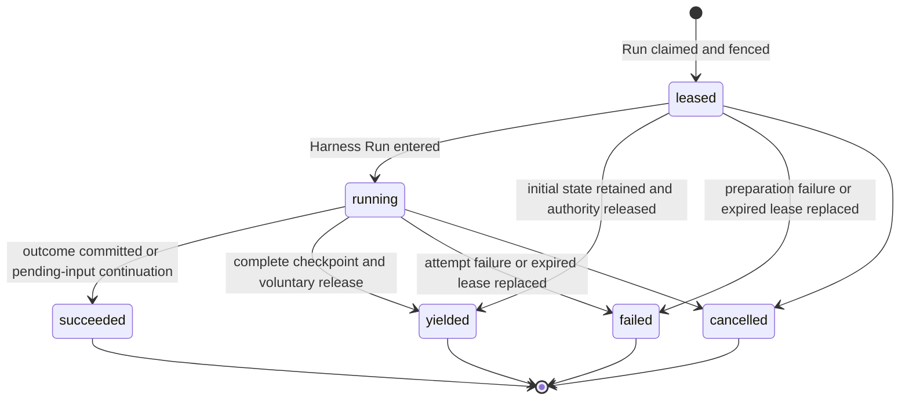
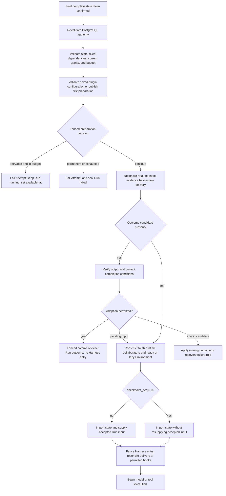

# Run Attempts, Scheduling, and Recovery

## Design Position

a13n Service uses the `Run` as its only durable schedulable Agent-work identity. Every Service-managed operation that invokes an Agent first selects or creates a Session and Thread and accepts a Run. Scheduled triggers, webhooks, and asynchronous child Agents differ only by Run trigger and lineage data. The independent Thread row and its allocation or advancement are owned by [Durable Thread Persistence](11-thread-persistence.md).

Reconciliation or maintenance work that does not invoke an Agent belongs to its owning domain and does not manufacture a Run or `RunAttempt`. If such a workflow invokes an Agent, that invocation is ordinary Run work. Service defines no generic `Execution` resource or `executions` table.

Every non-draining `WorkerExecutionLoop` performs the same bounded relational Run scan, local-capacity admission, and transactional claim or takeover using its installed factory catalog. It reserves one bounded local execution slot before claim so that a successful claim always has process-local capacity. A winning claim immediately starts exactly one `RunAttemptExecutor` as an async task in the claiming execution process; it does not run the Attempt inline in the scan loop and does not create another OS thread. The executor owns preparation, lease renewal, Harness execution, active-control reconciliation, fenced publication, and finalization for that Attempt.

`WorkerExecutionLoop` and `RunAttemptExecutor` are process-local component names, not durable resources or public Python API commitments. The [installed plugin contract](36-installed-harness-plugins.md) defines build-time packaging and frozen configuration compatibility. Adding Worker replicas adds competing consumers of the relational claim contract; it does not create a separate Run Scheduler, recovery controller, or Redis dispatch authority. PostgreSQL remains authoritative for Run eligibility, Attempt generations, leases, fences, execution budgets, and outcomes.

## Core Model

A Run is the stable logical-work identity and durable recovery boundary for one accepted Agent advancement. A `RunAttempt` is one replaceable generation of execution authority within that boundary. Restarting, migrating, or recovering a worker does not create new logical work. When replacement execution is required, a later Worker claim creates another `RunAttempt` under the same Run.

| Resource     | Responsibilities                                                                                                                                                                                                                                                                                                                                                                                                                                 |
| ------------ | ------------------------------------------------------------------------------------------------------------------------------------------------------------------------------------------------------------------------------------------------------------------------------------------------------------------------------------------------------------------------------------------------------------------------------------------------ |
| `Thread`     | Owns Session membership, origin, version, the current Run (the most recently accepted Run), and selected continuation head. Current-Run status determines whether work is active. The Thread serializes whether another Run can be accepted but does not schedule or execute that Run.                                                                                                                                                           |
| `Run`        | Owns the accepted Agent-work identity, input, lineage, AgentRevision when required by [Run Persistence](12-run-persistence.md#configuration-and-resource-references), immutable `EffectiveAgentConfig`, safe model observation, scheduling, execution budget and consumption, current-attempt selection, current state, and durable outcome. It is the sole authority for whether another attempt may be created.                                |
| `RunAttempt` | Owns one worker generation's lease, fence, Worker build and Harness Run correlation, safe model observation, usage, failure or planned-handoff audit, and generation outcome. It does not own accepted input, lineage, model configuration, state, durable outcome, credentials, live bindings, tool invocation history, or presentation data, and it cannot independently authorize a successor. Terminal attempts are immutable audit records. |

## Boundaries

| Concern                                                | Owner                                                                      | Contract                                                                                                                       |
| ------------------------------------------------------ | -------------------------------------------------------------------------- | ------------------------------------------------------------------------------------------------------------------------------ |
| Run status, scheduling fields, and execution budget    | [Durable Run State](12-run-persistence.md)                                 | Defines the stable Run lifecycle and the limits consumed by Attempt generations                                                |
| Installed plugin configuration and deployment          | [Installed Harness Plugins](36-installed-harness-plugins.md)               | Defines startup catalog loading and compatibility across rolling deployments                                                   |
| Model-loop retries inside one Harness Run              | Agent Harness                                                              | Remain process-local `ModelAttempt` values and never allocate another `RunAttempt`                                             |
| Attempt execution, Harness callbacks, and live control | [Service–Harness Runtime Integration](14-harness-runtime-integration.md)   | Defines the executor tasks, `RunAttemptControl`, `HarnessDriver`, public Harness calls, mandatory Capability, and private gate |
| Planned-handoff sequence and yield commit              | [Graceful Handoff Transaction](#graceful-handoff-transaction)              | Owns request admission, checkpoint/cleanup ordering, renewal, yield, and successor eligibility                                 |
| Lifecycle history                                      | [Lifecycle and Stream Persistence](24-lifecycle-and-stream-persistence.md) | Records ordered facts without becoming Run or attempt authority                                                                |
| Thread inbox acceptance and consumption                | [Agent Control: Active Execution](19-agent-control-active-execution.md)    | Supplies durable steer and asynchronous-result entries plus state-coupled same-Run consumption                                 |
| Environment use and lifecycle maintenance              | [Environment Management](29-environment-management.md)                     | Owns preparation-time use acquisition, aggregate active/idle retention and lifecycle coordination                              |
| Agent tool crash behavior                              | Latest complete Run state plus the owning tool or Capability domain        | Defines no generic invocation ledger; effectful tools own cross-crash idempotency or durable task reconciliation               |

## RunAttempt Allocation Within a Run

The [Agent Interaction and Execution Model](10-agent-interaction-and-execution-model.md#identity-allocation-boundary) owns the cross-layer decision to create a Thread, Run, or RunAttempt. This contract begins with an already accepted, unsealed Run and owns how a successful Worker claim allocates one particular Attempt generation. Run acceptance creates no Attempt; the first later claim creates attempt number one.

A later Attempt preserves the Run ID, Session, Thread, parent edge, accepted input, AgentRevision when required by [Run Persistence](12-run-persistence.md#configuration-and-resource-references), `EffectiveAgentConfig`, execution policy, and deterministic state key. It receives a new Attempt ID, fencing attempt number, and lease, the claiming Worker identity, fresh credentials and bindings, and, after entry, a fresh Harness Run. Creating it changes neither Thread references nor Thread version.

| Claim case                                       | Prior Run and Attempt state                                                                          | Allocation and budget effect                                                                                                                           |
| ------------------------------------------------ | ---------------------------------------------------------------------------------------------------- | ------------------------------------------------------------------------------------------------------------------------------------------------------ |
| First claim                                      | Run is `accepted` with no current Attempt                                                            | Create leased attempt number one, increment `attempts_started` and `attempts_charged`, select it, and move the Run to `running`                        |
| Retry after a known retryable generation failure | Run is `running` without a current Attempt; the prior generation is terminal `failed`                | Create a later leased Attempt that replaces the prior generation and increment both Attempt counters                                                   |
| Expired-lease takeover                           | Run is `running` and selects an expired non-terminal Attempt                                         | Atomically fail and charge the old Attempt, then create and select a later leased Attempt within execution budget                                      |
| Successor after planned handoff                  | Run is `running` without a current Attempt; the highest generation is `yielded`                      | Create a later leased Attempt with `start_reason="planned_handoff"`; increment `attempts_started` without consuming another execution or handoff count |
| Continuation after completed execution           | Run is `running` without a current Attempt; the highest generation is `succeeded` with pending input | Create a leased Attempt with `start_reason="pending_input"`; increment both Attempt counters and resume the same Run progress                          |

Every claim revalidates the exact Run eligibility, budget, compatibility, and authority rules defined below. A caller- or responder-driven successor, fork, queued-submission consumption, or terminal-intent Retry is new semantic work and therefore creates another Run under its owning acceptance contract rather than entering this allocation path.

Claim does not acquire Environment use. Same-Run Attempt replacement, backoff, takeover, and handoff preserve acquired use; Run sealing releases it and updates retention atomically. [Environment Management](29-environment-management.md#preparation-timing) owns use acquisition and target preparation; its [retention contract](29-environment-management.md#retention-policy) owns aggregate active/idle conditions.

## Durable Model

The following Python-like schema is conceptual. JSON values are bounded before persistence. `RunUsage` and the Run-owned budget fields are defined by [Durable Run State](12-run-persistence.md#durable-run-model).

```python
type RunAttemptStatus = Literal[
    "leased",
    "running",
    "succeeded",
    "yielded",
    "failed",
    "cancelled",
]
type RunAttemptYieldReason = Literal[
    "service_drain",
]


class RunAttempt:
    id: str
    version: int
    organization_id: str
    run_id: str
    attempt_number: int
    status: RunAttemptStatus

    replaces_run_attempt_id: str | None
    start_reason: str | None
    worker_id: str
    worker_build_id: str
    harness_run_id: str | None
    model_execution_observation: ModelExecutionObservation

    lease_token_digest: str
    lease_expires_at: datetime
    heartbeat_at: datetime

    usage: RunUsage
    yield_reason: RunAttemptYieldReason | None
    failure: SafeFailure | None

    created_at: datetime
    started_at: datetime | None
    finished_at: datetime | None
    updated_at: datetime
```

`attempt_number` is the single monotonically increasing fencing number within a Run and is never reused. It is allocated as `Run.attempts_started + 1`; no second fence counter is stored. `created_at` is the claim-commit timestamp; no duplicate claimed timestamp is stored. `replaces_run_attempt_id` names the immediately superseded attempt when the new attempt is a recovery generation. It is null on the first attempt.

`worker_id` is allocated once per Worker process lifetime and changes on every restart. It also serves as the Worker generation; no second process-generation identifier is stored. `worker_build_id` identifies the immutable a13n Service build artifact running that process; replicas of the same artifact therefore share one build ID. Neither value grants authority without the selected lease and fence. Each Attempt records its actual build; a Run does not require the same plugin code across Attempts.

## RunAttempt Lifecycle



`succeeded`, `yielded`, `failed`, and `cancelled` are terminal. `succeeded` may leave the Run running when a completed Harness Run has eligible pending input; the next Attempt continues that same Run from its complete checkpoint. A leased recovery Attempt can also adopt a verified outcome without Harness entry, or enter Harness itself when pending input prevents completed sealing. `yielded` means the executor voluntarily stopped at a complete recoverable boundary, committed its known usage and released execution authority while the Run remained `running`. It is expected placement change, not failure, cancellation, or a Harness result. `failed` means only that this worker generation can no longer produce an authoritative result. It does not by itself mean that the Run failed: an in-budget retryable failure leaves the Run `running` and allows a later attempt. An owning executor can commit that fact directly; otherwise a later Worker's takeover transaction commits it after the lease expires. Service defines no separate `lost` attempt state.

Loss of outcome certainty at the attempt boundary means that the whole attempt can no longer continue and produce an authoritative Run result. Service does not create another Attempt merely because one process-local tool call fails or has an uncertain outcome; replacement still follows the lease, failure, and handoff rules below.

`leased` is the pre-Run preparation state. Worker claim acknowledgement is a transport observation, not another durable phase. While an attempt is `leased`, `harness_run_id` and `started_at` are null. The executor may read and validate state and immutable artifacts, resolve current authority and credentials, and construct fresh run-local dependencies outside database transactions. It cannot dispatch an Agent model or tool call before Harness entry. Entering the Harness Run atomically records `harness_run_id` and `started_at` and changes the attempt to `running`.

A `leased` Attempt can yield before Harness entry by retaining the already complete initial or imported Run state. A `running` Attempt can yield only after the [Run state contract](12-run-persistence.md#checkpoint-triggers-and-refresh) confirms a complete safe boundary and the local Harness execution is fenced from further model, tool, or child dispatch. A yielded Attempt has a `yield_reason`, has no `failure`, and has `harness_run_id` and `started_at` exactly when it had entered Harness before yielding.

## `run_attempts` Relational Schema

Each worker generation is one `run_attempts` row:

| Column group      | Columns                                                                  | Contract                                                                                                                                          |
| ----------------- | ------------------------------------------------------------------------ | ------------------------------------------------------------------------------------------------------------------------------------------------- |
| Identity          | `id`, `version`, `organization_id`, `run_id`, `attempt_number`, `status` | Unique attempt identity, positive CAS version, and monotonically increasing generation within the Run                                             |
| Recovery lineage  | `replaces_run_attempt_id`, `start_reason`                                | Names the immediately superseded attempt and bounded start reason, including `pending_input` for completed execution requiring more same-Run work |
| Worker and run    | `worker_id`, `worker_build_id`, `harness_run_id`                         | Execution-process and immutable service-build correlation, at most one Harness Run ID after entry                                                 |
| Model observation | `model_execution_observation_json`                                       | Immutable safe model ID, provider type, and model name copied from the Run at claim                                                               |
| Lease             | `lease_token_digest`, `lease_expires_at`, `heartbeat_at`                 | Opaque lease proof, expiry, and last durable renewal                                                                                              |
| Usage and outcome | `usage_json`, `yield_reason`, `failure_json`                             | Attempt-local accounting plus mutually constrained planned-handoff or safe-failure provenance                                                     |
| Time              | `created_at`, `started_at`, `finished_at`, `updated_at`                  | UTC lifecycle observations                                                                                                                        |

Once terminal, every attempt column is immutable.

`usage.model_requests` is monotonic durable execution evidence, not only a terminal accounting total. After all required input preparation and immediately before each provider model request, the executor increments it in a short fenced Attempt update; the provider request does not start unless that update commits. The update does not claim that the provider received or completed the request. When an Attempt is terminalized or replaced, its known usage is charged into `Run.usage_charged` in the same transaction. Consequently, `Run.usage_charged.model_requests > 0` proves that a prior Attempt crossed a model boundary after input preparation without adding a separate input-file materialization field.

`usage.tool_invocations` is aggregate known usage reported by Harness and committed with a complete checkpoint or Attempt outcome. It is not a dispatch authorization record and does not require a PostgreSQL update before each tool call. A crash can therefore omit uncheckpointed tool invocation usage; execution budgets constrain durable known usage rather than claiming exact accounting of external effects.

## Relational Constraints

The `run_attempts` table follows the [Relational Schema Lifecycle](04-relational-schema.md) and preserves these constraints:

01. `(organization_id, id)` is unique, and the attempt organization equals its Run organization.
02. The fencing attempt number and row version are positive.
03. `(organization_id, run_id, attempt_number)` is unique. Child provenance refers to that same attempt number.
04. `replaces_run_attempt_id`, when present, belongs to the same Run and has a smaller attempt number.
05. `current_run_attempt_id`, when present on a Run, names that Run's only selected non-terminal attempt; only an unexpired matching lease authorizes work.
06. Worker scan and takeover use `(status, lease_expires_at, run_id)` on non-terminal attempts and the Run's scheduling index.
07. A `leased` attempt has null `harness_run_id` and `started_at`. A `running` attempt has both. A terminal attempt has both exactly when it entered a Harness Run; `failed`, `cancelled`, or `yielded` directly from `leased` retains both as null.
08. Terminal attempts have `finished_at`, no renewable lease, and immutable columns.
09. `yield_reason` is non-null exactly for `yielded`; a yielded Attempt has null `failure`, leaves its Run `running`, and is not selected as current.
10. Every Attempt has a non-empty immutable `worker_build_id` copied from the claiming process.
11. Terminal attempt history cannot be deleted while referenced by a sealed Run state, lifecycle event, usage record, successor attempt, or retained [Asset provenance](32-asset-management.md#assets-relational-schema).

## Current Attempt Authority

`Run.current_run_attempt_id` selects the sole `RunAttempt` whose lease may authorize work for a `running` Run. The selected attempt is the complete lease record: it owns the worker identity and generation, monotonic fence, lease proof, and lease expiry. A worker is authorized only while the Run still selects that non-terminal attempt and the caller matches its worker generation, fence, lease proof, and unexpired lease.

Every `WorkerExecutionLoop` periodically scans bounded, deterministically ordered relational candidates. The winning Attempt durably prepares absent plugin configuration or validates saved preparation, then restores state through the current build before Harness execution. It never downloads or selects historical plugin code. A candidate is exactly one of:

- an `accepted` Run with no current attempt and `available_at <= now`;
- a `running` Run with no current attempt after a retryable failed generation or a succeeded generation with pending input, and `available_at <= now`;
- a `running` Run with no current attempt whose highest-numbered generation is `yielded` and `available_at <= now`; or
- a `running` Run whose selected `leased` or `running` attempt has an expired lease.

A yielded candidate has build-preference eligibility in addition to ordinary claim predicates. After `yield_reason="service_drain"`, a compatible claimant whose immutable `worker_build_id` differs from the yielded Attempt may claim immediately. A same-build claimant skips it until the finite positive `handoff_preference_window` has elapsed from `finished_at`, then may claim as a capacity fallback. The default window equals one RunAttempt lease duration.

Build difference is neither authority nor compatibility proof. Every claimant wins the transactional lease and fence. Before resumed execution, it passes the state-schema, Harness, plugin configuration, Skill, Environment Provider/state compatibility, codec, and artifact checks. The preference chooses no specific Worker; it only lets compatible new-build capacity win during rolling service overlap while retaining bounded same-build fallback. It does not delay initial claim, retryable-failure recovery, expired-lease takeover. A draining Worker claims no candidate.

Before attempting the claim transaction, the execution loop reserves one slot from its bounded local `RunAttemptExecutor` capacity. It releases the slot when the claim loses or no Attempt is created. When the claim succeeds, ownership of that slot transfers to the new executor until its complete cleanup finishes. A loop with no slot does not claim and later queue the Attempt in process memory; the Run remains available to other compatible claimants. The slot is admission control only and never grants or extends RunAttempt authority.

There is no separate scheduler claim, recovery controller, or Redis execution-ownership handoff. A `WorkerExecutionLoop` establishes or replaces the current selection in one short transaction that:

1. locks or conditionally updates the candidate Run and, when present, its exact selected attempt;
2. revalidates the candidate shape, Thread current selection, Run status, `available_at`, lease expiry, fixed execution deadline, applicable execution or handoff count, aggregate known usage, and any reason-specific build-preference eligibility;
3. when taking over an expired lease, terminalizes the selected old attempt as `failed` with a bounded lease-expiry reason, disables its lease, and charges its known usage;
4. if the fixed deadline or aggregate usage ceiling no longer permits any successor, or a non-handoff claim no longer fits the execution budget, creates no attempt and seals the Run as `failed` with its terminal Thread update and release of acquired Environment use and retention update in the same transaction; a yielded predecessor is already within the handoff budget consumed by its yield and does not consume execution budget;
5. otherwise allocates the fencing `attempt_number=attempts_started+1`, inserts the new `leased` attempt, increments `attempts_started`, increments `attempts_charged` for every non-handoff generation, including pending-input continuation, and selects it as `current_run_attempt_id`; a successor to `yielded` records `start_reason="planned_handoff"`, a successor to `succeeded` records `start_reason="pending_input"`, and every new Attempt copies the claimant's immutable `worker_build_id`;
6. changes an initially `accepted` Run to `running`, leaves a replacement Run `running`, and appends the corresponding lifecycle facts.

The Run row lock or equivalent compare-and-swap plus attempt-number uniqueness admits exactly one winner. A competing Worker that observes a changed Run version, current attempt, or lease condition creates nothing and resumes its scan. The transaction performs no object, artifact, policy-provider, model, Ingress, ConnectorProvider, MCP, Secret-store, Environment, or other external I/O.

Operational admission control, queue names, priority, and fairness may order or delay scans. They never form another ownership authority. Redis may carry domain-owned Run-stream data and Thread-control wakeups, but no Redis value discovers, creates, transfers, or completes a RunAttempt or consumes a Thread inbox entry.

### Claim, Preparation, and Run Sequence

This overview connects the admission and lifecycle stages. The following sections define each transaction; [lease-expiry recovery](#lease-expiry-recovery-sequence) adds the predecessor race, and [Recovery Preparation](#recovery-preparation) defines the admission and continuation decisions.

```mermaid
sequenceDiagram
    participant Loop as WorkerExecutionLoop
    participant DB as PostgreSQL
    participant Executor as RunAttemptExecutor

    Loop->>DB: Scan eligible Run candidates
    Loop->>Loop: Reserve bounded executor capacity
    Loop->>DB: Short claim or takeover transaction
    alt Claim wins and budget permits
        DB-->>Loop: Leased Attempt, fence, and Run metadata
        Loop->>Executor: Immediately start one async task with context and slot
        Note over Executor,DB: Renew authority throughout preparation and execution
        Executor->>Executor: Claim final state and validate recovery admission
        Executor->>Executor: Validate or durably prepare complete plugin configuration
        Executor->>DB: Commit fenced preparation decision
        alt Continue
            DB-->>Executor: Preparation accepted
            Executor->>Executor: Reconcile receipts; adopt eligible outcome or enter Harness
            Executor->>DB: Fenced usage, receipt, and finalization transactions
        else Retry later or fail Run
            DB-->>Executor: Applicable Attempt failure decision committed
        end
    else Candidate changed or another Worker won
        DB-->>Loop: No claim; release slot
    else Budget exhausted
        DB-->>Loop: Fail old Attempt when present and seal Run; release slot
    end
```

### Claim Dispatch

After commit, the winning execution loop schedules exactly one executor as its next local action and resumes scanning only according to its remaining capacity. It transfers the reserved slot and claim-derived context under [RunAttempt Executor Lifetime](14-harness-runtime-integration.md#runattempt-executor-lifetime), which owns `AttemptContext` and the structured task scope. That context carries no authority independent of PostgreSQL revalidation.

When Service tracing is enabled, each committed claim starts one separate parentless RunAttempt root under [Observability](38-observability.md); takeover never reopens or completes the prior Worker's root span.

### Preparation and Harness Entry

The executor performs state and dependency preparation outside database transactions while its child renewal activity keeps the lease current. Before the successful preparation decision, the executor conditionally claims the Run's current state object version for its fence under [State Writer Claim Retries](12-run-persistence.md#state-writer-claim-retries). [Recovery Preparation](#recovery-preparation) uses the final claimed state to select outcome adoption or Harness continuation. On the continuation branch, another short fenced transaction verifies the current leased attempt and preparation decision against current locked lifecycle state, records `harness_run_id` and `started_at`, changes the attempt to `running`, sets the Run's `started_at` if this is its first Harness Run, and appends the attempt lifecycle fact. The Run remains `running`; an adopted outcome requires no Harness entry.

### Renewal and Authority Loss

Heartbeat and lease renewal update only the selected attempt, but their conditional update verifies the authority rule above in the same relational transaction. Like every worker-originated durable mutation, they supply `organization_id`, `run_id`, `run_attempt_id`, fencing attempt number, Worker/build identity, and lease proof. Expected Run and Attempt versions remain observation or user-command concurrency values, not Worker authority credentials. They cannot revive a terminal or deselected generation. A state write additionally supplies the current opaque object version and conditionally replaces the same deterministic state key.

Each Worker batches renewal requests from its independently supervised Attempts on a shared cadence. Batch size, collection delay, and database work are bounded; an idle Worker writes no heartbeat, and collecting a batch holds no database session. The first renewal is due no later than the Attempt's normal renewal interval. Batching does not extend an Attempt's confirmation timeout or its last confirmed lease, and a monitor waiting for its own local authority lock does not prevent other monitors from submitting renewal requests.

One short batch transaction locks only the selected Attempt rows in stable order, reads their Run and Thread authority, and checks every member independently. Lease expiry is evaluated after row-lock acquisition, including time spent waiting for contention. Terminalization and replacement serialize on the same Attempt row, so a concurrent cancel, yield, or takeover cannot be undone by renewal. A missing, expired, or mismatched member is not renewed and does not reject valid members. Successful members update heartbeat time, lease expiry, update time, and Attempt version together; renewal changes neither Run nor Thread versions and publishes no progress or lifecycle event.

The Worker returns per-Attempt confirmation only after the batch commits. Each monitor applies only its own confirmation and handles its own authority loss. A database failure, unconfirmed commit, or bounded wait exhaustion gives no successful confirmation for affected requests; their executors follow the existing fencing rule. Cancellation removes pending interest, and a delayed result cannot restore invalidated local authority even if the database write committed. The shared renewal task remains alive through executor drain, handoff, and cleanup, and stops only after those executor scopes have ended. It is process-local I/O coordination, not a new durable lease owner, scheduler, or recovery controller.

Environment operation admission uses a process-local lease observation initialized from the committed claim's expiry. Only a successfully committed renewal can extend that local deadline; starting a renewal or adding the lease duration to the operation time grants nothing. Each dispatch checks the current clock against that deadline without querying Run, RunAttempt, or Thread. Expiry, observed authority loss or cancellation, and local execution closure permanently invalidate further Environment dispatch for that Attempt; a delayed renewal result cannot undo invalidation. Background renewal and control reconciliation still validate PostgreSQL authority, and all durable mutations retain their transactional fences. Before a control change is observed locally, operations may proceed within the last confirmed lease. Neither a local check nor a preceding database read atomically revokes already dispatched external effects.

The same fence covers Attempt preparation and outcome, Run state replacement and sealing, lifecycle and retained-Item publication, waiting feedback, child acceptance or result incorporation, and terminal Thread updates. Lease renewal proves only that the selected Worker generation remains alive and authorized to publish; it does not commit Agent progress, extend credential lifetime, or make process memory recoverable. An executor that cannot confirm current ownership terminally fences its process-local control gate, stops model and tool work, cancels its Harness stream, and suppresses authoritative publication. It may still emit bounded non-authoritative telemetry naming its stale Attempt.

Immutable usage evidence for already incurred work may arrive later under its original RunAttempt attribution as defined by [Events, Usage, and Delivery](25-events-usage-and-delivery.md), but it cannot restore an Attempt or advance Run lifecycle.

### Attempt Finalization

The [Run outcome contract](12-run-persistence.md#run-acceptance-checkpoint-and-outcome-commit) owns state-candidate selection, Run sealing, and the complete cross-resource transaction. From the RunAttempt side, that same fenced commit terminalizes the selected Attempt, disables its lease, charges its known usage, clears the Run's current-attempt selection, and appends Attempt lifecycle facts. A waiting or completed Run outcome records the Attempt as `succeeded`; failed or cancelled outcomes record the applicable generation-terminal status.

The [active-control contract](19-agent-control-active-execution.md#completion-and-control-races) owns Thread inbox preconditions and disposition. Source sealing terminalizes this Attempt independently of subsequent [queued consumption](20-agent-control-queued-submissions.md#post-completion-consumption). Accepting a queued successor creates no Attempt for it; only a later ordinary claim does so.

### Attempt Failure Decisions

A known Attempt failure commits atomically with its Run decision. The fenced transaction terminalizes the current Attempt as `failed`, disables its lease, charges known usage, and clears `Run.current_run_attempt_id`. It selects one of these outcomes:

- **Retry later**: only an explicitly retryable, in-budget failure leaves the Run `running`, preserves acquired Environment use, and sets a bounded `available_at`. A later Worker scan may create the next Attempt.
- **Fail the Run**: a non-retryable or exhausted failure sets `Run.status=failed`, records bounded Run `failure`, sets `sealed_at`, freezes the deterministic state key, releases acquired Environment use and updates retention, retains the failed Run as the Thread's current Run, preserves the prior continuation head, increments Thread version, and applies the active-control contract's terminal inbox disposition in the same transaction. `sealed_state` is recorded only when exact valid state metadata is already available under the Run state contract.

The transaction appends Attempt and Run lifecycle facts as applicable. Neither decision returns the Run to `accepted`. Failure before Harness entry leaves `harness_run_id` and `started_at` null. The same Run-terminal effects apply when claim or takeover exhausts the budget and creates no successor Attempt.

Each admission or execution stage owns failure classification and current-authority checks. In particular, [Recovery Preparation](#recovery-preparation) retains its conditions for state-claim exhaustion, unknown authority, and fallback to lease expiry; a stale owner never submits a failure decision.

## Graceful Handoff Transaction

This section owns the complete planned-handoff flow, its authority checks, and the yield transaction. [Runtime Configuration and Deployment](01-runtime-configuration-and-deployment.md#drain-and-shutdown) owns role shutdown and claim gating; [Harness integration](14-harness-runtime-integration.md#planned-handoff-flow) owns safe hooks, local quiescence, and cleanup.

### Request and Safe-Boundary Admission

SIGTERM or deployment drain requests handoff through the owning executor's process-local control facade. Its `yield_requested` flag is local only; it adds no Run or Attempt column, makes no Worker stale, and does not stop heartbeat or lease renewal. The executor may begin a planned handoff only when `handoffs_completed < max_handoffs`; an exhausted handoff budget makes it continue ordinary execution until a normal outcome or the drain deadline.

While model, tool, inline-child, input, enqueue, or checkpoint work is active, the request waits; it does not make that work safe or authorize concurrent export. At the next [eligible boundary](14-harness-runtime-integration.md#safe-boundaries-and-corresponding-hooks), the owner enters the local control critical section and revalidates the current Attempt, lease, fence, handoff budget, and absence of a winning interrupt or terminal decision. A waiting or completed Harness terminal result follows ordinary outcome commit rather than being converted to `yielded`.

Drain readiness failure and claim gating do not change [Attempt renewal authority](#renewal-and-authority-loss). From the first process-local handoff request through safe-boundary waiting, checkpoint publication and reconciliation, local Run quiescence, and yield-transaction preparation, the selected Attempt continues its normal heartbeat and lease renewal. Renewal and yield use the same Attempt CAS and fence authority, so their conditional updates serialize: after yield commits, a late renewal fails because the Attempt is terminal and deselected. A yield CAS conflict does not release authority; while the old Attempt still passes the authority check it keeps renewing and either retries yield or commits the authoritative outcome that won the race.

### Checkpoint Confirmation and Local Quiescence

At the admitted boundary, the owner reconciles required inbox work, exports the complete Harness and Host state, and conditionally publishes or confirms it at the Run's ordinary deterministic `state.json` key. It may reuse an already equivalent complete checkpoint. Environment state follows its own conditional lifecycle boundary under [Environment Management](29-environment-management.md#run-binding-and-recovery), while the Run binding remains fixed. Known backing changes and dispatched-operation uncertainty survive independently of Harness checkpoint success. The state contract creates no handoff-specific object, row, object key, or checkpoint identity, and the yield transaction does not store or validate checkpoint metadata. An unknown object-write result is reconciled by the ordinary object stat and body rules. If publication cannot be confirmed, the owner keeps renewing, does not cancel the local Run solely for handoff, and does not submit `yielded`. It retries at a later safe boundary until the drain deadline. Recorded inbox incorporations survive this deferral and compaction; neither a local record nor an unconfirmed write marks an inbox entry consumed.

After checkpoint confirmation, the owner closes local admission before releasing the safe boundary and completes [Harness cancellation and local cleanup](14-harness-runtime-integration.md#planned-handoff-flow). No further model request, tool call, child dispatch, or state mutation may start. Any Run stream, attachments, and process-local Runtime are closed while renewal keeps the Attempt lease current. This process-local cancellation does not seal the Run as `cancelled`.

### Yield Commit and Successor Admission

Only after local quiescence and cleanup does the executor open one short transaction, lock Thread, Run, and RunAttempt in canonical order, and revalidate current Run selection, unexpired lease proof, Worker/build identity, fencing attempt number, `running` Run status, non-terminal Attempt status, and absence of a winning ordinary outcome, interrupt, or failure.

The yield reason is `service_drain` for shutdown or deployment drain. The winning transaction atomically:

1. changes the Attempt to `yielded`, sets `finished_at` and `yield_reason`, and leaves `failure` null;
2. charges all currently known Attempt usage into the Run;
3. increments `Run.handoffs_completed`;
4. clears `Run.current_run_attempt_id`, preserves `Run.status=running`, and sets `Run.available_at=now`; and
5. appends the `run_attempt.yielded` lifecycle fact with pending [Hook dispatch](26-hook-notifications.md#asynchronous-hook-dispatch) and any other domain-required outbox intent.

Only after this transaction commits does the old executor stop heartbeat and lease renewal and issue a best-effort Redis reconciliation wakeup. The still-running Run becomes eligible for a planned-handoff successor through [ordinary Attempt allocation](#runattempt-allocation-within-a-run) and the [reason-specific build preference](#current-attempt-authority). That later claim creates the successor; the yield transaction itself creates no Attempt. If the transaction loses to outcome or cancellation, the executor abandons yield and observes that authoritative result. If it fails for another reason while the old Attempt remains authoritative, the executor continues renewal, reconciles the latest state, and retries or commits another legal authoritative result.

If the drain deadline arrives before any terminal transaction commits, the executor abandons graceful handoff, stops renewing, fences local execution, and exits. The Attempt remains authoritative until its recorded lease actually expires; only then may an ordinary takeover transaction fail it and allocate a higher fence. A checkpoint written before a failed yield or process crash remains an ordinary valid latest checkpoint and never implies that the Attempt was yielded.

## Recovery and Budget Enforcement

The [Run budget contract](12-run-persistence.md#durable-run-model) owns limits and counter meaning. [Attempt allocation](#runattempt-allocation-within-a-run) and the [handoff transaction](#graceful-handoff-transaction) atomically consume that authority. Claim and takeover charge the applicable counters before external preparation begins; preparation never reserves a future generation.

### Lease-Expiry Recovery Sequence

The following sequence makes the ordinary cross-Worker lease-expiry recovery path explicit. It uses the same relational claim authority and deterministic state key as every other Attempt; it introduces no recovery controller, recovery queue, or second checkpoint selector. After takeover, [Recovery Preparation](#recovery-preparation) selects the continuation branch; the [Run resume contract](12-run-persistence.md#resume-semantics) owns checkpoint-sequence semantics.

Takeover crosses three distinct boundaries. They introduce no additional persisted Attempt statuses:

| Boundary                            | What it establishes                                                                                                | What remains required                                                                                  |
| ----------------------------------- | ------------------------------------------------------------------------------------------------------------------ | ------------------------------------------------------------------------------------------------------ |
| PostgreSQL claim                    | One selected Attempt, a new monotonic fence, and an unexpired lease authorize preparation                          | Confirm object ownership and complete recovery admission; the old process need not have exited         |
| State writer claim                  | A confirmed complete checkpoint and a fresh write token fence prior object tokens                                  | Revalidate PostgreSQL authority and prepare from this final state                                      |
| Preparation and execution admission | A fenced preparation decision permits outcome adoption or fresh reconstruction; Harness entry is separately fenced | Reconcile state evidence and continue checking authority at each owned mutation and execution boundary |

```mermaid
sequenceDiagram
    participant Old as Old RunAttemptExecutor
    participant OldHarness as Prior Harness Run
    participant DB as PostgreSQL
    participant Loop as Compatible WorkerExecutionLoop
    participant New as New RunAttemptExecutor
    participant Objects as State object storage

    Old-xDB: Lease renewal stops or cannot be confirmed
    Note over DB: Attempt N reaches lease expiry and authorizes no further work
    Loop->>DB: Scan Run and expired selected Attempt N
    Loop->>Loop: Reserve bounded process-local capacity
    Loop->>DB: Lock Thread, Run, and Attempt N; revalidate takeover
    alt Execution budget and eligibility permit a successor
        DB->>DB: Fail Attempt N and charge known usage
        DB->>DB: Create and select Attempt N+1 with higher fence and fresh lease
        DB-->>Loop: Return replacement Attempt and lease proof
        Loop->>New: Immediately start one executor task with reserved capacity
        Note over New,DB: Renew throughout state admission, preparation, and execution
        opt Before the successor confirms object claim
            Old->>Objects: Finish a previously authorized in-flight checkpoint
            Objects-->>Old: CAS may succeed if its object version is still current
        end
        New->>Objects: Read, validate, and claim final complete state under bounded retries
        alt Object claim confirmed
            Objects-->>New: Final state and fresh write token
            New->>DB: Revalidate PostgreSQL authority
            Note over New,DB: Follow Recovery Preparation for the fenced decision, receipts, and adoption or execution
            opt Old process becomes runnable after confirmed object claim
                Old->>DB: Submit late renewal, outcome, or authority check
                DB--xOld: Reject deselected lease, old fencing attempt number, or invalid lifecycle
                Old->>Objects: Finish a write with its old object version
                Objects--xOld: Reject stale conditional replacement
                Old-xOldHarness: Fence and cancel its local Harness Run
            end
        else Claim unconfirmed or authority lost
            Note over New,DB: Apply preparation failure only with confirmed authority; stop admission and clean up
        end
    else Execution budget, deadline, or usage ceiling exhausted
        DB->>DB: Fail Attempt N, charge usage, and seal Run failed
        DB-->>Loop: Create no successor Attempt; release capacity
    end
```

Before the successor's object claim, a predecessor's previously authorized in-flight checkpoint can still win the object CAS. The successor then claims the complete newer state under the [object fencing contract](12-run-persistence.md#state-key-conditional-writes-and-fencing). The confirmed object determines the recovery point; waiting for the predecessor to acknowledge cancellation is not a takeover prerequisite.

### Recovery Preparation

After any new attempt owns the lease, its executor starts renewal supervision, validates and claims complete state, and revalidates PostgreSQL authority. It then reads attempt history, immutable artifacts, and the Run's immutable `authority_principal` outside a long database transaction. The successful preparation decision uses the final confirmed state and requires all of these conditions:

- the latest complete state object passes key, organization, Run, Thread, digest, size, envelope, checkpoint, Agent/Revision identity including the protected assistant null-Revision exception, and required Harness, Capability, and Host codec validation;
- the applicable fixed recovery or handoff count, elapsed-time, and known-usage ceilings still permit this already-created attempt after all durable usage charges;
- the AgentRevision when required by [Run Persistence](12-run-persistence.md#configuration-and-resource-references), `EffectiveAgentConfig`, installed plugin configuration and immutable Skill artifacts, accepted Connectivity selections and protected Ingress context, the accepted Environment ID/access and compatible template/Provider schemas, and other frozen dependency locks are present, digest-valid, and compatible; and
- the Run's persisted authority Principal remains active in the same organization, and its current Workspace and principal policy, RoleBindings, Agent invocation authority, Connection ownership or eligibility, Ingress action authority, Environment provider selection, and required Secret metadata authorize the reconstruction and intended uses.

State writer admission retains the following sequence within that same Attempt. Renewal runs throughout reads, claim retries, and execution. Each of at most four claim cycles revalidates the selected Attempt, fence, and lease; reads the complete state, metadata, matching object version, and writer fence; validates identity, integrity, and required codecs; and conditionally claims the object while preserving its body and advancing the writer fence. Confirmed success returns a fresh version and ends the loop. A CAS conflict with valid authority uses bounded backoff before rereading in the next cycle. A lost or timed-out response is reconciled before another write: confirmed success ends the loop, otherwise the remaining retry budget applies. Unconfirmed claim after exhaustion, permanent failure, or authority loss stops admission and performs bounded cleanup; a classified preparation failure is committed only while authority can still be confirmed. The [State Writer Claim Retries contract](12-run-persistence.md#state-writer-claim-retries) supplies the complete storage policy.

State-dependent preparation follows confirmed writer claim. Before the successful preparation decision, [plugin preparation](12-run-persistence.md#plugin-configuration-preparation) durably fills absent normalized configuration or validates the retained tree without changing the applied-input decision. Any speculative preparation performed earlier is reevaluated when a claim retry reads a different object: the selected Harness state, applied-input decision, deferred continuation, retained inbox evidence, outcome branch, and state-derived invocation arguments must all match the final confirmed state. Validated immutable artifacts may be reused when their exact identities and digests remain applicable; cached authorization and budget observations do not replace current admission checks. The executor never combines the body from one read with the token or continuation decisions from another.

External tool preparation follows [Agent-Facing External Tools](40-connectivity/04-agent-facing-tools.md#discovery-and-recovery): current schemas are discovered under the retained source selections, without a durable tool snapshot compatibility gate. This external I/O occurs outside the claim and preparation-decision transactions.

Attempt preparation is an internal operation over already accepted work. It does not replay the accepting browser session or API key and does not substitute the claiming Worker, queue consumer, administrator, or `system` audit actor as the Run Principal. Revoking the original request credential blocks later requests made with that credential but does not erase the accepted Run. A disabled Principal or missing required grant fails preparation closed. Successful IAM validation creates the process-local [Attempt IAM snapshot](33-identity-and-access-management.md#attempt-iam-snapshot) before materialization or Agent effects. The prepared Attempt refreshes IAM, Workspace existence, and selected Environment Provider enablement after every ten Agent loops under that contract; recovery and planned handoff create fresh observations and a new counter for the replacement Attempt. Lease, fence, cancellation, and other resource eligibility checks follow their owning contracts independently of this cadence.

The executor then uses one short fenced compare-and-swap transaction to revalidate that the same Run still selects its unexpired `leased` attempt and to commit exactly one preparation decision:

- **continue**: preserve the Run and attempt as active and permit fresh reconstruction and Harness entry;
- **retry later**: commit the [retry-later failure decision](#attempt-failure-decisions), only for an explicitly retryable condition while budget remains; or
- **fail the Run**: commit the [terminal failure decision](#attempt-failure-decisions).

After a **continue** decision, the executor reconciles the final state's retained inbox receipts and any recognized same-Run provenance under the [active-control recovery contract](19-agent-control-active-execution.md#offer-incorporation-and-durable-consumption), before new delivery or Agent execution. That contract owns conditional receipt repair, FIFO validation, consumption, and winning terminal dispositions. Reconciliation does not roll back independent PostgreSQL lifecycle, queue, budget, or Environment facts to checkpoint time. A preparation decision is not a lasting authorization: receipt confirmation, outcome adoption, Harness entry, and later mutations revalidate their own current lease and fence preconditions.

The resulting continuation has two branches. An `outcome_candidate` is verified against its output and current relational completion conditions and, when eligible, committed without entering Harness. A candidate alone does not bypass pending-delivery rules or authorize unconditional completion; eligible pending input selects same-Run continuation instead of failure. Other invalid or failed commits follow their owning classification. When state has no outcome candidate or completion requires pending-input continuation, the executor reconstructs fresh credentials, `RunBindings`, clients, plugins, and Environment operation objects for Harness continuation. Environment admission verifies the fixed logical selection and required host placement; Provider lifecycle work occurs only on the execution branch under [Environment preparation](29-environment-management.md#preparation-timing) and [recovery](29-environment-management.md#run-binding-and-recovery).



Loss or inability to confirm Attempt authority at any stage closes local admission and cancels preparation or execution; the old owner does not submit a failure under stale authority. No pending inbox payload is offered before an eligible Harness boundary, and the waiting-successor first-request gate remains in force. A state receipt may be confirmed without offering any new input.

Every decision that fails a Run applies the complete [Attempt failure transaction](#attempt-failure-decisions).

A permanent state, integrity, schema, codec, artifact, lock, compatibility, or authority failure takes the final path. An exhausted applicable execution or handoff count, deadline, or usage budget also takes the final path. A transient object-store or immutable-artifact availability failure can take the retry-later path only when policy classifies it retryable and all remaining budget checks pass. If the Worker dies during preparation, its lease eventually expires and another Worker's ordinary takeover transaction replaces that attempt.

State writer admission first applies its [same-Attempt retry policy](12-run-persistence.md#state-writer-claim-retries). Exhausting retryable claim failures or the total claim-retry deadline while authority remains valid takes the retry-later path when the Run budget permits, otherwise the fail-Run path. The owner commits that decision before releasing its execution scope; a classified startup failure is not handled solely by logging and abandoning the selected lease. If ownership has been replaced or another outcome has committed, the old owner publishes no failure under stale authority. If PostgreSQL cannot confirm or commit the decision within the bounded authority policy, the executor stops renewal and local work, and ordinary lease-expiry recovery remains the fallback.

Environment host/daemon affinity is part of Worker eligibility. A Worker that cannot access the selected local environment or fulfill its Provider runtime requirements cannot claim work by substituting another host-local target. Target lifecycle I/O remains outside claim transactions.

Recovery admission performs no model or Environment Provider I/O. Target preparation is execution work under [Environment Management](29-environment-management.md#preparation-timing), not a recovery-admission probe.

A later Attempt receives a new ID, fence, lease, fresh `RunBindings`, a fresh Environment operation object for the same immutable target/working-directory/access binding, a fresh EIP Session per envd binding, and a Harness Run, then follows the [Run resume contract](12-run-persistence.md#resume-semantics) against the same Run state key. Service imports only the selected complete state and does not add synthetic results or generic recovery context for tool work absent from that state.

The Agent decides its next action through ordinary model output. A re-driven or later tool call receives its ordinary tool-call and invocation identity. Service does not guarantee cross-Attempt idempotency-key reuse; a tool that requires it must define and persist that key through its own contract.

## RunAttempt Execution Boundary

[RunAttempt Executor Lifetime](14-harness-runtime-integration.md#runattempt-executor-lifetime) owns `AttemptContext`, task and object structure, reconstruction, stream ownership, cancellation, and cleanup. [Active Execution](19-agent-control-active-execution.md) owns watcher reconciliation and signal acknowledgement; [Environment Management](29-environment-management.md#run-binding-and-recovery) owns Environment reconstruction and lifecycle. This contract defines no second integration profile.

Attempt authority requires that only the current leased and fenced Attempt enter execution, exactly one executor own it in the claiming process, and at most one `harness_run_id` be bound before its first Harness observation. Presentation publication follows [Run Stream fencing](24-lifecycle-and-stream-persistence.md#publication-activation-and-fencing). No database session or lock spans reconstruction, provider calls, Harness work, streaming, waits, or cleanup. The reserved capacity remains with the executor until its structured cleanup finishes. Replacement creates fresh process-local values under the integration contract; no prior Worker's live execution is restored. Active-control hooks follow their owning FIFO and waiting-delivery contract, where Redis is only a wakeup optimization.

## Retry Semantics

`RunAttempt` stores no generic Agent tool invocation collection, dispatch disposition, result-correlation collection, or recovery projection. Service performs no synchronous PostgreSQL write solely because Harness is about to dispatch a tool call. Tool-call observations can still carry process-local correlation into streams, traces, logs, or a tool-specific protocol, but none of those values becomes generic RunAttempt recovery authority.

A tool call and its result become recoverable only through a complete Run state checkpoint. If a Worker disappears before that checkpoint, the successor cannot distinguish work that never started from work that partially or fully completed without returning. It resumes from the previous complete state and can re-drive model or tool work. A provider or Capability that needs stronger behavior owns an idempotency key, provider operation identity, receipt, or durable task ledger in its own domain; Service does not query provider business state before admitting another attempt.

Retries remain owned by the layer that knows the failed boundary:

- state writer admission retries transient storage failures and eligible CAS conflicts inside the same leased Attempt under [State Writer Claim Retries](12-run-persistence.md#state-writer-claim-retries); these retries do not allocate generations or replay Agent work;
- bounded transport retries and authorized prepare/resume/rebuild remain inside the Provider implementation under Host coordination; rebuilding never implicitly replays an already dispatched operation with an unknown outcome;
- Harness semantic recovery creates another ModelAttempt inside one Harness Run;
- eligible pending inbox delivery that can no longer enter the current native Run prevents completed sealing and follows the active-control recovery rule;
- Service creates another RunAttempt after the prior Attempt failed, yielded, lost its lease, or succeeded with eligible pending input, and only under the Run's applicable budget;
- retrying sealed terminal intent creates a successor Run rather than reopening the original;
- a recovered Agent decision is an ordinary new tool call, not a replay command; and
- Service does not guarantee reuse of a prior invocation or idempotency key across RunAttempts.

Backoff uses the Run's exact durable `available_at`; Worker or process restart does not reset it. Attempt admission continues to enforce the [Run-owned counters and ceilings](12-run-persistence.md#durable-run-model).

## Failure Semantics

| Failure                                                                   | Durable outcome                                                                                                                     |
| ------------------------------------------------------------------------- | ----------------------------------------------------------------------------------------------------------------------------------- |
| Concurrent Workers scan the same Run                                      | Exactly one claim or takeover transaction creates the next Attempt; losers create nothing.                                          |
| Installed plugin configuration or state is incompatible                   | The claimed Attempt fails explicitly through preparation or recovery; no historical code or default state is substituted.           |
| Worker crashes before claim commit                                        | The transaction commits no partial Attempt ownership.                                                                               |
| Worker crashes after claim or during preparation                          | Its lease expires; a later takeover fails it and creates at most one successor within budget.                                       |
| State writer claim encounters a transient network failure or CAS conflict | The same authorized Attempt applies the bounded Run-state claim retry policy before a classified preparation decision.              |
| State writer claim exhausts retries while authority is valid              | The owner commits Attempt failure and releases selection; remaining Run budget permits retry later, otherwise the Run seals failed. |
| Local executor capacity is full                                           | The execution loop does not claim; compatible capacity may claim the still-eligible Run.                                            |
| Lease renewal loses or cannot confirm authority                           | The executor terminally fences local control, cancels its task tree and Harness stream, and publishes no authoritative result.      |
| Redis control watcher fails                                               | The executor remains correct through mandatory PostgreSQL checks; an unrecoverable child-task failure cancels the executor safely.  |
| Worker crashes after uncheckpointed Agent tool work                       | The successor resumes from prior complete state; generic recovery cannot determine the external outcome, so work can be re-driven.  |
| Worker drains while model, tool, or inline-child work is active           | It keeps renewing and waits for a complete safe boundary; no second Worker may execute the Run.                                     |
| Checkpoint publication or reconciliation spans heartbeats                 | The selected Attempt keeps renewing; checkpoint work does not release authority.                                                    |
| Yield races with renewal                                                  | The shared Attempt CAS serializes them; after yield commits, late renewal is rejected.                                              |
| Yield fails while the old owner remains authoritative                     | The owner keeps renewing and retries or commits another legal result; failure alone causes no takeover.                             |
| Drain deadline arrives before yield                                       | The owner stops renewal and exits; takeover remains forbidden until recorded lease expiry.                                          |
| New-build and same-build Workers see a service-drain yield                | Compatible new build may claim immediately; same build waits for the bounded preference window.                                     |
| Preparation finds a retryable dependency outage                           | The Attempt fails; the Run remains `running` with bounded `available_at` while budget remains.                                      |
| Preparation finds permanent incompatibility or revoked authority          | The Attempt and Run fail before Harness model or tool work starts.                                                                  |
| Redis live data flow is unavailable                                       | Relational ownership and Thread inbox remain intact; no signal replaces a claim or domain fact.                                     |

## Compatibility and Trade-offs

Run row version, relational migration revision, execution-policy version, and Worker build identity format are independent. Harness and provider compatibility remain governed by their owning contracts. Unknown required policy versions fail closed before recovery. After a service-drain yield, a different `worker_build_id` supplies only scheduling preference; it never proves compatibility, grants authority, or proves plugin code compatibility. Relational migrations do not reinterpret terminal attempt records through current defaults.

Keeping attempts as immutable audit rows increases relational retention but preserves worker, lease, usage, failure, and recovery provenance. Folding work identity and scheduling into the Run removes a second one-to-one lifecycle and its coordination transactions.

## Invariants

01. One `RunAttempt` is one worker generation and starts at most one Harness Run.
02. The fencing attempt number increases monotonically, is never reused, and at most one attempt is current and lease-authorized for a Run.
03. Every worker-originated durable write validates the current attempt, fencing attempt number, lease proof and expiry, Worker/build identity, organization, and current lifecycle preconditions.
04. The current Attempt fence authorizes state and outcome writes that carry Thread-inbox evidence; the active-control and asynchronous-subagent contracts own exact consumption, rollover, suppression, and supersession semantics.
05. Only a Worker's short Run claim or takeover transaction can authorize a later attempt; after the first claim the same Run remains `running`, and its budget must permit the new generation.
06. A later attempt records its claiming Worker identity and, on entry, a fresh Harness identity while resuming the same Run state under the Run persistence contract.
07. Service stores no generic per-invocation dispatch ledger. A replacement Attempt resumes from the exact selected complete state and cannot reconstruct tool work absent from it; tools requiring cross-crash duplicate suppression or reconciliation own that durable protocol.
08. Attempt `failed` is generation-terminal and does not imply Run `failed`; Run `failed` is sealed and never receives another attempt.
09. Terminal attempt rows are immutable audit records.
10. Any transaction that accepts a successor Run creates no successor RunAttempt; only a later claim allocates its first generation.
11. Drain gates new claims but does not weaken current Attempt authority: heartbeat and renewal continue until a terminal commit succeeds or the drain deadline is reached.
12. `yielded` is an Attempt terminal state, never a Harness result or Run terminal state; it preserves one complete latest `state.json` and permits a fresh planned-handoff Attempt under the same running Run.
13. Yield and lease renewal serialize through the same selected Attempt CAS and fence. A failed yield CAS never by itself stops renewal or permits another Worker to execute the Run.
14. Allocation and yield atomically charge the applicable Run-owned counters; no Attempt independently grants recovery or handoff authority.
15. Every Attempt executes for its Run's immutable authority Principal and re-evaluates that Principal's current status and grants before Harness entry; an internal claimant never becomes the product Principal.
16. Every `WorkerExecutionLoop` uses the same bounded relational scan and transactional claim or takeover contract; PostgreSQL owns eligibility and Attempt state, while Redis owns no scheduling or inbox-consumption fact.
17. Object, artifact, authorization, Environment, model, tool, and other external I/O never occurs inside a claim, takeover, or preparation-decision transaction.
18. Claim, replacement, and backoff obey the [Run lifecycle](12-run-persistence.md#run-lifecycle); no Attempt transition reopens a sealed Run.
19. Before executing a claimed Attempt, the Worker validates frozen configuration and restores state under the [installed plugin contract](36-installed-harness-plugins.md#configuration-and-recovery); compatibility does not depend on matching historical plugin code versions.
20. Service-drain build preference is bounded and advisory: compatibility and transactional claim remain mandatory, and same-build capacity becomes eligible after `handoff_preference_window`.
21. Every Attempt owner participates in the Harness-integration and active-control reconciliation points defined by their owning contracts; Redis consumer progress is only a wakeup optimization.
22. A claim requires a pre-reserved bounded local execution slot and starts exactly one process-local `RunAttemptExecutor` async task; it never creates another OS thread or a durable Execution resource.
23. The execution slot remains owned until the [executor's bounded structured cleanup](14-harness-runtime-integration.md#runattempt-executor-lifetime) finishes.
24. Same-Run Attempt transitions preserve acquired Environment use; Run sealing releases it atomically with retention updates under [Environment Management](29-environment-management.md#retention-policy).
