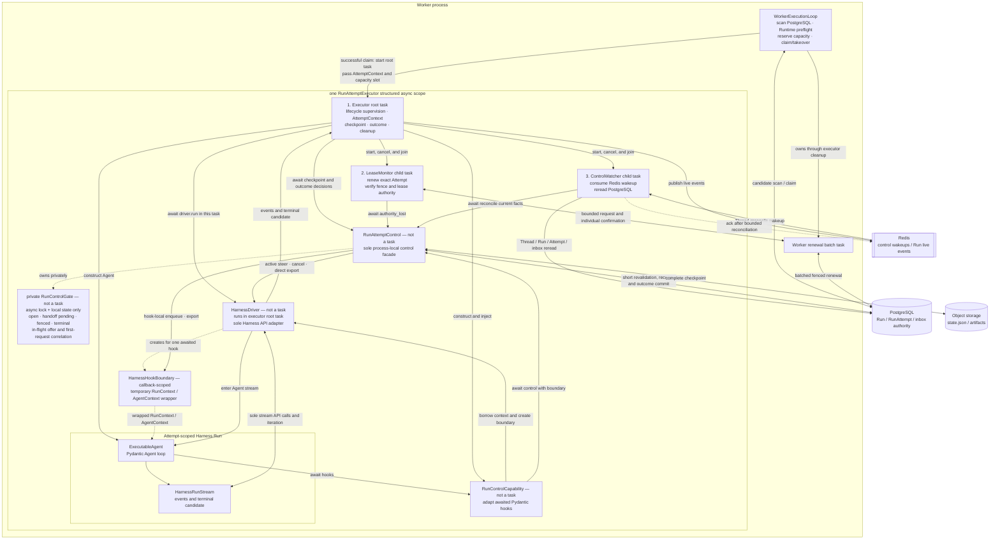
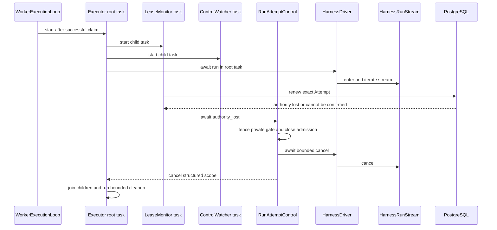
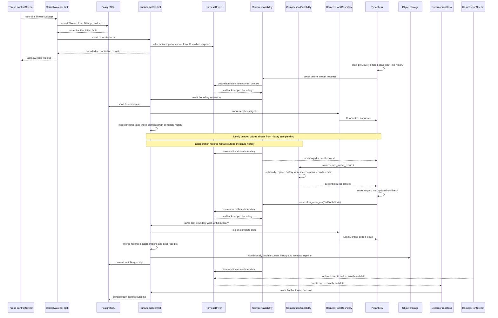

# Service–Harness Runtime Integration

## Design Position

a13n Service embeds Agent Harness inside one process-local `RunAttemptExecutor` for each successfully claimed RunAttempt. The `WorkerExecutionLoop` performs scan, capacity admission, and claim; it then starts the executor as an async task in the same Worker process. It does not create an OS thread. The executor and Harness share one trusted Python process and one structured async scope; they do not communicate through an internal network API, RPC protocol, queue, or serialized callback registry.

Harness owns process-local Agent composition, Pydantic AI execution, complete portable state export, and the canonical event/result stream. The executor root task owns the Attempt's live Service lifecycle and runs one `HarnessDriver` that exclusively holds and operates the entered `HarnessRunStream`. One process-local `RunAttemptControl` is the sole control facade for the lease monitor, control watcher, mandatory Capability, driver, checkpoint, and outcome paths. Its private `RunControlGate` supplies only local state and serialization. Preparation includes Agent construction, fixed Run Environment verification and operation-object construction. Under on_run, Provider preparation completes before Harness execution. Under on_use, the object transparently invokes Host-coordinated preparation on first actual operation; Harness scope binding does not connect or provision. Service's PostgreSQL contracts retain durable Run and RunAttempt authority; cached Attempt context, Redis delivery, the Capability, control facade, driver, and gate never replace that authority.

Service invokes Harness only through its public construction, run, state, and stream APIs. Harness invokes Service-owned behavior through explicit fresh typed collaborators and one mandatory Service-owned Pydantic Capability. That Capability is direct trusted executor composition, not a managed Harness plugin and not caller-selectable Agent content.

This contract owns the concrete integration profile. The generic public Harness surfaces remain owned by [Public API and Packaging](../a13n-harness/14-public-api-and-packaging.md), [Execution Context and Lifecycle](../a13n-harness/06-execution-context-and-lifecycle.md), and [Harness State and Resume](../a13n-harness/10-snapshot-and-resume.md). Service persistence and scheduling remain owned by [Durable Run State](12-run-persistence.md) and [Run Attempts, Scheduling, and Recovery](13-run-attempt-scheduling-and-recovery.md).

## Boundaries

| Concern                                                                                       | Owner                                                                                        | Integration rule                                                                                                    |
| --------------------------------------------------------------------------------------------- | -------------------------------------------------------------------------------------------- | ------------------------------------------------------------------------------------------------------------------- |
| Agent definition, Capability composition, Pydantic model/tool loop, and process-local cleanup | Harness                                                                                      | Service supplies trusted constructed values and does not inspect private graph state                                |
| Run, RunAttempt, lease, fence, execution budget, and terminal lifecycle                       | Service                                                                                      | No Harness value creates, transfers, or proves durable authority                                                    |
| Planned-handoff sequence, yield, renewal, and deadline                                        | [RunAttempt handoff](13-run-attempt-scheduling-and-recovery.md#graceful-handoff-transaction) | This integration supplies safe hooks and local quiescence/cleanup; local cancellation does not commit a Run outcome |
| Complete portable messages and Capability state                                               | Harness                                                                                      | Export is detached observation; Service attachment mounts publish no provider target state                          |
| Durable checkpoint selection and conditional publication                                      | Service                                                                                      | Only the current fenced Attempt may publish or select `state.json`                                                  |
| Model, input, context, Environment, and policy collaborators                                  | Service through public Harness fields                                                        | Values are fresh for the logical Harness Run and never restored from `HarnessState`                                 |
| Agent-loop lifecycle rendezvous                                                               | Pydantic Capability hooks                                                                    | Capability borrows context, obtains a driver-owned hook boundary, and awaits the control facade                     |
| Outer semantic-input/event/result middleware                                                  | Harness plugins                                                                              | Plugins remain separate from Service control and cannot replace its mandatory Capability                            |
| Harness stream and callback-context API adaptation                                            | Executor-owned `HarnessDriver`                                                               | The driver is the sole stream owner and creates one ephemeral adapter for each awaited hook                         |
| Live events and terminal result                                                               | Harness stream through the driver                                                            | Backpressured process-local observations; Service decides what becomes durable or public                            |
| Thread-control wakeup                                                                         | Service Redis contract                                                                       | Service-internal hint containing no business payload; not a Harness communication channel                           |

## Security Boundary

### Data and Lifecycle

Only bounded typed values cross the integration boundary. Service copies serializable metadata into immutable views, redacts events under the Harness and Service observation policies, and persists only the schemas owned by the applicable Service contracts. A callback never retains `RunContext`, `AgentContext`, a node, response, or entered Environment beyond the logical Harness Run that supplied it.

Harness state export does not commit progress, a Harness terminal result does not seal a Run, a Harness event does not consume a Thread inbox entry, and a successful enqueue does not prove durable delivery. The corresponding Service conditional object write and relational transaction remain the only authoritative transitions.

No database session or transaction is held while a model request, tool call, inline child, external I/O operation, object-store operation, sleep, or streaming response is active. A control callback may perform several short Service reads or transactions around external work, but closes each session before crossing those boundaries.

## Integration Surface Classification

Service uses four distinct kinds of Harness surface. They are not interchangeable.

| Kind                             | Examples                                                                                              | Invocation owner                                                                   | Purpose                                                                                                  |
| -------------------------------- | ----------------------------------------------------------------------------------------------------- | ---------------------------------------------------------------------------------- | -------------------------------------------------------------------------------------------------------- |
| Direct construction and run API  | `HarnessBuilder.build()`, `ExecutableAgent.stream()`                                                  | Service calls Harness                                                              | Build the exact process-local Agent and enter one logical Harness Run                                    |
| Explicit typed run collaborators | `RunInputFactory`, `RunModelResolver`, `ModelContextMiddleware`, `RunBindings`, Environment arguments | Harness awaits or reads a Service-supplied value at its documented lifecycle point | Supply universal or run-scoped input, model, context, identity, policy, and Environment values           |
| Native Capability hooks          | `for_run()`, `before_model_request()`, `after_model_request()`, `after_node_run()`                    | Pydantic AI awaits the direct Service-owned Capability                             | Reconcile Service control and rendezvous at complete Agent-loop boundaries                               |
| Harness plugin middleware        | `AbstractHarnessPlugin.for_run()` and `wrap_run()`                                                    | Harness binds configured or direct plugins                                         | Transform the outer semantic-input/event/result boundary and optionally contribute ordinary Capabilities |

`RunInputFactory`, `RunModelResolver`, and `ModelContextMiddleware` are typed collaborators, not lifecycle hooks and not plugins:

- `RunInputFactory` runs exactly once after fresh Environment entry and before input normalization, plugin binding, or Pydantic execution. Service uses it only when accepted `AgentInput` must be materialized through the entered Environment; immediate native input and `input_factory` are mutually exclusive.
- `RunModelResolver` is called only when the selected Agent uses a logical string model ID. It resolves the current authorized native Model and credentials; it is not called before every model request when a concrete Model is already selected.
- `ModelContextMiddleware` is the existing fresh Host wrapper around dynamic model-context projection. Service defines no parallel model-context binding. It contributes bounded context and does not own Run control, persistence, or authorization.
- `RunBindings.capabilities` carries fresh invocation-policy Capabilities and the per-source MCP capabilities owned by [Agent-Facing External Tools](40-connectivity/04-agent-facing-tools.md). Local MCP groups bind trusted Attempt context in memory; remote clients use the selected connection and current authentication. Harness owns their protocol and tool-loading behavior. The mandatory Service control Capability is instead direct `AgentDefinition.capabilities` composition, so Agent or plugin configuration cannot omit it.

[First-party Web access](41-web-provider-management.md#four-tool-execution-contract) is direct definition-and-run composition: each configured node receives one Harness Web capability and a fresh `WebBinding` in `RunBindings.web` for its accepted four-operation selection. Search and scrape receive independent fresh Provider bindings; fetch and download receive only the credential-free built-in transport and exact-tool authority. Attempt-owned cleanup contains runtime collaborators, and Provider dispatch acquires current credentials outside database sessions. Root, inline-child, and async-child paths apply the same selection contract. Search, scrape, and fetch do not require an Environment; download uses existing bound Environment permissions only when called.

Service does not define a generic Tool Dispatch Barrier. It does not require every hosted function tool to be managed and does not map checkpoint persistence to `InvocationPolicyCapability.evaluator`. Harness invocation policy remains a process-local tool authorization and preparation feature; tools that require cross-crash duplicate suppression or reconciliation own an idempotency key or tool-specific durable task protocol.

The callback parameter contracts are the existing Harness types:

```python
type RunInputFactory = Callable[
    [RunPreparationContext],
    Awaitable[RunInputValue],
]


class RunModelResolver(Protocol):
    def __call__(
        self,
        context: ModelResolutionContext[AgentContext],
        model_id: str,
    ) -> Awaitable[Model]: ...


class ModelContextMiddleware(Protocol):
    async def wrap_model_context(
        self,
        ctx: AgentContext,
        request: ModelContextProjectionRequest,
        handler: ModelContextNext,
    ) -> ModelContextProjection: ...
```

`RunPreparationContext` contains only the Harness Run ID, current `AgentInstanceContext`, entered Environment facade, and immutable safe metadata. `ModelResolutionContext` supplies the current `AgentContext` and native Pydantic resolution state; `model_id` is the logical string being resolved. `ModelContextProjectionRequest` classifies an input or tool-results boundary and carries only its typed origin and tool-call correlation. `handler` is the next projection layer, not a general Service service locator.

## RunAttempt Executor Lifetime

`RunAttemptExecutor` is the process-local lifetime owner that converts one successful claim into at most one Harness Run. It is a conceptual component name, not a durable `Execution` resource, wire schema, or commitment to one exact Python class or task library. Its claim-derived `AttemptContext` carries immutable organization, Thread, Run, Attempt, Worker, build, fence, lease-proof, and fixed-policy correlation, plus Attempt-owned authorization and confirmed lease observations. Relational versions are not carried as Worker authority. Durable operations validate current rows under their required read or lock; ordinary Environment operations check the [locally confirmed lease](13-run-attempt-scheduling-and-recovery.md#current-attempt-authority) and [cached Environment authorization](29-environment-management.md) without database reads. The context contains no open database session or Harness object, and local observations never extend the authority granted by PostgreSQL.

Preparation has explicit stages: claim the complete state writer, validate dependencies and durably prepare plugin configuration against that final state, commit the relational preparation decision, reconcile restored receipts, and either adopt an outcome or open fresh runtime collaborators. Input materialization is shared by initial and inbox delivery and receives the frozen Agent configuration explicitly; it does not depend on a later-created preparer. Outcome verification returns a typed verified value before the short relational commit. Ordinary finalization and recovery adoption use the same coordinator and return an Attempt outcome, including `continuing` when eligible pending input prevents completed sealing. No object I/O is hidden inside a database-lock callback.



The executor uses structured concurrency rather than a Go-style single `select` loop. From the Worker's perspective, one successful claim creates one executor root task. Per Attempt, that root and its two children are the only Service async tasks: the root awaits `HarnessDriver.run()`, `LeaseMonitor.run()` supervises renewal authority, and `ControlWatcher.run()` watches for reconciliation hints. One Worker-scoped renewal task coalesces monitor requests under the [batch renewal contract](13-run-attempt-scheduling-and-recovery.md#renewal-and-authority-loss); its lifetime surrounds all executor roots, including drain and cleanup. It does not supervise Agent execution or create another task per Attempt. `HarnessDriver`, `RunAttemptControl`, `RunControlGate`, `RunControlCapability`, `AttemptContext`, `HarnessHookBoundary`, and `HarnessRunStream` are objects, not additional tasks. The executor root remains the lifecycle supervisor and cancels and joins both children before releasing its capacity slot.

| Component                   | Owns                                                                                                                                                                                           | Must not do                                                                                                                        |
| --------------------------- | ---------------------------------------------------------------------------------------------------------------------------------------------------------------------------------------------- | ---------------------------------------------------------------------------------------------------------------------------------- |
| Executor root task          | Structured task scope, preparation, live-object construction, awaiting the driver, state/outcome candidates, ordered cancellation, bounded cleanup, and capacity release                       | Hold the private gate while awaiting the next stream item, create a second stream consumer, or let child work outlive cleanup      |
| `LeaseMonitor` child task   | Bounded renewal requests, individual committed confirmation through the Worker batcher, and direct awaited authority-loss notification                                                         | Interpret Agent progress, consume Redis, call the driver or private gate, or continue after authority cannot be confirmed          |
| `ControlWatcher` child task | Initial PostgreSQL reconciliation, Thread control-signal consumption, bounded PostgreSQL reread, direct awaited reconciliation, and post-reconciliation acknowledgement                        | Treat a Redis entry as a command, carry its payload into Harness, call the driver or private gate, or mark an inbox entry consumed |
| `HarnessDriver`             | Entered `HarnessRunStream`, every direct Harness stream call, sole event iteration, and creation of callback-scoped `HarnessHookBoundary` adapters                                             | Own durable control facts, retain a hook context beyond its callback, RunAttempt authority, another task, or a second consumer     |
| `HarnessHookBoundary`       | Temporary adaptation of the current hook's `RunContext` and `AgentContext` into enqueue and complete-state-export operations                                                                   | Outlive its awaited hook, enter another task or queue, expose raw context to control code, or call stream APIs                     |
| `RunAttemptControl`         | Sole process-local control facade, current driver and executor-cancellation bindings, authority loss, durable reconciliation, hook-boundary work, checkpoint/receipt coordination, and handoff | Run as a task, consume Redis, iterate the stream, receive raw Harness contexts, expose its private gate, or call Harness APIs      |
| Private `RunControlGate`    | Async critical section plus open, handoff-pending, fenced, terminal, first-request, and in-flight inbox-offer state                                                                            | Perform I/O, call Harness or the driver, own a live context, replace the lease/fence, or create a safe boundary by acquisition     |
| `RunControlCapability`      | Borrow the current Pydantic hook context, ask the driver for one temporary boundary, and directly await `RunAttemptControl` with that boundary                                                 | Own durable state, retain callback contexts or boundaries, launch detached work, expose a service locator, or become Agent content |

The executor starts `LeaseMonitor` before the initial Run-state read and writer claim, including their reconciliation and [bounded retries](12-run-persistence.md#state-writer-claim-retries). These operations run inside the executor's structured scope, where preparation errors reach the classified fenced failure path; no wrapper performs retryable state admission before renewal supervision begins. Object I/O and retry backoff do not hold the authority serialization needed by renewal. A per-request timeout is not reused as the deadline for the complete multi-request retry sequence.

The executor creates and binds its control facade and cancellation scope before state admission; neither construction requires a restored Harness or claimed state. Until writer claim and the fenced preparation decision permit continuation, watcher activity can check current PostgreSQL authority and observe terminal decisions, but cannot adopt an unclaimed state, repair or confirm its receipts, or offer inbox payloads. The executor installs the final confirmed state as one coherent value before state-dependent reconciliation. [Recovery Preparation](13-run-attempt-scheduling-and-recovery.md#recovery-preparation) owns admission checks, invalidation of speculative preparation, and the outcome-versus-Harness branch. State admission does not recreate the facade or reset authority loss observed during preparation.

When renewal loses the lease or cannot confirm authority within the bounded policy, the monitor calls and awaits `RunAttemptControl.authority_lost(...)` in the monitor's own task. The facade idempotently transitions its private gate to `fenced`, closes local admission, asks the attached driver to issue bounded idempotent Harness cancellation when available, and cancels the executor task scope. The awaited call establishes the local fence and cancellation request; it does not wait for full executor cleanup or a replacement Worker. Scope cancellation interrupts preparation, retry backoff or the root's current stream await, stops both children, and leads to bounded cleanup. No task then publishes an authoritative write under the lost Attempt.

`ControlWatcher` first performs the mandatory PostgreSQL reconciliation, then consumes Redis hints. For each signal it rereads current Thread, Run, Attempt, and inbox facts before calling and awaiting `RunAttemptControl.reconcile(...)` in the watcher task; the call creates no controller task or process-local command queue. Under the private gate, the facade can ask the driver to offer ordinary active steer, fence and cancel a matching terminalized Attempt, or leave durable work pending for a later Capability boundary. Reconciliation returns after that bounded local action, not after Pydantic incorporates an offer, a checkpoint is published, or an inbox receipt becomes `consumed`. Only then may the watcher acknowledge the Redis signal. Reconnect and failure are bounded; an unrecoverable watcher failure cancels the executor scope, while mandatory PostgreSQL checks at Harness boundaries preserve correctness independently of Redis.

Capability hooks borrow the current `RunContext` or `AgentContext`, ask `HarnessDriver` to create one `HarnessHookBoundary`, and call and await the same facade with that boundary. `RunAttemptControl` asks the boundary to enqueue or export but never receives the raw context or calls a Harness API. The boundary maps those requests to callback-local `RunContext.enqueue(..., priority="asap")` or `AgentContext.export_state(...)`; outside a callback, the facade uses the driver for `HarnessRunStream.steer()`, `cancel()`, or direct state export. The Capability closes the boundary in `finally`, and the driver invalidates it before the hook returns. This split prevents callback context retention and recursive invocation of a stream method whose completion depends on that callback returning. Drain lifecycle code call `RunAttemptControl.request_handoff(...)`; they never mutate the private gate directly.

## Definition Construction

After confirmed state claim, the fenced preparation decision, and recovery receipt reconciliation, an Attempt that requires Harness continuation reconstructs one process-local `AgentDefinition` from the Run-pinned immutable configuration. An Attempt adopting an existing outcome does not build or enter a Harness Run. On the continuation branch, the executor:

1. reconstructs the accepted Agent specification, durably prepared installed plugin set, Skill and subagent composition, output contract, and model selection;
2. uses the existing Attempt-scoped `RunAttemptControl` and its bound `HarnessDriver`; the facade retains the current `AttemptContext`, final recovery state, private gate, and executor cancellation binding without exposing them to Agent code;
3. inserts one direct `RunControlCapability` with ID `a13n.service.run-control` and references to that facade and driver into `AgentDefinition.capabilities` before building the executable;
4. requires the Harness build to validate finalized Capability identity and ordering, rejecting a duplicate reserved ID or an incompatible outer wrapper; and
5. calls `HarnessBuilder.build(definition)`.

Service reconstruction includes one fresh `DynamicEnvironmentCapability(DynamicEnvironmentConfiguration())` in each root and inline child `AgentDefinition.capabilities`. An asynchronous child receives the same composition when its own Attempt reconstructs its root definition. This trusted Service composition exposes the standard Environment file and shell tools, Run-local process observations, and mount-change notices under the [Harness Environment contract](../a13n-harness/08-environment-integration.md#model-context-projection). Agent toolsets and Provider descriptors determine the available tools: a missing Environment exposes none, and Shell requires the corresponding Provider action and enabled toolset. Service adds no access-level ceiling. Tool policy governs invocation approval. Capability construction and tool discovery do not prepare a lazy Environment. The capability is definition behavior, not a managed Plugin, a selectable capability overlay entry, or a `RunBindings` attachment; it does not select an Environment or broaden Run authority.

Service reconstruction also enables the default [Harness model-attempt recovery](../a13n-harness/06-execution-context-and-lifecycle.md#model-attempt-recovery) for every root and inline child definition; an asynchronous child receives the same policy when reconstructed as a root. The budget is five total ModelAttempts with the default cancellation-aware backoff. Recovery retains normalized history inside the same Harness Run and Service RunAttempt. It neither allocates a new RunAttempt nor changes durable checkpoint authority. Exhaustion returns `model_recovery_exhausted` and follows terminal failure handling; it does not itself authorize a durable retry. Existing cancellation, usage-limit, tool-failure, and deferred-boundary exclusions remain in force.

The control Capability contributes no instructions, model settings, Toolset, native tool, output type, or model-facing description. Its ordering is `CapabilityOrdering(position="outermost")`, and Service supplies it before plugin-contributed Capabilities at the same tier. It observes the effective downstream response or node result, returns those values unchanged, borrows each raw Harness context only to obtain a driver-owned callback boundary, and performs Service decisions through `RunAttemptControl`. Neither collaborator can outlive the executor or act as a service locator.

The following code is normative in lifecycle shape, while concrete package names for the Service-private adapter may differ:

```python
class HarnessHookBoundary(Protocol):
    async def enqueue(
        self,
        input: NativeInput,
        *,
        priority: Literal["asap"],
    ) -> EnqueueEvidence: ...

    async def export_state(
        self,
        complete_messages: Sequence[ModelMessage],
    ) -> HarnessState: ...


@dataclass
class RunControlCapability(
    AbstractCapability[AgentContext]
):
    control: RunAttemptControl
    driver: HarnessDriver
    binding: HarnessContextBinding | None = None
    id: str = "a13n.service.run-control"

    def get_ordering(self) -> CapabilityOrdering:
        return CapabilityOrdering(position="outermost")

    async def for_run(
        self,
        ctx: RunContext[AgentContext],
    ) -> AbstractCapability[AgentContext]:
        binding = self.driver.bind_model_attempt(ctx)
        await self.control.bind_model_attempt(binding)
        return replace(self, binding=binding)

    async def before_model_request(
        self,
        ctx: RunContext[AgentContext],
        request_context: ModelRequestContext,
    ) -> ModelRequestContext:
        async with self.driver.hook_boundary(
            ctx,
            self.binding,
        ) as boundary:
            await self.control.before_model_request(
                boundary,
                request_context,
            )
        return request_context

    async def after_model_request(
        self,
        ctx: RunContext[AgentContext],
        *,
        request_context: ModelRequestContext,
        response: ModelResponse,
    ) -> ModelResponse:
        async with self.driver.hook_boundary(
            ctx,
            self.binding,
        ) as boundary:
            await self.control.after_model_response(
                boundary,
                response,
            )
        return response

    async def after_node_run(
        self,
        ctx: RunContext[AgentContext],
        *,
        node: AgentNode[AgentContext],
        result: NodeResult[AgentContext],
    ) -> NodeResult[AgentContext]:
        if isinstance(node, CallToolsNode):
            async with self.driver.hook_boundary(
                ctx,
                self.binding,
            ) as boundary:
                await self.control.after_tool_batch(
                    boundary,
                    result,
                )
        return result
```

`HarnessContextBinding` is an opaque process-local identity token containing no `RunContext`, `AgentContext`, mutable Harness object, or durable authority. `HarnessHookBoundary` is a conceptual driver-owned callback adapter, not a serialized type or independently scheduled component. It is valid only inside the `async with` for the current awaited hook, wraps the current context privately, maps `enqueue()` and `export_state()` to the matching callback-local Harness APIs, and fails closed after exit.

`RunAttemptControl` is the conceptual sole process-local control facade; its illustrated name and method signatures do not define a wire type or require one exact Python class. Pydantic calls `for_run()` once for each internal `ModelAttempt`, not once for the outer logical Harness Run. Each returned active Capability is fresh for that ModelAttempt, retains only the opaque binding plus executor-owned collaborators, and carries no durable authority by itself. Rebinding after Harness semantic recovery is idempotent and does not reset recorded Thread-inbox incorporations, durable receipts, checkpoint sequence, first-request state, or the Service RunAttempt fence.

## Run Invocation

Service uses `ExecutableAgent.stream()` rather than `run()` because it must consume the canonical event stream, expose live control, and select complete state during execution. `HarnessDriver.run()` executes inside the `RunAttemptExecutor` root task; the driver is the sole holder, public-API caller, and consumer of the entered stream. It is not started as another task.

The executor has this normative lifecycle shape; helper and task-library names are illustrative:

```python
async def execute_attempt(ctx: AttemptContext, capacity_slot: CapacitySlot):
    control = RunAttemptControl(ctx)
    driver = HarnessDriver(ctx, control)
    try:
        async with structured_task_group() as tasks:
            control.bind_executor(driver, tasks.cancel_scope)
            await tasks.start(LeaseMonitor(ctx, control).run)
            await tasks.start(ControlWatcher(ctx, control).run)
            try:
                state = await control.read_validate_and_claim_state_writer()
                prepared = await validate_recovery_dependencies(ctx, state)
                decision = await control.commit_preparation(prepared)
                if decision.permits_continuation:
                    await control.reconcile_recovery_state()
                    outcome = None
                    if control.current_state.outcome_candidate is not None:
                        outcome = await control.recover_outcome()
                    if outcome is None:  # No candidate, or pending input requires execution.
                        async with prepare_invocation_resources(ctx, control.current_state) as invocation:
                            try:
                                candidate = await driver.run(invocation, preparation=decision)
                            finally:
                                await control.close_delivery()
                        await control.finalize(candidate)
            except AttemptAuthorityLost:
                await control.authority_lost()
            except Exception as error:
                await control.finalize_classified_failure(error)
            finally:
                await control.close_admission()
                tasks.cancel_children()
    finally:
        capacity_slot.release()
```

Before runtime cleanup, the executor closes input delivery under the control gate, joining any in-flight offer. Receipt confirmation, lease renewal, and outcome commit remain available; pending input is handled by the completion race contract.

The illustrated state/decision helpers are conceptual operations, not additional durable types or prescribed private APIs. Monitor startup establishes renewal supervision before the first state request. Classified failure handling revalidates authority and follows the preparation or execution failure contract; cancellation and unknown database outcomes never authorize an unfenced fallback write. The driver records fenced Harness entry before beginning model or tool execution. Fresh Environment preparation follows `on_run` or `on_use` only on the Harness continuation branch, while result adoption still verifies all dependencies required by its outcome contract.

The executor root does not enter the private `RunControlGate` around `HarnessDriver.run()`, `async for event in stream`, or an equivalent `anext(stream)` await. Pydantic can invoke the Service Capability inside that call chain; holding the same gate across iteration would deadlock the callback. Every Service control path instead calls an explicit `RunAttemptControl` operation, and only that facade enters its gate for the bounded state transition or concrete safe-boundary operation.

The following table is the Service-to-Harness input mapping for `stream()`. Harness-to-Service output, including ordinary stream events, terminal results, and their checkpoint mapping, is defined by [Asynchronous Communication](#asynchronous-communication).

| Argument or field                   | Service source                                                   | Contract                                                                                                                                                                               |
| ----------------------------------- | ---------------------------------------------------------------- | -------------------------------------------------------------------------------------------------------------------------------------------------------------------------------------- |
| `input`                             | Already materialized accepted `AgentInput` mapping               | Used only when no Environment-dependent acquisition is required                                                                                                                        |
| `input_factory`                     | Service async materializer                                       | Used instead of `input`; called once after Environment entry and receives only `RunPreparationContext`                                                                                 |
| `bindings.instance`                 | Current Agent instance, actor, and lineage                       | Fresh immutable identity for this logical Harness Run                                                                                                                                  |
| `bindings.model_resolver`           | Current Model and provider adapter                               | Resolves a logical string to one authorized native Model or fails closed                                                                                                               |
| `bindings.file_media_understanding` | Captured Workspace media Model defaults                          | Fresh root/child binding; lazy auxiliary inference follows [Model Management](30-model-management.md#workspace-media-understanding-defaults), while Harness owns native-first dispatch |
| `bindings.capabilities`             | Fresh documented feature collaborators                           | Optional run policy, credentials, grants, or feature ports; never the mandatory Service control Capability                                                                             |
| `bindings.metadata`                 | Bounded safe correlation                                         | Non-authoritative IDs and classifications only; no secrets or live objects                                                                                                             |
| `bindings.model_context`            | Service `ModelContextMiddleware`                                 | Bounded current Host context projection without message or durable-state authority                                                                                                     |
| `bindings.observation`              | Current trace and scope policy                                   | Bounded Harness observation correlation, separate from arbitrary metadata                                                                                                              |
| `environment` or `environments`     | Fresh ready or lazy object from each complete accepted binding   | Provider owns preparation/connections; current Environment state is authoritative over portable observations                                                                           |
| `default_environment`               | Accepted mount selection                                         | Names one supplied mount and grants no additional access                                                                                                                               |
| `previous_state`                    | Latest valid Harness value from the Run's committed `state.json` | Detached continuation input; never a lease, credential, or current-state selector by itself                                                                                            |
| `deferred_resume`                   | Accepted waiting Feedback or Continue resolution                 | Native Pydantic deferred correlation, separate from user input                                                                                                                         |
| `usage` and `usage_limits`          | Current Attempt accumulator and accepted finite policy           | Shared across internal `ModelAttempt` values; Service durable charging remains separate                                                                                                |

Illustrative Service invocation:

```python
driver = executor.driver
definition = reconstruct_agent_definition(run_state)
definition = definition.with_updates(
    capabilities=(
        RunControlCapability(
            control=executor.control,
            driver=driver,
        ),
        *definition.capabilities,
    )
)
agent = harness_builder.build(definition)
driver.bind_agent(agent)

bindings = RunBindings(
    instance=instance_context,
    model_resolver=model_resolver,
    capabilities=feature_run_capabilities,
    metadata=safe_metadata,
    model_context=model_context_middleware,
    observation=observation_context,
)

terminal_candidate = await driver.run(
    input=native_input,
    bindings=bindings,
    environments=fresh_environments,
    default_environment=default_environment,
    previous_state=committed_state.harness,
    deferred_resume=deferred_resume,
    usage=run_usage,
    usage_limits=usage_limits,
)
```

`HarnessDriver.run()` enters `agent.stream(...)`, registers itself with `RunAttemptControl`, iterates every event exactly once, and unregisters itself while leaving the stream context. Its narrow control port maps ordinary active offer, cancellation, and callback-external export to `HarnessRunStream.steer()`, `cancel()`, and `export_state()` without exposing the stream object. The same driver creates each `HarnessHookBoundary` and privately maps that boundary to the callback-local `RunContext.enqueue()` and `AgentContext.export_state()` APIs. The driver retains the stream for its entered lifetime but retains no callback context after the boundary closes. When `input_factory` is present, the example omits `input`. Service binds the Harness Run ID to the current Attempt after stream entry and before publishing the first Harness observation, as required by the Attempt contract.

## Asynchronous Communication

| Direction                               | Mechanism                                                                                 | Purpose                                                                        | Content and authority                                                                                                          |
| --------------------------------------- | ----------------------------------------------------------------------------------------- | ------------------------------------------------------------------------------ | ------------------------------------------------------------------------------------------------------------------------------ |
| Executor root through `HarnessDriver`   | Awaited `driver.run()` with `stream()` entry and single-consumer iteration                | Start and drive one logical Run                                                | Typed run arguments and fresh live collaborators; Service retains durable authority                                            |
| Harness through driver to executor root | `HarnessStreamEvent` async iterator                                                       | Observe model, tool, extension, usage, and terminal progress with backpressure | Typed process-local observations; no event is a durable Service transition                                                     |
| Lease monitor to control facade         | Direct awaited `RunAttemptControl.authority_lost(...)`                                    | Fence lost authority and stop local execution                                  | Process-local notification after bounded lease policy; no terminal Run outcome                                                 |
| Control watcher to control facade       | Direct awaited `RunAttemptControl.reconcile(...)` after PostgreSQL reread                 | Apply current control facts without another local queue                        | Redis is only a wakeup; the reread facts and subsequent fenced checks determine action                                         |
| Harness/Pydantic to control facade      | Capability borrows context, obtains `HarnessHookBoundary`, and awaits the facade          | Reconcile and checkpoint at model/node boundaries                              | Opaque callback boundary and typed lifecycle values; raw context does not enter control code and grants no authority           |
| Control facade to driver                | Narrow driver calls backed by `HarnessRunStream.steer()`, `cancel()`, or `export_state()` | Offer accepted live input, stop local work, or capture complete state          | Process-local control only; enqueue IDs and cancellation are not durable receipts or lifecycle commits                         |
| Control facade to hook boundary         | Driver-owned `HarnessHookBoundary.enqueue()` or `export_state()`                          | Perform non-reentrant hook-local enqueue or export                             | Boundary privately adapts raw context, remains callback-scoped, and fails closed after exit                                    |
| Harness to Service collaborator         | Awaited `RunInputFactory`, `RunModelResolver`, and `ModelContextMiddleware` calls         | Materialize input, resolve current Model, and project bounded context          | Only the typed parameters of the owning public interface; failures stop the dependent boundary                                 |
| Control process to executor watcher     | Thread-scoped Redis wake signal, followed by PostgreSQL reread                            | Reduce reconciliation latency                                                  | Thread identity only; the watcher derives the current action from PostgreSQL and never forwards Redis payload as Harness input |

The stream has one driver and one consumer with natural backpressure. Service decouples client delivery by projecting into its own bounded durable or live channels; it never creates a second consumer or asks Harness to provide replay. Monitor, watcher, and callback calls execute in their caller's existing task and await `RunAttemptControl`; they are not messages placed on Redis, another process-local queue, a controller task, or an unbounded task set. A callback boundary is an ephemeral adapter in that same call stack, not a task or another stream consumer.

### Harness Stream Output and Result Mapping

Service consumes every `HarnessStreamEvent` once. Native model/tool events and `HarnessExtensionEvent` values are projected according to [Events, Usage, and Delivery](25-events-usage-and-delivery.md). At most one terminal `HarnessRunResultEvent` supplies the complete waiting, completed, failed, or cancelled result candidate mapped under [Durable Run State](12-run-persistence.md). Event arrival order, absence, or prior client delivery never replaces the conditional checkpoint and outcome transactions.

When a model response invokes tools, the complete post-tool checkpoint is published from awaited `after_node_run()` on the successfully completed `CallToolsNode`. When a model response invokes no tools and terminates the logical Harness Run, Service publishes the complete terminal checkpoint from `HarnessRunResultEvent`, not from `after_model_request()`.

Harness usage snapshots are process-local evidence. Service attributes and durably charges usage under the current RunAttempt contract. A late immutable usage record may be admitted under its original Attempt identity, but it cannot restore control authority or change a terminal lifecycle decision.

The authority-loss path and the ordinary authority-valid path are separate timelines. An authority-loss decision fences the executor and cancels its structured scope; it does not fall through into later control reconciliation or Harness callbacks.



While authority remains valid, Redis only wakes the watcher, the watcher rereads PostgreSQL, and `RunAttemptControl` chooses any process-local Harness action. Harness hooks borrow their callback context through a driver-owned boundary; neither the watcher nor `RunAttemptControl` receives raw `RunContext` or `AgentContext`.



## Service Capability Hook Contract

### Hook Order and Purpose

| Hook                                   | Pydantic boundary                                                               | Service work                                                                                                                                                                                     | Not permitted                                                                                                                     |
| -------------------------------------- | ------------------------------------------------------------------------------- | ------------------------------------------------------------------------------------------------------------------------------------------------------------------------------------------------ | --------------------------------------------------------------------------------------------------------------------------------- |
| `for_run()`                            | Once before hooks for each internal `ModelAttempt`                              | Ask the driver to validate context identity and return an opaque binding; return a fresh Capability bound to that identity and the same control facade                                           | Retaining raw `RunContext` or `AgentContext`, durable reads that outlive preparation, or replacing accepted Agent content         |
| `before_model_request()`               | Awaited before each provider model request                                      | Revalidate ownership; refresh IAM when due; reconcile inbox delivery; record incorporation before history replacement; checkpoint when required; honor planned handoff before new provider I/O   | Holding a database session across the provider call, editing the accepted model, or creating a tool-dispatch ledger               |
| `after_model_request()`                | Awaited after a complete model response and before downstream response handling | Inspect the effective response only for the waiting-successor first-request gate; when the first response has no tool calls, reconcile and enqueue the eligible FIFO before ordinary termination | Treating the response alone as a complete tool boundary, persisting a generic tool-dispatch record, or claiming provider rollback |
| `after_node_run()` for `CallToolsNode` | Awaited after the complete tool-handling node succeeds                          | Reconcile eligible delivery, export complete state, publish the post-tool checkpoint, and honor planned handoff before another node begins                                                       | Running before or between individual tool calls, inferring exactly-once effects, or requiring tools to be managed                 |

The Service `before_model_request()` boundary enforces the [Attempt IAM snapshot refresh cadence](33-identity-and-access-management.md#attempt-iam-snapshot). It reads and publishes refreshed permissions before admitting a model request when the previous ten-loop allowance is exhausted. The counter and publication are shared across root and inline Agent requests and survive internal `ModelAttempt` rebinding. Refresh closes its database session before model or tool I/O; failure prevents the next loop from proceeding with the old allowance. This uses the existing awaited Service boundary and introduces no timer, background task, or per-tool IAM database read.

For an ordinary Run, the first `before_model_request()` reconciliation includes eligible Thread inbox entries bound while the Run was still `accepted`. The accepted Run input remains the initial Harness input, and those entries follow it in `delivery_sequence` before the first provider request. A successor created from waiting Feedback or waiting Continue instead follows the gate below.

Service uses awaited `after_node_run()` for a successfully completed `CallToolsNode` as the canonical post-tool checkpoint hook. At that boundary, all results for the tool batch are present in complete public message history, so Service exports the complete Harness state and publishes `state.json`. If the model invokes no tools and the logical Harness Run terminates, Service checkpoints the complete terminal state from `HarnessRunResultEvent`; `after_model_request()` remains limited to the waiting-successor first-request delivery gate and never publishes terminal state.

Native pending-message drain precedes the mandatory Service `before_model_request()` hook, which runs before Compaction and other admitted history-replacement Capabilities. The Service hook synchronously matches stable Host provenance and complete inbox content in that message boundary and records incorporation through `RunAttemptControl`, following [active-control delivery](19-agent-control-active-execution.md#offer-incorporation-and-durable-consumption). These bounded records remain outside message history and survive internal `ModelAttempt` rebinding. Values enqueued by the hook but not yet present in complete history remain pending without incorporation records.

After recording succeeds, Compaction can replace the original messages without first waiting for a Service object write or consumption transaction. The same recording path runs when Compaction is disabled; Compaction owns neither Service inbox identities nor relational consumption. At the next ordinary complete checkpoint, the facade snapshots the recorded incorporations with the current continuation under its critical section, merges them with prior Host receipts, and publishes the complete envelope. The history may already be compacted and need not retain the original messages or their metadata. Recording alone introduces no additional checkpoint trigger; post-tool, model-boundary, recovery, handoff, and terminal publication follow the [Run-state contract](12-run-persistence.md#checkpoint-triggers-and-refresh).

Observing `EnqueuedMessagesEvent`, whether through the driver or a Capability `on_event` listener, does not establish a complete execution boundary. Incorporation recording and receipt assembly do not depend on either listener having run, and a hook never waits for the driver to consume an event whose delivery may depend on that hook returning. A delayed event creates neither another receipt nor an additional checkpoint solely for its arrival. Synchronous recording uses the existing awaited hooks, while checkpoint publication uses public state export; this adds no Harness consumption callback, receipt API, or parallel Agent loop.

Service does not use a generic `before_tool_execute()` or `after_tool_execute()` hook for persistence. Tool-specific Capabilities may use those public hooks for their own policy or durable-task protocol, but that behavior is not the Service Run checkpoint contract.

For each Service callback, the internal operation order is:

1. let `HarnessDriver` validate that the hook's raw context matches the active Capability's opaque binding, Harness Run, RunAttempt, executor, driver, and reserved Capability ID, then create one callback-scoped `HarnessHookBoundary`;
2. call `RunAttemptControl` with that boundary; the facade enters its private process-local critical section and rejects a terminally fenced gate without receiving the raw context;
3. perform bounded durable rereads and current lease/fence checks using short sessions;
4. reconcile eligible Thread inbox work in its authoritative FIFO, synchronously record already incorporated values from the complete message boundary before history replacement, and enqueue only accepted adapted values without treating enqueue acceptance as incorporation;
5. when the boundary requires persistence, export one complete Harness state, snapshot the incorporation records belonging to that continuation, and merge them with prior Host receipts. Conditionally publish the current history and receipts together in `state.json`, then commit any relational receipt transition in a separate short transaction. A hook that only records incorporation can return without this persistence step and allow downstream compaction;
6. if planned handoff is pending and the safe-boundary conditions hold, request local Harness cancellation before releasing the critical section so no later Service control operation or new model request is admitted; and
7. return the original Pydantic request, response, or node result unchanged unless cancellation or a classified Service failure terminates the local run, then invalidate the boundary in `finally` before the hook returns.

The callback may release and reacquire the process-local critical section only through a `RunAttemptControl` operation that preserves FIFO order and terminal fencing. The facade invokes only the boundary's narrow enqueue/export methods; it neither receives nor retains `RunContext` or `AgentContext`. No relational session remains open while awaiting object storage, Harness enqueue, state export, model/tool work, or another external service.

### Waiting-Successor First-Request Gate

For a successor created from waiting Feedback or waiting Continue, Service withholds every waiting-derived Thread inbox entry from the first model request. The Capability records the first request across internal `ModelAttempt` rebinding and applies this rule:

- if the first response contains no tool calls, `after_model_request()` reconciles and enqueues the eligible FIFO before response handling can terminate;
- if the first response contains tool calls, `after_model_request()` records that the gate remains closed and `after_node_run(CallToolsNode)` acts only after the complete tool batch;
- an ordinary next request or ordinary terminal path receives the eligible enqueue, while a deferred or HITL terminal result receives none and lets Service seal waiting and roll pending entries forward; and
- The driver-owned `HarnessHookBoundary.enqueue(..., priority="asap")` maps to Pydantic `RunContext.enqueue(...)` for native delivery and preserves the stable Host provenance of the adapted inbox value. Service records incorporation before history replacement without waiting for `EnqueuedMessagesEvent`; the next complete checkpoint merges the record with the current continuation and prior receipts before the fenced consumption transaction.

The first-request gate is based on the first model request and its complete tool batch, not on the internal `ModelAttempt` count.

### Failure Semantics

All Service Capability hooks and typed collaborators are awaited. They create no fire-and-forget persistence, detached callback task, or best-effort durable mutation.

| Failure boundary                                 | Required behavior                                                                                                                                               |
| ------------------------------------------------ | --------------------------------------------------------------------------------------------------------------------------------------------------------------- |
| `for_run()` or collaborator binding fails        | No dependent model or tool work begins; Attempt preparation or execution records the safe classified failure                                                    |
| `before_model_request()` fails                   | The provider request does not begin; no later hook is assumed to run; the last confirmed checkpoint remains authoritative                                       |
| `after_model_request()` fails                    | Provider work may already have occurred; no rollback or non-execution claim is made, and replacement starts from the last confirmed complete checkpoint         |
| `after_node_run(CallToolsNode)` fails            | Tool effects may already have occurred; no generic replay or duplicate-suppression claim is made, and tool-specific reconciliation remains authoritative        |
| Enqueue or state export fails                    | No inbox row is marked consumed and no handoff is committed from the unconfirmed candidate                                                                      |
| Conditional state publication is lost or unknown | Service reconciles the exact object version and body before retrying; the hook does not guess success                                                           |
| Incorporation recording fails                    | Original input and provenance cannot be removed by history replacement; the hook follows the ordinary classified failure path                                   |
| Inbox checkpoint or consumption is unconfirmed   | The row remains pending; retain unconfirmed incorporation records and follow ordinary checkpoint, Attempt failure, or handoff reconciliation rules              |
| Lease or fence is lost                           | `RunAttemptControl` terminally fences its private gate, asks the driver to cancel Harness, cancels the executor scope, and suppresses every authoritative write |
| External task cancellation                       | Cancellation propagates after bounded cleanup and cannot be converted into success by a Capability or plugin                                                    |
| Hook exception contains unsafe detail            | Service records a stable bounded error code and excludes raw credentials, payloads, provider bodies, and callback representations                               |

Hook retries are not an implicit Pydantic model retry. A repeated safe-boundary callback must be idempotent against the same durable inbox receipt, checkpoint sequence, object version, and RunAttempt fence. Failure after model or tool work does not rewind that external work.

## Run-Control Critical Section and Planned Handoff

### Meaning of the Run-Control Barrier

`RunAttemptControl` is the sole process-local control facade attached to one active RunAttempt. It owns the current driver and executor-cancellation bindings, the Service service ports needed for bounded durable operations, and one private `RunControlGate`. The phrases “run-control barrier” and “run-control gate” refer only to that facade's private async critical section and local state, not to another callable component. Gate state includes whether admission is open, handoff is pending, authority is terminally fenced, the waiting-successor first-request gate has opened, and which inbox entries have been offered or synchronously recorded as incorporated but not yet represented by durable Host receipts. These incorporation records are independent of the compactable Harness message history.

The facade uses that private gate to serialize:

- durable Thread-inbox reconciliation and calls to `HarnessRunStream.steer()`;
- synchronous incorporation recording, complete state export, Host receipt assembly, and checkpoint publication;
- interrupt and planned-handoff cancellation requests;
- terminal outcome selection and local stream finalization; and
- driver and opaque callback-boundary identity validation, terminal fencing, and cleanup.

The gate performs no I/O and calls neither Harness nor `HarnessDriver`. It is not an async task, callable service facade, scheduler, poller, Redis consumer, Harness or Pydantic hook, distributed lock, database transaction, Tool Dispatch Barrier, or general pause mechanism. `LeaseMonitor`, `ControlWatcher`, the executor root, and Capability hooks call `RunAttemptControl`, never the gate. Acquiring the gate does not interrupt an active provider stream, tool call, inline child, input factory, or state publication. It only prevents concurrent Service control operations from crossing one another once execution has reached a separately defined safe boundary.

The executor root never holds the gate while `HarnessDriver` awaits the next stream item. A Capability hook can execute inside that await and must be able to call the facade and enter its gate. After the driver returns an event, the root can call the facade for a concrete checkpoint, terminal decision, or finalization operation.

Consequently, “acquire the run-control barrier and then call `export_state()`” is insufficient. State export is valid for handoff only when both conditions hold:

1. execution is at a complete safe boundary exposed by the direct Host path or an awaited Capability hook; and
2. `RunAttemptControl` holds its private critical section, remains current under its lease and fence, and admits no concurrent enqueue, checkpoint, interrupt, or terminal decision.

### Safe Boundaries and Corresponding Hooks

| Boundary                                                                           | Harness surface                                                                  | Handoff meaning                                                                                                                  |
| ---------------------------------------------------------------------------------- | -------------------------------------------------------------------------------- | -------------------------------------------------------------------------------------------------------------------------------- |
| After stream entry and input preparation, before first iteration starts model work | `RunAttemptControl` asks the driver for direct `HarnessRunStream.export_state()` | Initial complete state can be published without a Capability hook                                                                |
| Immediately before any later model request                                         | `RunControlCapability.before_model_request()`                                    | Prior messages and completed nodes form a complete boundary; a pending handoff can checkpoint and cancel before new provider I/O |
| After a complete tool batch                                                        | `RunControlCapability.after_node_run()` with `CallToolsNode`                     | All results for that node are in the complete public boundary; a pending handoff can checkpoint and cancel before the next node  |
| Waiting or completed terminal result                                               | `HarnessRunResultEvent` consumed by the driver and returned to the executor root | Service commits the ordinary outcome rather than converting it to `yielded`                                                      |

A resumed completed candidate is not eligible for the direct stream-entry handoff boundary: its newly prepared continuation input is not yet incorporated into Harness history. Handoff waits for the first model-request hook to publish progress with the new input receipts, then follows ordinary checkpoint confirmation and yield.

`after_model_request()` is not by itself a planned-handoff checkpoint hook. Although the provider response is complete, downstream tool handling, output validation, deferred classification, or terminal normalization may still be pending. It exists in this integration for the waiting-successor first-request gate. A handoff requested during a model response waits for the next `before_model_request()`, complete `CallToolsNode` boundary, or ordinary terminal result.

Inside an awaited Capability hook, `RunAttemptControl` asks the current `HarnessHookBoundary` to export the complete public message sequence; the driver-owned boundary maps that call to callback-local `AgentContext.export_state(complete_messages)`. Outside the inner Pydantic callback, the facade asks `HarnessDriver` to use `HarnessRunStream.export_state()` while the stream is entered and the same quiescent condition holds. Neither method persists data. A callback never recursively calls a stream method whose completion depends on the callback returning; the explicit boundary selects the non-reentrant hook-local path without exposing raw context to the facade.

### Planned-Handoff Flow

[Graceful Handoff Transaction](13-run-attempt-scheduling-and-recovery.md#graceful-handoff-transaction) owns the complete sequence, budget and authority checks, checkpoint confirmation, continued renewal, yield commit, deadline handling, and successor admission. This section owns the local request, safe-hook rendezvous, cancellation, and cleanup used by that sequence.

1. Drain calls `RunAttemptControl.request_handoff(...)`; the facade records the request in its private gate.
2. While model, tool, inline-child, input, enqueue, or checkpoint work is active, the local path waits. The request creates no safe boundary and never invokes state export concurrently.
3. At an eligible direct boundary, `before_model_request()`, or `after_node_run(CallToolsNode)`, the executor root or awaited Service Capability calls the facade. It enters its critical section and applies the owning handoff admission checks. Required inbox reconciliation and complete Harness/Host export occur within that boundary under the [active-control contract](19-agent-control-active-execution.md#offer-incorporation-and-durable-consumption); publication and confirmation follow the owning handoff sequence.
4. Only after matching checkpoint confirmation does the facade terminally close admission and ask `HarnessDriver` to call the public idempotent `HarnessRunStream.cancel()` path before releasing the boundary. This is process-local quiescence, not a durable `cancelled` Run outcome. An unconfirmed checkpoint does not trigger cancellation solely for handoff; local incorporation records remain available while the owning flow defers handoff.
5. The driver leaves the stream context and the executor root closes Runtime resources before asking the facade to attempt the owning yield transaction. `LeaseMonitor` continues under the renewal and deadline rules in that contract; local cleanup alone never releases durable Attempt authority.

## Compatibility

Service pins a compatible Harness release in the accepted Run configuration. Changes to any of the following require coordinated spec, implementation, compatibility, and test updates:

- a public Harness run argument or `RunBindings` field used here;
- the Pydantic Capability hook signature or ordering behavior relied on by the mandatory control Capability;
- the complete-message semantics of `AgentContext.export_state()` or `HarnessRunStream.export_state()`;
- preservation of stable Host inbox provenance until synchronous incorporation recording, and preservation of recorded evidence through history replacement, checkpoint publication, and recovery;
- the stream cancellation or terminal-result contract used for planned handoff; or
- the Service-private `AttemptContext`, `RunAttemptControl`, `HarnessDriver`, or `HarnessHookBoundary` correlation and their stable failure classifications.

Adding a new Service callback requires an owning lifecycle boundary, exact input types, ordering, authority checks, cancellation behavior, failure semantics, and proof that it cannot be expressed by an existing typed collaborator or Capability hook. A plugin callback, metadata key, or free-form callable registry is never added as a shortcut.

## Invariants

01. Service and Harness communicate in one trusted process through public Harness APIs, explicit typed collaborators, the canonical stream, and one direct mandatory Capability; there is no internal RPC or queue boundary.
02. Harness state, events, results, enqueue IDs, metadata, and callbacks grant no durable authority.
03. The current Service RunAttempt lease and fence are revalidated for every durable callback mutation. Environment dispatch checks the locally confirmed deadline and invalidation state without relational reads.
04. `RunInputFactory`, `RunModelResolver`, and `ModelContextMiddleware` remain explicit typed collaborators, not plugins or generic Capability hooks.
05. The Service control Capability is direct executor composition with a reserved type and ID; managed plugins cannot select or replace it.
06. Every Service hook and collaborator is awaited, cancellation-aware, bounded, and free of detached durable work.
07. No database session or transaction spans model, tool, child, object-store, sleep, or streaming work.
08. The run-control critical section serializes Service control but creates no execution safe point by itself.
09. Planned handoff uses `before_model_request()`, `after_node_run(CallToolsNode)`, a pre-model direct boundary, or an ordinary terminal result; there is no handoff-specific Harness hook.
10. `after_model_request()` owns only the first-request delivery decision and is not by itself a post-tool checkpoint or handoff boundary.
11. State export is complete observation without persistence; only a confirmed Service checkpoint and fenced relational transition are durable.
12. Service defines no generic Tool Dispatch Barrier, tool invocation ledger, or requirement that every hosted function tool be managed.
13. Tool effects completed before a hook failure or crash are not rolled back; duplicate suppression and reconciliation remain tool- or provider-owned.
14. A terminal Harness result competes with planned handoff as an ordinary durable outcome and is never rewritten to `yielded` merely because drain was requested.
15. A successful claim starts exactly one process-local `RunAttemptExecutor` root task within pre-reserved capacity; `LeaseMonitor` and `ControlWatcher` are its only Service child tasks and are not OS threads.
16. `HarnessDriver` runs in the executor root task and is the only holder, public-API caller, and consumer of `HarnessRunStream`; its callback-scoped boundaries are the only Service adapters for hook-local Harness context APIs, and neither is another task.
17. `RunAttemptControl` is the sole process-local control facade. Monitor, watcher, executor, and Capability paths call it directly with awaited methods rather than using a controller task or process-local command queue, and it calls no Harness API directly.
18. `RunControlGate` is private lock and local state inside `RunAttemptControl`, not a callable component or authority; it performs no I/O and calls neither Harness nor the driver.
19. Harness/Pydantic owns each raw `RunContext` and `AgentContext`; the mandatory Capability only borrows it, a driver-owned `HarnessHookBoundary` wraps it for one awaited hook, and no Service object retains it after boundary exit.
20. Inbox incorporation is recorded synchronously before history replacement; the next complete checkpoint merges those records with its possibly compacted continuation and prior receipts, independently of event-listener or driver progress.

## Execution Memory Composition

Memory preparation and per-node construction use the [application-neutral Memory contract](42-memory.md#execution-memory-selection). Worker consumes an explicit disabled result or a Harness Memory capability uniformly for root and child Agents. It does not inspect Bot identity, construct conversation subjects, or fall back after preparation errors. Ordinary automatic recall and immutable document index-first navigation are supplied by their selected behaviors through existing Harness capabilities.
