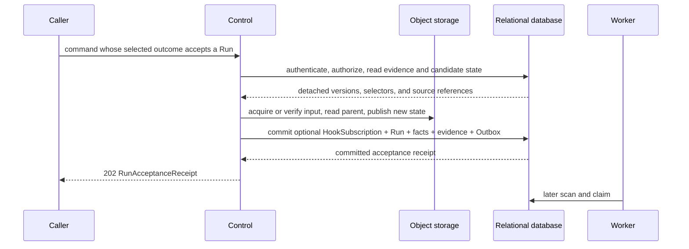
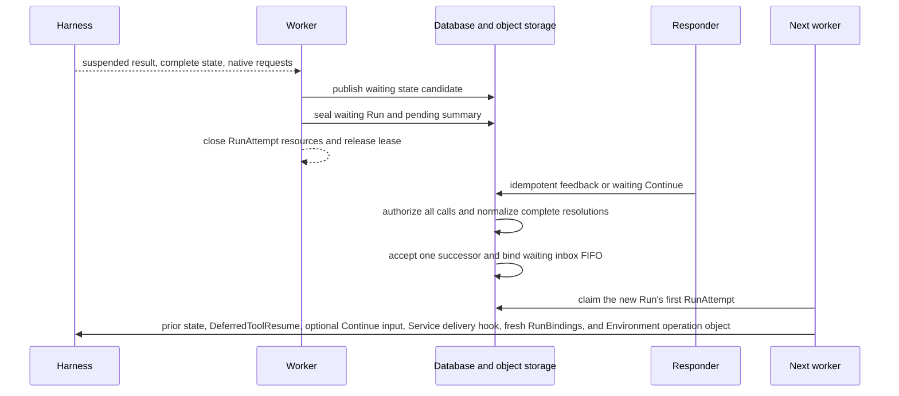

# Agent Control: Input and Continuation

## Design Position

Service accepts every new semantic unit of Agent work as a durable Run belonging to exactly one Session and Thread. Start, immediate continuation, continue from an explicit historical Run, waiting feedback, explicit waiting Continue with default resolutions, fork, and retry are distinct acceptance forms over that same boundary. An existing-Thread Run submission can instead create an editable queued submission when earlier work prevents immediate continuation. Every successful acceptance creates a new Run; queue admission creates no Run, and neither path reopens or mutates a sealed Run.

This contract owns those caller- or responder-driven acceptance forms, their public command surfaces, and deferred-interaction feedback. Automatic Run acceptance for an inactive Thread receiving an asynchronous child result is owned by [Async Subagents](34-async-subagents.md#delivery-to-an-inactive-thread); it reuses the same Thread and Run advancement authority without becoming feedback or another public command. Adjacent input, Thread, Run, RunAttempt, and recovery concerns remain with the owners below. Worker takeover and automatic checkpoint recovery do not accept another semantic unit of work and remain outside this contract.

## Additional Environment Associations

Environment selection below fixes the primary Environment. Client WebSocket Environments must be online at Run acceptance. [Live Run mounts](29a-websocket-environments-and-live-mounts.md) owns separately authorized additions and their continuation/recovery rules; additions do not change the primary selection.

## Boundaries

| Concern                                                                                       | Owner                                                                                                                      | Relationship                                                                                                               |
| --------------------------------------------------------------------------------------------- | -------------------------------------------------------------------------------------------------------------------------- | -------------------------------------------------------------------------------------------------------------------------- |
| Session, Thread, Run, and Item meaning                                                        | [Platform Interaction Model](../interaction-model.md)                                                                      | Supplies the shared interaction identities                                                                                 |
| Ordinary semantic Agent input                                                                 | [Agent Input](17-agent-input.md)                                                                                           | Supplies the versioned `AgentInput` accepted by input-bearing commands                                                     |
| Start, immediate continue, continue from, fork, retry, waiting feedback, and waiting Continue | This contract                                                                                                              | Accepts one new Run or rejects the operation without advancing the Thread                                                  |
| Queue-if-busy existing-Thread Run submission                                                  | [Agent Control: Queued Submissions](20-agent-control-queued-submissions.md)                                                | Stores complete editable submission intent whose later consumption creates a Run                                           |
| Thread version, current Run, and selected head                                                | [Durable Thread Persistence](11-thread-persistence.md)                                                                     | Supplies the exact advancement precondition and commits selected Run references                                            |
| Run state, lineage, accepted intent, and outcome                                              | [Durable Run State](12-run-persistence.md)                                                                                 | Persists the complete accepted input and its deterministic state key                                                       |
| Worker claim and recovery inside one Run                                                      | [Run Attempts, Scheduling, and Recovery](13-run-attempt-scheduling-and-recovery.md)                                        | Creates replacement RunAttempts without accepting another Run                                                              |
| Asynchronous child acceptance and retained delivery                                           | [Async Subagents](34-async-subagents.md)                                                                                   | Delivers Host-owned Agent input to an active Run or automatically accepts an eligible successor Run without using feedback |
| Common Thread inbox persistence                                                               | [Agent Control: Active Execution](19-agent-control-active-execution.md#thread-inbox)                                       | Stores cross-kind FIFO, waiting-source binding, rollover, and later consumption evidence                                   |
| Public API conventions and durable mutation evidence                                          | [Platform API Conventions](../api-conventions.md) and [Durable Operations and Outbox](06-durable-operations-and-outbox.md) | Own shared version, idempotency, retry, and unknown-commit behavior                                                        |

Configuration-purpose entry and successors additionally obey [Agent Configuration Assistant](43-agent-configuration-assistant.md#configuration-session-and-thread-scope). Public start cannot select its hidden Agent. Generic continuation, retry, feedback, fork and queued-input consumption cannot remove or replace protected ownership or the Session-owned stable draft identity. All Threads in the Session share that draft, including after application. New ordinary configuration input freezes the currently deployed assistant definition; Retry, waiting Feedback/Continue and other source-preserving successors retain the selected source execution snapshot even when allocating a new Run ID. Current draft mode/target and authority are re-evaluated at their owning boundaries. These predicates supplement the eligibility and state-initialization rules below rather than defining a parallel control loop.

## Acceptance and Lineage

This contract owns operation eligibility, input selection, and configuration inheritance. The following table is the canonical public operation matrix; [Run state initialization](12-run-persistence.md#state-initialization-matrix) owns how the selected source becomes a complete new Run-owned envelope.

The accepted operation determines the new Run identity, state source, input protocol, and explicit retry correlation:

| Operation         | Public command                                | Thread effect                                                                                       | State and lineage                                                                                                                                                | Accepted Run input                                    | Run authority Principal                                     |
| ----------------- | --------------------------------------------- | --------------------------------------------------------------------------------------------------- | ---------------------------------------------------------------------------------------------------------------------------------------------------------------- | ----------------------------------------------------- | ----------------------------------------------------------- |
| Start             | `POST /api/v1/workspaces/{workspace}/runs`    | Creates a root Thread with its first Run                                                            | `lineage_kind="root"`, `parent_run_id=null`                                                                                                                      | New `AgentInput`                                      | Authenticated caller                                        |
| Submit / Continue | `POST /api/v1/threads/{thread_id}/runs`       | Advances an eligible existing Thread immediately, explicitly advances waiting, or queues the intent | On acceptance, completed head: exact head parent; waiting Continue: exact waiting parent; null head after failed/cancelled current Run: root-like with no parent | `AgentInput` or composite `WaitingRunContinueInput`   | Caller for ordinary input; waiting Run for waiting Continue |
| Continue From     | `POST /api/v1/runs/{source_run_id}/continue`  | Re-selects one completed historical Run and advances its Thread                                     | `lineage_kind="continue"`, parent is the exact completed source Run                                                                                              | New `AgentInput`                                      | Authenticated caller                                        |
| Feedback          | `POST /api/v1/runs/{waiting_run_id}/feedback` | Advances the existing Thread                                                                        | `lineage_kind="continue"`, parent is the exact waiting Run                                                                                                       | Complete normalized `WaitingRunFeedback`              | Waiting Run                                                 |
| Fork              | `POST /api/v1/runs/{run_id}/fork`             | Creates an independent in-Session Thread with its first Run                                         | `lineage_kind="fork"`, parent is the exact completed source Run                                                                                                  | New `AgentInput`                                      | Authenticated caller                                        |
| Retry             | `POST /api/v1/runs/{run_id}/retry`            | Advances the existing Thread                                                                        | Copies the failed or cancelled source Run's lineage and state-source edge and records `retry_of_run_id`                                                          | Copies the source Run's accepted input kind and value | Failed or cancelled source Run                              |

Start, continue, continue from, feedback, and fork have `retry_of_run_id=null`. Retry never uses the failed or cancelled source as `parent_run_id`: that field continues to name only the exact sealed state source. A retry of a failed root therefore has no parent; a retry of a failed continue, continue from, feedback, or fork copies the source Run's exact `parent_run_id` and `lineage_kind`.

Start authorizes `agent.invoke`. Ordinary Continue and Continue From authorize `run.continue` plus `agent.invoke`; Fork authorizes `run.fork` plus invocation authority; Retry authorizes `run.retry`; Feedback authorizes `run.feedback`; and waiting Continue authorizes both `run.continue` and `run.feedback`. Retry, Feedback, and waiting Continue additionally reauthorize the inherited Run authority Principal's current `agent.invoke` and referenced-resource eligibility as specified below. The IAM [stable action registry](33-identity-and-access-management.md#stable-action-registry) owns built-in role grants, while this contract owns these operation-specific combinations and lineage predicates.

Run acceptance authenticates and authorizes the command actor, determines the exact User or Service Account `authority_principal` shown above, validates that Principal's current eligibility together with the selected Session and Thread, resolves or preserves the exact AgentRevision required by the operation (or the protected assistant definition snapshot described above), resolves the typed override into one complete `EffectiveAgentConfig`, applies scoped idempotency, publishes the complete initial Run state, and atomically creates or advances the Thread together with the accepted Run and its lifecycle publication intent. The command actor and authority Principal can differ for Feedback, waiting Continue, Retry, queued consumption, and internal acceptance. Such an operation authorizes both roles explicitly; it never treats command authority as impersonation. The Run becomes schedulable only after the complete initial state object is durably available.

Every successful Run acceptance returns `202` with this conceptual receipt:

```python
class RunAcceptanceReceipt:
    schema_version: Literal["1"]
    session_id: SessionId
    thread_id: ThreadId
    thread_version: int
    run_id: RunId
    run_version: int
    status: Literal["accepted"]
    hook_subscription_id: HookSubscriptionId | None
```

The response does not wait for Worker claim or Harness completion. The same command Principal, selected Run authority Principal, operation kind, resource scope, idempotency key, and canonical semantic request return the original receipt. Reuse with different content conflicts. A lost response after possible acceptance remains unknown until the caller repeats the same key or reads authoritative Run state.

`POST /api/v1/threads/{thread_id}/runs` instead returns the queue-aware [`ThreadRunSubmissionReceipt`](20-agent-control-queued-submissions.md#public-api). Its `run_accepted` outcome contains this receipt; its `queued` outcome contains the newly created queued submission and no Run identity.

### Common Acceptance Flow



Environment preview and final acceptance use the same intent resolution: an explicit selection or opt-out, the operation-selected historical/current source, or the Agent default. Preview does not allocate. The final transaction revalidates the source and its access ceiling before binding or allocating. The normalized semantic request has one fingerprint throughout replay and acceptance.

No relational transaction spans input acquisition, object storage, Harness state transformation, or Worker execution. The operation checks each Principal and credential on first use and reuses detached IAM observations across preparation under the [request-local authorization contract](33-identity-and-access-management.md#authorization-contract). Configuration selection checks mutable references once and constructs one complete snapshot; later edits or permission revocation do not restart or reject that same operation. These reads use ordinary short sessions, without configuration or IAM row locks or a requirement for one coherent database timestamp. The final short transaction rechecks durable version, current/head, source, digest, lease/fence, and idempotency preconditions needed by the operation, while action and scope predicates use the already observed IAM facts. This snapshot ends with the bounded operation, not with the accepted Run. Objects published before a losing or rolled-back transaction are non-authoritative cleanup candidates.

Every input-bearing command and terminal Retry in this contract can select an inline `hook_subscription` owned by [Hook Notifications](26-hook-notifications.md#durable-hook-subscriptions). Feedback, waiting Continue, and Retry distinguish omission (inherit the direct source's accepted inline configuration), explicit `null` (none), and a complete configuration object (replace), under the owner's [successor selection rules](26-hook-notifications.md#successor-inline-subscriptions). Other commands create a subscription only from explicit configuration. Selection participates in the canonical command request; each selected subscription commits atomically with the accepted Run and returns its fresh ID in the receipt. When an ordinary existing-Thread submission queues, the exact explicit inline input remains part of the editable queued submission intent; Service creates no HookSubscription until consumption accepts its Run, and consumption never inherits one from its then-current source. Hook selection is neither Agent input nor an invocation option and cannot affect execution. Hook shape, authority, scope, expiry, retention, delivery, and idempotency remain with that owner.

## Input-Bearing Operations

Start, existing-Thread Run submission, and continue-from requests carry an [`AgentInput`](17-agent-input.md#agent-input-protocol), a selected stable Agent when permitted, an optional exact `agent_revision_id`, an independent optional `expected_default_revision_id`, one typed `config_override`, and, for start, an optional Session selector. Fork accepts the same ordinary input and policy-permitted selections against its source. Ingress provenance is supplied only by the trusted Connectivity path, not as caller-declared metadata on the public start command. Fields other than `AgentInput` are command options and never enter its `content` or `structured_content`.

The existing-Thread route's reusable submitted intent has this conceptual shape. Its fields are top-level fields of the POST request beside `expected_thread_version`; a queued resource retains them together as `submission`.

```python
class ThreadRunSubmissionIntent:
    input: AgentInput
    agent_id: AgentId | None
    agent_revision_id: AgentRevisionId | None
    expected_default_revision_id: AgentRevisionId | None
    config_override: AgentRunOverride | None
    environment: EnvironmentSelection | None  # May be absent; omission inherits.
    hook_subscription: InlineHookSubscriptionInput | None  # May be absent.


class WaitingResolutionDefaults:
    mode: Literal["defaults"]
    sealed_state_digest_sha256: str
```

`waiting_resolution` is an optional top-level field of `POST /threads/{thread_id}/runs`; it is not part of `ThreadRunSubmissionIntent` and is never retained in a queued submission. Its only accepted value is `WaitingResolutionDefaults`. Omitting it preserves ordinary queue-if-busy behavior. Supplying it is an explicit request to finalize the current waiting head with fail-closed defaults and accept the submitted `AgentInput` in that same successor Run.

The route preserves `hook_subscription` field presence before choosing ordinary submission or explicit waiting Continue. Omission selects no inline subscription for an ordinary submission but selects inheritance from the waiting Run for waiting Continue; explicit `null` selects none for either operation.

`config_override` follows the finite merge contract in [Agent Management](28-agent-management.md#agentrunoverride-and-effective-configuration). Skill, managed Connection tool, Plugin, Model, subagent, client-tool, output, and correction changes appear only inside that typed object. Environment is a separate invocation selection under [Environment Management](29-environment-management.md#thread-defaults-and-run-selection). Acceptance freezes its ID/access and updates the Thread default atomically. The normalized request includes effective configuration choices and Environment selector semantics in one canonical digest; lower acceptance layers do not rewrite it.

Only start, ordinary existing-Thread Run submission, continue from, fork, and equivalent Host-owned initial Run submission can supply ordinary invocation options. A queued existing-Thread submission preserves those options as unaccepted intent and resolves and reauthorizes them only when consumption accepts a Run. Feedback, waiting Continue, and retry accept no Agent selection or config override; they preserve the exact `EffectiveAgentConfig` required by their source Run. Preservation does not bypass new-Run lifecycle checks: if a retained Skill identity has been deleted, the successor is not accepted even though the already accepted source Run remains recoverable. Waiting Continue carries only its new `AgentInput` and optional inline Hook input in addition to the default-resolution declaration.

### Start and Continue

Start accepts Agent work that does not continue an existing Thread:

```http
POST /api/v1/workspaces/{workspace}/runs
Idempotency-Key: opaque-caller-key
```

The request names one stable `agent_id` and supplies one `AgentInput`. Optional `session_purpose` selects `execution` (default) or `debug` when creating a Session, under the [Session purpose contract](16-management-api.md#session-reads). Supplying it with an existing `session_id` is rejected; no command reclassifies an existing Session. Omitting `agent_revision_id` selects the current Revision; supplying it selects that exact retained executable Revision even when historical. `expected_default_revision_id`, when present, separately requires the Agent's current pointer to match. Acceptance applies the typed override, resolves and freezes `EffectiveAgentConfig` plus one then selects or creates one Session and allocates its root Thread ID. It initializes `HarnessState.new(thread_id=thread.id)` and atomically commits the version `1` Thread row, its first root Run, lifecycle facts, idempotency evidence, and Outbox records. A separate `POST /api/v1/workspaces/{workspace}/threads` operation uses the same allocation rules without accepting input or a Run; it can create the root Session, records its optional Environment/default and returns the empty Thread. First input then uses the existing-Thread Run route. Neither allocation path performs Provider I/O.

The existing-Thread Run route accepts a continuation immediately when the Thread is eligible and otherwise queues the complete submission intent:

```http
POST /api/v1/threads/{thread_id}/runs
Idempotency-Key: opaque-caller-key
```

The request carries `expected_thread_version`, the fields of `ThreadRunSubmissionIntent`, and optional `waiting_resolution`. Service locks the Thread, verifies the expected version, and applies the queue admission order owned by [Queued Submissions](20-agent-control-queued-submissions.md#admission-and-mutation-rules):

1. if `waiting_resolution` is present, require the current and head Run to be the same waiting Run and apply the explicit [waiting Continue](#waiting-continue-with-defaults), without consuming or reordering any queued submission;
2. otherwise, if the current Run is `failed` or `cancelled`, reject when any queued submission exists or the selected head is waiting; with an empty queue, accept immediately from the completed head or through the null-head root-like rule below;
3. otherwise, if any queued submission exists, append the complete intent after it;
4. otherwise, if the current Run is `accepted`, `running`, or `waiting`, create a queued submission;
5. otherwise, accept the first root Run when both Run references are null, or a continuation from the completed head when eligible; and
6. otherwise, reject because the locked Thread selection supports neither immediate acceptance nor queue admission.

Queue admission creates no Run, does not change `Thread.version`, advances `Thread.queue_version`, and returns `outcome="queued"`. Immediate acceptance returns `outcome="run_accepted"`, creates the Run, and increments `Thread.version`. Both outcomes are selected against locked commit-time state and are preserved by the route's idempotency evidence. This public command owns exactly one evidence record and original receipt in its `thread.submit` scope. Its immediate branches reuse acceptance without acquiring another public command identity; replay precedes branch selection and version validation. Independently invoked Run commands keep their own operation-scoped evidence.

When `head_run_id` names an exact completed Run, Service never infers a parent from timestamps. The selected Agent defaults to that parent's stable Agent. Omitted Revision selection resolves its current Revision; an exact selector or override is accepted only when compatible with the parent state. Acceptance initializes a new Run-owned state from the completed parent, freezes the final effective configuration, creates the Run with `lineage_kind="continue"`, sets `current_run_id` to it, preserves the head until the successor seals, increments Thread version, and commits the Run and its related durable facts.

When both Run references are null, first input requires an explicit Agent selector and initializes a root Run with the existing Thread ID and saved Environment default. When `head_run_id=null` and the current Run is `failed` or `cancelled`, the same route performs root-like acceptance in the existing Thread. The new Run has `lineage_kind="root"`, `parent_run_id=null`, and `retry_of_run_id=null`. A trusted Service state adapter constructs a complete empty Harness state with `HarnessState.new(thread_id=thread.id)`, preserving the existing Thread's exact identity rather than asking Harness to generate another one. When omitted, the stable Agent defaults to the current failed or cancelled Run's stable Agent; acceptance resolves its current Revision and optional typed override. The acceptance transaction selects the new Run as current, leaves the head null until a waiting or completed outcome seals, and increments Thread version. This is new input rather than Retry of the failed or cancelled intent.

A waiting head is not equivalent to an absent head. When the current Run is that waiting head, an existing-Thread Run submission without `waiting_resolution` queues instead of changing it. When a failed or cancelled successor preserves a waiting head, the same submission is rejected rather than queued. Feedback, explicit waiting Continue, Retry of the failed or cancelled successor, or an explicit branch operation such as Continue From can establish the next state.

Schedules, Webhooks, service requests, native Ingresses, and Host-managed asynchronous children use the same Run-acceptance application boundary even when their owning input surface is not one of these public routes. Each path supplies one explicit User or Service Account Principal under its owning contract: native Account reception supplies its current same-Workspace execution Service Account, an authenticated service request supplies its caller, and an asynchronous child inherits its parent Run. A schedule or other persistent source must likewise retain one explicit Principal. A `system` actor, service process identity, external provider actor, webhook sender, or scheduler identity cannot be used as the Run authority Principal.

### Continue From an Explicit Run

Continue From accepts another same-Thread continuation from one caller-selected historical state:

```http
POST /api/v1/runs/{source_run_id}/continue
Idempotency-Key: opaque-caller-key
```

The request has the same `expected_thread_version`, `AgentInput`, Agent selector, exact Revision selector, current-Revision precondition, typed override, independent Environment selection, and optional Hook fields as ordinary Continue. The source must be a retained, readable `completed` Run in the target Thread, but it need not be that Thread's current Run or selected head. Service also requires that the Thread have no current `accepted` or `running` Run.

Acceptance initializes state from the exact source and creates a same-Thread Run with `lineage_kind="continue"` and `parent_run_id=source_run_id`. In the final short transaction it sets `current_run_id` to the new Run, sets `head_run_id` to the selected source, increments the Thread version, and commits the accepted Run and related facts. If the successor later seals as `waiting` or `completed`, it becomes the new head. If it seals as `failed` or `cancelled`, the selected source remains the head.

Selecting a source other than the prior head intentionally abandons that prior branch as the Thread's active continuation selection. In particular, a historical waiting Run that is no longer both current and head is not eligible for Feedback. The operation does not synthesize rejection or no-response values for that abandoned deferred pending set; the sealed Run remains retained history. In the same transaction it first marks an async result from a failed or cancelled origin `suppressed`, then marks every remaining pending ordinary steer or async result sourced to the abandoned waiting branch `superseded`, so a stale Feedback, waiting Continue, or Retry cannot rebind those deliveries to the historical completed branch.

Several retained successors can therefore share the same completed parent over time. The single-active-Run constraint serializes execution, while `parent_run_id` preserves every accepted branch. Continue From preserves the Thread ID and is distinct from Fork, which creates another Thread, and from automatic recovery, which creates no Run.

### Fork

Service exposes an explicit in-Session Thread fork from one selected completed Run:

```http
POST /api/v1/runs/{run_id}/fork
Idempotency-Key: opaque-caller-key
```

Any retained and readable completed Run is eligible, including a historical Run that is neither the source Thread's `current_run_id` nor `head_run_id`.

The request carries `AgentInput`, compatible Agent/config selections and a separate optional Environment choice. Service authorizes the source Run and Session, allocates a child Thread, applies `HarnessState.fork(thread_id=new_thread_id)`, clears portable Environment state, and atomically commits its first Run and fixed Environment selection. Omitted Environment selection copies the source Run's complete target/working-directory/access binding; an explicit selection uses another environment or allocates one from a template. Agent/config inheritance is independent: omission preserves the source Run's exact AgentRevision and `EffectiveAgentConfig`, including its accepted Run overrides; an explicit compatible Agent/Revision/override selection resolves a new effective configuration under [Agent Management](28-agent-management.md#agentrunoverride-and-effective-configuration). No file copying, target creation or connection occurs during acceptance; execution applies the selected preparation policy.

The source Run is part of fork's common idempotency scope. A Session fork that creates a new Session and root Thread remains a distinct Session-domain operation and is never implied by this route.

## Retry of Terminal Intent

```http
POST /api/v1/runs/{run_id}/retry
Idempotency-Key: opaque-caller-key
```

The request has this conceptual shape; absence is a wire distinction, not a JSON sentinel:

```python
class RetryRunRequest:
    expected_thread_version: int
    hook_subscription: InlineHookSubscriptionInput | None  # May be absent; omission inherits.
```

Omitting `hook_subscription` selects the failed or cancelled target Run's accepted inline configuration under [Hook successor selection](26-hook-notifications.md#successor-inline-subscriptions); explicit `null` selects none, and a complete object replaces that default. Any resulting subscription has a fresh identity and binds to the retry Run, not to the target or copied state parent. Notification selection can change independently of the exact execution intent described below.

The target must be the Thread's current failed or cancelled Run. The request carries `expected_thread_version` and accepts no new `AgentInput` or invocation option. Acceptance copies the source Run's `authority_principal`, `input_kind`, exact normalized accepted input or feedback value, `parent_run_id`, `lineage_kind`, AgentRevision, `EffectiveAgentConfig`,. The copied accepted input retains each binary URL or Environment-path source description or exact immutable `asset_id`; Retry acceptance reauthorizes that source and the stored authority Principal but does not read or copy its file body. The retrying caller must currently hold `run.retry` for the source, but does not become the new Run's Principal. Acceptance records the source in `retry_of_run_id`, reauthorizes every retained selector, creates a new Run-owned state from the same eligible state source, copies its complete Environment binding and sets the Thread default to that binding, and obtains fresh credentials, `RunBindings`, a fresh Environment operation object for the copied logical Environment, and recovery authority. Retry initializes fresh accepted execution state: version one, no Attempt ownership, zero attempt/recovery/handoff counters and charged usage, new creation/availability timestamps, and no prior start, seal, completion, or Environment-use timestamp. Execution treats Retry as a new Run with zero prior model requests and reacquires any binary bytes required by its frozen delivery. An Asset ID never resolves to replacement content; deletion or unavailability fails the new Run explicitly.

Retry never re-runs a client-side effect, changes an accepted feedback decision, or makes the failed source an eligible state parent. If the failed source was a root, the retry initializes another root state. Otherwise it repeats the source operation's state transformation from the same frozen parent. Pending ordinary steer and different-origin async delivery previously bound to the failed or cancelled source were already `superseded` and are not inherited. Every not-yet-consumed async result whose spawning Run is that source is instead `suppressed`, whether it published before or after source sealing; Retry never re-enables or binds it. When the preserved head is waiting, a later async result can bind to the retry Run only if its own spawning Run is not failed or cancelled. If retried execution needs child work, it accepts a new child and relationship under the retry Run. Once another Run advances the Thread, the old terminal Run is no longer retryable.

## Deferred Interaction

Approval, client-tool execution, and structured user input are frozen pending facts inside one sealed waiting Run and its complete state object. They are not independent mutable resources or relational rows. Service defines no provider-continuation pending kind; provider-native public-message continuation remains inside the Harness/model-integration boundary and does not create a Service waiting reason or feedback mapping. Asynchronous child results remain durable Thread-inbox entries under [Async Subagents](34-async-subagents.md#result-publication); they never enter this pending set or cause a Run to wait.

Feedback-eligible pending kinds remain distinct:

- `approval` asks an authorized human or service to permit a proposed action;
- `client_tool` asks an external client to perform a named effect and return its declared result;
- `user_input` requests structured information without authorizing another effect.

The exact native deferred requests live in `RunCheckpoint.host.deferred`; the Run row stores only the matching bounded `RunPendingSummary` owned by [Durable Run State](12-run-persistence.md#run-state-object). The public route exposes those facts as read projections beneath the waiting Run and accepts one atomic feedback command:

```http
POST /api/v1/runs/{waiting_run_id}/feedback
Idempotency-Key: opaque-caller-key
```

The submitted resolution union is a serialized wire schema:

```python
class ApprovePendingResolution:
    call_id: str
    action: Literal["approve"]


class RejectPendingResolution:
    call_id: str
    action: Literal["reject"]


class CompletePendingResolution:
    call_id: str
    action: Literal["complete"]
    result: JsonValue


class RespondPendingResolution:
    call_id: str
    action: Literal["respond"]
    response: JsonValue


type SubmittedPendingResolution = (
    ApprovePendingResolution
    | RejectPendingResolution
    | CompletePendingResolution
    | RespondPendingResolution
)


class WaitingRunFeedbackRequest:
    expected_thread_version: int
    sealed_state_digest_sha256: str
    resolutions: tuple[SubmittedPendingResolution, ...] = ()
    hook_subscription: InlineHookSubscriptionInput | None  # May be absent; omission inherits.
```

The Hook field retains all three presence states independently of resolution normalization. Feedback selects configuration from the targeted waiting Run only under [Hook successor selection](26-hook-notifications.md#successor-inline-subscriptions); it never reopens that Run's expired subscription.

The frozen pending kind determines which action and result schema are legal: `approve` and `reject` apply only to approval, `complete` applies to an exact client-tool request, and `respond` applies only to structured user input. `result` and `response` use the versioned JSON encoding declared by the exact pending request and its locked adapter. The request cannot repeat a call ID, name an unknown call, supply a mismatched action, or override the pending kind.

Submitting this route finalizes the entire feedback-eligible pending set. The caller can supply any subset explicitly; Service expands every omitted call in frozen request order before acceptance:

| Pending kind  | Explicit action       | Omitted outcome |
| ------------- | --------------------- | --------------- |
| `approval`    | `approve` or `reject` | `reject`        |
| `client_tool` | `complete`            | `no_response`   |
| `user_input`  | `respond`             | `no_response`   |

An empty `resolutions` tuple therefore rejects every approval and records no response for every other feedback-eligible call. This is fail-closed finalization, not a partial update. The principal or internal caller must be authorized to finalize every pending call because omission also changes the continuation result.

The accepted Run stores the complete normalized value, not only the submitted subset:

```python
type PendingResolutionOutcome = Literal[
    "approve",
    "reject",
    "complete",
    "respond",
    "no_response",
]


class AcceptedPendingResolution:
    call_id: str
    kind: Literal[
        "approval",
        "client_tool",
        "user_input",
    ]
    outcome: PendingResolutionOutcome
    result: JsonValue | None


class WaitingRunFeedback:
    schema_version: Literal["1"]
    waiting_run_id: RunId
    sealed_state_digest_sha256: str
    resolutions: tuple[AcceptedPendingResolution, ...]
```

Every accepted `WaitingRunFeedback` covers its complete owning pending set exactly once and preserves frozen request order. Service expands public defaults and validates the complete typed value before computing the canonical semantic request digest. Explicitly rejecting an approval is therefore equivalent to omitting it; non-approval `no_response` arises only through omission. The accepted feedback is the immutable input of the new Run; the waiting parent and its pending summary never change.

### Waiting Continue with Defaults

An existing-Thread submission that supplies `waiting_resolution.mode="defaults"` deliberately abandons interactive resolution of the current waiting set while preserving the caller's new semantic input. Service expands the entire frozen set exactly as if `/feedback` had been called with an empty `resolutions` tuple: every approval becomes `reject`, and every client-tool or structured user-input request becomes `no_response`. The caller cannot mix explicit resolutions into this operation.

The accepted immutable input has this conceptual schema:

```python
class WaitingRunContinueInput:
    schema_version: Literal["1"]
    waiting_run_id: RunId
    sealed_state_digest_sha256: str
    resolutions: tuple[AcceptedPendingResolution, ...]
    input: AgentInput
```

The operation authenticates the caller and checks both ordinary Thread Continue authority and authority to finalize every frozen pending call. The final acceptance transaction reuses those IAM observations, locks the Thread and waiting Run, and requires `current_run_id=head_run_id=waiting_run_id`. It verifies `expected_thread_version`, the exact sealed-state digest, the complete default resolution set, and scoped idempotency. Agent selection, config override, Environment changes, client-tool-surface changes, and authority-Principal overrides are forbidden. The successor preserves the waiting Run's exact `authority_principal`, AgentRevision, `EffectiveAgentConfig`, complete Environment binding, and deferred surface; it uses `lineage_kind="continue"`, `input_kind="waiting_continue"`, and `parent_run_id=waiting_run_id`.

Acceptance creates exactly one successor Run. The `WaitingRunContinueInput` contains both the normalized defaults and the canonical accepted `AgentInput`; no intermediate feedback Run is created. Retry copies this composite value exactly. Any queued submissions remain in their existing order and state. This explicit advancement can occur while the queue is non-empty because it resolves the selected waiting head rather than consuming queued intent.

The same acceptance transaction binds every still-pending Thread-inbox delivery whose `source_waiting_run_id` names the parent to the new successor in ascending `delivery_sequence`. The entries remain `pending`, preserve their sequence and payload, and are not part of `WaitingRunContinueInput`. A concurrent Feedback, waiting Continue, Continue From, or other branch operation admits at most one winner under the same Thread version and locks; a losing command creates no Run and changes no inbox binding.

On first execution, Service passes the complete normalized resolutions as `DeferredToolResume` and the accepted `AgentInput` as ordinary input to the same first model request. The first checkpoint that marks the composite Run input `applied` proves both values crossed the Harness input boundary together and that the isolated request reached the complete first-request hook boundary. A crash before that checkpoint replays both; recovery from an applied checkpoint supplies neither again.

For `ask_user_question`, the pending presentation includes the validated question text, headers, options and multi-select flags. Feedback is validated against the sealed native request before a successor Run is accepted. Structured responses use the Harness question-answer envelope; plain text from older clients or retained Runs is normalized to a general `response` before native resume. Invalid answers are rejected as invalid feedback without advancing the Thread.

### Harness Mapping

The Worker maps the accepted batch by owning boundary:

| Pending kind  | Mapping                                                                                                                                                   |
| ------------- | --------------------------------------------------------------------------------------------------------------------------------------------------------- |
| `approval`    | Native `ToolApproved` or `ToolDenied`.                                                                                                                    |
| `client_tool` | `complete` becomes the declared native result; `no_response` becomes an explicit failed external-call result, never a missing entry or successful `null`. |
| `user_input`  | `respond` is validated against the exact request; `no_response` uses the locked interaction adapter's explicit representation.                            |

For native Pydantic requests, Service constructs one `DeferredToolResults` whose `calls` and `approvals` maps exactly cover the authoritative `DeferredToolRequests`, then passes both through the Harness [`DeferredToolResume`](../a13n-harness/16-input-model-and-output.md#input) with the prior state, fresh `RunBindings`, and a fresh Environment operation object supplied as Harness Run inputs. Defaults are therefore explicit results by the time Harness preflight runs. An explicit feedback successor supplies no ordinary input, so its first model request receives only the deferred results. A waiting-Continue successor supplies both the deferred results and its `AgentInput` to that same first request.

Pending deliveries bound from the waiting parent remain in PostgreSQL and invisible to the first model request. The Worker installs the Service-owned awaited Capability hook defined by [Active Execution](19-agent-control-active-execution.md#waiting-binding-and-first-request-hook-delivery). At the complete safe boundary after that request and any resulting tool batch, the hook queries and offers the eligible FIFO through native enqueue before an ordinary result can terminate. If the request produces another deferred/HITL result, the hook enqueues nothing; Service may seal the Run as waiting and roll the entries forward. The boundary is the first model request rather than the end of a `ModelAttempt`, because one `ModelAttempt` can contain several model requests.

## Suspension and Feedback Run



Suspension first conditionally publishes the complete waiting state candidate at the Run's deterministic state key. One fenced relational transition verifies that the Run remains current, reconciles inbox receipts in the selected state, rolls the remaining bound delivery to this waiting source, seals it, terminalizes the source RunAttempt, copies the bounded pending summary to the Run row, selects the exact state digest and checkpoint sequence, retains the waiting Run as current, selects it as the Thread head, increments Thread version, and commits lifecycle facts. The same transaction expires the inline Hook subscription after matching the final lifecycle events under [Inline Subscription Lifetime](26-hook-notifications.md#inline-subscription-lifetime). The Worker then closes Harness and its owned Environment Sessions, credentials and local resources. Shared Control Device connections remain open.

Feedback authenticates the responder, locks the Thread, requires both `current_run_id` and `head_run_id` to name the target waiting Run, verifies the expected Thread version and sealed-state digest, authorizes the complete pending set, validates and expands the submitted subset, and reauthorizes the waiting Run's stored authority Principal before applying scoped idempotency. After publishing the new Run's complete initial state and any object-backed feedback, one short transaction repeats those preconditions, inserts a Run with the waiting Run's `authority_principal`, `input_kind="waiting_feedback"`, and `parent_run_id=waiting_run_id`, selects it as current, increments Thread version, binds the waiting Run's pending inbox FIFO to that direct successor, and commits lifecycle facts, idempotency evidence, response Items when applicable, and outbox intents. The successor also preserves the waiting Run's complete Environment binding and updates the Thread default; later execution prepares/resumes/rebuilds under that Environment's policy. The responder authorizes the resolution but does not take over the execution identity. The accepted feedback records the exact pending identities and normalized outcomes; no mutable pending-action row is updated.

If the Feedback or waiting-Continue Run later fails or is cancelled, Retry can only reaccept that same normalized execution input and decisions; it selects notification configuration independently. The waiting parent remains frozen, but it is no longer the Thread's current Run, so another feedback command with different content cannot race the accepted successor.

## Persistence Impact

Related persistence integration is:

| Persistence owner        | Required contract                                                                                                                                                                                                                                                                                                                                                                                                                                                                           |
| ------------------------ | ------------------------------------------------------------------------------------------------------------------------------------------------------------------------------------------------------------------------------------------------------------------------------------------------------------------------------------------------------------------------------------------------------------------------------------------------------------------------------------------- |
| `runs`                   | Stores immutable `authority_principal_type` and `authority_principal_id`, `input_kind` to distinguish `agent_input`, `waiting_feedback`, `waiting_continue`, and the `async_subagent_result` input owned by [Async Subagents](34-async-subagents.md#delivery-to-an-inactive-thread), plus nullable `retry_of_run_id` to correlate exact terminal intent without changing the state-parent edge. Existing inline or object-backed JSON columns store the complete accepted descriptor value. |
| Run lineage constraints  | Permit several retained same-Thread successors to share one completed `parent_run_id`; only the partial unique constraint for one `accepted` or `running` Run per Thread serializes active advancement.                                                                                                                                                                                                                                                                                     |
| Waiting pending data     | No `pending_actions` table. The waiting Run row stores only `pending_json`; its sealed state stores exact native deferred requests.                                                                                                                                                                                                                                                                                                                                                         |
| Inbox delivery           | The common `thread_inbox` entry remains authoritative; waiting Feedback or Continue binds pending entries to the direct successor, while checkpointing or eligible automatic async-result acceptance consumes them independently of deferred feedback.                                                                                                                                                                                                                                      |
| Inline Hook delivery     | Explicit or inherited creation and sealing-time expiry commit atomically under [Hook Notifications](26-hook-notifications.md); the inline head and Revision v1 retain accepted notification configuration for eligible successors and replay. A queued submission retains explicit unaccepted Hook input, and no Run column stores callback configuration.                                                                                                                                  |
| Durable command evidence | Existing idempotency, lifecycle, Item, and outbox records commit with the accepted Run under their owning contracts.                                                                                                                                                                                                                                                                                                                                                                        |

`input_kind`, `retry_of_run_id`, the exact parent edge, Thread head selection, and the source or current Run's status make every acceptance form queryable without adding an `agent_control_operations` table or another execution resource.

## Failure Semantics

| Condition                                                                                                                    | Outcome                                                                                                                   |
| ---------------------------------------------------------------------------------------------------------------------------- | ------------------------------------------------------------------------------------------------------------------------- |
| Start, immediate continue, continue from, fork, retry, feedback, or waiting-Continue validation fails before commit          | No Thread or Run advancement occurs                                                                                       |
| Concurrent Thread advancement or sealing wins                                                                                | The stale command conflicts and changes nothing                                                                           |
| Retry target is not the current failed or cancelled Run                                                                      | Retry conflicts without creating a Run                                                                                    |
| Existing-Thread submission targets a failed or cancelled current Run but cannot accept immediately                           | The request is rejected without creating a queued submission or Run                                                       |
| Feedback contains a duplicate, unknown, wrong-action, invalid-result, stale, or expired call                                 | No feedback Run is created; the waiting parent remains unchanged                                                          |
| Feedback responder cannot finalize every pending call                                                                        | Request is denied without disclosing concealed pending content                                                            |
| Waiting Continue omits the declaration, has a stale digest, supplies an execution override, or lacks full feedback authority | It queues when undeclared; otherwise no advancement or inbox rebinding commits                                            |
| Native deferred requests and normalized results do not exactly cover one another                                             | The operation is rejected before acceptance when detectable; otherwise the accepted successor fails before new model work |
| Resume surface differs from the suspended surface                                                                            | The accepted Feedback or waiting-Continue Run fails before Harness continuation                                           |

## Invariants

01. Start, immediate continue, continue from, feedback, explicit waiting Continue, fork, and terminal retry accept another Run; an existing-Thread submission can instead queue without accepting one. Acceptance returns before later Worker claim, RunAttempt allocation, or Harness execution.
02. Immediate Continue and Continue From preserve the Thread ID; Fork creates a distinct Thread ID. Continue with a null head initializes empty state with `HarnessState.new(thread_id=thread.id)` under that existing identity.
03. Retry accepts no new input or invocation option, copies the exact accepted execution intent and state-source edge, records `retry_of_run_id`, and never inherits or re-enables async results originating from the failed or cancelled source. Inline notification selection remains independently inheritable, replaceable, or explicitly absent.
04. Ordinary Agent work uses `AgentInput`; waiting feedback uses the separate complete normalized `WaitingRunFeedback` protocol; waiting Continue stores one `WaitingRunContinueInput` containing default resolutions and `AgentInput`; asynchronous result input is owned independently by the async-subagent contract.
05. Feedback finalizes the complete eligible pending set; omitted approvals reject and omitted non-approval calls record no response.
06. A waiting Run is sealed and holds no RunAttempt lease; feedback or explicit waiting Continue creates a new Run whose `parent_run_id` names it.
07. Native deferred values remain exactly correlated; Host-owned child delivery never enters feedback or impersonates a native deferred call, and approval, external effect, and child completion remain independent facts.
08. Pending actions are immutable projections of one waiting Run, not independently mutable resources or relational rows.
09. Continue From accepts any retained and readable completed Run in the same Thread, atomically selects it as head while creating its successor, and does not require that source to be the prior current Run or head.
10. An ordinary existing-Thread Run submission never bypasses a queued submission. It can append to an existing queue unless the current Run is `failed` or `cancelled`; with an empty queue it queues while the current Run is `accepted`, `running`, or `waiting`, uses the exact completed head when eligible, or accepts a root-like Run with no parent after a failed or cancelled current Run with `head_run_id=null`. A failed or cancelled current Run rejects any submission that cannot accept immediately. An explicitly declared waiting Continue advances the waiting head without consuming or reordering that separate queue.
11. Waiting Feedback and waiting Continue bind pending waiting-source deliveries to their one direct successor; the first model request processes deferred results and optional Continue input before the Service-owned awaited delivery hook can make any such delivery visible.
12. Start, ordinary Continue, Continue From, and Fork use the authenticated caller as the new Run's authority Principal; Feedback and waiting Continue inherit the waiting Run's Principal; Retry inherits the terminal source Run's Principal. A command actor never becomes an execution Principal merely by causing one of the inheriting operations to commit.

## Retained Memory Behavior

Every accepted execution participates in the [Memory selection contract](42-memory.md#execution-memory-selection). Initial acceptance, queued consumption and ordinary new input finalize selection atomically with their receipts. Source-preserving Retry, waiting feedback/Continue and forks inherit the source selection and binding. Steer keeps the selected Run unchanged. Replay validates retained records; missing records fail rather than selecting current defaults.
