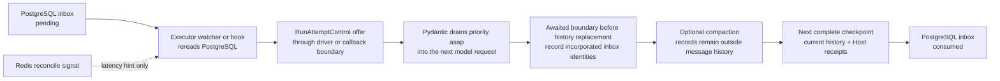

# Agent Control: Active Execution

## Design Position

Service controls an accepted, running, or waiting Thread through a durable ordered inbox and controls an active Run through an explicit interrupt command. Steering appends one accepted user-supplied semantic input without creating another Run. An asynchronous-subagent result is Host-owned Agent input carried through the same delivery order. An accepted or running target receives either kind in the current Run; a waiting target records either kind against that waiting source for its direct successor. Interrupt seals an active Run as `cancelled`; later work creates another Run and Harness Run rather than restoring the interrupted process-local Run.

PostgreSQL is authoritative for inbox acceptance, the Thread-level cross-kind FIFO, Run binding, consumption, rollover, and Run lifecycle. A Thread-scoped Redis control Stream only wakes the current `RunAttemptExecutor` control-watcher task or an inactive-Thread control reconciler early. Its consumer-group cursor remains in Redis, its entries are bounded and expire after inactivity, and loss of the Stream never loses an accepted inbox entry or changes Run state. The control API therefore remains stateless and does not route directly to a process-local Agent instance.

[Agent Input](17-agent-input.md) owns the `AgentInput` carried by steering. [Durable Run State](12-run-persistence.md) owns the resulting checkpoint and sealed outcome. [Run Attempts, Scheduling, and Recovery](13-run-attempt-scheduling-and-recovery.md) owns the current Worker fence and scheduling, while [Service–Harness Runtime Integration](14-harness-runtime-integration.md#runattempt-executor-lifetime) owns the process-local executor, `ControlWatcher`, `RunAttemptControl`, `HarnessDriver`, callback-scoped hook boundary, mandatory Capability, and private gate that invoke this contract.

## Boundaries

| Concern                                                                               | Owner                                                                                                                                           | Relationship                                                                                                                    |
| ------------------------------------------------------------------------------------- | ----------------------------------------------------------------------------------------------------------------------------------------------- | ------------------------------------------------------------------------------------------------------------------------------- |
| Thread inbox identity, FIFO, Run binding, status, and common store                    | This contract                                                                                                                                   | Persists inputs and internal results awaiting one Thread without making Redis authoritative                                     |
| Public steer, steer status, and interrupt commands                                    | This contract                                                                                                                                   | Accepts current accepted- or running-Run input or waiting-head input, exposes its exact receipt status, or seals the active Run |
| Steering `AgentInput` and binary normalization                                        | [Agent Input](17-agent-input.md)                                                                                                                | Supplies the same accepted input protocol used by start, continue, and fork                                                     |
| Async-subagent result payload and selection                                           | [Async Subagents](34-async-subagents.md)                                                                                                        | Uses the common inbox row while retaining child-result authorization, expiry, and selection semantics                           |
| State envelope, checkpoint write, and sealed-state shape                              | [Durable Run State](12-run-persistence.md)                                                                                                      | Supplies complete state and inbox receipts for steer and asynchronous-result consumption                                        |
| Worker lease, fence, scheduling, takeover, and recovery                               | [Run Attempts, Scheduling, and Recovery](13-run-attempt-scheduling-and-recovery.md)                                                             | Supplies current Worker authority and allocates the process-local Attempt executor                                              |
| Executor control facade, watcher, driver, hook boundary, Capability, and private gate | [Service–Harness Runtime Integration](14-harness-runtime-integration.md)                                                                        | Invoke this contract after PostgreSQL reread and serialize local offer, checkpoint, interrupt, handoff, and terminal decisions  |
| Redis commands and backend behavior                                                   | [Service Storage Capabilities](03-storage.md#redis-compatible-data-structures)                                                                  | Supplies Streams, consumer groups, bounded trimming, and expiry without assigning domain authority                              |
| Authentication, authorization, and idempotency evidence                               | [Identity and Access Management](33-identity-and-access-management.md) and [Durable Operations and Outbox](06-durable-operations-and-outbox.md) | Own current permission, replay evidence, and unknown-commit reconciliation; no outbox is required solely for a control signal   |
| Common API behavior                                                                   | [Management API](16-management-api.md) and [Platform API Conventions](../api-conventions.md)                                                    | Catalogs the exact public commands and receipt read without exposing the internal inbox as a generic resource                   |

## Thread Inbox

A Thread inbox entry is one durable input or internal result offered to an existing Thread independently of Run creation. The entry has its own identity, kind-owned payload, immutable Thread-level delivery order, current Run or waiting-source binding, status, retention, and consumption evidence. It does not replace Run input, Thread advancement, waiting feedback, lifecycle events, or Harness state. Ordinary steer and asynchronous-subagent results share one FIFO; kind-specific payload and authorization do not create separate scheduling lanes.

The following schema is conceptual. The relational table is named `thread_inbox`.

```python
type ThreadInboxKind = Literal[
    "steer",
    "async_subagent_result",
]
type ThreadInboxStatus = Literal[
    "pending",
    "consumed",
    "superseded",
    "suppressed",
    "expired",
    "discarded",
]


class InboxPayloadObjectRef:
    object_key: str
    digest_sha256: str
    size_bytes: int
    content_type: str
    schema_version: str


class ThreadInboxEntry:
    id: ThreadInboxEntryId
    organization_id: OrganizationId
    thread_id: ThreadId

    kind: ThreadInboxKind
    delivery_sequence: int
    accepted_against_run_id: RunId | None
    target_run_id: RunId | None
    source_waiting_run_id: RunId | None
    origin_run_id: RunId | None
    payload_schema_version: str
    payload: JsonValue | None
    payload_object: InboxPayloadObjectRef | None

    status: ThreadInboxStatus
    consumed_by_run_id: RunId | None
    consumed_state_digest_sha256: str | None
    consumed_checkpoint_seq: int | None

    expires_at: datetime | None
    created_at: datetime
    finalized_at: datetime | None

```

`delivery_sequence` is positive, immutable, and monotonic within one Thread across both kinds. The acceptance transaction locks the owning `threads` row, allocates its `next_delivery_sequence`, and increments that value in the same transaction as entry insertion. The PostgreSQL acceptance commit order serialized by that Thread row lock is the authoritative FIFO order. [Durable Thread Persistence](11-thread-persistence.md#relational-thread-table) owns the internal counter columns, their initialization, and isolation from public Thread fields. Allocating or finalizing an inbox entry changes neither `Thread.version` nor `Thread.queue_version`. Gaps caused by a terminal inbox status are valid and never permit a later pending entry to bypass an earlier eligible one.

Exactly one of `payload` and `payload_object` is present. The entry kind selects the exact versioned payload contract: `steer` stores one canonical accepted [`AgentInput`](17-agent-input.md#accepted-input-and-canonicalization), while `async_subagent_result` stores the payload owned by [Async Subagents](34-async-subagents.md#result-publication). A kind can be added only with an owning payload, authorization, targeting, consumption, expiry, and compatibility contract.

`accepted_against_run_id` is immutable and present only for public steer. It records the current accepted, running, or waiting Run named by the accepted command and keeps the public receipt stable even when waiting rollover changes later binding. `origin_run_id` is immutable and present only for an async-subagent result; it equals the spawning `ChildRunRelationship.parent_run_id` and provides the relational lock and index authority for origin-outcome suppression without decoding payload JSON. `target_run_id` names the Run that may currently consume the entry. `source_waiting_run_id` names the sealed waiting Run whose direct successor must receive the entry. A pending entry accepted or published while the Thread is waiting has no target and names that waiting Run as source. Feedback or waiting Continue atomically binds it to the direct successor while retaining the source until consumption or a later waiting rollover. An entry offered directly to an accepted or running Run has a target and no waiting source. An asynchronous result for an otherwise inactive eligible Thread can initially have neither binding while its owner applies queue precedence and automatic successor acceptance.

`pending` is the only consumable state. `consumed` means the kind-specific consumer committed its authoritative destination together with the listed consumption evidence. A steer can become only `consumed` or `superseded`; it does not expire, suppress, or support explicit discard. An async-subagent result can become `consumed`, `superseded`, `suppressed`, `expired`, or `discarded`. `suppressed` means its spawning Run failed or was cancelled before consumption, so the retained result permanently authorizes no active delivery, waiting binding, or automatic successor. Every terminal status is immutable except for retention redaction allowed by the payload owner.

`threads.pending_count` and `threads.pending_bytes` are transactionally maintained admission counters, not public Thread fields. Capacity checks, reservations, and releases use the locked Thread row and commit or roll back with the corresponding inbox entries. Rebinding an entry without finalizing it preserves its reserved capacity, and finalization or retention never resets `next_delivery_sequence`. Deployment policy bounds both values. Public steer admission rejects an overflow without inserting an entry. Async-result publication uses its separately bounded payload/object form and retention policy, but it must still reserve the common Thread budget before a pending entry becomes accepted; bounded reconciliation retries a result whose publication cannot yet reserve capacity. A result published directly as `suppressed` reserves no pending budget. Finalization releases previously reserved counters exactly once.

An entry is eligible for a Run when it is `pending`, bound to that exact target, next in the Thread FIFO among deliverable entries, within kind-owned retention, still authorized and decodable by its locked adapter, and, for an async result, has a spawning Run that is not `failed` or `cancelled`. A no-longer-eligible async result must first commit its owning `suppressed`, `expired`, or `discarded` status; a steer that cannot be permanently authorized or decoded causes the owning Run's explicit failure classification and later `superseded` disposition rather than silent skipping. “No eligible pending delivery” therefore means the outcome transaction has locked and reconciled every earlier pending row, not that a detached query happened to return none.

The table preserves these constraints and access paths:

01. `(organization_id, id)` is unique, and the owning Thread belongs to that organization.
02. Every present accepted-against, target, waiting-source, or origin Run belongs to the same organization and Thread; target and waiting source cannot identify the same Run.
03. Payload columns form an exactly-one representation group.
04. Consumption fields are absent unless `status="consumed"` and are all required when it is consumed. `finalized_at` is present exactly for a terminal status.
05. Every entry has one unique `(organization_id, thread_id, delivery_sequence)`. Steer rows require `accepted_against_run_id`, forbid `origin_run_id` and `expires_at`, and follow only consumed or superseded terminalization. Async rows require `origin_run_id` equal to the immutable parent Run of their unique relationship and forbid `accepted_against_run_id`; the async payload owner defines relationship uniqueness and expiry.
06. A pending row has exactly one legal binding shape: active target only, waiting source only, waiting-derived target plus source, or unbound async-result reconciliation. A consumed row has `consumed_by_run_id=target_run_id` as last bound; terminal non-consumed rows retain safe provenance but authorize no delivery.
07. `(organization_id, thread_id, status, delivery_sequence)` supports strict cross-kind FIFO reconciliation and admission-bound checks.
08. `(organization_id, target_run_id, status, delivery_sequence)` supports ordered active-Run delivery and the mandatory pending check before completed outcome commit.
09. `(organization_id, source_waiting_run_id, status, delivery_sequence)` supports direct-successor binding, branch supersession, and waiting rollover.
10. `(organization_id, kind, status, delivery_sequence)` supports bounded control reconciliation of pending asynchronous results whose Threads have no active Worker.
11. `(organization_id, origin_run_id, kind, status, delivery_sequence)` supports locked suppression of all not-yet-consumed asynchronous results when their spawning Run fails or is cancelled.
12. Sequence allocation and pending-capacity changes use the owning Thread row and obey its [internal counter constraints](11-thread-persistence.md#relational-thread-table); no separate counter row or lock participates.

## Steer Command

```http
POST /api/v1/runs/{run_id}/steer
Idempotency-Key: opaque-caller-key
```

The request carries one submitted `AgentInput`. The HTTP authenticator validates the credential and Principal once. Ordinary steer authorization reuses that request-local identity result while reading current Workspace, Agent, and role grants; it does not reread the credential or Principal status. Callers without a verified HTTP authentication result retain the ordinary identity checks. Service authorizes `run.steer` from the IAM [stable action registry](33-identity-and-access-management.md#stable-action-registry) during the initial precheck, before returning an idempotent receipt or reading Run state and preparing input. That authorization permits this request to finish even if the caller loses permission during preparation; later requests, including idempotent retries and receipt reads, check current authority again. Target loading and the acceptance transaction do not repeat this caller authorization.

Service validates and canonicalizes binary source descriptions, exact Asset IDs, and delivery selections without acquiring source bytes; Asset references retain their input-specific authorization. The final short transaction locks the owning Thread and named Run in canonical order and rechecks mutable admission conditions. It requires the named Run to remain current and either:

- `status` is `accepted` or `running`, in which case the new entry binds directly to that Run; or
- `status="waiting"` with `current_run_id=head_run_id=run_id`, in which case the entry records that waiting Run as its source and has no active target.

Before checking current-Run selection, status, or capacity, the transaction resolves any retained same-scope steer entry under the Thread lock. A matching key returns a projection of that entry even if the Run is no longer current or active; retry content is not compared. Only a new command reserves pending count and bytes, allocates the next Thread `delivery_sequence`, and inserts one `pending` steer together with its idempotency metadata. Steering and receipt replay do not validate Memory behavior bindings; Run acceptance and execution preparation own those bindings. It neither creates another Run nor changes Thread head, current-Run selection, `Thread.version`, or `Thread.queue_version`. The exact Run identity and locked current/head precondition make a caller-supplied Run version unnecessary.

A successful command returns `202` with this conceptual receipt:

```python
class SteerReceipt:
    schema_version: Literal["1"]
    session_id: SessionId
    thread_id: ThreadId
    run_id: RunId
    steer_id: ThreadInboxEntryId
    delivery_sequence: int
    accepted_at: datetime
```

The same scoped idempotency key returns a projection of the same entry, regardless of retry content. `202` proves durable acceptance, not that a Worker, Harness, model, or external tool has incorporated the input. The following authorized read exposes the exact steer status without making the internal Thread inbox a generic public resource:

```http
GET /api/v1/runs/{run_id}/steers/{steer_id}
```

The read returns safe identity, the immutable accepted-against Run, current target or waiting-source binding, `delivery_sequence`, `pending`, `consumed`, or `superseded` status, consumption correlation when present, and timestamps. It does not return the accepted payload or an object-store locator. Service exposes no generic Thread-inbox collection or cross-kind inbox-entry endpoint.

After the relational commit, the control process best-effort appends one business-payload-free reconcile signal to the Thread control Stream. Failure or unknown outcome of that Redis write neither rolls back the accepted inbox entry nor creates an outbox record solely for retrying the signal. The process records bounded diagnostics and readiness follows the shared Redis dependency contract.

## Steer Idempotency Storage

Public steer owns its request identity on `thread_inbox`. Three nullable internal columns form an all-null or all-present group:

| Column                   | Meaning                            |
| ------------------------ | ---------------------------------- |
| `idempotency_actor_type` | `user` or `service_account`        |
| `idempotency_actor_id`   | Authenticated Principal identity   |
| `idempotency_key_digest` | SHA-256 identity of the caller key |

Only steer entries may carry this group. Internal steer without a public idempotency key and asynchronous-result entries leave it null. A partial unique index covers `(organization_id, accepted_against_run_id, idempotency_actor_type, idempotency_actor_id, idempotency_key_digest)` where `kind='steer'` and the key digest is present. The original Run fixes the Workspace scope, which authorization checks before lookup. Neither mutable target binding nor consumption status changes replay identity. These columns are not model input or public response fields. Existing `expires_at` remains the inbox delivery lifetime and is never used for steer idempotency.

An authorized initial lookup is read-only: it takes no advisory or row lock and does not change metadata. Valid evidence returns the original inbox ID, sequence, original Run, and acceptance time directly. If preparation fails while another same-key request succeeds, a fresh lookup under the request’s established authorization may recover that receipt before reporting the preparation error.

Final acceptance uses PostgreSQL READ COMMITTED isolation, locks Thread before Run, then queries the inbox replay scope with `FOR UPDATE`. Every public steer writer follows this order. The Thread lock serializes same-scope writers even when no inbox row exists; the unique index is a final integrity backstop. No advisory lock or separate Memory-binding query is required. A duplicate never allocates a sequence or changes pending counters. A unique-key failure rolls back the entire attempted mutation before resolving the winning receipt.

The key remains with the entry without a separate expiry or lazy replacement. Ordinary inbox retention may delete it when the entry's business dependencies permit; HTTP retry protection does not extend that retention. Deletion ends deduplication.

## Environment Mount Reconciliation

[Live mounts](29a-websocket-environments-and-live-mounts.md#worker-reconciliation-and-model-boundary) reuse the Thread reconcile signal. The watcher requests a relational reread; only the root model-request boundary applies mounts to Harness. Mount changes are not inbox entries and consume no input FIFO sequence. Operation payloads use separate relay Streams.

## Unified FIFO Delivery and State Commitment

The current `RunAttemptExecutor` reconciles all eligible `pending` entries bound to its Run in ascending `delivery_sequence`. A later entry never bypasses an earlier eligible one because of kind, Redis arrival, payload location, or adapter readiness. Before moving to a later sequence, the executor must consume the earlier entry or commit its kind-owned `suppressed`, `expired`, `discarded`, or `superseded` disposition.

There are two process-local reconciliation entry points. The `ControlWatcher` child task can react to a Redis signal, but it first rereads PostgreSQL and directly awaits `RunAttemptControl.reconcile(...)` with only the resulting current facts. Independently, the executor root and its mandatory Capability directly await the same facade, which rereads PostgreSQL when the Attempt starts or takes over, before each model request, after complete tool batches, before checkpoints, and before every outcome decision. These calls execute in the caller's existing task; there is no controller task or process-local command queue. Redis loss therefore changes latency, not correctness. The one exception is a waiting successor whose accepted feedback input is still `pending`: the watcher and hooks may reconcile existing durable receipts and terminal dispositions, but they do not read or offer bound inbox payloads until the [first-request hook gate](#waiting-binding-and-first-request-hook-delivery) opens.

During initial state admission, reconciliation may observe PostgreSQL authority and terminal facts, but it does not consume from a provisional state or offer new input. After [Recovery Preparation](13-run-attempt-scheduling-and-recovery.md#recovery-preparation) confirms the final object claim and permits continuation, the executor reconciles that state's receipts and recognized same-Run provenance before any new delivery or Agent execution. Receipt repair uses the claimed write token and the ordinary complete-state CAS contract; consumption uses a short transaction under the new Attempt's current fence even when the evidence was checkpointed by an older Attempt. This recovery confirmation is separate from offering still-pending input, which requires an eligible Harness boundary and preserves the waiting-successor first-request gate.

A steer bound while its ordinary target is `accepted` needs no process-local watcher. After claim, the first Attempt reconciles PostgreSQL and offers the eligible FIFO before the first provider model request. The Run's accepted input remains the initial Harness input; accepted-stage inbox entries follow it in `delivery_sequence`. The waiting-successor first-request gate remains authoritative when the accepted Run was created by Feedback or waiting Continue.

### Offer, Incorporation, and Durable Consumption

Offer, local incorporation recording, complete state publication, and relational consumption are distinct boundaries. They must not be collapsed into “the Worker consumed the Redis event”:



Service attaches stable Host provenance to each adapted inbox value before offering it. The provenance identifies the destination Service `run_id`, `inbox_entry_id`, and kind; it survives native message serialization and replacement Attempts of that Run. Both public `HarnessRunStream.steer()` and callback-scoped enqueue preserve this association. It uses native application metadata that is not added to model-visible text, rather than message-content equality, a transient enqueue ID, or a Harness Run or `ModelAttempt` ID. Caller-authored content cannot supply or override this Host provenance. Metadata is correlation evidence only and grants no authority; the selected state scope, current inbox binding, FIFO, origin outcome, lease, and fence still require validation.

The mandatory Service control Capability synchronously records incorporation through `RunAttemptControl` before compaction or another history replacement can remove that provenance. These bounded structured records identify the same Run, inbox entry, and kind independently of message history. They survive compaction and internal `ModelAttempt` rebinding within the executor, including when compaction is disabled or fails. They remain process-local until merged into the existing `host.inbox_receipts` of a complete checkpoint; they add no separate durable inbox table or Harness-owned consumption state machine. A local record means `incorporated`, never relationally `consumed`.

For each contiguous FIFO batch, the executor:

1. reads the accepted payloads and revalidates their current binding, per-kind source descriptions, relationship, async-result spawning-Run outcome, authorization, visibility, retention, adapter, current Run, Attempt, fence, and lease outside a long transaction;
2. maps steer through the accepted `AgentInput` binary-delivery rules and maps an async result through the bounded untrusted-content adapter owned by [Async Subagents](34-async-subagents.md#delivery-to-an-active-run);
3. calls `RunAttemptControl`, which enters its private [run-control critical section](14-harness-runtime-integration.md#meaning-of-the-run-control-barrier), revalidates the same current Attempt and FIFO prefix, skips any entry already recorded as in-flight, and offers the remaining adapted values in `delivery_sequence` order without interleaving a later inbox entry. An ordinary active-run fast path asks `HarnessDriver` to use public `HarnessRunStream.steer()`; an awaited Capability supplies a driver-owned callback-scoped `HarnessHookBoundary`, whose `enqueue(..., priority="asap")` maps privately to the current `RunContext.enqueue(...)`. Either call records the inbox-to-enqueue correlation in the private gate, and the relational row remains `pending`;
4. lets Pydantic's native pending-message drain place `priority="asap"` values immediately before the next provider model request or redirect an otherwise ordinary terminal path to another model request. At the next awaited complete message boundary, before any history replacement, it matches Host provenance and complete adapted content in that history to the eligible inbox prefix and records the incorporated identities outside message history. An enqueue return value or absence from the pending queue alone is insufficient;
5. at the next complete checkpoint selected by the [Run-state triggers](12-run-persistence.md#checkpoint-triggers-and-refresh), exports the current history, which may already be compacted, and merges the recorded incorporations with prior Host receipts. It includes exactly one receipt per incorporated entry and conditionally replaces the Run's deterministic `state.json` under the current object version and Attempt fence; and
6. in a new short transaction, locks the Thread, Run and every async-result spawning Run in the affected prefix in stable ID order, current RunAttempt, and affected entries in canonical order; revalidates the same current Run, Attempt, fence, lease, exact FIFO prefix, origin outcomes, and published state; marks an entry whose origin is now failed or cancelled `suppressed`; and otherwise marks the incorporated contiguous prefix `consumed` with the exact state digest and checkpoint sequence and releases its pending counters.

Recording incorporation is a synchronous process-local operation; it does not require a checkpoint or consumption transaction before compaction can proceed. At the next complete checkpoint, state export and receipt assembly form one operation under the run-control critical section. The exported history is the continuation at or after the recorded incorporations, either preserving their original messages or carrying the result of an admitted history replacement. Records from a later or different continuation cannot be paired with an older exported history. Every recorded incorporation is included in that checkpoint, independently of whether its original message or metadata remains visible. Records are released only after the matching receipt is confirmed in durable state; failed or uncertain writes retain them for reconciliation. Merging is idempotent by same-Run inbox identity, preserves FIFO order, and rejects conflicting kinds. Multiple entries can share one checkpoint.

`EnqueuedMessagesEvent` remains an observation and is neither a prerequisite for recording incorporation nor a checkpoint trigger by itself. Service does not wait for stream-consumer acknowledgement inside a Capability hook. A delayed or repeated event cannot generate another receipt or an additional checkpoint solely for that event. Publication uncertainty and consumption failures follow the ordinary bounded failure and reconciliation rules; local recording never guesses a durable success.

An entry merely offered during a hook remains pending without an incorporation record or consumption receipt until its complete content reaches native history. If no matching driver or safe Capability boundary is attached, the private gate is terminally fenced, or the waiting-successor gate is still closed, the executor leaves durable work pending. It never stores a Redis payload for later delivery. A later mandatory PostgreSQL reconciliation retries from durable state.

The state receipt contains each inbox entry ID and kind. It is retained across replacement Attempts of the same Run and is not inherited merely because another Run copied parent state. Provenance copied in parent history does not authorize consumption by the new Run. Service's admitted history projections and recovery paths preserve incorporation records even when they remove the original input before checkpoint publication. If recording fails, the input and its provenance cannot be discarded by history replacement; the owning hook follows the ordinary classified failure path. Compaction itself performs no Service database transition. `consumed` means that a relational transaction verified an exact durable Run-state checkpoint containing the receipt and corresponding continuation. It does not claim that a model understood the input, that a particular later model request included it, or that subsequent effects occurred exactly once.

Before reoffering pending entries on recovery, the current Attempt checks existing receipts even when the selected same-Run history has been compacted. A readable prior checkpoint that contains complete inbox content with recognized same-Run provenance but lacks its receipt is reconciled without enqueueing that content again: the current owner revalidates eligibility and the FIFO prefix, conditionally republishes the complete envelope with the missing receipts, and only then commits relational consumption. This repair never rewrites sealed state or overrides a winning terminal disposition. Without a receipt or complete content with recognized provenance, summary text, content hashes, and event history do not prove that a pending entry was delivered; it remains pending for ordinary delivery. Two separately accepted entries with identical content remain distinct inputs.

If state publication succeeds but relational consumption does not, the current or replacement Attempt executor reconciles the receipt without enqueueing the entry again while that Run remains an eligible running destination. A waiting or completed sealing transaction can perform the same reconciliation when its selected state contains the receipt. If failed or cancelled sealing wins first, every still-pending async result originating from that Run becomes `suppressed`, while ordinary steer and async results merely bound from another origin become `superseded`; an object-only receipt cannot overwrite either terminal disposition. If the executor disappears after local recording or compaction but before publishing the corresponding checkpoint, those local records and that compacted history are not durable. The entry remains pending and can be recognizably delivered again from the selected prior checkpoint. A steer's `environment_path` source is then reacquired and deterministically replaced. Service prefers possible duplicate pre-checkpoint delivery to silently losing accepted input.

A planned handoff does not consume or supersede pending delivery. The successor Attempt for the same running Run preserves FIFO and can reconcile already-published receipts. The safe handoff boundary cannot occur during input materialization, native enqueue, state publication, or the consumption transaction. If the local Harness Run crosses its native terminal boundary after the last hook reconciliation while eligible pending delivery exists, that candidate cannot seal as completed. The owning executor commits a retryable Attempt failure so an in-budget replacement resumes the same Run and drains the FIFO.

## Waiting Binding and First-Request Hook Delivery

Waiting Feedback and explicit waiting Continue accept exactly one direct successor under the [continuation contract](18-agent-control-input-and-continuation.md#deferred-interaction). Their final transaction locks the Thread, waiting parent, every relevant async-result spawning Run, and its pending waiting-source entries in canonical order. It suppresses entries whose origin is failed or cancelled, then sets `target_run_id` on the remaining eligible entries to the new successor in `delivery_sequence` order. The entries remain pending and keep `source_waiting_run_id` until they are consumed, superseded, suppressed, or rolled to a later waiting Run. If that successor later fails or is cancelled, results originating from it become suppressed and other entries bound to it become superseded. A later async result can remain sourced to the preserved waiting head and bind to a Retry only when its own spawning Run is not failed or cancelled. Continue From or another explicit branch that abandons the waiting head instead marks that waiting branch's remaining unconsumed ordinary steer and eligible async-result entries `superseded` in the same advancement transaction.

Service does not query or offer the waiting-derived FIFO before the successor's first model request. It withholds every later bound entry behind that prefix as well, including an async result or running steer accepted after successor creation. The first request receives only the successor's accepted Run input: explicit Feedback supplies `DeferredToolResume`, while waiting Continue supplies both `DeferredToolResume` and its `AgentInput`. No inbox payload enters that request.

The `RunAttemptExecutor` installs the trusted Service-owned concrete [control Capability](14-harness-runtime-integration.md#definition-construction) directly in the process-local `AgentDefinition`; it is not supplied through a Harness plugin and does not add a Harness input, queue, or durable receipt API. This mandatory executor composition is neither persisted nor caller-selectable, grants no authority by itself, and does not change the accepted model, instructions, tools, Skill, Environment, or deferred surface. For each awaited hook, the Capability borrows the current context, asks `HarnessDriver` for one callback-scoped `HarnessHookBoundary`, and passes only that boundary to `RunAttemptControl`. The facade performs PostgreSQL reads and payload materialization through short-lived Service services, enters its private gate, and asks the boundary to enqueue. The driver-owned boundary alone maps that call to `RunContext.enqueue(..., priority="asap")`; it is invalidated before the hook returns. No database session spans model or tool work, no Service object retains the raw context afterward, and no process-local enqueue ID is authoritative.

The first-request gate follows these public Pydantic boundaries:

- after a first response with no tool calls, awaited `after_model_request()` reconciles the eligible FIFO and enqueues its adapted values before response handling can terminate;
- after a first response with tool calls, the Capability waits for awaited `after_node_run()` on the complete `CallToolsNode`. An ordinary next-request or terminal result reconciles and enqueues the FIFO, while a deferred/HITL terminal result enqueues nothing and allows Service to seal waiting and roll the entries forward; and
- Pydantic's native pending-message drain places `priority="asap"` values into the next model request or redirects an otherwise terminal ordinary result to another model request. Service synchronously records their incorporation before history replacement and merges the records into the next complete checkpoint, even if that history is compacted; `EnqueuedMessagesEvent` delivery does not gate this work.

The gate is defined by the first model request and the complete tool batch, when one follows that response, not by `ModelAttempt`; one attempt can contain several requests. The first complete checkpoint after this gate proves the accepted feedback or waiting-Continue input was applied. A replacement Attempt that restores such an applied checkpoint can reconcile pending delivery before its own first model request; a replacement that restores `checkpoint_seq=0` must preserve the isolated first-request rule. A new inbox entry accepted after the gate participates in the ordinary FIFO. PostgreSQL binding, final outcome checks, and receipts remain authoritative.

## Interrupt Command

```http
POST /api/v1/runs/{run_id}/interrupt
Idempotency-Key: opaque-caller-key
```

Interrupt is an independent command and is never encoded as a steer mode or an `AgentInput`. It authenticates and authorizes `run.interrupt` from the same registry; locks the owning Thread, target Run, current RunAttempt when present, and affected entries in canonical order; requires the Run to remain current and active; and in one short transaction:

- seals the Run as `cancelled` through the ordinary Run lifecycle;
- terminalizes and deselects the current RunAttempt when one exists;
- marks every pending async-subagent result originating from that Run `suppressed`, marks every ordinary steer or different-origin async result targeted at that Run `superseded`, and releases their pending counters;
- preserves the prior continuation head and advances the Thread version; and
- commits lifecycle facts and idempotency evidence required by their owners.

Interrupt performs no object-store I/O and selects no new sealed state. The cancelled Run is not an eligible continuation parent, and a later retry rebuilds from the source Run's eligible parent, so cancellation does not need to capture an in-flight `state.json`. A state write prepared by the stale Worker can have an unknown storage outcome after cancellation, but it cannot change the relational outcome, become selected continuation state, or consume a superseded or suppressed delivery. Retry inherits neither disposition and never re-enables an old child result.

After commit, the control process best-effort appends the same reconcile-Thread signal to the control Stream. The current executor's `ControlWatcher` consumes the signal, rereads the cancelled Run and its registered RunAttempt from PostgreSQL, and awaits `RunAttemptControl.reconcile(...)` only when that registration identifies its exact terminalized Attempt. The facade fences its private gate, closes admission, asks `HarnessDriver` to call process-local `HarnessRunStream.cancel()`, and cancels the structured executor scope. A different or later generation never receives that process-local cancellation. The relational transition already prevents the old executor from committing; the Redis signal only reduces wasted model, tool, Environment, or Worker time. A lost signal is discovered by the next mandatory PostgreSQL boundary check.

A later retry follows the [terminal-intent retry contract](18-agent-control-input-and-continuation.md#retry-of-terminal-intent) and creates a successor Run with a fresh RunAttempt and Harness Run. It never reopens the cancelled Run or resumes its process-local objects.

## Thread Control Signal Stream

Each Thread can have one organization-scoped Redis Stream dedicated to active-control wakeups. It is distinct from the Run presentation Stream owned by [Lifecycle and Stream Persistence](24-lifecycle-and-stream-persistence.md). The key is derived from organization and Thread identity and is never exposed as a bearer reference.

```python
class ReconcileThreadSignal:
    schema_version: Literal["1"]
    thread_id: ThreadId
```

Every entry means only “reconcile this Thread.” It carries no command kind, Run identity, inbox identity, or business payload. The current executor's control watcher or an inactive-Thread control reconciler determines whether steer, interrupt, an async-subagent result, or no current action exists from PostgreSQL after receiving the signal.

One stable Redis consumer group per Thread stores the delivery cursor inside Redis. An executor watcher consumer is named by its Worker identity, Worker generation, and RunAttempt identity. A new RunAttempt executor first reconciles PostgreSQL, then joins the same group and can claim abandoned group deliveries from a prior Worker generation. The group cursor, pending-entry list, acknowledgement, and Redis entry ID are transport state only; none is copied into the Thread row or used to decide whether an inbox entry was consumed.

The Stream uses bounded approximate trimming and an inactivity TTL. Publication and an active executor watcher refresh the TTL; once the Thread is cold and no owner refreshes it, the Stream and its consumer-group metadata expire together. The TTL and maximum length are bounded deployment configuration. Expiry, trimming, duplicate delivery, acknowledgement loss, consumer replacement, and complete Redis loss are safe because every signal causes a database reconciliation and every authoritative command is already represented in PostgreSQL. After expiry, the next publisher or active executor recreates the Stream and its stable group before appending or consuming signals; it still reconciles PostgreSQL first and never tries to reconstruct the expired cursor.

The executor watcher or inactive-Thread control reconciler acknowledges a signal immediately upon receipt, before querying PostgreSQL or processing pending input. Acknowledgement confirms transport receipt only; it does not imply successful reconciliation, Pydantic incorporation, checkpoint publication, or relational inbox consumption. An acknowledgement failure leaves the signal eligible for consumer-group reclaim. A failure or process loss after acknowledgement is recovered through periodic PostgreSQL reconciliation and the replacement executor's mandatory initial reconciliation; pending inputs never depend on redelivery of an acknowledged signal. For an active Attempt, the watcher directly awaits bounded `RunAttemptControl.reconcile(...)` after the acknowledgement attempt. It hands derived current facts to the facade rather than writing to Harness from its consumer loop. A signal can be stale, duplicated, or out of order; it never carries enough information to authorize or perform a domain transition without the database read. Independently, control replicas perform bounded PostgreSQL scans for pending asynchronous-result entries so an inactive Thread does not depend on a surviving Redis signal or active executor for eventual reconciliation.

## Completion and Control Races

Inbox acceptance, origin suppression, binding, consumption, waiting rollover, automatic async-result successor acceptance, interrupt, planned yield, explicit branch advancement, and Run outcome selection use the canonical lock order: Thread, current, named, or async-result spawning Runs, current RunAttempt when applicable, the consuming Workspace when admitting Environment capacity, affected Environment records in stable Environment-ID order, then inbox entries in `delivery_sequence`; queue rows follow under their owning consumption transaction. The Thread row lock also protects sequence allocation and pending-capacity accounting and remains held through commit or rollback. Runs of the same lock class use stable ID order. Attempt-scoped mutations additionally verify the shared fence and lease. No transaction spans Redis, object storage, Harness execution, model work, or tool work.

Outcome rules distinguish completion from waiting:

- `completed` can seal only after the selected state reconciles all of its receipts and the transaction proves no eligible `pending` delivery remains bound to the Run;
- `waiting` can seal with pending delivery. The transaction consumes receipts present in the selected waiting state, clears `target_run_id` on every remaining bound pending entry, sets `source_waiting_run_id` to the sealing Run, preserves `delivery_sequence`, and releases none of their pending budget;
- `failed` or `cancelled` atomically marks every still-pending async result originating from that Run `suppressed`, marks every ordinary steer or different-origin async result bound to that Run `superseded`, and releases their pending budget; and
- planned `yielded` seals no Run, changes no inbox binding or status, and leaves the successor Attempt to preserve the FIFO.

Waiting rollover does not put an inbox payload into `state.json`, add it to the pending-action summary, or treat it as deferred feedback. The selected waiting state's native deferred requests and the Thread inbox remain independent authorities. Feedback or waiting Continue later binds the rolled entries to the direct successor; another waiting outcome can roll the still-unconsumed suffix forward again.

Waiting sealing and concurrent acceptance serialize without stranding an old target:

- if inbox acceptance commits first against the running Run, the waiting transaction observes and rolls that entry;
- if waiting sealing commits first, a later steer or async-result publication observes the current/head waiting Run and records it directly as `source_waiting_run_id`; and
- no committed pending entry may retain an active target whose Run has already sealed waiting.

The remaining races follow from the same locks:

- if claim changes an accepted Run to running first, a concurrent steer revalidates the same current Run and can still bind to it; if steer commits first, the first Attempt discovers it through mandatory PostgreSQL reconciliation before relying on a Redis wakeup;
- if completed sealing commits first, a later public steer observes an ineligible terminal Run and is rejected; a later async result follows its inactive-Thread and queue-precedence rules;
- if delivery acceptance commits first, completed sealing observes it and cannot commit until it is consumed or finalized, while waiting sealing may roll it forward;
- if interrupt or another failed/cancelled seal commits first, stale consumption, waiting, completion, failure, or yield writes are fenced out and no object-only receipt can replace `suppressed` or `superseded`;
- if consumption commits first, later waiting, completion, or interrupt preserves that consumed fact and never claims rollback;
- if yield commits first, old-Attempt writes are fenced out, pending delivery stays bound to the same running Run, and later accepted delivery joins the same FIFO; and
- if an explicit Continue From or other branch abandons a waiting head first, its transaction supersedes that waiting source's unconsumed entries, so a stale Feedback or waiting Continue cannot bind them elsewhere.

Between a committed yield and successor claim, interrupt can seal the running Run even though `current_run_attempt_id` is null. It suppresses pending results originating from that Run, supersedes other bound pending delivery, and prevents a later claim. A successor claim that wins first creates a fresh Attempt; ordinary fencing then governs the later interrupt.

The executor can perform additional database checks at execution boundaries for latency, but only the final locked receipt reconciliation and pending-delivery check make outcome selection authoritative. A check performed before acquiring the outcome transaction locks is insufficient.

If eligible input wins the completion race, Service preserves the same running Run and its complete Harness progress. It does not reapply the original accepted input or fail the Run merely because delivery arrived at this boundary. If Harness has already finished, the transaction succeeds the current Attempt, charges usage, clears current selection, and makes the Run immediately eligible for a `pending_input` Attempt within its execution budget. If a recovery Attempt is still leased and has not entered Harness, it executes the continuation itself. In either case, the first eligible FIFO entry becomes the new native input, the completed candidate is replaced by a progress checkpoint only with new incorporation receipts, and later FIFO delivery follows the normal hooks. Actual budget exhaustion or independent execution failure still follows its owning failure rule. A closed native stream declines a steer offer without inventing consumption; the entry remains pending for this continuation.

If runtime preparation outlives the eligible continuation input, an empty FIFO is a normal race. Before entering Harness, control reuses the outcome coordinator under the current authority and outcome locks: it seals the saved candidate when no eligible delivery remains, or reads the FIFO again when newly accepted input still requires continuation. Sealing ends preparation through bounded resource cleanup and returns the committed outcome without a model request or another Attempt.

Receipt confirmation is scoped to one exact stored checkpoint. A newly published or restored checkpoint starts unconfirmed; successful fenced confirmation marks it confirmed in the local gate. Repeated reconciliation of that same checkpoint skips the redundant receipt transaction. Failed or uncertain confirmation remains unconfirmed and is retried idempotently. This optimization never skips lease-authority checks, current inbox eligibility reconciliation, or the final locked completion check. Before every payload materialization batch, the inbox reader locks the Thread, current execution authority, origin Runs, and pending rows in the canonical order; it expires or suppresses ineligible asynchronous results and releases their pending capacity before selecting the surviving FIFO prefix. It materializes payloads only after that short transaction closes.

## Failure Semantics

| Condition                                                            | Durable outcome                                                                                                                                                  | Reconciliation                                                                                            |
| -------------------------------------------------------------------- | ---------------------------------------------------------------------------------------------------------------------------------------------------------------- | --------------------------------------------------------------------------------------------------------- |
| Steer validation or authorization fails                              | No inbox entry exists                                                                                                                                            | Caller corrects input or authority                                                                        |
| Steer response is lost after commit                                  | The inbox entry may already be pending                                                                                                                           | Repeat the same idempotency key or read the exact steer status                                            |
| Steer commits against an accepted Run before a concurrent claim      | The pending entry remains bound when the Run becomes running                                                                                                     | The first Attempt reconciles PostgreSQL before the first model request                                    |
| An accepted Run fails or is cancelled before steer incorporation     | The pending steer becomes superseded with the Run outcome                                                                                                        | Retry or another Run supplies new input; the old steer is not inherited                                   |
| Redis publication fails or the Stream expires                        | PostgreSQL inbox and Run state remain authoritative                                                                                                              | Worker safe-point and takeover reconciliation discover pending work                                       |
| Worker receives a stale or duplicate signal                          | No duplicate domain transition follows from the signal                                                                                                           | Re-read current entry, Run, Attempt, and fence                                                            |
| Worker dies before state publication                                 | The FIFO prefix remains pending and may be delivered again                                                                                                       | Replacement Attempt resumes from the last durable state                                                   |
| Native incorporation event is delayed behind a checkpoint hook       | The hook merges recorded incorporations with the current complete history, including compacted history                                                           | No wait for the event consumer and no additional checkpoint solely for the delayed event                  |
| Compaction replaces input after local incorporation recording        | The row stays pending; the independent records remain available for the next complete checkpoint                                                                 | Merge the records into Host receipts with the compacted continuation                                      |
| Worker dies after recording or compaction but before checkpoint      | Local records and compacted history are lost; no relational consumption was committed                                                                            | Resume the prior checkpoint and redeliver pending input when no durable receipt exists                    |
| Incorporation recording fails before history replacement             | The row stays pending and the original input cannot be discarded by compaction                                                                                   | Apply ordinary classified hook failure without inventing consumption evidence                             |
| Prior state has recognized same-Run inbox provenance but no receipt  | The content is already represented; the row remains pending until receipt repair and consumption commit                                                          | Revalidate, conditionally publish the missing receipt, and confirm without enqueueing again               |
| State publishes but consumed-row transaction does not commit         | While the Run remains running, the receipt can prove incorporation while the row appears pending                                                                 | Current or replacement Worker reconciles it without enqueueing again                                      |
| A pending steer's binary source cannot be read or validated          | The current Attempt follows ordinary retryable or permanent failure classification                                                                               | Retry leaves the steer pending for reacquisition; terminal failure supersedes it                          |
| Failed/cancelled wins after state publication but before consumption | Own-origin async results become suppressed; steer and different-origin async results bound there become superseded; the object-only receipt is non-authoritative | No later Worker changes either entry to consumed                                                          |
| Run becomes completed before steer acceptance                        | No steer entry is accepted                                                                                                                                       | Caller starts or continues with a new Run                                                                 |
| Run becomes waiting before steer acceptance                          | The steer is accepted against that waiting source when current/head still match                                                                                  | Its direct successor receives it after the first-request barrier                                          |
| Interrupt commits while local work continues                         | Run is durably cancelled and the old Attempt is stale                                                                                                            | Redis or the next database boundary stops local work; no stale result can commit                          |
| Yield commits while delivery remains pending                         | Run remains running, the old Attempt is terminal, and the FIFO remains pending                                                                                   | Successor Attempt consumes it under the ordinary checkpoint contract                                      |
| State contains an inbox receipt but yield wins before consumption    | Object receipt is valid while the relational entry can still appear pending                                                                                      | Successor reconciles the same-Run receipt and does not enqueue it again                                   |
| Worker dies before publishing an asynchronous-result receipt         | Result remains pending and no Run is recorded as its durable destination                                                                                         | Current replacement or later eligible Run can receive the recognizable result                             |
| Waiting state is selected without a pending entry's receipt          | The Run seals waiting and the entry is rebound to it as waiting source                                                                                           | Feedback or waiting Continue later binds it to the direct successor                                       |
| Completed state is selected while eligible delivery is pending       | Completed sealing is deferred; the Run remains running                                                                                                           | Worker continues the same Run from its complete checkpoint and drains the FIFO before sealing             |
| First request produces another deferred/HITL result                  | The Service delivery Capability enqueues nothing and the successor can seal waiting                                                                              | Waiting rollover preserves the pending FIFO for the next direct successor                                 |
| Redis is lost while the parent Thread is inactive                    | Pending result remains authoritative in PostgreSQL                                                                                                               | Bounded control scans discover it without a Redis delivery guarantee                                      |
| Outcome or interrupt races with yield                                | The shared locks and Attempt fence admit one authoritative transition                                                                                            | Loser observes committed state and cannot publish its stale candidate                                     |
| External model, tool, child, or Environment effect exists            | Interrupt and inbox delivery do not roll it back; an interrupted or repeated boundary can remain unknown                                                         | The owning provider or Capability's idempotency, receipt, or durable-task contract governs reconciliation |

## Compatibility and Trade-offs

Inbox entry kind, payload schema version, `delivery_sequence`, normalized async `origin_run_id`, accepted, running, and waiting binding, per-kind status meaning including async-result suppression, waiting rollover, first-request invisibility, interrupt terminal meaning, stable Host provenance, and consumption evidence are durable compatibility facts. The existing Host receipt schema is unchanged; receipts remain valid when original messages have been compacted. Historical messages without recognized provenance cannot be retroactively matched by content. One executor-owned `ControlWatcher` child task, PostgreSQL-after-wakeup reconciliation, direct awaited facade call, synchronous incorporation recording before history replacement, and acknowledgement on receipt before reconciliation are runtime contracts. The exact private record representation, class and method names, Redis key spelling, consumer name encoding, trim batch size, TTL duration, and watcher polling algorithm remain internal when they preserve those contracts and the defined loss, expiry, and reconciliation behavior.

The relational inbox adds one durable write and later state-coupled consumption write for steering and asynchronous results. Service accepts that cost so an accepted input remains queryable and cannot disappear with a Worker or Redis failure. Omitting an outbox for control wakeups accepts delayed reaction during Redis failure; mandatory executor boundary checks and bounded control reconciliation preserve correctness and eventual observation while service capacity remains available.

## Invariants

01. PostgreSQL, not Redis or Worker memory, owns every inbox entry, consumption fact, and interrupted Run outcome.
02. Steer uses the canonical `AgentInput`, is accepted only against the exact current accepted or running Run or exact current/head waiting Run, and creates neither a Run nor a Thread advancement.
03. Ordinary steer and asynchronous-subagent results share one immutable Thread-level FIFO allocated by PostgreSQL acceptance order; neither kind can bypass an earlier eligible entry.
04. An inbox entry becomes consumed only with durable destination evidence; Redis acknowledgement never consumes it.
05. A consumed entry has committed relational evidence naming the exact Run-state checkpoint that contained its stable receipt.
06. Worker loss can duplicate an uncheckpointed delivery but cannot silently discard an accepted one.
07. Interrupt is an explicit command, not a steer mode, and seals the active Run as `cancelled`.
08. Interrupt never claims rollback of model, tool, child, Environment, provider, or client effects.
09. Eligible pending delivery blocks `completed` but does not block `waiting`; waiting sealing atomically rolls its unconsumed FIFO to that waiting Run's direct successor.
10. Failed and cancelled sealing atomically suppresses every pending async result originating from that Run and supersedes other pending delivery bound to it; Retry inherits neither disposition.
11. One Thread control Stream uses a Redis consumer-group cursor, bounded trimming, and inactivity expiry without adding a relational Redis cursor.
12. A Redis control signal identifies only the Thread to reconcile; its loss, duplication, trimming, or expiry cannot change authoritative behavior.
13. A first or replacement Attempt executor reconciles the Thread inbox before relying on Redis delivery state; for an ordinary accepted Run, eligible accepted-stage entries are offered after initial Run input and before the first model request.
14. Async-subagent results use the common FIFO while retaining their own authorization, origin-outcome gate, active-or-successor selection, retention, payload, and queue-precedence semantics; a failed or cancelled origin can neither inject a result nor trigger a new Run.
15. Planned yield neither consumes nor supersedes pending delivery; the successor reconciles it from PostgreSQL before relying on Redis.
16. A consumed entry is represented in complete same-Run state before yield, and receipt reconciliation remains valid across the yielded Attempt boundary.
17. Yield, interrupt, inbox consumption, successor acceptance, waiting rollover, and outcome serialize through the current RunAttempt fence and canonical Thread/Run locks, so only one authoritative destination or result can commit.
18. Waiting-derived delivery is invisible to the successor's first model request; the Service-owned awaited Capability hook offers it only at the following complete safe boundary, and another deferred result rolls it forward without injection.
19. Redis consumption, native enqueue acceptance, Pydantic message incorporation, complete state publication, and relational inbox consumption are distinct facts.
20. The current Attempt executor owns one supervised `ControlWatcher` child task; every signal causes a PostgreSQL reread before the watcher directly awaits bounded `RunAttemptControl.reconcile(...)`, and acknowledgement proves neither Harness incorporation nor durable consumption.
21. A steer remains relationally `pending` until a complete same-Run checkpoint contains its Host receipt and corresponding continuation, which may be compacted, and the fenced consumption transaction commits.
22. Every checkpoint includes the receipts for all incorporations recorded in its continuation, independently of original-message retention, `EnqueuedMessagesEvent` delivery, or driver progress.
23. Recovery checks same-Run receipts and any recognized provenance in retained original content before reoffering pending input; compaction does not invalidate receipts, and identical content from distinct inbox entries remains distinct.
24. Compaction may precede checkpoint publication only after synchronous incorporation recording preserves the evidence outside message history; a local record alone never changes the relational entry to consumed.
