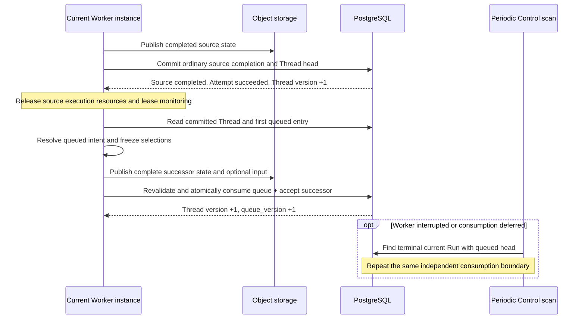

# Agent Control: Queued Submissions

## Design Position

`POST /api/v1/threads/{thread_id}/runs` carries one complete existing-Thread Run submission with queue-if-busy semantics. When the current Run is not `failed` or `cancelled` and the command cannot accept that intent immediately because work or earlier queued intent has precedence, Service creates an editable `QueuedSubmission`; when the current Run is `failed` or `cancelled`, the command must accept an eligible successor immediately or reject without creating a new queued submission. The explicit `waiting_resolution.mode="defaults"` branch is different: it resolves the selected waiting head and accepts one successor without consuming or reordering existing queued submissions. A queued submission is not a Run, RunAttempt, Thread inbox entry, execution lease, or lifecycle outcome. Enqueue, edit, delete, and reorder operations never create a Run. Consumption atomically changes one queued submission to `consumed` and accepts exactly one new Run; a queue-owned permanent invalidity instead changes it to `failed` without creating a Run. Only an accepted Run and its later RunAttempts own scheduling, execution, recovery, and outcome.

When a running Run produces a completed outcome, Service first commits that Run's ordinary completion. The same Worker instance then attempts to consume the first eligible queued submission in an independent transaction, using fresh committed Thread state. A bounded periodic scan uses the same consumption path. Successor preparation, validation, consumption failure, or Worker interruption cannot delay or roll back the already committed source outcome.

This contract keeps the queue intentionally small. A queued submission has `queued`, `consumed`, or `failed` state and has no lease, preparing, starting, blocked, cancelled, or retry state. A recoverable intent blocker leaves it queued and editable; a transient service failure or stale snapshot changes no queue fact and is retried. `failed` is terminal and is used only when a durable queue-owned fact proves that the submission can never become acceptable again under its stored identity, intent, and immutable authority Principal. A historical source is never stored in the queue; a caller that needs one uses [Continue From](18-agent-control-input-and-continuation.md#continue-from-an-explicit-run). Pending ordinary steer and asynchronous-subagent results are Thread-inbox delivery rather than queued intent. They drain before the current Run can complete and therefore before queue consumption; an eligible async result accepted after an inactive terminal outcome still cannot bypass an earlier queued submission, while a result from a failed or cancelled origin is suppressed instead.

## Boundaries

| Concern                                                                      | Owner                                                                                                                              | Relationship                                                                             |
| ---------------------------------------------------------------------------- | ---------------------------------------------------------------------------------------------------------------------------------- | ---------------------------------------------------------------------------------------- |
| Ordinary input wire                                                          | [Agent Input](17-agent-input.md)                                                                                                   | Supplies the `AgentInput` inside the complete queued Run intent                          |
| Queue-if-busy submission, queue resource, order, edit, deletion, and consume | This contract                                                                                                                      | Chooses immediate Run acceptance and owns queued, consumed, and failed lifecycle         |
| Thread advancement and queue versions                                        | [Durable Thread Persistence](11-thread-persistence.md)                                                                             | Supplies `version`, `queue_version`, current Run, and selected head                      |
| Accepted Run input, state, and lineage                                       | [Agent Control: Input and Continuation](18-agent-control-input-and-continuation.md) and [Durable Run State](12-run-persistence.md) | Canonicalizes input and creates a continuation or root-like Run                          |
| Worker claim, lease, and recovery                                            | [Run Attempts, Scheduling, and Recovery](13-run-attempt-scheduling-and-recovery.md)                                                | Begins only after the consumed Run is durably accepted                                   |
| Steer, async-result delivery, and interrupt                                  | [Agent Control: Active Execution](19-agent-control-active-execution.md) and [Async Subagents](34-async-subagents.md)               | Thread inbox entries are not queued submissions; existing queue order retains precedence |
| API and mutation evidence                                                    | [Platform API Conventions](../api-conventions.md) and [Durable Operations and Outbox](06-durable-operations-and-outbox.md)         | Own common version, idempotency, retry, and unknown-commit behavior                      |

## Queued Submission Model

The public resource has this conceptual shape:

```python
type QueuedSubmissionState = Literal["queued", "consumed", "failed"]


class QueuedSubmissionFailure:
    code: str
    message: str


class QueuedSubmission:
    queued_submission_id: str
    version: int
    thread_id: str
    authority_principal: PrincipalRef
    position: int | None
    submission: ThreadRunSubmissionIntent
    submission_digest_sha256: str
    state: QueuedSubmissionState
    consumed_run_id: str | None
    failure: QueuedSubmissionFailure | None
    created_at: datetime
    updated_at: datetime
    consumed_at: datetime | None
    failed_at: datetime | None
```

`submission` is the bounded [`ThreadRunSubmissionIntent`](18-agent-control-input-and-continuation.md#input-bearing-operations) submitted to the existing-Thread Run route, not an accepted Run input. It contains the `AgentInput` plus every policy-permitted Agent selector, exact Revision selector, current-Revision precondition, typed config override, independent Environment choice including omission/null, and inline Hook option that must survive delayed acceptance. `authority_principal` is the authenticated User or Service Account that submitted the intent and is immutable while the entry exists. The queue validates wire schemas, static limits, that Principal's current authority, and references at admission but does not resolve `delivery="auto"`, select an AgentRevision, merge `EffectiveAgentConfig`, create a HookSubscription, allocate an Environment, resolve a template version, change the Thread default, or initialize Harness state. Those decisions depend on the consumption-time head, current Run, and the stored Principal's current authority and occur only when Service accepts the resulting Run.

When the intent omits a stable Agent, consumption from a completed head inherits that parent's stable Agent and root-like consumption with a null head inherits the current failed or cancelled Run's stable Agent. An explicit stable Agent follows the ordinary continuation compatibility policy. An exact Revision selector remains exact while queued; `expected_current_revision_id` remains a separate consumption-time precondition. Consumption reauthorizes and resolves the complete typed override against the then-current eligible state. An explicitly configured inline HookSubscription is created in the same transaction as the accepted Run and receives that Run's exact scope. Omitted or null Hook input creates none; queue consumption never inherits a subscription from the consumption-time head or source Run. An option blocked by recoverable current state leaves the submission queued and editable rather than silently falling back to defaults; permanent invalidity follows the terminal classification below.

For a queued submission, `position` is positive and determines its order among currently queued entries; consumption and failure fields are absent. For a consumed submission, `position` is null, `consumed_run_id` names the exact accepted successor Run, and `consumed_at` is present. For a failed submission, `position` and consumption fields are absent while bounded `failure` and `failed_at` are present. Public `state` is derived from those terminal fields; persistence stores no separate status column. Deleting a queued submission removes it and is not another state. Consumed and failed submissions are immutable and retained under interaction and idempotency policy.

## Public API

The following routes are Service-owned `/api/v1` resources and commands:

```http
POST   /api/v1/threads/{thread_id}/runs
GET    /api/v1/threads/{thread_id}/queued-submissions
GET    /api/v1/queued-submissions/{queued_submission_id}
PATCH  /api/v1/queued-submissions/{queued_submission_id}
DELETE /api/v1/queued-submissions/{queued_submission_id}
POST   /api/v1/threads/{thread_id}/queued-submissions/reorder
POST   /api/v1/threads/{thread_id}/queued-submissions/consume
```

List and Get authorize `queued_submission.read`; queue admission authorizes `queued_submission.create` plus the selected Agent invocation; PATCH authorizes `queued_submission.update` and exact equality with the stored authority Principal; DELETE authorizes `queued_submission.delete`; Reorder authorizes `queued_submission.reorder`; and explicit Consume authorizes `queued_submission.consume`. Consumption also reauthorizes the stored authority Principal for the accepted Run. The IAM [stable action registry](33-identity-and-access-management.md#stable-action-registry) owns built-in grants; this contract owns queue state, ordering, identity, and the additional stored-Principal checks.

Every mutating route requires an `Idempotency-Key`. Same-key replay of a committed canonical request returns its original response before evaluating entry, queue, or Thread versions. The existing-Thread submission command owns one `thread.submit` evidence record for either outcome, including ordinary, root-like, and waiting successor acceptance. Reusing Run preparation or acceptance does not create a second public Run-command record. The evidence preserves the original complete response and commit-time queue generation. Explicit Run and queue commands retain their own operation scopes; automatic queue consumption relies on the queue row instead of synthetic HTTP replay evidence.

Their mutation bodies are:

```python
class UpdateQueuedSubmissionRequest:
    expected_version: int
    submission: ThreadRunSubmissionIntent


class ReorderQueuedSubmissionsRequest:
    expected_queue_version: int
    queued_submission_ids: tuple[str, ...]


class ConsumeQueuedSubmissionRequest:
    expected_thread_version: int
    expected_queue_version: int


class QueuedSubmissionMutationReceipt:
    queued_submission: QueuedSubmission
    queue_version: int


class QueuedSubmissionConsumptionReceipt:
    outcome: Literal["run_accepted", "submission_failed"]
    queued_submission: QueuedSubmission
    queue_version: int
    run: RunAcceptanceReceipt | None


class ThreadQueueMutationReceipt:
    thread_id: str
    queue_version: int


class ThreadRunSubmissionReceipt:
    outcome: Literal["run_accepted", "queued"]
    run: RunAcceptanceReceipt | None
    queued_submission: QueuedSubmission | None
    queue_version: int
```

The route accepts `expected_thread_version` plus the complete [`ThreadRunSubmissionIntent`](18-agent-control-input-and-continuation.md#input-bearing-operations) and optional top-level `waiting_resolution`. It returns `202 ThreadRunSubmissionReceipt`; exactly one of `run` and `queued_submission` is present according to `outcome`. Immediate acceptance uses the ordinary Continue, explicit waiting-Continue, or root-like existing-Thread rule. Queue admission appends after the current last queued entry and stores neither `expected_thread_version` nor `waiting_resolution`, because both are command-time admission preconditions rather than delayed Run intent.

The request requires `expected_thread_version` but no expected queue version. Service verifies the Thread version before selecting either result against authoritative commit-time state. Concurrent submissions serialize under the Thread and queue locks. Immediate Run acceptance advances `Thread.version`, so another request carrying the old version conflicts; queue-only admission leaves that value unchanged, so other same-version requests can append in the resulting deterministic queue order. Idempotent replay preserves the originally selected immediate or queued outcome.

The Thread collection defaults to queued entries in ascending `position, queued_submission_id` order. An explicit `state` filter can read retained consumed entries in ascending `consumed_at, queued_submission_id` order or failed entries in ascending `failed_at, queued_submission_id` order. Exact and collection reads reauthorize the Thread and never expose object-store or execution-private data.

PATCH replaces the complete submitted intent of a queued entry. It requires `expected_version`, revalidates the input and every command option, increments the entry version and the Thread's `queue_version`, and returns `200 QueuedSubmissionMutationReceipt`. DELETE takes `expected_version` as a required query parameter, removes only a queued entry, compacts the remaining positions, advances `queue_version`, and returns `204`. A consumed or failed entry conflicts with PATCH or DELETE. Mutation evidence makes a lost successful response reconcilable without introducing a cancelled tombstone.

Reorder carries `expected_queue_version` and the exact ordered IDs of every currently queued submission. The set must have no omission, duplicate, terminal entry, or entry from another Thread. One short transaction locks the Thread and queued rows, verifies the version and set, rewrites positions, and advances `queue_version`. Success returns `200 ThreadQueueMutationReceipt`. An unchanged order is a successful no-op and does not advance it.

Consume always selects the first queued entry. A caller chooses another entry by reordering first rather than bypassing queue order. Accepted Run creation returns `202 QueuedSubmissionConsumptionReceipt` with `outcome="run_accepted"`; terminal queue invalidation returns `200` with `outcome="submission_failed"` and no Run.

Omitted Environment selections resolve from the Thread default at consumption, not enqueue time. Explicit template choices resolve their requested exact/current version at consumption and allocate a new Environment once under acceptance idempotency. Target preparation occurs only during execution under the selected template policy.

## Admission and Mutation Rules

A retained Thread accepts `POST /api/v1/threads/{thread_id}/runs` in this order after verifying `expected_thread_version`:

1. if `waiting_resolution.mode="defaults"` is present, require current/head to name the same waiting Run and immediately accept the one composite waiting-Continue successor under its digest, authorization, no-override, input, and inbox-binding rules; existing queued submissions remain untouched;
2. otherwise, if the current Run is `failed` or `cancelled`, reject when any queued submission exists or the selected head is waiting; with an empty queue, immediately accept an ordinary continuation when `head_run_id` names a completed Run or a root-like Run with no parent when `head_run_id=null`;
3. otherwise, if any queued submission already exists, append the new intent so it cannot bypass earlier queue order;
4. otherwise, if the current Run is `accepted`, `running`, or `waiting`, create a queued submission;
5. otherwise, if both Run references are null, accept the first root Run with an explicit Agent; if the head names a completed Run, accept an ordinary continuation from it;
6. otherwise reject because locked Thread selection does not identify an eligible immediate-acceptance or queue-admission state.

Continue From, Feedback, waiting Continue, and Retry retain their independent precedence and can run while queued submissions exist because they establish the state from which later queue consumption proceeds. They do not append, reorder, or consume the queue.

Every mutation authenticates and authorizes the current principal against the Thread and revalidates the complete submitted intent's bounded schemas and references. Queue admission stores that exact Principal as `authority_principal`. PATCH additionally requires exact equality with the stored authority Principal, so editing cannot execute modified intent as another identity. Delete, reorder, and explicit consume authorize their command actor independently and do not replace the stored Principal. Input or resource identifiers grant no authority by possession. Queue admission does not promise that consumption is currently eligible. Rejection against a failed or cancelled current Run creates neither a queued row nor a Run and leaves any existing queue unchanged.

The admission branch is decided against locked authoritative Thread and queue state. Preparing an immediate Run still performs object I/O outside the final transaction: if its detached Thread, head, or queue snapshot changes before commit, Service changes nothing and restarts bounded preflight against the new state. It never falls through to a different branch inside a database transaction or holds that transaction across object storage.

Queue-only mutations lock no Run and change neither `Thread.version` nor its current/head references. They advance `Thread.queue_version`; because this is an authoritative Thread-adjacent mutation, they also update `Thread.updated_at`. A stale entry version or queue version conflicts without applying a partial edit or order.

The queue count, individual submission size, reorder body, and retained terminal history are bounded by deployment policy. Capacity rejection creates no row. Queued intent remains sensitive organization data and follows the same disclosure and retention protection as accepted Run input and invocation configuration.

## Atomic Consumption

Consumption is Run acceptance delayed until the queue chooses an intent. Service first reads detached Thread, head, queue-entry, Agent, and policy state, canonicalizes the selected intent and accepted input, builds the new Run's complete initial state from the consumption-time state-selection rule, and publishes any required Run objects outside a database transaction. Inline HookSubscription creation is prepared under its owning contract but becomes authoritative only in the final Run-acceptance transaction.

### Consumption Failure Classification

| Class                                     | Meaning                                                                                                                                  | Required behavior                                                                                                                          |
| ----------------------------------------- | ---------------------------------------------------------------------------------------------------------------------------------------- | ------------------------------------------------------------------------------------------------------------------------------------------ |
| Permanent queued-intent invalidity        | Locked durable facts prove that the submission cannot become acceptable again with its stored identity, intent, and immutable authority. | Mark the submission `failed`, record bounded failure evidence, remove it from live order, and create no Run or HookSubscription.           |
| Recoverable queued-intent blocker         | The same stored intent may become eligible after an authoritative dependency, policy, or Thread state change.                            | Leave the submission `queued` and editable; preserve the terminal source and revalidate the entry on a later explicit or recovery attempt. |
| Transient service failure or control race | Timeout, unavailable storage or dependency service, process loss, or a stale snapshot does not prove the stored intent invalid.          | Change no queue fact or source outcome; boundedly reread or retry and leave the entry queued for durable recovery if needed.               |

Only the first class may produce `failed`. Absence observed through an unavailable service, unsuccessful object publication, and a losing control race are not permanent-invalidity evidence. A race whose competing durable transition already won is reconciled from that transition rather than being reported as queue failure.

For an already terminal Thread, the final short transaction:

1. locks the Thread, current or selected head Run and every referenced async-result spawning Run in stable ID order, affected Environment records in stable Environment-ID order, pending inbox entries in `delivery_sequence`, and selected queued submission;
2. resolves idempotent replay, then verifies `expected_thread_version`, `expected_queue_version`, command-actor authorization, the stored authority Principal's current status and complete Run authority, and that the entry remains queued in the same Thread;
3. requires no current `accepted` or `running` Run and rejects a current or selected waiting state;
4. repeats all ordinary Continue input, Agent, Revision, current-Revision, effective-config, Runtime, inline-Hook, parent-state, empty-state, and digest preconditions;
5. when `head_run_id` names a completed Run, inserts one `accepted` Run with `authority_principal` copied from the queue entry, `lineage_kind="continue"`, `input_kind="agent_input"`, and `parent_run_id=head_run_id`;
6. when `head_run_id=null` and the current Run is `failed` or `cancelled`, inserts one root-like `accepted` Run with `authority_principal` copied from the queue entry, `lineage_kind="root"`, `input_kind="agent_input"`, and `parent_run_id=null`; the trusted state adapter initializes empty state under the existing Thread ID;
7. marks every unbound async result whose spawning Run is failed or cancelled `suppressed`, then binds every remaining eligible result to the new Run in `delivery_sequence`; no pending entry is injected into initial Run input or consumed by this binding;
8. freezes the independently resolved Run Environment selection and updates `default_environment_id` atomically, sets `current_run_id` to the new Run, preserves the completed head or the null head selected above, and increments `Thread.version`;
9. sets the queue row's `consumed_run_id`, clears its position, increments its `version`, advances `Thread.queue_version`, and commits lifecycle, idempotency, and ordinary publication facts with the Run; it creates no queue-drain-specific outbox intent.

These writes commit or roll back together. No observer can see a consumed queue entry without its Run or an accepted Run whose source entry is still queued. The first RunAttempt is created only by a later Worker claim. Queue workers, control replicas, and clients therefore need no queue lease; concurrent consume, edit, delete, reorder, Continue, Continue From, Feedback, Retry, and outcome sealing operations serialize through the same versions and row locks.

If locked revalidation instead proves permanent queued-intent invalidity, an already-terminal drain transaction records `failure` and `failed_at`, clears `position`, increments the entry `version`, compacts later positions, and advances `Thread.queue_version`; it creates no Run or HookSubscription and does not change Thread current/head or `Thread.version`. The failed first entry no longer blocks later entries, which a subsequent bounded drain iteration handles.

### Post-Completion Consumption

The owning fenced Worker publishes and seals the completed source through the ordinary outcome boundary, including its RunAttempt, usage, lifecycle events, inline Hook expiry, and Thread head selection. Pending inbox delivery still prevents source completion under the active-control contract. Queue preparation begins only after completion commits and the source execution resources and local lease monitoring are released.

The same Worker instance then makes one best-effort attempt to consume the Thread's first eligible queued entry. It rereads committed Thread, current Run, selected head, and queue state, and uses the same detached preparation and atomic consumption or permanent-failure transaction as the periodic scanner. This step is interruptible and bounded to at most five seconds, also capped by the Worker's reconciliation timeout. It does not retain the source RunAttempt's authority or transaction and does not start successor execution inline. Only a later ordinary Worker claim starts that Run.



Source completion and queue consumption commit independently. Successful source completion selects the source as Thread head and increments `Thread.version` once. Successful consumption selects the accepted successor as current and increments `Thread.version` and `Thread.queue_version` once each. Permanent queue failure changes only the queue and its generation. A failed consumption transaction cannot undo the source seal, charge its usage again, reopen its Attempt, or change its final lifecycle facts. Prepared but unselected successor objects remain non-authoritative cleanup candidates.

## Post-Terminal Drain and Recovery

Every eligible `completed`, `failed`, or `cancelled` outcome can coexist with queued submissions. A bounded periodic recovery scan treats the relational combination of Thread selection, current terminal Run, and first queued row as the complete drain authority. It uses the same independent consumption or failure boundary as the Worker's post-completion attempt. No queue-drain outbox, queue lease, preparing state, or resumable RunAttempt is required. Losing the immediate Worker attempt does not affect correctness.

The scan is a required control-role responsibility under [Control Background Tasks](07-control-background-tasks.md#task-catalogue). It continues independently of request traffic and post-completion attempts.

The consumer applies these rules to the first queued entry:

| Current outcome      | Selected head | Drain behavior                                                      |
| -------------------- | ------------- | ------------------------------------------------------------------- |
| `completed`          | completed     | Consume through ordinary Continue from that completed head          |
| `failed`/`cancelled` | completed     | Consume through ordinary Continue from the preserved head           |
| `failed`/`cancelled` | null          | Consume through root-like acceptance in the existing Thread         |
| `failed`/`cancelled` | waiting       | Do not consume; Retry or explicit branch selection must progress    |
| `waiting`            | waiting       | Do not consume; Feedback or explicit waiting Continue must progress |

Terminal commit and later queue resolution are independent transactions, so a terminal Thread can temporarily retain queued entries. While the current Run is `completed`, a new submission during that window appends behind them rather than accepting a Run out of order. While it is `failed` or `cancelled`, a new submission is rejected and the existing queue remains unchanged. Recovery applies the same three-way classification: permanent invalidity fails and removes the first entry from live order, a recoverable blocker leaves it queued and editable, and a transient failure leaves it queued for another bounded attempt.

Continue From, Feedback, and waiting Continue do not alter the queue. Once any accepts an active successor, the queue waits for that successor's terminal outcome; the drain then uses the newly selected completed head, a preserved completed head, or the root-like null-head rule above.

Pending delivery and queued submissions use separate orders. Delivery already bound to the current Run must drain before that Run can complete and therefore before queue consumption. Once a Run has completed with an empty bound inbox, any eligible async result accepted for the inactive Thread does not bypass a queued submission: ordinary queue consumption proceeds first, then the result binds to the accepted successor and enters through the unified FIFO. Queue consumption first suppresses any result whose own spawning Run failed or was cancelled. A race between queue consumption and async-result reconciliation serializes on the Thread, origin-Run, inbox, and queue locks, and the async-result path rechecks that no queued row remains before accepting its own successor Run.

## Relational Persistence

`thread_queued_submissions` is the only new queue table. Its conceptual columns are:

| Column group       | Columns                                              | Contract                                                                                                                |
| ------------------ | ---------------------------------------------------- | ----------------------------------------------------------------------------------------------------------------------- |
| Identity and scope | `id`, `version`, `organization_id`, `thread_id`      | Same-organization Thread ownership; positive entry version                                                              |
| Run authority      | `authority_principal_type`, `authority_principal_id` | Immutable submitting User or Service Account copied to the accepted Run; never the consumer or worker                   |
| Order              | `position`                                           | Positive and unique among queued entries; null after consumption or failure                                             |
| Submitted intent   | `submission_json`, `submission_digest_sha256`        | Bounded canonical submission; no resolved delivery, selected Revision, effective config, Hook resource, or binary bytes |
| Consumption        | `consumed_run_id`, `consumed_at`                     | Both absent while queued and both present after atomic Run acceptance                                                   |
| Failure            | `failure_json`, `failed_at`                          | Both absent unless permanent queued-intent invalidity is terminally recorded without a Run                              |
| Time               | `created_at`, `updated_at`                           | UTC resource timestamps                                                                                                 |

The `threads` table adds non-negative `queue_version`, initialized to zero. Public state is derived from consumption and failure fields; no separate queue-status, lease, owner, attempt, retry, or scheduling column is added. `failure_json` is bounded, safe-to-disclose evidence and is not an exception dump or object locator. The queue table preserves these constraints and access paths:

1. `(organization_id, id)` is unique, and every entry references one same-organization Thread.
2. `authority_principal_type` is `user` or `service_account`; admission validates the polymorphic Principal in the Thread organization, and consumption repeats current domain referential and authorization validation.
3. A queued row has a non-null position and no consumption or failure fields; a consumed row has null position, both consumption fields, and no failure fields; a failed row has null position, both failure fields, and no consumption fields.
4. A present `consumed_run_id` is unique and references one Run in the same organization and Thread whose authority Principal equals the queue row's Principal.
5. A partial unique index on `(organization_id, thread_id, position)` where `position IS NOT NULL` enforces live queued order.
6. `(organization_id, thread_id, consumed_at, id)` and `(organization_id, thread_id, failed_at, id)` support retained terminal reads; `(organization_id, thread_id, position, id)` supports the live queue.

The submitted intent remains relational because `AgentInput` contains no inline binary body and every invocation option is bounded configuration or a resource reference. The queue's limit is chosen for safe row mutation. At consumption, the accepted Run uses its existing inline-or-object-backed input representation and an inline HookSubscription becomes its own resource. Run state, payload objects, and Hook resources remain owned by their respective domains and never by the queue row.

## Failure Semantics

| Condition                                                                             | Durable outcome                                                                                                                   |
| ------------------------------------------------------------------------------------- | --------------------------------------------------------------------------------------------------------------------------------- |
| Queue admission or edit validation fails                                              | No row or row mutation commits                                                                                                    |
| Queue capacity is exhausted                                                           | Admission is rejected without creating a Run                                                                                      |
| Current Run is failed or cancelled and admission cannot accept an immediate successor | Submission is rejected without creating a queued row or Run; any existing queue remains unchanged                                 |
| Submission state changes between detached preflight and commit                        | No mutation commits on the stale branch; bounded preflight restarts or returns a conflict                                         |
| Entry state, queue generation, or Thread state version is stale                       | The command conflicts and changes neither queue nor Thread                                                                        |
| PATCH or DELETE targets a consumed or failed entry                                    | The command conflicts; terminal queue evidence and any accepted Run remain immutable                                              |
| Idle consumption finds active work or a waiting selected head                         | The selected entry remains queued and editable                                                                                    |
| Locked durable facts prove permanent queued-intent invalidity                         | The entry becomes failed with bounded evidence; no Run or HookSubscription is accepted; the source outcome remains unchanged      |
| Input, option, Hook, authority, or dependency validation finds a recoverable blocker  | The selected entry remains queued and editable; no consumer or administrator is substituted                                       |
| Detached preparation or an external dependency fails transiently                      | No queue fact changes; the source remains terminal and periodic recovery retries the queued entry                                 |
| Prepared successor objects exist but acceptance rolls back                            | The source remains terminal, the entry remains queued, no successor is accepted, and ownership-proven cleanup can reclaim objects |
| Worker disappears before source completion commits                                    | Existing RunAttempt recovery owns the still-active source Run; the queue remains queued                                           |
| Worker disappears after source completion but before queue consumption                | The source remains completed; periodic scanning consumes the queued entry independently                                           |
| Commit acknowledgement is lost after consumption                                      | Reconcile the queue's `consumed_run_id` and Thread current/head selection before retrying                                         |
| Commit acknowledgement is lost after terminal queue failure                           | Reconcile `failure`, `failed_at`, queue order, and Thread selection before retrying                                               |
| The consumed Run later fails or is cancelled                                          | Entry remains consumed; Run retry or another queue entry expresses later work                                                     |
| The immediate post-completion attempt is lost                                         | Terminal Run plus queued row remains authoritative; periodic recovery scanning retries the same consumption boundary              |

## Compatibility and Trade-offs

Queued-submission identity, the three-state lifecycle, submitted-intent meaning, ordering, editability, admission status eligibility, consumption correlation, permanent-failure classification, and the atomic Run-creation boundary are compatibility facts. Adding a durable intermediate state, broadening `failed` to recoverable or transient conditions, or moving Run creation before consumption would change lifecycle meaning and requires an incompatible contract.

Keeping submitted intent separate from a Run makes queue edits and deletion honest and keeps the Run DAG free of work that has not been selected. Independent source completion and queue consumption allow a visible completed-to-next-Run gap. The same-instance attempt reduces its latency, while periodic scanning ensures progress after interruption. Those conditions remain ordinary queue facts and diagnostics rather than expanding the queue state machine.

## Invariants

01. A queued submission is editable Run intent, not accepted Agent work; enqueue, edit, delete, and reorder create no Run or RunAttempt.
02. Public queue state is exactly `queued`, `consumed`, or `failed` and is derived from mutually exclusive consumption and failure fields; persistence has no separate status or lease column.
03. Consumption and Run acceptance are one atomic relational commit, and the consumed queue row records the exact resulting Run through its unique correlation; permanent invalidation creates no Run and records bounded failure evidence instead. Source sealing always commits independently before queue consumption.
04. Queue consumption creates an ordinary continuation from the consumption-time completed head or, when the head is null after a failed or cancelled current Run, a root-like Run in the same Thread; a historical source requires Continue From.
05. Execution ownership, scheduling, leases, recovery, and outcome begin with the accepted Run and its later RunAttempts, never with the queue row.
06. Queue-only mutation or post-terminal failure advances `Thread.queue_version` without changing Thread `version` or Run references; consumption advances both once.
07. Only locked durable proof that the submission can never become acceptable again with its stored identity, intent, and immutable authority produces `failed`. A recoverable blocker leaves the entry queued and editable; a transient service failure or race changes no queue fact and is boundedly retried.
08. Continue From, waiting Feedback or Continue, and active Agent control do not mutate queued submissions; later consumption uses the then-selected completed head or null-head rule.
09. An ordinary existing-Thread Run submission never bypasses an existing queued submission. Terminal state with queued entries is a valid transient or recoverably blocked condition handled by relational scanning. A completed current Run can admit another submission behind that queue, while a failed or cancelled current Run rejects it.
10. Waiting state blocks queue drain. A failed or cancelled feedback successor whose selected head remains waiting must be retried or explicitly redirected before queued intent can run, and a new submission is rejected rather than added to that queue.
11. No accepted successor exists before its complete initial state and any object-backed input are durable; missing state is never an implicit queue-preparation status.
12. Source sealing advances `Thread.version` once in its own transaction. Later consumption advances `Thread.version` and `Thread.queue_version` once each; permanent queue failure advances only `Thread.queue_version`.
13. Eligible inbox delivery bound to the current Run drains before that Run can complete and before queue consumption. An unbound asynchronous result for an already inactive Thread never bypasses a queued submission; it remains pending until queue consumption creates an active Run or the queue becomes empty, unless its spawning Run fails or is cancelled and terminally suppresses it first.
14. Supplying `waiting_resolution.mode="defaults"` is an explicit waiting-head advancement, not queue consumption: it accepts one composite successor while preserving every queued row and its order.
15. Every queued submission persists one immutable authority Principal. Consumption reauthorizes and copies that Principal to the accepted Run; the command actor, automatic drain process, and Worker never replace it.
