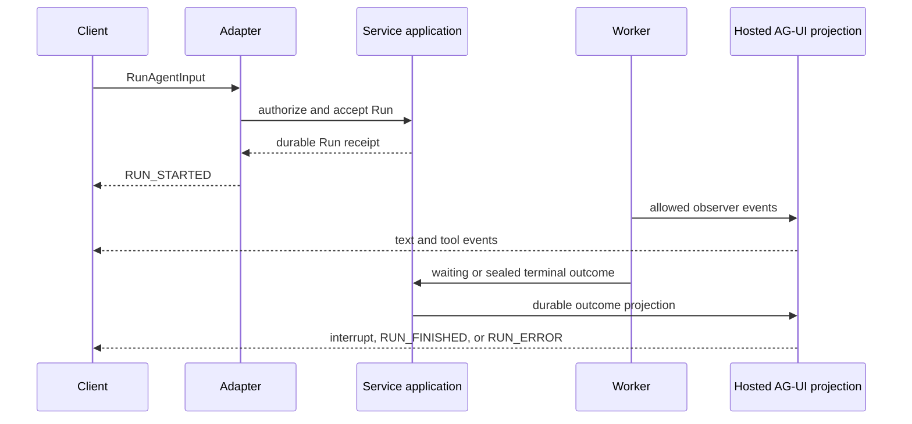

# Hosted AG-UI

## Design Position

a13n Service hosts an AG-UI HTTP/SSE adapter for every callable Agent. The adapter accepts standard `RunAgentInput`, maps it to the canonical [`AgentInput`](17-agent-input.md) and the existing Session/Thread/Run control contract, and delivers standard AG-UI `BaseEvent` values derived from the selected Harness release group and durable Service facts. It is not another Agent runtime or lifecycle authority.

New and continued AG-UI work authorizes the same `agent.invoke`, `run.continue`, and, when waiting defaults are selected, `run.feedback` actions as the equivalent Native operation. Cancellation authorizes `run.interrupt`, and SSE attachment authorizes `run.read`. The IAM [stable action registry](33-identity-and-access-management.md#stable-action-registry) owns these action names and grants; external IDs and adapter bindings never select or preserve authority.

Hosted AG-UI is always present on `control` and `all` roles. It has no deployment or Agent-level enable switch and does not require a a13n SDK. A standard AG-UI client can call it using the wire profile defined here.

## Boundaries

| Concern                                                                              | Owner                                                                                     |
| ------------------------------------------------------------------------------------ | ----------------------------------------------------------------------------------------- |
| Standard AG-UI input and event models                                                | Pinned upstream AG-UI dependency selected by the Service-compatible Harness release group |
| Harness-to-AG-UI observation                                                         | [`HarnessAguiObserver`](../a13n-stream-protocol/00-overview.md)                           |
| Canonical accepted input                                                             | [Agent Input](17-agent-input.md)                                                          |
| Durable Run acceptance and waiting feedback                                          | [Agent Control](18-agent-control-input-and-continuation.md)                               |
| Durable interruption                                                                 | [Active Execution](19-agent-control-active-execution.md)                                  |
| Hosted external bindings, input validation, lifecycle projection, retention, and SSE | This document                                                                             |
| Current Principal and Agent authorization                                            | [Service IAM](33-identity-and-access-management.md)                                       |
| Agent-specific schemas, visibility, and limits                                       | [Protocol configuration](28-agent-management.md#protocol-configuration)                   |

The adapter never reconstructs AG-UI events from Native notification envelopes and never implements a second Harness event converter.

## HTTP Surface

```http
POST /ag-ui/v1/agents/{agent_id}/runs
Content-Type: application/json
Accept: text/event-stream
Last-Event-ID: <hosted-agui-cursor>
```

The request body is one standard `RunAgentInput` under the pinned AG-UI schema. Its `agent_id` comes only from the route. No body field, `context`, or `forwardedProps` value can select another Service Agent, Workspace, Model, Secret, Connection, or Principal.

The response is SSE. Each AG-UI event is serialized as one standard JSON `BaseEvent` in a `data` field. Service can add an SSE `id` for retained delivery and reconnect; that ID is a Hosted AG-UI delivery cursor, not a standard AG-UI identity or Native Run Stream cursor. `Last-Event-ID` resumes exclusively after the last completely applied hosted event.

The adapter also exposes the AG-UI cancellation surface:

```http
POST /ag-ui/v1/agents/{agent_id}/cancel
Content-Type: application/json
```

The body names the external `threadId` and `runId`. Cancellation resolves their persisted binding, reauthorizes the current Agent and Run, and invokes the Native durable Run interrupt command. The Service Run outcome is `cancelled`; closing the run SSE does not call this command.

## External Binding

Hosted AG-UI persists a binding with this conceptual meaning:

```python
class AguiThreadBinding:
    client_identity: str
    agent_id: str
    external_thread_id: str
    session_id: SessionId
    root_thread_id: ThreadId
    active_thread_id: ThreadId


class AguiRunBinding:
    client_identity: str
    agent_id: str
    agent_revision_id: str
    external_thread_id: str
    external_run_id: str
    run_id: RunId
```

The schemas are conceptual durable records, not another public resource model. External IDs are opaque bounded correlation chosen by the client. They grant no read, continuation, cancellation, or stream authority.

The first accepted AG-UI run for a previously unbound `(client identity, Agent, threadId)` creates a Session, root Thread, and root Service Run through the ordinary application contract. A later AG-UI run continues the binding's current active Thread. `parentRunId` bound to the active completed Service Run is an ordinary continuation; one bound to an authorized earlier completed Service Run creates an explicit Service fork and atomically selects that fork as the binding's active Thread. A new ordinary user tail against the exact current waiting Run has the explicit abandonment meaning defined below. Cross-Agent, cross-client, incomplete, or concealed sources fail.

`runId` is the idempotency identity within one client, Agent, and external Thread. Repeating the same `runId` and canonical accepted input returns or reattaches to the original Run. Reuse with different input conflicts. A lost HTTP response never causes the client to invent another `runId` for the same intent.

## Input Authority

Hosted input is append-only relative to Service history:

- a new `user` message can become accepted input for a new Run;
- a new `tool` message must resolve one exact unconsumed waiting client-tool call;
- assistant, system, developer, reasoning, and prior tool history are never imported or overwritten by a client snapshot; and
- a full `messages` array is a compatibility snapshot whose known prefix must equal the current authorized presentation and whose only accepted difference is a valid new tail.

An initial call does not import an arbitrary prior transcript. Historical import is a separate Native operation with its own authority and validation.

The adapter maps the accepted new user tail into one canonical `AgentInput`. Text and binary parts retain their order, media type, acquisition, and delivery semantics; structured AG-UI data maps to `structured_content` and follows the selected AgentRevision's optional `ProtocolConfig.input_data_schema`. The common Agent input contract validates the resulting value before the control operation accepts a Run. AG-UI protocol fields that express state, context, client tools, or feedback remain command options or correlated feedback and never enter `AgentInput` implicitly.

Accepted `state` and `context` are retained together as optional `protocol_context` in the Service Run envelope, independently of ordinary `AgentInput`. Initialization validates them against the frozen Revision policy. Worker preparation projects them through Harness model-context middleware as explicitly untrusted client data in the root input preamble or tool-result request epilogue. Checkpoints and Retry retain the same context; correlated feedback retains it unless the accepted request supplies a replacement. A new Hosted invocation, continuation, or fork supplies its own context. It never becomes Harness execution state or an authorization source.

Standard `state`, `context`, and `tools` plus Service extensions are bounded untrusted inputs:

| Input                   | Accepted meaning                                                                                                     |
| ----------------------- | -------------------------------------------------------------------------------------------------------------------- |
| empty or absent `state` | Always valid                                                                                                         |
| non-empty `state`       | Product context validated by the selected Revision's public JSON schema; never `HarnessState` or a resource mutation |
| `context`               | Bounded semantic context validated by the selected Revision's policy; never authentication or resource selection     |
| `tools`                 | Client-executable tool declarations validated against the selected Revision's policy and frozen at acceptance        |
| `forwardedProps.a13n`   | Versioned Service extension object containing only fields declared below                                             |

`forwardedProps.a13n` can contain a structured `resume` array. Each element names one pending call and one approve, reject, complete, or respond value under the exact frozen kind. The array can cover any explicit subset and calls the same atomic waiting-feedback command as Native input; omitted approvals become rejections and omitted non-approval calls become no-response outcomes. It accepts a new child Run and never reopens the waiting parent. Duplicate, unknown, or mismatched entries and unknown Service extension fields fail validation.

When the binding's current/head Run is waiting, a new ordinary user tail without `resume` means “abandon the outstanding interaction and handle this message.” The adapter reads the exact waiting digest, invokes the Native existing-Thread route with `waiting_resolution.mode="defaults"`, and supplies the mapped `AgentInput`. That explicit application call creates one `waiting_continue` successor: its first model request receives both the default deferred results and the new user input. Existing queued submissions remain ordered and unconsumed. A user tail and explicit `resume` are mutually exclusive in one AG-UI request; the client sends another external `runId` after explicit feedback if it needs further semantic input.

The adapter sets `waiting_resolution` only for this declared abandonment case. It never adds the field to an ordinary completed-head continuation or silently converts an extension validation failure into defaults. The server-owned binding supplies current Thread version and sealed digest under the same final concurrency checks; a stale binding conflicts without accepting a Run or rebinding pending inbox delivery.

The normalized client tool surface and exact `agent_revision_id` are frozen with the accepted Run. A feedback run reuses the waiting Run's exact surface; it cannot change tool names, schemas, or pending-call identity.

## Lifecycle Projection

One external `runId` binds one Service Run. It never binds a RunAttempt or Harness Run.



`RUN_STARTED` comes from durable Run acceptance. `RUN_FINISHED` and `RUN_ERROR` come only from the selected sealed Run outcome. An observer's Harness terminal event is suppressed as an external lifecycle authority and is replaced by the matching durable projection. Worker takeover creates a new Harness Run and fresh observer without changing external `runId` or producing another `RUN_STARTED`.

A waiting Run emits the versioned custom `a13n.service.run_status` event with `status="waiting"` and a complete authorized pending contract, then closes the current delivery attachment. It does not emit a false success or error. A later new `runId` carrying valid `resume` accepts and observes the feedback Run; a later ordinary user tail explicitly defaults that pending set and observes the one composite waiting-Continue Run. Waiting-bound steer and async results are not projected into the composite first request and enter only when the Service-owned awaited delivery hook reaches its later safe boundary.

Transport abort, HTTP cancellation, EOF, timeout, and SSE disconnect terminate delivery only. The Run continues according to durable state.

### Recovery Projection

The adapter projects each source `run.recovery` as this safe Run-level event:

```json
{
  "type": "CUSTOM",
  "name": "a13n.service.run_recovery",
  "value": {
    "schema_version": "1",
    "event_id": "<source-recovery-event-id>",
    "runId": "<external-ag-ui-run-id>",
    "reason": "lease_expired"
  }
}
```

`event_id` is the stable source recovery identity. `reason` follows the finite registry in [Recovery Event](24-lifecycle-and-stream-persistence.md#recovery-event): `lease_expired`, `retry_after_failure`, `planned_handoff`, or `pending_input`. The value exposes no Worker, RunAttempt, internal Harness Run, fence, or lease credential.

Recovery passes through the ordinary ordered source-to-Hosted delivery path, before every subsequent replacement observation, in both live delivery and replay. It is a required execution-boundary projection, independent of optional reasoning or diagnostic visibility. A separate notification, timer, or late lifecycle lookup cannot synthesize this boundary. The event preserves the external Run identity and emits no additional `RUN_STARTED`, `RUN_FINISHED`, or `RUN_ERROR`; it reports publisher replacement rather than completed execution recovery or a tool failure.

Client handling is informative best practice, not a required UI contract. Applications can stop unfinished text or tool-argument accumulation and loading indicators for the affected Run, preserve completed results, and retain, mark, or remove partial content according to product policy. Applying the boundary idempotently by event identity and cursor avoids clearing replacement content on duplicate delivery. Recovery does not prove an external tool failed, rolled back, or is safe to retry. The same guidance applies to Native consumers of the source event.

## Event Visibility

The Hosted profile always permits these event families when their source exists:

- Run lifecycle produced by the Hosted adapter and the required recovery projection;
- text message lifecycle; and
- client-visible tool-call and tool-result lifecycle.

The selected Revision's ProtocolConfig can select supported state, message snapshot, activity, subagent, and safe reasoning-summary projections from the Gateway's registered allowlist. It cannot expose raw chain-of-thought, encrypted reasoning values, raw provider frames, internal tool payloads, or Service execution identities.

`RAW`, raw `a13n.harness.*` fallback, raw RunAttempt events, Worker and Redis identities, internal Harness Run identities, provider-native events, and unprocessed exceptions are never delivered. The stable Service custom registry contains:

| Name                        | Meaning                                                                                                                               |
| --------------------------- | ------------------------------------------------------------------------------------------------------------------------------------- |
| `a13n.service.run_status`   | Accepted, running, waiting, cancellation, or other safe durable Run status projection                                                 |
| `a13n.service.run_recovery` | Required ordered publisher-replacement observation within the same external Run                                                       |
| `a13n.service.artifact`     | Stable authorized result projection; an explicitly published Asset carries its bounded `AssetRef` without an object key or bearer URL |
| `a13n.service.replay_gap`   | Hosted delivery history is unavailable and client reconciliation is required                                                          |

Service-owned custom events use `a13n.service.*`, distinct from the direct Harness observer's `a13n.harness.*` events. The namespace identifies the owning component for both self-hosted and managed deployments.

Each custom `value` contains its own `schema_version`. ProtocolConfig can select optional projections from this finite registry but cannot suppress required recovery events or invent an event name or schema.

When `a13n.service.artifact` projects an [Asset](32-asset-management.md), the hosted binding retains the exact `asset_id` and reauthorizes the current caller before metadata or content delivery. The custom event does not create another Asset identity, pin Asset retention, or make an AG-UI cursor a content credential. A deleted Asset remains unavailable even when the hosted event is still replayable.

## Replay and Failure

Service retains a Hosted AG-UI projection with stable event identities and a bounded cursor independently from `HarnessAguiObserver.snapshot()`. Reconnect replays that projection and crosses to live delivery without skipping an event. `HarnessAguiObserver.resume()` can reconstruct one fresh observer from exact source history for one Harness Run; it is never the client replay mechanism and never spans Worker-created Harness Runs.

Retained delivery is one immutable snapshot per Hosted binding at `organizations/{organization_id}/gateway/hosted-agui/{binding_id}/replay/version-1.json`. It uses the [compressed JSON codec](03-storage.md#compressed-json-objects), with `schema-version=1`, `binding-id`, and `run-id` added to the shared encoding metadata. Reads validate the snapshot schema and binding and Run identity within configured event and decoded-byte limits.

This optional exact-delivery snapshot requires complete original source history and is independent of the continuously saved Native display snapshot. Normal display projection does not wait for Hosted snapshot publication, and merged Items cannot recreate original Hosted events or delivery cursors. Cursor-protected raw trimming can make this exact-delivery snapshot unavailable while Native Item history remains readable; Hosted clients use the explicit gap and authorized current-resource reconciliation below.

Publication is create-only. On conflict, the publisher validates the existing snapshot and accepts it only if its decoded value equals the intended delivery. Missing, invalid, or oversized snapshots cannot supply replay and follow the gap behavior below.

Live and retained source projection preserve recovery event identity and relative position under Hosted delivery cursors. Reconnect includes the boundary only when it follows the supplied cursor; a cursor past it never causes a fresh recovery event. A missing or trimmed boundary follows the same explicit gap rules as other missing source history, rather than being silently omitted from purportedly complete replay.

If the requested Hosted cursor is outside retained history, attachment fails before SSE with a bounded conflict when known. A gap discovered after streaming starts emits `a13n.service.replay_gap` and closes. The client reads current Service state or starts another supported reconciliation flow; it never continues from an arbitrary surviving event.

| Failure                                     | Observable outcome                        | Durable consequence                    |
| ------------------------------------------- | ----------------------------------------- | -------------------------------------- |
| Invalid snapshot or extension               | Bounded AG-UI request failure             | No Run accepted                        |
| Duplicate `runId`, same input               | Reattach or replay original Run           | No duplicate Run                       |
| Duplicate `runId`, different input          | Conflict                                  | Original Run unchanged                 |
| Observer conversion fails                   | Hosted delivery fails safely              | Durable Run authority remains separate |
| Client disconnects or overflows             | Attachment closes                         | Run continues                          |
| Cancellation command races terminal outcome | Owning Run transition selects one outcome | External Run projects the winner       |

## Compatibility and Invariants

Service selects one published Harness release group, which pins the Harness, Agent Stream Protocol, Environment Provider, and compatible AG-UI Python schema. Service manifests and compatibility tests select exact package versions; this specification defines behavior and does not hard-code a release artifact version. Breaking changes to Service extensions require a new extension schema or Hosted route compatibility line.

Service custom event names use only the `a13n.service.*` registry in publication, ProtocolConfig selection, and retained delivery boundaries. Retained snapshots identify the Service Run with `run_id` and the external AG-UI Run with `external_run_id`. Superseded event names and snapshot field names have no compatibility aliases or migration path.

1. Hosted AG-UI uses `HarnessAguiObserver` as its only Harness event converter.
2. One external AG-UI Run binds one Service Run; Worker recovery does not change either identity.
3. Client messages append accepted input and never overwrite Service history.
4. Durable acceptance and sealed outcome, not transport or Harness observation, produce external Run lifecycle.
5. A waiting Run is resumed by accepting another Run under another `runId`; explicit `resume` uses waiting feedback, while a new ordinary user tail uses declared default abandonment and waiting Continue.
6. Hosted disconnect never cancels a Run.
7. Every delivered event belongs to the stable Hosted visibility registry and contains no private execution payload.
8. Every retained source recovery event projects once at its ordered Hosted position before replacement observations; reconnect preserves its identity without synthesizing another boundary.
