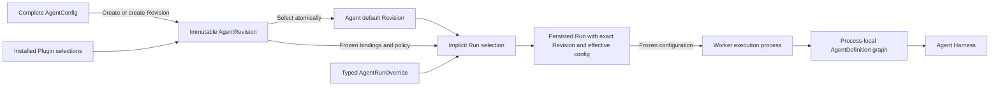

# Agent Management

## Design Position

Service exposes `Agent` as the stable Workspace-owned identity for authoring, authorization, lifecycle, and invocation. Each `AgentRevision` is one immutable authoring configuration with frozen stable-resource bindings. A Run resolves that policy into one exact immutable `EffectiveAgentConfig`. The Agent head contains metadata, lifecycle state, and `default_revision_id`; it contains no mutable draft configuration.

Creating an ordinary Agent atomically creates Revision v1. The hidden configuration assistant has the narrowly scoped identity-only exception below. Creating a genuinely different Revision appends immutable content and selects it as the default. All Agent head mutations use strong ETags for concurrency. Service exposes no `AgentPreset` compatibility resource. Selecting an older default changes the Agent pointer and ETag without creating a Revision.

An ordinary Run selects one exact `AgentRevision` at durable acceptance; protected configuration-assistant execution instead freezes its deployed definition directly. Its current `RunAttemptExecutor` reconstructs process-local Harness `AgentDefinition`, `SubagentDefinition`, `ExecutableAgent`, and Plugin objects from the Run's complete frozen `EffectiveAgentConfig` graph. Those Python values are never management resources or durable payloads.

[Installed Harness Plugins](36-installed-harness-plugins.md) owns installed factory selection, configuration compatibility, and rolling code updates. Agent Management freezes authored plugin configuration; Worker preparation freezes normalized configuration under that contract without pinning executable code.



## Boundaries

| Concern                                                                           | Owner                                                                                                                                                                                                                                                               | Relationship                                                                |
| --------------------------------------------------------------------------------- | ------------------------------------------------------------------------------------------------------------------------------------------------------------------------------------------------------------------------------------------------------------------- | --------------------------------------------------------------------------- |
| Agent identity, Revisions, default selection, lifecycle, Duplicate, and overrides | This document                                                                                                                                                                                                                                                       | Defines the durable Agent management model                                  |
| Installed plugin selection, configuration compatibility, and deployment           | [Installed Harness Plugins](36-installed-harness-plugins.md)                                                                                                                                                                                                        | Owns typed selections and Worker-prepared configuration                     |
| Plugin factories, configured instances, middleware, and Capability contribution   | [Harness Plugin System](../a13n-harness/05-plugin-system.md)                                                                                                                                                                                                        | Builds concrete process-local plugins from an explicitly selected catalog   |
| Agent execution, state, and process-local subagent graph                          | Agent Harness                                                                                                                                                                                                                                                       | Receives reconstructed definitions and fresh run bindings                   |
| Run identity, acceptance, persistence, lineage, and recovery                      | [Agent Interaction and Execution Model](10-agent-interaction-and-execution-model.md), [Agent Control](18-agent-control-input-and-continuation.md), [Durable Run State](12-run-persistence.md), and [RunAttempt Recovery](13-run-attempt-scheduling-and-recovery.md) | Persist and reuse the exact selected Revision and effective config          |
| Agent input wire, canonicalization, and adapter mapping                           | [Agent Input](17-agent-input.md)                                                                                                                                                                                                                                    | AgentConfig stores adapter configuration and each Revision freezes it       |
| Managed capability and Connection schemas                                         | Their owning Skill and [Connectivity](40-connectivity/README.md) contracts                                                                                                                                                                                          | Agent configuration and Run overlays reference them without redefining them |
| Product authorization and executable-code administration                          | [Service IAM](33-identity-and-access-management.md)                                                                                                                                                                                                                 | Separates Agent authoring from deployment code authority                    |
| Secret values and run-time eligibility                                            | [Secret Management](27-secret-management.md)                                                                                                                                                                                                                        | Revisions store requirements and references, never plaintext values         |
| Public HTTP paths and common mutation behavior                                    | [Management API](16-management-api.md) and [Platform API Conventions](../api-conventions.md)                                                                                                                                                                        | Expose the resources and commands defined here                              |

## Agent Resource Model

The following schemas are conceptual. They define durable field meaning rather than concrete ORM classes.

```python
class Agent:
    id: AgentId
    organization_id: OrganizationId
    workspace_id: WorkspaceId
    source: Literal["builtin", "custom"]
    system_purpose: Literal["configuration_assistant"] | None
    name: str
    key: str
    description: str | None
    image_url: str | None
    default_revision_id: AgentRevisionId | None
    enabled: bool
    archived_at: datetime | None
    duplicated_from_agent_id: AgentId | None
    duplicated_from_revision_id: AgentRevisionId | None
    created_by: ActorRef
    updated_by: ActorRef
    created_at: datetime
    updated_at: datetime
```

Every ordinary Agent has a `default_revision_id` and a strong representation ETag. The ETag advances on each head mutation, including an ABA default switch. Revision numbers start at `1` and increment from the highest authored number, even after the default moves to an older Revision. Only the protected configuration assistant has a null default Revision and no Revision history. Public Agent management never exposes this identity-only resource.

`name`, `key`, and `description` are mutable head metadata. Name changes preserve the key; explicit key changes follow the shared resource-key contract and preserve the Agent ID. `AgentConfig.default_environment_template_id` stores the stable template ID as versioned configuration. New Thread and root Run allocation use the selected AgentRevision's choice and resolve the template's default Revision at allocation. Explicit historical AgentRevision selection uses that historical choice. Existing Thread defaults and accepted Runs retain their selections. `enabled` and `archived_at` are independent lifecycle axes. Their mutations change `updated_at` and the representation ETag without rewriting a Revision.

### System-Maintained Configuration Assistant

`system_purpose` is protected durable metadata, absent on ordinary Agents and not writable through public create, import, update, label, or duplication inputs. `configuration_assistant` identifies a system-maintained `source=builtin` Agent; `(workspace_id, system_purpose)` is unique for non-null purposes. The field does not turn every built-in Agent into a hidden resource. [Agent Configuration Assistant](43-agent-configuration-assistant.md) owns identity provisioning, deployed definition selection, configuration conversations and drafts.

This Agent is unavailable through ordinary Agent product surfaces, including for Organization or Workspace administrators:

- Lists, search, counts, selectors and discovery exclude it before ordering and pagination. Built-in, archived and label filters cannot expose it.
- ID/key resolution, detail, Revision history/direct reads, configuration export, labels and avatar reads return the ordinary not-found result. A known ID is not a visibility exception.
- Public metadata/configuration/Revision changes, Set default, lifecycle operations, deletion and Duplicate are rejected. It cannot be a configuration draft target or source.
- Ordinary Run start, public protocol invocation, Account/Gateway/Schedule/Automation binding, subagent references and user-managed RoleBinding targets cannot select it.

These predicates apply at shared query, mutation and reference boundaries, not just in Console. Source YAML and code are maintained only through the restricted internal distribution operation. Client-supplied flags cannot enable an internal bypass or copy the assistant's privileged host capabilities into another Agent.

The configuration entry selects a real same-Workspace Agent under [configuration-purpose authority](33-identity-and-access-management.md#configuration-assistant-authority). New ordinary inputs freeze the deployed file definition directly into the complete Run effective configuration. Assistant Runs keep a non-null Agent foreign key and a null `agent_revision_id`; they create no assistant AgentRevision or database definition head. Recovery and source-preserving successors retain accepted snapshots rather than rereading the file. The assistant's Agent identity is separate from the business Agent being edited. Its hidden management resource does not hide the owner's authorized configuration Sessions, Threads, Runs, results, usage or Trace; those views do not link to an editable assistant definition.

### Avatar

An Agent may have one current avatar. `image_url` is a nullable authenticated content URL; the internal image ID and object key are not writable metadata fields. `PUT` and `DELETE /api/v1/workspaces/{workspace}/agents/{agent}/avatar` replace or remove it under `agent.update`, exact `If-Match`, and the same custom, non-archived restrictions as other metadata changes. They update audit attribution, `updated_at`, and the ETag without creating a Revision.

Uploads use the shared [profile image processing rules](33-identity-and-access-management.md#profile-images). `GET /api/v1/workspaces/{workspace}/agents/{agent}/avatar/{image_id}` requires current `agent.read` authority and serves only the currently referenced image with private, non-storing cache policy. Agent collections and detail reads expose the same URL. Duplication starts without an avatar; image ownership remains local to one Agent.

Image content lives at `organizations/{organization_id}/workspaces/{workspace_id}/agents/{agent_id}/avatar/{image_id}/content.webp`. Upload processing and object I/O happen outside relational transactions. Publication rechecks authorization, mutable state, and ETag before referencing the object under the shared object-publication fence. The current image remains retained, including for archived Agents; replaced, removed, and failed-publication images follow canonical orphan collection.

## AgentConfig

`AgentConfig` is finite Service-owned serializable data. A caller supplies one complete config when creating an Agent or Agent Revision; The Agent record stores no independently editable draft; configuration Sessions own their separate candidate drafts. Referenced resource schemas remain owned by their management documents.

```python
class AgentModelCharacteristics:
    context_window_tokens: int | None = None
    proactive_context_management_threshold: float | None = 0.65
    compact_threshold: float = 0.90


class AgentModel:
    model_key: str
    settings: JsonObject
    characteristics: AgentModelCharacteristics


class ResolvedAgentModel:
    model_id: ModelId
    model_key: str
    settings: JsonObject
    characteristics: AgentModelCharacteristics


class EffectiveAgentModel:
    execution: ModelExecutionSnapshot
    settings: JsonObject
    characteristics: HarnessModelCharacteristics


class ConnectionToolSelection:
    connection_id: ConnectionId
    tools: tuple[str, ...] | None = None
    defer_loading: bool = False


class ChildEnvironmentPolicy:
    mode: Literal["none", "shared", "dedicated"]
    template_revision_id: EnvironmentTemplateRevisionId | None = None


class SubagentSelection:
    agent_id: AgentId
    version: int | None
    description: str | None
    context: DelegationContextPolicy
    usage_limits: UsageLimits | None
    environment: ChildEnvironmentPolicy


class OutputVariant:
    name: str
    description: str | None
    schema: JsonSchema
    resources: dict[str, JsonSchema]


class OutputSpec:
    name: str | None
    description: str | None
    schema: JsonSchema | None
    resources: dict[str, JsonSchema]
    variants: tuple[OutputVariant, ...] | None


class RetryConfig:
    tools: int
    output: int


class InputAdapterConfig:
    adapter_key: str
    config: JsonObject


class ToolSelection:
    enabled: bool = True
    permission: Literal["inherit", "allow", "ask", "deny", "review"] = "inherit"
    config: JsonObject = {}


class ToolsetSelection:
    enabled: bool = True
    config: JsonObject = {}
    tools: dict[str, ToolSelection] = {}


class ProtocolConfig:
    schema_version: Literal["1"]
    public_name: str
    public_description: str | None
    output_modes: tuple[str, ...]
    input_data_schema: JsonObject | None
    state_schema: JsonObject | None
    context_schema: JsonObject | None
    client_tools: tuple[ClientToolPolicy, ...]
    event_visibility: tuple[str, ...]
    a2a_skills: tuple[A2ASkillProjection, ...]
    extended_agent_card: ExtendedAgentCardPolicy | None
    limits: ProtocolLimits


class AgentConfig:
    default_environment_template_id: EnvironmentTemplateId | None
    toolsets: dict[Literal["files", "shell", "web", "assets"], ToolsetSelection]
    subagent_mode: Literal["inline", "async"] = "inline"
    model: AgentModel
    memory: MemorySelection | None
    reviewer: AgentReviewer | None
    media_understanding: MediaUnderstandingSelection
    instructions: str
    input_adapter: InputAdapterConfig
    plugins: tuple[PluginSelection, ...]
    skills: tuple[SkillSelection, ...]
    connection_tools: tuple[ConnectionToolSelection, ...]
    subagents: dict[str, SubagentSelection]
    client_tools: tuple[ClientToolDefinition, ...]
    output_spec: OutputSpec | None
    retries: RetryConfig | None
    secret_requirements: tuple[SecretRequirement, ...]
    protocol: ProtocolConfig
```

The [`PluginSelection` contract](36-installed-harness-plugins.md#configuration-and-recovery) selects an installed factory key, instance name, and bounded configuration. `instructions` is the Agent's stable system prompt; Service- and Harness-generated runtime context is not stored in this field. A [`SkillSelection`](31-skill-management.md#agent-selection-and-run-locking) names one stable Skill key and optionally pins an integer version. The model selects one stable Model key. The AgentConfig default Environment template ID is a versioned allocation choice; request-specific Environment selection remains Thread/Run context under [Environment Management](29-environment-management.md#thread-defaults-and-run-selection). `ChildEnvironmentPolicy.template_revision_id` is required exactly for `dedicated`; `shared` is the default and uses the spawning Run's Environment and `none` supplies no environment. The selected Model owns its one calling API and default request settings. Agent Revision creation resolves and retains stable Model and Skill identities but does not freeze mutable Model configuration or an unpinned Skill's default Revision; every Run resolves those selections under their owning contracts. Subagent map keys are stable local names within the Agent.

Each built-in Tool owns its exact permission in `toolsets`; there is no second top-level permission map. Authored permissions default to persisted `inherit`, which resolves at execution through the Harness Tool identity's code-owned default. Service built-ins use the Harness default of `allow`. Files and shell Toolsets are enabled by default; Web and asset publication are disabled by default. Disabling a Toolset removes all owned tools while retaining child settings. `reviewer` is optional `AgentReviewer`, using the shared `ToolReviewConfig` fields but constraining `model` to a managed immutable Model ID, not a provider route or executable import. Its `risk_threshold` (default `extra_high`), `on_flagged` (default `deny`), and single-best-selector `rules` configure shared risk policy; optional `instruction`, `shell_instruction`, `model_settings`, `timeout_seconds`, and `on_error` configure the default reviewer. A reviewer alone does not enable review. An effective `review` consults a matching reviewer when one is configured; without a match, the review layer adds no restriction. These fields are frozen and reconstructed together with a configured reviewer Model snapshot. The Harness owns [permission and review semantics](../a13n-harness/07-tool-execution.md#tool-permissions-and-review); these settings do not widen Service IAM or Environment ceilings.

`media_understanding` is a `MediaUnderstandingSelection`, mapping `image`, `video`, and `audio` to a managed Model `key` or null. It selects the auxiliary Model the file `view` tool uses when the active Model does not declare the matching `{kind}_understanding` capability; Harness keeps native-first dispatch. A null or absent kind inherits the [Workspace default](30-model-management.md#agent-and-run-selections) and an empty selection changes nothing; there is no explicit-disable value. Revision creation validates each supplied Model the same way it validates the reviewer Model. Empty selections are omitted from serialization.

Revision creation validates reviewer Model eligibility and settings without resolving credentials. The authored Model ID already freezes the stable reference; no separate reviewer Revision field is needed. Run acceptance resolves and freezes `resolved_reviewer_model` with the complete Model execution snapshot and merged Model-default/reviewer settings for every selected graph node. The worker reconstructs the reviewer from that accepted snapshot using the same managed Run Model resolver and current authentication path as the main Model. A missing required reviewer snapshot rejects reconstruction rather than falling back to ambient model inference. Main and reviewer may share a Model ID while retaining independent request settings. Optional absent fields remain absent from serialized legacy configurations and their digests.

The `web` Toolset independently configures Provider-backed search and scrape and built-in fetch and download under [Web Provider Management](41-web-provider-management.md#agent-web-selection). Search and scrape may select the same compatible Provider explicitly or different Providers; fetch and download contain no Provider reference. The selection is Agent Revision content and is retained in each accepted graph node while Provider credentials and availability remain live.

`memory` opts each Agent graph node into [long-term memory](42-memory.md#agent-selection). Absence or null disables memory. Configuration contains named entries, each with an explicit records/documents mode, backend selection, purpose, and mode-specific settings; multiple entries and repeated modes are supported. These are immutable Revision content, never credentials. Backend references, inline configuration, prefixed tools, and storage inspection follow the owning memory contract. Explicit Providers require `memory_provider.read` and Workspace visibility; explicit Environments require ordinary use authority. Admission retains every entry's selection and exact authorized binding. Invoking a configured Agent does not require Provider administration. Run override absence inherits, null disables, and an object replaces the complete selection without entry merging; child nodes retain their own selections except where a retained application binding fixes conversation authority.

`connection_tools` is an ordered list keyed semantically by managed connection IDs, with no caller-defined aliases. Duplicate connection IDs within the list are invalid. Omitted or null `tools` selects all currently available authorized source tools; an empty list selects none; explicit names select only those source-native tools. Duplicate tool names are invalid. `defer_loading` defaults to false and uses the [Harness loading contract](40-connectivity/04-agent-facing-tools.md#deferred-loading). These fields control one Agent or Run selection rather than the connection resource itself.

`AgentModel.settings` defaults to an empty object and stores only Agent-authored overrides. Its JSON representation is validated against the selected Model's serializable native settings contract, including provider-specific fields, under [Model Management](30-model-management.md#parameter-schemas-and-validation). The same owner defines parameter schemas, reserved fields, and [settings precedence](30-model-management.md#settings-precedence). `ResolvedAgentModel` retains these overrides, while `EffectiveAgentModel.settings` contains the final merged values used for execution.

`AgentModel.characteristics` retains the Agent's nullable context-window override and context-management thresholds. It contains no media capabilities. Run acceptance composes it with the selected Model's declarations through the one Model Management composition path; a null window inherits the Model declaration. `EffectiveAgentModel.characteristics` is the resulting complete Harness value. Reviewer Models use their declarations with default context policy.

`OutputSpec` permits either one top-level schema with optional local resources or at least two mutually exclusive variants; it never permits nested variants. Reconstruction resolves the supplied resources and uses the Harness shared structured-output validator for each schema or variant. Completed model and plugin outputs must satisfy Draft 2020-12 instance constraints; invalid model output consumes the structured-output correction budget. `RetryConfig` contains bounded non-negative tool-argument and structured-output correction budgets, not provider transport, Worker recovery, whole-Run, or business-workflow retries.

The config contains no Python class, import target, callable, native Model, Toolset, Capability instance, Plugin object, client, credential value, plaintext Secret, Environment adapter, attachment session, entered facade, arbitrary artifact URL, or other process-local value. Revision creation validates authored structure and resolves managed references. Installed-plugin business configuration is validated by the executing Worker.

`input_adapter` selects one trusted adapter key and bounded configuration. Every Revision accepts the common [`AgentInput`](17-agent-input.md) wire contract. Run acceptance validates and canonicalizes that input, and the Worker verifies the frozen configuration and state before invoking the adapter. Replacement execution attempts reuse the same Revision, adapter configuration, accepted input,.

When `toolsets.assets.tools.publish` is active, the trusted Service `AssetCapability` exposes `publish_asset`. Each execution attempt binds only its current authorized Environment; the tool fails closed when no readable default binding can supply the selected path. Package presence or general Environment file access does not enable it.

### Agent Configuration Files

Console imports and exports one Service Agent configuration as a YAML 1.2 document. The serialized envelope has exactly `schema_version: 1`, `name`, optional nullable `description`, and `config`. `config` is the complete authored `AgentConfig`, including advanced fields, dependency references, and pinned versions. The envelope version describes this file format, not an Agent Revision version. Unknown envelope fields, unsupported versions, malformed configuration, duplicate mapping keys, multiple documents, aliases, non-finite numbers, and unsupported tags are rejected. Imports are bounded to 1 MiB of UTF-8 text, 50,000 YAML nodes, and 100 traversal levels.

Export reads current saved Agent metadata and its selected saved Revision configuration. It excludes Agent identity, key, labels, avatar, lifecycle state, history, resolved execution snapshots, and dependent resource contents. Export does not read or embed managed credentials or plaintext Secret values; `secret_requirements` remains a list of references. Authored instructions and business configuration are preserved verbatim. This file is not a Harness UI resource and does not embed a dependency bundle.

Import creates a new custom Agent in the target Workspace through the existing Create Agent command after explicit preview and submission. It does not overwrite an existing Agent or create dependencies. The server retains authority for permissions, configuration validation, reference resolution, and idempotency. A failed or uncertain request preserves the import draft; retrying an unchanged creation request uses the same idempotency key.

Console checks discoverable Model, reviewer Model, Skill, Connection, child Agent, root Environment Template identity, child Environment Template Revision, and Web Provider references for search and scrape against the target Workspace. The root template uses its default revision at allocation; child revision references remain pinned. Missing or unavailable selections block submission and offer explicit replacement. Skill and child Agent version pins are checked and retained when remapping; unavailable pins require editing the file or choosing an available resource. Other configuration is retained, including settings and tool scopes. Matching keys or version numbers in another Workspace establishes availability, not identical behavior. Installed-plugin availability, Secret access, provider settings compatibility, graph validation, and execution readiness remain subject to their existing Service validation and runtime boundaries.

## Run Capability Overlay

Agent authoring defines the default model-visible managed capability surface. After applying `AgentRunOverride`, a direct invocation or trusted input owner such as an authorized host integration can supply one bounded overlay without mutating the AgentRevision:

```python
class RunCapabilityOverlay:
    inherit_agent: bool = True
    include: tuple[ManagedCapabilitySelection, ...] = ()
    exclude: tuple[CapabilityKey, ...] = ()
```

`ManagedCapabilitySelection` is a tagged union owned by the corresponding managed Skill, Connection, or Connection tool contract. Connection entries reuse the tool-selection types above, including `tools` and `defer_loading`. `CapabilityKey` is derived from capability kind and managed source identity, not a caller-defined connection alias. Every selection retains its managed-resource references and compatibility evidence required by its owning contract; external tool schemas are discovered at execution. The overlay contains no Python object, import target, arbitrary local function tool, Plugin, credential, endpoint, or remote schema. Host-injected runtime capabilities are composed separately under their owning execution-context contract; this overlay cannot create or replace them.

```text
candidate = (overridden Agent selections when inherit_agent else empty) + include - exclude
effective = candidate intersect current authorization and deployment policy
```

`include` can select an authorized managed capability absent from the Agent defaults. `exclude` removes one exact selectable key and cannot remove mandatory Harness safety, Identity, policy, usage, output, or Environment behavior. `inherit_agent=false` replaces only the selectable managed capability surface; it does not replace the Agent, model, Web selection, instructions, output contract, Plugins, subagents, or security ceiling. Duplicate keys, conflicting selections, unknown exclusions, unavailable compatibility evidence, and unauthorized additions fail Run acceptance.

The accepted Run retains the complete effective selections and the revision locks required by each capability owner. Connection selections retain source identity, tool scope, and deferred-loading policy; [external tool discovery](40-connectivity/04-agent-facing-tools.md#discovery-and-recovery) supplies current schemas without a durable tool snapshot. Replacement RunAttempts preserve those selections and locks while revalidating authority and discovering current external tools. Model input and tool output cannot create or modify an overlay.

## Protocol Configuration

Every `AgentConfig` embeds one finite `protocol` configuration. For ordinary Agents it is Agent-owned Revision content rather than an independently addressable resource and has no separate lifecycle, API, enable switch, or content digest.

Revision creation validates JSON Schemas, public metadata, MIME modes, event names, client-tool policies, A2A projections, and per-protocol limits against finite registries and deployment hard ceilings. Configuration can narrow a permitted surface but cannot expose raw reasoning, credentials, private execution identities, unregistered events, arbitrary code, or unavailable capabilities.

`input_data_schema`, when present, is the self-contained JSON Schema Draft 2020-12 contract projected for non-null `AgentInput.structured_content`. Safe defaults impose no structured-content schema, expose bounded text output and standard public event families, accept no protocol client tools, generate a minimal public-safe A2A Agent Card, and expose no extended Card. Native and Hosted AG-UI remain available for every callable Agent; `gateway.a2a_enabled` is the deployment-wide A2A availability switch.

Revision creation freezes normalized ProtocolConfig in the immutable Revision, whose `content_digest` covers it. Hosted AG-UI Run and A2A Task acceptance persist the exact `agent_revision_id`; retry, feedback, recovery, and replay therefore use the same protocol configuration. Advancing the Agent to another Revision changes Cards and implicit acceptance policy only for later work.

## AgentRunOverride and Effective Configuration

One Run request may carry a finite typed `config_override`. It is request data, not a management resource, and has no identity or lifecycle:

```python
class ModelOverride:
    model_key: str | None
    settings: JsonObject | None
    characteristics: AgentModelCharacteristics | None


class SubagentOverride:
    agent_id: AgentId | None
    version: int | None
    description: str | None
    context: DelegationContextPolicy | None
    usage_limits: UsageLimits | None
    environment: ChildEnvironmentPolicy | None


class RetryOverride:
    tools: int | None
    output: int | None


class AgentRunOverride:
    toolsets: dict[Literal["files", "shell", "web", "assets"], ToolsetSelection] | None
    model: ModelOverride | None
    memory: MemorySelection | None
    reviewer: AgentReviewer | None  # May be absent.
    media_understanding: MediaUnderstandingSelection | None  # May be absent.
    instructions: str | None
    plugins: tuple[PluginSelection, ...] | None
    skills: tuple[SkillSelection, ...] | None
    connection_tools: tuple[ConnectionToolSelection, ...]  # May be absent.
    subagents: dict[str, SubagentOverride | None] | None
    client_tools: tuple[ClientToolDefinition, ...] | None
    output_spec: OutputSpec | None
    retries: RetryOverride | None
```

The wire schema preserves absent fields separately from explicit nulls. Top-level absence inherits the selected Revision. Scalar and string fields replace; list fields replace as a whole and an empty list clears them. `output_spec` can be explicitly cleared. Primary Environment selection is a separate invocation field and cannot appear in `config_override`. `retries` patches only explicitly present children.

Within `model`, an absent `model_key` inherits the Agent selection; a supplied key selects another managed Model and cannot be null. There is no API override independent of that Model. `settings` follows the Model Management precedence contract, including explicit clearing of Agent overrides and validation against the final selected Model.

`connection_tools` replaces the complete selection when present. Absence inherits, `[]` clears, and null for the whole category is invalid. Entries use the same complete selection types as Agent configuration; there is no per-alias patch or mapped deletion. Overrides can select existing authorized connections, tool scopes, and deferred loading, but cannot supply endpoints, credentials, external integration services, arbitrary headers, or native Ingress targets.

Each supplied `toolsets` entry replaces that complete Toolset selection; omitted entries inherit. An explicit `enabled=false` disables the Toolset and preserves its submitted child settings. Null Toolset entries are invalid. Active Provider/resource references are revalidated with override authority. `reviewer` uses whole-value replacement: absence inherits and null clears it; an active Tool resolving to review without a reviewer adds no reviewer restriction. `media_understanding` patches per kind: a supplied non-null kind replaces the Agent selection, while an absent field, a null whole field, and a null or absent kind all inherit the Agent selection and then the Workspace default.

`subagents` remains a name-keyed patch: an absent map inherits, explicit null clears all entries, an empty object changes nothing, and a mapped null deletes one entry. Its entries select managed Agents only.

Plugin override replacement and resolution follow the [installed Plugin selection contract](36-installed-harness-plugins.md#configuration-and-recovery). Every selected resource remains subject to current authorization, schema validation, deployment compatibility, and platform security ceilings. Run overrides select managed resources and accept no direct credential values. The owning resource domain resolves current credentials at its execution boundary.

The resolved non-secret result has this conceptual shape:

```python
class EffectiveAgentConfig:
    subagent_mode: Literal["inline", "async"]
    child_configs: dict[AgentRevisionId, ChildAgentExecution]
    schema_version: str
    model: EffectiveAgentModel
    resolved_reviewer_model: EffectiveAgentModel | None
    media_understanding: dict[Literal["image", "video", "audio"], EffectiveAgentModel]
    toolsets: dict[Literal["files", "shell", "web", "assets"], ToolsetSelection]
    memory: MemorySelection | None
    reviewer: AgentReviewer | None
    instructions: str
    input_adapter: InputAdapterConfig
    plugins: tuple[PluginSelection, ...]
    skills: tuple[SkillRevisionLock, ...]
    connection_tools: tuple[ConnectionToolSelection, ...]
    subagents: tuple[ResolvedSubagentEdge, ...]
    client_tools: tuple[ClientToolDefinition, ...]
    output_spec: OutputSpec | None
    retries: RetryConfig | None
    secret_requirements: tuple[SecretRequirement, ...]
    protocol: ProtocolConfig
    content_digest: str
```

`subagent_mode` selects one standard Harness Tool surface for the accepted Run. The default `inline` executes the entire descendant graph in the parent Attempt and borrows its Environment facade. `async` delegates each direct child as an independent durable Run; when that child is claimed, its own accepted `subagent_mode` governs its descendants. A single Harness invocation does not mix the inline and asynchronous Tool surfaces. This field is selected by the Agent Revision, not a Run override.

Each `child_configs` entry contains the child `agent_id`, `revision_content_digest`, complete recursive `effective_config`, and frozen `connection_selections`. Its key is the exact child Revision ID from a resolved edge. The parent acceptance checks and selects the complete finite graph once before preparing input. It retains those detached selections through the final transaction without rereading mutable configuration or locking configuration rows. Different graph nodes may be observed in separate short sessions; selection does not promise one database timestamp for the graph. Each node freezes its own Model execution, merged settings, composed Model characteristics, Skill locks, authored Plugin configuration, and connection selections. The root digest covers these descendant snapshots. A child never substitutes the parent's Model or declared capabilities. Asynchronous child admission copies the accepted child snapshot and rejects a changed config or connection scope; a retained child continuation preserves its own source snapshot.

Acceptance merges and resolves the selected Revision and request exactly once, then persists a complete immutable `EffectiveAgentConfig` plus its digest. Its Skill entries are the exact five-field [`SkillRevisionLock`](31-skill-management.md#agent-selection-and-run-locking) values selected at that acceptance boundary. Retry, waiting Continue, deferred-action completion, and other successor operations preserve the source snapshot when their owning contract requires it; Worker replacement of the same accepted Run always reuses it. No execution attempt re-reads an Agent or Skill head or reapplies merge rules. Input, Environment selection, attachments, timeout, usage budget, metadata, priority, idempotency, and scheduling mode remain Run fields rather than Agent config overrides.

`media_understanding` contains the node's resolved selection: per kind, the Run override, then the Agent Revision, then the [Workspace default](30-model-management.md#agent-and-run-selections), captured as effective execution data rather than authored configuration. Acceptance resolves each distinct Model key once, so every node selecting the same Model captures one identical snapshot. An explicit selection that cannot be prepared rejects acceptance; an unusable Workspace default is skipped with a logged warning instead. Empty selections are omitted from serialization. Retained execution does not reread any level.

## Immutable AgentRevision

```python
class ResolvedSubagentEdge:
    name: str
    child_agent_id: AgentId
    child_agent_revision_id: AgentRevisionId
    description: str | None
    context: DelegationContextPolicy
    usage_limits: UsageLimits | None
    environment: ChildEnvironmentPolicy


class AgentRevision:
    id: AgentRevisionId
    organization_id: OrganizationId
    workspace_id: WorkspaceId
    agent_id: AgentId
    version: int
    config: AgentConfig
    config_digest: str
    resolved_model: ResolvedAgentModel
    resolved_skills: tuple[ResolvedSkillBinding, ...]
    connection_tools: tuple[ConnectionToolSelection, ...]
    resolved_subagents: tuple[ResolvedSubagentEdge, ...]
    content_digest: str
    source_revision_id: AgentRevisionId | None
    change_summary: str | None
    created_by: ActorRef
    created_at: datetime
```

Revision rows are append-only. `config_digest` identifies the canonical complete authoring config; `content_digest` also covers every resolved snapshot, stable managed-resource binding and selection policy, and subagent Revision. For an unpinned Skill, it covers `skill_id`, `skill_key`, and the absence of a version, not whichever current SkillRevision a later Run resolves. A Revision has no mutable lifecycle state and cannot be patched, archived independently, deleted, overwritten, or repointed after creation.

Plugin selection is retained only in `config.plugins`; Worker-owned normalization follows the [plugin contract](36-installed-harness-plugins.md#configuration-and-recovery). The resolved Model field retains only stable Model identity, Agent-authored setting overrides, and characteristics; Run acceptance resolves the latest Model execution selection and effective settings under Model Management. Resolved Skill bindings freeze stable `skill_id` identity and pinned-or-default policy; only a pinned binding identifies versioned content before Run acceptance. The other resolved fields freeze Connection selections, and the complete child Revision graph with exact dedicated Environment template revisions. Secret values, current authorization, current Model and Provider configuration/lifecycle, an unpinned Skill's default Revision, live ConnectorProvider availability, and remote MCP catalogs remain fresh facts rather than immutable Agent Revision content.

## Creation, Revision, and Default Selection

Create Agent accepts `name`, optional `description`, and one complete `config`. Service authorizes and resolves every referenced dependency, then atomically creates the Agent and Revision v1. It never exposes an Agent without a default Revision. ConfigurationDraft saving is a separate authoring boundary owned by [Agent Configuration Assistant](43-agent-configuration-assistant.md#draft-editing-and-validation); only its authenticated apply operation enters this Agent publication boundary.

Create Revision accepts a strong Agent `If-Match`, one complete replacement `config`, and an optional immutable `change_summary`. The summary describes this authoring step and is excluded from configuration and content digests:

1. authorize the operation and every referenced resource;
2. verify the strong Agent ETag;
3. resolve exact Model identity, stable Skill bindings, Connection, and subagent dependencies, including dedicated child Environment template revisions;
4. verify structural schemas and the finite acyclic subagent graph;
5. canonicalize the frozen content and compute its digests;
6. return the current Agent and Revision unchanged for a semantic no-op; or
7. create immutable Revision number `highest authored + 1`, select it as default, and advance the Agent ETag in the same transaction.

Resolution occurs outside the final commit transaction. The final short transaction rechecks the Agent, selected managed references, authorization, and concurrency evidence before committing. Failure creates no Revision and does not advance the head.

Set default accepts a strong Agent `If-Match`. It revalidates the selected historical Revision and retained dependencies, including Environment template eligibility, then atomically repoints `default_revision_id` without creating a Revision. A changed selection advances the ETag. The audit records actor, time, prior Revision ID, and selected Revision ID separately from immutable Revision history. Selecting the same default is a no-op. Failed validation leaves the pointer unchanged.

Duplicate revalidates the exact default Revision and atomically creates an independent custom Agent with its own v1 Revision. The new head records source Agent and Revision IDs. It never follows or merges later source changes.

Ordinary built-in Agents use the same Revision validation and dependency-binding rules. Distribution registration creates v1 or advances to another Revision only when resolved content changes. Ordinary built-ins with no system purpose are invocable and readable but cannot be renamed, duplicated in place, archived, or otherwise mutated by ordinary users; Duplicate creates a custom Agent. The system configuration assistant follows the identity-only provisioning and hidden-resource contract above.

## Metadata and Lifecycle

`name` and `description` are mutable metadata. `enabled` and `archived_at` are independent lifecycle axes:

- Disable sets `enabled=false` and blocks new invocation without cancelling accepted Runs.
- Enable revalidates the default Revision and sets `enabled=true`.
- Archive requires the Agent to be disabled and sets `archived_at`.
- Unarchive revalidates the default Revision's managed-resource bindings and clears `archived_at` without enabling the Agent. It fails if any referenced stable Skill identity has been deleted while the Agent was archived.

GET returns a strong ETag. Metadata and lifecycle mutations require exact strong `If-Match`; weak validators and `*` are rejected. These mutations never create or rewrite Revisions. Historical Revisions remain readable and can be invoked while the stable Agent is enabled and unarchived and their managed-resource bindings remain eligible.

## Subagent Composition

A parent config declares each named child edge with a stable `agent_id`, optional child-local `version`, Harness context and usage policy, and one explicit Host Environment policy. Parent Revision creation resolves an omitted version to the child's default Revision and stores one exact `child_agent_revision_id`. It rejects missing, disabled, archived, unauthorized, unretained, unexecutable, cyclic, excessively large, or Environment-incompatible graphs.

Advancing a child Agent later does not change an existing parent Revision. The parent adopts new child behavior only through another parent Revision. Workers recursively reconstruct the exact finite graph into Harness `SubagentDefinition` values. A Run Override may patch the managed child roster by stable local name; acceptance resolves and freezes the complete resulting graph before work starts.

An asynchronous hosted child receives its own Thread, Run, RunAttempts, fresh `RunBindings`, the Environment selected through its frozen child policy, the exact child Revision, under [Async Subagents](34-async-subagents.md). Shared children use the spawning Run's Environment; dedicated children allocate from their exact template revision. Preparation is eager or lazy under that Environment's policy. Inline children borrow the active Harness facade.

## Run Selection and Reconstruction

An ordinary new root Run supplies an `agent_id` and may supply an exact `agent_revision_id`. Public selection rejects system-hidden Agents; the configuration entry selects its assistant internally under its dedicated purpose contract. Omission selects `default_revision_id`; exact selection never falls back. An optional `expected_default_revision_id` is an independent optimistic precondition rather than the selector itself.

Durable acceptance:

1. authorizes invocation of the stable Agent and every selected managed resource;
2. requires the Agent to be enabled and unarchived;
3. validates that the exact Revision belongs to the Agent, remains retained and executable, and satisfies current authorization and compatibility requirements;
4. applies the typed config override and capability overlay and resolves every final selection, including every Skill binding to an exact Revision lock;
5. freezes the complete non-secret `EffectiveAgentConfig`;
6. when an Environment is selected, fixes the Run's Environment ID and access ceiling independently of `EffectiveAgentConfig`, and updates the Thread default; and
7. persists `agent_id`, exact `agent_revision_id`, selector kind, effective-config digest on the accepted execution state.

Historical AgentRevisions remain invocable under the ordinary Agent's current lifecycle and entry-path gates. Their pinned Skill selections remain exact; their unpinned selections resolve default Revisions within the `skill_id` bindings frozen in that historical AgentRevision. Account reception and Schedule definitions store the stable Agent identity and resolve the default AgentRevision for each occurrence. Retry, waiting feedback, and other successor operations preserve source Skill locks where required but still pass current Skill lifecycle gates before a new Run is accepted. Recovery and Worker replacement of an already accepted Run use its exact Revision and effective configuration.

For each outbound model request, the Worker rechecks the current Model and Model Provider lifecycle and resolves the Provider's current configuration and credential as defined by Model Management. For each execution attempt, the current `RunAttemptExecutor` in the selected Worker validates frozen configuration and state against the installed build, records bounded compatibility identities, reauthorizes mutable authorities required by their owning contracts, constructs fresh Models, Plugins, `RunBindings`, and a ready or transparently lazy Environment operation object, and enters the Harness only after the current attempt fence authorizes effects. An accepted Run's exact Skill package locks remain internally readable even if the Skill is later deleted. Deployment code may change between attempts, but one accepted Run never silently changes its snapshotted upstream model, calling API, effective model settings, other managed-resource Revisions, child graph, external tool source selections and scopes, output contract, logical Environment selection, or retry budgets. Model catalog profile and limits remain descriptive metadata under Model Management rather than frozen execution settings.

## Installed Harness Plugin Selection

`AgentConfig.plugins` and `AgentRunOverride.plugins` select installed keys and configurations. The Revision and effective Run configuration retain authored selections under [Installed Harness Plugins](36-installed-harness-plugins.md). The Worker durably prepares normalized configuration before constructing fresh plugin instances; compatible code may change between Attempts through rolling deployment.

## Persistence

Creator and updater attribution use IAM `ActorRef`: human and Service Account Principals retain their actual kind, while builtin reconciliation records `system` with its stable system actor ID. System attribution never grants authentication or invocation authority.

The `agents` table stores stable identity, organization ownership, protected `system_purpose`, name, key, description, `default_revision_id`, lifecycle axes, duplication provenance, actors, and timestamps. `(workspace_id, key)` is unique; display names may repeat. Agent keys follow [Readable Resource Keys](../data-conventions.md#readable-resource-keys).

The `agent_revisions` table stores complete config, frozen resolution, digests, provenance, actor, and creation time. `(agent_id, version)` is unique. Revision creation and default selection update the Agent head atomically. Immutable `change_summary` is stored on the Revision and excluded from its content digest. Runs and downstream records store `agent_revision_id`, not only an Agent ID or version.

## Agent Management API Contract

- `POST /api/v1/workspaces/{workspace}/agents`
- `GET /api/v1/workspaces/{workspace}/agents`
- `GET /api/v1/workspaces/{workspace}/agents/{agent}`
- `PATCH /api/v1/workspaces/{workspace}/agents/{agent}`
- `POST /api/v1/workspaces/{workspace}/agents/{agent}/revisions`
- `GET /api/v1/workspaces/{workspace}/agents/{agent}/revisions`
- `GET /api/v1/agent-revisions/{revision_id}`
- `POST /api/v1/workspaces/{workspace}/agents/{agent}/revisions/{revision_id}/default`
- `POST /api/v1/workspaces/{workspace}/agents/{agent}/duplicate`
- `POST /api/v1/workspaces/{workspace}/agents/{agent}/{enable|disable|archive|unarchive}`

Create, Create Revision, Set default, Duplicate, and lifecycle commands require `Idempotency-Key`. Create Revision, Set default, Duplicate, metadata, and lifecycle mutations require strong Agent `If-Match`. Agent and Revision collections use opaque cursor pagination, and Revision List defaults to descending `version` with a stable ID tie-breaker.

Agent actions are authorized against the stable Agent identity. Role bindings use `resource_type="agent"`. List and Get authorize `agent.read`; Create authorizes `agent.create`; metadata changes authorize `agent.update`; Create Revision and Set default authorize `agent.revision.create`; lifecycle changes authorize `agent.lifecycle`; Duplicate authorizes `agent.duplicate`; and Run acceptance authorizes `agent.invoke`. Every successful mutation records exact Agent and Revision references in security audit and outbox evidence without secret values or resolved credentials.

## Failure Semantics

| Code                            | Meaning                                                                 |
| ------------------------------- | ----------------------------------------------------------------------- |
| `agent_not_found`               | Agent is absent or concealed                                            |
| `agent_revision_not_found`      | Revision is absent, concealed, or does not belong to the required Agent |
| `agent_disabled`                | New invocation is blocked                                               |
| `agent_archived`                | The requested operation is unavailable for an archived Agent            |
| `agent_revision_not_executable` | The exact retained Revision cannot currently execute                    |
| `default_revision_conflict`     | `expected_default_revision_id` does not match the default Revision      |
| `agent_revision_create_failed`  | Resolve-and-build validation failed before Revision creation commits    |
| `etag_mismatch`                 | Strong `If-Match` does not match the Agent representation               |

Revision-creation failure can expose only a bounded safe reason and config field path. Schema, authorization, and idempotency failures retain the common Platform API codes.

## Compatibility and Trade-offs

The canonical Service v1 resources are `Agent` and `AgentRevision`. Service exposes no parallel AgentPreset resources or aliases. Durable Run and state schemas use `agent_id` and `agent_revision_id` directly. `AgentRunOverride` is request data and `EffectiveAgentConfig` is a Run-owned snapshot; neither creates another Agent identity.

Immutable Revisions and one mutable default pointer keep authoring history distinct from selection audit. The Agent ETag tracks head state; `AgentRevision.version` numbers immutable configurations. Editing an old default creates the next authored Revision. Finite typed overrides preserve application-specific composition without introducing arbitrary patch paths or a second managed Agent resource.

## Invariants

01. `Agent` is the only durable Agent authoring, authorization, lifecycle, and invocation identity; every ordinary Agent selects one default immutable `AgentRevision`; the hidden configuration assistant retains only its stable Agent identity.
02. Every head mutation advances the strong Agent ETag. New Revision numbers derive from the highest authored Revision, regardless of default selection.
03. Metadata and lifecycle mutations use strong ETags and never rewrite Revisions.
04. Every accepted Run pins one immutable `EffectiveAgentConfig`; ordinary Runs also pin one exact AgentRevision, while protected configuration-assistant Runs freeze the deployed definition without a Revision; retry, waiting, recovery, and Worker replacement never remerge current Agent state.
05. Revision and effective-config content contain only serializable Service data and exact references, never Python objects, callable handlers, credential values, arbitrary import targets, or Plugin artifacts.
06. Current credentials, authorization, Provider eligibility, `RunBindings`, and Environment operation objects are resolved or constructed freshly for every execution attempt without changing the Run's accepted logical Environment. Managed target rebuilding follows the Environment generation contract.
07. Historical AgentRevision invocation never falls back to another AgentRevision; only explicitly unpinned Skill bindings and other owner-defined mutable selections resolve at new Run acceptance.
08. Set default repoints the Agent to an eligible retained Revision without copying it; authoring from that selection creates the next numbered Revision.
09. ProtocolConfig is Agent-owned Revision content rather than another resource, digest, or per-Agent protocol switch.
10. Plugin code and dependencies belong to the Worker build; Agent Management stores authored selections and Worker execution owns durable normalized configuration under the installed Plugin contract.
