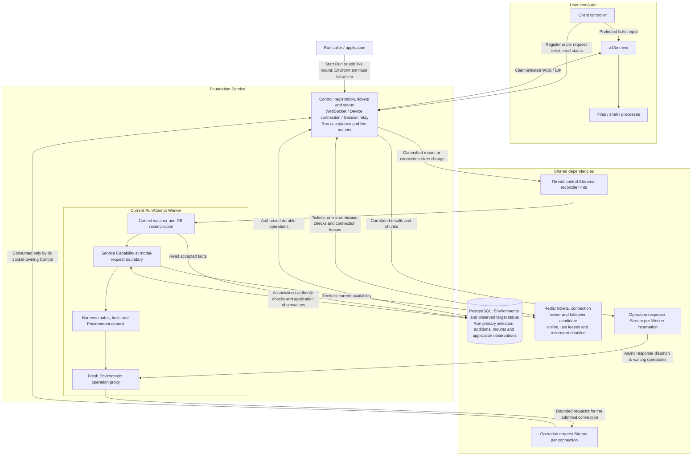
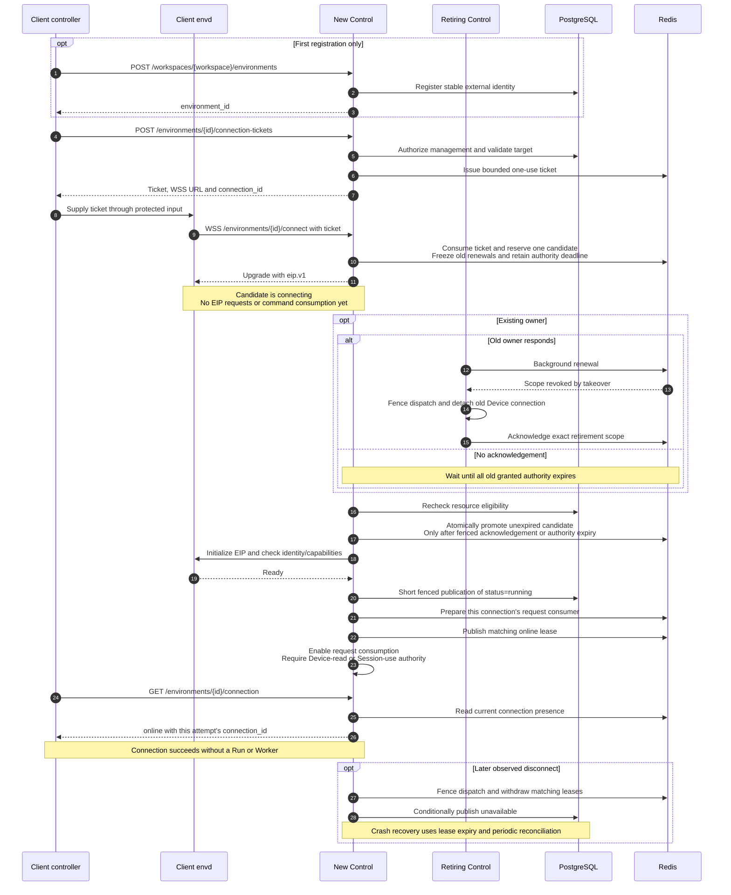
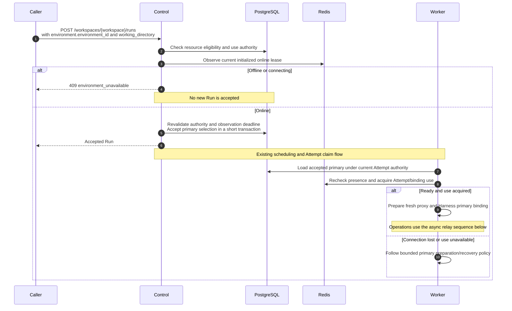
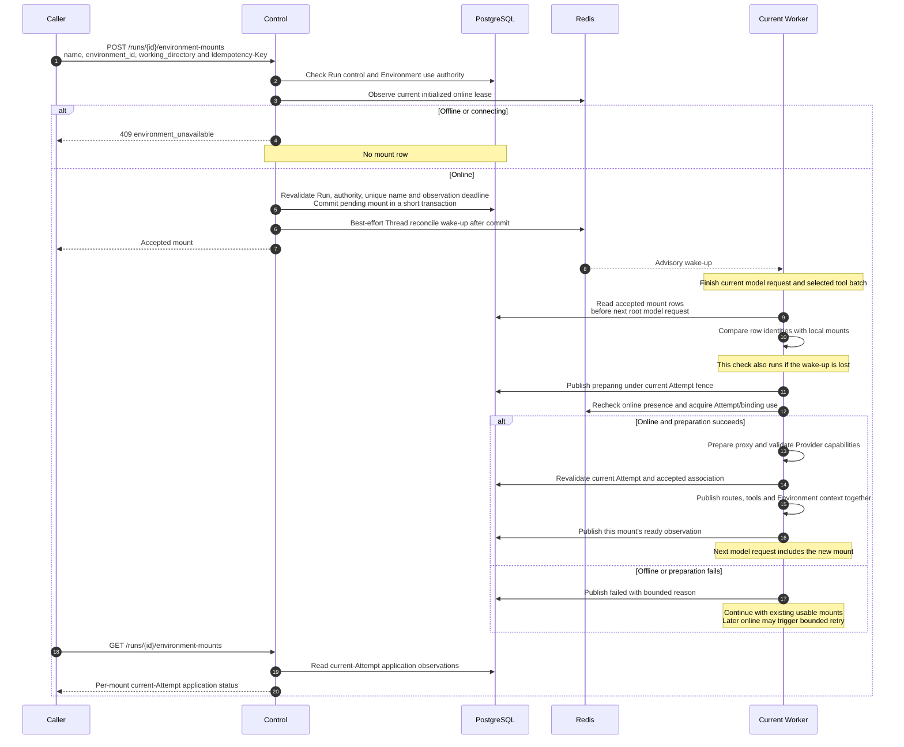
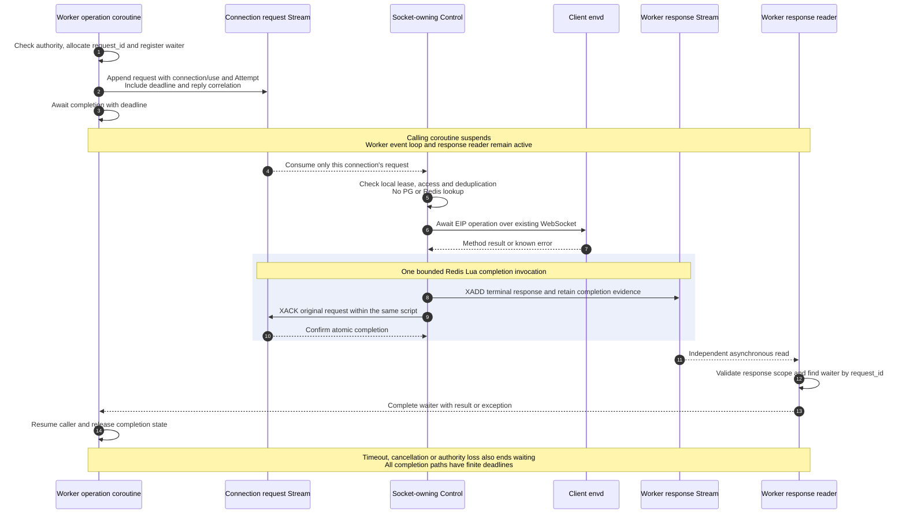

# WebSocket Environments and Live Run Mounts

## Design Position

A user-operated `a13n-envd` connects outward to Control over WebSocket. A caller selects its stable `environment_id` when starting a Run or adds it to the current Run through a separate mount API. The Environment must be online at acceptance. Worker applies additional mounts before a later root model request and invokes envd through Redis Streams.

Connection, durable Run/mount acceptance, and Worker application are separate completion boundaries. Connecting grants no Run access; accepting a mount does not mean it is loaded.

## Boundaries

| Concern                                                                                                  | Owner                                                                                                                |
| -------------------------------------------------------------------------------------------------------- | -------------------------------------------------------------------------------------------------------------------- |
| External identity, Provider, lifecycle and retention                                                     | [Environment Management](29-environment-management.md)                                                               |
| Registration, tickets, WebSocket/EIP Session, connection observations, Run/mount APIs and relay dispatch | Control, under this contract                                                                                         |
| Accepted associations and application observations                                                       | PostgreSQL, under this contract                                                                                      |
| Connection placement, use leases and operation transport                                                 | Redis, under this contract                                                                                           |
| Attempt authority, reconciliation and model-boundary application                                         | Worker and [Active Execution Control](19-agent-control-active-execution.md)                                          |
| Local routing, tools, context and operation leases                                                       | [Harness Environment Integration](../a13n-harness/08-environment-integration.md)                                     |
| EIP and remote Provider semantics                                                                        | [Envd Sessions](../a13n-envd/03-transports-and-sessions.md) and [Remote Envd](../a13n-environment/04-remote-envd.md) |

The connect-only `a13n.websocket-envd` Provider supplies no listener or distributed registry. Service owns the Control Device connection, independent Attempt/binding Sessions and fresh Worker operation proxies; Redis stays outside the shared library. This path requires no Connectivity role or private cross-pod HTTP API. `all` composes the same responsibilities once. All database work uses short scopes outside socket, Redis and operation waits under [Storage](03-storage.md).

## Architecture

## Resource and State Model

### Environment and connection

Registration uses the existing external `environments` resource: Workspace, Provider, typed connection configuration and validated Provider state containing `device_id`, with no TemplateRevision. Existing canonical-target reuse rules apply; EIP input cannot retarget a registered identity.

The client retains the Service origin, `environment_id` and native identity across reconnects, Runs and Sessions. Disconnect, ticket expiry and idleness do not delete this record; explicit removal retains normal reference checks. Reconnect does not advance backing `generation`. Lifecycle operation fields remain lifecycle coordination, while credentials and connection placement stay outside portable Provider state.

Redis connection coordination per Environment holds at most one dispatch owner and one takeover candidate. Each tuple contains the conceptual `environment_id`, `connection_id`, `connection_epoch`, `owner_instance_id`, phase and expiry. A takeover additionally retains the retiring tuple, its outstanding authority deadline and fenced acknowledgement until safe handover. Process incarnation changes on restart; connection epoch, backing generation and Attempt fence are distinct. Socket, EIP Sessions and transfer handles stay in the owning Control process; candidates and retirement evidence add no PG Connection resource.

A fresh authenticated connection actively replaces the existing owner through [active connection takeover](#active-connection-takeover); concurrent extra candidates are rejected. Admission, renewal and cleanup validate exact tuples; dispatch checks its locally confirmed lease under [local dispatch authority](#local-dispatch-authority). Expiry or observed revocation fences further operations. Confirmed Redis authority loss requires fresh routing admission and fresh Sessions for execution uses; recreating keys cannot revive an old scope or bypass the handover interval.

### Live Run mounts

`Run.environment_id`, `environment_working_directory` form the fixed primary binding. Additional mounts are separately authorized rows in `run_environment_mounts`:

| Conceptual field                                | Meaning                                                |
| ----------------------------------------------- | ------------------------------------------------------ |
| `run_id`, `name`                                | Unique mount identity within a Run                     |
| `environment_id`, `working_directory`           | Same-Workspace target, fixed Session working directory |
| `use_started_at`                                | Retained first-use evidence, not a live lease          |
| `created_at`, accepting Principal               | Acceptance order and audit provenance                  |
| `applied_attempt_id`, `applied_attempt_fence`   | Authority of the application observation               |
| `application_status`, `observed_at`, safe error | Bounded loading observation                            |

Mount associations are append-only; their identity, target, working directory are immutable after acceptance. The primary is not duplicated in this table. It occupies `workspace`; additions use `/environment/{name}` and cannot shadow another mount. Mount inputs include an authorized Device working directory under [Environment selection](29-environment-management.md#thread-defaults-and-run-selection), but no credentials or socket destinations. Additions neither broaden existing access nor change `EffectiveAgentConfig`; unmount, replacement and default switching are outside this API.

Without a primary, the first accepted addition becomes the local default when applied; later additions remain named-only even if ready earlier. Primary fields stay null. `created_at` is assigned under the Run acceptance lock and strictly increases for successive additions, including timestamp ties or clock rollback. It preserves acceptance order for default selection and reads, not a client concurrency precondition. Recovery and successor copies preserve the relative order.

Only the current Attempt fence can publish application observations. Reads return per-association status and treat older-Attempt observations as pending. Individual ready mounts remain usable if another fails; there is no aggregate accepted/applied version.

### Independent status axes

| Axis                     | Values                                                       | Meaning                                                                  |
| ------------------------ | ------------------------------------------------------------ | ------------------------------------------------------------------------ |
| PG `environments.status` | `unprepared`, `running`, `stopped`, `deleted`, `unavailable` | Latest target lifecycle observation                                      |
| Redis connection         | `connecting`, `online`, `offline`                            | Takeover/initialization, valid ready connection, or no usable connection |
| Current-Attempt mount    | `pending`, `preparing`, `ready`, `failed`                    | Accepted, loading, installed, or loading failed                          |

### Persisted target status and live connection authority

After exclusive connection handover and Device initialization, Control commits `environments.status=running` through the [fenced publication rules](29-environment-management.md#lifecycle-publication-and-recovery), prepares the request consumer, then conditionally publishes the matching Redis online lease. Consumers start reading commands only after online publication. An uncertain PG write is reconciled within the initialization deadline without repeating EIP initialization. Unresolved publication closes the candidate. A later Redis failure can leave PG saying running without an online connection.

On disconnect, Control fences dispatch, withdraws matching connection/use leases and conditionally publishes `unavailable`. Device initialization requires no workspace Session; a folder or Session readiness failure cannot mark the Device offline. Disconnection implies neither target shutdown nor deletion. Heartbeats renew Redis leases without a PG write on every renewal.

Control periodically reconciles retained WebSocket Environments observed as running or unavailable in bounded batches, including after owner crashes. It captures the target and database version/fence, reads Redis outside the transaction, then conditionally publishes: valid online presence supports running; absent/expired presence supports unavailable; connecting remains with the initialization path. Superseded writes are rejected and retried with fresh evidence. Redis read failure defers publication and reports dependency unavailability. These publishers share Environment coordination with Worker preparation, so stale disconnect work cannot overwrite a newer committed observation.

Redis leases decide current connection eligibility even while PG observations lag. Neither a stored running value nor an earlier UI read substitutes for an online admission check.

## Registration, Tickets and Acknowledgement

### Client connection lifecycle

Registration returns the stable Environment ID without connecting or creating a Run/mount. For each connection, the client requests a short-lived, one-use ticket. Control checks `environment.manage`, Organization/Workspace, enabled Provider and native identity in a short database scope, then issues the ticket through Redis. The response contains the ticket, expiry, credential-free WSS URL and non-secret `connection_id`. Protected ticket metadata binds that ID to the target; no Run or mount intent is accepted.

The controller supplies the ticket through envd's protected credential input; envd sends it in the WebSocket authorization header. Ticket secrets never enter URL queries, logs, prompts, PG or Provider state. Redis verification material expires and is atomically consumed. An uncertain issuance can be retried with a new ticket; consumed-ticket expiry does not end an admitted connection.

Every reconnect obtains a fresh ticket and connection ID through the controller's authenticated Service session. envd receives no broader Service credential. Control matches the path identity to the ticket, checks eligibility, consumes the ticket and reserves the candidate before accepting the `eip.v1` upgrade. An occupied candidate slot rejects the attempt without changing its owner or deadline; a consumed ticket is never reused. Issuing a ticket alone does not trigger takeover. The accepted carrier waits for handover before EIP initialization, as follows.

### Active connection takeover

1. Candidate admission atomically records takeover intent, withdraws online eligibility for new Run/mount/use admission, denies further grants or renewals for the retiring connection and its use scopes, and captures the greatest outstanding granted dispatch deadline, including grants whose replies may be delayed. It serializes with renewal and other admission attempts. Existing owner evidence is retained; replacing or deleting the online key is not sufficient. Without a retiring owner, the candidate can proceed immediately unless a previous retirement barrier remains.
2. The new carrier remains `connecting`: it is held outside the connection SDK, sends no EIP requests and consumes no operation Stream. The old Control observes revocation through renewal or an advisory wake-up, irreversibly fences local dispatch under the dispatch gate, detaches its old Device connection and acknowledges that exact retirement scope through Redis. Until it observes revocation, its existing locally confirmed authority remains bounded by the captured deadline.
3. On the exact fenced acknowledgement or expiry of all outstanding old authority, Control rechecks resource eligibility outside the Redis operation, then atomically revalidates its candidate slot, deadline and retirement evidence before acquiring the new connection epoch. It then attaches to the SDK, initializes the Device and validates identity/protocol capabilities and completes PG/online publication. Worker acquires fresh use before sending to the new connection's Stream; old requests, transfers and use leases do not migrate.
4. Candidate waiting, initialization and publication have finite bounds compatible with envd's initialization deadline. Timeout, disconnect, failed eligibility revalidation or initialization failure closes only that candidate and releases its slot. Retirement is irreversible: failure does not restore the old tuple's renewal rights. Retirement evidence survives candidate cleanup through the outstanding authority horizon, and any subsequent candidate respects it. Redis uncertainty cannot authorize early promotion.

At most one candidate is retained per Environment, with bounded process capacity; additional attempts cannot reset its deadline or repeatedly displace it. The daemon's initialization timeout is not disabled or extended by a Service wait. The Host delays SDK attachment only within that timeout and closes/retries with a fresh ticket if the remaining budget cannot cover handover and initialization. Two physical sockets may overlap, but new-command dispatch authority cannot. Already dispatched effects retain the ordinary unknown-outcome and cancellation rules.

### Connection success

The client confirms connection through `GET /environments/{environment_id}/connection`: `status=online` and `connection_id` must match its ticket response. During takeover or initialization, the read returns `connecting` with the candidate ID, never advertises the retiring tuple as available for new admission, and does not imply the old socket has closed. If the candidate fails, it returns `offline`, null connection ID and a bounded error while retained retirement evidence continues fencing old authority. Online publication never waits for a Run or Worker; HTTP upgrade or another connection's online observation is insufficient.

The read requires `environment.read` and returns safe status, current connection ID, observation time and bounded error. No presence means offline with null connection ID; an authoritative read failure returns a dependency error. Placement and native handles remain private. envd observes standard EIP initialization, with no extra Service acknowledgement frame or competing carrier reader.

### Connection sequence

Diagram paths omit `/api/v1`. Control represents the role; management requests may reach another replica, which resolves current ownership through shared presence.

## Selecting an Environment for a Run

### Online admission and disconnect races

Both primary selection and live mount acceptance authorize the resource, then obtain fresh Redis evidence of an initialized online connection with an unexpired lease and no pending takeover. Retiring tuples are ineligible even while their local dispatch deadlines have not elapsed. Offline/connecting targets return `409 environment_unavailable` without a new Run, mount or successful receipt. Redis failure returns dependency unavailability.

The subsequent short PG transaction revalidates durable authority, target, applicable lifecycle/concurrency preconditions and the observation deadline. Expired evidence requires leaving the transaction and retrying within a finite deadline. This is not a distributed reservation: disconnect can race commit, so preparation rechecks shared presence and acquires fenced use, while dispatch checks locally confirmed authority. Idempotent replay returns the original receipt, not a fresh availability guarantee.

### Selection when starting a Run

The existing [Start and Continue interfaces](18-agent-control-input-and-continuation.md#start-and-continue) accept an existing-Environment selection containing `environment_id` and optional `working_directory` and retain their normal Agent input, authorization, idempotency, Thread-version and queue rules. Queued submissions repeat the online check when actually accepted; waiting continuations and retries retain their selection restrictions.

Before the acceptance transaction, Control resolves an omitted working directory from Device info under [Environment selection](29-environment-management.md#thread-defaults-and-run-selection). Acceptance fixes the complete primary target/working-directory binding without Provider I/O inside the transaction or an additional-mount row. Worker reconstructs its proxy through ordinary primary preparation. Later disconnection follows bounded preparation/recovery rules and cannot silently remove the requested primary.

### Addition to an accepted or executing Run

The mount API accepts `name`, `environment_id`, optional `working_directory`, with `Idempotency-Key` for retries. It requires no mount-set expected version or ETag. It requires Run-control authority, `environment.use` for both caller and persisted Run Principal, same-Workspace ownership, an enabled Provider. Only the Thread's current accepted/running Run allows additions.

Before the acceptance transaction, Control resolves an omitted working directory from Device info. Acceptance locks/revalidates Thread and Run, checks the unique `(run_id, name)`, and commits the explicit working directory, pending association and idempotency evidence before sending a best-effort reconcile wake-up. Different names can be accepted concurrently through this serialized transaction without a collection-version conflict. An existing name returns a conflict unless this is the original idempotent replay. A concurrent waiting/terminal transition either rejects acceptance or follows a committed association retained as history.

### Product API

Control owns all routes below, relative to `/api/v1`.

| Method and route                                         | Result                                                                                        |
| -------------------------------------------------------- | --------------------------------------------------------------------------------------------- |
| `POST /workspaces/{workspace}/environments`              | Register external identity                                                                    |
| `POST /environments/{environment_id}/connection-tickets` | Ticket, expiry, WSS URL and connection ID                                                     |
| `GET /environments/{environment_id}/connection`          | Safe current connection observation                                                           |
| `WS /environments/{environment_id}/connect`              | Ticket-authorized EIP ingress                                                                 |
| `POST /workspaces/{workspace}/runs`                      | Start with selected primary Environment                                                       |
| `POST /threads/{thread_id}/runs`                         | Ordinary submission under existing queue/continuation rules                                   |
| `POST /runs/{run_id}/environment-mounts`                 | Accepted additional association                                                               |
| `GET /runs/{run_id}/environment-mounts`                  | Bounded additional-mount list in acceptance order with per-mount current-Attempt observations |

Registration, Run and mount mutations follow their separate [idempotency contracts](../api-conventions.md#mutations-and-retries). Mount replay returns the original receipt before new acceptance checks; changed content under the same key conflicts. It never inserts another association. Ticket issuance is an independent expiring credential operation. Run/mount reads retain resource-read authority and redaction; primary readiness uses ordinary Run/Environment reads.

## Worker Reconciliation and Model Boundary

Control sends bounded, payload-free Thread wake-ups after mount commits and online publication to Runs already associated through primary or additional mounts. The watcher rereads accepted associations from PG but never mutates Harness. At each model boundary, Worker captures the accepted rows and compares their `(run_id, name)` identities with its locally installed mounts, preparing missing associations or retrying unavailable ones under the existing policy. Ready observations in PG do not substitute for local installation. Mandatory reconciliation at startup, takeover, tool-batch, checkpoint, outcome and each root model-request boundary makes lost/duplicate wake-ups harmless to accepted facts.

At the model boundary, Worker marks an addition preparing, rechecks presence, acquires Attempt/binding use and validates Provider capabilities outside PG transactions. Immediately before local publication it revalidates the Attempt fence and accepted association. Routes, effective tools/schema and trusted Environment context advance together before request assembly. An initially empty Run has the stable facade and dynamic capability from startup but exposes no premature tools; existing capability restrictions still apply.

Publication occurs between complete root iterations, after the selected tool batch. It cannot alter an in-flight model request or run inside compaction, nested calls or concurrent inline execution. A mount accepted after the boundary snapshot waits for the next boundary; a finishing Run may never apply it.

| Outcome                                            | Application behavior                                                                                                   |
| -------------------------------------------------- | ---------------------------------------------------------------------------------------------------------------------- |
| Accepted and waiting for boundary                  | Pending means awaiting loading, not awaiting client connection                                                         |
| Preparation succeeds                               | Publish ready under current Attempt fence                                                                              |
| Offline/connecting before application              | Failed with `environment_unavailable`; preserve existing mounts and continue                                           |
| Other preparation failure                          | Close only the candidate and preserve successful additions; dependency errors remain distinct from offline             |
| Later online connection                            | Bounded retry of the existing authorized association; no new association and no authorization/capability hot-loop      |
| PG observation write fails after local publication | Retry publication using bounded local evidence without re-entering the adapter; reads cannot claim ready yet           |
| Ready mount loses transport                        | May remain installed but unavailable; display Agent availability only with current-Attempt ready and online connection |

### Live mount sequence

### Use, recovery and inheritance

Acceptance alone acquires no environment-use slot. Each active Attempt/binding use owns an independent EIP Session with bounded concurrent operations. Multiple uses share the Device connection. Use leases and Session keepalive never exceed confirmed Attempt authority; loss, cancellation or termination fences that use and closes its Session. Control connection renewal and sibling activity cannot renew another use's Session. Closing the last Session leaves the Device online; only connection ownership loss or explicit connection shutdown closes the carrier.

Recovery reloads complete accepted PG bindings, reauthorizes them and opens fresh Sessions/proxies. Checkpoint state cannot invent mounts; reconstruction uses the retained association's working directory and current validated target state, never mutable Thread or Device defaults. Old handles and readiness do not transfer to another Attempt. Same-runtime short reattachment is limited to the same Session and generation under still-valid use authority; it neither imports resources nor replays requests.

Waiting seals the association set. Retry and state-preserving waiting successors copy it with its exact working directories and acquire fresh use. Unrelated ordinary Runs, forks and independently scheduled children do not inherit additions; inline children borrow the parent facade. Additions cannot retroactively satisfy acceptance-time primary requirements for inputs or managed Skills. Usage, retention and cleanup account for every acquired primary/additional mount.

## Redis Stream Operation Relay

### Device Discovery Relay

Device info and directory discovery use bounded request/response relay envelopes addressed to the current connection owner. Their discriminated Device scope contains the authenticated Principal, authorized Environment, exact connection/epoch, requested method and finite authorization deadline, without a Run/Attempt or Session. Control reauthorizes each product request before publication. Only `device.describe` and `directory.list` are allowed in this scope; it cannot open a Session or dispatch Agent effects. The socket owner checks current connection authority and the request deadline before EIP dispatch. Responses return only to the originating Control incarnation. Cancellation, owner loss or timeout ends the request without acquiring Environment use. Device requests do not renew Session liveness.

These read requests share bounded relay transport and completion handling with Session requests. HTTP envd uses direct EIP calls and no Redis relay.

### Routing and authority

Operation Streams are separate from Thread control and presentation Streams. Their scopes are fixed; key spellings below are illustrative internal names.

| Stream                          | Producers                                                          | Sole consumer                               |
| ------------------------------- | ------------------------------------------------------------------ | ------------------------------------------- |
| `env:req:<connection_id>`       | Workers with authorized use; Controls with authorized Device reads | Control incarnation holding that connection |
| `env:resp:<origin_instance_id>` | Controls returning results                                         | Originating Worker or Control incarnation   |

Request, response and completion-deduplication keys touched by one Lua completion script share one Redis scripting domain; Redis Cluster requires the same hash slot. The names above identify scopes, not Cluster hash tags. Key placement and backend scripting support are validated under [Storage](03-storage.md#redis-compatible-data-structures); unsupported wiring fails before serving this relay rather than falling back to separate publication and ACK.

Consumers are prepared before their scopes admit requests; a candidate cannot read operation requests before handover and online publication. There is no global competing Control request consumer. Reconnect or process restart creates a new scope; old requests/results cannot be claimed or forwarded into it.

Worker resolves the admitted connection through trusted presence. The Session-scoped envelope carries request ID, Environment, connection/epoch, binding/use identity, Run/Attempt fence, operation, absolute deadline, bounded payload and reply correlation. Control binds each use to exactly one Session and routes its requests, controls, binary transfers and handles through that Session. Worker input cannot select a sibling Session. Stream frames add transfer identity, sequence/offset and terminal outcome. Incompatible envelopes fail before dispatch. Clients cannot choose Stream keys, reply destinations, native endpoints or other Runs. Device-scoped reads use only the separate authority defined above.

### Local dispatch authority

Control confirms connection ownership and Attempt use authority with Redis when establishing the use scope, then refreshes them through background lease renewal. Session open, attach and keepalive require that use's current authority and exact binding; connection-only health grants none. Before each Session-scoped EIP write it checks only local socket state, exact connection/use and Attempt identities, published access policy, invalidation state and deadlines. Device reads instead check their authorized Device envelope, allowed method, connection authority and deadline. These checks perform no PG or Redis queries. Worker likewise checks local Attempt/access authority before request publication; request and response transport still uses Redis Streams. Stream membership or a connection ID grants no execution permission.

The effective Session dispatch deadline is bounded by the last confirmed connection lease, use lease and Attempt authority. Device-read dispatch is bounded by the connection lease and request authorization deadline. Local monotonic deadlines conservatively account for communication delay and clock uncertainty. Failed or uncertain renewal cannot extend them; a delayed renewal cannot revive an expired or invalidated scope. Transient renewal failure permits dispatch only within the remaining confirmed interval. Observed revocation, disconnect or cancellation fences local writes immediately, serialized with dispatch admission. Remote revocation takes effect when observed or at lease expiry, not necessarily at the instant Redis changes.

Replacement connection/use authority becomes usable only after the old dispatch owner acknowledges that the scope is irreversibly fenced, or after its greatest outstanding granted dispatch deadline has elapsed. [Active connection takeover](#active-connection-takeover) freezes old renewals while the candidate waits; renewal and replacement acquisition serialize on the same shared authority. Deleting a key is not proof that cached authority has expired; if lease history is lost, replacement waits the maximum outstanding lease horizon before fresh admission. Fencing stops new dispatch and does not prove that already dispatched effects have terminated.

### Asynchronous request completion

The originating Worker or Control registers bounded local completion state before publishing a request, then awaits its result, deadline, cancellation or authority loss. A response reader validates scope and correlates results by request ID. Fast responses find an existing waiter; duplicates, late or foreign responses cannot complete another request or revive cancellation.

Only the calling coroutine and dependent tool/model work wait. The event loop, other Runs, heartbeats and control reconciliation remain responsive; ordinary Run execution-slot accounting continues. Async Redis readers have bounded blocking reads and reserved connection capacity so publication, renewal and cancellation are not starved. Control dispatches with bounded concurrency and returns the result defined by the EIP method, such as a process handle for start rather than an implicit wait for exit.

Session operations follow this sequence; Device reads use the originating Control's waiter and Device authority instead of Worker use/Attempt authority.

Streaming operations use bounded per-request chunk queues and terminal outcomes. A slow consumer must not block unrelated response delivery: flow control pauses or fails that transfer. Every completion/error/cancellation/shutdown path settles local waiters and releases resources. Reader failure is surfaced within finite deadlines; recovery within a still-valid scope retains correlation and deduplication, while scope loss never reconstructs effects.

### Delivery and uncertain outcomes

For an admitted request, Control retains its terminal outcome and submits one bounded Lua completion operation. The script validates request/group identity, reply correlation, key types and payload bounds before mutation, then appends the terminal response with `XADD`, retains completion evidence under the request's deduplication scope, and acknowledges the original entry with `XACK`. A successful invocation publishes the response and ACK atomically; there is no separate client-side ACK step or wait for originating-consumer delivery. Streaming chunks are published in order beforehand; only the terminal outcome participates in completion, so bulk data never becomes one unbounded script.

A lost script reply leaves completion uncertain, not necessarily uncommitted. Bounded retries use the same request ID, request entry and canonical result. Retained completion evidence suppresses repeated terminal publication and permits acknowledgement of redelivered entries without another EIP execution. Lua does not roll back earlier writes after a runtime error: ordinary rejection conditions are checked before mutation, and partial completion is reconciled without ever acknowledging a request before its response exists. Any uncertain duplicate response remains harmless to the originating waiter. Lost outcome evidence follows the unknown-outcome rules below; expired scopes use bounded cleanup rather than fabricated completion. Script atomicity does not make envd execution part of the Redis transaction or guarantee continuity after Redis data loss.

Deduplication retains each request ID and canonical payload for the complete delivery deadline window. Identical redelivery returns the known in-flight/result observation or refuses replay; changed payload conflicts. Expired requests fail before dispatch. A lost append acknowledgement can be retried with the same ID only while its exact scope and deduplication evidence remain valid.

| Evidence                                    | Outcome                                                                                                  |
| ------------------------------------------- | -------------------------------------------------------------------------------------------------------- |
| Confirmed not dispatched                    | Known failure                                                                                            |
| Terminal EIP result/error                   | Complete the correlated operation                                                                        |
| Possibly dispatched, result unrecoverable   | Unknown outcome; never automatically replay the effect                                                   |
| Redis publication, consumption or ACK alone | Transport progress, not operation success                                                                |
| Timeout/cancellation                        | End local waiting; attempt supported EIP cancellation within bounds, without claiming remote termination |

Control records in-flight dispatch evidence before a possible write. Owner or evidence loss invalidates that scope: `XAUTOCLAIM`, a new connection or a new request ID cannot replay uncertain operations. EIP receipts may reconcile effects only where the protocol supports it. Cross-Attempt effect deduplication remains governed by [Run Recovery](13-run-attempt-scheduling-and-recovery.md), not relay delivery guarantees.

### Bounds, streaming and cleanup

Deployment bounds candidate count/wait, per-Session, per-connection and per-origin concurrency, pending bytes, frame/chunk sizes, deadlines, retention and inactivity. Overload is rejected before dispatch; control/cancellation retain capacity independently of bulk traffic. File/process streams use ordered chunks, offsets and explicit completion. Missing/trimmed chunks mean incomplete transfer or unknown mutation outcome, never successful EOF. Retention preserves required live evidence; exceeding capacity fails the transfer. Transfer handles remain Session/use-scoped in Control, and payloads stay out of logs, traces and control wake-ups.

Connection consumers end with their socket; each shared Worker or Control response reader survives individual operations until its process drains. Waiters, transfers, pending entries and deduplication evidence are reclaimed after their safety windows. Retired Streams expire or are collected even after owner loss. Cleanup cannot revive authority, replay effects or destroy caller-owned targets. Control drain fences leases, resolves known outcomes, closes sockets and publishes unavailable; crashes rely on lease expiry, waiter deadlines and observation reconciliation. Worker drain preserves durable associations through normal handoff.

## Verification

Mount concurrency uses unique association names, idempotency and lifecycle locks, without a mount counter on Run. Durable schema changes follow the owning generated-migration workflow. Secrets, socket placement and runtime handles remain outside database payloads and portable state.

Verification covers cross-Control management/socket ownership and separate Workers, plus these failure boundaries:

- **Admission:** duplicate/expired tickets, cross-Workspace authority, candidate-slot conflicts, PG publication failure, stale presence, disconnect racing commit, queue-time versus actual acceptance, and idempotent replay.
- **Application:** empty-Run first mount, acceptance-order default, lost wake-ups, concurrent distinct names, same-name/idempotency conflicts, terminal races, timestamp ties/rollback, failed candidates, failed observation publication, and Attempt recovery/inheritance.
- **Relay:** Device reads without Run/Session/use allocation, rejection of Session methods in Device scope, response isolation between originating Controls and Workers, wrong owner/epoch, reconnect/restart isolation, fast/out-of-order/duplicate/late responses, atomic response/ACK completion, lost script replies, partial script errors, completion retries and redelivery without re-execution, supported key placement, lost append/result, and owner failure after possible dispatch.
- **Dispatch authority:** no per-operation PG/Redis queries, failed or delayed renewal, local expiry/revocation, concurrent renewal and replacement, and non-overlapping handover after acknowledgement or lease expiry, including lost lease history.
- **Takeover:** candidate reports connecting and consumes no commands, old renewal grants are frozen, delayed grant replies remain covered, acknowledgement/expiry races permit one promotion, candidate failure never restores old authority, and retained retirement evidence plus finite initialization bounds govern retries.
- **Resources:** slow readers, trimmed chunks, timeout/cancellation, reader failure, Redis loss, drain, independent heartbeat/cancellation progress and bounded cleanup without retained database connections.
