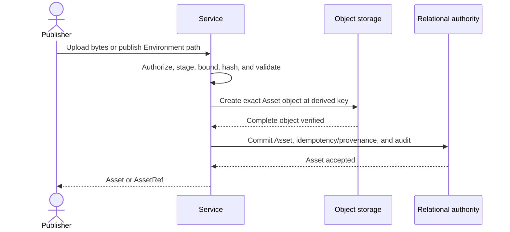

# Asset Management

## Design Position

An `Asset` is one Workspace-owned, immutable publication of binary content. Every distinct accepted upload or Agent publication creates a new `asset_id`, even when its bytes, filename, media type, or digest equal an existing Asset. An idempotent replay of the same logical create returns the originally created Asset rather than creating another one.

Asset content and creation metadata never change in place. Service defines no `AssetRevision`, mutable content replacement, rename operation, or current-revision selector. A caller that wants different bytes or metadata publishes another Asset. Deletion is the only Asset lifecycle transition.

An Asset is an independent product resource, not an oversized Run payload, Environment file, Item, A2A Artifact, or object-storage key. The relational Asset record is publication authority; object presence alone never creates an Asset.

## Boundaries

| Concern                                                                     | Owner                                                                                                              | Contract                                                                                   |
| --------------------------------------------------------------------------- | ------------------------------------------------------------------------------------------------------------------ | ------------------------------------------------------------------------------------------ |
| Asset identity, immutable metadata, publication, content read, and deletion | This document                                                                                                      | Defines one exact binary publication and its Workspace lifecycle                           |
| Object streaming, create-only publication, and deletion                     | [Service Storage](03-storage.md#object-storage)                                                                    | Supplies opaque-key binary persistence without product authority                           |
| Public upload, read, and delete conventions                                 | This document and [Platform API Conventions](../api-conventions.md)                                                | Defines the Asset routes and their one exact binary transfer media type                    |
| Atomic publication, idempotency evidence, audit, and cleanup intent         | [Durable Operations and Outbox](06-durable-operations-and-outbox.md)                                               | Commits relational authority without holding a transaction across binary I/O               |
| Product authorization and security audit                                    | [Service IAM](33-identity-and-access-management.md)                                                                | Applies current Workspace roles and records bounded security events                        |
| Asset-backed Agent input                                                    | [Agent Input](17-agent-input.md)                                                                                   | Stores one immutable `asset_id` as a binary source and controls Worker delivery            |
| Run input, output, state, and retry                                         | [Durable Run State](12-run-persistence.md)                                                                         | Retains Asset references inside the values that already own them                           |
| Agent-originated publication                                                | This document and [RunAttempt recovery](13-run-attempt-scheduling-and-recovery.md#recovery-and-budget-enforcement) | Publishes through an explicitly selected Capability and a tool-specific fenced transaction |
| Items and retained presentation                                             | [Lifecycle and Stream Persistence](24-lifecycle-and-stream-persistence.md)                                         | Can retain bounded `AssetRef` values without becoming Asset authority                      |
| Hosted AG-UI and A2A projection                                             | [Hosted AG-UI](22-hosted-ag-ui.md) and [A2A](23-a2a.md)                                                            | Bind protocol-specific result values to an authorized Asset without exposing storage keys  |
| Automatic oversized-content spill                                           | [Events, Usage, and Delivery](25-events-usage-and-delivery.md#large-content)                                       | Remains content of its Run or Item and does not create an Asset implicitly                 |

Service defines no `RunAssetLink` resource or table. A Run input stores the exact `asset_id` in its accepted `AgentInput`; a Run output or retained Item can store an `AssetRef` in its existing JSON value; and an Asset created by Agent work stores its creation provenance on the Asset. Those references are correlation, not ownership, retention pins, or authority.

## Asset Model

The following Python-like schemas are conceptual domain values rather than wire or ORM declarations:

```python
class UploadedAssetSource:
    kind: Literal["upload"]
    principal: PrincipalRef


class RunOutputAssetSource:
    kind: Literal["run_output"]
    run_id: RunId
    run_attempt_id: RunAttemptId
    invocation_id: str


type AssetSource = UploadedAssetSource | RunOutputAssetSource


class Asset:
    id: AssetId
    organization_id: OrganizationId
    workspace_id: WorkspaceId
    filename: str
    media_type: str
    size_bytes: int
    content_sha256: str
    source: AssetSource
    created_at: datetime
    deleted_at: datetime | None


class AssetRef:
    schema_version: Literal["1"]
    asset_id: AssetId
    filename: str
    media_type: str
    size_bytes: int
    content_sha256: str
```

`AssetId` uses the allocated `ast` object-ID prefix. The ID is the identity of one exact publication; it is not derived from the content digest and is never reused. The lowercase SHA-256 digest verifies bytes but does not merge identities or grant read authority.

`filename` is immutable bounded display metadata. It is NFC-normalized, contains 1 through 256 Unicode scalar values, has no leading or trailing whitespace, path separator, NUL, or control character, and never becomes a storage or Environment path. `media_type` is a lowercase MIME media-type essence without parameters or wildcards and defaults to `application/octet-stream`. It is a declared content hint, not proof that arbitrary bytes conform to that type. `size_bytes` is non-negative.

`source` records creation provenance only. An upload records the authenticated Principal that accepted the binary create. A Run output records the exact fenced Attempt and trusted runtime invocation identity that published it. It does not enumerate Runs, Items, protocol Artifacts, or external deliveries that later reference the Asset.

`AssetRef` is the bounded safe value returned by Asset publication and usable in Run output, Items, and protocol projections. It contains no object key, Environment path, credential, signed URL, or bearer capability. Every dereference resolves the current Asset row and reauthorizes the caller.

## `assets` Relational Schema

The conceptual model materializes as one `assets` row per publication. The table uses the portable relational subset defined by [Relational Schema Lifecycle](04-relational-schema.md): identifiers and bounded strings are text, `size_bytes` is a signed 64-bit integer constrained to the non-negative domain, and timestamps preserve UTC instants.

| Column                  | Nullability and key                   | Durable meaning                                                                                       |
| ----------------------- | ------------------------------------- | ----------------------------------------------------------------------------------------------------- |
| `id`                    | Not null; primary key                 | Immutable `ast`-prefixed Asset ID                                                                     |
| `organization_id`       | Not null                              | Owning Organization; immutable                                                                        |
| `workspace_id`          | Not null                              | Owning Workspace; immutable                                                                           |
| `filename`              | Not null; bounded Unicode text        | Immutable normalized display filename                                                                 |
| `media_type`            | Not null; bounded ASCII text          | Immutable normalized media-type essence                                                               |
| `size_bytes`            | Not null; non-negative 64-bit integer | Exact published content length                                                                        |
| `content_sha256`        | Not null; 64-character lowercase hex  | Exact published-content digest                                                                        |
| `source_kind`           | Not null; `upload` or `run_output`    | Selects exactly one normalized provenance shape                                                       |
| `source_principal_type` | Nullable; `user` or `service_account` | Uploading Principal kind; present only for `upload`                                                   |
| `source_principal_id`   | Nullable; bounded text                | Uploading Principal ID; present only for `upload`                                                     |
| `source_run_attempt_id` | Nullable; same-Workspace foreign key  | Exact RunAttempt that executed `publish_asset`; present only for `run_output`                         |
| `source_invocation_id`  | Nullable; bounded text                | Exact trusted-runtime invocation identity within the source RunAttempt; present only for `run_output` |
| `created_at`            | Not null; UTC timestamp               | Relational publication commit time                                                                    |
| `deleted_at`            | Nullable; UTC timestamp               | Terminal logical deletion time; the only column that can change after insert                          |

The table preserves these constraints:

1. `(workspace_id, organization_id)` references `workspaces(id, organization_id)`, proving that the Workspace belongs to the same immutable Organization owner.
2. One row satisfies exactly one source shape. `upload` requires both Principal columns and requires both Run-output columns to be null. `run_output` requires both Run-output columns and requires both Principal columns to be null. Unknown `source_kind` and `source_principal_type` values fail closed.
3. `(organization_id, source_run_attempt_id)` for a Run output references `run_attempts(organization_id, id)`. The source Run must belong to the Asset’s Workspace. The immutable Attempt supplies its `run_id`, so `assets` does not duplicate `source_run_id`; the domain projection and `source_run_id` filter join through that Attempt. The fenced create transaction requires the current trusted `AssetCapability` runtime to supply `source_invocation_id` together with the selected Attempt's lease and fence; the invocation identity is not accepted from model arguments and is not looked up in a generic RunAttempt ledger.
4. A partial unique index on `(source_run_attempt_id, source_invocation_id)` for `source_kind = 'run_output'` admits at most one Asset for one invocation within that Attempt. Logical deletion does not release this identity. Reconciliation returns the existing row only when its immutable metadata and content evidence match; a different candidate under the same invocation fails closed and never replaces the original.
5. `filename`, `media_type`, `size_bytes`, and `content_sha256` satisfy the Asset-model bounds. `deleted_at`, when present, is not earlier than `created_at`.
6. Every column except `deleted_at` is immutable. The table has no `version` or `updated_at`: content and metadata do not support compare-and-swap mutation, and deletion is a conditional update constrained by `deleted_at IS NULL`.

Principal provenance deliberately uses the same polymorphic reference shape as IAM and has no foreign key to a universal Principal table, because IAM defines no such table. The create transaction validates the exact current User or Service Account and Workspace. Later Principal deactivation or removal does not erase historical upload provenance.

The accepted access paths are:

| Access path                      | Index or uniqueness contract                                                                                                                                                                   |
| -------------------------------- | ---------------------------------------------------------------------------------------------------------------------------------------------------------------------------------------------- |
| Exact authorized read or delete  | Primary-key lookup by `id` with mandatory `organization_id`, `workspace_id`, and active-row predicates in the authoritative query                                                              |
| Active Workspace listing         | Partial index on `(organization_id, workspace_id, created_at desc, id desc)` where `deleted_at is null`                                                                                        |
| Active source-kind listing       | Partial index on `(organization_id, workspace_id, source_kind, created_at desc, id desc)` where `deleted_at is null`                                                                           |
| Active source-Run listing        | `run_attempts(organization_id, run_id, attempt_number)` joined to a partial index on `(organization_id, workspace_id, source_run_attempt_id, created_at desc, id desc)` for active Run outputs |
| Agent-publication reconciliation | Partial unique `(source_run_attempt_id, source_invocation_id)` for every Run-output row, including tombstones                                                                                  |
| Bounded tombstone-retention scan | Partial index on `(deleted_at, id)` where `deleted_at is not null`                                                                                                                             |

`content_sha256` is neither unique nor an identity lookup index, and `filename` is not unique. Equal content or equal display names remain independent Assets and never cause relational or physical adoption.

Asset operations reuse shared durable records instead of adding Asset-specific coordination tables:

- Native upload stores its caller-key digest, canonical request digest, `asset_id` result reference, and 24-hour expiry in the shared idempotency-evidence boundary; the `assets` row stores no key or request digest.
- Delete conditionally sets `deleted_at` and commits security audit plus one shared `outbox_records` cleanup intent in the same transaction. That intent uses `source_kind="asset"`, `source_id=asset_id`, `destination_kind="asset_content_cleanup"`, and a bounded `destination_ref` selecting the configured Asset object store. The derived object key is not copied into the Outbox row.
- The Asset tombstone remains while cleanup is deliverable or redriveable, upload reconciliation evidence can return it, or a source RunAttempt can still reconcile the publication. After cleanup and those retention dependencies finish, policy can prune the row; the Asset ID is never reused.

There is no `asset_revisions`, `run_asset_links`, Asset-specific upload-receipt, or Asset-specific cleanup table. Run inputs and outputs keep their existing JSON ownership, and the shared Outbox row owns asynchronous cleanup progress.

## Service Bounds

Every deployment configures a positive finite `assets.max_size_bytes`. The same effective bound applies to Native upload, protocol import, and Agent publication. A deployment can impose lower Workspace byte, count, rate, or concurrent-publication quotas; quota rejection never deletes another Asset.

Publication streams through bounded private staging and never buffers the complete body in an API or Worker process. Service computes size and SHA-256 while staging, applies content policy and any reliable format checks, and rejects a positive media-type conflict before publication. Unknown content remains representable as `application/octet-stream`.

Asset upload idempotency evidence is retained for 24 hours after the accepted commit. The canonical create input consists of Workspace, normalized filename, normalized media type, exact size, and computed content digest. Same-key replay with the same canonical input returns the original Asset; reuse with different metadata or bytes returns an idempotency conflict. After evidence expires, its absence does not prove an earlier create did not commit.

## Native Management API

All routes are below `/api/v1`, are exposed only by `control` and `all`, and follow the common JSON, error, collection, and idempotency contracts.

### Upload

```http
POST /api/v1/workspaces/{workspace_id}/assets?filename=report.pdf&media_type=application%2Fpdf
Content-Type: application/octet-stream
Idempotency-Key: opaque-caller-key
```

`filename` is required. `media_type` is optional and defaults to `application/octet-stream`. The request body is exactly the Asset bytes. The route accepts no multipart body, base64 JSON, caller object key, mutable upload target, or separate upload-receipt resource. A successful create returns the Asset JSON resource with `201`.

Every distinct accepted request creates a fresh Asset ID. Uploading identical bytes twice with different idempotency identities therefore creates two Assets. Repeating one possibly committed request with its original key is one logical upload and returns the first Asset.

### Read and Delete

```http
GET /api/v1/workspaces/{workspace_id}/assets?limit=50&cursor=opaque
GET /api/v1/assets/{asset_id}
GET /api/v1/assets/{asset_id}/content
DELETE /api/v1/assets/{asset_id}
```

The collection orders by `(created_at desc, id desc)` and can filter by `source_kind` or one currently readable `source_run_id`. Metadata reads return the immutable Asset projection. A Run-output source exposes its `run_id` only when the caller can also read that Run; Attempt and tool-invocation provenance remain internal operational correlation.

The content route authorizes the active Asset before opening object storage and streams `application/octet-stream`. It sets a safe `Content-Disposition` from the immutable filename and a strong representation `ETag` derived from the content digest. The ETag is content validation, not an Asset version or a mutation precondition. Service exposes no public object URL or storage key.

Delete terminally tombstones an active Asset and returns `204`. A missing, concealed, or already deleted Asset returns the owning not-found result. Asset has no `PATCH`, complete replacement `PUT`, rename, restore, revision collection, or historical-content route.

Stable domain errors include `asset_not_found`, `asset_content_unavailable`, `asset_limit`, `asset_media_type_invalid`, `asset_content_invalid`, and `asset_idempotency_conflict`. Errors never expose staged paths, object keys, private Environment paths, raw scanner output, or content bytes.

## Publication and Storage Authority

Service derives the content key only after allocating an Asset ID:

```text
organizations/{organization_id}/workspaces/{workspace_id}/assets/version-1/{asset_id}/content
```

The object content type is `application/octet-stream`. Object metadata records `asset-id`, `workspace-id`, `size-bytes`, and `content-sha256`. The key and metadata are internal layout, not public identity or authority. Two Assets with equal content use distinct logical keys; an implementation can optimize physical storage internally only when it preserves independent deletion, integrity, and observable Asset identity.

Publication follows one authority sequence:



No relational transaction spans body transfer, Environment reads, object publication, scanning, or other external I/O. The final short transaction creates the Asset row and its required idempotency, provenance, and audit facts. For Agent publication it additionally verifies the current Run, RunAttempt, lease, fence, selected `AssetCapability`, and trusted runtime-supplied invocation identity.

An object published without a committed Asset row is a non-authoritative cleanup candidate. A committed row whose response was lost is reconciled through the same upload idempotency key or the same Agent tool-invocation identity. Object listing, timestamp, digest equality, or caller possession never authorizes adoption.

## Agent Publication Capability

An AgentRevision can explicitly select the trusted Service `AssetCapability`. When selected, it exposes one effectful model tool, `publish_asset`, that accepts a logical path in the current default Environment plus optional filename and media-type metadata. It reads only a confined regular file through the active Environment file interface, never a Worker host path. Omitted filename defaults to the source basename, and omitted media type defaults to `application/octet-stream`.

Publication is explicit. Service never turns every created Environment file, command output, model output, Run output, or oversized Item value into an Asset. A Revision without `AssetCapability` cannot publish one through this boundary.

The tool-specific Asset publication transaction uses `(run_attempt_id, invocation_id)` as its idempotency identity. One invocation can publish at most one Asset and returns the same `AssetRef` when the live owning Attempt reconciles that exact invocation. A later model-issued invocation, including one re-driven after Worker replacement, receives a new identity and creates a new Asset even for the same path and bytes.

If publication commits but its tool result does not enter a complete checkpoint, generic Run recovery cannot recover that invocation identity or reattach its `AssetRef`. The Asset remains independently readable through authorized source-Run queries, while resumed model execution can publish another Asset. `AssetCapability` therefore prevents duplicates only for replay of the same invocation inside its owning Attempt; it does not provide cross-Attempt exactly-once publication.

`AssetCapability` owns no detached Capability state. The Asset row and its selected object are publication authority. After a successful tool result enters a complete checkpoint, its `AssetRef` is present only as ordinary Harness message history. Service adds no Asset receipt, publication ledger, or Asset-specific namespace to Run `state.json`.

An Asset remains valid if its producing Run later waits, fails, or is cancelled. Run sealing, retention, or deletion does not delete the independently published Asset. Only the Asset delete operation changes its lifecycle.

## Asset-Backed Agent Input

An `AssetBinarySource` stores exactly one `asset_id` in accepted `AgentInput`. Because Asset IDs never rebind to different bytes or metadata, the ID is the exact content selection; omitted binary filename and media type resolve from the Asset, while any supplied values must equal its immutable metadata. Run acceptance does not copy the body, create an `AssetRevision`, or write an Asset snapshot into Run input or `state.json`.

Acceptance verifies that the Asset is active, belongs to the Run Workspace, and the caller has `asset.use`. A Worker reauthorizes the active Asset and verifies object integrity before bytes cross the Model or Environment boundary. `model_content` and `environment_path` are supported; `model_url` is not, because Service does not mint a provider-facing URL as part of Asset input.

RunAttempt replacement and explicit Run Retry reuse the same accepted `asset_id`. If the Asset is deleted or its exact object becomes unavailable before a required read, execution fails closed instead of substituting another Asset, old object version, caller URL, or Environment file. Deletion cannot recall bytes already delivered to a model, Environment, protocol client, or other external system.

## Deletion and Retention

The deletion transaction marks `deleted_at`, records bounded security audit, and commits a durable object-cleanup intent. From that commit onward, new metadata reads, content reads, Run input resolution, and protocol projection fail as absent or unavailable even if physical bytes remain temporarily.

Cleanup deletes the derived object asynchronously and idempotently under deployment retention, legal-hold, and backup policy. Cleanup failure never makes the tombstoned Asset readable again. Minimal relational tombstone and audit evidence can outlive the bytes; public APIs expose no restore.

Asset deletion does not traverse Run JSON, Items, Hosted projections, or A2A bindings. A retained reference can therefore become unavailable. An already-authorized content stream or external delivery cannot be recalled after deletion.

## Authorization and Audit

The domain contributes `asset.read`, `asset.create`, `asset.use`, and `asset.delete` actions:

- Viewer can read Asset metadata and content.
- Runner adds direct upload and use as Agent input.
- Builder and Admin add deletion.
- Agent-originated `publish_asset` requires the exact Revision-selected Capability and current Run grant rather than ambient model use of a public caller route.

Every operation reauthorizes the Workspace and active Asset. Asset IDs, digests, ETags, Run references, protocol Artifact IDs, and content URLs grant no authority.

Successful and denied upload or Agent publication uses the stable security action `asset.create`; deletion uses `asset.delete`. Audit records the actor, Workspace, Asset ID when known, `source_kind`, outcome, and safe Run correlation when applicable. It never records filename, media type, content digest, object key, Environment path, tool arguments, or bytes.

## Failure Semantics

| Failure                                                                                       | Durable outcome                                                                 | Retry or reconciliation                                                                                                                   |
| --------------------------------------------------------------------------------------------- | ------------------------------------------------------------------------------- | ----------------------------------------------------------------------------------------------------------------------------------------- |
| Upload or Environment source is invalid, unsafe, unavailable, oversize, or rejected by policy | No Asset row commits                                                            | Correct the source or policy and make a new create request                                                                                |
| Object publication fails before the final transaction                                         | No Asset row commits                                                            | Retry the same logical request while its deadline and idempotency evidence permit                                                         |
| Object publishes but the Asset transaction rolls back                                         | Candidate object exists without authority                                       | Cleanup proves no Asset row owns the key before deletion                                                                                  |
| Asset transaction commits but acknowledgement is lost                                         | Asset exists with unknown caller outcome                                        | Replay the same upload key or reconcile the same Agent invocation identity                                                                |
| RunAttempt fence is stale before Agent publication commits                                    | No Asset row commits                                                            | Current RunAttempt decides subsequent work; the candidate object is cleaned up                                                            |
| Agent publication commits but no complete tool result checkpoint exists                       | Asset remains committed but its `AssetRef` is absent from recoverable Run state | Resume from the prior checkpoint; a re-driven invocation can create another Asset, while authorized source-Run queries can find the first |
| Active Asset object is missing or fails integrity checks                                      | Asset metadata remains authoritative but content is unavailable                 | Return `asset_content_unavailable`; never substitute equal-digest content                                                                 |
| Asset is deleted before pending Run input is read                                             | Accepted Run keeps the same ID but cannot acquire bytes                         | Fail execution before the Model or Environment delivery boundary                                                                          |
| Physical cleanup fails after deletion                                                         | Tombstone remains authoritative                                                 | Retry idempotent cleanup without restoring access                                                                                         |

## Compatibility and Trade-offs

`AssetRef.schema_version`, Native `/api/v1`, Agent-input schema version, Hosted custom-event schema, and A2A Artifact schema evolve independently. A new Asset response field is additive; changing `asset_id` from exact immutable publication identity, rebinding an ID to other bytes, permitting in-place content mutation, or weakening dereference authorization is incompatible.

Storage key shape, staging implementation, scanner choice, and physical deduplication are internal when they preserve the public identity, integrity, isolation, deletion, and failure contracts.

Creating a new ID for every distinct publication can duplicate bytes and metadata. Service accepts that storage cost so one `asset_id` always names one exact immutable publication without revision selection or snapshot copying. Omitting a reverse Run-link table keeps Run ownership local to Run input, output, and Items; the cost is that Asset deletion can invalidate retained references and Service does not offer a universal “Runs using this Asset” query.

## Invariants

01. Every distinct accepted Asset publication creates one fresh `asset_id`; only an idempotent replay of that same logical publication returns an existing ID.
02. Asset content, filename, media type, digest, size, owner, and source never change in place.
03. Service defines no Asset revision, overwrite, rename, restore, current-revision selector, or Run-to-Asset link resource.
04. The relational Asset row is publication authority; object presence, key, digest, ETag, URL, or reference possession grants no authority.
05. Run input stores only the exact immutable `asset_id` plus ordinary `BinaryContent` presentation and delivery fields; it stores no body or Asset snapshot.
06. Run output and Items retain `AssetRef` only inside their existing owning values, while Asset source records only creation provenance.
07. `AssetCapability` publication is explicit, fenced, and idempotent for one trusted-runtime invocation within one Attempt; it provides no cross-Attempt exactly-once guarantee or Asset-specific Run-state namespace.
08. Automatic large-content spill never creates an Asset.
09. Deletion immediately removes new logical access and asynchronously removes bytes; it cannot recall an already delivered external effect.
10. A producing Run's later outcome or retention never changes the independently published Asset lifecycle.
