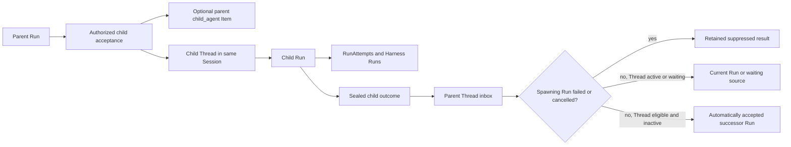
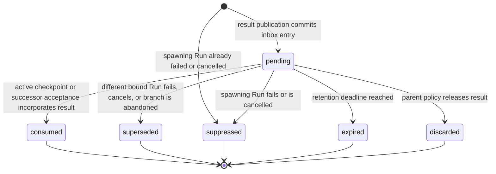

# Async Subagents

## Design Position

An asynchronous subagent is an independent child Run in its own child Thread under the same Session. It has its own RunAttempts, Harness Runs, state key, cancellation, fresh `RunBindings`, optional fixed Environment selection, coordinated use and retention, fresh ready or lazy Environment operation objects, usage, retained replay, and result delivery through the parent Thread inbox. Service exposes these complete use cases to the standard Harness async Toolset through a Host-owned `SubagentOperator`; Harness supplies the authorized child plan but owns no scheduler, child store, wake mechanism, or parent-state execution mirror. The Harness continues to own native Pydantic deferred values and blocking inline delegation; Service does not encode pending authority in `HarnessState` or reinterpret asynchronous submission as an unfinished Pydantic tool call.

Hosted Agent Revisions select this surface with `subagent_mode="async"` under [Agent Management](28-agent-management.md). The Worker installs the standard Harness `SubagentCapability` with the durable operator. Its native Harness parent context is checked separately from the durable spawning Run and Attempt authority; these Run IDs are not interchangeable. The `control` and `all` roles reconcile cooperative child cancellation, sealed-result publication, and eligible successor admission. Their bounded scans advance past deferred candidates, so one unavailable result or full inbox cannot permanently block unrelated Threads. Reconciliation is safe to repeat across replicas and restarts under the existing durable fences and uniqueness constraints. During shutdown, it stops new batches and drains its active batch within the configured deadline.

Spawning an asynchronous child never causes the spawning Run to wait for that child. The spawn tool completes with an ordinary bounded receipt, the parent Run continues independently, and it can seal as `completed`, `failed`, or `cancelled` while the child remains active. An asynchronous child result is later Host-owned Agent input. It is not waiting feedback, does not satisfy the spawn tool-call ID, and never creates `wait_reason="child_result"` or enters `DeferredToolResume`.

The spawning Run's outcome is a delivery gate, not a child-lifetime gate. A result whose `ChildRunRelationship.parent_run_id` is `failed` or `cancelled` remains retained for audit and diagnostics but is terminally `suppressed`: it is never injected into a current Run, bound to a later Run, or used to accept an automatic successor. A normally `completed` or `waiting` spawning Run does not suppress the result.

The child Thread is also an independent [Thread Trace and observability session](38-observability.md#thread-trace-and-vendor-mapping). Its RunAttempts start separate traces; bounded lineage and a best-effort span link express origin without placing child execution inside the parent Thread's trace set or vendor session.

This document owns asynchronous child acceptance, independent execution, the typed `async_subagent_result` inbox payload, active-Run delivery, inactive-Thread result handling, and their result-consumption rules. [Agent Control: Active Execution](19-agent-control-active-execution.md#thread-inbox) owns the common Thread inbox row, state-coupled active delivery, and Redis wakeup contract. [Agent Control: Input and Continuation](18-agent-control-input-and-continuation.md#deferred-interaction) independently owns upstream approval, client-tool, and structured-user-input feedback.

## Asynchronous Child Runs



The relationship and child-specific inbox payload are durable internal domain values. The common Thread inbox records delivery status without becoming a generic public inbox resource:

```python
class ChildRunRelationship:
    id: ChildRunRelationshipId
    parent_run_id: RunId
    parent_run_attempt_id: RunAttemptId
    parent_run_attempt_fence: int
    subagent_name: str
    child_run_id: RunId
    child_thread_id: ThreadId
    cancellation_policy: Literal["independent", "request_child_cancel"]
    result_visibility: Literal[
        "parent_thread",
        "session",
    ]
    created_at: datetime


class AsyncSubagentResultInboxPayload:
    schema_version: Literal["1"]
    relationship_id: ChildRunRelationshipId
    subagent_name: str
    child_thread_id: ThreadId
    child_run_id: RunId
    terminal_status: Literal["completed", "failed", "cancelled"]
    terminal_result_item_id: ItemId | None
    result_payload: BoundedSafePayload | None
    result_digest: str | None
```

`subagent_name` is the exact named edge selected from the parent Run's `EffectiveAgentConfig` and supplies stable result provenance. `cancellation_policy` can request cooperative child cancellation but never claims rollback. Delivery always targets the parent Thread; `result_visibility` only bounds whether authorized reads can expose the retained result outside that Thread within the Session. Current authorization is rechecked on every read or incorporation.

A Host-managed spawn is an ordinary completed parent tool operation. Its retained Item names the accepted child Thread and Run. It is not a deferred request, and child completion never fills the original spawn tool-call ID.

`parent_run_attempt_fence` captures the spawning RunAttempt's `fence`, not its attempt number or Worker generation. Child acceptance verifies the current parent Run and Attempt fence, reauthorizes its persisted Principal, authorizes the declared child Agent, intersects grants, selects the frozen child AgentRevision. It creates the child Thread, first Run and relationship under that same Principal. [Environment Management](29-environment-management.md#children-and-forks) owns `none`, `shared` and `dedicated` policy: shared copies the spawning Run's Environment with equal or narrower access, dedicated allocates from the frozen exact template revision, and none selects no Environment. Acceptance fixes the child Run selection and Thread default without Provider I/O or active-use acquisition; execution prepares eagerly or lazily. Parent switching never redirects an existing child. Inline children borrow the parent facade and create no durable use. The final transaction commits these facts atomically, and the bounded response comes from accepted facts without a second read. Delegate and resume admission have no idempotency identity: repeated invocations can accept distinct children; each accepted child's own Environment preparation must still recover its dispatched creation without duplication. The Worker does not become the child's product Principal. Thread advancement follows [Thread Persistence](11-thread-persistence.md).

The accepted child state stores the strictest per-field intersection of the Harness delegation plan, parent Run ceiling, and frozen edge limits; every Worker Attempt passes it into the Harness. Resume copies the selected completed child's original AgentRevision, effective configuration, connection selections, and state, while intersecting its retained ceiling with the current authorized plan. A later parent roster revision does not replace that child snapshot. Current Principal authorization and fresh scheduling recovery policy still apply.

Parent termination never silently cancels an independently continuing child and never releases the child's Environment use. The relationship explicitly owns cancellation propagation, result visibility, retention, and delivery policy. When the child leaves running, its ordinary Run transition releases acquired Environment use and updates aggregate active/idle retention under the [Environment retention policy](29-environment-management.md#retention-policy). A child that never used its lazy environment has no acquired use to release. The relationship and child Run status represent the pre-result state; Service creates no empty inbox row before the child seals.

## Result Publication

Child outcome and parent delivery advance independently. A sealed child outcome is immutable. Exact relationship identity makes result publication idempotent. In canonical order, the publication transaction locks the parent Thread and the spawning Run named by `ChildRunRelationship.parent_run_id`, then allocates the next `delivery_sequence` from the locked Thread row and inserts exactly one [`thread_inbox`](19-agent-control-active-execution.md#thread-inbox) entry with `kind="async_subagent_result"` and one `AsyncSubagentResultInboxPayload`.

Every inserted result entry stores `origin_run_id=ChildRunRelationship.parent_run_id`. If the locked spawning Run is already `failed` or `cancelled`, publication inserts the entry directly as terminal `suppressed`, leaves every delivery binding absent, sets `finalized_at`, and reserves no pending count or byte budget. Otherwise it reserves the bounded payload budget and inserts the entry as `pending`. The successful PostgreSQL commit defines the result's acceptance position relative to ordinary steer and other async results; a suppressed entry is an immutable FIFO gap, while child completion time, Redis order, and event time are never ordering authority.

For a non-suppressed result, the transaction determines the entry's initial binding from locked parent-Thread state. An `accepted` or `running` current Run becomes `target_run_id`. A current/head waiting Run, or a waiting selected head preserved behind a failed/cancelled current successor, becomes `source_waiting_run_id` with no active target. An otherwise inactive eligible Thread leaves the result temporarily unbound for automatic successor reconciliation. Publication changes neither Thread state version nor queue version. If the common pending budget is unavailable, no partial inbox row exists; bounded publication reconciliation retries while the immutable child result remains queryable under its own retention policy.



After a pending publication commits, Service best-effort appends a reconcile-Thread signal to the parent Thread's control Stream. A directly suppressed result requires no delivery wakeup. Redis delivery changes no inbox or Run state. Control replicas also perform bounded PostgreSQL reconciliation of pending asynchronous results, and active or replacement Attempt executors query their Thread inbox at the mandatory execution boundaries. Redis loss can delay the first observation but cannot indefinitely strand an eligible result while compatible control and worker capacity continues operating.

[Control Background Tasks](07-control-background-tasks.md#task-catalogue) owns periodic recovery of both sealed children missing publication evidence and pending results requiring inactive-Thread reconciliation. The scans apply this document's publication, origin suppression, binding, queue precedence, and successor-acceptance rules.

Origin sealing and result publication serialize on the same Thread and spawning-Run locks. If publication commits first, the failed or cancelled seal finds every not-yet-consumed result through the normalized `origin_run_id` access path and atomically marks it `suppressed`. If sealing commits first, publication observes the terminal origin and creates the result already suppressed. There is no post-scan insertion window that can make an ineligible result pending.

The exact result can be offered repeatedly while its inbox entry remains `pending`. Only a transaction with durable destination evidence advances it to `consumed`. A crash after process-local enqueue but before a complete state receipt can therefore cause redelivery; the model-facing projection identifies the same relationship and child Run so repeated delivery is recognizable. Once consumption commits, another Worker or successor Run never incorporates the result again.

## Delivery to an Active Run

A Thread is active when its current Run has `status="accepted"` or `status="running"`. After the delivery transaction locks and verifies that the spawning Run is not `failed` or `cancelled`, the result can be delivered to that current Run regardless of whether it is the Run that spawned the child. `ChildRunRelationship.parent_run_id` retains causal origin, while `ThreadInboxEntry.target_run_id` and later `consumed_by_run_id` record the Run that actually incorporates the result. If the origin check fails, the same transaction marks the result `suppressed` instead of enqueueing it.

For an `accepted` Run, the first Attempt executor reconciles pending delivery after claim and before the first model boundary, subject to the waiting-successor first-request barrier. For a `running` Run, its current fenced executor projects the result through Harness native enqueue as a live Agent message. This path is not the public steer command: it accepts no caller-supplied `AgentInput` and retains the asynchronous-result payload and authorization contract. It nevertheless shares ordinary steer's Thread-level `delivery_sequence`; neither kind can bypass an earlier eligible entry.

The Host uses one stable adapter to convert `AsyncSubagentResultInboxPayload` into bounded native `UserContent`. The projection identifies the subagent, terminal status, and child Run, explains that the content is a newly available asynchronous result, and asks the Agent to incorporate it into its current work. Child output remains delimited untrusted content and never becomes system instruction, identity, authority, or tool result merely because the Host delivered it.

Native enqueue is only the offer stage. The common [offer, incorporation, checkpoint, and consumption flow](19-agent-control-active-execution.md#offer-incorporation-and-durable-consumption) waits for Pydantic message incorporation, then publishes complete Run state containing both the resulting Harness messages and the inbox receipt before marking the entry `consumed` with the exact Run, state digest, and checkpoint sequence. A waiting or completed sealing transaction can perform the same consumption when its selected state candidate already contains the receipt. An eligible pending result without a receipt blocks `completed`, just like ordinary steer. It does not block `waiting`: the waiting seal atomically rolls it to the new waiting source without injecting it into deferred feedback. Failed or cancelled sealing marks a still-pending result originating from that sealing Run `suppressed`; another result merely bound to the sealing Run becomes `superseded`. The Run never enters `waiting` merely because an asynchronous result exists or is being incorporated.

## Delivery to an Inactive Thread

When the parent Thread has no `accepted` or `running` Run, Service first locks and revalidates the spawning Run. If it is `failed` or `cancelled`, the result becomes `suppressed` and none of the following routing rules applies. Otherwise Service applies these rules under the Thread's existing advancement authority:

| Current outcome      | Selected head | Result behavior                                                                                                                                     |
| -------------------- | ------------- | --------------------------------------------------------------------------------------------------------------------------------------------------- |
| `completed`          | completed     | Oldest eligible result automatically accepts an ordinary continuation; later pending delivery binds to that successor in FIFO order                 |
| `failed`/`cancelled` | completed     | Oldest eligible result automatically accepts a continuation from the preserved completed head                                                       |
| `failed`/`cancelled` | null          | No automatic result successor is eligible; a child of the terminal root lineage is suppressed by the origin gate                                    |
| `failed`/`cancelled` | waiting       | Result records the selected waiting head as source and waits for Retry or explicit branch advancement                                               |
| `waiting`            | waiting       | Result records that waiting Run as source; Feedback or waiting Continue binds it to the direct successor without resolving the deferred pending set |

Automatic acceptance uses `input_kind="async_subagent_result"`, `trigger_type="async_subagent_result"`, `trigger_entity_type="thread_inbox"`, and `trigger_entity_id` equal to the exact inbox entry ID. It stores the exact `AsyncSubagentResultInboxPayload` as the new Run's immutable accepted input and copies `authority_principal` from the result's spawning Run named by `origin_run_id`. The relationship retains that original spawning Run while the new Run's `parent_run_id` names only its selected completed same-Thread state parent. Before accepting, Service reauthorizes the copied Principal to read and continue from that selected parent and to invoke the selected Agent; a reconciliation process cannot substitute itself or another currently active user. On first execution, the same stable Host adapter used by active delivery maps that accepted payload to native `UserContent`. Acceptance supplies no caller-selected Agent, Revision, config override, Hook, Environment, or Principal. It preserves the selected continuation behavior under the ordinary compatibility rules, prepares the complete initial state and atomically copies the selected continuation Run's Environment ID/access into the new Run and Thread default, and later obtains fresh credentials, `RunBindings`, a fresh Environment operation object for the preserved logical Environment, and RunAttempt authority.

The final transaction locks the parent Thread, every relevant spawning Run, and pending entries in `delivery_sequence`; revalidates origin status, authorization, visibility, retention, Thread state version, current/head selection, payload identity, the absence of an active Run, and an empty queued-submission set; and first marks every result whose origin has become `failed` or `cancelled` as `suppressed`. It then uses only the oldest remaining eligible unbound async result to insert the `accepted` Run and select it as `current_run_id`. It marks that entry `consumed` with the new Run and checkpoint-zero state digest and binds every later eligible pending entry to the successor without changing their order. The writes commit or roll back together. If another Run becomes active first, reconciliation instead follows active-Run delivery; if a queued submission exists, it retains precedence.

An asynchronous result never bypasses an earlier [`QueuedSubmission`](20-agent-control-queued-submissions.md). When the queue is non-empty, ordinary queue consumption retains precedence. The result remains pending until the queued successor becomes `accepted` or `running`, then binds to that Run and enters through the unified FIFO. A waiting head likewise retains its upstream feedback contract: child completion neither supplies feedback nor implicitly rejects, completes, or abandons a pending approval, client tool, or structured user-input request.

When Feedback or explicit waiting Continue binds a result from a waiting source, it remains pending together with ordinary steer in `delivery_sequence`. The successor's first model request sees only its accepted deferred results and optional Continue `AgentInput`; it cannot see the async result. At the complete safe boundary after that request and any resulting tool batch, the Service-owned awaited delivery Capability queries and offers the FIFO through native enqueue. If the request yields another deferred/HITL result, the hook enqueues nothing and Service may seal waiting and roll the still-pending result to the next direct successor.

## Result Content and Retention

Result content is bounded and authorized at publication, read, and incorporation time. Larger content uses an authorized Item-owned reference under the [large-content contract](25-events-usage-and-delivery.md#large-content). Delivery never transfers the child's credentials, Environment connection or target key, live Environment adapter, private Capability state, or complete trace.

While pending, the inbox entry remains the delivery authority after the originating parent Run seals as `waiting` or `completed`, another Run advances the Thread under an owning binding rule, a Worker is replaced, or a Redis signal is lost. Origin failure or cancellation instead suppresses every not-yet-consumed result from that Run. Expiry, explicit discard, suppression, and supersession follow relationship, binding, visibility, and retention policy and never rewrite the sealed child outcome.

## Cancellation and Failure

| Condition                                                        | Outcome                                                                                                   |
| ---------------------------------------------------------------- | --------------------------------------------------------------------------------------------------------- |
| Child acceptance fails before commit                             | No child relationship, Thread, or Run commits                                                             |
| Database commit acknowledgement is lost                          | Outcome is unknown; a retry is a fresh invocation and can create another child                            |
| Child fails or is cancelled                                      | Sealed terminal status and bounded result use the same inbox contract, subject to the origin gate         |
| Parent worker is lost after child acceptance                     | Child remains durable; the relationship and later inbox entry preserve delivery                           |
| Active Run produces completed candidate before result checkpoint | Completion is blocked until the FIFO entry is consumed or finalized                                       |
| Active Run produces waiting candidate before result checkpoint   | Waiting seals and atomically rolls the result to that waiting source                                      |
| Spawning Run fails or is cancelled before consumption            | Entry becomes `suppressed`; no current or later Run can receive it and the child result remains queryable |
| Result consumption commits before the spawning Run later fails   | Entry remains `consumed` in that failed Run's history and is never delivered again                        |
| A different bound active Run fails or is cancelled               | Entry becomes `superseded`; the immutable child result remains queryable                                  |
| Active enqueue is checkpointed but DB update is lost             | State receipt reconciles the entry to `consumed`; the result is not enqueued again after reconciliation   |
| Successor acceptance outcome is unknown                          | Idempotent relational evidence determines whether the exact inbox entry and Run committed together        |
| Redis signal is lost                                             | PostgreSQL entry remains pending; Worker boundary checks or bounded control reconciliation discovers it   |

## Compatibility

The child relationship fields, `AsyncSubagentResultInboxPayload.schema_version`, `thread_inbox.kind="async_subagent_result"`, normalized `origin_run_id`, shared `delivery_sequence`, status meanings including `suppressed` and `superseded`, the origin-outcome gate, consumption evidence, child and automatic-successor authority-Principal inheritance, `Run.input_kind="async_subagent_result"`, automatic trigger correlation, active-versus-inactive selection, waiting rollover, and queue precedence are durable compatibility facts. Redis key spelling, scan cadence and batch size, consumer organization, process-local adapter class names, and prompt wording are internal when they preserve the typed provenance, untrusted-content boundary, and delivery behavior defined here.

## Invariants

01. An asynchronous child is an independent Run in an independent Thread under the same Session.
02. Spawn completes normally and never makes the parent Run wait for child completion.
03. Child acceptance, completion, Thread-inbox publication, notification, active enqueue, successor acceptance, and result consumption are separate facts.
04. An asynchronous result is Host-owned Agent input, not upstream feedback, a native deferred value, or completion of the spawn tool call.
05. A result is incorporated into the parent Thread at most once after a durable receipt; pre-checkpoint Worker loss can cause recognizable redelivery rather than silent loss.
06. A result whose spawning Run is not failed or cancelled can enter the active Thread's current Run regardless of which Run spawned the child; an eligible inactive Thread uses its oldest such result to automatically accept a new Run.
07. Async results and ordinary steer share PostgreSQL acceptance-order FIFO; child completion cannot bypass an earlier eligible delivery or queued submission.
08. A waiting Thread retains the result for its direct successor without resolving waiting feedback, and the Service-owned awaited delivery hook prevents the successor from seeing it in its first model request.
09. Failure or cancellation of the spawning Run terminally suppresses every not-yet-consumed result from its children; failure or cancellation of a different bound delivery target supersedes only that delivery attempt. Neither outcome implies rollback of effects.
10. Child acceptance pins the exact child AgentRevision without resolving mutable Agent state after acceptance.
11. Retry copies terminal intent and eligible parent state but never re-enables, rebinds, or consumes a result suppressed by the failed or cancelled source; a retry that needs child work creates a new child relationship under the retry Run.
12. An asynchronous child inherits its parent Run's authority Principal. An automatic inactive-Thread successor inherits the spawning Run's authority Principal, and both paths reauthorize that persisted Principal rather than executing as a Worker or reconciliation actor.
13. Each independent child acquires Environment use under its preparation policy; none/inline children add no independent use, and parent termination or switching does not release the child's active use. Waiting children follow the Environment's aggregate idle retention policy.

## Memory Behavior Inheritance

Child acceptance copies the parent's [Memory selection and binding](42-memory.md#execution-memory-selection) atomically with the child relationship. Resuming a retained child copies that child's source binding; automatic parent result successors inherit the selected parent. Inline reconstruction uses the same prepared behavior. No path transports Bot DTOs or chooses behavior from absence of an application row. Fresh Agent/Attempt authority is still checked at operation time.
