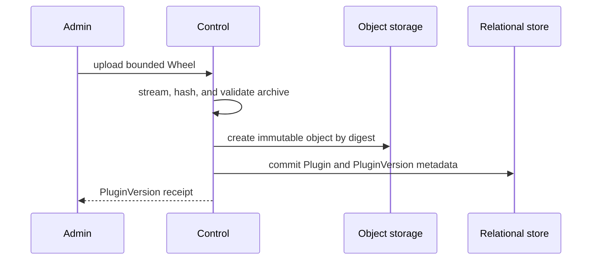

# Managed Harness Plugins and Runtime

## Design Position

Service manages trusted Harness plugins through stable `Plugin` resources, immutable `PluginVersion` Wheels, explicit Agent selections, and one deployment-fixed Runtime profile. This document owns their public identity, lifecycle, commands, artifact validation, Runtime locks, Worker materialization, and execution-profile behavior. [Agent Management](28-agent-management.md) embeds the Plugin selections and exact resolved locks owned here into `AgentConfig` and `AgentRevision`.

Every deployment fixes one `plugin_runtime.mode` before it stores Plugin, AgentRevision, or Run data:

- `on_demand` is the default. AgentRevision locks exact PluginVersions, and each Worker imports compatible Plugin artifacts into its own interpreter before claiming a Run. A conflicting Worker declines the Run and leaves it eligible.
- `runner` uses one deployment-wide active PluginVersion catalog as the resolution source for future Agent Revision creation and runner Plugin overrides. Stable Worker Supervisors stage clean lock-scoped Runner children and atomically cut over after every serviceable Worker is ready.

Both profiles persist immutable Runtime locks and every accepted Run pins one exact lock digest. Neither profile unloads, reloads, silently substitutes, or interprets caller-supplied Python targets. The profiles intentionally have different PluginVersion selection and availability guarantees; mode is not an implementation-private optimization.

## Boundaries

| Concern                                                                  | Owner                                                               | Contract                                                                     |
| ------------------------------------------------------------------------ | ------------------------------------------------------------------- | ---------------------------------------------------------------------------- |
| Plugin identity, Version, Agent selection, lifecycle, and commands       | This document                                                       | Defines the product, HTTP-visible, and trusted-code deployment behavior      |
| Agent identity, Revision creation, and effective configuration           | [Agent Management](28-agent-management.md)                          | Embeds exact Plugin selections and resolved locks without owning their model |
| Runtime mode initialization and process lifecycle                        | [Runtime Configuration](01-runtime-configuration-and-deployment.md) | Fixes one durable deployment profile and owns readiness, drain, and shutdown |
| Wheel shape, digest, Runtime lock, and artifact retention                | This document                                                       | Makes exact trusted Plugin environments identifiable and verifiable          |
| On-demand registry, import preflight, and conflict behavior              | This document                                                       | Keeps incompatible work unclaimed without another routing authority          |
| Runner materialization, staging, cutover, and drain                      | This document                                                       | Replaces Python interpreters without replacing the Worker container          |
| Plugin factory, configuration, construction, and Capability contribution | [Harness plugin system](../a13n-harness/05-plugin-system.md)        | Builds fresh plugin instances from an explicitly selected catalog            |
| Run acceptance and exact lock-digest persistence                         | [Durable Run State](12-run-persistence.md)                          | Pins one Runtime with one accepted Agent Revision                            |
| Run claim, lease, fence, and recovery                                    | [Run Attempt scheduling](13-run-attempt-scheduling-and-recovery.md) | Applies the profile-specific pre-claim compatibility gate                    |
| Relational and object capabilities                                       | [Service storage](03-storage.md)                                    | Supplies metadata authority and immutable artifact bytes                     |

`PluginRuntime` means the Python, Harness, Pydantic AI, Plugin Wheels, and third-party distributions selected by one Runtime lock. It contains no Prompt, Secret value, Run state, Agent work files, shell workspace, browser, or Agent `Environment`.

Plugin code executes with Worker authority in both profiles. A Runner supports interpreter replacement and fault containment; it is not a security sandbox. A deployment that does not trust Plugin code must place the complete Worker outside the trust boundary.

## Plugin Resource Model

A `Plugin` is one stable deployment-level trusted-code identity. A `PluginVersion` is one immutable release of that identity backed by exactly one standard Python Wheel. The following schema is conceptual:

```python
type PluginSource = Literal["builtin", "uploaded"]
class Plugin:
    id: PluginId
    source: PluginSource
    plugin_key: str
    distribution_name: str
    top_level_package: str
    active_version_id: PluginVersionId | None
    archived_at: datetime | None
    created_at: datetime
    updated_at: datetime


class PluginVersion:
    id: PluginVersionId
    plugin_id: PluginId
    version: str
    content_digest: str
    artifact_ref: ObjectRef
    requires_dist: tuple[str, ...]
    status: Literal["ready"]
```

The first successful upload establishes the stable `plugin_key`, normalized distribution name, and top-level package and creates the first PluginVersion atomically. Later uploads target that Plugin. `PluginVersion.version` is the normalized PEP 440 version from Wheel metadata, and `(plugin_id, version)` is unique.

`active_version_id` is meaningful only in `runner`; it remains null in `on_demand`, where Agents select exact PluginVersions without a global deployment head. Upload never changes it in either profile.

Built-in and uploaded Plugins use the same keys, Versions, Agent selection, and Runtime behavior. A release manifest registers each built-in identity, exact package version, digest, and whether the Plugin is required or administratively deactivatable. Built-in keys are reserved, uploaded artifacts cannot replace them, and built-in Plugins cannot be uploaded or archived.

## Deployment Mode Contract

The effective configuration contains:

```toml
[plugin_runtime]
mode = "on_demand" # or "runner"
```

Omitting `mode` selects `on_demand`. Control persists the selected mode as an internal compatibility fact and may replace it only while no Plugin, AgentRevision, or Run exists. Every Control, Worker, and all-in-one process verifies the same value before readiness. A non-empty configuration mismatch fails startup; the service never reinterprets stored Agent Revisions under another profile.

Changing the persisted mode after any Plugin, AgentRevision, or Run exists is not a configuration update. Service exposes no mode mutation or migration API. A migration between profiles requires a separately reviewed data migration that translates retained Agent configs into new Revisions, establishes their current selections and the runner active set when applicable, and preserves every retained Run lock.

## Agent Selection and Revision Locking

`AgentConfig.plugins` and the corresponding typed Run override use the following conceptual selection contract:

```python
class OnDemandPluginSelection:
    instance_name: str
    plugin_version_id: PluginVersionId
    config: JsonObject


class RunnerPluginSelection:
    instance_name: str
    plugin_key: str
    config: JsonObject


type PluginSelection = OnDemandPluginSelection | RunnerPluginSelection


class ResolvedPluginVersion:
    instance_name: str
    plugin_id: PluginId
    plugin_version_id: PluginVersionId
    plugin_key: str
    distribution_name: str
    distribution_version: str
    top_level_package: str
    wheel_digest: str
    config: JsonObject
```

The Plugin list is ordered and `instance_name` is unique within one effective Agent configuration. Several instances may select the same Plugin key or Version with different bounded JSON `config`; omission means the Plugin is not configured. Service exposes no second Capability list, enable-flag document, version-binding map, arbitrary import target, or raw Capability upload format.

The deployment's fixed mode determines which selection variant is legal. In `on_demand`, every entry selects one exact authorized `plugin_version_id`. In `runner`, every entry selects one stable `plugin_key`, and Revision creation resolves it through the then-active catalog. Revision creation validates the complete root and child graph, freezes one `ResolvedPluginVersion` for every configured instance, and persists one exact Runtime lock digest. A later upload, archive, activation, or deactivation never rewrites an existing AgentRevision or accepted Run.

Service supplies the ordered resolved instances to the Harness Plugin factory. A factory may contribute ordinary Pydantic AI Capabilities, Hooks, middleware, or Toolsets through the [Harness Plugin System](../a13n-harness/05-plugin-system.md), but those process-local products are not Service management resources or generic Agent configuration fields.

## Plugin Wheel Contract

One `PluginVersion` contains exactly one standards-conforming `.whl` artifact. The Wheel contains exactly one entry in the `a13n_harness.plugins` entry-point group. Its entry-point name equals the stable `plugin_key`; its target is derived from verified Wheel metadata and is never supplied through an Agent config, Run, queue message, or execution field.

The Wheel contains one unique top-level Python package. Its normalized name must match the stable `top_level_package` established by the Plugin's first Version; another Plugin cannot claim the same package.

The Wheel's normalized distribution name remains stable across every Version of one Plugin. Its PEP 440 `Version` supplies `PluginVersion.version`. The platform-generated PluginVersion ID, normalized package version, and full-byte content digest are distinct identities.

Uploading the same Plugin and normalized package version with the same digest is idempotent and returns the existing Version. Reusing that version with different bytes fails with `plugin_version_conflict`. A corrected artifact uses another package version; no upload overwrites an immutable Version.

Service rejects:

- a raw `.py` file or custom ZIP plugin format;
- a missing or second Harness Plugin entry point;
- a missing, second, or conflicting top-level Python package;
- another Agent Foundation extension entry-point group in the same Wheel;
- a distribution name or plugin key that conflicts with an existing stable Plugin;
- an entry-point target outside the Wheel's declared import packages;
- malformed, encrypted, duplicated, linked, absolute, or parent-traversing archive members;
- invalid or inconsistent `WHEEL`, `METADATA`, `entry_points.txt`, or `RECORD` data; and
- compressed or expanded content outside the configured bounded upload limits.

The service streams upload bytes while enforcing the compressed limit and computing the digest. Archive validation performs no Plugin import, package-index lookup, dependency installation, or source build. Passing validation proves package structure and integrity, not code safety or profile eligibility.

## Artifact Publication and Retention

Upload follows the external-I/O boundary from [Durable Operations and Outbox](06-durable-operations-and-outbox.md):



No relational session or transaction spans request streaming, archive inspection, package-index access, or object-store I/O. Objects are create-only and addressed internally by digest. A retry reconciles an existing object and Version by identity and digest. A failed upload creates no PluginVersion; staged unreferenced bytes are safe reconciliation and garbage-collection candidates.

The authoritative store retains:

- every successful PluginVersion Wheel;
- every dependency artifact selected by a retained runner Runtime lock;
- each canonical Runtime lock manifest and digest;
- the runner active lock and active PluginVersion pointers when that profile is selected;
- bounded runner command receipts and audit facts; and
- all artifacts required by a retained Agent Revision or non-terminal Run.

Worker-local files are derived cache only. Plugin Archive, runner Deactivate, Agent Revision creation, process exit, or local eviction never deletes authoritative artifacts required to reconstruct retained work.

## Runtime Lock

A Runtime lock is an internal canonical manifest identified by a digest over its complete normalized representation. It is not exposed through Create, List, Patch, Delete, or direct selection APIs.

The conceptual manifest contains:

```python
type PluginRuntimeMode = Literal["on_demand", "runner"]
type DistributionSource = Literal["worker_release", "artifact"]


class LockedDistribution:
    distribution_name: str
    version: str
    source: DistributionSource
    artifact_digest: str | None
    artifact_ref: ObjectRef | None


class LockedPlugin:
    plugin_id: str
    plugin_version_id: str
    plugin_key: str
    distribution_name: str
    version: str
    top_level_package: str
    wheel_digest: str


class PluginRuntimeLock:
    schema_version: str
    mode: PluginRuntimeMode
    runtime_target: RuntimeTarget
    worker_release: str
    harness_version: str
    plugins: tuple[LockedPlugin, ...]
    distributions: tuple[LockedDistribution, ...]
    digest: str
```

The digest covers the profile, exact Runtime target, Worker release identity, Harness version, Plugin locks, distribution sources, versions, and artifact digests. One deployment has one homogeneous target containing Python implementation and minor version, operating system, CPU architecture, and Wheel ABI. The initial contract does not mix heterogeneous Worker targets.

`PluginRuntimeLock.worker_release` is the immutable dependency baseline used to resolve distributions and reconstruct this lock. It does not identify the Worker process that happens to execute a Run. The latter is recorded on each RunAttempt as `worker_build_id`, derived from the actual a13n Service artifact. A compatible newer build can execute a historical lock only when it still supplies or materializes every distribution and codec required by that exact lock; it never rewrites `worker_release` to its own build identity.

An `on_demand` Agent Revision creation builds the lock from the complete resolved Agent and subagent graph. Every selected PluginVersion must be a compatible pure-Python Wheel. Every declared dependency must already exist at a compatible exact version in the reviewed Worker release manifest and is recorded with `source=worker_release`; Revision creation never queries a package index. A Plugin top-level package cannot collide with the standard library or a package owned by that Worker release. Conflicting plugin keys, distributions, top-level packages, or dependency requirements reject Revision creation.

A `runner` Activate jointly resolves every active PluginVersion plus the candidate. Operator-configured public or private package indexes may supply third-party dependency Wheels. Requirements cannot use direct URLs, Git or other VCS references, local paths, or arbitrary remote Wheel URLs. Service, Harness, Pydantic AI, and other platform-owned distributions are fixed by the service release and cannot be upgraded or downgraded by Plugin requirements.

The current runner lock is the preferred solution. A new activation preserves every locked distribution that still satisfies all constraints and changes only the necessary packages. Re-activating the active PluginVersion is idempotent and does not query indexes. Service exposes no command that changes dependencies without an explicit PluginVersion activation or deactivation.

## On-demand Agent Selection

An `on_demand` AgentConfig submitted for Revision creation supplies an exact `plugin_version_id` binding for every configured Plugin instance. Several instances may select one Version. Revision creation rejects a missing, duplicate, inaccessible, archived, key-mismatched, structurally incompatible, or dependency-ineligible Version.

Revision creation resolves the complete transitive subagent graph, verifies one compatible Plugin set, persists its Runtime lock, and stores the exact PluginVersion locks plus lock digest on the immutable AgentRevision. Later Plugin uploads or archives do not mutate that Revision. New Run acceptance copies its lock digest; Worker claim never resolves `latest`, a Plugin head, or another Revision.

`on_demand` has no global Plugin active set. Upload changes no Worker and no Agent. Activate and Deactivate have no successful semantics in this profile, create no receipt, and return `plugin_runtime_mode_unsupported` through the stable command routes.

## On-demand Worker Loading

Every non-draining on-demand Worker periodically scans all eligible Runs. Before claiming one, it reads the exact Run lock and checks a process-local monotonic registry containing verified loaded provenance by plugin key, distribution, and top-level package.

For each required Plugin, the Worker:

1. reuses loaded provenance when the exact PluginVersion and digest match;
2. declines the Run without claiming when an imported plugin key, distribution, or top-level package conflicts;
3. otherwise downloads the authoritative Wheel to a confined content-addressed cache and revalidates its digest and package shape;
4. verifies every `worker_release` dependency against the running process;
5. publishes the extracted package and metadata root atomically to the dedicated import path;
6. invalidates import caches, discovers the exact entry point, and verifies factory provenance; and
7. records the immutable loaded provenance before Agent construction.

The Worker derives import targets only from verified Wheel entry points. It never imports a module path from Agent config, Run data, queue data, or an API field. After preflight succeeds, it claims the Run under the ordinary short transactional lease and fence contract. Agent-specific plugin construction occurs after claim and uses fresh Plugin instances for each reconstructed Agent definition.

The registry is process-local, monotonic, and cleared by process exit. It is not stored in PostgreSQL, Redis, object storage, telemetry, or a routing table. If import or factory validation fails after import-path publication, the Worker becomes unready and exits; it never continues serving from a partially imported interpreter. Because preflight precedes claim, the Run remains durable and unclaimed.

One Worker can accumulate compatible distinct plugin keys. It cannot serve two locks that require conflicting versions of the same key, distribution, or top-level package. Other clean Worker interpreters may load those locks independently. If all Workers conflict, the Run remains eligible until compatible capacity appears or a Worker is externally replaced. A single-Worker deployment has no finite service guarantee for such a conflict.

## Runner Dependency Resolution

Runner Activate resolves every active PluginVersion and the candidate as one set. An incompatible platform requirement fails with `plugin_platform_incompatible`; an unsatisfiable joint set fails with `plugin_dependency_conflict`; a missing target artifact fails with `plugin_runtime_incompatible`. Universal Wheels can satisfy compatible targets, while native Wheels must match the deployment target.

Control persists the complete candidate lock and all dependency artifacts before Worker staging. Activate validates that the candidate catalog can be resolved, materialized, imported, and started on every serviceable Worker; it does not reinterpret any created Agent Revision. Future Revision creation or a runner Plugin override resolves against the new catalog and performs its own complete Agent-build validation. Workers never query package indexes or solve dependencies while starting a Runner or claiming work. Activating a historical immutable PluginVersion is the explicit rollback path for that Plugin.

## Worker Supervisor and Runner

In `runner`, one Worker container contains a stable Supervisor and one or more long-lived Runner child processes:

```text
Worker container
└── Worker Supervisor
    ├── Environment maintenance (deployment-selected Providers)
    ├── Runner(active lock): execution loop + executor tasks
    ├── Runner(draining old lock): existing executor tasks only
    └── Runner(candidate lock during staging): claim-gated loops
```

The Supervisor imports no Harness Plugin, Plugin dependency, or candidate Runtime path. It owns bounded process startup, liveness observation, claim gating, drain, shutdown, and exit handling. The Supervisor-to-Runner protocol carries lifecycle control only; Harness execution does not become a remote Plugin or Agent RPC contract.

Each Runner starts in a clean Python interpreter from exactly one materialized lock. It owns one ordinary `WorkerExecutionLoop` for compatible Run work: periodic scan, exact-lock preflight, bounded local executor-capacity reservation, claim, and takeover. Each successful Run claim starts exactly one `RunAttemptExecutor` async task in that Runner, not another OS thread. Environment maintenance belongs to the Worker process independently of this Plugin lock and consumes no Agent execution slot. The executor owns lease renewal, control watching, fenced persistence, Agent reconstruction, Harness execution, and event production, and creates fresh Plugin instances for every reconstructed Agent definition. It never shares a concrete Plugin instance between definitions or executors.

The Runner derives imports only from verified lock entry points. It verifies every artifact digest before publishing the immutable directory to the child process. It never unloads, reloads, or replaces modules in a live interpreter and never renames arbitrary Wheel modules or installs a custom multi-version importer.

## Runner Activation and Cutover

Activate and Deactivate use the same staging flow:

```mermaid
sequenceDiagram
    participant Admin
    participant Control
    participant W1 as Worker Supervisor 1
    participant W2 as Worker Supervisor 2

    Admin->>Control: command with Idempotency-Key
    Control-->>Admin: running receipt
    Control->>Control: resolve and persist candidate lock
    par stage every serviceable Worker
        Control->>W1: stage candidate lock
        W1->>W1: materialize and start gated Runner
        W1-->>Control: staged
    and
        Control->>W2: stage candidate lock
        W2->>W2: materialize and start gated Runner
        W2-->>Control: staged
    end
    Control->>Control: atomically commit active Plugin pointers and lock digest
    Control->>W1: activate candidate; retain old lock service
    Control->>W2: activate candidate; retain old lock service
    W1-->>Control: cutover observed
    W2-->>Control: cutover observed
    Control-->>Admin: succeeded receipt
```

While staging, the old active lock continues accepting all new work and candidate Runners claim nothing. Command acceptance captures registered, non-draining Workers whose operational liveness lease is current. This internal membership is not a product resource. Every captured Worker must stage the candidate before one atomic control-plane commit changes the active Plugin pointers and active lock digest.

A captured Worker that disappears before commit fails the command. A Worker that registers or rejoins during staging remains outside the serviceable set and cannot claim work until the command settles; after success it materializes the new active lock, and after failure it materializes the unchanged lock. An offline Worker is not serviceable until it materializes the then-current active lock.

If any serviceable Worker fails staging, the command fails, candidate Runners exit, and the old selection remains active. After commit, future runner key resolution uses the new catalog. Existing Revisions, Runs that inherit them, and exact historical-Revision Runs retain their frozen locks. The receipt becomes `succeeded` only after every still-serviceable staged Supervisor observes the commit and enables its candidate Runner.

An old Runner remains eligible for accepted and newly accepted work whose frozen Revision requires its exact lock; Activate alone does not put it into drain. The Supervisor may retire it later when no eligible or executing Run work needs the lock, and can reconstruct the same lock on demand if eligible Run work appears again.

If capacity policy retires a Runner while it still owns Attempts or target leases, it gates both claim loops and requests graceful handoff on each active executor's process-local control gate under the common contract. Each executor continues heartbeat and lease renewal while it reaches a complete Harness safe boundary, persists ordinary `state.json`, closes local Runtime resources, and commits `yield_reason="runner_rotation"`. An in-flight keepalive may finish within the drain deadline; otherwise its renewal stops and takeover waits for target-lease expiry. A successor reconstructs the exact Run- or source-binding-pinned historical lock; the current active lock is never substituted. Insufficient local capacity fails a later runtime command without terminating existing Attempts or keepalive calls.

A staged Worker that loses its liveness lease after commit leaves the serviceable set and cannot reverse cutover. On rejoin it reconstructs the committed active lock before claim. An active Runner crash causes the Supervisor to reconstruct the same lock and never silently roll back.

## Run Pinning and Historical Reconstruction

In both profiles, the selected AgentRevision already owns an immutable Runtime lock digest. A runner Plugin override is resolved and frozen before Run acceptance commits. The Run copies the resulting exact digest, and a RunAttempt never replaces it with another lock.

An on-demand Worker preflights the Plugin lock before Run claim. A Runner scans only Runs whose digest equals its own. The Supervisor can materialize an eligible historical Run lock on demand. Waiting Runs alone keep no Runner resident. Environment maintenance, including idle retention during approval waiting and stopped-target deletion, uses deployment-selected Provider implementations in the Worker and never keeps a Plugin-lock Runner alive. A later resumed Run again requires a compatible Worker or Runner.

Claim-time code performs no package-index access or dependency solving. Missing artifacts, digest mismatch, target mismatch, dependency mismatch, import failure, or factory validation failure prevents claim or Harness entry without substituting another PluginVersion. A retained on-demand Run can become unserviceable after an incompatible Worker image upgrade; the deployment must retain or restore a Worker release compatible with the Run lock.

Planned handoff changes only the Attempt and Harness Run generation. Recovery preflight reads the same latest complete Run state and exact lock digest. A different `worker_build_id` receives scheduling preference only after all Runtime-target, Harness, Plugin, Skill, Environment Provider/state compatibility and host-affinity, state-schema, codec, and artifact checks pass; build difference cannot make an incompatible historical lock serviceable.

## Worker Cache

Each Worker owns a confined content-addressed cache with a configured byte budget. Downloads use temporary locations and publish verified artifacts and materialized directories atomically.

An imported on-demand artifact is pinned for that process lifetime because another loaded module may import it later. A live Runner pins its materialized directory and artifacts. Eviction removes only entries unused by the on-demand registry and every local Runner. Cache loss never changes Plugin state, a Agent lock, the runner active lock, or a Run's pinned digest.

## Plugin Lifecycle and Retention

Archive and Unarchive manage the stable Plugin resource without changing immutable PluginVersions. Archive blocks later upload and new Agent selection, hides the Plugin from default management collections, and blocks runner-profile activation. It does not invalidate retained AgentRevisions or accepted Runs. Only an inactive uploaded Plugin can be archived. Unarchive restores an inactive manageable Plugin and never activates a Version.

Deactivate exists only in `runner`. It removes the key from future active-key resolution, builds a candidate lock without that Plugin, and uses the ordinary all-Worker staging flow. Created Revisions and accepted Runs retain exact reconstructible locks, so default or historical Revision references do not block the command. Accepted Runs pinned to an older lock continue or resume through a Runner for that lock. Successful cutover clears `active_version_id` and never mutates or deletes a PluginVersion.

`on_demand` has no successful Activate or Deactivate operation. Its exact Agent bindings make a global active pointer unnecessary; Archive is its only Plugin availability lifecycle command.

Plugin, PluginVersion, every successful Wheel, bounded runner task receipt evidence, and every Runtime lock referenced by an AgentRevision or accepted Run are retained. None exposes hard delete or Version overwrite. A Runner may exit when its lock is not needed, and Worker-local materialization may be evicted when unused, but authoritative artifacts remain reconstructible. Failed upload creates no PluginVersion.

## Plugin Management API

The Plugin `/api/v1` routes are cataloged by [Management API](16-management-api.md). List and Get authorize `plugin.read`; upload, Archive, and Unarchive authorize `plugin.manage`; runner-profile Activate and Deactivate authorize `plugin.runtime.manage`. The IAM [stable action registry](33-identity-and-access-management.md#stable-action-registry) owns role grants.

Upload creates or returns one immutable PluginVersion synchronously. Archive and Unarchive return the committed Plugin. Clients cannot directly write `source`, `plugin_key`, package identity, `active_version_id`, `archived_at`, Version content, digests, or audit fields.

Runner-profile Activate and Deactivate return this conceptual minimal asynchronous receipt because completion depends on artifact resolution and every serviceable Worker:

```python
type PluginTaskStatus = Literal["running", "succeeded", "failed"]


class PluginTaskReceipt:
    operation_id: str
    status: PluginTaskStatus
    result_refs: tuple[ResourceRef, ...]
    error: SafeFailure | None
```

An accepted command returns `202` with `operation_id` and `status="running"`. `GET /api/v1/operations/{operation_id}` returns only a receipt previously obtained by the authorized caller. A running receipt has no results or error; a failed receipt has one bounded safe error and no results; a succeeded receipt has no error and identifies the resulting Plugin and active Version resources. Service exposes no Operation collection, Patch, Delete, dependency graph, or independently mutable Operation lifecycle. Every command requires `Idempotency-Key`; replaying the same command returns the same receipt identity.

The route catalog is stable across modes. In `on_demand`, Activate and Deactivate return `409 plugin_runtime_mode_unsupported` before dispatch and create no receipt. In `runner`, a runtime command never reports `succeeded` before atomic cutover.

## Failure Semantics

| Failure                                                         | Observable outcome                                                                              |
| --------------------------------------------------------------- | ----------------------------------------------------------------------------------------------- |
| Upload exceeds a bound or Wheel validation fails                | No PluginVersion is created                                                                     |
| Object publication succeeds but relational commit is unknown    | Retry reconciles by identity and digest                                                         |
| Package identity or same-version digest conflicts               | Upload fails; existing immutable identity remains authoritative                                 |
| On-demand Agent selects absent Worker dependency                | Revision creation fails; no AgentRevision or Runtime lock is created                            |
| On-demand Worker already imported a conflicting Version         | Worker declines before claim; Run remains eligible for compatible or replacement capacity       |
| On-demand import or factory verification fails after path use   | Worker becomes unready and exits; Run remains unclaimed                                         |
| Runner dependency resolution or compatibility fails             | Task receipt fails; old Plugin pointers and lock remain active                                  |
| Any serviceable Worker cannot stage a runner candidate          | Task receipt fails; candidate Runners exit and old lock remains active                          |
| Agent-specific Plugin construction fails                        | Claimed Attempt fails before Harness execution under the reconstruction contract                |
| Local cache lacks evictable capacity                            | Preflight or staging fails without deleting a pinned or authoritative artifact                  |
| Historical lock artifact or compatible Worker release is absent | Affected Run remains unserviceable or fails closed; another PluginVersion is never substituted  |
| Runner rotation reaches a safe boundary                         | Attempt commits `yielded`; a fresh Runner and Harness Run resume the same pinned lock and state |
| Forced process or container shutdown interrupts active work     | Renewal stops at the drain deadline; only actual lease expiry enables ordinary recovery         |

Normal API and logs expose only bounded safe codes and identities. They never expose package-index credentials, raw resolver output, Wheel content, Plugin configuration, import traceback, private paths, or arbitrary exception text.

## Security and Compatibility

Plugin Upload, Archive, and runner runtime commands are executable-code deployment authority. Agent input, model output, Plugin configuration, identifier possession, and Agent editing never grant it. In the singleton-Organization OSS distribution, effective Organization Admin authority supplies that permission. A multi-Organization distribution supplies a separate operator boundary and never lets an ordinary Organization Admin change shared code. A caller authorized to create an on-demand Agent Revision may select an allowed retained PluginVersion but cannot publish or retire Python bytes; Agent editors cannot Activate or Deactivate the runner catalog.

Stable Plugin identity, immutable PluginVersion identity, full-byte digest, one-plugin entry-point shape, Runtime lock schema, deployment mode, and Run lock pinning are compatibility facts. On-demand conflict-before-claim and runner all-serviceable-Worker cutover are profile-specific compatibility facts. Cache layout, local directory names, process-control transport, resolver implementation, and object-key layout remain implementation-private when they preserve those contracts.

## Trade-offs

`on_demand` keeps the default Worker topology small and permits different Agents to lock different PluginVersions. It cannot add third-party distributions outside the reviewed Worker release, and a process that imported one Version cannot serve conflicting work. Multiple clean Workers can coexist, but a single-Worker deployment may require external replacement and provides no bounded liveness for conflicts.

`runner` supports package-index dependencies, deterministic deployment-wide activation, historical lock reconstruction, and online interpreter replacement. It costs additional processes, memory, artifact retention, and an all-serviceable-Worker staging protocol. Its active Plugin set must have one jointly solvable dependency environment.

## Invariants

01. One deployment durably fixes exactly one Plugin Runtime mode; omitted configuration selects `on_demand`.
02. One PluginVersion owns one immutable standard Wheel, exactly one Harness Plugin entry point, and one unique top-level Python package.
03. One Plugin identity owns one plugin key, normalized distribution name, and top-level package for all Versions.
04. One distribution name and version denotes one content digest.
05. Runtime locks are immutable internal manifests and are not public management resources.
06. Every accepted Run pins one exact Runtime lock digest in addition to one exact AgentRevision.
07. A RunAttempt never substitutes a current, active, latest, or otherwise available Runtime for its Run's pinned lock.
08. `on_demand` Agent Revision creation locks exact PluginVersions and uses only dependencies already supplied by the Worker release.
09. An on-demand Worker declines conflicting work before claim; its process-local loaded registry is never durable authority.
10. `runner` Activate succeeds only after every serviceable Worker stages the candidate and one atomic cutover commits it; future Revision creation or Plugin override resolves that catalog and freezes another exact Runtime lock.
11. The runner Supervisor imports no Plugin code; every Runner starts from one exact lock in a clean interpreter.
12. Old Runners remain eligible for work pinned to their exact historical locks; retirement and Runner failure never cause implicit lock substitution or rollback.
13. Neither profile unloads, reloads, or replaces Python modules in a live interpreter.
14. Archive, Deactivate, process exit, and cache eviction never delete artifacts required by a retained Revision or Run.
15. Plugin code executes with Worker authority; neither profile creates a security sandbox.
16. `PluginRuntimeLock.worker_release` is a pinned dependency baseline and is never reinterpreted as the actual `worker_build_id` of an executing process.
17. Runner rotation uses the common graceful-yield boundary while preserving lease renewal until commit or deadline and preserving the exact Run-pinned Runtime lock on its successor.
18. `Plugin` and `PluginVersion` are the only managed Harness Plugin resources; Versions are immutable, and neither resource exposes hard delete or Version overwrite.
19. Plugin selection is explicit: on-demand authoring selects exact authorized PluginVersions, runner authoring selects active keys, and Revision creation freezes exact PluginVersions in both modes.
20. A due Environment keepalive can materialize or retain the exact source-binding-compatible Runner, but target work remains separately capacity-bounded and never consumes a Run executor slot.
21. Activate changes only future runner key resolution and never rewrites an AgentRevision or accepted Run; adopting another active Version requires another Revision or Run override acceptance.
22. Runtime commands succeed only in `runner`; `on_demand` returns `plugin_runtime_mode_unsupported` before dispatch and creates no task receipt.
