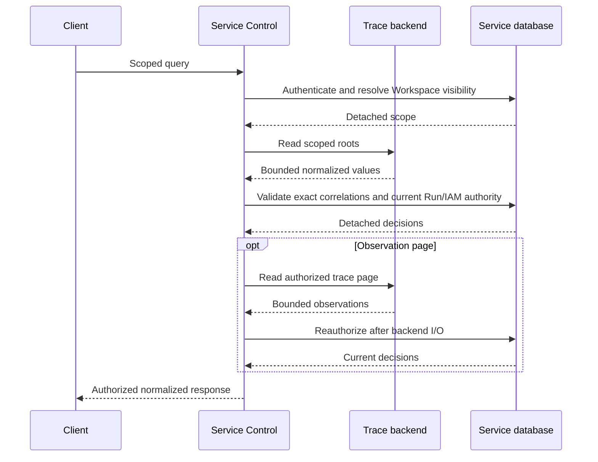

# Trace Query

## Design Position

a13n Service exposes an authorized, provider-neutral read boundary for RunAttempt traces. It is a thin adapter over one selected telemetry backend, not a trace store, analytics engine, usage ledger, or execution-status projection. The [OTel producer and exporter](38-observability.md) owns writes and topology; the backend owns storage, indexing, retention, and deletion. OTLP is not a query protocol: adapters use documented public read APIs.

Service persists no trace, observation, provider cursor, search index, or archive. Query configuration and failures never change Agent execution, tracing, content policy, readiness, durable usage, or RunAttempt outcomes. Browser clients own tree/timeline and content presentation without altering the normalized API values. A UI may sum reported observation-local costs for display, with explicit loaded-page and missing-value scope; this is not a Service aggregation or completeness contract.

## Read Model

The conceptual resource relationship is:

```python
class Trace:
    id: str
    provider: str
    correlation: TraceCorrelation
    root: Observation
    source_url: str | None

class Observation:
    id: str
    parent_id: str | None
    type: str
    # Reported timing, status, diagnostics, model identity, usage, and content.
```

These are normalized ephemeral values, not independently persisted Service resources. OpenAPI owns the serialized field definitions. The same Observation model describes the actual Service root, agents, generations, tools, and other phases. Trace has no duplicate root fields or trace-wide model set, usage, cost, duration, observation count, error rollup, or reconstructed output. Root-local metrics remain root-local. Durable attempt number, outcome, and business output stay in the existing [Run and RunAttempt APIs](16-management-api.md).

Trace correlation groups the seven validated Organization, Workspace, Session, Thread, Run, RunAttempt, and Agent identifiers. Backend IDs are opaque telemetry identifiers, not Service object IDs. The root is the physical parentless `a13n.service.run_attempt` observation; a backend logical-root flag is not sufficient. Exact lookup rejects ambiguous multiple roots. The observation collection includes that same root identity. Clients combine by ID, never synthesize a second root, assume parents arrive first, or reparent an orphan. Missing parents can be on another page or absent from retained telemetry.

### Value Semantics

- Operation `type` is an open string. Preserve backend semantic categories, including unfamiliar values; storage record kind and OTel SpanKind are not operation categories.
- Nullable `status` represents recoverable explicit OTel span status. UNSET is not absence, and an end timestamp is not evidence of OK. Backend `level` and `status_message` remain separate diagnostic information. Child failures do not determine root or durable Attempt success.
- Requested and response model names remain distinct and are not Service model IDs. An ambiguous vendor model label remains a namespaced diagnostic attribute rather than a fabricated request or response identity.
- Usage preserves the backend's observation-local reported dictionary, including zeros, empty maps, and native detail/total keys. No summing, rounding, pricing, or replacement of reported totals occurs. Optional USD cost is backend-reported and serialized as a decimal string, not inferred or treated as a bill.
- Content carries a nullable media type and JSON-compatible value. Outer null means unavailable; a reported JSON null can be a present Content value. Decode strings only when an explicit media type or established producer schema identifies serialized JSON. Preserve role/part structure and admitted references without reconstructing omitted bodies or fetching media.
- Span attributes, resource attributes, and instrumentation scope remain separate namespaces. Normalize known container encodings, not arbitrary dotted attribute names. There is no vendor-response escape hatch, HTTP header passthrough, or administrative metadata dump.
- Optional attached events and links retain sequence and duplicates. Null means unavailable; an empty array means known empty. Links are references, not read authority. Standalone logs and copied event rows are not manufactured observations.

Null end time, cost, usage, content, or status never means zero, success, running execution, or a particular capture policy. Backend loss cannot be repaired by copying a generation's output to the root or reconstructing events from error prose.

## Public Reads

All routes are authenticated and Workspace-scoped:

| Operation             | Route                                                               | Response                                                         |
| --------------------- | ------------------------------------------------------------------- | ---------------------------------------------------------------- |
| List traces           | `GET /api/v1/workspaces/{workspace}/traces`                         | Trace collection                                                 |
| Read trace root       | `GET /api/v1/workspaces/{workspace}/traces/{trace_id}`              | Direct Trace                                                     |
| List observations     | `GET /api/v1/workspaces/{workspace}/traces/{trace_id}/observations` | Observation collection                                           |
| Read query descriptor | `GET /api/v1/workspaces/{workspace}/trace-query`                    | Provider, enabled, supported search targets, history lower bound |

Collections follow the shared `items/next_cursor` convention, with limit 1–100, default 50. A short or empty authorization-filtered page can have a continuation; only null ends that observed traversal. No total or completeness flag is returned, and pagination does not imply a snapshot or complete export.

`view=compact|full` applies uniformly to root and other observations. List operations default to compact; exact Trace reads default to full. Compact excludes I/O, arbitrary attributes/resource attributes/scope, diagnostic message text, attached events, and link attributes; link identities may remain. Full returns admitted backend values subject to response bounds, not values omitted by producer policy, sampling, export, or retention. Both views require the same authorization.

The descriptor is a small configuration/capability read, not a health probe or plugin negotiation protocol. Clients offer only advertised search targets. Disabled configuration is distinguishable from an enabled but temporarily unavailable backend; per-record optional values do not need support flags.

### Filters, History, and Ordering

Trace lists accept the optional RFC 3339 `from`/`to` pair, selecting root start in `[from,to)`, and exact `session_id`, `thread_id`, `run_id`, and `run_attempt_id` filters. Without the pair, only the list defaults to the preceding 24 hours. Explicit list intervals are at most 31 days. `query` and `search_in` are supplied together for bounded root input/output token or phrase search. Supported targets are `input`, `output`, and optionally `input_output`; unsupported targets fail rather than broadening the query or merging two independent cursor streams. Repeated `metadata` parameters are bounded `key=value` pairs that exact-match `a13n.observation.metadata.*` attributes on the root span as string scalars. Filters combine with AND and do not expose arbitrary SQL, regex, raw attribute access, or vendor query syntax.

A provider requiring a lower query timestamp declares a deployment-owned `history_from`, visible in the descriptor. Exact reads search that declared history, never an implicit recent list window. Explicit list ranges outside it fail as unsupported rather than being clamped. A 404 concerns the declared queryable dataset. Observation reads use this history and a request upper time bound, not the root's list window or end time. Continuations pin the upper bound and query context; newly ingested or changed data still does not imply snapshot isolation.

Trace lists are descending by root start time, preserving the backend's stable opaque tie order. Observation lists are newest-first with backend-stable identity continuation. This is the narrowly scoped [shared ordering exception](../api-conventions.md#collection-reads) for provider-backed telemetry: cross-provider lexicographic ID ties are not promised. Sorting each page locally cannot establish a different global comparator. Clients may sort loaded observations for presentation without changing continuation semantics.

Cursors bind caller, Organization/Workspace, selected provider/project configuration, collection/trace, filters, range, limit, and view. They grant no authority and are invalid after a bound setting changes. Reads have deadlines, bounded bytes and page sizes, and repeated-continuation checks. No hidden whole-trace traversal or unbounded empty-page refill loop is permitted. Oversized full content fails safely rather than being silently truncated; compact is the bounded alternative.

## Authorization and Provider Boundary



No database session or transaction is held across provider I/O. Every returned Trace must match authoritative retained RunAttempt, Run, and Session relationships on all seven correlation fields and satisfy both `trace.read` and the owning Run read predicate. Workspace and direct Agent grants use the same current IAM authority, including fresh principal and Service credential eligibility checks after backend reads. Missing, unrelated, and unauthorized exact targets share `404 trace_not_found`; list candidates are batch-authorized and filtered. Child reads first resolve and authorize a scoped root, then reauthorize after their own I/O.

Correlation attributes, project membership, identifiers, source links, and cursors are not authorization evidence. Content can contain sensitive business data admitted by producer policy and is returned only after current resource authorization. Backend credentials, HTTP errors, request headers, and unnormalized vendor payloads never cross this boundary. Source URLs are optional credential-free navigation and bypass neither Service nor backend access control.

The provider port has root-list, scoped exact-root, and scoped observation-page operations using the shared normalized models. Provider query values carry Organization, Workspace, projection, and applicable history/time bounds explicitly. Adapters own documented backend filtering, decoding, and native continuation; Service owns authorization, public validation, cursor binding, projection, and safe failures. Distribution registration is explicit and process-local; duplicate keys fail composition, and runtime configuration never names arbitrary imports. Custom authorizer overrides remain supported without weakening the default Run/IAM implementation.

## Provider and Deployment Semantics

Query is disabled by default with `observability.query.provider="none"`. Selecting an unregistered provider or malformed static configuration fails startup. Query clients exist only in `control` and `all` processes and are not readiness dependencies. Read credentials are process-local deployment secrets, independent of `OTEL_EXPORTER_OTLP_HEADERS`; a different read project can legitimately produce no results.

The built-in Langfuse adapter uses the v4 Observations v2 Public API, not deprecated endpoints, private application APIs, vendor SQL tables, or blob storage. Native continuation determines equal-time order. Backend severity does not recover explicit OTel status; unavailable attached events/links stay null. Reported `usageDetails` is preserved without arithmetic. For direct v4 OTLP ingestion, the deployment supplies `x-langfuse-ingestion-version=4` in standard exporter headers independently of query authentication.

Logfire's read mapping uses scoped public Query API SQL over completed `records`, with an explicit history lower bound. It excludes pending and standalone/event-copy rows rather than claiming pending/final deduplication or a general log stream. Explicit OTel status, events, links, resource attributes, and scope map when supplied. Producer usage attributes remain observation-local, with no usage aggregation or pricing joins. Backend-specific optional fidelity and live verification remain distinct from the shared model's representational capacity.

## Failure and Compatibility

Disabled/unavailable backends and rejected backend credentials return safe `503 trace_query_unavailable`; unsupported provider versions use `503 trace_query_provider_version_unsupported`. Unsupported search/history filters use `400 trace_query_filter_unsupported`. Invalid, expired, or mismatched continuations use the shared invalid-cursor error. Malformed or oversized backend responses fail without exposing partial vendor objects; cancellation propagates. Not every backend HTTP 400 is a cursor error. Query failures never retry Agent execution or mutate lifecycle state.

The resource meanings, projection defaults, history boundary, native ordering, cursor scope, authorization, and documented public backend boundary form the compatibility contract. Clients tolerate unfamiliar operation types and optional values. Trace Query is not a second RunAttempt API or an aggregation contract; consumers use the owning resource API for durable execution facts.

## Verification and Invariants

Verification covers faithful backend-to-public values, root identity across operations, unknown types, explicit/absent status, events/links and empty-vs-unknown values, compact/full projection, historical reads, more than 1,000 observations through bounded pages, equal-time continuation, empty pages, repeated/rejected cursors, payload limits, cancellation, and current authorization before and after I/O. Real backend round trips are distinct from fixture validation and must establish supported deployment paging behavior.

1. Service owns no telemetry store, trace analytics, pricing engine, or completeness authority.
2. The root and all other observations share one normalized model; no child result substitutes for root or durable output.
3. Every returned trace and every observation page is authorized against current retained Run/IAM authority.
4. Native continuation order survives filtering; Service never claims global order from local page sorting.
5. Optional reported values are preserved, not inferred, summed, or silently repaired.
6. Query availability, retention, and provider selection remain independent of execution and OTLP export.
