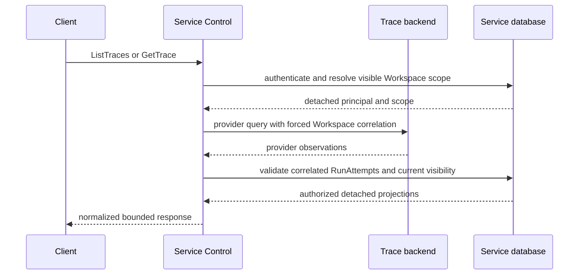

# Trace Query

## Design Position

a13n Service exposes one authorized, provider-neutral read boundary for RunAttempt traces. It supplies the backend API needed by a Trace Dashboard without defining browser layout or presentation behavior. The API reads telemetry from one configured `TraceQueryProvider`; it does not read Service tables as a trace store, ingest another telemetry copy, or reconstruct absent traces from durable lifecycle data.

The OSS distribution includes a Langfuse v4 provider as the reference implementation. Other trusted providers implement the same narrow port and are registered explicitly by a product distribution. Runtime configuration selects among providers already present in that artifact and never names an import target or discovers installed packages.

The query boundary and the [OTel producer and exporter](38-observability.md) are independent. OTLP remains the public write boundary. Query adapters use documented backend read APIs because OTLP defines telemetry transport, not a cross-backend query protocol.

## Boundaries

| Concern                                          | Owner                                               | Relationship                                                              |
| ------------------------------------------------ | --------------------------------------------------- | ------------------------------------------------------------------------- |
| RunAttempt trace topology and exported fields    | [Observability](38-observability.md)                | Supplies one bounded trace and stable Service correlation                 |
| Trace storage, indexing, retention, and deletion | Selected backend and deployment operator            | Remain backend-owned and are not copied into Service                      |
| Public Trace list and detail semantics           | This contract                                       | Normalizes backend observations into one authorized Native API            |
| Backend query and response mapping               | Selected `TraceQueryProvider`                       | Uses documented provider APIs behind the normalized boundary              |
| Resource visibility and content authorization    | [Service IAM](33-identity-and-access-management.md) | Reauthorizes every returned RunAttempt under current policy               |
| Shared JSON, pagination, and errors              | [Platform API Conventions](../api-conventions.md)   | Applies the common bounded `/api/v1` contract                             |
| Browser Trace Dashboard                          | API client                                          | Consumes the public API; layout and interaction are outside this contract |
| Archive, data-lake export, and rehydration       | Deployment operator                                 | Remain outside Service                                                    |

A trace query result is an ephemeral read model over backend telemetry. It is not a Service resource, lifecycle fact, audit record, usage ledger, retained interaction, or authorization source. Service persists no provider cursor, response, trace ID, observation ID, or search index.

## Query Provider Port

`TraceQueryProvider` is a trusted process-local adapter with this conceptual contract:

```python
class TraceQueryProvider(Protocol):
    @property
    def capabilities(self) -> TraceQueryCapabilities: ...

    async def list_traces(self, query: ProviderTraceQuery) -> ProviderTracePage: ...

    async def get_trace(
        self,
        trace_id: str,
        view: Literal["compact", "full"],
    ) -> ProviderTraceDetail | None: ...
```

These are internal typed contracts, not Python import targets or public wire schemas. Every provider supports list and exact-detail reads. Capabilities declare optional behavior such as input/output full-text search, usage, cost, and a backend source URL. A provider validates its typed configuration, translates pagination without exposing provider cursors, bounds provider responses, and maps provider failures into safe common categories.

The service owns public request validation, Workspace and resource authorization, cursor binding, response normalization, and final error mapping. A provider cannot grant access, return provider-native credentials, or add fields to the public API. Unsupported optional behavior fails explicitly; it never silently ignores a caller's filter.

The distribution descriptor registers provider keys, factories, typed configuration contributions, and capability declarations. The OSS descriptor registers `langfuse`. A custom distribution can register another trusted implementation without replacing the public API or altering OTel instrumentation. Duplicate provider keys fail composition.

## Configuration and Provider Selection

Trace query is disabled by default. A configured provider uses a separate namespace from standard OTel export settings:

```toml
[observability.query]
provider = "langfuse" # none | a provider registered by the distribution

[observability.query.langfuse]
base_url = "https://langfuse.example.com"
public_key = "pk-lf-..."
secret_key = "sk-lf-..."
```

`provider="none"` leaves the public routes present but unavailable and does not disable tracing, change content policy, or alter OTLP export. Selecting a provider absent from the distribution or supplying malformed static configuration fails startup. Query credentials are deployment secrets: they remain process-local, are redacted from effective configuration and diagnostics, and never enter API responses or traces.

Query configuration does not inspect, parse, or reuse `OTEL_EXPORTER_OTLP_HEADERS`. The selected read provider and the OTLP destination can differ. A mismatch can legitimately produce no results; it does not change Agent execution or lifecycle authority.

The query client exists only in `control` and `all` processes. Backend query availability is not a readiness dependency. A worker-only process validates common static configuration as required by the runtime but exposes no query routes and opens no query client.

## Public API

The public Native API has two operations:

```http
GET /api/v1/workspaces/{workspace_id}/traces
GET /api/v1/workspaces/{workspace_id}/traces/{trace_id}
```

The exact read accepts `view=compact|full` and defaults to `full`. `compact` omits observation input, output, and metadata while preserving topology, timing, status, model, usage, and cost fields when the provider supplies them. `full` returns the admitted backend content; it does not recover values omitted by producer content policy, sampling, export loss, or backend retention.

The conceptual normalized read models are:

```python
class TraceSummary:
    id: str
    name: str
    started_at: datetime
    ended_at: datetime | None
    duration_ms: int | None
    trace_status: Literal["unset", "ok", "error"]
    session_id: str
    thread_id: str
    run_id: str
    run_attempt_id: str
    run_attempt_number: int
    run_attempt_outcome: Literal["succeeded", "yielded", "failed", "cancelled"] | None
    input: JsonValue | None
    output: JsonValue | None
    observation_count: int | None
    models: tuple[str, ...]
    usage: Mapping[str, int] | None
    total_cost_usd: Decimal | None
    source_url: str | None


class Observation:
    id: str
    parent_id: str | None
    type: Literal["span", "generation", "event", "unknown"]
    name: str
    started_at: datetime
    ended_at: datetime | None
    duration_ms: int | None
    status: Literal["unset", "ok", "error"]
    model: str | None
    usage: Mapping[str, int] | None
    cost_usd: Decimal | None
    input: JsonValue | None
    output: JsonValue | None
    metadata: Mapping[str, JsonValue]


class TraceDetail:
    trace: TraceSummary
    observations: tuple[Observation, ...]
```

The schemas are conceptual; their JSON representation follows the shared API conventions. `id` and observation IDs are opaque external telemetry identifiers, not Service object IDs. `trace_status` and observation `status` are backend telemetry states. After validating the correlation, Service projects `run_attempt_number` and `run_attempt_outcome` from the authoritative RunAttempt read rather than trusting telemetry to supply lifecycle truth. They remain distinct from telemetry status. Null usage, cost, content, end time, or outcome means unavailable, not zero or success.

The service admits only bounded JSON-compatible content, normalized observation metadata, model names, and usage keys. Provider-private fields outside the declared models are dropped rather than becoming an unversioned public escape hatch. Collection summaries can contain root input and output when present; clients use `compact` detail when they do not need payload content.

`source_url` is optional provider navigation only. It contains no credential or bearer authority, and possession never bypasses backend or Service access control.

## List Semantics

The trace collection accepts these base query controls:

| Parameter        | Meaning                                                                                 |
| ---------------- | --------------------------------------------------------------------------------------- |
| `from` and `to`  | Optional RFC 3339 UTC pair selecting root start time in the half-open range `[from,to)` |
| `limit`          | Shared collection limit from `1` through `100`, default `50`                            |
| `cursor`         | Opaque continuation bound to caller, Workspace, provider, range, search, and filters    |
| `query`          | Optional input/output token or phrase search, at most 512 UTF-8 bytes                   |
| `search_in`      | `input`, `output`, or `input_output`; valid only with `query`                           |
| `thread_id`      | Optional exact Service Thread correlation                                               |
| `run_id`         | Optional exact Service Run correlation                                                  |
| `run_attempt_id` | Optional exact Service RunAttempt correlation                                           |

If both time parameters are absent, the range is the 24 hours before request evaluation. Supplying only one is invalid. An explicit range cannot exceed 31 days but can select any retained historical interval. The collection order is `started_at desc, id desc` and cannot be changed. All supplied filters combine with logical `AND`.

Search applies only to input and output on the RunAttempt root observation. It is not regex, wildcard, arbitrary metadata, score, tag, or provider-query syntax. The provider owns tokenization and phrase matching within its declared full-text capability. Unsupported search returns `trace_query_filter_unsupported`; it never degrades into a broad unfiltered read.

Duration, token, cost, model, environment, status, tag, score, and arbitrary metadata filters are not part of this contract. They can be added additively when a product query is defined without changing the provider port or base cursor contract.

The response uses exactly the shared `items` and `next_cursor` collection shape and does not return `total`, offset, page number, or a provider cursor. The Service cursor binds the provider identity and complete normalized query. Changing any bound value invalidates it.

## Authorization and Query Flow



No database session or transaction remains open during the backend call. The provider always constrains its request to `foundation.run_attempt` roots and the exact Organization and Workspace correlation. Service then validates every returned trace against authoritative RunAttempt ownership and the caller's current visibility. Both List and Get authorize `trace.read` from the IAM [stable action registry](33-identity-and-access-management.md#stable-action-registry). Workspace Viewer authority can read Workspace-visible traces; a direct Agent Viewer sees only traces for associated authorized Runs even without Workspace-wide visibility. The action does not bypass the associated Run read predicate or create broader observability authority.

The `a13n.*` attributes and provider project key are correlation, not authorization evidence. Uncorrelated, cross-organization, nonexistent, or currently unauthorized results are never returned. Exact reads conceal absent and unauthorized traces with the same `404 trace_not_found` result. List reads omit unrelated backend data and fail safely when a provider response cannot be bounded or interpreted.

Input, output, and metadata can contain sensitive business content admitted by the producer policy. The service returns them only after exact resource authorization. Query credentials, provider request headers, raw provider errors, and unnormalized provider payloads never cross the public boundary.

## Langfuse v4 Provider

The built-in provider supports Langfuse server v4 and uses the documented Observations v2 Public API. It does not call deprecated Trace or Observation APIs, private application endpoints, Langfuse ClickHouse tables, or Blob Storage Export. It identifies root observations by the `foundation.run_attempt` name and parentless topology, groups descendants by OTel trace ID, and maps the stable `a13n.*` correlation registry into the normalized models.

Langfuse deployment, project creation, storage schema, user management, retention, and backup remain operator-owned. The query provider's API credentials can read only the operator-selected project. Service IAM still scopes the results inside that project.

For data sent directly to Langfuse v4 through OTLP, the deployment includes `x-langfuse-ingestion-version=4` in the standard OTel trace exporter headers so Observations v2 receives the native v4 ingestion path without avoidable migration delay. This is an exporter-header requirement, not Service query authentication and not a `langfuse_enabled` setting.

A server that does not support the required Public API returns the safe `trace_query_provider_version_unsupported` query failure. It does not disable tracing, fail Agent work, change Service readiness, or cause Service to fall back to a deprecated endpoint.

## Failure Semantics

| Failure                                               | Public or operational result                                                            |
| ----------------------------------------------------- | --------------------------------------------------------------------------------------- |
| Query provider is `none`                              | Query route returns `503 trace_query_unavailable`; tracing and OTLP remain independent  |
| Unknown provider or malformed static configuration    | Startup fails before serving work                                                       |
| Backend is unavailable or credentials are rejected    | Query returns safe `503 trace_query_unavailable`; no raw provider response is disclosed |
| Required provider API version is unsupported          | Query returns `503 trace_query_provider_version_unsupported`                            |
| Search is unsupported by the selected provider        | Request returns `400 trace_query_filter_unsupported`                                    |
| Cursor is invalid, expired, or bound to another query | Request returns the shared invalid-cursor error                                         |
| Trace is absent, expired, uncorrelated, or concealed  | Exact read returns `404 trace_not_found`                                                |
| Provider response is malformed or exceeds bounds      | Query fails safely; no partial provider-native object or credential is returned         |
| Sampling, export, or retention omitted a trace        | The trace is absent from query results; durable Service state remains unchanged         |

Read retries are bounded by the request deadline and the selected provider's safe retry policy. Query failure never retries Agent execution, changes an Attempt outcome, or writes telemetry.

## Compatibility and Verification

The two routes, normalized field meanings, default ordering, cursor binding, authorization boundary, provider key identity, and Langfuse v4 minimum are compatibility contracts. New optional response fields, filters, capabilities, and explicitly registered providers can be added. Exposing provider-native query syntax, weakening post-query authorization, reinterpreting a telemetry ID as a Service object ID, or switching to a private or deprecated backend API is incompatible.

Verification covers:

- disabled query, valid Langfuse v4, unavailable backend, invalid credentials, unsupported server version, malformed responses, and request cancellation;
- list and detail normalization, compact/full content behavior, root input/output search, deterministic ordering, and opaque cursor binding;
- Workspace, direct Agent, cross-organization, missing-correlation, concealed-resource, and revoked-access cases;
- no database session across provider I/O and no provider credential or raw error disclosure;
- provider registration conflicts and an independently implemented test provider through the same port; and
- independence of tracing, OTLP export, Agent readiness, Agent work, backend retention, and query availability.

## Trade-offs

One normalized API lets Service clients build a consistent trace experience without implementing a trace database or exposing backend credentials. Provider adapters still carry unavoidable backend-specific query and pagination work, and their optional capabilities can differ. Service accepts that adapter cost while keeping instrumentation, storage, retention, and archival replaceable.

## Invariants

1. Trace Query reads one selected backend and persists no trace, observation, cursor, index, or archive.
2. OTLP is the write boundary; `TraceQueryProvider` is a separate documented-read adapter boundary.
3. Every returned trace correlates to one authorized Service RunAttempt under current policy.
4. Telemetry correlation, backend project membership, trace IDs, and cursors never grant authority.
5. `ListTraces` and `GetTrace` are the only public trace query operations; observations are nested in `TraceDetail`.
6. Provider selection names only an implementation registered by the artifact's distribution descriptor.
7. The OSS Langfuse provider uses the v4 Observations v2 Public API and never reads Langfuse storage directly.
8. Query configuration and failure never alter tracing, OTLP export, Agent execution, lifecycle, readiness, or durable usage.
9. Service owns no Trace Dashboard presentation contract, trace retention, cold archive, archive schema, or rehydration path.
