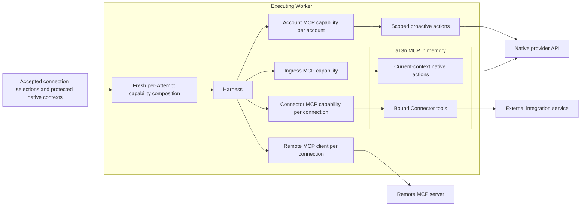

# Agent-Facing External Tools

## Design Position

Service selects authorized external resources and binds their current execution context. Harness and its upstream MCP client own protocol handling, tool discovery, filtering, invocation, and deferred capability loading. Service composes these through `RunBindings.capabilities`; it does not implement another MCP client or model-facing tool catalog.

The a13n MCP is an in-process implementation for Application Account actions, protected inbound replies, and Connector-backed tools. Each executing Worker binds a separate local Toolset for each authorized source in its RunAttempt and exposes it through Harness `MCP(local=Toolset)`. The Toolset calls the bound adapter directly: they require no listening port, subprocess, network MCP deployment, internal service credential, or persisted MCP invocation grant.

Each selected [`MCPConnection`](06-remote-mcp-connections.md) produces a separate Harness MCP client that connects directly from the executing process to that Remote MCP endpoint. The a13n MCP does not proxy those servers. Remote execution remains Worker-controlled rather than delegated to a model provider's native MCP facility.

## Boundaries



| Concern                                 | Owner                                                     | Boundary                                                                                 |
| --------------------------------------- | --------------------------------------------------------- | ---------------------------------------------------------------------------------------- |
| Agent defaults and Run overrides        | [Agent Management](../28-agent-management.md#agentconfig) | Select connection IDs, tool scopes, and deferred loading                                 |
| Inbound events and admission            | Connectivity role                                         | Authenticate events, normalize, route, batch, and invoke durable Run or Steer acceptance |
| Resource setup and management discovery | Control role                                              | Own connections, credential setup, safe metadata, and advisory discovery                 |
| Outbound tool composition and authority | Executing Worker                                          | Bind current Attempt and source; reauthorize effects and resolve current credentials     |
| MCP protocol and tool presentation      | Harness and upstream MCP primitives                       | Discover, filter, namespace, load, invoke, and close the composed toolsets               |
| Native or Connector action meaning      | Trusted source adapter                                    | Preserve provider-specific schemas, results, receipts, and failure semantics             |

One reusable a13n MCP implementation does not imply one combined capability. A Run with an Ingress action set, two ConnectorConnections, and one MCPConnection has four external MCP capabilities: three in-process groups and one remote client. Empty selections create no capability. Independent connections to the same remote URL remain independent authenticated clients.

MCP is the integration boundary for these external tool sources. Environment file, shell, and process tools, Subagent, user interactions and client tools, Asset publication, ordinary Plugin tools, and Skill instructions retain their existing Harness contracts; they are not routed through a13n MCP merely to make every capability use the same transport.

## Source Selection and Tool Identity

The [Agent selection contract](../28-agent-management.md#agentconfig) owns the public `connector_tools` and `mcp_tools` lists. Each entry names one managed connection, its tool selection, and `defer_loading`. There are no caller-defined source aliases or inline endpoint and credential definitions. Omitted or null `tools` means all currently available authorized tools; an empty list selects none. Explicit names are exact source-native tool names, not fuzzy queries or model-visible prefixed names. Default native tools are independent of these lists: clearing either or both lists does not remove host-injected tools.

Run acceptance retains the effective source selections after overrides, trusted overlays, and authorization. It performs no synchronous remote discovery and requires no durable tool catalog to accept the Run. Agent Revision and Run validation check selection structure, managed resource identity, eligibility, and policy; current tool availability is checked during execution preparation. An explicit name absent from successful discovery fails preparation with a safe unavailable-tool error. Service never silently drops an explicit selection or substitutes another source or account.

Service derives stable, kind-qualified capability keys and collision-safe tool namespaces from source identity. These are internal composition keys, not another managed resource or caller-authored alias. They remain stable across replacement Attempts of the same Run; mutable display names and Attempt IDs do not determine them. Distinct sources cannot overwrite each other's tools. Model-visible names use only ASCII letters, digits, underscores, and short hyphens and are at most 64 characters; deterministic source and tool identity hashing preserves distinct names after normalization or shortening. Upstream renaming maps calls back to exact source-native names before the source guard and dispatch. Safe connection display names can explain account purpose to the model without exposing private IDs, endpoint URLs, or credential metadata.

## Default Native Tool Contexts

Connectivity owns the protected `NativeToolContext` union of `AccountRunContext` and `InboundRunContext`. The trusted entry freezes at most 128 contexts in the accepted Run's `native_tool_contexts`, independently of Agent configuration and connection selection. Each context binds the Run's execution Principal, exact Account identity, provider, and explicit action allowlist. Contexts contain no credentials, tool schemas, or connection IDs. Duplicate contexts for the same kind and source are rejected. Empty contexts contribute no default native tools; Service does not discover Accounts by listing Workspace resources.

A non-Ingress trusted entry may bind this conceptual context after validating current Account use authority, resource eligibility, and the entry's target policy:

```python
class AccountRunContext:
    kind: Literal["account"]
    account_id: AccountId
    execution_principal_ref: PrincipalRef
    provider_key: str
    allowed_actions: tuple[str, ...]
    target_scope: ProviderTargetScope
```

The [Account contract](01a-application-accounts.md#built-in-proactive-scopes) owns exact target shapes. Model-supplied destinations must belong to that frozen scope. Target schema validation alone is not authorization: the trusted entry supplies actions and targets from its authorized policy, never directly from public overrides, event text, or model arguments. No public Agent or Run override can create these contexts.

Account and Ingress contexts produce separate, directly visible native capabilities even when they reference the same Account. Their schemas and scopes cannot replace or expand each other. The runtime binds them through Harness `RunBindings.capabilities` using in-process MCP; it creates no synthetic ConnectorConnection or MCPConnection.

Replacement Attempts and continuations that inherit execution preserve the exact contexts. New child Runs receive none by default; resuming a child does not inherit its parent's contexts. Any explicit delegation is a fresh trusted-entry authorization under the child's execution Principal. Proactive actions do not automatically create or change an Ingress Thread binding. Unknown write outcomes retain provider-specific reconciliation semantics.

## InboundRunContext

Ingress admission contributes this conceptual protected value to `native_tool_contexts`:

```python
class InboundRunContext:
    kind: Literal["inbound"]
    binding_id: BindingId
    account_id: AccountId
    target_id: AccountTargetId | None
    execution_principal_ref: PrincipalRef
    provider_key: str
    provider_context_version: str
    provider_context: BoundedJsonObject
    action_policy: BoundedJsonObject
    allowed_actions: tuple[str, ...]
```

`provider_context` contains the adapter-defined stable target needed by the selected native actions, such as a Slack Discussion, Lark chat or topic, GitHub pull request, or Gmail thread. It is protected Run metadata, not `AgentInput`, model context, Tool arguments, ordinary events, logs, or trace attributes. `action_policy` holds bounded adapter-validated behavior such as messaging `reply_mode`; it cannot authorize another target. `allowed_actions` is the sole retained native action allowlist after trusted admission and capability policy. A receive-only Ingress has an empty allowlist and contributes no native MCP capability. Reconstruction requires a trusted adapter that supports the retained `provider_context_version` and selected actions. An unsupported context or action fails explicitly; recovery never infers a replacement target from a later event or current provider state.

This context contains no event history or duplicate event identity; Batch receipts own exact Run or Steer acceptance. Steer preserves the current Run's context, target, Agent, and accepted capability selections even after Account or target configuration changes. It never queues input waiting for a configuration-compatible successor. The next ordinary Run resolves current Agent and configuration. The first Attempt reconciles eligible Steers under the ordinary inbox contract.

Only trusted admission creates this context. Direct Run overrides cannot invent an Ingress context, change its target, or add native actions beyond its admitted authority. A child Run does not inherit native target authority merely because its parent has an Ingress capability; any delegation must be explicit under the owning subagent and admission contracts.

## Runtime Composition and Authority

For every RunAttempt, the executor constructs fresh local Toolsets, remote clients, and capabilities with the exact accepted selections and trusted Attempt context. Local handlers bind narrow application collaborators, the selected connection or Ingress context, and the existing Attempt authority. They do not reconstruct authority from model arguments, `AgentContext.metadata`, request headers, or caller-supplied Run IDs. Shared implementation code and transport pools are permitted; mutable authenticated sessions, toolsets, and source bindings are not shared across Attempts or accounts.

Immediately before an external action, Service checks that the Attempt remains current, leased, non-terminal, and effect-authorized under [Attempt fencing](../13-run-attempt-scheduling-and-recovery.md), then checks the selected resource and operation against the [Attempt IAM snapshot](../33-identity-and-access-management.md#attempt-iam-snapshot), accepted scope, and current resource eligibility. Inbound reply calls use the protected execution Principal rather than the external provider actor. They resolve credentials from the retained Application Account. Reception closure alone does not block accepted replies; Account disablement or loss of Attempt authority does. Resource disablement, credential revocation, cancellation, replacement, or lease expiry blocks subsequent dispatch; Principal status and RoleBinding changes follow the snapshot boundary. When a Connector adapter performs external preflight reads, it rechecks current Attempt and resource authority after those reads and before sending the action, using the latest published IAM snapshot. The final check also rejects a Connection version or Provider credential change since that invocation acquired its binding. An already dispatched external effect has the source's cancellation and unknown-outcome semantics; a local fence does not roll it back.

Immutable selection and native-context JSON is parsed once at Attempt preparation. Each dispatch compares the protected persisted input with that accepted scope while reading live Attempt and IAM authority; caching parsed input never caches authorization. Inline child capabilities use that child's frozen connection selections under the owning Attempt and current child invocation authority, and receive no parent native ingress context. Asynchronous children prepare their own capabilities when claimed.

Dispatch reads current Attempt authority and only the invoked source's eligibility. It does not rerun Revision freezing or lock all other selected connections. Native action clients and their token providers are reused within one Attempt, with single-flight token refresh where supported. Each use rereads Account credential generation and provider configuration; changes replace the cached action/token scope. The process owns and closes the shared cookie-free HTTP pool, while authenticated MCP sessions and source bindings remain per Attempt. Lists project already loaded records without per-row resource queries.

The local MCP handlers and remote client call guards enforce the accepted tool scope at invocation as well as discovery. Hiding a tool from the model is not authorization. A call cannot select another connection or endpoint. Current-context actions cannot select another destination; proactive actions enforce their accepted target scope. Credential refresh resolves current eligible values for the bound source without expanding its accepted authority. External I/O and MCP lifetimes never hold a database session or transaction open.

For Remote MCP, Service composes the upstream MCP toolset with the connection's current authentication, outbound endpoint policy, tool filter, namespace, and call guard. Harness `ContextualMCP` is suitable when resolving a URL and headers once per logical run is sufficient. Sources needing refreshed authentication or per-call checks use the upstream MCP client's supported authentication and call hooks through trusted per-run `MCP(local=...)` composition. Service does not extend `ContextualMCP` into a local header-based authorization protocol or implement JSON-RPC/session handling itself. [Remote MCP Connections](06-remote-mcp-connections.md) owns the remote transport and credential contract.

The Attempt preparation scope owns these live objects together with its input sources and Environment operation object. It closes them on completion, cancellation, partial preparation failure, or planned handoff, within the bounded cleanup deadline and before committing the Attempt outcome or yielding authority. The lease remains renewed during cleanup. Recovery builds new objects from the same accepted source scope and protected target. There is no separate local MCP credential issuance, renewal, revocation, or authorization-record lifecycle.

## Deferred Loading

Default native actions are always directly visible. Connector and Remote MCP selections independently set `defer_loading`, defaulting to `false`. With `false`, Harness exposes the selected tool definitions directly. With `true`, Harness advertises the capability through its built-in `load_capability` mechanism and exposes that group's allowed tools when loaded.

Deferred loading operates at capability granularity. It reduces initially model-visible definitions; it does not promise delayed network initialization, per-tool search, or reduced upstream discovery. It does not change connection identity, tool scope, authorization, or dispatch. Service provides no separate `direct`/`catalog` mode and no `list_mcp_tools`, `describe_mcp_tools`, or `call_mcp_tool` facade. A Harness tool-search feature has its own contract and is not implied by `defer_loading`.

## Discovery and Recovery

The local Connector adapter discovers its bound source's current tools and exposes them through a source-bound Toolset. Harness owns capability loading and invocation; its existing MCP client discovers each remote source. Local tool definitions preserve source input/output schemas and annotations, and validate arguments and bounded results without an intermediate MCP server. Source tool descriptions and schemas remain untrusted bounded input. Management discovery can help users select tools but is advisory rather than an immutable execution contract.

Service persists source identity and selection policy, not external tool definitions, catalog digests, or an `MCPToolSnapshot`. An explicit allowlist limits names but does not pin their schemas. A Connector or Remote MCP all-tools selection permits newly discovered tools within the same authorized source. Supported session caches, reconnects, and list-change invalidation may update definitions under the same selection; replacement Attempts discover current definitions again. Neither an accepted Run nor its replay promises schema equality with an earlier Attempt. Unrelated Model execution snapshots, Skill locks and frozen Plugin configuration, fixed Environment selections and template revisions, and continuation contracts retain their own guarantees. A retained pending approval or client-tool request still validates its exact pending identity and contract; fresh discovery cannot make an old approval authorize changed arguments or action semantics.

If a selected tool disappears, discovery fails, a current schema rejects retained arguments, or a source becomes incompatible, preparation or the affected call fails explicitly. Recovery never changes the selected account, endpoint identity, native target, or whitelist to obtain a successful result. Upstream API versions needed for a specific discovery and execution belong to that source's current runtime binding; they do not create a durable Run schema lock. Credentials and authorization remain current even when a session reuses discovered definitions.

### Discovery and result bounds

Each source discovery accepts at most 128 pages, 2,048 tools, and 16 MiB of canonical tool-definition JSON. One tool name is at most 128 UTF-8 bytes, description at most 16 KiB, and combined input/output schemas at most 256 KiB with JSON and schema-reference depth at most 64. Tool execution accepts at most 1 MiB of canonical result JSON with nesting depth at most 64. Provider hints cannot increase deployment ceilings. Oversized or invalid discovery fails explicitly instead of publishing a partial tool group.

Caches remain isolated by exact source and authorization identity and are invalidated when their binding changes. They create no durable retention requirement tied to AgentRevisions or Runs. Bounded observations can record which source and tool were used without storing credentials, private context, or a second executable catalog.

## Native Current-Context Actions

A native action accepts only action content and bounded safe behavior choices. Its schema has no model-settable Ingress, Workspace, Channel, Chat, Discussion, Thread, Message, Run, connection, external account, or credential selector. A forced messaging `reply_mode` omits placement; `auto` can expose one provider-appropriate placement choice that cannot select another destination.

Inbound processing never calls these actions automatically. The Agent decides whether to respond. Provider-specific actions and schemas remain separate rather than forcing Slack, Lark, Discord, Teams, GitHub, and Gmail into a common reply model.

## Dispatch and Provider Receipts

```mermaid
sequenceDiagram
    participant Agent
    participant Harness
    participant Bound as Bound local handler or remote client guard
    participant External as Provider or Remote MCP
    participant Store as Service durable store

    Agent->>Harness: Call a visible tool
    Harness->>Bound: Resolve namespaced tool and validate arguments
    Bound->>Store: Check current Attempt, resource, and operation authority
    Store-->>Bound: Authorized facts; short session closed
    Bound->>External: Invoke exact source with current credentials
    External-->>Bound: Result, receipt, failure, or unknown outcome
    Bound->>Store: Commit typed native correlation when required
    Bound-->>Harness: Bounded safe result
    Harness-->>Agent: Tool result
```

A native Ingress adapter returns a typed internal receipt when the provider supplies stable message, Discussion, thread, issue, pull-request, or mail references. Before reporting a continuity-establishing success, Service commits the exact `AgentThreadBinding` only when that action's contract establishes a new correlated external target. An ordinary messaging reply retains the inbound Binding; changing reply placement never moves it. Connector and Remote MCP results do not establish Ingress bindings through similarly named fields, and the model never parses an arbitrary result to create binding authority.

If an external effect may have occurred but its response or subsequent correlation commit is unknown, the outcome remains unknown unless the source supports a stable operation identity, idempotency key, outbound echo, task identity, or reconciliation evidence. Service does not automatically repeat non-idempotent actions, fabricate receipts, report rollback, or create a generic per-tool durable execution ledger. Replacement Attempts cannot infer completion from missing local results.

Known Connector provider refusals return a typed tool outcome with `kind="failed"` and a bounded `error` containing a code and a Service-owned explanatory message. Missing OAuth scopes, denied permissions, rejected authentication, missing or inaccessible resources, rate limits, and other explicit tool rejections remain distinguishable. They complete the tool call so the model can explain the failure; they do not abort the Run merely because the provider refused it. A completed Run does not imply a successful tool action. Error projection never copies arbitrary upstream messages, response bodies, credentials, or account references. Local authority failures still prevent dispatch and are not converted into provider refusals. Uncertain dispatches remain `outcome_unknown`; neither kind triggers an automatic provider retry. Missing or malformed execution envelopes, incompatible successful payloads, and results exceeding the result depth or byte bound after dispatch also return `outcome_unknown` without publishing the invalid payload.

## Invariants

1. Local native and Connector tool groups use in-process a13n MCP; remote sources use independent Worker-controlled MCP clients.
2. One connection or native context produces one capability; no shared mutable binding crosses accounts or Attempts.
3. Accepted connection selections and protected native contexts authorize tools; discovery, headers, display names, and model arguments cannot expand that authority.
4. Runtime schemas are discovered under the accepted scope and are not durable Run snapshots.
5. Deferred loading uses Harness capability loading and does not change authorization.
6. Each external action rechecks existing Attempt and resource authority and uses current eligible credentials.
7. Typed native receipts establish correlation; uncertain external effects remain uncertain.
