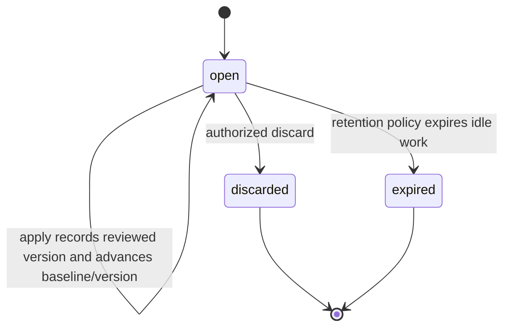

# Agent Configuration Assistant

## Design Position

The configuration assistant helps a User create or change one business Agent in one Workspace. It reads authorized configuration and interaction evidence, edits a reviewable `ConfigurationDraft`, validates the complete candidate, and explains the resulting changes. Only a separate authenticated user command applies that draft to the business Agent.

The assistant has a real, system-maintained Agent identity; its executable definition comes from the deployed configuration file and is frozen directly in each accepted Run, without assistant AgentRevisions. It is hidden from ordinary Agent management and cannot be edited or invoked through ordinary product APIs, including by administrators. Configuration conversations remain visible to their owner. The assistant uses the same Session, Thread, Run, RunAttempt, Harness execution, recovery, and usage mechanisms as other hosted work.

Configuration authoring does not install code, create Provider credentials, change IAM, or automatically apply a business Agent Revision. The assistant selects existing authorized resources. Missing resources produce safe setup or authorization guidance. Ordinary Agent management remains usable without a working assistant Model.

## Boundaries

| Concern                                                                                                              | Owner                                                                                                                                                                                                        |
| -------------------------------------------------------------------------------------------------------------------- | ------------------------------------------------------------------------------------------------------------------------------------------------------------------------------------------------------------ |
| Agent identity, system-purpose restrictions, business Agent Revisions and ordinary invocation                        | [Agent Management](28-agent-management.md#system-maintained-configuration-assistant)                                                                                                                         |
| Assistant identity provisioning, deployed definition selection, drafts, configuration conversations, tools and apply | This document                                                                                                                                                                                                |
| User authority, action evaluation and Attempt refresh                                                                | [Service IAM](33-identity-and-access-management.md#configuration-assistant-authority)                                                                                                                        |
| Sessions, Threads, Runs, persistence, continuation and fencing                                                       | [Interaction Model](../interaction-model.md), [Thread Persistence](11-thread-persistence.md), [Run Persistence](12-run-persistence.md), [Input and Continuation](18-agent-control-input-and-continuation.md) |
| Conditional mutation, idempotency, audit and publication                                                             | [Durable Operations](06-durable-operations-and-outbox.md)                                                                                                                                                    |
| Provider/Model configuration and execution snapshots                                                                 | [Model Management](30-model-management.md)                                                                                                                                                                   |
| Host file mounts and managed Environment selection                                                                   | [Environment Management](29-environment-management.md#deployment-bundled-knowledge-mount)                                                                                                                    |
| Authorized Run summaries and retained visible Items                                                                  | [Interaction Retrieval](35-agent-interaction-retrieval.md)                                                                                                                                                   |
| Public route catalog and browser integration                                                                         | [Management API](16-management-api.md), [Console](../frontend/console.md)                                                                                                                                    |

This contract retains a real Agent foreign key for every Run. Only protected configuration-assistant execution omits an AgentRevision and freezes its deployment definition directly under [Run Persistence](12-run-persistence.md#configuration-and-resource-references). This exception does not introduce a public inline-definition endpoint or exempt business candidate verification from its normal executable-reference requirements.

## System Assistant and Definition Lifecycle

Each Workspace has at most one Agent with `system_purpose=configuration_assistant`. Its `source` is `builtin`. The record supplies stable same-Workspace identity for Run foreign keys, authorization and usage correlation; it is not the executable definition source. It has a normally allocated Agent ID, no current Revision, and no assistant AgentRevision history. Ordinary built-in Agents retain their existing Revision and visibility contracts.

The first authorized request that actually starts assistant execution ensures this identity after Model readiness succeeds. Read-only readiness does not provision records. Concurrent initialization converges on one Agent under database uniqueness and the shared idempotency boundary. Identity creation uses a legitimate system Actor; execution always represents the current User Principal.

The distribution maintains a bounded YAML definition and associated deployment-bundled Skill files as reviewed source. The file is the sole source of assistant instructions, trusted tool selections, capability policy, model-selection preferences and default budgets for new ordinary configuration inputs. The default cumulative input-plus-output token limit is 2,000,000, with a separate 40-model-request limit. Operators may override the token budget with the positive integer `configuration_assistant.total_tokens_limit` Service setting; omission retains the bundled default. The resolved budget participates in the accepted definition digest and is frozen into both Harness usage limits and Run execution budgets. Recovery and source-preserving successors retain the accepted limits. Parsing rejects unknown fields, duplicate keys, arbitrary object tags, executable imports and invalid budgets. It contains no Workspace credential or user-selectable authority. Installed executable code follows [Installed Harness Plugins](36-installed-harness-plugins.md); knowledge files are not a code-installation mechanism.

New ordinary configuration input resolves the deployed file and the current User's authorized resources into a complete valid effective configuration. Acceptance persists that configuration through the existing Run snapshot, together with definition content digest, model selection and budgets. There is no `system_definition` column, definition-generation counter, database definition head or file-to-AgentRevision synchronization. Changing the deployed file affects subsequently accepted ordinary inputs without a database definition update. Different accepting builds during a rolling deployment may accept different definitions; each Run identifies the exact content it accepted. A source rollback likewise affects later ordinary inputs only. Definitions selecting privileged host capabilities cannot be adopted through ordinary Agent authoring by copying a key or configuration value.

Same-Run recovery and replacement Attempts use the original persisted effective configuration; they never reread current YAML to replace that snapshot. The snapshot does not include deployment-bundled Skill file contents, which follow the runtime-read rules below. Source-preserving Retry, waiting Feedback/Continue and other source-preserving successors also retain their selected source snapshot, even though they allocate a new Run ID. A new ordinary configuration input can use a changed deployment definition while continuing the same Thread. These selection rules supplement the existing control and state-compatibility contracts.

Compatible Worker capacity must exist before accepting dependent work. A Worker constructs the accepted composition from the persisted snapshot and compatible installed code; an incompatible snapshot fails explicitly instead of being replaced by the current definition. Deployment-bundled Skill files and executable code can change between Attempts. Code changes still obey existing plugin and state compatibility requirements.

## Model Readiness and Selection

Assistant execution requires an already configured Model Provider available to the Workspace and at least one Model the current User can use for conversation and tool calling. An authorized Organization-shared Provider qualifies. A saved name without required connection configuration, credentials, or a usable Model does not.

Readiness is an authenticated, non-model query. It returns `ready`, a bounded `reason_code`, safe setup actions and `setup_url`, and, when ready, the selected Model reference. Reasons distinguish missing Provider setup, missing Model setup, lack of Model access, and absence of a compatible Model. Users without management permission receive guidance to an authorized administrator; readiness never grants roles, creates credentials, or probes all candidates through paid inference. The setup link identifies Model Provider settings in the current Workspace when Provider setup is missing, and the Workspace Models collection when a configured Provider lacks an enabled or compatible Model. In the latter states, users with management permission receive only the `configure_model` action.

Among enabled, configured, authorized candidates with compatible declared capabilities, selection follows this order:

1. GPT-5.6 Luna with `high` reasoning effort.
2. DeepSeek 4.1 Flash.
3. Gemini 3.8 Flash.
4. Any other compatible available Model.

These are preference families, not assumed Provider wire identifiers. Distribution-owned explicit mappings use actual model identity and API capabilities, not editable display names. An unsupported requested reasoning setting makes that candidate ineligible. Other families use settings supported by their actual calling API. Equivalent candidates use a stable Model key/ID ordering. Unknown capability or failed configuration is not proof of readiness; upstream availability remains subject to actual execution.

Every new ordinary configuration input selects using the current User's authorized resources and freezes the actual ModelExecutionSnapshot, settings, and selection policy/reason. Recovery and source-preserving successors preserve that selection; failure inside accepted execution does not silently switch models. A later ordinary input can choose a different eligible candidate. Candidate business configurations retain their own Model selection.

Every newly selected definition uses a real authorized Model resolved after readiness through the common resource-resolution rules. The assistant identity stores no initial user's Model default or credentials. Different Users can select different eligible Models without creating another assistant Agent or any assistant Revision. Source-preserving successor operations retain their accepted Model selection and recheck eligibility under their owning contracts.

## Configuration Session and Thread Scope

A configuration Session uses the standard Session model with a protected User owner, Workspace and one stable `configuration_draft_id`. Creating a configuration Session atomically creates its draft in a one-to-one relationship. The draft owns the business target, which is absent until first application in create mode. Session stores no separate `configuration_target_agent_id`; authorization and target selection resolve through its draft. The owner exists before any Run and cannot be inferred from the shared assistant identity or a later Run Principal.

All configuration Threads in that Session discuss and edit the same draft. They retain normal Thread origin, fork, input, waiting, feedback, cancellation and retry semantics. Creating or forking a Thread does not copy configuration or create another draft; Thread creation accepts no independent source selection. Independent candidate approaches use separate configuration Sessions, each with its own draft. These are not parallel interaction entities or a separate message store.

The owner can list, read, switch and continue authorized Sessions and Threads. Each operation checks ownership and applicable configuration authority against the draft's current target or create scope. Clients cannot change the owner, Workspace, draft association, system assistant or target through messages, metadata, tool arguments or a generic Agent override. Multiple Threads can operate concurrently, but all candidate mutations compare the same draft version and digest; a stale edit fails without overwriting another Thread's changes.

The protected Run context has this conceptual shape. It is accepted Run data, not model-editable metadata or a persisted permission grant:

```python
class ConfigurationRunContext:
    schema_version: Literal["1"]
    purpose: Literal["configuration_assistant"]
    session_id: SessionId
    thread_id: ThreadId
    draft_id: ConfigurationDraftId
    initial_draft_version: int
    definition_digest: str
```

The definition digest identifies the accepted assistant definition, not the contents of deployment-bundled Skill files. Owner/Workspace are checked against the Run Principal, Session and draft. The Run's Session/Thread/draft identity never changes. `initial_draft_version` records acceptance, not a permission to overwrite that version later. Model-visible draft reads return current mode, target, source, baseline, version and applicable application receipts; these mutable authoring facts are not a second immutable target binding on the Run. Tool writes compare the current expected version/digest and re-evaluate current target authority. Recovery and source-preserving successors retain execution snapshots and stable draft identity; they cannot silently replay a stale draft edit.

### Sources and Baselines

For an existing target, creating a draft defaults to the target's current immutable Revision; the user can explicitly select a retained authorized historical Revision of that same Agent. A new Agent starts from `empty` with absent config until initialized. Source selectors are `current`, `explicit`, and `empty`; no system-hidden Agent is a valid target or source.

`source_agent_revision_id` and its version identify the immutable original content and never change after draft creation. The source content is read from that retained Revision rather than copied into a second authoritative draft history. `base_agent_revision_id` starts at the source and changes only through explicit rebase or successful application, which establishes the resulting business Revision as the new baseline. `base_agent_version` captures the target head's current concurrency version, even when the source is historical. Starting from v3 while the current target is v7 therefore records source v3 and expected target head v7.

Reads distinguish original-source-to-draft, merge-base-to-draft, and current-target-to-draft diffs. The apply diff always identifies the current target baseline; source history cannot masquerade as the current state to be overwritten.

### Draft Model and Lifecycle

The following is a conceptual domain schema, not an ORM or serialized wire declaration:

```python
class ConfigurationDraft:
    id: ConfigurationDraftId
    organization_id: OrganizationId
    workspace_id: WorkspaceId
    session_id: SessionId
    mode: Literal["create", "update"]
    target_agent_id: AgentId | None
    source_selector: Literal["current", "explicit", "empty"]
    source_agent_revision_id: AgentRevisionId | None
    source_agent_revision_version: int | None
    base_agent_revision_id: AgentRevisionId | None
    base_agent_version: int | None
    version: int
    config: AgentConfig | None
    creation_metadata: CreationMetadata | None
    content_digest: str
    status: Literal["open", "discarded", "expired"]
    latest_validation: ConfigurationValidation | None
    evidence_refs: tuple[RunId, ...]
```

Draft identity remains stable across edits, rebase, application and subsequent editing. Ownership is inherited from the configuration Session rather than from one Thread. There is no Thread-owned draft, predecessor draft, active/latest draft pointer or successor-draft lifecycle. The draft contains the latest complete structured configuration and retained creation metadata; YAML is an import/export representation, not another authority. There is no draft file mirror, writable sandbox copy or immutable draft Revision per edit. Unsupported editor fields cannot be silently dropped.

`version` starts at 1 and advances once for a material candidate edit, explicit rebase or successful new application. Application advances it because the committed baseline, last application and possibly create-to-update binding change; it does not imply another content edit. A semantic no-op edit and an idempotent application replay do not advance it. Validation-only observations and discard/expiry do not advance the version. Strong ETags protect mutable representations under the [shared mutation contract](../api-conventions.md#mutations-and-retries). Writes compare exact expected version and digest. A version identifies authoring and review state but is not an address for arbitrary historical draft content.

`content_digest` covers canonical config and retained creation metadata. Version and status checks remain necessary even when content is unchanged. `config=None` is allowed only before create-mode initialization and cannot pass apply or verification admission. Create mode has no target or base. First application binds its newly created business Agent, changes mode to update and establishes the result Revision as base without changing draft ID or original `source_*` provenance. Consequently an update-mode draft originally created from empty keeps an empty original source. Existing-target drafts retain their original current/explicit source. References retain organization and Workspace consistency.

Application receipts are immutable retained records keyed by `(draft_id, reviewed_version)`, not one overwritten field on the draft. Each records reviewed digest, mode and target/baseline at review, resulting Agent/Revision and Agent version, applying User, timestamp, verification references/acknowledgement and no-change outcome. Retained request identity supports replay after generic idempotency evidence expires. The reviewed candidate is recoverable from the resulting immutable business Revision and retained reviewed creation metadata. Receipt history is paginated; a latest receipt in a draft response is a projection rather than a second authority.



Apply leaves the draft open. Validation, verification and application outcomes are observations or receipts, not exclusive draft lifecycle states. Discard and expiry end editing for the entire configuration Session, preserve required history and do not undo published business Revisions. They create no replacement draft; further independent authoring starts a new configuration Session.

### Continuing After Application

Successful application retains the draft ID and candidate, updates its base to the committed business Revision and advances the draft version. First application additionally binds the business target and changes create mode to update. The next ordinary input on any Thread continues the same draft. Reading, retrying, answering a pending question or starting another Thread never creates a successor draft. There is no implicit reload from a target changed externally; such changes remain visible as conflicts and require explicit rebase.

Before model work and when reading the draft, the host exposes the stable draft ID, current version, source/base/current target, applicable receipts and any create-to-update transition. These are committed authoring facts, not authority from target instructions. Earlier messages or compacted context cannot substitute old expected versions, baselines or verification results.

An old Run retains its accepted execution snapshot and the same stable draft identity. Edits prepared before another edit or application fail version/digest checks. A still-authorized Run may explicitly reread the current draft and prepare a new edit using current preconditions and fresh mutation authorization, including permissions on a newly created target. Neither a prior create-mode allow nor an old receipt grants update authority. New edits after application require another explicit user apply; no old acknowledgement authorizes the new version.

## Draft Editing and Validation

Model tools and human APIs call the same configuration domain operations. Neither path writes the target Agent directly. Updates accept `expected_version`, an ordered bounded `operations` list, and allowed create metadata or explanatory summary. Paths are string arrays relative to `config`, not record fields or filesystem paths.

| Operation      | Meaning                                                                 | Required limits                                                                             |
| -------------- | ----------------------------------------------------------------------- | ------------------------------------------------------------------------------------------- |
| `set`          | Set a permitted field or replace a complete object/array                | Empty path initializes or replaces complete AgentConfig; no silent loss of preserved fields |
| `remove`       | Remove an optional field or permitted mapping entry                     | Cannot remove required fields or the root                                                   |
| `replace_text` | Replace one exact nonempty `old_text` with `new_text` in a string field | Exactly one match; zero or multiple matches fail; no regex or executable expression         |

A command contains at most 32 operations and is additionally bounded by the service request-size limit. Arrays are replaced as complete values; paths cannot traverse numeric array indexes, wildcard selectors, JSONPath, or executable code. Unknown fields and unauthorized paths fail. No operation can modify ownership, target, source, baseline, status, system-purpose metadata, the assistant definition, or execution authority.

All operations apply to a temporary complete candidate, followed by full AgentConfig, Model parameter, reference, lifecycle, and current binding-authority validation. Any operation or validation error leaves the stored draft and its previously valid report unchanged. Warnings can be saved with the candidate. Successful material edits atomically update the row, advance version once, replace validation, and invalidate incompatible verification observations. An expected-version mismatch cannot be forced through by the model.

There is no separate model schema-discovery or validation tool. Static field and workflow knowledge lives in the built-in Skill; resource tools provide safe dynamic contracts. `update_configuration_draft` validates before saving. A failed update returns bounded field errors; a saved receipt identifies its exact version and digest.

The latest successful-save validation report is bounded data on the draft, tied to its version/digest and relevant dependency observations. An asynchronous observation can replace it only if those values still match; it does not advance the candidate version. Validation does not allocate a separate Validation resource. Apply and execution admission revalidate rather than trusting a previous report.

### Explicit Rebase

When the target changes, apply reports a conflict and preserves the candidate. The user can submit an explicit merged config and the newly reviewed target version through rebase. Rebase validates and atomically replaces the current candidate, merge base, and target concurrency baseline under draft and target preconditions, advances the draft version, and preserves the original `source_*` provenance, including an empty source for a draft that began in create mode. Ordinary model edits cannot rebase or force overwrite. Earlier validation or Run evidence does not become current merely because the conflict was resolved.

## User Application

Apply is a deterministic authenticated user command, absent from the assistant toolset. Questions, model output, conversational agreement, and an `approved` tool argument do not invoke it or provide authority. The request identifies the reviewed draft version/digest, expected target version for update mode, accepted dependency observations, selected verification Run references, any explicit unverified/failure acknowledgement with reason, and an idempotency key.

After checking current User authority, Service first resolves any retained application receipt for the reviewed version; an exact replay does not depend on reconstructing the draft's old mutable state. For a new application, Service reads and prepares the exact candidate and dependency resolution outside the final transaction. It never holds a database session while calling a model, Provider, tool or storage backend. The final short transaction:

1. checks current User authority and resolves a matching retained receipt/idempotent replay before evaluating current draft-version preconditions;
2. serializes the Session association, shared draft and business Agent consistently;
3. rechecks open status, owner, Workspace, exact draft version/digest, target baseline, references, verification applicability and prepared dependency observations;
4. creates the business Agent and Revision v1, or appends a business Agent Revision and advances its head under Agent Management;
5. records the immutable receipt for the reviewed draft version and digest, result Agent/Revision, applying User, time and verification acknowledgement;
6. binds the first created target if needed, establishes the result Revision as the draft's new base, advances draft version once and invalidates observations tied to the earlier version while keeping the candidate and draft open; and
7. commits the receipt, retained request identity, audit and publication intent together.

No-op application reuses the target's current Revision and records a no-change receipt; it still establishes the reviewed application boundary and advances draft version once. A failure before commit changes neither target nor draft. Publishing a Revision and recording its receipt in separate transactions is not atomic apply.

At most one application result exists for a reviewed draft version. Concurrent applications from different Threads cannot create duplicate business Agents or Revisions. An exact semantic replay returns the committed receipt even after later edits; changed request content for an already applied version conflicts. An idempotency key cannot be reused for another request. First creation permanently binds the draft's business target, so later applications update that Agent. Independent creation uses a new configuration Session and draft.

A lost response is reconciled through retained request identity or the receipt for the reviewed version, even after generic HTTP idempotency evidence expires. Notification failure does not undo application. Updated target configuration applies to later ordinary invocations; existing Runs retain their frozen selections. Historical restoration creates a later business Revision and does not undo external effects.

## Verification Evidence and Run Reuse

A verification result belongs to an ordinary Session/Thread/Run and its actual accepted executable configuration. It does not create a parallel Preview execution table, message store, status machine, or usage ledger. A draft reference is only a selector: it grants no permission and does not satisfy the Run's Agent/Revision requirements. An unsupported candidate execution request fails explicitly; Service must not advance the business target, fabricate IDs, or silently test a different configuration to make it executable.

Verification Threads are distinct from the configuration-assistant Threads that discuss the shared draft. Independent test scenarios use separate test Threads; multi-turn tests continue the same scenario under the existing control contract. A draft edit never changes an already accepted test Run. A subsequent test of changed content requires fresh admission of the exact new candidate, even when a supported multi-turn scenario continues a prior test Thread; retaining that history is explicit. Without supported candidate admission, the request fails rather than testing the published target implicitly. Before execution, authorized tests bind the draft ID/version/digest, actual effective-config digest, limits, dependency observations, input, and expected assertions. The assistant can propose tests but cannot rewrite their success criteria after seeing the output. Actual responses come from the tested Agent's Model and tools, not a simulation presented as execution by the configuration assistant.

Verification uses isolated Environment and memory selection where required. The assistant's read-only knowledge mount is not a writable test sandbox. A missing required Environment prevents that test without preventing draft authoring. Tests do not inherit the target's production Thread, personal credentials, or unrestricted external writes. Unclassified or unenforceable tool effects are not treated as safe. Unsupported protocols, child graphs, or dependency substitutions remain explicit in the result.

Static validity, restricted execution, and tests with explicitly selected test resources are distinct outcomes. Structural or permission errors block apply. Unverified or behavior-failing candidates require explicit user acknowledgement under apply policy; the model cannot supply that acknowledgement. A later draft edit or changed behavior-relevant dependency makes old Run evidence stale. Results remain tied to their original accepted input, version and digest, and cannot become a historical draft restore source or an alternative apply payload.

## Model-Visible Tools and Authority

All tools receive a host-bound User, Workspace, Session, Thread, stable draft and current Run/Attempt context. The host resolves current mode and target from that draft and validates them at each operation's owning boundary. Model parameters cannot replace these bindings. Tool functions call the Service domain in process; they do not replay browser cookies, use a superuser token, or create a parallel HTTP client. Fixed tool composition and run-bound service dependencies follow the Harness plugin contract.

| Tool                             | Responsibility                                                                                   | Permission and scope                                                                                                                                                                                                |
| -------------------------------- | ------------------------------------------------------------------------------------------------ | ------------------------------------------------------------------------------------------------------------------------------------------------------------------------------------------------------------------- |
| `get_configuration_draft`        | Current candidate, source/base/current target, diffs, version/digest and validation              | Owner and bound Thread; target `agent.read` or create-mode `agent.create`; safe projections only                                                                                                                    |
| `update_configuration_draft`     | Bounded patch, complete validation and atomic save                                               | Target `agent.revision.create` or `agent.create`, dependency binding permissions, open draft/version and Attempt fence; no formal Agent write                                                                       |
| `search_configuration_resources` | Find existing Models/Providers, Connections, Skills, Secret references and Environment templates | Owning resource read actions and scope before pagination; no management or resource execution                                                                                                                       |
| `get_configuration_resource`     | Read one resource's safe metadata and dynamic field/tool contracts                               | Resource read action, current eligibility and feature scope; no credentials or arbitrary configuration passthrough                                                                                                  |
| `read_interaction_run`           | Authorized Run status, summaries and retained visible Items                                      | Existing interaction-read policy, per-page Attempt snapshot/live checks, configuration ownership where applicable, and host-selected evidence scope; no raw Trace or state                                          |
| `start_run`                      | Request execution of an authorized runnable reference through common Run admission               | Exact host-authorized source, current configuration and resource-use permission, user execution grant, budget and fence; unsupported references fail, arbitrary inline config/Agent/Thread selection is unavailable |
| `ask_user_question`              | Clarify the user's requirements                                                                  | Bound pending question and current conversation; normal user-input/feedback authority; an answer grants no apply or resource permission                                                                             |
| `view`, `ls`, `glob`, `grep`     | Read the deployed configuration Skill                                                            | Fixed deployment-owned mount, read-only file ceiling and confined paths; no user filesystem, writes or process execution                                                                                            |

The host exposes only the applicable common Run tools, not all conversation-management actions. Resource IDs and runnable references are not tokens. Tool retries use stable logical-call idempotency so replay cannot duplicate a mutation or Run. User-started execution and model-started execution share admission, budget, fencing and actual execution rules.

The assistant has no apply, rebase, role-management, credential-reading, arbitrary SQL/HTTP, shell, file mutation, or code-installation tool. Configuration update already performs validation; separate schema, validate, propose-preview, and configuration-specific Run start/result tools are not exposed. The Harness question tool retains its own parameter schema and pending interaction contract.

Both `get_configuration_draft` and `get_configuration_resource` accept optional `fields`: at most 32 path strings relative to the model-safe response. Paths use a JSONPath subset with the root prefix omitted by default: `config.input_adapter.adapter_key`. The explicit `$.` prefix is also accepted, as is `$` before a root bracket selector. Dot-separated keys use ASCII letters or underscore initially, followed by ASCII letters, digits, underscores or hyphens. Single- or double-quoted bracket selectors address literal keys such as `config['key.with.dots']`; matching quotes and backslashes can be escaped with a backslash, and unescaped control characters are rejected. Each path is at most 8192 characters and contains 1–16 nonempty keys of at most 128 characters. Root-only selectors, wildcards, recursive descent, filters and array indices are unsupported and produce a safe validation error. These read selectors do not change the string-array paths used by edit operations. Omission or null preserves the full response. Explicit selection preserves nested object shape and includes only requested subtrees; duplicate or overlapping paths do not duplicate content. Arrays are selected whole, without index traversal. Unknown fields or traversal through null, scalar or protected values produce a safe tool retry rather than silently falling back to a full response. Draft selection always includes `draft_id`, `version`, `content_digest` and `status`; an empty selection returns only these fields. An empty resource selection returns an empty object. Authorization and safe projection precede selection, which cannot expose excluded fields. The bundled Skill guides the assistant to request only the fields needed for its next operation. Management API draft responses remain unchanged.

Draft update retries expose bounded, reviewed error codes and corrective guidance. Structural validation reports up to eight field paths and validation reason codes without submitted values, validator context or raw exception messages. Operation failures identify the zero-based operation index when available. Known resolution failures retain safe reason codes and field paths, including the required Web Provider reference. Unknown or unauthorized resource failures remain concealed. Update-mode metadata errors direct the assistant to omit creation metadata; version conflicts direct it to reread the current draft. These diagnostics do not change atomic save or authorization semantics.

### Safe Resource Projections

Resource tools use explicit bounded allowlisted responses. Administrative read DTOs, ORM objects, arbitrary Provider configuration, raw exceptions, and unknown newly added fields are not passed through to the Model.

| Resource                        | Permitted facts                                                                              | Excluded facts                                                                            |
| ------------------------------- | -------------------------------------------------------------------------------------------- | ----------------------------------------------------------------------------------------- |
| Model / Model Provider          | ID, name, type, reviewed capabilities and parameter schemas, configured/available status     | API keys, extra header values, credential URLs and raw Provider configuration             |
| Connection                      | ID, name, current state, authorized tool names and safe schemas, authorization-needed status | OAuth/access/refresh tokens, cookies, credential headers and raw connection configuration |
| Secret                          | Authorized reference/key, purpose, ownership and configured/bindable status                  | Plaintext, ciphertext, token fragments or any reconstruction material                     |
| Environment Template / Provider | Authorized identity, revision, capabilities and safe resource requirements                   | Secret environment values, login credentials and credential-bearing scripts/configuration |

Schemas are also projections: examples, defaults and descriptions do not bypass content and secret controls. Service generates scoped setup links; resource-provided arbitrary URLs are not trusted navigation. These constraints apply to administrators as well. Resource-reading tools do not call credential decryption APIs; actual execution resolves permitted credentials at the owning resource boundary.

Target instructions, user Skill content, Run text, tool descriptions, and user-supplied configuration are data rather than assistant authority. Known credentials are withheld and corrected through references; generic free-text detection is not a guarantee of finding every embedded secret. Masked placeholders cannot overwrite preserved protected values. Logs, stream events and model-visible failures observe the same sensitive-data constraints.

## Deployment-Bundled Skill

The distribution packages a `configure-agent` Skill containing `SKILL.md` and referenced configuration, editing, validation and Run workflow knowledge. Field documentation stays aligned with the supported AgentConfig and tool contracts. The assistant instructions contain its responsibility and authority boundaries plus the Skill metadata/loading guidance; reference documents are read on demand, not all embedded into every instruction payload.

The model-visible root is `/environment/builtin-skills`; its entry is `configure-agent/SKILL.md`. Service resolves the physical directory from the current Worker deployment. Clients, model arguments and editable resource metadata cannot select that directory. Only the bundled source is discovered: no project, User, Thread, or target-Agent Skill directory is implicitly added.

The image packages the Skill files as deployment-owned content. The Worker runtime user cannot modify those files or ancestor mount configuration; directories and files are read-only and cannot be overlaid by user-writable data. The files contain no deployment secrets. A fresh Direct Local adapter confines all operations to that root, sets read-only access, and enables no shell profiles, executable allowlist, inherited environment or ports. Root confinement includes resolved-path and escaping-symlink checks; setting a working directory alone is insufficient.

The host composes the existing Harness Skill discovery/manager/capability and the four read-only file tools over the fixed mount. Skill workflow steps invoke the authorized configuration tools; they do not execute local scripts. The mount does not create a managed Skill, SkillRevision, Environment Provider, Template, or Environment row and is never stored as a fake `Run.environment_id`. This narrow host-content grant is owned by the Environment contract and does not enable ordinary local Provider selection.

The assistant reads Skill files from the current Worker deployment at runtime. Run context and effective configuration store no separate bundle reference, file-content snapshot or bundle digest, and deployment need not retain earlier Skill files for old Runs. Recovery and source-preserving successors retain accepted configuration and saved interaction history; subsequent file reads may return updated Skill content. Previously saved tool results are not rewritten. This contract guarantees preservation of the accepted configuration snapshot, not identical knowledge-file contents or executable code across deployments. A missing or unreadable required Skill directory fails preparation explicitly.

This rule applies only to the configuration assistant's deployment-bundled knowledge. Ordinary managed Skills retain their exact per-Run `SkillRevisionLock` and artifact-retention rules under [Skill Management](31-skill-management.md#agent-selection-and-run-locking); candidate execution retains its normal Environment and resource requirements.

## API and Persistence Boundary

Routes use the `/api/v1` prefix, shared authentication, request limits, error envelopes, pagination, conditional mutation and idempotency conventions. The configuration feature provides these operations:

| Operation                          | Route                                                           |
| ---------------------------------- | --------------------------------------------------------------- |
| Read readiness                     | `GET /workspaces/{workspace}/configuration-assistant/readiness` |
| Create/list configuration Sessions | `POST/GET /workspaces/{workspace}/configuration-sessions`       |
| Read a configuration Session       | `GET /configuration-sessions/{session}`                         |
| Create/list configuration Threads  | `POST/GET /configuration-sessions/{session}/threads`            |
| Read a configuration Thread        | `GET /configuration-threads/{thread}`                           |
| Submit assistant input             | `POST /configuration-threads/{thread}/inputs`                   |
| Read/update the current candidate  | `GET/PATCH /configuration-drafts/{draft}`                       |
| Explicit rebase                    | `POST /configuration-drafts/{draft}/rebase`                     |
| Apply reviewed content             | `POST /configuration-drafts/{draft}/apply`                      |
| List application receipts          | `GET /configuration-drafts/{draft}/applications`                |
| Discard                            | `POST /configuration-drafts/{draft}/discard`                    |

Configuration Session projections include nullable `title` (the first 160 characters of the earliest `agent_input` Run's input text, with whitespace collapsed) and `has_runs`. These are derived from persisted Runs within the authorized Session scope; opening a draft alone does not count as conversation activity. Non-text first inputs may have no title even when `has_runs` is true.

The Session routes project existing Session identity, protected owner and stable draft association; Thread routes project their existing identities and the same Session-owned draft. Creating a configuration Session creates its draft atomically; creating a Thread never allocates another draft. They do not allocate separate ConfigurationSession or ConfigurationThread identities. Submission returns the actual Session/Thread/Run references and follows the existing busy/waiting/queue eligibility rules; retaining or consuming input cannot redirect a previously accepted Run to another draft.

Draft reads include authorized source, merge-base and current target references/content, their correctly based diffs, current candidate version/digest, validation and evidence references, and latest application receipt. A paginated application history retains receipts for earlier reviewed versions. API representations and LLM projections are separate allowlists. Run APIs expose the real assistant Agent correlation and snapshot identity with a null `agent_revision_id`, without exposing an editable assistant definition. Existing events, streams, feedback and cancellation follow their owners with the configuration scope checks; no new SSE or parallel control protocol is defined.

Session scope, draft associations, and candidate/receipt updates commit through relational authority. Draft JSON is the sole current candidate; existing object storage retains Run state, large outputs and attachments. No database connection survives an external call, model loop, user wait, stream or object read. Durable references and application receipts remain retained while dependent Runs, drafts or formal Revisions require them. Cleanup cannot delete a referenced assistant identity, accepted execution snapshot or business Revision, or treat notification delivery as deletion authority.

## Failure and Compatibility

| Condition                                                       | Observable result                                                                               |
| --------------------------------------------------------------- | ----------------------------------------------------------------------------------------------- |
| No configured authorized compatible Model                       | Setup/permission guidance; no assistant Run, existing drafts retained                           |
| Invalid patch, config, resource or permission                   | Safe field/operation failure; no candidate or formal configuration change                       |
| Draft/target changes during preparation                         | Conflict, preserved candidate; no silent rebase or different candidate execution                |
| Stale Attempt attempts a write                                  | Fence failure even if version matches                                                           |
| Model failure or user cancellation                              | Preserve committed draft edits and usage; no apply                                              |
| Apply response or notification is lost                          | Reconcile the committed receipt; no duplicate Agent/Revision                                    |
| Old Run resumes after application                               | Same draft identity; stale writes fail, fresh edits require current version and authority       |
| Required Skill directory or Worker compatibility is unavailable | Explicit preparation/recovery failure; frozen configuration is not replaced                     |
| Verification evidence is unavailable or stale                   | Mark unverified/stale, never synthesize a passing result                                        |
| Shared assistant is used by several Users                       | Each conversation, tools, credentials, reads and costs remain scoped to its actual User and Run |

The assistant preserves normal non-null Agent IDs, immutable effective configuration, ordinary Run status and existing usage receipts. Its null Revision reference is the narrowly scoped exception in Run Persistence; ordinary business Runs still require an exact AgentRevision. Database and API schemas represent that exception explicitly rather than using a dummy Revision. System-purpose metadata, draft resources and protected configuration contexts extend their owning schemas under the [schema lifecycle](04-relational-schema.md). Existing ordinary Agents have no system purpose. Older API/Worker code that cannot enforce hidden-resource or configuration-context rules cannot serve this feature; deployment must establish compatible handling before enabling it. Existing non-configuration Runs retain their behavior.

Run cost belongs to the real assistant Agent, exact accepted snapshot and actual User, Model and Provider; the edited business target is separate context. Verification cost belongs to its actual execution Run. Reading another Run does not ingest its usage again, and grouping by a draft does not add both a Run subtotal and the same raw receipts. Unknown prices remain unknown. Trace is observational and obeys configuration ownership; Agent-list hiding neither authorizes cross-user Trace access nor suppresses the owner's authorized execution history.

## Invariants

01. Each system assistant has a real same-Workspace Agent identity and no assistant AgentRevisions; ordinary Agent Revision requirements remain unchanged.
02. Ordinary discovery, direct reads, edits, export, copy, lifecycle, invocation and reference paths cannot access the hidden assistant, including as Admin.
03. New ordinary inputs select the deployed definition and current authorized resources; recovery and source-preserving successors retain their accepted snapshots.
04. One configuration Session owns one stable draft; all its Threads edit that same candidate. Independent candidates use separate Sessions.
05. Patches validate the complete candidate and commit all operations or none under shared draft-version checks; saving is distinct from application.
06. Application atomically records a receipt for the reviewed version and publishes at most one result for it; the draft remains open with the same ID and an advanced baseline/version.
07. The first application binds the draft's business target once. Later edits and applications use that target and current authority; stale writes or acknowledgements cannot authorize a newer version.
08. Built-in Skill reads use the current deployment's fixed, read-only, root-confined directory independently of user Sandbox configuration; ordinary managed Skill locks remain unchanged.
09. Model-visible resources and errors exclude credentials for every role; target content cannot change tool authority.
10. Verification cannot mutate the target head or claim execution without valid admission and exact candidate provenance; changed drafts make prior evidence stale.
11. Recovery retains accepted effective configuration and stable context while re-evaluating authority and fencing. It does not replace the snapshot from current YAML; subsequent built-in Skill reads use the current deployment files.
12. Usage, receipts and interaction evidence retain their identities and deduplication; hiding assistant management does not hide the owner's configuration conversation.

### Tool Correction Feedback

An empty model update is rejected at argument validation with guidance to supply operations or creation metadata. Edit failures retain reviewed operation reasons, including the requirement that text replacement matches exactly once. Invalid pagination cursors are distinguished from concealed resource failures and instruct the model to restart pagination with the same query scope. Field selection failures identify the zero-based selection entry and failing path segment, distinguishing missing fields, null, array, scalar and protected parents without returning their values. Run evidence reads include the safe public failure projection (or null), including its error code and retry hint; they do not expose raw exceptions or Trace state.
