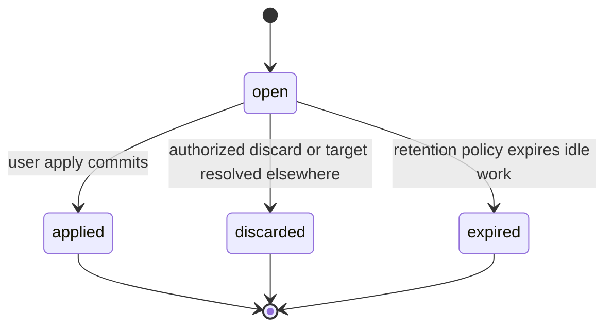

# Agent Configuration Assistant

## Design Position

The configuration assistant helps a User create or change one business Agent in one Workspace. It reads authorized configuration and interaction evidence, edits a reviewable `ConfigurationDraft`, validates the complete candidate, and explains the resulting changes. Only a separate authenticated user command applies that draft to the business Agent.

The assistant is a real, system-maintained Agent with immutable AgentRevisions. It is hidden from ordinary Agent management and cannot be edited or invoked through ordinary product APIs, including by administrators. Configuration conversations remain visible to their owner. The assistant uses the same Session, Thread, Run, RunAttempt, Harness execution, recovery, and usage mechanisms as other hosted work.

Configuration authoring does not install code, create Provider credentials, change IAM, or automatically apply a business Agent Revision. The assistant selects existing authorized resources. Missing resources produce safe setup or authorization guidance. Ordinary Agent management remains usable without a working assistant Model.

## Boundaries

| Concern                                                                                                  | Owner                                                                                                                                                                                                        |
| -------------------------------------------------------------------------------------------------------- | ------------------------------------------------------------------------------------------------------------------------------------------------------------------------------------------------------------ |
| Agent identity, system-purpose restrictions, immutable Revisions and ordinary invocation                 | [Agent Management](28-agent-management.md#system-maintained-configuration-assistant)                                                                                                                         |
| Assistant provisioning, definition synchronization, drafts, configuration conversations, tools and apply | This document                                                                                                                                                                                                |
| User authority, action evaluation and Attempt refresh                                                    | [Service IAM](33-identity-and-access-management.md#configuration-assistant-authority)                                                                                                                        |
| Sessions, Threads, Runs, persistence, continuation and fencing                                           | [Interaction Model](../interaction-model.md), [Thread Persistence](11-thread-persistence.md), [Run Persistence](12-run-persistence.md), [Input and Continuation](18-agent-control-input-and-continuation.md) |
| Conditional mutation, idempotency, audit and publication                                                 | [Durable Operations](06-durable-operations-and-outbox.md)                                                                                                                                                    |
| Provider/Model configuration and execution snapshots                                                     | [Model Management](30-model-management.md)                                                                                                                                                                   |
| Host file mounts and managed Environment selection                                                       | [Environment Management](29-environment-management.md#deployment-bundled-knowledge-mount)                                                                                                                    |
| Authorized Run summaries and retained visible Items                                                      | [Interaction Retrieval](35-agent-interaction-retrieval.md)                                                                                                                                                   |
| Public route catalog and browser integration                                                             | [Management API](16-management-api.md), [Console](../frontend/console.md)                                                                                                                                    |

This contract does not add an Agent-free Run source, relax Run Agent foreign keys, introduce a public inline-definition endpoint, or make a draft a substitute for an accepted executable AgentRevision. Candidate verification uses the execution authority and identity required by its owning Run admission contract; requirements for its evidence are defined below without defining another execution record model.

## System Assistant and Definition Lifecycle

Each Workspace has at most one Agent with `system_purpose=configuration_assistant`. Its `source` is `builtin`; ordinary built-in Agents retain their own visibility. The assistant has normally allocated Agent and Revision IDs, never a shared cross-Workspace record, reserved `0`, or a fabricated reference to the business target.

The first authorized request that actually starts assistant execution ensures the assistant and its initial Revision after Model readiness succeeds. Read-only readiness does not provision records. Concurrent initialization converges on one Agent and Revision v1 under a database uniqueness constraint and the shared idempotency boundary. Creation never exposes an Agent without a valid initial Revision.

The distribution maintains a bounded YAML definition and the associated knowledge bundle as reviewed source. The definition supplies stable instructions, trusted tool selections, capability policy, model-selection preferences, and default budgets. Parsing rejects unknown fields, duplicate keys, arbitrary object tags, executable imports, unresolved bundle references, and invalid budgets. It contains no Workspace credential or user-selectable authority. Installed executable code follows [Installed Harness Plugins](36-installed-harness-plugins.md); knowledge files are not a code-installation mechanism.

An internal synchronization operation maps the deployed definition to a complete valid AgentConfig and immutable Revision. Changed resolved content creates a later Revision and advances the assistant head atomically; identical content is a no-op. Definition identity and content digest remain associated with the corresponding Revision. Definitions that select privileged host capabilities cannot be adopted by ordinary Agent authoring merely by copying a key or configuration value.

Synchronization is deployment authority, not a User's permission to mutate the assistant. Maintenance attribution uses a legitimate system Actor; execution always uses the current User Principal. Concurrent synchronization does not create duplicate revisions for the same content. During rolling updates, an older process cannot downgrade the head; accepted work selects an exact compatible Revision. A rollback of source content follows the normal new-Revision rule instead of repointing the head backward.

New assistant Runs retain their exact Agent/Revision, actual effective configuration, definition digest, and knowledge-bundle selection. Same-Run recovery does not reread the current YAML or Agent head. Compatible Worker capacity and required retained bundles must exist before accepting dependent work; missing or incompatible content fails explicitly. Existing plugin preparation and state compatibility remain independent requirements.

## Model Readiness and Selection

Assistant execution requires an already configured Model Provider available to the Workspace and at least one Model the current User can use for conversation and tool calling. An authorized Organization-shared Provider qualifies. A saved name without required connection configuration, credentials, or a usable Model does not.

Readiness is an authenticated, non-model query. It returns `ready`, a bounded `reason_code`, safe setup actions and `setup_url`, and, when ready, the selected Model reference. Reasons distinguish missing Provider setup, missing Model setup, lack of Model access, and absence of a compatible Model. Users without management permission receive guidance to an authorized administrator; readiness never grants roles, creates credentials, or probes all candidates through paid inference. The setup link identifies the existing Model Provider settings surface in the current Workspace.

Among enabled, configured, authorized candidates with compatible declared capabilities, selection follows this order:

1. GPT-5.6 Luna with `high` reasoning effort.
2. DeepSeek 4.1 Flash.
3. Gemini 3.8 Flash.
4. Any other compatible available Model.

These are preference families, not assumed Provider wire identifiers. Distribution-owned explicit mappings use actual model identity and API capabilities, not editable display names. An unsupported requested reasoning setting makes that candidate ineligible. Other families use settings supported by their actual calling API. Equivalent candidates use a stable Model key/ID ordering. Unknown capability or failed configuration is not proof of readiness; upstream availability remains subject to actual execution.

Every new assistant Run selects using the current User's authorized resources and freezes the actual ModelExecutionSnapshot, settings, and selection policy/reason. Recovery preserves that selection; failure inside an accepted Run does not silently switch models. A later new Run can choose a different eligible candidate. Candidate business configurations retain their own Model selection.

The assistant's initial Revision contains a real Model reference chosen after readiness; no missing or fictitious Model initializes it. Subsequent executions apply the selected authorized Model through the existing model override and final resource-resolution rules. The initial user's credential or personal resource permission is never inherited. A different user's inability to access the initial default does not require using that default when a valid authorized override exists. Per-user selection does not create another assistant Agent or a Revision per conversation.

## Configuration Session and Thread Scope

A configuration Session is an existing Session with protected configuration scope: its User owner, Workspace, and either one business target Agent or an unresolved create target. A configuration Thread is an existing Thread with a current draft association. These are not parallel interaction entities or a separate message store.

The owner can list, read, switch, and continue authorized configuration Sessions and Threads. Every operation checks ownership and the applicable configuration authority. Sharing the same system assistant Agent does not share conversation access. Clients cannot change the owner, Workspace, system assistant, or target through messages, metadata, tool arguments, or a generic Agent override.

Every Thread has at most one open draft. A new Thread can express another editing approach, with its own draft. Each accepted assistant Run freezes its Session/Thread/draft binding; switching Threads or creating a successor draft does not redirect an old Run. User input, waiting questions, feedback, cancellation, retry, and execution state retain their existing interaction lifecycles.

The protected Run context has this conceptual shape. It is stored as accepted Run data, not as a model-editable metadata value or a persisted permission grant:

```python
class ConfigurationRunContext:
    schema_version: Literal["1"]
    purpose: Literal["configuration_assistant"]
    session_id: SessionId
    thread_id: ThreadId
    draft_id: ConfigurationDraftId
    mode: Literal["create", "update"]
    target_agent_id: AgentId | None
    initial_draft_version: int
    source_agent_revision_id: AgentRevisionId | None
    previous_application_receipt: ConfigurationApplicationReceipt | None
    definition_digest: str
    knowledge_bundle: BuiltinSkillBundleRef
```

`BuiltinSkillBundleRef` identifies the immutable bundle, manifest/content digest and logical mount; it contains no client-selected physical path. Owner/Workspace are checked against the Run Principal, Session and draft. `initial_draft_version` documents acceptance; later tool writes still read and compare the current draft version. Same-Run recovery retains the context. Source-preserving successors retain the old draft binding; a new ordinary configuration input binds the current or successor draft under the rules below.

### Sources and Baselines

For an existing target, creating a draft defaults to the target's current immutable Revision; the user can explicitly select a retained authorized historical Revision of that same Agent. A new Agent starts from `empty` with absent config until initialized. Source selectors are `current`, `explicit`, and `empty`; no system-hidden Agent is a valid target or source.

`source_agent_revision_id` and its version identify the immutable original content and never change after draft creation. The source content is read from that retained Revision rather than copied into a second authoritative draft history. `base_agent_revision_id` starts at the source and can change only through explicit rebase. `base_agent_version` captures the target head's current concurrency version, even when the source is historical. Starting from v3 while the current target is v7 therefore records source v3 and expected target head v7.

Reads distinguish original-source-to-draft, merge-base-to-draft, and current-target-to-draft diffs. The apply diff always identifies the current target baseline; source history cannot masquerade as the current state to be overwritten.

### Draft Model and Lifecycle

The following is a conceptual domain schema, not an ORM or serialized wire declaration:

```python
class ConfigurationDraft:
    id: ConfigurationDraftId
    organization_id: OrganizationId
    workspace_id: WorkspaceId
    owner: UserPrincipalRef
    session_id: SessionId
    thread_id: ThreadId
    predecessor_draft_id: ConfigurationDraftId | None
    mode: Literal["create", "update"]
    target_agent_id: AgentId | None
    source_selector: Literal["current", "explicit", "empty"]
    source_agent_revision_id: AgentRevisionId | None
    source_agent_revision_version: int | None
    base_agent_revision_id: AgentRevisionId | None
    base_agent_version: int | None
    version: int
    config: AgentConfig | None
    creation_metadata: CreationMetadata | None
    content_digest: str
    status: Literal["open", "applied", "discarded", "expired"]
    latest_validation: ConfigurationValidation | None
    evidence_refs: tuple[RunId, ...]
    application_receipt: ConfigurationApplicationReceipt | None
```

The relational draft contains the latest complete structured configuration and create-mode name/description. YAML is an import/export representation of the same AgentConfig, not an independently synchronized authority. There is no draft file mirror, writable sandbox copy, history table, or immutable draft Revision per edit. Existing unsupported editor fields are preserved; they cannot be silently dropped by replacement.

`version` starts at 1 and identifies material candidate edits and explicit rebase. It is domain-significant concurrency evidence used by review and verification; it does not address old draft content. A semantic no-op leaves it unchanged. Validation observation updates and terminal-state changes do not invent candidate edits. Public mutable representations have strong ETags; HTTP mutation preconditions also follow the [shared mutation contract](../api-conventions.md#mutations-and-retries). Candidate-changing commands compare the exact expected draft version, and apply compares both that version and the reviewed content digest.

`content_digest` covers canonical config and create-mode metadata. Version and state checks remain necessary even when a digest matches. `config=None` is allowed only for an uninitialized create draft and can never pass readiness or apply. Update mode requires the target and source/base references; create mode retains its original absent target and records the created Agent in its application receipt when the Session target is resolved. Stored references retain organization and Workspace consistency.



Terminal drafts never reopen. Validation success, verification in progress, and stale evidence are observations, not draft lifecycle states. A terminal draft retains its final candidate, source, and receipt or terminal reason for the applicable retention period.

### Continuing After Application

Apply closes the draft and clears the Thread's active draft pointer while retaining its latest draft and receipt. The next ordinary newly accepted configuration input on that Thread, after satisfying normal waiting/control eligibility, creates or reuses one successor open draft atomically with binding the new assistant Run. The default source is the target's then-current Revision; an explicit historical source follows the same source rules. The new input creates the successor even when it is discussion rather than a classified editing request. Merely reading the conversation, retrying old work, or answering an old Run's pending question does not create or select a successor. Waiting-derived Feedback or Continue preserves its source binding even when it carries additional input.

Before the first model request, the host identifies the previous applied draft and receipt, the new draft and version, actual source/current target, and any create-to-update transition. It directs the assistant to read the new draft and not reuse old expected versions or verification results. Current bindings remain available after conversation compaction. This context uses protected identifiers and committed facts, not target instructions or arbitrary user text promoted to authority.

In a create Session, the first successful application resolves the Session to the newly created business Agent. The same transaction closes other open create drafts in that Session as discarded with a target-resolved reason. Later input on those Threads starts update drafts for the resolved target. Concurrent applications cannot create two business Agents from one create Session. Independent creation requires a new create Session.

An old Run remains bound to its original draft and fails further writes once that draft is terminal. It cannot mutate the successor. Generic continuation, feedback, retry, and fork entry points cannot strip or replace configuration scope or bypass this rule.

## Draft Editing and Validation

Model tools and human APIs call the same configuration domain operations. Neither path writes the target Agent directly. Updates accept `expected_version`, an ordered bounded `operations` list, and allowed create metadata or explanatory summary. Paths are string arrays relative to `config`, not record fields or filesystem paths.

| Operation      | Meaning                                                                 | Required limits                                                                             |
| -------------- | ----------------------------------------------------------------------- | ------------------------------------------------------------------------------------------- |
| `set`          | Set a permitted field or replace a complete object/array                | Empty path initializes or replaces complete AgentConfig; no silent loss of preserved fields |
| `remove`       | Remove an optional field or permitted mapping entry                     | Cannot remove required fields or the root                                                   |
| `replace_text` | Replace one exact nonempty `old_text` with `new_text` in a string field | Exactly one match; zero or multiple matches fail; no regex or executable expression         |

A command contains at most 32 operations and is additionally bounded by the service request-size limit. Arrays are replaced as complete values; paths cannot traverse numeric array indexes, wildcard selectors, JSONPath, or executable code. Unknown fields and unauthorized paths fail. No operation can modify ownership, target, source, baseline, status, system-purpose metadata, the assistant definition, or execution authority.

All operations apply to a temporary complete candidate, followed by full AgentConfig, Model parameter, reference, lifecycle, and current binding-authority validation. Any operation or validation error leaves the stored draft and its previously valid report unchanged. Warnings can be saved with the candidate. Successful material edits atomically update the row, advance version once, replace validation, and invalidate incompatible verification observations. An expected-version mismatch cannot be forced through by the model.

There is no separate model schema-discovery or validation tool. Static field and workflow knowledge lives in the built-in Skill; resource tools provide safe dynamic contracts. `update_configuration_draft` validates before saving. A failed update returns bounded field errors; a saved receipt identifies its exact version and digest.

The latest successful-save validation report is bounded data on the draft, tied to its version/digest and relevant dependency observations. An asynchronous observation can replace it only if those values still match; it does not advance the candidate version. Validation does not allocate a separate Validation resource. Apply and execution admission revalidate rather than trusting a previous report.

### Explicit Rebase

When the target changes, apply reports a conflict and preserves the candidate. The user can submit an explicit merged config and the newly reviewed target version through rebase. Rebase validates and atomically replaces the current candidate, merge base, and target concurrency baseline under draft and target preconditions, advances the draft version, and preserves the original `source_*` provenance. Ordinary model edits cannot rebase or force overwrite. Earlier validation or Run evidence does not become current merely because the conflict was resolved.

## User Application

Apply is a deterministic authenticated user command, absent from the assistant toolset. Questions, model output, conversational agreement, and an `approved` tool argument do not invoke it or provide authority. The request identifies the reviewed draft version/digest, expected target version for update mode, accepted dependency observations, selected verification Run references, any explicit unverified/failure acknowledgement with reason, and an idempotency key.

Service reads and prepares the exact candidate and dependency resolution outside the final transaction. It never holds a database session while calling a model, Provider, tool, or storage backend. The final short transaction:

1. checks current User authority and resolves an eligible successful idempotent replay;
2. serializes the Session target, relevant Threads/drafts, and business Agent consistently;
3. rechecks open status, owner, Workspace, exact draft version/digest, target baseline, references, verification applicability, and prepared dependency observations;
4. creates the business Agent and Revision v1, or appends a business Agent Revision and advances its head under Agent Management;
5. closes the draft as applied and records the committed Agent/Revision, reviewed version/digest, user, time, and verification acknowledgement;
6. updates Session/Thread draft associations and resolves create-mode siblings when applicable; and
7. commits the receipt, idempotency evidence, audit, and publication intent together.

No-op application reuses the target's current Revision and closes the draft with an explicit no-change receipt. A failure before commit changes neither target nor draft. A separately committed `create_revision` followed by a later draft-status write is not an atomic apply.

A lost response is reconciled by the same idempotency key or the retained application receipt, not a new application. Applied status prevents a duplicate application even after generic HTTP idempotency evidence expires. Notification failure does not undo committed application. Updated target configuration applies to later ordinary invocations according to Agent Management; existing Runs retain their frozen selections. Historical restoration creates a later Revision and does not undo external effects.

## Verification Evidence and Run Reuse

A verification result belongs to an ordinary Session/Thread/Run and its actual accepted executable configuration. It does not create a parallel Preview execution table, message store, status machine, or usage ledger. A draft reference is only a selector: it grants no permission and does not satisfy the Run's Agent/Revision requirements. An unsupported candidate execution request fails explicitly; Service must not advance the business target, fabricate IDs, or silently test a different configuration to make it executable.

Independent test scenarios use separate test Threads; multi-turn tests continue the same scenario under the existing control contract. Before execution, authorized tests bind the draft ID/version/digest, actual effective-config digest, limits, dependency observations, input, and expected assertions. The assistant can propose tests but cannot rewrite their success criteria after seeing the output. Actual responses come from the tested Agent's Model and tools, not a simulation presented as execution by the configuration assistant.

Verification uses isolated Environment and memory selection where required. The assistant's read-only knowledge mount is not a writable test sandbox. A missing required Environment prevents that test without preventing draft authoring. Tests do not inherit the target's production Thread, personal credentials, or unrestricted external writes. Unclassified or unenforceable tool effects are not treated as safe. Unsupported protocols, child graphs, or dependency substitutions remain explicit in the result.

Static validity, restricted execution, and tests with explicitly selected test resources are distinct outcomes. Structural or permission errors block apply. Unverified or behavior-failing candidates require explicit user acknowledgement under apply policy; the model cannot supply that acknowledgement. A later draft edit or changed behavior-relevant dependency makes old Run evidence stale. Results remain tied to their original accepted input, version and digest, and cannot become a historical draft restore source or an alternative apply payload.

## Model-Visible Tools and Authority

All tools receive a host-bound User, Workspace, Session, Thread, draft, target, and current Run/Attempt context. Model parameters cannot replace these bindings. Tool functions call the Service domain in process; they do not replay browser cookies, use a superuser token, or create a parallel HTTP client. Fixed tool composition and run-bound service dependencies follow the Harness plugin contract.

| Tool                             | Responsibility                                                                                   | Permission and scope                                                                                                                                                                                                |
| -------------------------------- | ------------------------------------------------------------------------------------------------ | ------------------------------------------------------------------------------------------------------------------------------------------------------------------------------------------------------------------- |
| `get_configuration_draft`        | Current candidate, source/base/current target, diffs, version/digest and validation              | Owner and bound Thread; target `agent.read` or create-mode `agent.create`; safe projections only                                                                                                                    |
| `update_configuration_draft`     | Bounded patch, complete validation and atomic save                                               | Target `agent.revision.create` or `agent.create`, dependency binding permissions, open draft/version and Attempt fence; no formal Agent write                                                                       |
| `search_configuration_resources` | Find existing Models/Providers, Connections, Skills, Secret references and Environment templates | Owning resource read actions and scope before pagination; no management or resource execution                                                                                                                       |
| `get_configuration_resource`     | Read one resource's safe metadata and dynamic field/tool contracts                               | Resource read action, current eligibility and feature scope; no credentials or arbitrary configuration passthrough                                                                                                  |
| `read_interaction_run`           | Authorized Run status, summaries and retained visible Items                                      | Existing interaction-read policy, per-page Attempt snapshot/live checks, configuration ownership where applicable, and host-selected evidence scope; no raw Trace or state                                          |
| `start_run`                      | Request execution of an authorized runnable reference through common Run admission               | Exact host-authorized source, current configuration and resource-use permission, user execution grant, budget and fence; unsupported references fail, arbitrary inline config/Agent/Thread selection is unavailable |
| `ask_user_question`              | Clarify the user's requirements                                                                  | Bound pending question and current conversation; normal user-input/feedback authority; an answer grants no apply or resource permission                                                                             |
| `view`, `ls`, `glob`, `grep`     | Read the deployed configuration Skill                                                            | Exact knowledge-bundle mount, read-only file ceiling and confined paths; no user filesystem, writes or process execution                                                                                            |

The host exposes only the applicable common Run tools, not all conversation-management actions. Resource IDs and runnable references are not tokens. Tool retries use stable logical-call idempotency so replay cannot duplicate a mutation or Run. User-started execution and model-started execution share admission, budget, fencing and actual execution rules.

The assistant has no apply, rebase, role-management, credential-reading, arbitrary SQL/HTTP, shell, file mutation, or code-installation tool. Configuration update already performs validation; separate schema, validate, propose-preview, and configuration-specific Run start/result tools are not exposed. The Harness question tool retains its own parameter schema and pending interaction contract.

### Safe Resource Projections

Resource tools use explicit bounded allowlisted responses. Administrative read DTOs, ORM objects, arbitrary Provider configuration, raw exceptions, and unknown newly added fields are not passed through to the Model.

| Resource                        | Permitted facts                                                                              | Excluded facts                                                                            |
| ------------------------------- | -------------------------------------------------------------------------------------------- | ----------------------------------------------------------------------------------------- |
| Model / Model Provider          | ID, name, type, reviewed capabilities and parameter schemas, configured/available status     | API keys, extra header values, credential URLs and raw Provider configuration             |
| Connection                      | ID, name, current state, authorized tool names and safe schemas, authorization-needed status | OAuth/access/refresh tokens, cookies, credential headers and raw connection configuration |
| Secret                          | Authorized reference/key, purpose, ownership and configured/bindable status                  | Plaintext, ciphertext, token fragments or any reconstruction material                     |
| Environment Template / Provider | Authorized identity, revision, capabilities and safe resource requirements                   | Secret environment values, login credentials and credential-bearing scripts/configuration |

Schemas are also projections: examples, defaults and descriptions do not bypass content and secret controls. Service generates scoped setup links; resource-provided arbitrary URLs are not trusted navigation. These constraints apply to administrators as well. Resource-reading tools do not call credential decryption APIs; actual execution resolves permitted credentials at the owning resource boundary.

Target instructions, user Skill content, Run text, tool descriptions, and user-supplied configuration are data rather than assistant authority. Known credentials are withheld and corrected through references; generic free-text detection is not a guarantee of finding every embedded secret. Masked placeholders cannot overwrite preserved protected values. Logs, stream events and model-visible failures observe the same sensitive-data constraints.

## Deployment-Bundled Skill

The distribution packages a `configure-agent` Skill containing `SKILL.md` and referenced configuration, editing, validation and Run workflow knowledge. Field documentation stays aligned with the supported AgentConfig and tool contracts. The assistant instructions contain its responsibility and authority boundaries plus the Skill metadata/loading guidance; reference documents are read on demand, not all embedded into every instruction payload.

The model-visible root is `/environment/builtin-skills`; its entry is `configure-agent/SKILL.md`. Service resolves the physical directory from the installed bundle identity. Clients, model arguments and editable resource metadata cannot select that directory. Only the bundled source is discovered: no project, User, Thread, or target-Agent Skill directory is implicitly added.

The image contains an immutable bundle manifest and file content digests. The Worker runtime user cannot modify its files or ancestor mount configuration; directories and files are read-only and cannot be overlaid by user-writable data. The bundle contains no deployment secrets. A fresh Direct Local adapter confines all operations to that root, sets read-only access, and enables no shell profiles, executable allowlist, inherited environment or ports. Root confinement includes resolved-path and escaping-symlink checks; setting a working directory alone is insufficient.

The host composes the existing Harness Skill discovery/manager/capability and the four read-only file tools over the fixed mount. Skill workflow steps invoke the authorized configuration tools; they do not execute local scripts. The mount does not create a managed Skill, SkillRevision, Environment Provider, Template, or Environment row and is never stored as a fake `Run.environment_id`. This narrow host-content grant is owned by the Environment contract and does not enable ordinary local Provider selection.

An accepted Run freezes its bundle manifest/digest and logical mount selection with its protected configuration context. Each preparing Attempt verifies the exact bundle before model reads. Deployment retains bundles required by recoverable work and supplies compatible Workers; missing, corrupted or incompatible bundles fail preparation rather than fetching or substituting the newest package. Ordinary managed Skills and candidate execution keep their own resource locking and Environment requirements.

## API and Persistence Boundary

Routes use the `/api/v1` prefix, shared authentication, request limits, error envelopes, pagination, conditional mutation and idempotency conventions. The configuration feature provides these operations:

| Operation                          | Route                                                           |
| ---------------------------------- | --------------------------------------------------------------- |
| Read readiness                     | `GET /workspaces/{workspace}/configuration-assistant/readiness` |
| Create/list configuration Sessions | `POST/GET /workspaces/{workspace}/configuration-sessions`       |
| Read a configuration Session       | `GET /configuration-sessions/{session}`                         |
| Create/list configuration Threads  | `POST/GET /configuration-sessions/{session}/threads`            |
| Read a configuration Thread        | `GET /configuration-threads/{thread}`                           |
| Submit assistant input             | `POST /configuration-threads/{thread}/inputs`                   |
| Read/update the current candidate  | `GET/PATCH /configuration-drafts/{draft}`                       |
| Explicit rebase                    | `POST /configuration-drafts/{draft}/rebase`                     |
| Apply reviewed content             | `POST /configuration-drafts/{draft}/apply`                      |
| Discard                            | `POST /configuration-drafts/{draft}/discard`                    |

The Session and Thread routes project the existing interaction identities plus protected configuration associations. They do not allocate separate ConfigurationSession or ConfigurationThread identities. Submission returns the actual Session/Thread/Run references and follows the existing busy/waiting/queue eligibility rules; retaining or consuming input cannot redirect a previously accepted Run to another draft.

Draft reads include authorized source, merge-base and current target references/content, their correctly based diffs, current candidate version/digest, validation and evidence references, and terminal receipt. API representations and LLM projections are separate allowlists. Run APIs expose the real assistant Agent/Revision correlation without making its hidden management definition readable. Existing events, streams, feedback and cancellation follow their owners with the configuration scope checks; no new SSE or parallel control protocol is defined.

Session scope, draft associations, and candidate/receipt updates commit through relational authority. Draft JSON is the sole current candidate; existing object storage retains Run state, large outputs and attachments. No database connection survives an external call, model loop, user wait, stream or object read. Durable references and application receipts remain retained while dependent Runs, drafts or formal Revisions require them. Cleanup cannot delete a referenced system assistant Revision or treat notification delivery as deletion authority.

## Failure and Compatibility

| Condition                                     | Observable result                                                                               |
| --------------------------------------------- | ----------------------------------------------------------------------------------------------- |
| No configured authorized compatible Model     | Setup/permission guidance; no assistant Run, existing drafts retained                           |
| Invalid patch, config, resource or permission | Safe field/operation failure; no candidate or formal configuration change                       |
| Draft/target changes during preparation       | Conflict, preserved candidate; no silent rebase or different candidate execution                |
| Stale Attempt attempts a write                | Fence failure even if version matches                                                           |
| Model failure or user cancellation            | Preserve committed draft edits and usage; no apply                                              |
| Apply response or notification is lost        | Reconcile the committed receipt; no duplicate Agent/Revision                                    |
| Old Run resumes after its draft is applied    | It retains the old binding; terminal-draft writes fail                                          |
| Bundle or Worker compatibility is unavailable | Explicit preparation/recovery failure; frozen configuration is not replaced                     |
| Verification evidence is unavailable or stale | Mark unverified/stale, never synthesize a passing result                                        |
| Shared assistant is used by several Users     | Each conversation, tools, credentials, reads and costs remain scoped to its actual User and Run |

The assistant preserves normal Agent IDs, non-null Agent/Revision Run references, immutable effective configuration, ordinary Run status, and existing usage receipts. System-purpose metadata, draft resources and protected configuration contexts extend their owning schemas under the [schema lifecycle](04-relational-schema.md). Existing ordinary Agents have no system purpose. Older API/Worker code that cannot enforce hidden-resource or configuration-context rules cannot serve this feature; deployment must establish compatible handling before enabling it. Existing non-configuration Runs retain their behavior.

Run cost belongs to the real assistant Agent/Revision and actual User, Model and Provider; the edited business target is separate context. Verification cost belongs to its actual execution Run. Reading another Run does not ingest its usage again, and grouping by a draft does not add both a Run subtotal and the same raw receipts. Unknown prices remain unknown. Trace is observational and obeys configuration ownership; Agent-list hiding neither authorizes cross-user Trace access nor suppresses the owner's authorized execution history.

## Invariants

01. A system assistant has a real same-Workspace Agent/Revision; no reserved identity or relaxed Run foreign key represents it.
02. Ordinary discovery, direct reads, edits, export, copy, lifecycle, invocation and reference paths cannot access the hidden assistant, including as Admin.
03. Configuration execution represents the actual User and never grants a role or reuses the initializer's credentials.
04. One Thread has at most one open draft; an accepted Run's binding never follows a later active-draft pointer.
05. Patches validate the complete candidate and commit all operations or none; successful save is distinct from application.
06. Application commits the reviewed candidate and receipt atomically; competing create-mode Threads produce at most one target Agent.
07. Post-apply user input explicitly informs the Model of the successor draft, source and mode; old feedback or retry cannot mutate it.
08. Built-in Skill reads are root-confined, immutable, version-verified and independent of user Sandbox configuration.
09. Model-visible resources and errors exclude credentials for every role; target content cannot change tool authority.
10. Verification cannot mutate the target head or claim to execute a candidate without valid execution admission and exact provenance.
11. Recovery retains exact Revision, effective configuration, bundle and context while re-evaluating authority and fencing.
12. Usage and interaction evidence reuse their existing identities, retention and deduplication; hidden Agent identity does not hide the owner's configuration conversation.
