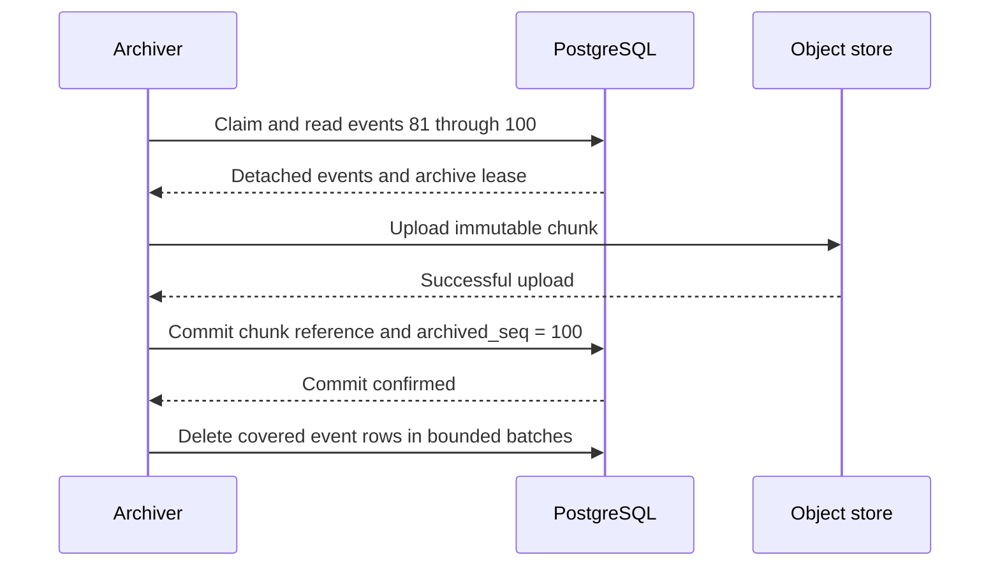

# Storage and archival

> Discussion proposal, not the current specification. See [status and scope](README.md).

## Storage responsibilities

| Store      | Responsibility                                                                                                            | Reason                                                                               |
| ---------- | ------------------------------------------------------------------------------------------------------------------------- | ------------------------------------------------------------------------------------ |
| PostgreSQL | Durable recent events, execution and accounting transactions, sequence allocation, checkpoint references, chunk directory | Already required; supports atomic business changes and acknowledgements              |
| S3         | Immutable historical event chunks, checkpoints, and large referenced content                                              | Cheap durable bulk storage without repeatedly overwriting accumulated history        |
| Redis      | Optional provisional output and wakeups                                                                                   | Deployments need not enable Redis persistence; it cannot acknowledge durable history |

Writing every event directly to S3 is not the selected design. Small writes increase request overhead, and the object store cannot atomically commit an event with inbox consumption, Usage ingestion, or a child relationship in PostgreSQL. Waiting to fill an in-memory S3 chunk would also leave acknowledged history vulnerable to a process crash. PostgreSQL supplies the durable staging boundary; S3 receives bounded batches.

## Tables and bounded fields

Use dedicated rows for growing collections. The following are logical schemas, not generated DDL; every reference also follows the existing organization/workspace integrity rules.

```text
sessions
  ... existing fields ...
  journal_seq                         # last committed Session-wide position

log_streams
  id, session_id, run_id NULL          # NULL run_id identifies the control stream
  head_seq, archived_seq
  checkpoint NULL, checkpoint_requested_seq NULL  # Run streams only
  checkpoint_lease_token NULL, checkpoint_lease_expires_at NULL
  pending_bytes, oldest_pending_at NULL
  archive_requested, archive_lease_token NULL, archive_lease_expires_at NULL
  UNIQUE(run_id) WHERE run_id IS NOT NULL
  UNIQUE(session_id) WHERE run_id IS NULL

log_events
  stream_id, seq, session_id, session_seq, event_id
  kind, recorded_at, encoded_size, payload
  PRIMARY KEY(stream_id, seq)
  UNIQUE(session_id, session_seq)

log_chunks
  id, stream_id, first_seq, last_seq
  first_session_seq, last_session_seq
  event_count, object_key, digest, stored_bytes, decoded_bytes, codec
  UNIQUE(stream_id, first_seq)

run_checkpoints
  id, run_id, through_seq, object_key, digest, size, boundary_kind
  UNIQUE(run_id, through_seq)

runs
  ... execution fields ...
  base_state                          # fixed source Run/position, or initial seed
  sealed_state_seq NULL                # execution cut fixed at Run seal
  resume NULL                          # accepted answers owned by a successor

run_attempts
  ... existing fields ...
  journal_batch, journal_batch_digest # bounded execution-producer retry evidence
```

`payload` contains the full event envelope described in [the journal model](01-journal-model.md#event-envelope); indexed envelope fields are ordinary columns as needed. These tables do not require a generic object catalog or an event payload GIN index. Use the stream/sequence keys for Run reads and Session sequence range metadata for merged reads. Session-range lookup also needs an efficient join through `log_streams.session_id`.

The separate stream row lets archive progress, latest-checkpoint publication, and late accounting advance without modifying a sealed Run. The Run API exposes its latest checkpoint through this joined metadata. Latest-checkpoint and base references are bounded fields. The `display` pointer and `usage_at_seal` snapshot are removed; Display comes from events and current totals come from the ledger. Historical checkpoint entries are retained in `run_checkpoints`, not an array on `runs`.

The directory is a physical lookup structure, not an index of latest Display card states:

| Stream | Event range | Object key                        |
| ------ | ----------- | --------------------------------- |
| Run A  | 1–100       | `orgs/O/journal/L/chunks/chunk_a` |
| Run A  | 101–200     | `orgs/O/journal/L/chunks/chunk_b` |
| Run A  | 201–280     | `orgs/O/journal/L/chunks/chunk_c` |

A read of events 150–180 needs `chunk_b`, not every earlier object. Chunk sizes are governed by bytes; equal event counts above are only an example. Directory rows remain in PostgreSQL after the corresponding `log_events` rows are deleted. Permanent metadata therefore grows with the number of chunks and checkpoints, even when the recent-event table reaches a steady size.

## Object format and references

A chunk holds an immutable ordered sequence of complete event envelopes, for one stream and one contiguous inclusive `seq` range. Use newline-delimited JSON with optional whole-chunk compression, initially Zstandard. The catalog records the codec and both stored and decoded sizes. Digest validation applies to the stored bytes; readers also validate decoded bounds, event count, identity, and contiguous sequence coverage. Do not build a random-access index within a chunk initially: bounded chunks make reading and decoding one complete relevant chunk acceptable.

Use unique owner-scoped keys, for example `orgs/{org}/journal/{stream}/chunks/{chunk_id}` and `orgs/{org}/runs/{run}/checkpoints/{checkpoint_id}`. Retrying one upload writes exactly the same bytes to its selected key. Different candidates never overwrite the same key. The committed PostgreSQL reference, not an S3 prefix listing, makes an object visible.

An event may refer to a separately stored large result or attachment. Chunk cleanup and checkpoint replacement must not collect content still reachable through historical events or retained snapshots. Initially retain committed journal content for the same lifetime as its owning history. General historical retention and destructive Session deletion policies are outside this refactor; checkpointing and Run completion never delete that history.

## Archival algorithm

Archive when pending encoded bytes reach a configured threshold, the oldest unarchived event reaches a maximum age, or Run sealing, including a deferred wait, requests a flush. The age trigger also archives short Session control streams and late accounting tails. A new tail after a completed flush starts a new age deadline. A full chunk is not required before writing a final or aged tail.

For one stream:

1. In a short transaction, claim an archive lease and select a bounded contiguous batch beginning at `archived_seq + 1`. Copy the complete event bytes and close the transaction.
2. Encode the chunk and upload it outside PostgreSQL. Record its digest, size, and exact event range.
3. In a short transaction, validate the lease and the unchanged starting `archived_seq`. Insert its `log_chunks` entry and advance `archived_seq` to its end together. Reduce pending byte accounting by the selected batch and retain any later tail.
4. Reclaim matching PostgreSQL event rows in separate bounded cleanup transactions. Cleanup only removes rows with `seq <= archived_seq` under the committed catalog.

Two archivers cannot publish overlapping ranges: only one can advance from the expected prefix under its valid lease. A stale candidate is an unreferenced object, never an alternative visible history. Event appenders can continue while a chunk uploads; their later events form another batch.



An S3 upload alone is insufficient permission to delete PostgreSQL events. Publication of the chunk reference is the durable acknowledgement. Conversely, a successful checkpoint is never permission to delete unarchived events: Display and historical inspection still need them.

## Consistent reads across both stores

Display and state recovery use the same journal reader. A read fixes an upper committed event position `H`. For each bounded page or replay batch:

1. In one short, consistent PostgreSQL snapshot, read the applicable archive boundary `A`, the required committed chunk references, and detached PG event bodies for the requested range above `A`, limited to `H`.
2. Close the transaction, then fetch the referenced S3 chunks. Use S3 for positions at or below `A` and the detached PG rows for positions above `A`.
3. Validate coverage and return the requested order. A missing event, missing committed object, or corrupt object is an error; do not silently skip it.

A short repeatable-read transaction is sufficient when several SQL statements are needed; it performs no object I/O. If archival commits concurrently, the reader sees either the old catalog with its visible PG copies, or the new catalog with the object references. Deferred deletion does not produce duplicates because the chosen boundary determines which copy to use.

Pagination pins the logical upper bound, not an old physical archive boundary. The next page resolves the current location of its requested events again; they may have moved to S3 since the previous page. Historical objects remain referenced, so no long-lived database transaction or object lease is needed across pages.

For a Session read, use `session_seq` as the logical bound and merge the relevant streams. Chunk `first_session_seq` and `last_session_seq` are search bounds, not a claim that every position inside them belongs to that stream. Filter and merge actual event positions after decoding. Limit chunk fetch concurrency and the amount of work per response; do not download every Run in a Session to show one page.

## Checkpoint and archive progress are independent

Let `C` be the latest checkpoint's covered Run sequence, `A` the stream's archived sequence, and `H` its head. Both `C` and `A` are at most `H`; either may be ahead of the other.

| Positions            | Recovery                                           | PG cleanup                                 |
| -------------------- | -------------------------------------------------- | ------------------------------------------ |
| `C=64, A=80, H=100`  | Checkpoint 64 + S3 events 65–80 + PG events 81–100 | Only events through 80                     |
| `C=100, A=80, H=100` | Checkpoint 100                                     | Events 81–100 stay for future archival     |
| `C=64, A=100, H=100` | Checkpoint 64 + S3 events 65–100                   | All covered PG event copies may be removed |

No trigger forces `C` and `A` to match. Sealing a Run requests both jobs for their separate purposes, including when it seals waiting; neither job waits for the other. Execution resources can be released once continuation and pending requests have committed to PG, without holding them until either S3 job finishes.

## PostgreSQL cost and failures

An event normally causes an insert and eventually a delete, plus indexes and WAL. Avoid an additional per-event `archived=true` update; the stream watermark already supplies that information. Bound cleanup batches and concurrency, let autovacuum reclaim dead tuples, and monitor oldest pending age, pending bytes, archive failures, delete lag, dead tuples, WAL, replication lag, and statement latency. Do not add partition rotation or a separate database until measured load warrants it.

The live tail is approximately event rate multiplied by average event size and archival delay, before indexes, WAL, and vacuum overhead. If archiving succeeds but deletion falls behind, PG also contains safely archived duplicates. Both backlogs need limits and monitoring.

- PG commit failure means no durability acknowledgement and no dependent execution advance.
- S3 failure leaves the events in PG. A configured backlog bound eventually stops new execution/admission that would increase it; reserve bounded capacity for terminal/control facts and already in-flight accounting.
- Commit uncertainty is resolved through producer cursors or committed chunk metadata, not by assuming an error means rollback.
- Uploads without published references are orphan candidates. Collect them only after their producer has irreversibly lost publication authority and current catalog references have been checked. Never delete solely because an object is old.
- A missing or corrupt committed chunk is a storage fault. Retry or surface unavailability; checkpoint coverage is not a reason to pretend the journal entry never existed.

S3 or PG outages do not trigger a switch to Redis or an unbounded in-memory queue. The existing outbox can handle suitable bounded cleanup work, but journal retention must replace the old checkpoint-prefix deletion assumptions.
