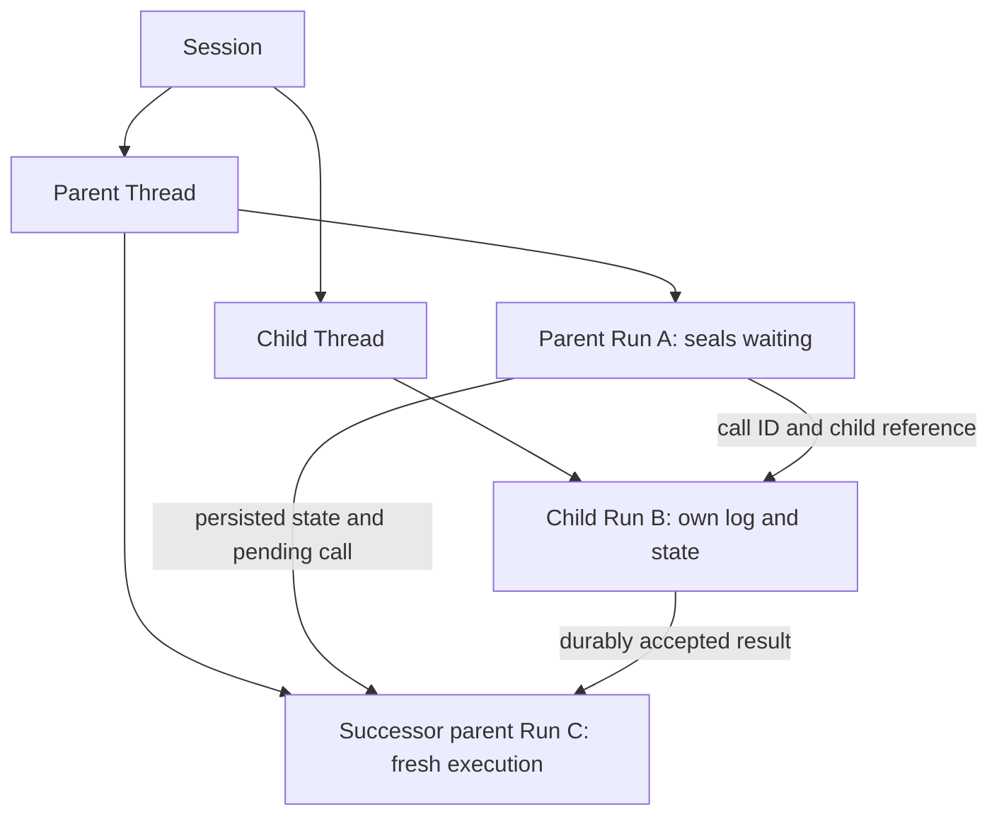

# Usage and subagent ownership

> Discussion proposal, not the current specification. See [status and scope](README.md).

## Usage is a ledger concern

The Service already has `usage_records` and independent delta ingestion. Its current worker also starts recovered Harness execution with `resume_usage=False`. The proposed change finishes that separation: Service checkpoints no longer carry the historical `a13n.usage` namespace, and the Service does not restore old charges into a new Harness accumulator.

```text
Attempt 1 Harness scope       Attempt 2 Harness scope
records A, B                  records C, D
       |                             |
       +------------+----------------+
                    |
             usage_records
             A + B + C + D
```

Starting Attempt 2's local accumulator at zero does not reset the Service total. The ledger still contains A and B. Run, Thread, Session, and child-tree totals query the appropriate ledger rows through their owning Run relationships. A currently running Harness can keep its own in-memory accounting normally; it does not need the lifetime Session ledger inside its continuation state.

## Ingestion and journal events

Keep the existing accounting identities and delivery validation rather than designing a second billing system:

1. A new Harness accounting scope belongs to one Attempt. Every report identifies its scope and stable contribution or receipt IDs.
2. The Service validates attribution, report sequence, and existing contribution rules.
3. In one short transaction, it writes accepted ledger changes, advances accounting delivery progress, and appends the corresponding `usage.recorded` events to the owning Run journal.
4. It acknowledges the report after commit. An identical retry produces neither another charge nor another journal fact.

A model contribution may be refined when more complete usage arrives. For example, an initial observation of 1,000 input tokens can later receive 120 output tokens and a priced cost. The ledger keeps its accepted current contribution; the journal appends the newly accepted observation under the same `record_id`. Do not add both observations as separate charges. An accounting-history view replaces that ID's earlier observation when calculating totals at a historical position.

A journal accounting event contains the accepted values and attribution needed to explain that observation, including price/cost uncertainty. Merely storing a pointer to a mutable ledger row would lose the earlier observation's meaning. Stable provider receipts still retain one owner and are not double-counted as model charges.

Late accounting is accepted after an Attempt loses its execution lease or a Run terminates, subject to accounting ownership validation. It appends to the same Run stream and remains eligible for age-based archival. It cannot mutate execution state, revise the terminal outcome, or authorize another tool call.

An unknown provider charge that was never reported remains unknown. This refactor does not add provider-bill reconciliation or reinterpret a missing usage report as zero cost.

## Limits and public totals

Service request-count limits continue to be checked by the Service before dispatch, using durable accounting and admitted/in-flight progress as required by the existing call check. They must not depend on a fresh Harness accumulator, otherwise takeover would reset the limit. Preserve the current enforcement/concurrency guarantees while changing where records are attributed; this proposal does not strengthen them into a transactional monetary reservation system.

The proposed scope is explicit: each hosted Run has its own request limit and own usage records. A child Run receives its own selected request limit. Parent, subtree, Thread, and Session totals can all be queried, but an aggregate total is not automatically a shared budget. The move from inline children to child Runs changes the old inline accounting scope; implement and document this boundary deliberately rather than accidentally dropping children from a purported parent-tree total.

There is no new Session or Run monetary-cap feature here. If one is added later, the Service can evaluate the ledger, define the aggregation scope, and allow a documented in-flight overrun for a soft cap. An exact financial reservation mechanism is outside this design.

The API reports ledger totals, including late reports, instead of persisting another Usage snapshot in `runs.usage_at_seal`. A “cost known when the Run ended” view, if needed, can be derived from recorded observations at the terminal journal position; it is not an execution checkpoint field.

## Every hosted child has its own Thread

Both synchronous and asynchronous delegation create a child Thread in the same Session. The child owns its own Run, Attempts, journal, Usage records, and checkpoints. A later continuation of that child uses another Run in the same child Thread.

The parent state contains a bounded continuation reference such as:

```json
{
  "origin_run_id": "run_parent_example",
  "call_id": "call_delegate_example",
  "child_thread_id": "thr_child_example",
  "child_run_id": "run_child_example",
  "mode": "sync",
  "status": "waiting"
}
```

It does not contain the child's complete message history, Usage accumulator, Capability state, or nested descendants. Once the successor incorporates the result, remove the pending descriptor from that successor's active state. The old waiting Run stays unchanged. The journal retains the relationship and result history; the child Thread retains its own state.



## Synchronous and asynchronous behavior

| Concern                          | Synchronous child                                                  | Asynchronous child                                     |
| -------------------------------- | ------------------------------------------------------------------ | ------------------------------------------------------ |
| Delegation tool's initial result | Pending until the child settles                                    | Returns a child handle                                 |
| Parent's next model step         | Waits for the child result                                         | May proceed immediately                                |
| Result delivery                  | A successor parent Run incorporates the original tool-call result  | Queues one later child-result notification             |
| Worker while waiting             | Released; no occupied execution slot                               | No parent wait required                                |
| Parent cancellation              | Explicit parent stop or Thread archive requests child cancellation | Does not implicitly cancel independent child execution |
| Persistence and ownership        | Own Thread/Run/journal/checkpoint                                  | Own Thread/Run/journal/checkpoint                      |

These differences are real even though storage is unified. In particular, an asynchronous notification is not a second completion of a tool call that already returned a handle.

## Durable delegation sequence

A synchronous hosted delegation is a deferred tool call, not a Python task that remains alive while another worker runs the child. Use the existing export-and-resume boundary:

1. Use `(origin_run_id, origin_tool_call_id)` as the durable child-creation identity. Store that original identity with the child reference. Successor parent Runs retain it; their new Run IDs must not cause duplicate child creation.
2. Commit the child Thread and initial Run/input, parent pending reference, and related journal facts. Seal the parent Run `waiting` with its exact pending call and state cut, finish its Attempt, then close the Harness and release its worker slot and process-local resources.
3. Execute the child under its own worker lease and journal only its own state. If the child also needs approval, it seals waiting and later resumes through a successor child Run. The parent awaits the linked child continuation's result; a child `waiting` outcome is not completion.
4. Child completion durably schedules result delivery. For synchronous delegation, match the original parent waiting Run and call, validate that this is still the eligible waiting head, and accept the result into a new successor parent Run. For asynchronous delegation, enqueue the existing child-result notification instead. Persist acceptance and idempotency before sending any wakeup.
5. A worker claims the successor, reconstructs the selected waiting state, and invokes a fresh Harness Run with the accepted deferred result. The old parent Run stays sealed. A lost wakeup is recovered by a sweep; no worker, process, coroutine, or connection has to survive the wait.

The successor stores the accepted result batch until its committed state incorporates it. Retry of result delivery returns the already accepted successor; Attempt recovery uses its unincorporated batch rather than spawning a child or consuming a result twice. Later independent child continuations do not complete the old pending call again.

Preserve complete native pending-batch coverage. Results of Service-owned child calls come from trusted durable child delivery, not client-supplied substitutes. If a suspension contains several child calls or also external approvals, keep arrived results durably and construct the complete correlated resume batch only when the required inputs are present. This does not require partial public approval submissions or a live aggregate waiter.

Scheduling, successor acceptance, and model-history incorporation are separate acknowledged steps. An unavailable/full inbox defers asynchronous delivery. If an asynchronous origin has completed, its result can become queued input for a subsequent Run through normal Thread acceptance. Failed/cancelled origins and archived Threads do not automatically start another Run from a late notification.

Process failure is not user cancellation. It leaves durable child identity, waiting state, and pending delivery available for another process. Explicit cancellation of an active parent or archive of its Thread requests cancellation of linked synchronous children by default; asynchronous children remain independent. A sealed waiting Run is never rewritten as running or cancelled to implement this policy. Child failure supplies an explicit failed tool outcome or notification, not a fabricated successful result.

## State, environments, and permissions

Parent and child communicate through explicit inputs, results, and references. They may share mounted environment instances under the accepted edge policy, but that does not promise isolated files or rollback of concurrent file changes. Their in-memory Capability objects are independent.

The child uses frozen agent/model/resource selection and authority appropriate to its accepted binding, never broader permissions inferred from being in the same Session. Synchronous hosting must retain equivalent tool access and constraints where supported. Unsupported reliance on borrowed mutable Python objects is rejected or replaced by an explicit input/result contract; do not recreate nested checkpoints to preserve that behavior.

Child depth and concurrency remain bounded. A sealed waiting parent uses no execution slot, so its child can run even with a small worker pool. Parent and successor remain in one Thread, the child has a separate Thread, and Session ordering provides a combined timeline without copying child events into a parent journal.
