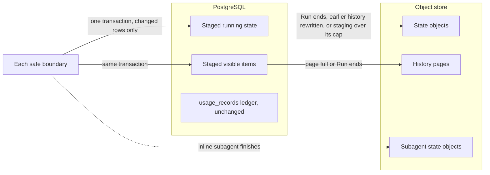

# Service run persistence proposal

> **Discussion proposal, not the current specification.** This directory records a design under discussion in [issue #849](https://github.com/converge-ai-labs/agent-foundation/issues/849). It does not describe implemented behavior, amend the accepted Service specification, or authorize implementation by itself. The existing [Service chapters](../README.md) remain authoritative until a reviewed change adopts and implements the proposal. Field names, routes, and initial values below are proposed.

This proposal is kept in a separate Service subdirectory at the project owner's request. That placement is an exception to the repository's usual practice of keeping proposals in GitHub Issues; it does not make this material normative.

An earlier draft in this directory proposed a semantic event journal. Review replaced it with the smaller design below; see [what was dropped](04-validation-and-rollout.md#dropped-from-the-earlier-draft).

## Problem

A long-running Service conversation pays costs that grow with the conversation rather than with what changed:

1. **Every safe boundary rewrites everything.** Before each model request and each tool batch, the worker serializes and uploads the complete Harness state and the complete Display, then moves two pointers in a fenced transaction ([`execute.py`](../../../packages/a13n-service/a13n_service/runs/execute.py), [`checkpoints.py`](../../../packages/a13n-service/a13n_service/runs/checkpoints.py)). Tool execution waits for that commit. #781 estimated about 9–10 MB uploaded per boundary to record 5–20 KB of change once Display reaches its cap.
1. **Bookkeeping can fail a long Run.** The state object carries data the Service never restores: `a13n.usage` (up to 10,000 records per attempt, while the Service resumes with `resume_usage=False`) and the complete state of every retained inline subagent (`a13n.subagents`, never pruned). An object over `objects.max_bytes` (16 MiB by default) fails the Run with `payload_too_large`. After a retained subagent's revision changes, every later Run of the Thread fails at start with `subagent_state_incompatible`.
1. **Visible history is truncated and unpaged.** Display keeps at most 4096 items and `worker.display_bytes` (8 MiB); older items are dropped or emptied, and compaction removes old messages from state as well. `GET …/runs/{run}/items` returns the whole retained Display.

## The proposal in one paragraph

Split the package that every boundary uploads. Usage stays only in its ledger. Inline subagent states become separate objects referenced from the parent. While a Run executes, PostgreSQL stages only what changed: messages that differ from the Run's start object, changed Capability namespaces, and changed visible items, all in the existing boundary transaction. Object storage receives complete values at a few moments: the Run's state when the Run ends (or earlier, when history is rewritten or staging grows too large), visible items in immutable pages when a page fills, and a subagent's state when it finishes.

| Piece                 | Today, at every boundary              | While the Run executes                                | Final home                                |
| --------------------- | ------------------------------------- | ----------------------------------------------------- | ----------------------------------------- |
| Messages              | Inside the complete state object      | Rows for positions that differ from the start object  | State object                              |
| Capability namespaces | Inside the complete state object      | Rows for namespaces that differ from the start object | State object                              |
| `a13n.usage`          | Inside the complete state object      | Not persisted with state                              | `usage_records` only                      |
| Inline subagent state | Inside the parent's `a13n.subagents`  | Parent keeps a registry entry with a reference        | Subagent state object, written once       |
| Visible items         | Complete Display object (4096, 8 MiB) | Rows for changed items                                | Immutable history pages, kept permanently |

After this change, a boundary is one PostgreSQL transaction that writes only changed rows, and tool execution no longer waits for object storage. Object storage is written only when a Run ends, earlier history is rewritten, a Run's staging exceeds its cap, a visible-item page fills, or an inline subagent finishes.

## Unchanged

- One fenced transaction remains each boundary's durability point. Lease fencing, at-most-once input incorporation, and pre-effect tool durability are unchanged.
- Completed and waiting Runs still seal with a complete state object, so continue, fork, resume, and child-result successors start exactly as today.
- Waiting and deferred-resume lifecycle, subagent hosting, and the live thread stream protocol are unchanged. Inline children still execute inside the parent tool call; asynchronous children remain separate Threads and Runs.

## Not in scope

- A semantic event journal, historical state inspection at arbitrary positions, Session-wide timelines or control journals, and usage events in a journal.
- Hosting synchronous subagents in separate Threads, or recording asynchronous subagents in parent state.
- The Harness usage-scope capacity of 10,000 records per attempt, and durability of an inline child's progress while it runs. Both are left for separate proposals.
- Reading or converting data written before the cutover. The change is a clean breaking cutover; deployments start from a fresh store.

## Reading order

| Document                                                   | Owns                                                                        |
| ---------------------------------------------------------- | --------------------------------------------------------------------------- |
| [01: Running state](01-running-state.md)                   | State contents, staging, change detection, merges, recovery, subagent state |
| [02: Visible history](02-visible-history.md)               | Visible items, history pages, reads, interruption                           |
| [03: Storage and APIs](03-storage-and-apis.md)             | Tables, object keys, background job, cleanup, API and settings, cutover     |
| [04: Validation and rollout](04-validation-and-rollout.md) | Capacity model, measurements, guardrails, tests, order, decisions           |
