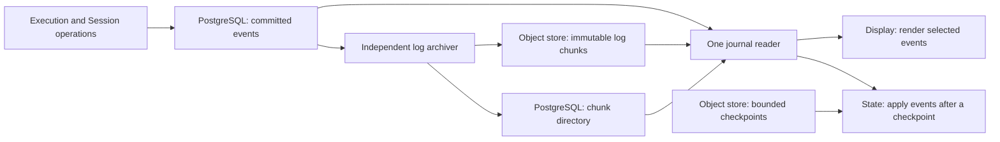

# Service journal and checkpoint proposal

> **Discussion proposal — not the current specification.** This directory records a design under discussion. It does not describe implemented behavior, amend the accepted Service specification, or authorize implementation by itself. The existing [Service chapters](../README.md) remain authoritative until a reviewed change explicitly adopts and implements the proposal. Examples, field names, routes, and initial tuning values below are proposed contracts.

This proposal is intentionally kept in a separate Service subdirectory at the project owner's request. That placement is an exception to the repository's usual practice of keeping proposals in GitHub Issues; it does not make this material normative. The motivating problem is [issue #781](https://github.com/converge-ai-labs/agent-foundation/issues/781): repeatedly uploading complete execution state and display history costs more bandwidth as a conversation grows.

## The proposal in one paragraph

Commit aggregated execution and Session events to PostgreSQL. Archive those events into immutable, bounded object-store chunks, retaining the complete logical history. Render Display directly from individual journal events. Recover execution state from a bounded checkpoint plus subsequent events. Write checkpoints periodically rather than at every execution boundary. Keep accounting in `usage_records`, and run every hosted subagent in its own Thread with its own Runs, journal, and checkpoints. PostgreSQL owns durable progress and chunk locations; Redis carries only optional live output and wakeups.

Here and below, “S3” means the Service's existing object-store abstraction, including its local backend. No new S3-specific consistency primitive is required.

## Goals

- Reduce repeated network transfer and serialization of unchanged state and accumulated presentation history.
- Retain every committed semantic event needed to explain a Session and reconstruct a Run's persisted execution state at an event boundary.
- Support Display reads forward, backward, and within a requested range without replaying state or loading the entire history.
- Bound each event, chunk, checkpoint, page, and in-memory buffer while allowing total retained history to grow.
- Keep crash recovery independent of Redis persistence and trace availability.
- Make ownership explicit: Run state, accounting, child execution, presentation, and transport are separate concerns.
- Use one clean breaking design. There is no parallel protocol, old Display reader, old Run adapter, or historical-data conversion path in this proposal.

## Core decisions

| Concern                           | Proposed decision                                                                           |
| --------------------------------- | ------------------------------------------------------------------------------------------- |
| Durable event history             | One append-only journal per Run and one Session control journal, using one protocol         |
| Recent event bodies               | Ordinary logged PostgreSQL rows                                                             |
| Historical event bodies           | Immutable S3 chunks, retained after checkpointing, compaction, and Run completion           |
| Chunk locations                   | One PostgreSQL `log_chunks` row per chunk; no growing JSON array on a Run                   |
| Display                           | A projection of individual events; no full Display snapshot or persistent latest-card index |
| Execution state                   | Bounded checkpoint plus ordered state changes from the journal                              |
| Checkpoint timing                 | Recovery-cost thresholds at safe boundaries, completed compaction, and terminal execution   |
| Archival timing                   | Buffered bytes, oldest unarchived event age, and a terminal flush request                   |
| Relationship between those timers | Independent; a checkpoint does not also request archival                                    |
| Usage                             | Existing `usage_records` ledger; a fresh Harness accounting scope after takeover            |
| Hosted subagents                  | Independent child Threads for both synchronous and asynchronous calls                       |
| Agent, model, and mount selection | Frozen within a Run; changes apply to a subsequent Run                                      |
| Trace                             | Diagnostic evidence correlated with events; not the recovery store                          |

## What changes from today's implementation

The current [facts and delivery chapter](../07-facts-and-delivery.md) describes paired state and Display objects, bounded folded Display history, a provisional Redis tail, and complete Harness checkpoint state that includes Usage and nested child state. The current [Run chapter](../05-runs.md) describes sealed waiting Runs and different hosting for inline and asynchronous children.

This proposal replaces those rules where stated. In particular:

- A durable boundary commits new events and execution progress, not two complete object uploads.
- A completed tool interaction adds an event. It does not rewrite a growing Display file or amend a previously archived event.
- A checkpoint contains continuation state, not historical Usage or full child state.
- A synchronous child wait releases the parent worker slot and later resumes the same Run with the same bindings.
- Waiting for a resumable approval or child result is a pause, not a terminal seal; this is an explicit lifecycle change described in [execution ownership](01-journal-model.md#execution-identity-and-lifecycle).
- Replaced checkpoints and archived journal chunks are retained for historical inspection. The current Run-prefix cleanup rule cannot be reused unchanged.

## Scope limits

The proposal retains the limits agreed during discussion:

1. Historical state inspection is supported. Restarting execution at any historical event, rolling back files, or undoing external tool effects is not.
2. There is no generic exactly-once guarantee for external effects and no guarantee of discovering charges that a provider never reported. Use provider idempotency when available; stop on an unsafe, uncertain retry.
3. Switching agents does not automatically translate incompatible private Capability state. Preserve only explicitly compatible continuation data, or require a new Thread.
4. Hosted child Threads do not share mutable Python Capability objects with their parent. Explicit inputs, results, and optional shared environment mounts provide communication.
5. Persisted state changes use a controlled mutation interface. Arbitrary plugin memory is outside the replay contract.
6. This work does not add a hard monetary budget system. Existing request limits remain enforced by the Service; any future monetary policy uses the ledger and must define in-flight overrun.
7. PostgreSQL failure stops durable progress. S3 failure permits a bounded PostgreSQL backlog, then backpressure; there is no second durable fallback store.
8. Total history may grow, but individual payloads and operational concurrency are bounded. Raw token fragments are not retained.

## Reading order

| Document                                                     | Owns                                                                              |
| ------------------------------------------------------------ | --------------------------------------------------------------------------------- |
| [01: Journal model](01-journal-model.md)                     | Execution identity, ordering, event envelope, state mutation, and event coverage  |
| [02: Storage and archival](02-storage-and-archival.md)       | Tables, S3 objects, publication, cleanup, and consistent reads                    |
| [03: State and recovery](03-state-and-recovery.md)           | Checkpoint contents, triggers, compaction, replay, and recovery examples          |
| [04: Usage and subagents](04-usage-and-subagents.md)         | Accounting ownership, child execution, waiting, and result delivery               |
| [05: Display and APIs](05-display-and-apis.md)               | Direct rendering, pagination, live output, cancellation, and configuration events |
| [06: Delivery and validation](06-delivery-and-validation.md) | Implementation scope, failure cases, performance model, and remaining tuning      |

The key trade-off is deliberate: the Service replaces repeated full-history uploads with durable event writes, periodic state snapshots, and a small permanent PostgreSQL catalog. That reduces write amplification, but does not eliminate PostgreSQL write load or make metadata storage constant over the lifetime of a Session.
